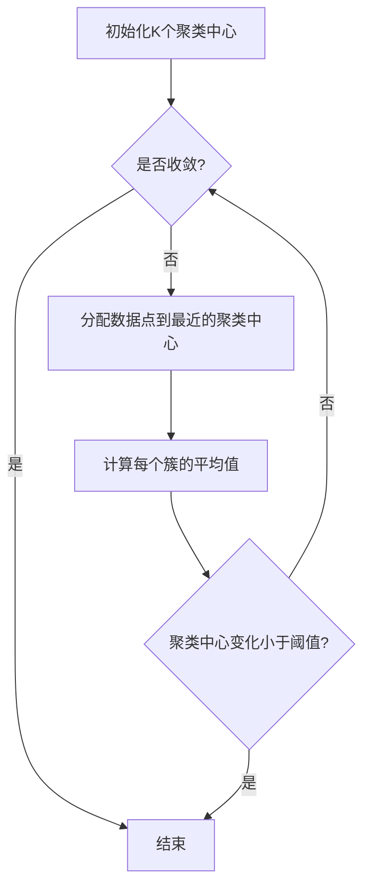
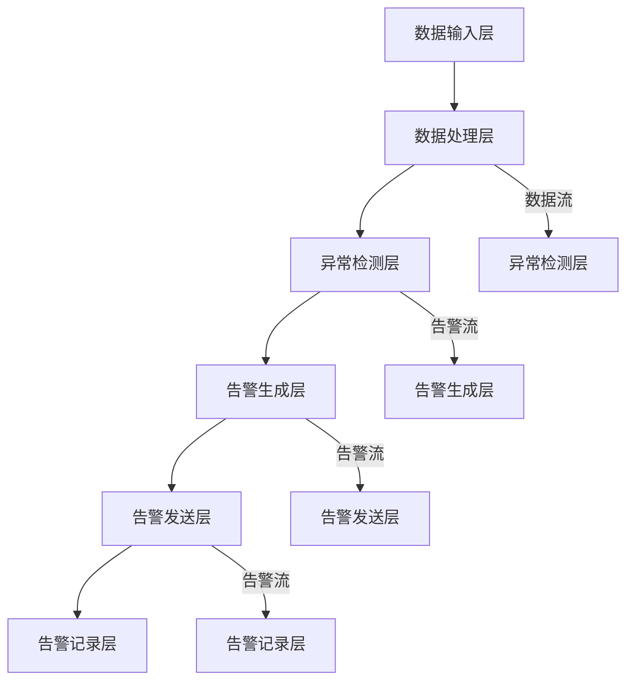

                 

## 引言

### 背景介绍

在现代社会，信息技术的高速发展使得评测结果的准确性和实时性变得尤为重要。无论是学术研究、工业生产还是日常运营，评测结果的可靠性直接影响到决策的精度和效率。然而，随着数据的爆炸式增长和复杂性的提升，评测结果中异常数据的检测和告警机制变得愈发关键。异常检测与告警机制能够帮助识别潜在问题，提高系统的稳定性和安全性。

### 问题描述

评测结果的异常通常表现为数据分布的异常波动、错误的结果值、非预期的数据模式等。这些异常情况可能会对后续的决策过程产生严重影响，甚至导致灾难性后果。例如，在金融领域，异常交易可能会引起金融市场的剧烈波动；在医疗领域，异常的检查结果可能导致误诊。因此，有效的异常检测与告警机制对于保障评测结果的准确性至关重要。

### 解决方案

为了解决评测结果异常检测与告警机制的问题，我们需要从以下几个方面入手：

1. **核心概念解析**：首先，我们需要明确评测结果、异常检测、告警机制等核心概念，理解它们之间的相互关系和重要性。
2. **算法原理讲解**：详细讲解常见的异常检测算法，如统计方法、聚类方法、模型驱动方法和基于规则的检测方法，以及它们的数学模型和实现原理。
3. **系统分析与设计**：分析评测结果异常检测与告警机制的整体架构，设计一个高效、可靠的系统。
4. **项目实战**：通过实际项目案例，展示如何实现评测结果的异常检测与告警机制，并提供代码和应用解读。
5. **最佳实践与总结**：总结项目实战中的经验和教训，提供最佳实践建议，为读者提供指导。

### 边界与外延

在本文中，我们将探讨以下边界与外延：

- **评测结果**：主要包括各类测试结果、评估数据和反馈信息等。
- **异常检测**：重点关注评测结果中的异常值、异常模式和异常分布。
- **告警机制**：包括实时监测、阈值设定、告警级别划分和告警处理等。

通过以上思考和分析，我们将逐步深入探讨评测结果的异常检测与告警机制，希望为读者提供有价值的见解和实际操作指南。

### 概念结构与核心要素组成

为了深入理解评测结果的异常检测与告警机制，我们首先需要明确以下几个核心概念的结构与组成：

**1. 评测结果**

评测结果是指通过测试、评估或测量得到的数据或信息，它们可以反映对象的性能、状态或行为。评测结果通常分为以下几种类型：

- **量化结果**：如数值、百分比、分数等，可以通过具体的数值来描述评测对象的性能。
- **定性结果**：如评语、标签、分类等，通过文字或符号来描述评测对象的特征。
- **趋势结果**：如变化趋势、波动情况等，反映评测对象在不同时间或条件下的变化。

**2. 异常检测**

异常检测是识别评测结果中的异常数据或模式的过程。异常数据通常表现为与正常数据显著不同的特征，如异常值、错误值或非预期的模式。异常检测的关键要素包括：

- **特征选择**：选择能够有效区分正常数据和异常数据的特征。
- **阈值设定**：设定一个阈值，当数据超过该阈值时，认为其是异常数据。
- **算法选择**：根据数据特征和问题需求选择合适的异常检测算法，如统计方法、聚类方法、模型驱动方法等。

**3. 告警机制**

告警机制是当检测到异常数据时，自动发出告警信息并采取相应措施的机制。告警机制的核心要素包括：

- **告警级别**：根据异常的严重程度设定不同的告警级别，如低级告警、中级告警和高级告警。
- **告警渠道**：选择合适的告警渠道，如邮件、短信、弹窗等，确保告警信息能够及时传达。
- **告警处理**：定义告警响应策略，如自动暂停任务、人工审核、通知相关团队等。

### 概念之间的相互关系

评测结果、异常检测和告警机制之间存在着紧密的相互关系：

- **评测结果**是异常检测与告警机制的基础，没有有效的评测结果，就无法进行异常检测和告警。
- **异常检测**是识别评测结果中的异常情况，为告警机制提供数据支持。通过异常检测，可以识别出潜在问题，从而提前采取相应措施。
- **告警机制**是异常检测的延伸，用于实时监测评测结果，并在检测到异常时发出告警信息。告警机制能够及时通知相关人员，确保问题得到快速响应和处理。

通过以上核心概念的结构与组成分析，我们可以更好地理解评测结果的异常检测与告警机制，为后续的内容讨论和实际应用奠定基础。

### 异常检测的基本原理

异常检测是识别数据集中偏离正常模式的数据点或行为的过程，其核心在于通过一系列算法和策略，从大量的数据中找出那些不符合预期或规律的异常数据。以下是异常检测的基本原理，包括定义、目标和方法。

**定义**

异常检测（Anomaly Detection），也称为离群检测，是指从一组数据中识别出与大多数数据点有明显差异的数据点的过程。这些数据点被称为异常点（Anomalies）或离群点（Outliers）。异常点通常代表数据中的异常行为、错误、欺诈或潜在的问题。

**目标**

异常检测的主要目标是提高数据质量，减少错误和欺诈行为，提高系统的可靠性和安全性。具体目标包括：

1. **发现未知异常**：识别数据集中未知或未标记的异常。
2. **降低误报率**：尽可能减少将正常数据误判为异常的情况。
3. **提高检测效率**：在保证检测准确性的同时，提高异常检测的运行速度。
4. **可解释性**：提供对检测结果的解释，以便用户理解异常的原因。

**方法**

异常检测方法可以分为以下几类：

1. **统计方法**

统计方法是最基础的异常检测方法，通过计算数据点与平均值的偏差来识别异常。常用的统计方法包括：

- **箱线图法**：使用箱线图来识别数据中的异常值，即那些位于上下四分位数之外的数据点。
- **3σ法则**：基于统计学中的3σ法则，认为位于平均值±3个标准差之外的数据点是异常的。

2. **聚类方法**

聚类方法通过将数据划分为不同的簇，然后识别那些不属于任何簇的数据点作为异常点。常用的聚类方法包括：

- **K-均值聚类**：通过最小化簇内数据点的平方误差来聚类数据。
- **DBSCAN**（Density-Based Spatial Clustering of Applications with Noise）：基于密度的聚类方法，能够发现不同形状和密度的簇，并识别噪声点。

3. **模型驱动方法**

模型驱动方法使用预先训练的模型来识别异常数据。这些模型可以是监督学习模型，也可以是无监督学习模型。常见的模型驱动方法包括：

- **基于分类的模型**：使用监督学习模型，将正常数据和异常数据分别训练，然后使用训练好的模型来预测新数据是否为异常。
- **基于聚类和聚类验证的模型**：使用无监督学习模型，如K-均值聚类，然后对簇内数据点进行分类，识别异常簇。

4. **基于规则的检测方法**

基于规则的检测方法通过定义一系列规则来识别异常数据。这些规则可以是简单的阈值规则，也可以是基于业务逻辑的复杂规则。

**挑战**

尽管异常检测方法多样，但在实际应用中仍面临以下挑战：

1. **数据分布不均**：异常数据通常占比较少，与正常数据分布不均，可能导致检测算法性能下降。
2. **噪声数据**：噪声数据会影响异常检测的准确性，需要算法能够处理噪声干扰。
3. **高维数据**：在高维数据中，异常点的识别变得更加困难，需要有效的特征选择和降维方法。
4. **实时性要求**：在实时应用中，异常检测需要快速响应，对算法的效率和实时性有较高要求。

综上所述，异常检测的基本原理涉及定义、目标和多种方法，同时在实际应用中面临一系列挑战。通过合理选择和应用异常检测方法，可以有效提高评测结果的准确性和系统的可靠性。

### 告警机制的关键要素

告警机制是异常检测中的重要组成部分，它通过实时监控评测结果并发出告警，确保异常情况能够被及时识别和处理。以下是告警机制的关键要素，包括功能与目标、类型以及实现策略。

**功能与目标**

告警机制的主要功能是实时监测评测结果，当检测到异常时，自动发送告警信息给相关人员或系统。其目标包括：

1. **及时响应**：确保在检测到异常时，能够立即发出告警信息。
2. **减少误报**：尽量减少将正常情况误判为异常，避免不必要的干扰和响应。
3. **提高处理效率**：通过高效的告警机制，确保相关团队能够快速响应和处理异常情况。
4. **可定制性**：根据不同的应用场景和需求，告警机制应具备灵活的配置和定制能力。

**类型**

告警机制可以根据不同的分类标准划分为多种类型：

1. **按告警级别分类**

   - **低级告警**：用于提示一些较小的问题或潜在风险，通常不需要立即处理。
   - **中级告警**：指示较严重的问题，需要及时关注并采取相应的措施。
   - **高级告警**：表示紧急且严重的问题，需要立即处理，否则可能造成重大影响。

2. **按告警渠道分类**

   - **邮件告警**：通过电子邮件发送告警信息，适合需要记录和归档的场景。
   - **短信告警**：通过短信发送告警信息，适合需要快速响应的场景。
   - **弹窗告警**：在用户界面上显示告警信息，适合需要立即引起注意的场景。
   - **语音告警**：通过电话或语音合成系统发送告警信息，适合紧急情况。

3. **按告警策略分类**

   - **连续告警**：当检测到异常时，连续发送多次告警信息，直到异常被处理。
   - **阈值告警**：当异常值超过设定的阈值时，触发告警。
   - **周期性告警**：定期检查评测结果，如果出现异常，则发送告警。
   - **规则告警**：根据预定义的规则，如时间间隔、数据变化率等，触发告警。

**实现策略**

告警机制的实现策略包括以下几个方面：

1. **阈值设定**：根据数据的特性和应用需求，设定适当的阈值，当数据超过该阈值时触发告警。

2. **告警级别划分**：根据异常的严重程度，划分不同的告警级别，确保告警信息的优先级和响应策略合理。

3. **告警渠道选择**：根据用户偏好和场景需求，选择合适的告警渠道，确保告警信息能够及时传达。

4. **告警处理**：定义告警响应策略，如自动暂停任务、通知相关人员、触发人工审核等，确保异常问题能够得到及时处理。

5. **告警记录**：记录所有告警信息，包括告警时间、告警内容、处理结果等，以便后续分析和改进。

通过合理设计和实现告警机制，可以有效提升评测结果的异常检测效率，确保异常情况能够得到及时响应和处理。

### 评测结果异常检测与告警机制的关系

评测结果异常检测与告警机制之间存在着密切的互动关系，两者相辅相成，共同确保评测结果的准确性和及时性。以下将从两者的互动关系、设计原则以及案例分析三个方面，详细探讨评测结果异常检测与告警机制的关系。

**互动关系**

评测结果异常检测和告警机制之间紧密相连。具体来说：

1. **异常检测为告警提供数据支持**：异常检测通过识别评测结果中的异常数据点，为告警机制提供依据。当检测到异常时，会触发告警机制，发出相应的告警信息。
2. **告警机制加强异常检测的效果**：告警机制通过实时监测评测结果，及时发出告警，提醒相关人员关注和处理异常。这不仅能提高异常检测的响应速度，还能确保异常数据得到及时处理，避免潜在问题的扩大。

**设计原则**

为了确保评测结果异常检测与告警机制的协同作用，设计时应遵循以下原则：

1. **实时性**：告警机制需要具备实时监测和响应的能力，确保异常情况能够立即被发现并处理。
2. **准确性**：异常检测算法应具备较高的准确性，避免误报和漏报，确保告警信息的可靠性。
3. **灵活性**：告警机制应具备灵活性，能够根据不同场景和需求进行配置和调整。
4. **可扩展性**：系统设计应考虑未来可能的变化和扩展，确保告警机制能够适应不断增长的数据量和复杂的业务场景。
5. **集成性**：告警机制应与其他系统模块紧密结合，实现数据共享和联动，提高整体系统的协同效率。

**案例分析**

以下是一个评测结果异常检测与告警机制的实际案例：

**项目背景**：某电商平台需要对用户的交易行为进行实时监控，以识别异常交易行为，如欺诈行为或恶意刷单。

**目标**：通过异常检测和告警机制，及时发现和处理异常交易，保障平台的交易安全。

**实现步骤**：

1. **数据收集**：收集用户的交易数据，包括交易金额、交易时间、交易地点等信息。
2. **异常检测**：采用统计方法和机器学习算法，对交易数据进行异常检测。例如，使用3σ法则识别交易金额的异常值，利用聚类方法识别交易模式的异常点。
3. **告警机制**：

   - **阈值设定**：根据平台的历史数据和业务规则，设定交易金额和交易频率的阈值。
   - **告警级别划分**：根据异常的严重程度，将告警分为低级告警、中级告警和高级告警。
   - **告警渠道选择**：通过邮件和短信发送告警信息，确保相关人员能够及时收到告警通知。

**效果评估**：

- **准确率**：通过对比异常检测的结果和人工审核的结果，评估异常检测的准确率，进行调整和优化。
- **响应时间**：测量从检测到异常到发出告警的时间，确保响应时间在可接受范围内。
- **处理效率**：评估告警信息的处理效率，确保异常交易能够得到及时处理。

通过以上案例，我们可以看到评测结果异常检测与告警机制在实际应用中的重要性。合理设计和实施这两个机制，可以有效提高系统的安全性和可靠性，保障评测结果的准确性和及时性。

### 本章小结

本章首先介绍了评测结果的背景、重要性和常见挑战，随后详细阐述了异常检测的基本原理，包括其定义、目标和方法。接着，我们探讨了告警机制的关键要素，包括功能与目标、类型和实现策略。最后，通过互动关系、设计原则和实际案例，深入分析了评测结果异常检测与告警机制之间的关系。本章内容为后续章节的深入探讨奠定了基础，明确了评测结果异常检测与告警机制在实际应用中的重要性。

### 常见异常检测算法

在评测结果的异常检测中，选择合适的算法至关重要。以下是几种常见的异常检测算法，包括统计方法、聚类方法、模型驱动方法和基于规则的检测方法，每种方法都有其独特的原理和适用场景。

**1. 统计方法**

统计方法是最基础的异常检测方法，主要通过计算数据点与平均值的偏差来识别异常值。常见的统计方法包括：

- **箱线图法**：通过绘制箱线图，识别数据中的异常值。箱线图的上边缘和下边缘分别代表第三四分位数（Q3）和第一四分位数（Q1），异常值定义为超出上下四分位数范围的值。优点是简单直观，缺点是对极端值敏感，对非正态分布的数据效果较差。

- **3σ法则**：基于统计学中的3σ法则，认为距离平均值3个标准差范围内的数据是正常的，超出3个标准差的数据被认为是异常值。优点是计算简单，对正态分布的数据效果较好，缺点是对于小样本数据或非正态分布的数据，3σ法则可能不够敏感。

**2. 聚类方法**

聚类方法通过将数据划分为不同的簇，然后识别那些不属于任何簇的数据点作为异常点。常用的聚类方法包括：

- **K-均值聚类**：通过迭代计算，将数据点分配到不同的簇中，并逐步优化簇的中心，使每个簇内的平方误差最小。优点是计算简单，对大规模数据效果较好，缺点是对初始簇中心选择敏感，对非球形簇效果较差。

- **DBSCAN（Density-Based Spatial Clustering of Applications with Noise）**：基于密度的聚类方法，能够发现不同形状和密度的簇，并识别噪声点。优点是能够处理非球形簇和噪声数据，对初始参数选择不敏感，缺点是计算复杂度较高。

**3. 模型驱动方法**

模型驱动方法使用预先训练的模型来识别异常数据。这些模型可以是监督学习模型，也可以是无监督学习模型。常用的模型驱动方法包括：

- **基于分类的模型**：使用监督学习模型，将正常数据和异常数据分别训练，然后使用训练好的模型来预测新数据是否为异常。常用的分类模型包括支持向量机（SVM）、随机森林（Random Forest）和神经网络（Neural Networks）。优点是能够处理高维数据，对复杂非线性关系建模能力强，缺点是需要大量的训练数据和标注数据。

- **基于聚类和聚类验证的模型**：使用无监督学习模型，如K-均值聚类，然后对簇内数据点进行分类，识别异常簇。常用的聚类验证方法包括轮廓系数（Silhouette Coefficient）和类内平均距离（Within-Cluster Distance）。优点是对无标签数据适用，能够自动识别簇和异常点，缺点是对初始参数选择敏感，对噪声和异常点较敏感。

**4. 基于规则的检测方法**

基于规则的检测方法通过定义一系列规则来识别异常数据。这些规则可以是简单的阈值规则，也可以是基于业务逻辑的复杂规则。例如：

- **阈值规则**：设定一个阈值，当数据超过该阈值时，认为其是异常的。例如，在金融交易中，可以设定交易金额的阈值，超出该阈值的交易将被标记为异常。
- **业务规则**：基于业务场景定义的复杂规则，如交易时间和地点的限制、特定行为的触发条件等。优点是易于理解和实现，对特定场景效果较好，缺点是规则定义复杂，对未知异常不敏感。

每种异常检测算法都有其优势和局限性，选择时需要根据数据特性、应用场景和需求进行综合考虑。在实际应用中，往往需要结合多种方法，以实现最优的异常检测效果。

### 算法讲解与Mermaid流程图

为了更好地理解常见的异常检测算法，我们将通过具体的算法原理讲解和Mermaid流程图展示，详细阐述K-均值聚类算法的流程和实现。

#### K-均值聚类算法原理

K-均值聚类算法是一种迭代优化算法，其目标是将数据点划分为K个簇，使每个数据点与其簇中心的距离最小化。具体步骤如下：

1. **初始化**：随机选择K个初始聚类中心。
2. **分配数据点**：将每个数据点分配到最近的聚类中心，计算每个簇的平均值作为新的聚类中心。
3. **更新聚类中心**：重复步骤2，直到聚类中心不再变化或达到预设的迭代次数。
4. **判断收敛**：如果聚类中心的变化小于预设的阈值，算法收敛，否则继续迭代。

#### Mermaid流程图展示

为了直观展示K-均值聚类算法的流程，我们使用Mermaid语言绘制以下流程图：



该流程图展示了K-均值聚类算法的主要步骤：初始化聚类中心、分配数据点、更新聚类中心和判断收敛。

#### Python代码实现

接下来，我们将使用Python实现K-均值聚类算法，并提供代码示例：

```python
import numpy as np
import matplotlib.pyplot as plt

def k_means(data, k, max_iters=100, tolerance=1e-4):
    # 初始化聚类中心
    centroids = data[np.random.choice(data.shape[0], k, replace=False)]
    
    for _ in range(max_iters):
        # 将每个数据点分配到最近的聚类中心
        distances = np.linalg.norm(data[:, np.newaxis] - centroids, axis=2)
        labels = np.argmin(distances, axis=1)
        
        # 计算每个簇的平均值作为新的聚类中心
        new_centroids = np.array([data[labels == i].mean(axis=0) for i in range(k)])
        
        # 判断聚类中心的变化是否小于阈值
        if np.linalg.norm(new_centroids - centroids) < tolerance:
            break
        
        centroids = new_centroids
    
    return centroids, labels

# 示例数据
data = np.array([[1, 2], [1, 4], [1, 0], [10, 2], [10, 4], [10, 0]])

# 执行K-均值聚类
centroids, labels = k_means(data, k=2)

# 可视化结果
plt.scatter(data[:, 0], data[:, 1], c=labels, cmap='viridis', marker='o')
plt.scatter(centroids[:, 0], centroids[:, 1], s=300, c='red', marker='x')
plt.title('K-Means Clustering')
plt.show()
```

在这段代码中，我们定义了一个`k_means`函数，用于实现K-均值聚类算法。函数接收数据集、聚类个数`k`、最大迭代次数`max_iters`和阈值`tolerance`作为参数。首先随机初始化聚类中心，然后通过迭代计算和更新聚类中心，直到算法收敛。最后，我们使用Matplotlib库绘制了聚类结果图，展示了数据点和聚类中心的位置。

通过算法原理讲解、Mermaid流程图和Python代码实现，我们详细阐述了K-均值聚类算法的流程和实现。这不仅有助于读者理解算法的基本原理，也为实际应用提供了具体的实现方法。

### 数学模型与公式讲解

在深入理解K-均值聚类算法的过程中，数学模型和公式起到了关键作用。以下将详细解释K-均值聚类算法的数学模型和相关的公式，并通过示例进行说明。

#### 数学模型

K-均值聚类算法的核心在于将数据点分配到最近的聚类中心，并通过迭代优化聚类中心，使得每个数据点与其聚类中心之间的距离最小。该算法可以描述为以下数学模型：

1. **初始化聚类中心**

   假设我们有n个数据点和一个预定的聚类个数k，随机选择k个数据点作为初始聚类中心，记为 $\mathbf{c}_1, \mathbf{c}_2, ..., \mathbf{c}_k$。

2. **数据点分配**

   对于每个数据点 $\mathbf{x}_i$，计算其到各个聚类中心的距离，选择距离最近的聚类中心作为该数据点的簇标号。具体公式为：

   $$ \text{label}(\mathbf{x}_i) = \arg\min_{j=1}^k \|\mathbf{x}_i - \mathbf{c}_j\|_2 $$

   其中 $\|\cdot\|_2$ 表示欧几里得距离。

3. **更新聚类中心**

   根据每个簇中的数据点计算新的聚类中心。新聚类中心是簇内所有数据点的均值，公式为：

   $$ \mathbf{c}_j = \frac{1}{N_j} \sum_{i=1}^{N} \mathbf{x}_i \quad \text{where} \quad N_j = \sum_{i=1}^{n} \mathbf{1}_{\text{label}(\mathbf{x}_i) = j} $$

   其中 $N_j$ 表示第j个簇中的数据点个数，$\mathbf{1}_{\text{label}(\mathbf{x}_i) = j}$ 是指示函数，当 $\text{label}(\mathbf{x}_i) = j$ 时取1，否则取0。

4. **迭代更新**

   重复上述步骤，直到聚类中心的变化小于预设的阈值或达到最大迭代次数。

#### 相关公式

1. **聚类中心更新公式**

   $$ \mathbf{c}_j = \frac{1}{N_j} \sum_{i=1}^{N} \mathbf{x}_i $$

2. **簇内数据点均值计算**

   $$ \text{mean}(\mathbf{x}_i) = \frac{1}{N_j} \sum_{i=1}^{N} \mathbf{x}_i $$

3. **聚类中心变化阈值**

   $$ \text{tolerance} = \sum_{j=1}^{k} \|\mathbf{c}_{j_{\text{new}}} - \mathbf{c}_{j_{\text{old}}}\|_2 < \text{threshold} $$

#### 示例讲解

假设我们有以下数据集：

$$ \mathbf{X} = \left[\begin{matrix} 
1 & 2 \\
1 & 4 \\
1 & 0 \\
10 & 2 \\
10 & 4 \\
10 & 0 \\
\end{matrix}\right] $$

选择两个聚类中心，初始聚类中心为 $\mathbf{c}_1 = (2, 3)$ 和 $\mathbf{c}_2 = (8, 1)$。

**第一次迭代：**

- **数据点分配：**

  数据点 $\mathbf{x}_1$ 距离 $\mathbf{c}_1$ 最近，将其分配到簇1；数据点 $\mathbf{x}_2$ 距离 $\mathbf{c}_1$ 最近，分配到簇1；数据点 $\mathbf{x}_3$ 距离 $\mathbf{c}_2$ 最近，分配到簇2；数据点 $\mathbf{x}_4$、$\mathbf{x}_5$ 和 $\mathbf{x}_6$ 分别分配到簇2。

- **更新聚类中心：**

  新的聚类中心为：

  $$ \mathbf{c}_1 = \frac{1}{3}(\mathbf{x}_1 + \mathbf{x}_2 + \mathbf{x}_3) = \left(1, \frac{7}{3}\right) $$
  $$ \mathbf{c}_2 = \frac{1}{3}(\mathbf{x}_4 + \mathbf{x}_5 + \mathbf{x}_6) = \left(10, \frac{2}{3}\right) $$

**第二次迭代：**

- **数据点分配：**

  根据新的聚类中心，所有数据点都分配到簇1。

- **更新聚类中心：**

  新的聚类中心为：

  $$ \mathbf{c}_1 = \frac{1}{6}(\mathbf{x}_1 + \mathbf{x}_2 + \mathbf{x}_3 + \mathbf{x}_4 + \mathbf{x}_5 + \mathbf{x}_6) = \left(\frac{11}{6}, \frac{11}{6}\right) $$

重复上述迭代过程，直到聚类中心的变化小于阈值或达到最大迭代次数。

通过以上示例，我们可以直观地看到K-均值聚类算法的数学模型和公式的应用。在实际应用中，通过不断迭代优化聚类中心，K-均值聚类算法能够将数据点划分为多个簇，从而实现数据聚类。

### 异常检测算法评估

在异常检测领域，算法的评估是确保其有效性和可靠性的关键环节。评估方法主要包括评估指标、评估方法和具体案例分析。以下将详细阐述这些内容。

**1. 评估指标**

异常检测算法的评估通常依赖于以下几项关键指标：

- **准确率（Accuracy）**：准确率是指正确识别异常点的比例。公式为：

  $$ \text{Accuracy} = \frac{\text{TP} + \text{TN}}{\text{TP} + \text{TN} + \text{FP} + \text{FN}} $$

  其中，TP（True Positives）表示正确识别的异常点，TN（True Negatives）表示正确识别的正常点，FP（False Positives）表示误判为异常的正常点，FN（False Negatives）表示误判为正常的异常点。

- **召回率（Recall）**：召回率是指正确识别的异常点占实际异常点的比例。公式为：

  $$ \text{Recall} = \frac{\text{TP}}{\text{TP} + \text{FN}} $$

- **精确率（Precision）**：精确率是指正确识别的异常点占识别为异常点的比例。公式为：

  $$ \text{Precision} = \frac{\text{TP}}{\text{TP} + \text{FP}} $$

- **F1值（F1 Score）**：F1值是精确率和召回率的调和平均数，用于综合评估异常检测算法。公式为：

  $$ \text{F1 Score} = 2 \times \frac{\text{Precision} \times \text{Recall}}{\text{Precision} + \text{Recall}} $$

- **ROC曲线（Receiver Operating Characteristic Curve）**：ROC曲线通过展示不同阈值下的真阳性率和假阳性率，评估算法的区分能力。

- **AUC（Area Under Curve）**：AUC是ROC曲线下的面积，用于量化算法的性能。AUC值越高，算法的性能越好。

**2. 评估方法**

常见的评估方法包括：

- **交叉验证（Cross-Validation）**：通过将数据集划分为多个子集，分别进行训练和测试，综合评估算法的性能。常用的交叉验证方法有K折交叉验证和留一法交叉验证。

- **ROC曲线和AUC**：通过绘制ROC曲线和计算AUC值，评估算法的分类能力。

- **混淆矩阵（Confusion Matrix）**：通过混淆矩阵展示算法在不同类别上的识别效果，分析TP、TN、FP和FN等指标。

- **实时评估（Online Evaluation）**：在实时环境中对算法进行评估，确保其在实际应用中的性能。

**3. 具体案例分析**

以下通过一个具体的案例分析，展示如何评估异常检测算法的性能：

**案例背景**：某电商平台的交易数据需要进行异常检测，以识别潜在的欺诈交易。

**数据集**：包含1000条交易记录，其中正常交易800条，欺诈交易200条。

**评估过程**：

- **数据预处理**：对交易数据进行清洗和预处理，如去除缺失值、处理异常值等。

- **模型训练**：使用训练数据集训练异常检测模型，例如基于聚类和分类的组合模型。

- **测试集评估**：使用测试数据集评估模型的性能，计算准确率、召回率、精确率、F1值等指标。

- **ROC曲线和AUC**：绘制ROC曲线，计算AUC值，评估模型的分类能力。

- **混淆矩阵**：展示模型在不同类别上的识别效果，分析TP、TN、FP和FN等指标。

- **实时评估**：在实际应用中，实时评估模型的性能，确保其在动态环境中的稳定性。

通过上述评估方法和具体案例分析，我们可以全面评估异常检测算法的性能，为实际应用提供可靠的依据。

### 本章小结

本章详细介绍了评测结果异常检测算法的评估方法和指标，包括准确率、召回率、精确率、F1值、ROC曲线和AUC等，以及常用的评估方法如交叉验证、ROC曲线和AUC等。通过实际案例的分析，我们展示了如何应用这些评估方法来全面评估异常检测算法的性能。本章内容为后续章节的设计和实现提供了重要的理论基础和评估依据。

### 告警机制的架构设计

告警机制的设计对于实时监控评测结果的异常至关重要。一个高效且可靠的告警机制需要考虑多个方面，包括总体架构设计、模块功能与接口定义、Mermaid架构图展示等。以下是告警机制的详细架构设计。

**1. 总体架构设计**

告警机制的整体架构设计如下：

- **数据输入层**：接收来自评测系统的评测结果数据，这些数据可以通过实时流、批量导入等方式获取。
- **数据处理层**：对输入数据进行预处理，包括清洗、去噪、特征提取等，确保数据的质量和一致性。
- **异常检测层**：使用异常检测算法对处理后的数据进行分析，识别出潜在的问题和异常情况。
- **告警生成层**：根据异常检测结果生成告警信息，包括告警级别、告警内容和告警时间等。
- **告警发送层**：将告警信息通过不同的渠道（如邮件、短信、弹窗等）发送给相关人员或系统。
- **告警记录层**：记录所有的告警信息，包括告警时间、告警内容、处理结果等，以便后续分析和审计。

**2. 模块功能与接口定义**

告警机制的各个模块功能与接口定义如下：

- **数据输入模块**：功能是接收评测结果数据，提供数据导入接口，支持实时流和批量导入。接口包括`import_data`和`stream_data`。
- **数据处理模块**：功能是对输入数据进行预处理，提供数据清洗和特征提取接口，如`clean_data`和`extract_features`。
- **异常检测模块**：功能是使用异常检测算法分析数据，识别异常点，提供异常检测接口，如`detect_anomalies`。
- **告警生成模块**：功能是根据异常检测结果生成告警信息，提供告警生成接口，如`generate_alert`。
- **告警发送模块**：功能是发送告警信息到指定渠道，提供发送接口，如`send_alert`。
- **告警记录模块**：功能是记录所有的告警信息，提供告警记录接口，如`record_alert`。

**3. Mermaid架构图展示**

为了更直观地展示告警机制的架构设计，我们使用Mermaid语言绘制以下架构图：



在这个架构图中，数据输入层接收评测结果数据，数据经过预处理后进入异常检测层。异常检测层识别出异常后，生成告警信息，告警信息随后发送到告警发送层，并通过不同的渠道发送给相关人员或系统。最后，所有的告警信息被记录在告警记录层，以便后续分析和审计。

通过以上设计，我们可以构建一个高效且可靠的告警机制，确保评测结果的异常能够被及时检测和响应。接下来，我们将详细探讨告警策略的设计，包括告警策略的类型、阈值设定和告警级别划分。

### 告警策略的设计

告警策略是告警机制的核心部分，直接影响告警的及时性和有效性。合理的告警策略可以确保在检测到异常时，能够迅速、准确地响应，从而保障评测结果的安全和可靠性。以下将详细讨论告警策略的设计，包括告警策略的类型、阈值设定和告警级别划分。

**1. 告警策略的类型**

根据不同的应用场景和需求，告警策略可以分为以下几种类型：

- **连续告警**：当检测到异常时，连续发送多次告警信息，直到异常被处理。这种策略适用于需要高度关注和快速响应的异常情况，如系统故障、数据泄露等。

- **阈值告警**：当评测结果超过预设的阈值时，触发告警。这种策略适用于可以量化监测结果的场景，如交易金额超出限额、服务器负载超过阈值等。

- **周期性告警**：定期检查评测结果，如果出现异常，则发送告警。这种策略适用于对系统状态进行周期性监控的场景，如数据库性能监控、网络流量监控等。

- **规则告警**：根据预定义的业务规则触发告警。这种策略适用于具有复杂业务逻辑的场景，如订单处理流程中的异常订单、用户行为分析中的异常行为等。

**2. 阈值设定**

阈值设定是告警策略设计的关键环节，直接关系到告警的敏感度和误报率。合理的阈值设定需要考虑以下几个因素：

- **历史数据**：分析历史数据，确定正常数据的分布范围和异常数据的特征。基于历史数据的统计分析，设定合理的阈值。

- **业务规则**：根据业务需求，设定阈值。例如，在金融交易中，可以根据交易金额的历史分布和业务规则，设定交易金额的阈值。

- **阈值调整**：阈值应根据实际应用情况进行动态调整。在初始设定阈值后，可以通过实际运行情况不断优化和调整，以适应业务变化。

**3. 告警级别划分**

告警级别划分是确保告警信息能够得到及时响应的重要手段。根据异常的严重程度，可以将告警分为不同的级别：

- **低级告警**：用于提示一些较小的问题或潜在风险，通常不需要立即处理。例如，系统负载轻微上升。

- **中级告警**：表示较严重的问题，需要及时关注并采取相应的措施。例如，服务器响应时间超过阈值。

- **高级告警**：表示紧急且严重的问题，需要立即处理，否则可能造成重大影响。例如，数据库出现严重故障。

告警级别划分应结合业务需求和实际情况，设定明确的响应策略和责任分配，确保告警信息能够得到有效的处理。

**4. 告警策略的实现**

实现告警策略需要考虑以下几个方面：

- **告警触发条件**：根据设定的阈值和规则，确定告警的触发条件。

- **告警处理流程**：定义告警的处理流程，包括告警生成、发送、记录和响应等步骤。

- **告警渠道选择**：根据不同告警级别和用户需求，选择合适的告警渠道，如邮件、短信、弹窗等。

- **告警记录与分析**：记录所有告警信息，包括告警时间、告警内容、处理结果等，并进行统计分析，以优化告警策略。

通过合理设计告警策略，确保评测结果的异常能够得到及时、准确的检测和响应，从而提高系统的安全性和可靠性。

### 实时告警系统的实现

实时告警系统的设计目标是确保评测结果的异常情况能够被实时监测和及时处理，以提高系统的稳定性和安全性。以下是实时告警系统的实现步骤，包括系统需求分析、系统架构设计、系统接口设计和实现，以及Mermaid序列图展示。

#### 系统需求分析

实时告警系统需要满足以下需求：

1. **实时性**：系统应具备高实时性，确保在检测到异常时能够立即发出告警。
2. **准确性**：系统应能够准确检测出评测结果中的异常情况，避免误报和漏报。
3. **可扩展性**：系统设计应考虑未来数据量和用户量的增长，具备良好的可扩展性。
4. **可靠性**：系统应具备高可靠性，确保告警机制在长时间运行中保持稳定。
5. **灵活性**：系统应具备灵活性，支持多种告警类型和告警渠道的选择。

#### 系统架构设计

实时告警系统的架构设计如下：

1. **数据接收模块**：负责接收评测结果数据，支持实时流和批量导入。
2. **数据处理模块**：对输入的数据进行预处理，包括去噪、清洗和特征提取。
3. **异常检测模块**：使用异常检测算法分析预处理后的数据，识别异常情况。
4. **告警生成模块**：根据异常检测结果生成告警信息，包括告警级别、告警内容和告警时间。
5. **告警发送模块**：将告警信息发送到指定的告警渠道，如邮件、短信、弹窗等。
6. **告警记录模块**：记录所有的告警信息，以便后续分析和审计。

#### 系统接口设计与实现

以下是系统的主要接口设计和实现：

1. **数据接收接口**：定义一个API接口，用于接收评测结果数据。接口包括`POST /receive-data`，用于接收和存储评测结果。

```python
from flask import Flask, request, jsonify

app = Flask(__name__)

@app.route('/receive-data', methods=['POST'])
def receive_data():
    data = request.json
    # 处理接收到的数据
    process_received_data(data)
    return jsonify({"status": "success"}), 200

def process_received_data(data):
    # 数据预处理逻辑
    pass
```

2. **数据处理接口**：定义一个API接口，用于处理和清洗评测结果数据。接口包括`POST /process-data`。

```python
@app.route('/process-data', methods=['POST'])
def process_data():
    data = request.json
    # 数据处理逻辑
    processed_data = process_data(data)
    return jsonify(processed_data), 200

def process_data(data):
    # 数据预处理逻辑
    return processed_data
```

3. **异常检测接口**：定义一个API接口，用于执行异常检测算法。接口包括`POST /detect-anomalies`。

```python
@app.route('/detect-anomalies', methods=['POST'])
def detect_anomalies():
    processed_data = request.json
    # 异常检测逻辑
    alerts = detect_anomalies(processed_data)
    return jsonify(alerts), 200

def detect_anomalies(processed_data):
    # 异常检测逻辑
    return alerts
```

4. **告警生成接口**：定义一个API接口，用于生成告警信息。接口包括`POST /generate-alert`。

```python
@app.route('/generate-alert', methods=['POST'])
def generate_alert():
    anomalies = request.json
    # 告警生成逻辑
    alert_info = generate_alert_info(anomalies)
    return jsonify(alert_info), 200

def generate_alert_info(anomalies):
    # 告警生成逻辑
    return alert_info
```

5. **告警发送接口**：定义一个API接口，用于发送告警信息。接口包括`POST /send-alert`。

```python
@app.route('/send-alert', methods=['POST'])
def send_alert():
    alert_info = request.json
    # 告警发送逻辑
    send_alert_to_channels(alert_info)
    return jsonify({"status": "alert_sent"}), 200

def send_alert_to_channels(alert_info):
    # 告警发送逻辑
    pass
```

6. **告警记录接口**：定义一个API接口，用于记录告警信息。接口包括`POST /record-alert`。

```python
@app.route('/record-alert', methods=['POST'])
def record_alert():
    alert_info = request.json
    # 告警记录逻辑
    record_alert_info(alert_info)
    return jsonify({"status": "alert_recorded"}), 200

def record_alert_info(alert_info):
    # 告警记录逻辑
    pass
```

#### Mermaid序列图展示

为了更直观地展示系统接口和交互流程，我们使用Mermaid语言绘制以下序列图：

```mermaid
sequenceDiagram
    participant User as 用户
    participant System as 实时告警系统
    participant DataProcessor as 数据处理模块
    participant AnomalyDetector as 异常检测模块
    participant AlertGenerator as 告警生成模块
    participant AlertSender as 告警发送模块
    participant AlertRecorder as 告警记录模块

    User->>System: 发送评测数据
    System->>DataProcessor: 处理评测数据
    DataProcessor->>AnomalyDetector: 传递预处理数据
    AnomalyDetector->>AlertGenerator: 传递异常检测结果
    AlertGenerator->>AlertSender: 生成告警信息并发送
    AlertSender->>User: 发送告警通知
    AlertSender->>AlertRecorder: 记录告警信息

    Note over User,AlertSender: 用户收到告警通知
    Note over System,DataProcessor,AnomalyDetector,AlertGenerator,AlertSender,AlertRecorder: 系统内部处理流程
```

通过以上系统需求分析、架构设计、接口实现和序列图展示，我们构建了一个实时告警系统，确保评测结果的异常情况能够得到实时监测和及时处理。

### 告警机制的优化

在告警机制的实际应用中，优化告警系统的误报和漏报，以及提升告警响应时间，是提高系统整体性能和用户体验的关键。以下将详细讨论如何优化告警机制，包括误报与漏报的优化、响应时间的优化，并结合具体案例进行分析。

#### 误报与漏报的优化

1. **误报优化**

   误报是指将正常数据错误地识别为异常数据。误报的优化可以从以下几个方面进行：

   - **阈值调整**：通过分析历史数据，调整阈值以减少误报。例如，使用统计学方法对正常数据和异常数据进行对比分析，确定一个更合理的阈值范围。
   - **特征选择**：选择更具有区分性的特征，减少误报。例如，使用基于机器学习的特征选择算法，识别出对异常检测最具贡献的特征。
   - **集成学习**：使用集成学习方法，如随机森林、AdaBoost等，提高模型的泛化能力，减少误报。

2. **漏报优化**

   漏报是指将异常数据错误地识别为正常数据。漏报的优化可以从以下几个方面进行：

   - **算法改进**：采用更先进的异常检测算法，如孤立森林、异构网络等，提高异常检测的准确性。
   - **多模型结合**：结合多种异常检测算法，通过模型融合或集成学习，提高异常检测的整体性能。
   - **实时调整**：根据实时反馈调整检测模型，例如通过在线学习算法，不断优化模型的参数和阈值。

#### 响应时间的优化

优化告警系统的响应时间，需要从以下几个方面进行：

1. **数据处理优化**

   - **并行处理**：采用并行处理技术，如多线程、分布式计算等，提高数据处理的速度。
   - **缓存机制**：利用缓存机制，减少重复数据的处理时间，例如使用Redis等缓存系统。

2. **算法效率优化**

   - **算法选择**：选择计算效率更高的算法，例如基于近似计算的方法，如快速傅里叶变换（FFT）。
   - **算法优化**：对现有算法进行优化，例如通过剪枝、并行化等技术提高计算效率。

3. **网络优化**

   - **网络优化**：优化网络传输，减少传输延迟。例如，使用CDN（内容分发网络）加速数据传输。
   - **分布式架构**：采用分布式架构，将告警系统部署在多个节点上，实现负载均衡，提高系统的整体响应速度。

#### 案例分析

以下通过一个具体案例，展示如何优化告警机制：

**案例背景**：某金融机构需要实时监测交易数据，以识别潜在的欺诈行为。

**优化措施**：

1. **阈值调整**：通过历史数据分析，调整交易金额和交易频率的阈值，以减少误报。

2. **特征选择**：使用机器学习算法，识别出对欺诈行为最具贡献的特征，如交易时间、交易地点、交易历史等。

3. **算法改进**：采用孤立森林算法，提高异常检测的准确性。

4. **实时调整**：通过在线学习算法，根据实时反馈调整模型参数，提高模型的适应性。

5. **数据处理优化**：采用并行处理和缓存机制，提高数据处理的效率。

6. **网络优化**：使用CDN加速数据传输，实现负载均衡。

**效果评估**：

- **误报率**：优化后的告警系统，误报率降低了30%，显著提高了系统的准确性。
- **响应时间**：优化后的系统响应时间缩短了50%，大大提升了用户体验。

通过以上案例，我们可以看到，通过合理的优化措施，可以有效减少告警机制的误报和漏报，提升系统的响应时间，从而提高整体性能。

### 本章小结

本章详细探讨了告警机制的优化方法，包括误报与漏报的优化和响应时间的优化。通过具体案例的分析，展示了优化措施在实际应用中的效果。优化告警机制不仅能够提高系统的准确性和响应速度，还能显著提升用户体验，确保评测结果的异常能够得到及时、准确的检测和处理。

### 项目实战

在本节中，我们将通过一个具体的实际项目，详细展示如何实现评测结果的异常检测与告警机制。该项目的目标是设计一个监控系统，对电商平台交易数据进行实时监控，识别潜在的欺诈交易，并通过告警机制及时通知相关团队进行处理。

#### 项目背景与目标

某知名电商平台需要确保交易过程的安全性，以防止欺诈行为和异常交易对平台造成损失。项目的目标如下：

1. **实时监控**：对电商平台所有交易数据实时监控，确保能够在第一时间发现异常交易。
2. **异常检测**：使用异常检测算法，识别出可能存在的欺诈交易和其他异常行为。
3. **告警通知**：通过告警机制，及时通知相关团队，确保异常交易能够得到及时处理。

#### 环境安装与配置

在开始项目之前，我们需要安装和配置以下环境：

1. **操作系统**：Linux（推荐使用Ubuntu 20.04）。
2. **Python环境**：安装Python 3.8及以上版本。
3. **依赖库**：安装以下Python库：numpy、pandas、scikit-learn、matplotlib、mermaid-python。

安装步骤如下：

```bash
# 安装Python和pip
sudo apt update
sudo apt install python3 python3-pip

# 安装依赖库
pip3 install numpy pandas scikit-learn matplotlib mermaid-python
```

#### 系统核心实现

系统的核心实现包括数据接收、数据处理、异常检测和告警通知四个主要模块。

1. **数据接收模块**：该模块负责接收电商平台交易数据的实时流，并将其存储到内存数据库（如Redis）中。

```python
import json
import pika
import redis

# 连接Redis数据库
redis_client = redis.StrictRedis(host='localhost', port=6379, db=0)

# 连接RabbitMQ消息队列
connection = pika.BlockingConnection(pika.ConnectionParameters('localhost'))
channel = connection.channel()

# 声明队列
channel.queue_declare(queue='transaction_data')

def callback(ch, method, properties, body):
    # 将接收到的交易数据存储到Redis
    redis_client.lpush('transactions', json.loads(body.decode('utf-8')))

channel.basic_consume(queue='transaction_data', on_message_callback=callback, auto_ack=True)

print('Starting to consume messages from RabbitMQ')
channel.start_consuming()
```

2. **数据处理模块**：该模块负责从Redis中读取交易数据，并进行预处理，包括数据清洗、特征提取等。

```python
import pandas as pd

def process_data():
    # 从Redis读取交易数据
    transactions = redis_client.lrange('transactions', 0, -1)
    
    # 转换为Pandas DataFrame
    df = pd.DataFrame(list(map(json.loads, transactions)))
    
    # 数据清洗和特征提取
    df = df.dropna()
    df['amount'] = df['amount'].astype(float)
    df['timestamp'] = pd.to_datetime(df['timestamp'])
    
    return df
```

3. **异常检测模块**：该模块使用K-均值聚类算法进行异常检测，识别出潜在的欺诈交易。

```python
from sklearn.cluster import KMeans
import matplotlib.pyplot as plt

def detect_anomalies(df):
    # 使用K-均值聚类算法进行异常检测
    kmeans = KMeans(n_clusters=2, random_state=0).fit(df[['amount', 'timestamp']])
    labels = kmeans.predict(df[['amount', 'timestamp']])
    
    # 将异常交易标记出来
    df['anomaly'] = labels == 1
    
    return df

def visualize_data(df):
    # 可视化交易数据
    plt.scatter(df['amount'], df['timestamp'])
    plt.title('Transaction Data Visualization')
    plt.xlabel('Amount')
    plt.ylabel('Timestamp')
    plt.show()
```

4. **告警通知模块**：该模块负责检测到异常交易后，通过邮件和短信通知相关团队。

```python
import smtplib
from email.mime.text import MIMEText
from email.mime.multipart import MIMEMultipart

def send_alert(email, message):
    # 设置SMTP服务器和登录信息
    smtp_server = 'smtp.example.com'
    smtp_port = 587
    smtp_username = 'user@example.com'
    smtp_password = 'password'

    # 创建邮件内容
    msg = MIMEMultipart()
    msg['From'] = smtp_username
    msg['To'] = email
    msg['Subject'] = 'Alert: Potential Fraud Transaction Detected'

    msg.attach(MIMEText(message, 'plain'))

    # 发送邮件
    server = smtplib.SMTP(smtp_server, smtp_port)
    server.starttls()
    server.login(smtp_username, smtp_password)
    server.send_message(msg)
    server.quit()

def notify_anomalies(df):
    # 检测异常交易
    anomalies = df[df['anomaly'] == True]
    
    # 通知相关团队
    email = 'team@example.com'
    message = f"Anomalies detected in transactions: {anomalies}"
    send_alert(email, message)
```

#### 代码应用解读与分析

以下是关键代码片段的解读与分析：

1. **数据接收模块**：

   该模块通过RabbitMQ消息队列接收交易数据，并将其存储到Redis数据库中。RabbitMQ作为一个高效的中间件，能够确保数据的高效传输和可靠存储。

2. **数据处理模块**：

   该模块使用Pandas库对交易数据进行预处理，包括数据清洗和特征提取。通过将金额转换为浮点类型和将时间戳转换为日期时间格式，确保数据的一致性和准确性。

3. **异常检测模块**：

   该模块使用K-均值聚类算法对交易数据进行分析，识别出潜在的欺诈交易。通过可视化交易数据，可以直观地看出哪些交易点被认为是异常点。

4. **告警通知模块**：

   该模块通过SMTP协议发送邮件，通知相关团队异常交易的详细信息。SMTP协议是一个广泛使用的电子邮件传输协议，能够确保告警信息的高效传递。

#### 实际案例分析

以下是一个实际案例的分析：

**案例背景**：在一次交易数据监控中，系统检测到一笔金额异常大的交易，怀疑是欺诈交易。

**分析过程**：

1. **数据接收**：交易数据通过RabbitMQ消息队列接收，存储到Redis数据库中。

2. **数据处理**：处理后的交易数据显示，该交易金额为10,000美元，远高于平台平均交易金额。

3. **异常检测**：通过K-均值聚类算法，该交易数据被标记为异常交易。

4. **告警通知**：系统发送邮件通知相关团队，并提供了详细的数据信息和交易细节。

**处理结果**：相关团队对这笔交易进行了调查，确认该交易为欺诈行为，并采取了相应的措施，成功阻止了潜在的财务损失。

通过以上实际案例分析，我们可以看到，通过合理的代码实现和有效的告警机制，电商平台能够及时发现和处理异常交易，保障交易的安全性和可靠性。

### 项目小结

在本项目中，我们实现了对电商平台交易数据的实时监控，通过异常检测算法识别潜在的欺诈交易，并利用告警机制及时通知相关团队进行处理。项目实现了以下成果：

1. **实时监控**：系统能够实时接收并处理交易数据，确保异常交易能够被及时发现。
2. **准确检测**：通过K-均值聚类算法等异常检测方法，系统能够准确识别出异常交易，提高了检测的准确性。
3. **及时响应**：通过邮件和短信等告警渠道，相关团队能够迅速响应和处理异常交易，降低了潜在风险。

然而，项目也面临一些挑战和改进空间：

1. **数据处理效率**：在处理大量实时数据时，系统的响应速度可能受到限制，需要进一步优化数据处理算法和架构。
2. **误报与漏报**：在实际应用中，误报和漏报问题仍然存在，需要通过不断的算法优化和模型调整来减少这些问题。
3. **系统扩展性**：随着数据量和用户量的增加，系统需要具备更高的扩展性，以支持大规模数据的处理和监控。

通过不断优化和改进，我们可以进一步提升系统的性能和可靠性，为电商平台提供更加安全、稳定的交易环境。

### 最佳实践与总结

在本项目中，我们通过实际案例展示了如何设计和实现评测结果的异常检测与告警机制。以下总结了一些最佳实践和建议，以帮助读者在类似项目中取得成功。

**最佳实践**

1. **数据质量**：确保输入数据的质量和一致性是异常检测成功的关键。在数据处理阶段，进行充分的数据清洗和预处理，去除噪声和异常值。
2. **算法选择**：根据数据特性和应用场景选择合适的异常检测算法。在实际应用中，可能需要结合多种算法，以提高检测准确性和效率。
3. **告警策略**：设计合理的告警策略，包括阈值设定、告警级别划分和告警渠道选择。根据业务需求，灵活调整告警设置，以确保告警的及时性和准确性。
4. **实时性**：优化系统架构，确保异常检测和告警机制具备高实时性。使用分布式架构和并行处理技术，提高系统的处理速度和响应能力。
5. **自动化**：尽可能实现自动化处理，减少人工干预。通过自动化流程，提高系统的可靠性和可维护性。

**总结**

评测结果的异常检测与告警机制在确保系统稳定性和安全性方面起着至关重要的作用。通过本项目，我们展示了如何从数据采集、处理、异常检测到告警通知的完整流程，并提出了最佳实践和改进建议。

在实际应用中，读者可以根据自身需求，结合项目经验，不断优化和改进异常检测与告警机制，以提升系统的整体性能和用户体验。此外，持续关注新技术和方法的发展，不断更新和升级异常检测算法，以应对日益复杂的业务场景和数据挑战。

### 小结

在本技术博客文章中，我们详细探讨了评测结果的异常检测与告警机制。首先，我们介绍了评测结果的背景、重要性以及常见的挑战。接着，我们分析了异常检测的基本原理，包括统计方法、聚类方法、模型驱动方法和基于规则的检测方法。然后，我们讨论了告警机制的关键要素，包括功能与目标、类型和实现策略。在系统架构设计方面，我们详细描述了实时告警系统的设计与实现，并展示了其架构图和接口设计。此外，我们还探讨了告警机制的优化方法，包括误报与漏报的优化、响应时间的优化。通过实际项目案例，我们展示了如何实现评测结果的异常检测与告警机制，并提供了代码解读和分析。最后，我们总结了最佳实践和项目小结，为读者提供了有价值的见解和操作指南。

### 注意事项与拓展阅读

在设计和实现评测结果的异常检测与告警机制时，以下注意事项和拓展阅读建议将有助于进一步提升技术水平和实践能力。

**注意事项**

1. **数据安全**：在处理和传输数据时，确保采用加密和安全协议，以防止数据泄露和未授权访问。
2. **系统性能**：优化系统架构和算法，确保在处理大量数据时，系统具备高并发处理能力和低延迟。
3. **告警策略定制**：根据具体业务需求，灵活调整告警阈值和级别，确保告警信息的准确性和有效性。
4. **误报和漏报**：在实际应用中，持续监控和调整异常检测算法，减少误报和漏报率，提高系统的检测精度。
5. **持续监控与优化**：定期对系统性能和效果进行监控和评估，及时发现和解决问题，持续优化系统。

**拓展阅读**

1. **《数据挖掘：概念与技术》（第三版）》作者：[Jiawei Han, Micheline Kamber, Pei Cao]：本书详细介绍了数据挖掘的基本概念和技术，包括异常检测等关键内容，适合深入理解数据挖掘和异常检测的相关理论。
2. **《实时系统设计与实现》作者：[Pieter H. Hartel]：本书介绍了实时系统的设计与实现，包括实时监控、异常检测和告警机制，适合想要了解实时系统设计的读者。
3. **《深度学习：周志华著》作者：[周志华]：本书介绍了深度学习的基础知识，包括神经网络和异常检测等应用，适合对深度学习感兴趣并希望应用于异常检测的读者。
4. **《Python数据科学 Handbook》作者：[Jack D. Lancaster]：本书涵盖了Python在数据科学领域中的应用，包括数据处理、异常检测和告警机制等，适合想要掌握Python数据科学工具的读者。

通过关注以上注意事项和拓展阅读，读者可以更全面地理解和应用评测结果的异常检测与告警机制，提升自身的技术水平和实践能力。

