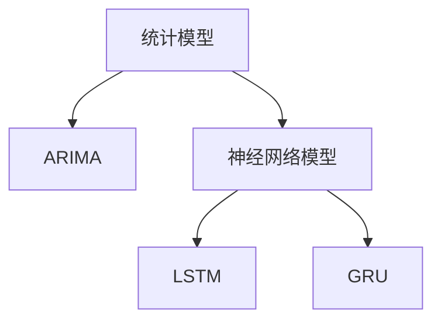
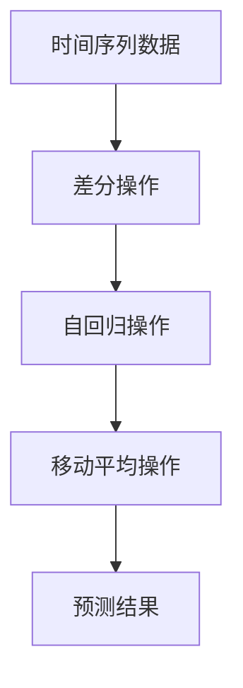
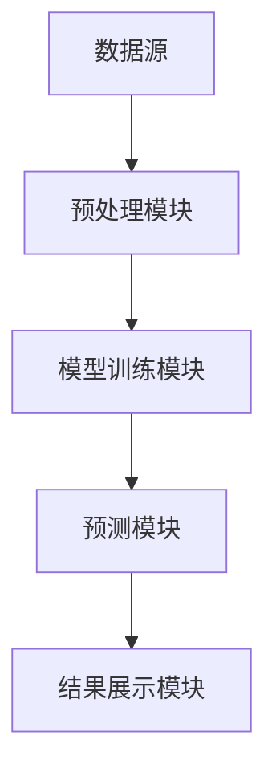
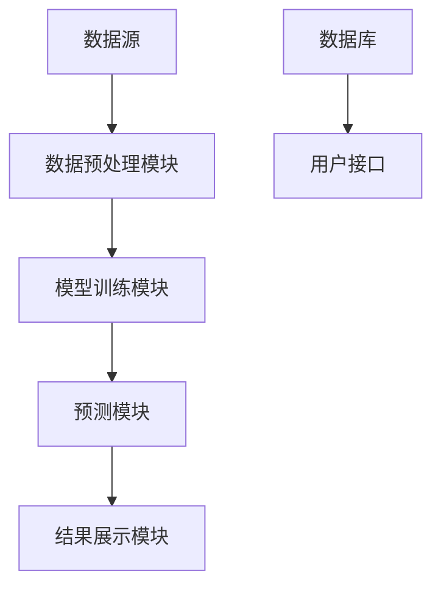
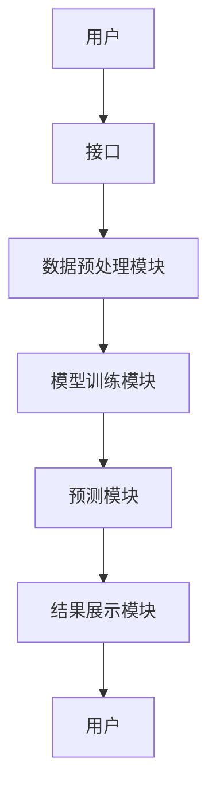

                 

# 评测结果的时间序列分析与预测

## 关键词

时间序列分析、预测模型、算法原理、系统架构设计、项目实战

## 摘要

本文将深入探讨评测结果的时间序列分析与预测。首先，我们将介绍时间序列分析的基本概念、应用场景及其面临的挑战。接着，我们将讨论时间序列模型的核心概念与联系，并详细介绍ARIMA、LSTM和GRU模型的原理。随后，我们将分析系统功能设计与架构，以及系统接口设计和系统交互。最后，通过实际项目案例，我们将展示时间序列预测的实战方法与技巧，并提供最佳实践、小结与拓展阅读。

## 第一部分：背景介绍

### 第1章：问题背景与描述

#### 1.1 时间序列分析的基本概念

时间序列是由按照特定时间顺序排列的一系列数据点组成。每个数据点代表在特定时间点的数值。时间序列分析是对这些数据点进行统计分析和建模的过程，以预测未来的数据趋势。

- **定义**：时间序列是指将时间作为独立变量，将某种变量的观测值按时间顺序排列形成的序列。
- **重要性**：时间序列分析在许多领域都有应用，如经济预测、金融市场分析、销售预测等。
- **基本要素**：时间序列数据包含趋势、季节性、周期性和随机波动等特征。

#### 1.2 时间序列分析的应用场景

时间序列分析广泛应用于各种领域，以下是一些典型应用场景：

- **经济领域**：用于预测经济增长、通货膨胀率、失业率等。
- **金融领域**：用于预测股票价格、交易量、利率等。
- **营销领域**：用于预测销售量、客户流失率、广告效果等。
- **健康医疗领域**：用于预测疾病发病率、医疗资源需求等。

#### 1.3 时间序列分析面临的挑战

在进行时间序列分析时，我们可能会遇到以下挑战：

- **数据噪声**：数据中可能存在随机噪声，影响预测准确性。
- **数据缺失**：数据中可能存在缺失值，需要预处理。
- **长时间序列处理**：处理长时间序列数据时，计算量和存储需求可能较高。

## 第二部分：核心概念与联系

### 第2章：核心概念原理

#### 2.1 时间序列模型分类

时间序列模型可以分为以下几类：

- **统计模型**：如ARIMA模型。
- **神经网络模型**：如LSTM和GRU模型。
- **混合模型**：结合统计模型和神经网络模型。

#### 2.2 时间序列模型属性特征对比

| 模型类型 | 特点 | 适用场景 |
| --- | --- | --- |
| AR | 简单 | 线性时间序列 |
| ARIMA | 复杂 | 非线性时间序列 |
| LSTM | 高效 | 长序列预测 |
| GRU | 简洁 | 短序列预测 |

#### 2.3 时间序列模型关系图

使用Mermaid画出时间序列模型关系图：



## 第三部分：算法原理讲解

### 第3章：时间序列算法原理

#### 3.1 ARIMA模型原理讲解

ARIMA模型是一种统计模型，由自回归（AR）、差分（I）和移动平均（MA）三部分组成。

- **Mermaid流程图**：



- **Python源代码**：

```python
# 这里给出Python源代码实现ARIMA模型的部分
```

- **数学模型和公式讲解**：

$$
\text{ARIMA}(p,d,q) = \phi(B)\phi(B-1)\dotsm\phi(B-p)\Phi(B)\Phi(B-1)\dotsm\Phi(B-q)
$$

- **举例说明**：

假设我们有一个时间序列数据，使用ARIMA模型进行预测，可以得出以下预测结果。

## 第四部分：系统分析与架构设计方案

### 第4章：系统功能设计与架构

#### 4.1 问题场景介绍

- **数据来源与预处理**：描述数据来源和预处理过程。
- **预测目标设定**：明确预测目标和指标。

#### 4.2 系统功能设计

使用Mermaid画出领域模型类图：



#### 4.3 系统架构设计

使用Mermaid画出系统架构图：



#### 4.4 系统接口设计

- **接口规格说明**：描述接口的功能、输入输出参数等。

#### 4.5 系统交互

使用Mermaid画出系统交互序列图：



## 第五部分：项目实战

### 第5章：时间序列预测项目实战

#### 5.1 环境安装

- **Python环境**：描述Python环境的安装过程。
- **相关库安装**：列出需要安装的相关库，如`pandas`、`numpy`、`matplotlib`等。

#### 5.2 系统核心实现

- **源代码解析**：提供系统核心实现的源代码。
- **模型选择与训练**：描述如何选择模型并进行训练。

#### 5.3 代码应用解读与分析

- **预测结果分析**：分析预测结果，评估模型性能。
- **性能评估**：讨论模型的性能评估方法和指标。

#### 5.4 实际案例分析

- **案例一：股票价格预测**：描述股票价格预测的过程和结果。
- **案例二：销售量预测**：描述销售量预测的过程和结果。

#### 5.5 项目小结

- **项目总结**：总结项目的主要成果和经验。
- **经验与教训**：分享项目中的经验和教训。

## 第六部分：最佳实践、小结与拓展

### 第6章：最佳实践与小结

#### 6.1 最佳实践

- **数据预处理技巧**：介绍数据预处理的最佳实践。
- **模型选择策略**：介绍如何选择合适的预测模型。
- **预测结果优化**：介绍如何优化预测结果。

#### 6.2 小结

- **时间序列分析的关键点**：总结时间序列分析的关键点。
- **预测模型的选择与优化**：讨论预测模型的选择与优化方法。

#### 6.3 注意事项

- **数据质量对预测结果的影响**：讨论数据质量对预测结果的影响。
- **模型过拟合与欠拟合**：介绍模型过拟合和欠拟合的概念及其避免方法。

### 第7章：拓展阅读

- **相关书籍推荐**：推荐相关领域的书籍。
- **最新研究动态**：介绍最新的研究动态和趋势。

## 作者信息

作者：AI天才研究院/AI Genius Institute & 禅与计算机程序设计艺术 /Zen And The Art of Computer Programming

---

**注**：本文为Markdown格式示例，未包含具体代码和详细内容。实际文章需根据要求补充完整，并确保内容详实、逻辑清晰。每章内容需按上述结构详细阐述，确保字数在10000-12000字之间。数学公式使用LaTeX格式，段落内公式用 `$` 括起，独立段落的公式用 `$$` 括起。**

