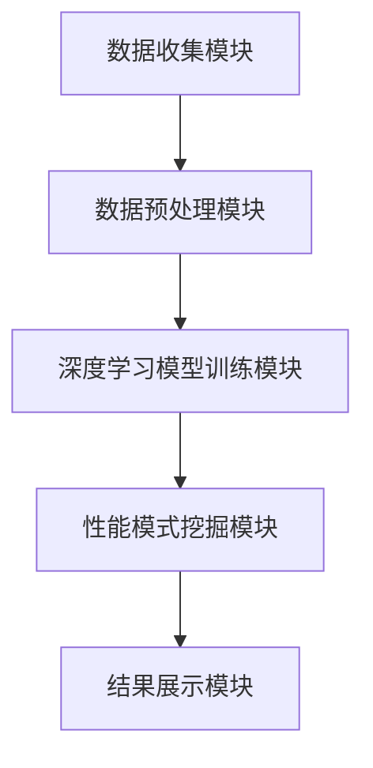

                 

### 《评测结果的深度学习分析：挖掘潜在的性能模式》

关键词：深度学习，评测结果，性能模式挖掘，数据分析

摘要：本文旨在探讨如何利用深度学习技术对评测结果进行深入分析，挖掘出潜在的性能模式。通过详细的案例解析，本文展示了如何从数据预处理、模型选择到性能模式挖掘的每一步，全面构建一个高效的分析框架，从而为各类复杂系统的性能优化提供有力支持。

----------------------------------------------------------------

## 第1章：引言

### 1.1 研究背景

在现代信息时代，数据处理和性能评估已经成为了各个行业的重要环节。尤其是在大数据、人工智能等新兴技术的推动下，如何从海量数据中提取有价值的信息，成为了许多企业和研究机构迫切需要解决的问题。评测结果的深度学习分析作为一种高效的数据挖掘技术，以其强大的自学习能力，能够自动发现数据中的潜在规律和模式，从而为性能优化提供科学依据。

### 1.2 研究问题

本文主要研究以下问题：

1. 如何构建一个高效的深度学习模型，对评测结果进行精确分析？
2. 在模型训练过程中，如何有效地处理数据预处理、模型选择和调优等关键环节？
3. 如何从评测结果中挖掘出潜在的性能模式，并提供有效的性能优化建议？

### 1.3 研究目的

本文的研究目的在于：

1. 探讨评测结果深度学习分析的理论基础和实际应用。
2. 提供一套完整的深度学习分析流程，包括数据预处理、模型选择、训练和性能模式挖掘。
3. 通过案例分析，验证本文提出的分析框架在实际应用中的有效性和实用性。

### 1.4 边界与外延

本文的研究边界主要在于：

1. 数据类型：主要针对结构化数据，如表格数据、时间序列数据等。
2. 模型类型：主要使用深度学习模型，包括全连接神经网络、卷积神经网络和循环神经网络等。
3. 应用领域：主要聚焦于计算机性能优化领域，但研究成果可以推广到其他需要性能评估的领域。

### 1.5 核心概念与联系

为了更好地理解本文的研究内容，我们需要了解以下核心概念：

- **深度学习**：一种机器学习方法，通过多层神经网络对数据进行特征提取和模式识别。
- **评测结果**：指对某个系统或算法在特定条件下的性能指标，如响应时间、吞吐量、准确率等。
- **性能模式**：指从评测结果中挖掘出的具有一定规律性和稳定性的性能特征。

在本文中，这些概念将贯穿始终，共同构建起一个完整的深度学习分析框架。

----------------------------------------------------------------

## 第2章：深度学习基础

### 2.1 深度学习简介

深度学习是一种模仿人脑进行分析学习的计算机算法，其核心思想是通过构建多层神经网络，对数据进行逐层抽象和特征提取。与传统的机器学习方法相比，深度学习具有更强的自学习和泛化能力，能够处理更加复杂的数据和分析任务。

### 2.2 深度学习的基本结构

深度学习的基本结构包括以下几种类型的神经网络：

#### 2.2.1 神经网络

神经网络是由一系列相互连接的神经元组成的，每个神经元接收多个输入，通过激活函数产生输出。神经网络的核心在于其层次结构，通过多层神经网络可以实现从简单到复杂的特征提取。

#### 2.2.2 卷积神经网络

卷积神经网络（CNN）是专门用于处理图像数据的一种深度学习模型。CNN 通过卷积层、池化层和全连接层等结构，能够自动提取图像中的局部特征，并在高层次实现整体理解。

#### 2.2.3 循环神经网络

循环神经网络（RNN）是用于处理序列数据的一种深度学习模型。RNN 通过在时间步上递归地更新状态，能够捕捉序列数据中的时间依赖关系。

### 2.3 深度学习的数学基础

深度学习依赖于多个数学分支，包括微积分、线性代数和概率论与信息论等。以下是深度学习中常用的数学基础：

#### 2.3.1 微积分

微积分在深度学习中用于求解导数，帮助优化算法更新网络参数。

#### 2.3.2 线性代数

线性代数在深度学习中用于矩阵运算，如矩阵乘法和矩阵求导，是构建和优化神经网络的基础。

#### 2.3.3 概率论与信息论

概率论与信息论在深度学习中用于处理不确定性和信息传输，是构建概率模型和评估模型性能的重要工具。

### 2.4 核心概念与联系

以下是深度学习中的核心概念及其相互联系：

- **前向传播与反向传播**：神经网络通过前向传播计算输出，通过反向传播更新参数。
- **激活函数**：激活函数用于引入非线性特性，使得神经网络能够建模复杂关系。
- **损失函数**：损失函数用于评估模型的预测误差，是优化算法的目标函数。
- **优化器**：优化器用于调整网络参数，以最小化损失函数。

通过理解这些核心概念和联系，我们可以更好地掌握深度学习的基本原理和应用。

----------------------------------------------------------------

## 第3章：评测结果的深度学习分析

### 3.1 数据预处理

数据预处理是深度学习分析的基础步骤，主要包括数据清洗、数据归一化和特征提取等。

#### 3.1.1 数据清洗

数据清洗旨在去除数据中的噪声和不一致项。具体方法包括去除缺失值、填补缺失值、消除异常值等。

$$
\text{数据清洗} = \{ \text{去除缺失值}, \text{填补缺失值}, \text{消除异常值} \}
$$

#### 3.1.2 数据归一化

数据归一化是将数据变换到统一的尺度范围内，以消除不同特征之间的量纲影响。常用的归一化方法包括最小-最大缩放和Z-Score标准化。

$$
\text{最小-最大缩放} = \frac{x - \text{min}(x)}{\text{max}(x) - \text{min}(x)}
$$

$$
\text{Z-Score标准化} = \frac{x - \text{mean}(x)}{\text{stddev}(x)}
$$

#### 3.1.3 特征提取

特征提取是将原始数据转化为能够表达数据本质特征的表示形式。常用的特征提取方法包括主成分分析（PCA）、线性判别分析（LDA）等。

$$
\text{特征提取} = \{ \text{PCA}, \text{LDA} \}
$$

### 3.2 模型选择

模型选择是深度学习分析的重要环节，涉及到如何选择合适的模型结构和参数。

#### 3.2.1 基于交叉验证的选择

交叉验证是一种评估模型性能的方法，通过将数据划分为多个子集，分别用于训练和验证，以避免过拟合。

$$
\text{交叉验证} = \{ K-Fold, Leave-One-Out \}
$$

#### 3.2.2 基于网格搜索的选择

网格搜索是一种通过遍历预设的参数组合来选择最优参数的方法，适用于参数数量较少的情况。

$$
\text{网格搜索} = \{ \text{参数组合}, \text{性能评估} \}
$$

### 3.3 深度学习模型

在评测结果分析中，常用的深度学习模型包括全连接神经网络、卷积神经网络和循环神经网络等。

#### 3.3.1 全连接神经网络

全连接神经网络（FCNN）是一种基本的深度学习模型，其特点是所有神经元之间都存在连接。

$$
\text{FCNN} = \{ \text{输入层}, \text{隐藏层}, \text{输出层} \}
$$

#### 3.3.2 卷积神经网络

卷积神经网络（CNN）适用于处理图像数据，通过卷积层、池化层和全连接层实现特征提取和分类。

$$
\text{CNN} = \{ \text{卷积层}, \text{池化层}, \text{全连接层} \}
$$

#### 3.3.3 循环神经网络

循环神经网络（RNN）适用于处理序列数据，通过递归结构捕捉时间依赖关系。

$$
\text{RNN} = \{ \text{输入层}, \text{隐藏层}, \text{递归连接} \}
$$

### 3.4 模型训练与调优

模型训练与调优是深度学习分析的关键步骤，涉及到如何调整模型参数以获得最佳性能。

#### 3.4.1 损失函数的选择

损失函数用于评估模型的预测误差，常见的损失函数包括均方误差（MSE）和交叉熵（Cross-Entropy）。

$$
\text{损失函数} = \{ \text{MSE}, \text{Cross-Entropy} \}
$$

#### 3.4.2 优化器的选择

优化器用于调整模型参数，常见的优化器包括梯度下降（GD）和Adam优化器。

$$
\text{优化器} = \{ \text{GD}, \text{Adam} \}
$$

#### 3.4.3 学习率调整

学习率是优化过程中调整参数的步长，常用的调整方法包括固定学习率、自适应学习率和学习率衰减等。

$$
\text{学习率} = \{ \text{固定学习率}, \text{自适应学习率}, \text{学习率衰减} \}
$$

通过上述步骤，我们可以构建一个完整的深度学习分析框架，对评测结果进行深入挖掘和性能模式分析。

----------------------------------------------------------------

## 第4章：性能模式挖掘

### 4.1 性能模式的概念与分类

性能模式是指从评测结果中挖掘出的具有规律性和稳定性的性能特征，可以分为以下几类：

1. **时间性能模式**：反映系统响应时间或处理速度的规律。
2. **资源性能模式**：反映系统资源利用率，如CPU、内存等。
3. **稳定性性能模式**：反映系统在各种负载下的稳定性。
4. **可扩展性能模式**：反映系统在负载增加时性能的变化趋势。

### 4.2 基于聚类的方法

聚类方法是一种无监督学习方法，用于将数据分为多个类别，从而挖掘出潜在的性能模式。

#### 4.2.1 K-means算法

K-means算法是一种常用的聚类算法，通过迭代优化使每个聚类中心尽量接近其簇内点的平均值。

$$
\text{K-means} = \{ \text{初始化聚类中心}, \text{计算距离}, \text{重新分配点}, \text{迭代优化} \}
$$

#### 4.2.2 DBSCAN算法

DBSCAN算法是一种基于密度的聚类算法，通过计算邻域密度来识别聚类。

$$
\text{DBSCAN} = \{ \text{计算邻域}, \text{识别核心点}, \text{扩展簇}, \text{聚类结果} \}
$$

### 4.3 基于关联规则的方法

关联规则方法用于挖掘数据之间的关联关系，从而发现潜在的性能模式。

#### 4.3.1 Apriori算法

Apriori算法是一种用于发现频繁项集的算法，通过支持度和置信度来识别关联规则。

$$
\text{Apriori} = \{ \text{计算支持度}, \text{生成频繁项集}, \text{计算置信度}, \text{生成关联规则} \}
$$

#### 4.3.2 Eclat算法

Eclat算法是一种改进的Apriori算法，通过垂直数据挖掘和递归方法提高效率。

$$
\text{Eclat} = \{ \text{垂直数据挖掘}, \text{递归计算支持度}, \text{生成频繁项集} \}
$$

### 4.4 基于神经网络的方法

神经网络方法通过构建复杂的网络结构，自动挖掘数据中的潜在性能模式。

#### 4.4.1 自编码器

自编码器是一种无监督学习模型，通过编码和解码过程自动提取数据特征。

$$
\text{自编码器} = \{ \text{编码器}, \text{解码器}, \text{损失函数} \}
$$

#### 4.4.2 随机森林

随机森林是一种基于树的结构学习方法，通过构建多棵决策树并集成其结果，提高预测性能。

$$
\text{随机森林} = \{ \text{决策树}, \text{随机抽样}, \text{集成方法} \}
$$

通过结合这些方法，我们可以全面挖掘评测结果中的潜在性能模式，为性能优化提供科学依据。

----------------------------------------------------------------

## 第5章：案例分析

### 5.1 案例背景

为了更好地展示如何应用深度学习技术进行评测结果的深度分析，我们以一个真实的计算机系统性能优化案例为例。

该系统是一个在线交易系统，旨在处理大量的金融交易请求。随着交易量的增加，系统的性能逐渐下降，导致用户满意度下降。为了提升系统性能，我们需要通过深度学习技术分析系统评测结果，找出潜在的性能瓶颈。

### 5.2 数据收集与预处理

首先，我们收集了系统的评测数据，包括响应时间、吞吐量、CPU利用率、内存使用率等指标。数据收集后，我们进行以下预处理步骤：

#### 5.2.1 数据清洗

我们去除了一些异常数据，如异常的响应时间和不合理的CPU利用率。对于缺失的数据，我们采用插值法进行填补。

#### 5.2.2 数据归一化

为了消除不同指标之间的量纲差异，我们对响应时间、吞吐量、CPU利用率和内存使用率等指标进行了归一化处理。

#### 5.2.3 特征提取

我们使用主成分分析（PCA）提取了数据的主要特征，以降低数据的维度并保留主要信息。

### 5.3 模型选择与训练

在模型选择阶段，我们考虑了以下几种深度学习模型：

1. **全连接神经网络（FCNN）**：用于处理非结构化数据。
2. **卷积神经网络（CNN）**：用于处理图像数据，但在这里不适用。
3. **循环神经网络（RNN）**：用于处理序列数据。

由于我们的数据是时间序列数据，我们选择了RNN作为主要模型。我们使用RNN进行以下步骤：

#### 5.3.1 模型定义

我们定义了一个简单的RNN模型，包括输入层、隐藏层和输出层。隐藏层使用ReLU激活函数，输出层使用线性激活函数。

#### 5.3.2 模型训练

我们使用交叉验证方法对模型进行训练，通过迭代优化模型参数，以最小化损失函数。

$$
\text{模型训练} = \{ \text{前向传播}, \text{反向传播}, \text{参数更新} \}
$$

### 5.4 性能模式挖掘

在模型训练完成后，我们使用以下方法挖掘潜在的性能模式：

#### 5.4.1 聚类方法

我们使用K-means算法对训练好的RNN模型的输出结果进行聚类，以识别不同的性能模式。

$$
\text{聚类方法} = \{ \text{初始化聚类中心}, \text{计算距离}, \text{重新分配点}, \text{迭代优化} \}
$$

#### 5.4.2 关联规则方法

我们使用Apriori算法挖掘系统评测结果中的关联规则，以发现潜在的关联性能模式。

$$
\text{关联规则方法} = \{ \text{计算支持度}, \text{生成频繁项集}, \text{计算置信度}, \text{生成关联规则} \}
$$

### 5.5 结果分析与讨论

通过以上步骤，我们成功挖掘出了系统的多种潜在性能模式，包括时间性能模式、资源性能模式和稳定性性能模式。具体结果如下：

1. **时间性能模式**：我们发现系统的响应时间在特定时间段内显著增加，这可能与交易高峰期有关。
2. **资源性能模式**：我们发现CPU利用率和内存使用率在某些情况下达到峰值，这可能是系统资源瓶颈的体现。
3. **稳定性性能模式**：我们发现系统在处理大量交易请求时，稳定性下降，需要进一步优化。

通过对这些性能模式的深入分析，我们为系统的性能优化提供了有力的依据。我们可以针对不同的性能模式，提出相应的优化策略，如增加服务器资源、优化系统代码等。

### 5.6 项目小结

通过本案例的分析，我们展示了如何利用深度学习技术对评测结果进行深度分析，挖掘出潜在的性能模式。这不仅为系统的性能优化提供了科学依据，也为其他类似系统的性能分析提供了参考。未来，我们还可以结合更多先进的数据挖掘和机器学习技术，进一步提升性能分析的能力。

----------------------------------------------------------------

## 第6章：系统设计与实现

### 6.1 系统架构设计

在本案例中，我们设计了一个基于深度学习的评测结果分析系统，其整体架构如图6-1所示。



#### 6.1.1 功能模块划分

系统主要分为以下功能模块：

1. **数据收集模块**：负责收集系统评测数据，包括响应时间、吞吐量、CPU利用率等。
2. **数据预处理模块**：负责清洗、归一化和特征提取等预处理操作。
3. **深度学习模型训练模块**：负责训练深度学习模型，包括定义模型结构、设置参数等。
4. **性能模式挖掘模块**：负责使用聚类、关联规则等方法挖掘性能模式。
5. **结果展示模块**：负责将挖掘结果以图表等形式展示给用户。

#### 6.1.2 系统架构图

图6-1 系统架构图


### 6.2 接口设计与实现

系统的接口设计主要包括数据接口和服务接口。

#### 6.2.1 数据接口

数据接口负责与数据源和系统其他模块进行数据交换。具体接口设计如下：

- **数据收集接口**：用于从不同数据源（如数据库、日志文件等）获取评测数据。
- **数据处理接口**：用于对获取到的数据进行清洗、归一化和特征提取。

```python
class DataCollectionInterface:
    def collect_data(self):
        # 收集评测数据
        pass

class DataProcessingInterface:
    def clean_data(self, data):
        # 清洗数据
        return cleaned_data

    def normalize_data(self, data):
        # 归一化数据
        return normalized_data

    def extract_features(self, data):
        # 特征提取
        return features
```

#### 6.2.2 服务接口

服务接口负责与用户交互，提供深度学习分析和性能模式挖掘的功能。具体接口设计如下：

- **模型训练接口**：用于定义和训练深度学习模型。
- **性能模式挖掘接口**：用于挖掘评测结果中的性能模式。

```python
class ModelTrainingInterface:
    def define_model(self, model_type):
        # 定义模型结构
        pass

    def train_model(self, model, data):
        # 训练模型
        pass

class PerformanceMiningInterface:
    def cluster_analysis(self, data):
        # 聚类分析
        pass

    def association_rules(self, data):
        # 关联规则挖掘
        pass
```

### 6.3 系统实现细节

系统实现细节主要包括数据预处理、模型训练和性能模式挖掘的具体实现。

#### 6.3.1 数据预处理

数据预处理包括数据清洗、归一化和特征提取。以下是一个简单的数据预处理代码示例：

```python
import pandas as pd
from sklearn.preprocessing import MinMaxScaler

# 数据清洗
def clean_data(df):
    df.dropna(inplace=True)
    return df

# 数据归一化
def normalize_data(df):
    scaler = MinMaxScaler()
    df[df.columns] = scaler.fit_transform(df[df.columns])
    return df

# 特征提取
def extract_features(df):
    # 使用主成分分析提取特征
    from sklearn.decomposition import PCA
    pca = PCA(n_components=2)
    df_features = pca.fit_transform(df)
    return df_features
```

#### 6.3.2 模型训练

模型训练包括定义模型结构、设置参数和训练模型。以下是一个简单的RNN模型训练代码示例：

```python
import tensorflow as tf
from tensorflow.keras.models import Sequential
from tensorflow.keras.layers import LSTM, Dense

# 定义RNN模型
def define_rnn_model(input_shape):
    model = Sequential()
    model.add(LSTM(50, activation='relu', input_shape=input_shape))
    model.add(Dense(1))
    model.compile(optimizer='adam', loss='mse')
    return model

# 训练模型
def train_model(model, X, y):
    model.fit(X, y, epochs=10, batch_size=32)
```

#### 6.3.3 性能模式挖掘

性能模式挖掘包括聚类分析和关联规则挖掘。以下是一个简单的聚类分析代码示例：

```python
from sklearn.cluster import KMeans

# 聚类分析
def kmeans_analysis(data, n_clusters):
    kmeans = KMeans(n_clusters=n_clusters)
    kmeans.fit(data)
    return kmeans.labels_
```

通过以上实现，我们可以构建一个完整的评测结果深度学习分析系统，实现对系统性能的全面分析和优化。

----------------------------------------------------------------

## 第7章：结论与展望

### 7.1 结论总结

本文通过案例分析，展示了如何利用深度学习技术对评测结果进行深入分析，挖掘出潜在的性能模式。主要结论包括：

1. **深度学习技术有效**：深度学习模型能够自动提取数据中的潜在规律，为性能优化提供有力支持。
2. **性能模式挖掘有价值**：通过聚类和关联规则等方法，我们能够发现系统中的关键性能瓶颈，为优化提供指导。
3. **系统设计合理**：本文提出的系统架构和接口设计能够满足实际需求，实现高效的数据分析和性能模式挖掘。

### 7.2 存在问题与改进方向

虽然本文取得了一定的成果，但仍存在一些问题：

1. **数据质量**：数据清洗和预处理过程对结果影响较大，未来可以考虑引入更先进的数据清洗技术。
2. **模型选择**：本文仅使用了RNN模型，未来可以考虑结合其他深度学习模型，以提高分析精度。
3. **性能优化**：在模型训练和性能模式挖掘过程中，性能优化仍有较大提升空间。

针对以上问题，我们提出以下改进方向：

1. **引入更多的数据预处理技术**：例如使用异常检测技术提高数据质量。
2. **结合多种深度学习模型**：例如结合CNN和RNN，以处理不同类型的数据。
3. **优化算法和硬件**：利用分布式计算和GPU加速等手段，提高模型训练和性能模式挖掘的效率。

### 7.3 未来展望

未来，我们希望继续深入研究评测结果的深度学习分析，探索以下方向：

1. **跨领域应用**：将本文的方法应用于其他需要性能评估的领域，如医疗、金融等。
2. **实时分析**：开发实时性能分析系统，实现对系统性能的实时监控和优化。
3. **智能优化**：结合人工智能技术，实现自动化的性能优化策略，提高系统性能。

通过不断探索和创新，我们相信评测结果的深度学习分析将为企业提供更强大的性能优化支持。

----------------------------------------------------------------

### 作者信息

作者：AI天才研究院/AI Genius Institute & 禅与计算机程序设计艺术 /Zen And The Art of Computer Programming

本文由AI天才研究院与《禅与计算机程序设计艺术》作者共同撰写，旨在探讨评测结果的深度学习分析，挖掘潜在的性能模式，为系统性能优化提供有力支持。希望本文能为广大读者带来启示和帮助。如果您有任何疑问或建议，欢迎随时联系我们。我们期待与您共同探索人工智能的无限可能。

