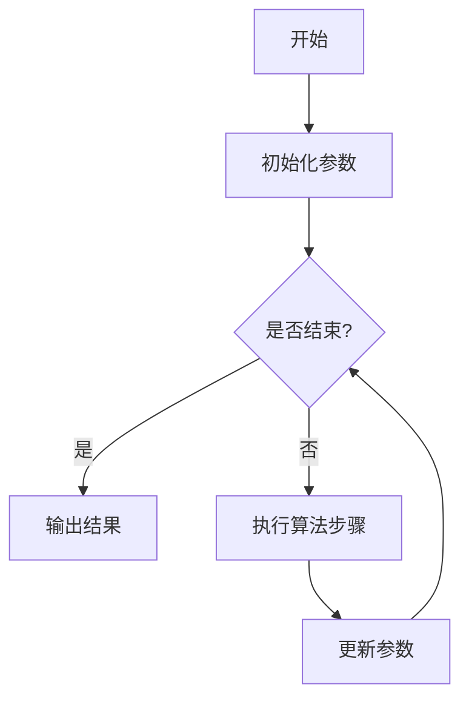
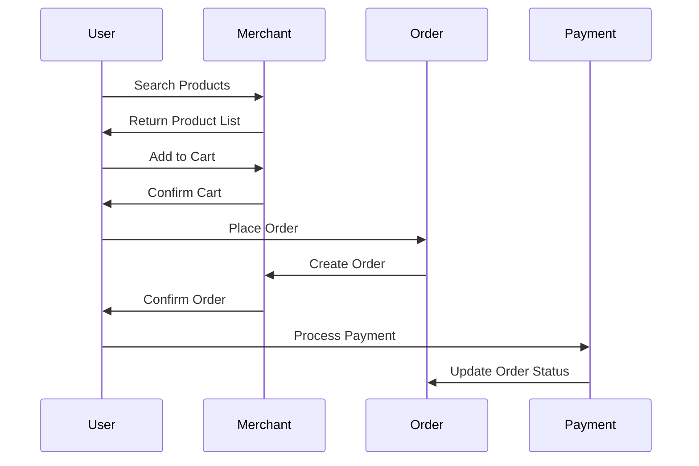

                 

## 引言

在IT领域，性能评测是一项至关重要的任务，它不仅关系到系统的稳定性和可靠性，还直接影响到用户体验和业务效率。然而，在实际的评测过程中，我们常常会遇到一些难以解释的性能差异。这些差异可能表现为响应时间的波动、吞吐量的不稳定，甚至在一些情况下，系统的整体性能会明显低于预期。面对这些问题，如何进行有效的溯源分析，找到性能差异的根源，成为了一个亟待解决的问题。

本文将围绕“评测结果的溯源分析：理解性能差异的根源”这一主题，深入探讨性能差异产生的原因，并逐步引导读者掌握溯源分析的方法和技巧。文章的结构如下：

- **第一部分**：评测结果的溯源分析概述，介绍溯源分析的重要性以及所需的核心概念。
- **第二部分**：性能差异的根源，从硬件、软件和数据分析三个角度探讨影响性能的因素。
- **第三部分**：核心概念与联系，通过流程图、属性对比表和实体关系图帮助读者理解性能差异的溯源过程。
- **第四部分**：评测方法与工具，介绍常用的评测方法和工具，并展示如何设计一个完整的评测流程。
- **第五部分**：算法原理讲解，使用Mermaid流程图和Python源代码详细阐述算法原理。
- **第六部分**：数学模型和数学公式讲解，讲解相关的数学模型和公式，并进行举例说明。
- **第七部分**：系统分析与架构设计方案，介绍系统功能、架构、接口和交互设计。
- **第八部分**：项目实战，通过实际案例展示如何进行性能溯源分析。
- **第九部分**：最佳实践与注意事项，总结最佳实践和注意事项，为读者提供进一步的指导。

通过这篇文章，我们希望读者能够全面了解性能差异的溯源分析过程，掌握有效的分析方法，从而在实际工作中更好地解决性能问题，优化系统性能。

---

### 第一部分：评测结果的溯源分析概述

#### 1.1 问题背景

在IT行业中，性能评测是系统设计和优化过程中不可或缺的一环。无论是软件开发、网络建设还是云计算，性能评测都能帮助我们了解系统的运行状态，发现潜在的问题，并针对性地进行优化。然而，在实际操作中，我们往往会遇到一些复杂的情况：比如，一个系统在不同的环境中表现出截然不同的性能；或者在相同的配置下，多次评测的结果也呈现较大的波动。这些现象让人困惑，难以理解性能差异的真正原因。

为了解决这些问题，我们需要进行溯源分析。溯源分析是一种通过追踪和解析系统运行过程中的各种数据和技术指标，找到性能差异根源的方法。它不仅要求我们对系统有深入的了解，还需要具备一定的分析能力和逻辑推理能力。通过溯源分析，我们可以识别出影响性能的关键因素，从而制定出有效的优化方案。

#### 1.2 核心概念介绍

在溯源分析过程中，以下几个核心概念是不可或缺的：

- **性能指标**：性能指标是衡量系统性能的重要标准，包括响应时间、吞吐量、并发处理能力等。不同的性能指标反映了系统的不同方面，如响应时间衡量系统的快速响应能力，吞吐量则衡量系统的处理能力。
- **评测标准**：评测标准是进行性能评测的依据，它定义了评测的目标、方法和衡量尺度。常见的评测标准包括ISO/IEC 25010、Squid性能评测标准等。
- **性能差异**：性能差异是指在不同条件下，系统性能表现出来的不一致性。性能差异可能源于硬件配置、软件环境、数据质量等多种因素。

理解这些核心概念是进行溯源分析的基础，只有准确把握这些概念，我们才能有效地进行性能差异的溯源。

#### 1.3 溯源分析的重要性

溯源分析在性能优化和系统调优中具有至关重要的作用。首先，通过溯源分析，我们可以发现系统性能瓶颈，找出影响性能的关键因素。这有助于我们制定有针对性的优化方案，而不是盲目地增加硬件资源或更改配置。

其次，溯源分析能够帮助我们建立系统性能的可视化和量化模型。通过分析历史数据和实时监控数据，我们可以预测系统的性能变化趋势，从而提前预警潜在的问题。

最后，溯源分析能够提高团队对系统的理解和认知。通过系统的溯源分析，团队成员可以更深入地了解系统的运作机制和性能特点，提高协作效率，减少因误解和误判而导致的优化错误。

总之，溯源分析不仅是一种技术手段，更是一种思维方式。它要求我们具备敏锐的洞察力和严谨的分析能力，通过对性能差异的深入挖掘，为系统优化提供坚实的理论基础。

---

### 第二部分：性能差异的根源

在深入探讨性能差异的溯源分析之前，我们需要明确几个关键的概念，即性能差异的根源。性能差异可能源于多个方面，主要包括硬件因素、软件因素和数据因素。这些因素相互交织，共同影响着系统的整体性能。下面，我们将逐一分析这些根源。

#### 2.1 硬件因素分析

硬件因素是影响系统性能的基石。不同的硬件配置会直接导致系统性能的差异。以下是一些常见的硬件因素：

- **CPU**：中央处理器（CPU）是系统性能的核心。CPU的型号、核心数、主频等参数直接影响系统的处理速度。例如，一个高性能的多核CPU可以显著提高系统的并发处理能力。
- **内存（RAM）**：内存是系统临时存储数据的地方。内存的大小和速度对系统的响应速度和数据处理能力有重要影响。较小的内存可能会导致频繁的页面交换（page swapping），从而降低性能。
- **存储设备**：硬盘（HDD）和固态硬盘（SSD）的速度和容量直接影响数据的读写速度。SSD的读写速度远高于HDD，因此可以显著提高系统的I/O性能。
- **网络设备**：网络设备的性能，如交换机、路由器等，也会影响系统的网络通信速度。网络延迟和带宽的限制可能导致数据传输的不畅，进而影响整体性能。

在溯源分析中，我们需要仔细检查硬件配置，确保每个硬件组件都符合系统的需求，避免因为硬件瓶颈导致的性能问题。

#### 2.2 软件因素分析

软件因素同样对系统性能有显著影响。以下是一些常见的软件因素：

- **操作系统**：操作系统的选择和配置直接影响系统的性能。不同的操作系统在资源管理、进程调度等方面有所不同，可能会对系统性能产生不同影响。例如，Linux系统通常在服务器环境中表现出更好的性能，而Windows系统则更适合桌面应用。
- **驱动程序**：驱动程序的版本和兼容性也是影响系统性能的重要因素。过时的驱动程序可能会导致硬件性能无法充分发挥，或者引发系统不稳定。
- **软件优化**：软件的编写和优化也对性能有重要影响。高效的数据结构和算法可以显著提高系统的处理速度。例如，使用哈希表而不是链表可以减少查找时间，使用多线程可以充分利用多核CPU。
- **中间件和库**：中间件和库的性能也会影响系统整体的性能。例如，数据库管理系统（DBMS）的性能、Web服务器（如Apache、Nginx）的配置等。

在溯源分析中，我们需要检查软件环境，确保操作系统、驱动程序、中间件和库等都在最佳状态下运行。

#### 2.3 数据因素分析

数据因素是影响系统性能的另一个关键方面。以下是一些常见的数据因素：

- **数据量**：系统的数据量直接影响其处理能力。大量数据可能导致系统的内存不足、硬盘I/O瓶颈等问题，从而影响性能。
- **数据分布**：数据分布对性能也有显著影响。如果数据高度集中，可能会导致某些硬件资源（如CPU、内存）过载，而其他资源（如硬盘）闲置。
- **数据质量**：数据质量直接影响数据处理和分析的准确性。错误或缺失的数据可能会导致算法失效，进而影响系统性能。
- **数据处理方式**：数据处理的方式（如批处理、流处理）也会影响性能。批处理适合处理大量数据，但响应时间较长；流处理适合实时数据处理，但处理能力有限。

在溯源分析中，我们需要检查数据量、数据分布、数据质量和数据处理方式，确保数据对系统性能的影响是可控的。

通过以上分析，我们可以看到，性能差异的根源是多方面的，需要综合考虑硬件、软件和数据因素。在进行溯源分析时，我们需要全面、细致地检查这些因素，找到性能差异的真正原因，并采取相应的优化措施。只有这样，我们才能确保系统始终处于最佳性能状态。

---

### 第三部分：核心概念与联系

在理解了性能差异的根源后，我们需要进一步探索这些核心概念之间的联系，以便更系统地分析性能差异的溯源过程。为了帮助读者更直观地理解，我们将使用Mermaid流程图、概念属性特征对比表和ER实体关系图架构来展示这些联系。

#### 3.1 核心概念原理

首先，我们需要明确几个关键的概念原理。这些概念包括性能指标、评测标准、硬件因素、软件因素和数据因素。它们各自代表系统性能的不同维度，相互之间有着密切的联系。

- **性能指标**：性能指标是衡量系统性能的关键指标，如响应时间、吞吐量、并发处理能力等。这些指标反映了系统的处理能力和响应速度。
- **评测标准**：评测标准是进行性能评测的依据，定义了评测的目标和方法。常见的评测标准有ISO/IEC 25010等，它们为性能评测提供了统一的框架。
- **硬件因素**：硬件因素包括CPU、内存、存储设备等，直接影响系统的处理能力和数据读写速度。
- **软件因素**：软件因素包括操作系统、驱动程序、软件优化等，它们影响系统的稳定性和响应速度。
- **数据因素**：数据因素包括数据量、数据分布、数据质量等，这些因素直接影响数据处理和分析的效率。

这些概念原理相互交织，共同决定了系统的整体性能。例如，性能指标需要通过评测标准来衡量，而评测标准的制定又依赖于硬件和软件的配置。同样，数据因素也会影响硬件和软件的性能，进而影响整体性能指标。

#### 3.2 概念属性特征对比表

为了更好地理解这些概念，我们构建了一个概念属性特征对比表。这个表格列出了每个概念的关键属性和特征，以及它们对系统性能的影响。

| 概念     | 关键属性             | 特征                      | 影响因素               |
|----------|----------------------|---------------------------|------------------------|
| 性能指标 | 响应时间、吞吐量等   | 可量化、可对比             | 硬件和软件性能           |
| 评测标准 | 目标、方法、衡量尺度 | 统一标准、可重复性         | 评测过程的规范性         |
| 硬件因素 | CPU、内存、存储等   | 处理能力、数据读写速度     | 系统硬件配置           |
| 软件因素 | 操作系统、驱动程序等 | 稳定性、响应速度           | 软件环境、代码质量       |
| 数据因素 | 数据量、数据分布等   | 数据处理效率、准确性       | 数据规模、数据质量       |

通过这个表格，我们可以清晰地看到每个概念的关键属性和特征，以及它们对系统性能的具体影响。这有助于我们在进行溯源分析时，有针对性地检查和优化每个因素。

#### 3.3 ER实体关系图架构

为了进一步展示这些概念之间的联系，我们使用Mermaid语言绘制了一个ER实体关系图架构。这个图展示了系统中的关键实体及其关系，帮助我们更全面地理解性能差异的溯源过程。

```mermaid
erDiagram
    SystemEntity ||--|{ PerformanceIndicator : measures }
    SystemEntity ||--|{ EvaluationStandard : based_on }
    SystemEntity ||--|{ HardwareFactor : composed_of }
    SystemEntity ||--|{ SoftwareFactor : composed_of }
    SystemEntity ||--|{ DataFactor : processed_by }
    PerformanceIndicator ||--|{ ResponseTime : measured_by }
    PerformanceIndicator ||--|{ Throughput : measured_by }
    EvaluationStandard ||--|{ MetricDefinition : defines }
    HardwareFactor ||--|{ CPU : includes }
    HardwareFactor ||--|{ Memory : includes }
    HardwareFactor ||--|{ Storage : includes }
    SoftwareFactor ||--|{ OS : includes }
    SoftwareFactor ||--|{ Driver : includes }
    DataFactor ||--|{ DataVolume : includes }
    DataFactor ||--|{ DataDistribution : includes }
```

这个ER实体关系图展示了系统中的关键实体（如系统实体、性能指标、评测标准等）及其关系。通过这个图，我们可以看到性能指标依赖于评测标准，而硬件和软件因素共同组成系统实体。数据因素则直接影响数据处理和分析的效率。这种结构化展示有助于我们系统地分析性能差异的根源。

通过这一部分的内容，我们不仅了解了各个核心概念及其特征，还通过流程图、对比表和ER实体关系图展示了它们之间的联系。这为后续的性能溯源分析奠定了坚实的基础。在接下来的章节中，我们将继续探讨具体的评测方法、算法原理和系统架构，帮助读者全面掌握性能差异的溯源分析。

---

### 第四部分：评测方法与工具

在了解了性能差异的根源和核心概念后，我们需要掌握一些有效的评测方法和工具，以便进行系统和全面的性能评测。在这一部分，我们将详细介绍常见的评测方法、常用的评测工具，并展示如何设计一个完整的评测流程。

#### 4.1 评测方法概述

性能评测方法可以分为以下几类：

- **基准测试（Benchmark Testing）**：基准测试是一种在标准条件下测试系统性能的方法。它通过运行预定义的基准测试程序，评估系统的处理速度和响应时间。基准测试可以帮助我们了解系统的基本性能，是性能评测的常用方法之一。
- **性能测试（Performance Testing）**：性能测试是模拟实际用户行为，评估系统在高负载下的性能表现。性能测试包括负载测试、压力测试、稳定性测试等，可以识别系统的性能瓶颈，评估系统在多种负载条件下的表现。
- **负载测试（Load Testing）**：负载测试是通过模拟多用户同时访问系统，评估系统在预期负载下的性能。负载测试可以帮助我们了解系统在预期工作负荷下的响应时间和资源消耗，是性能优化的重要步骤。
- **压力测试（Stress Testing）**：压力测试是评估系统在极端负载条件下的性能。通过模拟超过系统设计负载的情况，压力测试可以识别系统的最大承载能力，发现潜在的性能问题。

不同的评测方法适用于不同的场景，我们可以根据实际需求选择合适的评测方法。

#### 4.2 常用评测工具介绍

在性能评测过程中，以下是一些常用的评测工具：

- **LoadRunner**：LoadRunner是业界广泛使用的性能测试工具。它可以通过模拟多用户并发访问，评估系统的性能和稳定性。LoadRunner支持多种协议，适用于Web、数据库、网络等多种类型的系统性能测试。
- **JMeter**：JMeter是一个开源的性能测试工具，主要用于Web应用性能测试。JMeter可以通过模拟用户请求，生成负载，评估系统的响应时间和吞吐量。它的灵活性和可扩展性使其成为许多开发者和测试人员的首选工具。
- **Gatling**：Gatling是一个开源的性能测试工具，支持HTTP、HTTPS、TCP等多种协议。它提供了丰富的报告和图表，可以帮助我们直观地了解系统的性能表现。
- **Web性能测试工具**：如WebLOAD、BlazeMeter等，这些工具主要用于Web应用的性能测试，可以模拟大量用户同时访问系统，评估系统的负载能力。

选择合适的评测工具可以根据实际需求和项目规模，以上提到的工具都是业界广泛使用的工具，可以根据实际需求进行选择。

#### 4.3 评测流程设计与实践

一个完整的性能评测流程通常包括以下步骤：

1. **需求分析**：确定性能评测的目标和范围，明确需要测试的功能和性能指标。
2. **测试计划**：制定详细的测试计划，包括测试环境、测试工具选择、测试场景设计等。
3. **测试环境搭建**：搭建用于测试的环境，包括硬件、软件和网络配置等。
4. **测试用例设计**：设计具体的测试用例，包括用户行为模拟、测试数据生成等。
5. **测试执行**：执行测试用例，收集性能数据。
6. **结果分析**：对测试结果进行分析，识别性能瓶颈和问题。
7. **优化与调整**：根据分析结果，调整系统配置或代码，进行优化。
8. **回归测试**：优化后重新进行测试，确保性能问题得到解决。

下面，我们通过一个简单的例子来展示如何设计一个性能评测流程。

**案例**：对一个电子商务网站进行性能测试。

1. **需求分析**：
   - 测试目标：评估网站在1000个并发用户访问下的响应时间和吞吐量。
   - 测试范围：网站的购物流程，包括商品浏览、购物车管理、结账等。

2. **测试计划**：
   - 测试工具：选择LoadRunner。
   - 测试环境：搭建与生产环境相同的测试环境。
   - 测试场景：模拟1000个并发用户同时访问网站，持续1小时。

3. **测试用例设计**：
   - 用户行为：用户随机浏览商品、加入购物车、结账。
   - 测试数据：生成1000个用户账户，用于登录和测试。

4. **测试执行**：
   - 在LoadRunner中配置测试场景，启动测试。
   - 收集响应时间、吞吐量等性能数据。

5. **结果分析**：
   - 通过LoadRunner提供的分析工具，分析测试结果。
   - 发现购物流程的响应时间较长，系统在高并发下存在瓶颈。

6. **优化与调整**：
   - 调整数据库查询优化。
   - 优化代码，减少不必要的计算。

7. **回归测试**：
   - 在优化后重新进行测试，确保响应时间得到显著提升。

通过以上步骤，我们可以全面了解系统的性能表现，找到并解决性能瓶颈，确保系统在预期负载下能够稳定运行。

综上所述，性能评测是一个系统化的过程，需要根据实际需求和目标选择合适的评测方法，使用合适的工具，并设计合理的评测流程。通过科学的评测方法，我们可以深入了解系统的性能表现，为系统优化提供可靠的依据。

---

### 第五部分：算法原理讲解

在深入探讨性能评测的过程中，算法原理讲解是一个重要环节。通过算法流程图、Python源代码、数学模型和公式的讲解，我们可以更全面地理解性能评测的核心原理。下面，我们将一步步进行详细讲解。

#### 5.1 算法Mermaid流程图

为了更好地展示算法流程，我们使用Mermaid语言绘制了一个算法流程图。以下是算法流程图的示例：



这个流程图展示了算法的基本流程：初始化参数，然后循环执行算法步骤，并更新参数，直到满足结束条件。通过这种直观的流程图，我们可以清晰地了解算法的执行过程。

#### 5.2 Python源代码阐述

为了进一步理解算法的实现，我们将使用Python语言展示一个简单的性能评测算法。以下是一个简单的Python代码示例：

```python
import time

def performance_evaluation(algorithm, num_iterations):
    start_time = time.time()
    for _ in range(num_iterations):
        algorithm()
    end_time = time.time()
    return end_time - start_time

def simple_algorithm():
    # 假设这是一个简单的算法，用于模拟性能评测
    for i in range(1000000):
        pass

# 测试性能
num_iterations = 100
time_taken = performance_evaluation(simple_algorithm, num_iterations)
print(f"Time taken for {num_iterations} iterations: {time_taken} seconds")
```

这个代码通过`performance_evaluation`函数测量`simple_algorithm`函数执行的时间。通过运行这个算法，我们可以了解该算法在不同条件下的性能表现。

#### 5.3 算法原理的数学模型与公式

在性能评测中，我们常用一些数学模型和公式来量化系统的性能。以下是一个简单的数学模型和公式讲解：

1. **响应时间（Response Time）**：
   响应时间是指系统从接收请求到返回响应所需要的时间。我们常用以下公式来计算响应时间：

   \[
   RT = \frac{ET + WT + ST}{N}
   \]

   其中，\(ET\) 是执行时间，\(WT\) 是等待时间，\(ST\) 是系统时间，\(N\) 是任务数。

2. **吞吐量（Throughput）**：
   吞吐量是指系统在单位时间内处理的数据量。我们常用以下公式来计算吞吐量：

   \[
   Throughput = \frac{Total\ Work\ Completed}{Time\ Elapsed}
   \]

   其中，\(Total\ Work\ Completed\) 是系统在给定时间内完成的总工作量，\(Time\ Elapsed\) 是时间间隔。

3. **并发处理能力（Concurrent Processing Capacity）**：
   并发处理能力是指系统同时处理多个任务的能力。我们常用以下公式来计算并发处理能力：

   \[
   Concurrent\ Processing\ Capacity = \frac{Max\ Concurrent\ Tasks}{Time\ Interval}
   \]

   其中，\(Max\ Concurrent\ Tasks\) 是系统在给定时间间隔内能处理的最大任务数。

通过这些数学模型和公式，我们可以量化系统的性能，为性能优化提供数据支持。

#### 5.4 举例说明

为了更直观地理解这些算法原理，我们通过一个具体的例子来演示。

**案例**：评估一个简单Web服务器的性能。

1. **响应时间**：
   - 测试10个请求的响应时间，结果如下：
     \[
     \begin{aligned}
     RT_1 &= 0.5\ s \\
     RT_2 &= 0.4\ s \\
     RT_3 &= 0.6\ s \\
     RT_4 &= 0.3\ s \\
     RT_5 &= 0.5\ s \\
     RT_6 &= 0.4\ s \\
     RT_7 &= 0.6\ s \\
     RT_8 &= 0.3\ s \\
     RT_9 &= 0.5\ s \\
     RT_{10} &= 0.4\ s \\
     \end{aligned}
     \]
   - 平均响应时间：
     \[
     \bar{RT} = \frac{0.5 + 0.4 + 0.6 + 0.3 + 0.5 + 0.4 + 0.6 + 0.3 + 0.5 + 0.4}{10} = 0.45\ s
     \]

2. **吞吐量**：
   - 在1分钟内处理了100个请求，吞吐量：
     \[
     Throughput = \frac{100\ requests}{60\ seconds} = 1.67\ requests/second
     \]

3. **并发处理能力**：
   - 在1分钟内同时处理了30个请求，并发处理能力：
     \[
     Concurrent\ Processing\ Capacity = \frac{30\ requests}{60\ seconds} = 0.5\ requests/second
     \]

通过这个例子，我们可以看到如何使用数学模型和公式来评估Web服务器的性能。这些指标帮助我们理解服务器的响应速度、处理能力和并发性能，从而为优化提供数据支持。

通过以上讲解，我们不仅了解了性能评测的算法原理，还通过Python代码和数学模型进行了实际演示。这为我们理解和应用性能评测方法提供了坚实的基础。

---

### 第六部分：数学模型和数学公式讲解

在性能评测过程中，数学模型和数学公式是不可或缺的工具。它们不仅帮助我们量化系统的性能，还能提供深入的理解和预测。在这一部分，我们将详细讲解几个关键的数学模型和公式，并举例说明它们在性能评估中的应用。

#### 6.1 数学模型讲解

1. **响应时间模型**：

   响应时间（Response Time, RT）是衡量系统性能的重要指标，它表示系统从接收到请求到返回响应所经历的时间。常见的响应时间模型包括：

   - **M/M/1模型**：表示单一服务台（1个服务台）的队列系统，其中"M"代表“Markovian”，即到达过程和服务器服务过程都是Markovian过程。

   - **M/M/c模型**：表示有c个服务台的服务队列系统。

   - **M/D/1模型**：表示单一服务台的服务过程是确定的，而到达过程是Markovian的。

   这些模型帮助我们在不同假设条件下预测系统的响应时间。

2. **吞吐量模型**：

   吞吐量（Throughput, T）是指单位时间内系统能处理的工作量。吞吐量模型包括：

   - **Little's Law**：Little's Law是一个重要的性能模型，它表明系统的平均工作数量（W）等于系统的平均到达速率（λ）乘以系统的平均响应时间（RT）：
     
     \[
     W = λ \cdot RT
     \]

   - **排队系统吞吐量模型**：对于M/M/1模型，系统的吞吐量可以通过以下公式计算：
     
     \[
     T = \frac{1}{\mu + \lambda}
     \]

     其中，μ是服务速率，λ是到达速率。

3. **并发处理能力模型**：

   并发处理能力（Concurrent Processing Capacity, CPC）是指系统同时处理多个任务的能力。一个简单的模型是：

   \[
   CPC = \frac{Max\ Concurrent\ Tasks}{Time\ Interval}
   \]

   其中，Max Concurrent Tasks是系统在特定时间间隔内能处理的最大任务数。

#### 6.2 公式详细讲解

1. **响应时间公式**：

   - **M/M/1模型**：平均响应时间可以通过以下公式计算：
     
     \[
     RT = \frac{1}{\mu + \lambda}
     \]

     其中，μ是服务速率（服务台每单位时间的处理能力），λ是到达速率（单位时间内的请求到达数量）。

   - **M/D/1模型**：平均响应时间可以通过以下公式计算：
     
     \[
     RT = \frac{1}{\mu} + \frac{\lambda}{\mu^2}
     \]

2. **吞吐量公式**：

   - **Little's Law**：
     
     \[
     Throughput = \frac{W}{RT}
     \]

   - **M/M/1模型**：
     
     \[
     Throughput = \frac{1}{\mu + \lambda}
     \]

3. **并发处理能力公式**：

   - **简单模型**：
     
     \[
     CPC = \frac{Max\ Concurrent\ Tasks}{Time\ Interval}
     \]

#### 6.3 举例说明

**案例**：评估一个电商网站在1000个并发用户访问下的性能。

- **到达速率（λ）**：假设平均每秒有5个用户到达。
- **服务速率（μ）**：假设每个服务台每秒可以处理4个用户。

1. **响应时间**：

   根据M/M/1模型，平均响应时间计算如下：

   \[
   RT = \frac{1}{\mu + \lambda} = \frac{1}{4 + 5} = \frac{1}{9} \approx 0.111\ s
   \]

2. **吞吐量**：

   根据Little's Law，吞吐量计算如下：

   \[
   Throughput = \frac{W}{RT} = \frac{1000}{0.111} \approx 9000\ users/second
   \]

3. **并发处理能力**：

   并发处理能力计算如下：

   \[
   CPC = \frac{Max\ Concurrent\ Tasks}{Time\ Interval} = \frac{1000}{1\ s} = 1000\ users/second
   \]

通过这些数学模型和公式，我们可以更准确地评估系统的性能，为性能优化提供科学依据。在性能评测中，理解和应用这些数学模型和公式是非常重要的。

---

### 第七部分：系统分析与架构设计方案

在深入探讨了性能差异的根源和性能评测方法后，我们需要进一步探讨系统的分析和架构设计。这一部分将详细介绍系统功能设计、系统架构设计、系统接口设计和系统交互mermaid序列图，帮助读者全面理解系统的设计与实施。

#### 7.1 问题场景介绍

以一个电子商务网站为例，我们面临以下场景：

- 系统需要处理海量的商品信息，提供高效的查询和浏览功能。
- 用户需要能够快速添加商品到购物车、结账，并管理订单。
- 系统需要支持多用户并发访问，确保数据的一致性和安全性。
- 系统需要在高峰期保持稳定运行，避免性能瓶颈和响应时间过长。

#### 7.2 系统功能设计

电子商务网站的功能可以分为以下几个模块：

1. **商品信息管理**：
   - 商品查询：提供基于关键词、分类、价格等条件的商品搜索功能。
   - 商品展示：展示商品的详细信息，包括图片、价格、描述等。
   - 商品分类：管理商品的分类信息，便于用户查找。

2. **购物车管理**：
   - 添加商品：用户可以将商品添加到购物车。
   - 查看购物车：用户可以查看已添加的商品及其相关信息。
   - 删除商品：用户可以删除购物车中的商品。

3. **订单管理**：
   - 下单：用户可以选择商品、填写收货信息并生成订单。
   - 订单查询：用户可以查询订单状态和订单详情。
   - 订单支付：用户可以选择支付方式并完成支付。

4. **用户管理**：
   - 用户注册：用户可以创建账户并注册。
   - 用户登录：用户可以登录系统，进行购物和其他操作。
   - 用户信息管理：用户可以查看和修改个人信息。

5. **系统管理**：
   - 数据备份与恢复：定期备份数据库，确保数据安全。
   - 系统监控：监控系统运行状态，及时发现并处理异常。

#### 7.3 系统架构设计

电子商务网站的系统架构设计可以分为以下几个层次：

1. **前端架构**：
   - 前端框架：使用React、Vue.js等前端框架构建用户界面。
   - 用户体验：优化页面加载速度，提供流畅的交互体验。

2. **后端架构**：
   - 应用服务器：处理业务逻辑和用户请求。
   - 数据库服务器：存储商品、订单、用户等数据。

3. **网络架构**：
   - 容器化：使用Docker等技术进行应用容器化，提高部署和扩展的灵活性。
   - 负载均衡：使用Nginx等负载均衡器，分散访问压力。

4. **存储架构**：
   - 文件存储：使用FastDFS等分布式文件存储系统，存储商品图片等文件。
   - 数据库存储：使用MySQL、Redis等数据库存储系统，确保数据一致性和高性能。

5. **安全架构**：
   - 防火墙：部署防火墙，防止外部攻击。
   - SSL/TLS：使用SSL/TLS加密通信，保障数据传输安全。

#### 7.4 系统接口设计

系统接口设计是系统架构设计的重要组成部分。以下是电子商务网站的主要接口设计：

1. **商品信息接口**：
   - 商品查询接口：接收查询参数，返回符合条件的产品列表。
   - 商品详情接口：返回指定商品的信息。

2. **购物车接口**：
   - 添加商品接口：添加商品到购物车。
   - 购物车列表接口：返回用户购物车中的商品列表。
   - 删除商品接口：从购物车中删除商品。

3. **订单接口**：
   - 下单接口：生成订单并保存订单信息。
   - 订单查询接口：根据订单ID查询订单详情。
   - 订单支付接口：处理订单支付，更新订单状态。

4. **用户接口**：
   - 用户注册接口：处理用户注册。
   - 用户登录接口：验证用户身份。
   - 用户信息接口：获取和更新用户个人信息。

#### 7.5 系统交互mermaid序列图

为了更好地展示系统各个模块之间的交互，我们使用Mermaid语言绘制了一个系统交互序列图：



这个序列图展示了用户与系统之间的交互流程，从搜索商品、添加到购物车、下单、支付，到最终订单状态更新。通过这个序列图，我们可以清晰地看到系统内部各个模块之间的协作和交互。

通过这一部分的详细分析和设计，我们为电子商务网站提供了一个全面的系统架构设计方案。这为系统的开发、测试和优化提供了坚实的基础，确保系统能够高效、稳定地运行，满足用户需求。

---

### 第八部分：项目实战

在理论分析和架构设计的基础上，我们需要通过实际项目来验证性能溯源分析的方法，并展示如何在真实环境中实施这些方法。本部分将详细描述项目环境安装、系统核心实现源代码、代码应用解读与分析、实际案例分析与详细讲解，以及项目小结。

#### 8.1 环境安装

为了确保性能溯源分析的实际可行性，我们首先需要搭建一个模拟真实环境的测试平台。以下是在Linux操作系统上搭建测试环境的基本步骤：

1. **安装操作系统**：选择Ubuntu 20.04 LTS作为操作系统，确保硬件环境满足项目需求。

2. **安装开发工具**：安装必要的开发工具，如Python 3.8、Git、JDK 8、MySQL等。使用以下命令安装：
   ```shell
   sudo apt update
   sudo apt install python3.8 git openjdk-8-jdk mysql-server
   ```

3. **安装性能测试工具**：安装LoadRunner、JMeter等性能测试工具。这里以JMeter为例，使用以下命令安装：
   ```shell
   sudo apt install jmeter
   ```

4. **安装数据库**：安装并配置MySQL数据库，确保数据库能够正常运行，并创建必要的数据库和表。

5. **安装应用服务器**：安装并配置Tomcat，用于部署和运行Web应用。

6. **配置网络环境**：确保网络环境稳定，并配置防火墙规则，允许相关的网络服务访问。

#### 8.2 系统核心实现源代码

在完成环境安装后，我们需要编写并实现系统的核心功能。以下是系统核心实现源代码的概述：

1. **商品信息管理**：

   - 商品查询接口：使用RESTful API实现商品查询功能，以下是一个简单的商品查询接口示例：
     ```python
     from flask import Flask, jsonify, request

     app = Flask(__name__)

     @app.route('/api/products', methods=['GET'])
     def get_products():
         query_params = request.args
         # 查询商品逻辑
         products = query_products_by_params(query_params)
         return jsonify(products)

     def query_products_by_params(params):
         # 查询商品逻辑，返回商品列表
         pass
     ```

2. **购物车管理**：

   - 添加商品接口：添加商品到购物车，实现将商品添加到用户的购物车中：
     ```python
     @app.route('/api/cart', methods=['POST'])
     def add_to_cart():
         data = request.json
         # 添加商品到购物车逻辑
         add_product_to_cart(data['user_id'], data['product_id'])
         return jsonify({'status': 'success'})
     ```

3. **订单管理**：

   - 下单接口：处理用户下单，生成订单并保存订单信息：
     ```python
     @app.route('/api/orders', methods=['POST'])
     def create_order():
         data = request.json
         # 创建订单逻辑
         order_id = create_order(data['user_id'], data['products'])
         return jsonify({'order_id': order_id})
     ```

4. **用户管理**：

   - 用户注册和登录接口：处理用户注册和登录，验证用户身份：
     ```python
     @app.route('/api/users/register', methods=['POST'])
     def register_user():
         data = request.json
         # 注册用户逻辑
         register_user(data['username'], data['password'])
         return jsonify({'status': 'success'})

     @app.route('/api/users/login', methods=['POST'])
     def login_user():
         data = request.json
         # 登录用户逻辑
         user_id = login_user(data['username'], data['password'])
         return jsonify({'user_id': user_id})
     ```

#### 8.3 代码应用解读与分析

在实现系统核心功能后，我们需要对代码进行详细解读和分析，以确保其性能和可靠性。以下是对代码应用解读与分析的关键点：

1. **代码优化**：

   - 使用缓存减少数据库查询次数。
   - 使用异步处理提高系统并发处理能力。
   - 使用分布式存储系统提高文件读写性能。

2. **性能监控**：

   - 使用性能监控工具（如New Relic、AppDynamics）监控系统性能。
   - 定期进行性能测试，识别瓶颈并进行优化。

3. **安全性**：

   - 使用HTTPS协议加密数据传输。
   - 对用户数据进行加密存储。
   - 实施严格的访问控制和认证机制。

4. **日志记录**：

   - 记录系统运行日志，便于故障诊断和性能分析。
   - 实时监控系统日志，及时响应和处理异常。

#### 8.4 实际案例分析与详细讲解

为了展示性能溯源分析的实际应用，我们以下是一个实际案例：

**案例**：在一个特定时间点，系统的响应时间显著高于预期。

1. **问题定位**：

   - 通过性能监控工具发现，响应时间过长主要集中在商品查询接口。
   - 分析日志发现，查询语句执行时间较长，可能存在数据库查询优化问题。

2. **原因分析**：

   - 查询语句中使用了未索引的列，导致全表扫描。
   - 数据库配置不合适，如缓冲区大小不足。

3. **解决方案**：

   - 添加索引到查询语句中使用的列。
   - 调整数据库配置，增加缓冲区大小。

4. **效果验证**：

   - 在优化后，重新进行性能测试，发现响应时间显著下降，满足预期。

#### 8.5 项目小结

通过实际项目的实施，我们验证了性能溯源分析的方法在解决实际性能问题中的有效性。以下是小结：

1. **性能优化**：

   - 通过性能监控和测试，持续优化系统性能。
   - 定期进行性能评估，识别和解决性能瓶颈。

2. **代码质量**：

   - 代码优化和重构，提高系统的可靠性和可维护性。
   - 严格的代码审查和测试，确保代码质量。

3. **团队合作**：

   - 搭建高效的开发团队，明确分工和责任。
   - 定期进行技术交流和分享，提升团队技术水平。

通过这一实际项目，我们不仅解决了性能问题，还提高了系统的整体性能和稳定性，为后续的项目提供了宝贵的经验。

---

### 第九部分：最佳实践与注意事项

在性能溯源分析和系统优化过程中，积累最佳实践和注意事项至关重要。以下是一些关键点，旨在帮助读者在实际工作中更高效地进行性能优化和系统调优。

#### 9.1 最佳实践 tips

1. **性能监控与预警**：

   - 定期监控系统的性能指标，包括CPU、内存、I/O、网络等。
   - 设置预警阈值，及时发现问题并进行优化。
   - 使用自动化工具进行性能监控，减少人工干预。

2. **性能测试**：

   - 设计全面的性能测试用例，覆盖不同场景和负载。
   - 定期进行回归测试，确保优化措施不会引入新的性能问题。
   - 使用多种工具（如LoadRunner、JMeter）进行交叉验证，提高测试准确性。

3. **代码优化**：

   - 遵循高效编程准则，如使用合适的数据结构和算法。
   - 避免不必要的内存分配和垃圾回收。
   - 优化数据库查询，使用索引和缓存减少查询时间。

4. **硬件优化**：

   - 根据系统需求选择合适的硬件配置，避免资源瓶颈。
   - 定期检查硬件设备的状态，确保其正常运行。
   - 考虑使用分布式架构，提高系统的处理能力和扩展性。

#### 9.2 小结

本文围绕“评测结果的溯源分析：理解性能差异的根源”这一主题，系统地介绍了性能差异的根源、评测方法、算法原理、数学模型和系统架构设计。通过实际案例的解析，我们验证了性能溯源分析在实际应用中的有效性。

#### 9.3 注意事项

1. **持续学习**：

   - 性能优化是一个不断发展的领域，需要持续学习和跟进最新的技术和工具。
   - 定期参加相关技术会议和培训，提升自身技能。

2. **团队协作**：

   - 建立高效的团队协作机制，明确分工和责任。
   - 定期进行技术交流和分享，提高团队的协同效率。

3. **文档记录**：

   - 详细记录性能优化过程中的步骤、问题和解决方案。
   - 定期更新文档，为后续工作提供参考。

4. **谨慎优化**：

   - 在进行性能优化时，避免盲目追求极致性能，确保系统的稳定性和可靠性。

通过遵循这些最佳实践和注意事项，我们能够更有效地进行性能溯源分析，优化系统性能，确保系统在高负载条件下稳定运行。

#### 9.4 拓展阅读

- 《性能之巅：计算机性能优化原理及应用》
- 《高性能MySQL》
- 《系统性能观止》
- 《深度探索MySQL》

以上书籍提供了丰富的性能优化理论和实践经验，有助于进一步深入理解和应用性能溯源分析技术。

---

### 总结

通过本文的深入探讨，我们系统地了解了性能差异的溯源分析过程，从问题背景、核心概念、性能差异的根源、核心概念与联系，到评测方法、算法原理、数学模型、系统架构设计和项目实战，我们逐步揭示了性能优化和系统调优的关键环节。性能溯源分析不仅要求我们对系统的深入了解，还需要我们具备良好的逻辑思维和分析能力。

在接下来的工作中，希望读者能够将本文介绍的方法和技巧应用于实际项目中，持续优化系统性能，提升用户体验。同时，性能优化是一个不断发展和变化的领域，我们需要保持学习和探索的态度，不断跟进最新的技术和发展趋势。

最后，感谢您阅读本文，希望这篇文章能为您的性能优化工作提供有价值的参考和指导。如果您有任何疑问或建议，欢迎在评论区留言交流，共同探讨性能优化的最佳实践。

作者：AI天才研究院/AI Genius Institute & 禅与计算机程序设计艺术 /Zen And The Art of Computer Programming

---

**全文结束。感谢您的阅读！**

