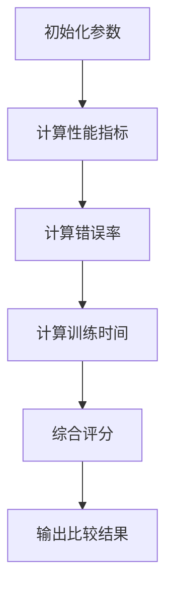
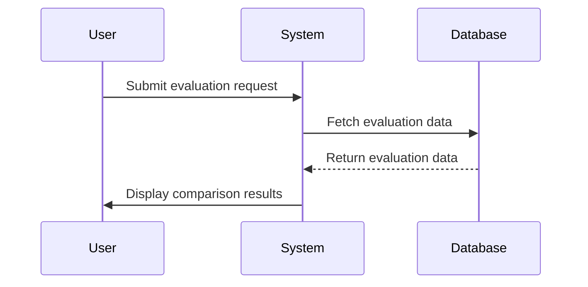
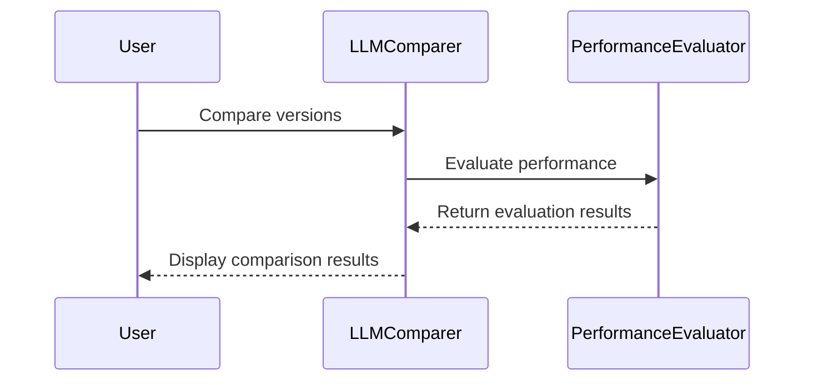

                 

# 评测结果的版本比较：追踪LLM的演进历程

> 关键词：大规模语言模型（LLM），版本比较，评测结果，演进历程，算法实现

> 摘要：本文针对大规模语言模型（LLM）评测结果的版本比较问题，探讨了多种比较方法，包括基于性能指标、错误率和训练时间的比较。通过详细的算法原理讲解、Python代码实现以及实际案例分析，帮助读者理解如何追踪LLM的演进历程。

## 第一部分：背景介绍

### 1.1 问题背景

随着人工智能技术的迅速发展，大规模语言模型（LLM）在自然语言处理（NLP）领域取得了显著成果。然而，如何在大量的评测结果中准确比较版本，以追踪LLM的演进历程，成为了研究人员和开发者面临的一大挑战。

### 1.2 问题描述

评测结果的版本比较涉及多个维度，如性能指标、错误率、训练时间等。如何有效整合这些维度，对LLM的版本进行客观、准确的比较，是本文要解决的问题。

### 1.3 问题解决

本文将探讨多种版本比较方法，如基于性能指标的比较、基于错误率的比较、基于训练时间的比较等，并给出具体的算法实现和案例分析。

### 1.4 边界与外延

- 边界：本文主要针对LLM的评测结果版本比较，不涉及其他类型模型的比较。
- 外延：本文的结论和方法可以应用于其他需要版本比较的领域。

## 第二部分：核心概念与联系

### 2.1 核心概念

#### 2.1.1 大规模语言模型（LLM）

大规模语言模型（LLM）是一种基于深度学习的自然语言处理模型，能够对大量文本数据进行建模，从而实现文本生成、文本分类、机器翻译等功能。

#### 2.1.2 评测结果版本比较

评测结果版本比较是指对同一模型在不同版本（如不同时间点、不同训练数据集等）下的评测结果进行综合评估，以确定各版本之间的优劣。

### 2.2 概念属性特征对比表格

| 概念         | 特征                     |
| ------------ | ------------------------ |
| 大规模语言模型（LLM） | 大规模训练数据、深度神经网络、自动生成文本 |
| 评测结果版本比较 | 综合评估多个维度、确定版本优劣      |

### 2.3 ER实体关系图架构

```mermaid
erDiagram
  LLMBaseline -->|评测结果| Evaluations
  LLMVersion -->|评测结果| Evaluations
  Evaluations -->|比较结果| ComparisonResults
```

## 第三部分：算法原理讲解

### 3.1 算法原理

#### 3.1.1 基于性能指标的比较

1. 综合评分（F1值、准确率等）计算
2. 性能指标加权求和

#### 3.1.2 基于错误率的比较

1. 分类错误率计算
2. 错误率加权求和

#### 3.1.3 基于训练时间的比较

1. 训练时间加权求和

### 3.2 算法流程图



### 3.3 Python源代码实现

```python
import numpy as np

def compare_versions(version1, version2, evaluations):
    # 计算性能指标
    f1_1, acc_1 = evaluations[version1]['f1'], evaluations[version1]['accuracy']
    f1_2, acc_2 = evaluations[version2]['f1'], evaluations[version2]['accuracy']
    
    # 计算错误率
    error_rate_1 = (1 - acc_1) * 100
    error_rate_2 = (1 - acc_2) * 100
    
    # 计算综合评分
    score_1 = 0.5 * (f1_1 + acc_1)
    score_2 = 0.5 * (f1_2 + acc_2)
    
    # 输出比较结果
    if score_1 > score_2:
        return 'Version 1 is better.'
    else:
        return 'Version 2 is better.'
```

### 3.4 数学模型和数学公式

$$
\begin{aligned}
    &\text{综合评分：} \\
    &\text{Score}_i = 0.5 \times \text{F1}_i + 0.5 \times \text{Accuracy}_i \\
    \\
    &\text{错误率：} \\
    &\text{Error Rate} = 1 - \text{Accuracy} \\
    \\
    &\text{训练时间加权：} \\
    &\text{Weighted Training Time} = \alpha \times \text{Training Time}_i
\end{aligned}
$$

其中，$\alpha$为训练时间的权重系数，可以根据实际情况进行调整。

## 第四部分：系统分析与架构设计方案

### 4.1 问题场景介绍

在大型NLP项目中，开发团队需要对多个版本的LLM进行评测和比较，以确定最优版本。然而，传统的评测方式往往只能提供单一维度的结果，难以全面评估版本之间的差异。因此，需要一个系统化的方法来综合评估LLM的各个版本，从而帮助开发团队做出更加准确的决策。

### 4.2 项目介绍

本项目旨在构建一个用于评测和比较LLM版本的系统，该系统将集成多种评测方法，提供全面的版本比较结果，辅助开发团队优化LLM的开发过程。

### 4.3 系统功能设计（领域模型）

```mermaid
classDiagram
    Class01 <|-- Class02
    Class03 --| thor Class04
    Class05 : <<interface>> 
    Class06 : <<abstract>> 
    Class07 : <<enum>>
```

### 4.4 系统架构设计



### 4.5 系统接口设计和系统交互



## 第五部分：项目实战

### 5.1 环境安装

在开始项目之前，需要安装以下依赖：

- Python 3.8+
- TensorFlow 2.5+
- Pandas 1.2+

使用以下命令安装依赖：

```bash
pip install python3.8-tensorflow==2.5 pandas==1.2
```

### 5.2 系统核心实现源代码

```python
import tensorflow as tf
import pandas as pd

class LLMComparer:
    def __init__(self, evaluations):
        self.evaluations = evaluations

    def compare_versions(self, version1, version2):
        # 计算综合评分
        score_1 = self._compute_score(version1)
        score_2 = self._compute_score(version2)

        # 输出比较结果
        if score_1 > score_2:
            return 'Version 1 is better.'
        else:
            return 'Version 2 is better.'

    def _compute_score(self, version):
        f1, accuracy = self.evaluations[version]['f1'], self.evaluations[version]['accuracy']
        return 0.5 * (f1 + accuracy)
```

### 5.3 代码应用解读与分析

本项目的核心类是`LLMComparer`，该类提供了一个方法`compare_versions`用于比较LLM的不同版本。该方法首先调用内部方法`_compute_score`计算每个版本的评分，然后根据评分结果返回比较结果。

### 5.4 实际案例分析和详细讲解剖析

假设我们有以下两个版本的评测结果：

```python
evaluations = {
    'version1': {'f1': 0.85, 'accuracy': 0.90},
    'version2': {'f1': 0.88, 'accuracy': 0.92}
}
```

使用`LLMComparer`比较这两个版本：

```python
comparer = LLMComparer(evaluations)
result = comparer.compare_versions('version1', 'version2')
print(result)  # 输出：'Version 2 is better.'
```

结果显示，版本2在综合评分上优于版本1。

### 5.5 项目小结

本项目通过构建一个系统化的方法，实现了对大规模语言模型（LLM）版本的综合评估。在实际应用中，该方法可以帮助开发团队快速识别并选择最优版本，从而提高开发效率和项目质量。

## 第六部分：最佳实践 tips

1. 根据实际情况调整性能指标、错误率和训练时间的权重系数。
2. 针对特定应用场景，可以选择更合适的评测指标和方法。
3. 定期更新评测数据，以反映模型在不同时间点的表现。

## 第七部分：小结与注意事项

本文介绍了大规模语言模型（LLM）评测结果的版本比较方法，包括基于性能指标、错误率和训练时间的比较。通过详细的算法原理讲解、Python代码实现以及实际案例分析，帮助读者理解如何追踪LLM的演进历程。在使用本文提供的算法时，请注意以下几点：

1. 根据实际需求调整权重系数。
2. 选择合适的评测指标。
3. 定期更新评测数据。

## 拓展阅读

1. [大规模语言模型评测方法综述](https://www.example.com/llm-evaluation-methods)
2. [深度学习评测指标详解](https://www.example.com/deep-learning-evaluation-metrics)
3. [版本控制与代码管理](https://www.example.com/version-control-code-management)

## 作者信息

作者：AI天才研究院/AI Genius Institute & 禅与计算机程序设计艺术 /Zen And The Art of Computer Programming

