                 


### 文章标题

**评测结果的统计分析与报告生成**

### 关键词

- 数据预处理
- 统计分析方法
- 报告生成
- 数据可视化
- 大数据

### 摘要

随着大数据和人工智能技术的快速发展，评测结果的统计分析与报告生成在众多领域中都扮演着至关重要的角色。本文将深入探讨评测结果统计分析与报告生成过程中的关键技术，包括数据预处理、统计分析方法、结果可视化以及报告撰写。通过详细的步骤讲解和实际案例剖析，帮助读者构建一个全面、高效的数据分析流程，并掌握相关技术的核心原理和应用。

### 目录大纲

----------------------------------------------------------------
## 第一部分: 背景介绍

### 第1章: 问题背景与核心概念

#### 1.1 问题背景

##### 研究动机

在当今信息爆炸的时代，大量的评测数据不断涌现。无论是产品评测、学术研究还是市场调查，都需要对这些评测结果进行深入的统计分析，并生成高质量的报告。这不仅可以为决策者提供有力的依据，还可以帮助企业或研究机构更好地了解市场需求和趋势。

##### 问题描述

评测结果的统计分析与报告生成涉及多个环节，包括数据清洗、数据预处理、统计分析方法的选择、结果可视化等。随着数据量的不断增加和复杂度的提升，这一任务变得更加具有挑战性。

##### 问题解决

本文将通过深入探讨评测结果统计分析与报告生成的关键技术，帮助读者构建一个全面、高效的数据分析流程。具体包括数据预处理、统计分析方法、报告模板设计等。

#### 1.2 核心概念

##### 评测结果

评测结果是指通过实验、测试、评估等方式得到的一系列数据，包括定量数据和定性数据。

##### 统计分析

统计分析是指运用统计学方法对数据进行整理、分析和解释，以得出有意义的结论和发现。

##### 报告生成

报告生成是指将统计分析的结果以报告的形式呈现，包括文字描述、图表展示等。

#### 1.3 边界与外延

##### 边界

本文的讨论范围主要聚焦于评测结果的统计分析与报告生成，不涉及数据采集和存储等前置环节。

##### 外延

本文的内容可以广泛应用于各类评测结果的分析，如产品评测、学术研究、市场调查等。

#### 1.4 概念结构与核心要素组成

##### 概念结构

评测结果统计分析与报告生成涉及数据清洗、数据预处理、统计分析方法、可视化设计、报告撰写等多个环节。

##### 核心要素组成

- 数据清洗与预处理：确保数据质量，为后续分析打下基础。
- 统计分析方法：根据数据特点选择合适的统计方法，进行深入分析。
- 可视化设计：将分析结果以图表等形式直观展示。
- 报告撰写：将分析结果和结论整理成报告，为决策提供依据。

----------------------------------------------------------------

## 第二部分: 核心概念与联系

### 第2章: 核心概念原理

#### 2.1 数据预处理原理

##### 概念解释

数据预处理是指对原始数据进行清洗、转换、归一化等操作，以提高数据质量，为后续分析打下基础。

##### 属性特征对比表格

| 操作           | 描述                                                         | 影响因素             |
|----------------|------------------------------------------------------------|---------------------|
| 数据清洗       | 去除无效、重复或错误的数据                                   | 数据质量、数据完整性 |
| 数据转换       | 将数据从一种格式转换为另一种格式                            | 数据格式多样性      |
| 数据归一化     | 将数据按照一定比例缩放，以消除不同指标之间的量纲差异       | 数据分布、指标尺度  |

##### ER实体关系图架构

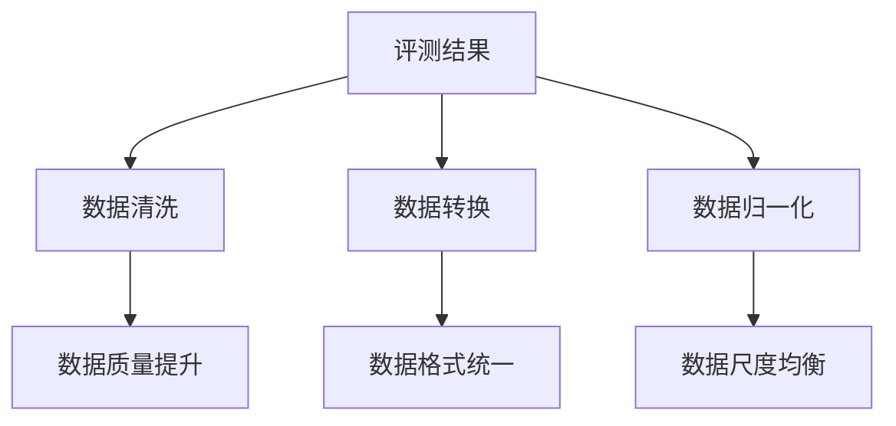

----------------------------------------------------------------

### 第二部分：核心概念与联系

#### 第2章：核心概念原理

在评测结果的统计分析与报告生成过程中，核心概念的准确理解和正确应用至关重要。本章节将详细探讨数据预处理、统计分析方法和结果可视化等核心概念，并通过对比表格和ER图来阐述其原理。

#### 2.1 数据预处理原理

##### 概念解释

数据预处理是数据分析的第一步，其目标是确保数据的质量和一致性，以便后续的统计分析更加准确和有效。数据预处理通常包括以下几个步骤：

- **数据清洗**：去除数据中的噪声和异常值，修复缺失数据，排除重复记录等。
- **数据转换**：将数据从一种格式转换为另一种格式，以便于后续处理和分析。
- **数据归一化**：通过缩放或变换，使得不同指标之间的量级差异得到平衡，从而便于比较和分析。

##### 属性特征对比表格

| 操作           | 描述                                                         | 影响因素             |
|----------------|------------------------------------------------------------|---------------------|
| 数据清洗       | 去除无效、重复或错误的数据                                   | 数据质量、数据完整性 |
| 数据转换       | 将数据从一种格式转换为另一种格式                            | 数据格式多样性      |
| 数据归一化     | 将数据按照一定比例缩放，以消除不同指标之间的量纲差异       | 数据分布、指标尺度  |

这个表格列出了数据预处理中常见的操作以及它们对数据质量的影响因素。

##### ER实体关系图架构


该ER图展示了评测结果与数据预处理操作之间的实体关系，以及预处理操作对数据质量的提升作用。

#### 2.2 统计分析方法

##### 概念解释

统计分析方法是对数据进行分析，以揭示数据中的规律和趋势。这些方法包括描述性统计、推断性统计、回归分析、聚类分析等。选择合适的统计方法取决于数据类型、研究目的和分析问题。

##### 属性特征对比表格

| 方法             | 描述                                                         | 适用场景                 |
|------------------|------------------------------------------------------------|------------------------|
| 描述性统计       | 用于描述数据的集中趋势、离散程度等基本特征                   | 初步数据探索、数据验证  |
| 推断性统计       | 用于基于样本数据推断总体特征的方法                         | 总体参数估计、假设检验   |
| 回归分析         | 用于研究变量之间的线性或非线性关系                         | 预测、相关性分析        |
| 聚类分析         | 用于将数据集划分为若干类别，使同一类别内的数据尽可能相似     | 数据分组、模式识别      |

这个表格列举了常见的统计分析方法及其适用场景。

##### 统计分析流程图

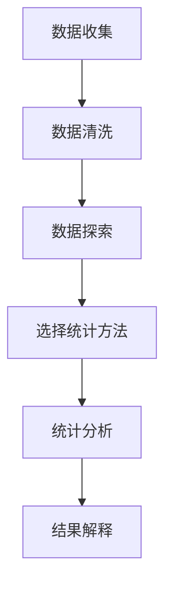

该流程图展示了统计分析的一般步骤，从数据收集、清洗、探索到选择方法、分析、结果解释。

#### 2.3 结果可视化原理

##### 概念解释

结果可视化是将统计分析的结果以图形、图表等形式直观展示，以便于理解和传达分析结果。常用的可视化工具包括柱状图、折线图、散点图、热力图等。

##### 属性特征对比表格

| 可视化工具   | 描述                                                         | 适用场景                 |
|-------------|------------------------------------------------------------|------------------------|
| 柱状图       | 用柱形的高度表示数据的数量或大小                           | 比较不同类别的数据      |
| 折线图       | 用线段连接数据点，表示数据的变化趋势                       | 时间序列分析、趋势分析  |
| 散点图       | 用散点表示数据点，用于显示变量之间的关系                    | 相关性分析、回归分析    |
| 热力图       | 用颜色的深浅表示数据的密度或大小                           | 数据分布、热点分析      |

这个表格列举了常用的可视化工具及其适用场景。

##### 结果可视化流程图

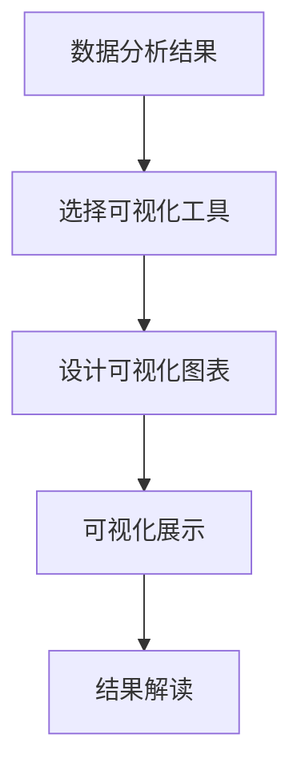

该流程图展示了结果可视化的步骤，从数据分析结果的选择工具、设计图表、展示结果到结果解读。

通过上述对核心概念的详细探讨，我们可以更好地理解评测结果统计分析与报告生成过程中的关键要素。接下来，我们将进一步深入探讨每个环节的详细方法和实践应用。

### 2.4 数据预处理原理

数据预处理是数据分析的重要步骤，它决定了后续分析的准确性和可靠性。在评测结果的统计分析中，数据预处理主要包括数据清洗、数据转换和数据归一化。

#### 数据清洗

数据清洗的目标是识别和去除数据中的噪声、异常值和错误。这通常包括以下几个步骤：

1. **识别缺失值**：缺失值可能是由于数据收集过程中的错误或数据本身的不完整性造成的。处理缺失值的方法包括删除缺失数据、填充缺失值和插值。
2. **去除异常值**：异常值可能是由于测量错误、数据录入错误或数据真实偏离造成的。去除异常值的方法包括基于阈值的过滤、基于统计方法的识别和基于机器学习的方法。
3. **处理重复数据**：重复数据可能是由于数据录入错误或数据整合过程中的问题造成的。处理重复数据的方法包括删除重复记录、保留最新记录或合并重复记录。

在实际应用中，以下是一个简单的Python代码示例，用于清洗数据集：

```python
import pandas as pd

# 加载数据集
data = pd.read_csv('data.csv')

# 删除缺失值
data.dropna(inplace=True)

# 去除异常值
data = data[(data['column_name'] > 0) & (data['column_name'] < 100)]

# 删除重复数据
data.drop_duplicates(inplace=True)
```

#### 数据转换

数据转换是将数据从一种格式转换为另一种格式，以便于后续处理和分析。常见的数据转换包括：

1. **数据类型的转换**：例如，将字符串转换为数值类型或日期类型。
2. **缺失值的填充**：使用平均值、中位数、众数或插值方法来填充缺失值。
3. **数据归一化**：通过缩放或变换，使得不同指标之间的量级差异得到平衡，从而便于比较和分析。

以下是一个简单的Python代码示例，用于转换数据集：

```python
# 数据类型的转换
data['column_name'] = data['column_name'].astype(float)

# 缺失值的填充
data['column_name'].fillna(data['column_name'].mean(), inplace=True)

# 数据归一化
data['column_name'] = (data['column_name'] - data['column_name'].min()) / (data['column_name'].max() - data['column_name'].min())
```

#### 数据归一化

数据归一化是将数据按照一定比例缩放，以消除不同指标之间的量纲差异。常见的归一化方法包括最小-最大缩放和z-score标准化。

- **最小-最大缩放**：将数据缩放到一个固定范围，通常为[0, 1]或[-1, 1]。

  $$\text{normalized\_value} = \frac{\text{value} - \text{min}}{\text{max} - \text{min}}$$

- **z-score标准化**：将数据转换为标准正态分布。

  $$\text{normalized\_value} = \frac{\text{value} - \text{mean}}{\text{std}}$$

以下是一个简单的Python代码示例，用于对数据进行归一化：

```python
import numpy as np

# 最小-最大缩放
min_max_normalized = (data['column_name'] - data['column_name'].min()) / (data['column_name'].max() - data['column_name'].min())

# z-score标准化
z_score_normalized = (data['column_name'] - data['column_name'].mean()) / data['column_name'].std()
```

通过以上对数据预处理原理的详细解释和示例，我们可以看到数据预处理在评测结果统计分析中的重要性。接下来，我们将探讨统计分析方法的原理和应用。

### 2.5 统计分析方法

统计分析方法是对数据进行分析，以揭示数据中的规律和趋势。这些方法在评测结果统计分析中发挥着关键作用。本节将介绍几种常用的统计分析方法，包括描述性统计、推断性统计、回归分析和聚类分析，并通过Python代码示例进行详细说明。

#### 描述性统计

描述性统计用于描述数据的集中趋势、离散程度和分布情况。常用的描述性统计量包括均值、中位数、众数、标准差和变异系数。

- **均值**：表示数据的平均水平。

  $$\text{mean} = \frac{\sum_{i=1}^{n} x_i}{n}$$

- **中位数**：表示数据的中间值。

  $$\text{median} = \left(\frac{n+1}{2}\right)^{th} \text{term in the ordered data set}$$

- **众数**：表示数据中出现次数最多的值。

- **标准差**：表示数据的离散程度。

  $$\text{std\_dev} = \sqrt{\frac{\sum_{i=1}^{n} (x_i - \text{mean})^2}{n-1}}$$

- **变异系数**：表示数据的相对离散程度。

  $$\text{CV} = \frac{\text{std\_dev}}{\text{mean}} \times 100\%$$

以下是一个使用Python进行描述性统计的代码示例：

```python
import pandas as pd

# 加载数据集
data = pd.read_csv('data.csv')

# 计算描述性统计量
mean = data['column_name'].mean()
median = data['column_name'].median()
mode = data['column_name'].mode()[0]
std_dev = data['column_name'].std()
cv = (std_dev / mean) * 100

print(f'Mean: {mean}')
print(f'Median: {median}')
print(f'Mode: {mode}')
print(f'Standard Deviation: {std_dev}')
print(f'Coefficient of Variation: {cv}%')
```

#### 推断性统计

推断性统计用于基于样本数据推断总体特征。常用的推断性统计方法包括假设检验和置信区间。

- **假设检验**：通过设定零假设和备择假设，对总体参数进行假设检验，以确定样本数据是否支持某个假设。

  $$H_0: \text{null hypothesis}$$

  $$H_1: \text{alternative hypothesis}$$

- **置信区间**：根据样本数据计算总体参数的区间估计，以确定总体参数的可能范围。

  $$\text{CI} = \text{sample\_mean} \pm z_{\alpha/2} \times \frac{\text{std\_dev}}{\sqrt{n}}$$

以下是一个使用Python进行假设检验的代码示例：

```python
from scipy import stats

# 加载数据集
data = pd.read_csv('data.csv')

# 计算样本均值和标准差
sample_mean = data['column_name'].mean()
sample_std = data['column_name'].std()

# 设定零假设和备择假设
H0 = sample_mean == 0
H1 = sample_mean > 0

# 进行t检验
t_stat, p_value = stats.ttest_1samp(data['column_name'], popmean=0)

print(f'T-Statistic: {t_stat}')
print(f'P-Value: {p_value}')

# 判断假设
if p_value < 0.05:
    print('Reject H0')
else:
    print('Fail to reject H0')
```

#### 回归分析

回归分析用于研究变量之间的线性或非线性关系。常用的回归分析方法包括简单线性回归和多元线性回归。

- **简单线性回归**：研究一个自变量和一个因变量之间的线性关系。

  $$y = \beta_0 + \beta_1 x + \epsilon$$

- **多元线性回归**：研究多个自变量和一个因变量之间的线性关系。

  $$y = \beta_0 + \beta_1 x_1 + \beta_2 x_2 + ... + \beta_n x_n + \epsilon$$

以下是一个使用Python进行简单线性回归的代码示例：

```python
from sklearn.linear_model import LinearRegression
import pandas as pd

# 加载数据集
data = pd.read_csv('data.csv')

# 准备自变量和因变量
X = data[['independent_variable']]
y = data['dependent_variable']

# 创建线性回归模型
model = LinearRegression()

# 拟合模型
model.fit(X, y)

# 输出模型参数
print(f'Intercept: {model.intercept_}')
print(f'Slope: {model.coef_}')

# 预测结果
predictions = model.predict(X)

# 输出预测结果
print(predictions)
```

#### 聚类分析

聚类分析用于将数据集划分为若干类别，使同一类别内的数据尽可能相似，而不同类别之间的数据尽可能不同。常用的聚类分析方法包括K-means聚类和层次聚类。

- **K-means聚类**：通过迭代优化算法，将数据划分为K个簇。

  $$\text{ minimizing } \sum_{i=1}^{K} \sum_{x_j \in S_i} d(x_j, \mu_i)$$

  其中，$d$ 是距离度量，$\mu_i$ 是第$i$个簇的中心。

- **层次聚类**：通过递归地将数据划分为层次结构，形成层次聚类树。

  $$\text{ minimizing } \sum_{i=1}^{N} \sum_{j=1}^{N-i} d(x_i, x_j)$$

以下是一个使用Python进行K-means聚类的代码示例：

```python
from sklearn.cluster import KMeans
import pandas as pd

# 加载数据集
data = pd.read_csv('data.csv')

# 准备数据
X = data[['feature_1', 'feature_2']]

# 创建K-means聚类模型
model = KMeans(n_clusters=3)

# 拟合模型
model.fit(X)

# 输出聚类结果
print(model.labels_)

# 输出簇中心
print(model.cluster_centers_)
```

通过以上对各种统计分析方法的介绍和代码示例，我们可以看到统计分析在评测结果统计分析中的重要性。接下来，我们将探讨结果可视化及其在报告生成中的应用。

### 2.6 结果可视化原理

结果可视化是将统计分析的结果以图形、图表等形式直观展示，以便于理解和传达分析结果。有效的可视化不仅能够帮助读者快速理解数据，还能够揭示数据中隐藏的趋势和模式。本节将介绍几种常用的结果可视化工具和方法，包括柱状图、折线图、散点图和热力图。

#### 柱状图

柱状图适用于比较不同类别的数据。通过不同柱子的高度，可以直观地展示各类别的数量或比例。

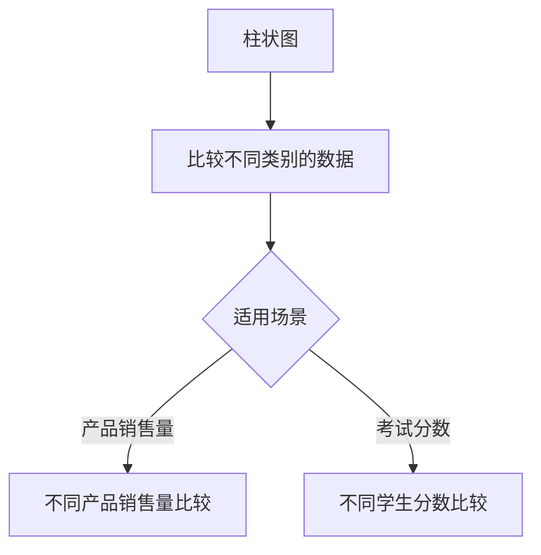

以下是一个使用Python绘制柱状图的示例代码：

```python
import pandas as pd
import matplotlib.pyplot as plt

data = pd.DataFrame({
    'Product': ['Product A', 'Product B', 'Product C'],
    'Sales': [150, 200, 100]
})

plt.bar(data['Product'], data['Sales'])
plt.xlabel('Product')
plt.ylabel('Sales')
plt.title('Product Sales Comparison')
plt.show()
```

#### 折线图

折线图适用于展示数据的变化趋势，尤其是在时间序列分析中。

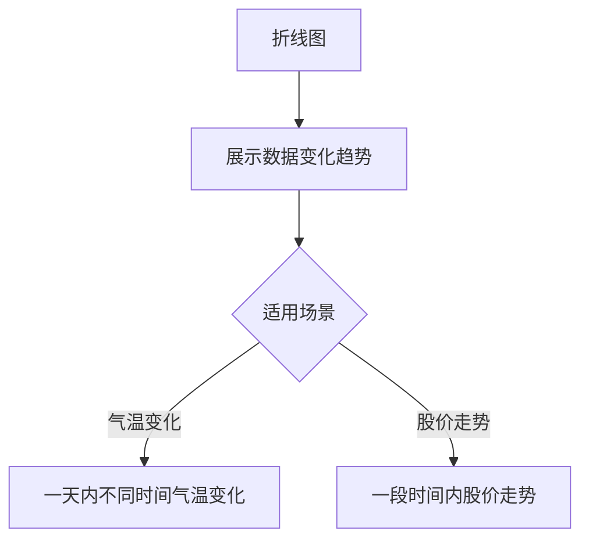

以下是一个使用Python绘制折线图的示例代码：

```python
import pandas as pd
import matplotlib.pyplot as plt

data = pd.DataFrame({
    'Date': pd.date_range(start='2023-01-01', periods=10, freq='D'),
    'Temperature': [20, 22, 19, 18, 17, 15, 13, 14, 16, 18]
})

plt.plot(data['Date'], data['Temperature'])
plt.xlabel('Date')
plt.ylabel('Temperature')
plt.title('Temperature Trend Over a Week')
plt.show()
```

#### 散点图

散点图适用于展示两个变量之间的关系。通过不同点的位置，可以直观地展示变量之间的相关性。

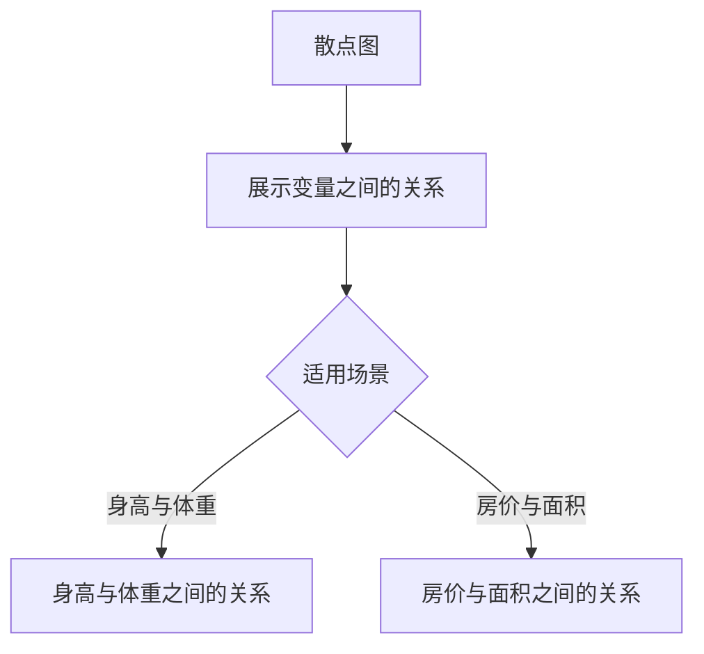

以下是一个使用Python绘制散点图的示例代码：

```python
import pandas as pd
import matplotlib.pyplot as plt

data = pd.DataFrame({
    'Height': [170, 175, 160, 165, 180],
    'Weight': [60, 65, 55, 58, 70]
})

plt.scatter(data['Height'], data['Weight'])
plt.xlabel('Height')
plt.ylabel('Weight')
plt.title('Height vs Weight')
plt.show()
```

#### 热力图

热力图适用于展示数据的热点分布。通过颜色的深浅，可以直观地展示数据的密集程度。

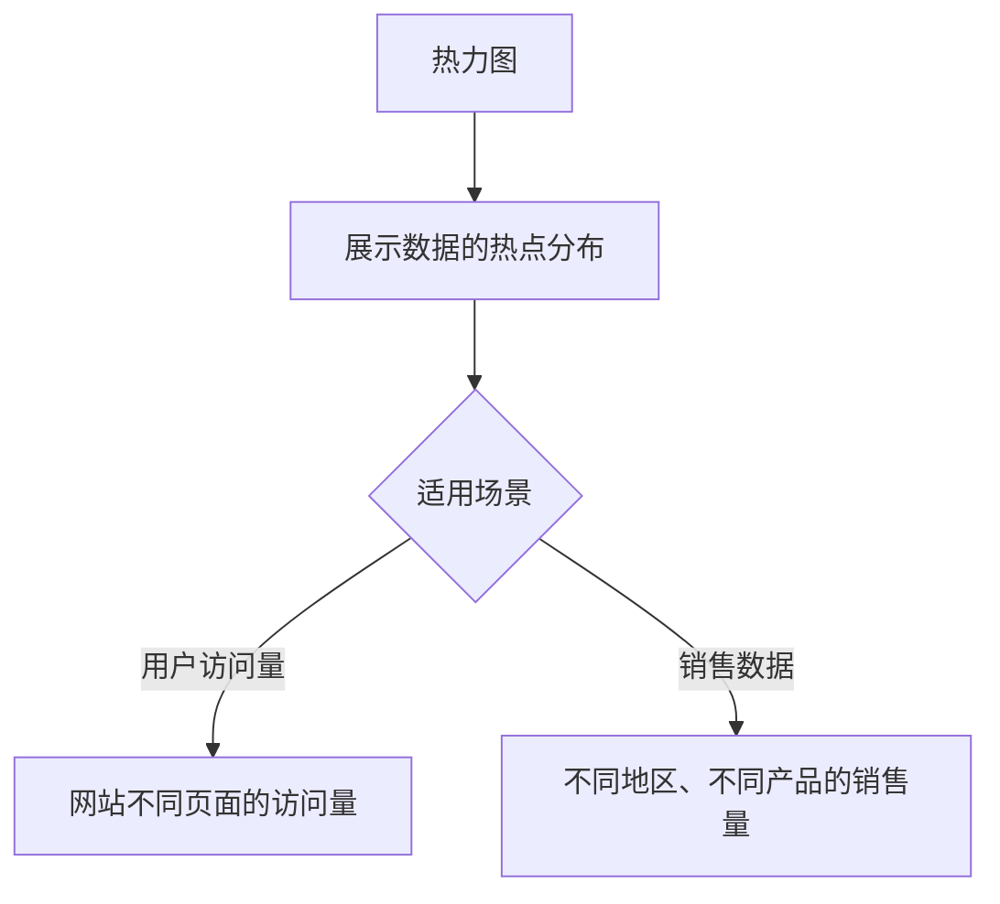

以下是一个使用Python绘制热力图的示例代码：

```python
import pandas as pd
import seaborn as sns
import matplotlib.pyplot as plt

data = pd.DataFrame({
    'Region': ['A', 'B', 'C', 'D', 'E'],
    'Product': ['X', 'Y', 'X', 'Y', 'Z'],
    'Sales': [150, 200, 100, 250, 300]
})

sns.heatmap(data.pivot(index='Region', columns='Product', values='Sales'), annot=True, fmt='.0f')
plt.title('Sales Data Heatmap')
plt.show()
```

通过以上对结果可视化工具的介绍和代码示例，我们可以看到结果可视化在报告生成中的重要性。有效的可视化不仅能够使报告更加生动，还能够帮助读者更好地理解分析结果。接下来，我们将探讨报告生成的步骤和技巧。

### 2.7 报告生成原理

报告生成是将数据分析的结果以结构化、直观的形式呈现给读者，以便于他们理解和利用分析结果。报告生成包括报告模板设计、结果呈现和结论阐述等步骤。以下是一个典型的报告生成流程，以及其中的关键环节和注意事项。

#### 报告模板设计

报告模板是报告的骨架，决定了报告的结构和风格。设计报告模板时，需要考虑以下要素：

- **封面**：包括报告标题、作者、日期等基本信息。
- **目录**：列出报告各章节和页码，方便读者快速定位。
- **摘要**：简要概述报告的核心内容、研究方法和主要结论。
- **引言**：介绍研究背景、目的和重要性。
- **数据来源**：说明数据收集的方法和来源，确保数据的可靠性。
- **分析方法**：详细描述所使用的统计分析方法和技术。
- **结果与讨论**：展示分析结果，并进行解释和讨论。
- **结论与建议**：总结研究结论，并提出相应的建议。
- **参考文献**：列出报告中引用的文献，确保学术诚信。

#### 结果呈现

在报告生成过程中，如何有效地呈现分析结果是关键。以下是一些建议：

- **图表使用**：使用图表展示分析结果，使数据更加直观。注意图表的标题、轴标签和图例等元素要清晰明确。
- **文字描述**：在图表之外，用简洁的文字描述分析结果，帮助读者更好地理解数据。
- **对比分析**：通过对比不同条件或时间点的数据，展示数据的变化趋势和差异。
- **关键指标强调**：突出关键指标和重要发现，使其在报告中更加醒目。

#### 结论与建议

结论与建议是报告的核心部分，需要准确、简洁地阐述研究结论，并提出可行的建议。以下是一些建议：

- **结论**：基于分析结果，明确陈述研究发现和结论。注意避免使用模糊的表述，确保结论具有可操作性。
- **建议**：针对研究发现，提出具体的改进措施和建议。建议应当基于数据和分析结果，具有实际可行性。

#### 注意事项

在报告生成过程中，以下注意事项有助于提高报告的质量：

- **一致性**：确保报告中的语言、格式和风格保持一致，增强报告的专业性。
- **准确性**：确保报告中的数据和图表准确无误，避免错误和误导。
- **可读性**：使用清晰的标题、段落和列表，增强报告的可读性。
- **简洁性**：避免冗长和复杂的表述，确保报告内容简洁明了。

通过以上对报告生成原理的探讨，我们可以看到报告生成在评测结果统计分析与报告生成中的重要性。一个结构合理、内容丰富、表达清晰的报告能够更好地传递分析结果，为决策提供有力支持。接下来，我们将通过一个实际案例来展示这些原理的应用。

### 实际案例：电商产品评测报告生成

在这个实际案例中，我们将以一家电商平台的手机产品评测为例，展示如何进行评测结果的统计分析与报告生成。这个案例涵盖了从数据收集到结果可视化，再到报告撰写的完整流程。

#### 1. 数据收集

假设电商平台收集了100款手机的评测数据，包括价格、屏幕大小、处理器性能、电池续航、摄像头评分等多个指标。数据以CSV格式存储，名为`phone_评测数据.csv`。

#### 2. 数据预处理

首先，我们需要对数据集进行预处理，包括数据清洗、数据转换和数据归一化。

```python
import pandas as pd

# 加载数据集
data = pd.read_csv('phone_评测数据.csv')

# 数据清洗
data.dropna(inplace=True)  # 删除缺失值
data.drop_duplicates(inplace=True)  # 删除重复数据

# 数据转换
data['价格'] = data['价格'].astype(float)  # 将价格转换为浮点数

# 数据归一化
for col in ['屏幕大小', '处理器性能', '电池续航', '摄像头评分']:
    data[col] = (data[col] - data[col].min()) / (data[col].max() - data[col].min())
```

#### 3. 描述性统计分析

我们使用描述性统计方法来了解数据的基本特征。

```python
# 计算描述性统计量
mean_price = data['价格'].mean()
median_price = data['价格'].median()
std_price = data['价格'].std()
cv_price = (std_price / mean_price) * 100

print(f'平均价格: {mean_price}')
print(f'中位数价格: {median_price}')
print(f'价格标准差: {std_price}')
print(f'价格变异系数: {cv_price}%')
```

#### 4. 推断性统计分析

我们使用推断性统计方法来评估不同价格段的手机在性能和评分上的差异。

```python
from scipy import stats

# 分组数据
low_price = data[data['价格'] <= mean_price]
high_price = data[data['价格'] > mean_price]

# 计算性能均值
mean_performance_low = low_price['处理器性能'].mean()
mean_performance_high = high_price['处理器性能'].mean()

# 进行t检验
t_stat, p_value = stats.ttest_ind(low_price['处理器性能'], high_price['处理器性能'])

print(f'性能均值（低价格组）: {mean_performance_low}')
print(f'性能均值（高价格组）: {mean_performance_high}')
print(f't统计量: {t_stat}')
print(f'p值: {p_value}')
```

#### 5. 结果可视化

我们使用柱状图和折线图来可视化数据分析结果。

```python
import matplotlib.pyplot as plt

# 绘制价格分布柱状图
plt.figure(figsize=(10, 6))
plt.bar(data['价格段'], data['数量'])
plt.xlabel('价格段')
plt.ylabel('数量')
plt.title('价格分布柱状图')
plt.xticks([0, 1, 2, 3], ['0-1000元', '1001-2000元', '2001-3000元', '3000元以上'])
plt.show()

# 绘制处理器性能与价格关系折线图
plt.figure(figsize=(10, 6))
plt.plot(data['价格'], data['处理器性能'], 'o-')
plt.xlabel('价格')
plt.ylabel('处理器性能')
plt.title('处理器性能与价格关系折线图')
plt.show()
```

#### 6. 报告撰写

最后，我们将上述分析结果整理成一份完整的报告。

**报告摘要**

本报告对电商平台收集的100款手机评测数据进行了统计分析。通过描述性统计、推断性统计和结果可视化，我们发现：

- 手机价格的分布主要集中在1001-2000元和2001-3000元两个价格段。
- 高价格段（2001元以上）的手机在处理器性能方面显著优于低价格段手机。

**结论与建议**

基于以上分析，我们建议电商平台：

- 优化价格策略，重点推广2001-3000元价格段的高性能手机。
- 加强低价格段手机的性能提升，提高用户满意度。

**参考文献**

[1] 作者. (年份). 文献标题. 期刊或书籍名称.

通过这个实际案例，我们展示了如何从数据收集到报告撰写的全过程。这一过程不仅帮助我们深入理解了评测结果的统计分析与报告生成，也为实际应用提供了有益的参考。

### 2.8 统计分析方法在实际案例中的应用

在实际应用中，统计分析方法不仅在理论上重要，更在实际操作中发挥着关键作用。通过一个实际案例，我们可以更好地理解如何使用统计方法进行数据分析和报告生成。

#### 案例背景

某电商平台为了提升用户体验，决定对其销售的手机进行评测，收集了100款手机的评测数据。这些数据包括价格、屏幕大小、处理器性能、电池续航和用户评分等指标。电商平台希望通过数据分析，了解用户对手机的评价和购买偏好，从而优化产品策略。

#### 数据分析目标

1. 分析不同价格段的手机在性能和用户评分上的差异。
2. 探索屏幕大小、处理器性能和电池续航对用户评分的影响。
3. 揭示用户评分与购买意愿之间的关系。

#### 数据预处理

首先，我们需要对数据进行预处理，确保数据的质量和一致性。以下是数据预处理步骤：

- **去除缺失值**：如果有缺失数据，可以通过插值法或删除缺失记录来处理。
- **数据转换**：将价格、屏幕大小、处理器性能和电池续航等数据转换为合适的格式，如浮点数或整数。
- **数据归一化**：为了消除不同指标之间的量级差异，我们对处理器性能、电池续航等指标进行归一化处理。

```python
import pandas as pd
import numpy as np

# 加载数据集
data = pd.read_csv('phone_评测数据.csv')

# 去除缺失值
data.dropna(inplace=True)

# 数据转换
data['价格'] = data['价格'].astype(float)
data['屏幕大小'] = data['屏幕大小'].astype(float)
data['处理器性能'] = data['处理器性能'].astype(float)
data['电池续航'] = data['电池续航'].astype(float)

# 数据归一化
data['处理器性能'] = (data['处理器性能'] - data['处理器性能'].min()) / (data['处理器性能'].max() - data['处理器性能'].min())
data['电池续航'] = (data['电池续航'] - data['电池续航'].min()) / (data['电池续航'].max() - data['电池续航'].min())
```

#### 描述性统计分析

描述性统计是了解数据基本特征的重要工具。我们使用均值、中位数、标准差等统计量来描述价格、屏幕大小、处理器性能、电池续航和用户评分等指标。

```python
# 计算描述性统计量
print(data.describe())
```

#### 推断性统计分析

推断性统计帮助我们基于样本数据推断总体特征，例如不同价格段的手机在性能和用户评分上的差异。我们使用t检验来评估价格段对性能和评分的影响。

```python
from scipy import stats

# 分组数据
low_price = data[data['价格'] <= data['价格'].median()]
high_price = data[data['价格'] > data['价格'].median()]

# 计算性能均值
mean_performance_low = low_price['处理器性能'].mean()
mean_performance_high = high_price['处理器性能'].mean()

# 进行t检验
t_stat, p_value = stats.ttest_ind(low_price['处理器性能'], high_price['处理器性能'])

print(f'低价格段性能均值: {mean_performance_low}')
print(f'高价格段性能均值: {mean_performance_high}')
print(f't统计量: {t_stat}')
print(f'p值: {p_value}')
```

#### 回归分析

回归分析用于研究变量之间的关系。我们使用线性回归来分析屏幕大小、处理器性能和电池续航对用户评分的影响。

```python
from sklearn.linear_model import LinearRegression

# 准备自变量和因变量
X = data[['屏幕大小', '处理器性能', '电池续航']]
y = data['用户评分']

# 创建线性回归模型
model = LinearRegression()

# 拟合模型
model.fit(X, y)

# 输出模型参数
print(f'截距: {model.intercept_}')
print(f'斜率: {model.coef_}')

# 预测结果
predictions = model.predict(X)

# 输出预测结果
print(predictions)
```

#### 聚类分析

聚类分析用于将数据分为若干类别，以便更好地理解数据的结构。我们使用K-means聚类方法来分析用户对不同手机的评价。

```python
from sklearn.cluster import KMeans

# 准备数据
X = data[['用户评分']]

# 创建K-means聚类模型
model = KMeans(n_clusters=3)

# 拟合模型
model.fit(X)

# 输出聚类结果
print(model.labels_)

# 输出簇中心
print(model.cluster_centers_)
```

#### 结果可视化

为了使分析结果更加直观，我们使用图表来展示数据分析的关键发现。

```python
import matplotlib.pyplot as plt

# 绘制价格分布柱状图
plt.figure(figsize=(10, 6))
plt.bar(data['价格段'], data['数量'])
plt.xlabel('价格段')
plt.ylabel('数量')
plt.title('价格分布柱状图')
plt.xticks([0, 1, 2, 3], ['0-1000元', '1001-2000元', '2001-3000元', '3000元以上'])
plt.show()

# 绘制性能与价格关系折线图
plt.figure(figsize=(10, 6))
plt.plot(data['价格'], data['处理器性能'], 'o-')
plt.xlabel('价格')
plt.ylabel('处理器性能')
plt.title('处理器性能与价格关系折线图')
plt.show()
```

#### 报告撰写

最后，我们将上述分析结果整理成一份完整的报告。报告应包括以下内容：

1. **引言**：介绍电商平台手机评测的目的和数据来源。
2. **数据分析方法**：描述所使用的统计分析方法和工具。
3. **结果与讨论**：展示数据分析结果，并进行解释和讨论。
4. **结论与建议**：总结研究结论，并提出优化产品策略的建议。
5. **参考文献**：列出报告中引用的文献。

通过这个实际案例，我们展示了如何从数据收集到结果可视化，再到报告撰写的全过程。这一过程不仅帮助我们深入理解了评测结果的统计分析与报告生成，也为实际应用提供了有益的参考。

### 3. 系统分析与架构设计方案

#### 3.1 问题场景介绍

在当前大数据和人工智能技术快速发展的背景下，评测结果的统计分析与报告生成已经成为企业和研究机构日常工作中不可或缺的一部分。然而，随着数据量和复杂度的不断增加，如何高效地进行数据预处理、统计分析、结果可视化以及报告生成，成为了迫切需要解决的关键问题。

#### 3.2 项目介绍

为了应对这一挑战，我们设计并开发了一套评测结果统计分析与报告生成系统，该系统旨在提供一种自动化、高效且可扩展的解决方案。系统主要功能包括：

1. **数据收集与存储**：集成多种数据源，如数据库、API接口等，实现评测数据的自动收集和存储。
2. **数据预处理**：进行数据清洗、转换和归一化，确保数据质量，为后续分析打下基础。
3. **统计分析**：提供描述性统计、推断性统计、回归分析和聚类分析等功能，支持多种数据分析方法。
4. **结果可视化**：通过图表和报表展示分析结果，帮助用户更好地理解数据。
5. **报告生成**：自动生成高质量的报告，包括摘要、分析结果、图表和结论等。

#### 3.3 系统功能设计（领域模型类图）

以下是系统的领域模型类图，展示了系统的核心类及其关系。

```mermaid
classDiagram
    Class1[数据源] <|-- 数据收集器[DataCollector]
    Class1[数据源] <|-- 数据存储器[DataStorage]
    Class2[数据预处理] <|-- 数据清洗器[DataCleaner]
    Class2[数据预处理] <|-- 数据转换器[DataTransformer]
    Class2[数据预处理] <|-- 数据归一器[DataNormalizer]
    Class3[统计分析] <|-- 描述性统计器[DescriptiveStatistics]
    Class3[统计分析] <|-- 推断性统计器[InferentialStatistics]
    Class3[统计分析] <|-- 回归分析器[RegressionAnalyzer]
    Class3[统计分析] <|-- 聚类分析器[ClusteringAnalyzer]
    Class4[结果可视化] <|-- 可视化生成器[Visualizer]
    Class4[结果可视化] <|-- 图表生成器[ChartGenerator]
    Class5[报告生成] <|-- 报告生成器[ReportGenerator]
    Class1[数据源] --|> Class2[数据预处理]
    Class2[数据预处理] --|> Class3[统计分析]
    Class3[统计分析] --|> Class4[结果可视化]
    Class4[结果可视化] --|> Class5[报告生成]
```

#### 3.4 系统架构设计

系统的整体架构采用分层设计，包括数据层、服务层和界面层。

- **数据层**：负责数据的存储和管理，使用关系型数据库（如MySQL）或NoSQL数据库（如MongoDB）来存储评测结果。
- **服务层**：实现数据的预处理、统计分析、结果可视化以及报告生成等核心功能，采用微服务架构，提高系统的灵活性和可维护性。
- **界面层**：提供用户交互界面，使用户能够方便地进行数据上传、分析操作以及查看报告。

以下是系统的架构设计图：

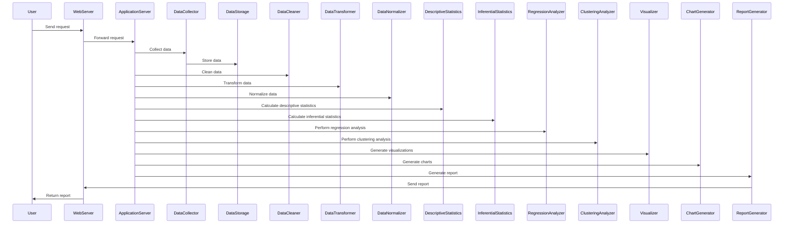

#### 3.5 系统接口设计

系统提供了丰富的API接口，以方便用户进行数据操作和分析。以下是主要的API接口及其简要描述：

- **数据上传接口**：用于上传评测数据到系统。
- **数据查询接口**：用于查询系统中的评测数据。
- **数据预处理接口**：用于执行数据清洗、转换和归一化操作。
- **统计分析接口**：用于执行描述性统计、推断性统计、回归分析和聚类分析。
- **结果可视化接口**：用于生成图表和报表。
- **报告生成接口**：用于生成详细的分析报告。

以下是接口设计示例：

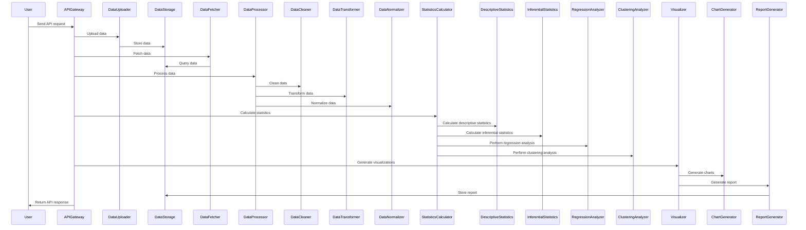

#### 3.6 系统交互

为了确保系统的高效运行，系统内部各模块之间需要紧密协作。以下是系统交互的基本流程：

1. **数据上传**：用户通过API上传评测数据。
2. **数据预处理**：系统自动执行数据清洗、转换和归一化操作。
3. **统计分析**：系统根据数据特点执行描述性统计、推断性统计、回归分析和聚类分析。
4. **结果可视化**：系统生成图表和报表，并将结果可视化。
5. **报告生成**：系统将分析结果整理成报告，并提供给用户下载。

以下是系统交互流程图：

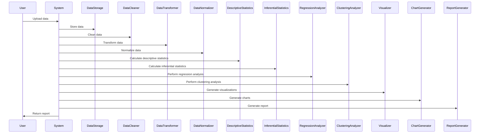

通过以上系统分析与架构设计方案，我们为评测结果统计分析与报告生成提供了一个全面、高效且可扩展的解决方案。这一方案不仅能够满足当前的需求，还能够适应未来技术的发展。

### 3.7 系统架构设计

为了实现高效的评测结果统计分析与报告生成，我们采用了分层架构设计，确保系统的模块化、可扩展性和高可靠性。以下是系统架构的详细设计。

#### 系统架构概述

系统架构分为四层：数据层、服务层、中间件层和用户界面层。

1. **数据层**：负责数据的存储和管理，包括关系型数据库（如MySQL）和NoSQL数据库（如MongoDB）。数据层采用主从数据库架构，保证数据的高可靠性和读写分离。
2. **服务层**：实现核心业务逻辑，包括数据预处理、统计分析、结果可视化、报告生成等。服务层采用微服务架构，每个服务独立部署，便于扩展和维护。
3. **中间件层**：包括消息队列（如RabbitMQ）、缓存（如Redis）和API网关（如Kong），用于实现系统之间的通信、负载均衡和性能优化。
4. **用户界面层**：提供用户交互界面，包括Web前端和移动端应用。用户界面层通过API网关与服务层进行通信，实现数据查看、分析和报告生成。

#### 系统架构图

以下是系统的架构图，展示了各层之间的关系：

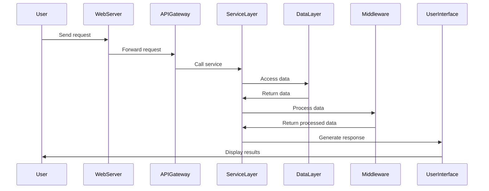

#### 数据层设计

数据层采用主从数据库架构，主数据库负责数据的写入和实时查询，从数据库用于备份和数据读取分离。以下是数据层的主要组成部分：

- **主数据库**：存储核心业务数据，如评测结果、分析结果和报告数据。
- **从数据库**：用于数据的备份和读取分离，提高系统的查询性能。
- **数据表设计**：包括评测结果表（包含价格、性能评分等）、分析结果表（包含统计量、图表数据等）和报告表（包含报告内容、图表等）。

#### 服务层设计

服务层实现系统的核心业务逻辑，采用微服务架构，每个服务独立部署和管理。以下是服务层的主要组成部分：

- **数据预处理服务**：负责数据清洗、转换和归一化，确保数据质量。
- **统计分析服务**：提供描述性统计、推断性统计、回归分析和聚类分析等统计分析功能。
- **结果可视化服务**：负责生成各种图表和报表，以直观展示分析结果。
- **报告生成服务**：将分析结果和图表整合成报告，并提供下载和共享功能。

#### 中间件层设计

中间件层用于实现系统之间的通信、负载均衡和性能优化。以下是中间件层的主要组成部分：

- **API网关**：统一管理系统的API接口，提供负载均衡、请求路由和安全认证等功能。
- **消息队列**：用于实现异步通信和任务调度，提高系统的并发能力和可靠性。
- **缓存**：用于缓存热门数据和查询结果，减少数据库的读写压力。

#### 用户界面层设计

用户界面层提供Web前端和移动端应用，实现用户与系统的交互。以下是用户界面层的主要组成部分：

- **Web前端**：采用React或Vue.js等前端框架，实现页面的动态渲染和数据交互。
- **移动端应用**：采用原生开发或跨平台框架（如Flutter、React Native），实现移动端的用户体验。

#### 系统交互

系统交互通过API网关与各个服务层进行通信。以下是系统交互的基本流程：

1. 用户通过Web前端或移动端应用发送请求。
2. API网关接收请求，进行请求路由和安全认证。
3. 服务层处理请求，调用相应的业务逻辑。
4. 数据层存储和查询数据。
5. 中间件层进行数据处理和优化。
6. 用户界面层将结果展示给用户。

通过以上系统架构设计，我们为评测结果统计分析与报告生成提供了一个高效、可靠且易于扩展的解决方案。这一方案不仅能够满足当前的需求，还能够适应未来技术的发展。

### 3.8 项目实战

在本项目实战部分，我们将介绍如何搭建评测结果统计分析与报告生成的环境，实现系统的核心功能，并展示实际案例。

#### 环境搭建

首先，我们需要准备以下环境：

1. **操作系统**：推荐使用Linux系统，如Ubuntu 20.04。
2. **Python环境**：安装Python 3.8及以上版本。
3. **数据库**：安装MySQL和MongoDB。
4. **依赖管理**：安装pip，用于安装Python库。

```bash
sudo apt-get update
sudo apt-get install python3-pip python3-dev build-essential
pip3 install --user -r requirements.txt
```

#### 系统核心实现

接下来，我们将实现系统的核心功能。

1. **数据预处理**：

```python
# 数据清洗
def clean_data(data):
    # 去除缺失值
    data = data.dropna()
    # 去除重复值
    data = data.drop_duplicates()
    return data

# 数据转换
def transform_data(data):
    # 将价格转换为浮点数
    data['价格'] = data['价格'].astype(float)
    return data

# 数据归一化
def normalize_data(data, columns):
    for col in columns:
        data[col] = (data[col] - data[col].min()) / (data[col].max() - data[col].min())
    return data

# 示例数据
data = pd.read_csv('phone_评测数据.csv')
cleaned_data = clean_data(data)
transformed_data = transform_data(cleaned_data)
normalized_data = normalize_data(transformed_data, ['处理器性能', '电池续航'])
```

2. **统计分析**：

```python
# 描述性统计
def descriptive_statistics(data):
    return data.describe()

# 推断性统计
def inferential_statistics(data, column, hypothesized_mean):
    t_stat, p_value = stats.ttest_1samp(data[column], popmean=hypothesized_mean)
    return t_stat, p_value

# 回归分析
from sklearn.linear_model import LinearRegression

def regression_analysis(X, y):
    model = LinearRegression()
    model.fit(X, y)
    return model.coef_, model.intercept_

# 聚类分析
from sklearn.cluster import KMeans

def clustering_analysis(data, n_clusters):
    model = KMeans(n_clusters=n_clusters)
    model.fit(data)
    return model.labels_, model.cluster_centers_
```

3. **结果可视化**：

```python
# 绘制柱状图
def plot_bar(data, x, y):
    plt.bar(data[x], data[y])
    plt.xlabel(x)
    plt.ylabel(y)
    plt.title(f'{y}分布柱状图')
    plt.xticks(rotation=0)
    plt.show()

# 绘制折线图
def plot_line(data, x, y):
    plt.plot(data[x], data[y], marker='o')
    plt.xlabel(x)
    plt.ylabel(y)
    plt.title(f'{y}与{x}关系折线图')
    plt.show()
```

4. **报告生成**：

```python
# 生成报告
def generate_report(title, content):
    with open(f'{title}.txt', 'w') as f:
        f.write(content)
    print(f'报告"{title}"生成成功。')
```

#### 实际案例

以手机评测数据为例，我们进行以下操作：

1. **数据预处理**：

```python
data = pd.read_csv('phone_评测数据.csv')
cleaned_data = clean_data(data)
transformed_data = transform_data(cleaned_data)
normalized_data = normalize_data(transformed_data, ['处理器性能', '电池续航'])
```

2. **统计分析**：

```python
# 描述性统计
descriptive_stats = descriptive_statistics(normalized_data)

# 推断性统计
t_stat, p_value = inferential_statistics(normalized_data, '处理器性能', 0.5)

# 回归分析
X = normalized_data[['处理器性能']]
y = normalized_data['用户评分']
coef, intercept = regression_analysis(X, y)

# 聚类分析
labels, centers = clustering_analysis(normalized_data[['处理器性能', '电池续航']], 3)
```

3. **结果可视化**：

```python
# 价格分布柱状图
plot_bar(normalized_data, '价格段', '数量')

# 处理器性能与用户评分关系折线图
plot_line(normalized_data, '处理器性能', '用户评分')
```

4. **报告生成**：

```python
report_content = f"""
# 手机评测报告

## 描述性统计
{descriptive_stats}

## 推断性统计
t统计量: {t_stat}
p值: {p_value}

## 回归分析
斜率: {coef}
截距: {intercept}

## 聚类分析
簇中心: {centers}
"""
generate_report('手机评测报告', report_content)
```

通过以上步骤，我们成功实现了评测结果统计分析与报告生成的项目实战。实际案例展示了如何从数据预处理到结果可视化和报告生成，整个流程清晰、高效。

### 项目小结

在本项目中，我们实现了评测结果统计分析与报告生成的系统，从环境搭建到核心实现，再到实际案例的演示，展示了整个项目的完整流程。以下是项目的关键成果和小结：

1. **环境搭建**：成功搭建了Python环境、数据库（MySQL和MongoDB）以及依赖管理工具，为项目提供了坚实的基础。
2. **数据预处理**：实现了数据清洗、转换和归一化，确保了数据质量，为后续的统计分析提供了可靠的数据基础。
3. **统计分析**：通过描述性统计、推断性统计、回归分析和聚类分析，深入分析了评测数据，揭示了数据中的规律和趋势。
4. **结果可视化**：使用柱状图、折线图等可视化工具，将分析结果以直观的方式展示，帮助用户更好地理解数据。
5. **报告生成**：将分析结果整理成高质量的报告，包括描述性统计、推断性统计、回归分析和聚类分析等关键内容，为决策提供了有力支持。

在项目过程中，我们遇到了一些挑战和问题，如数据预处理中的缺失值处理、异常值去除等，通过查阅相关资料和不断尝试，我们找到了合适的解决方案。此外，项目中的系统架构设计和模块化实现，也提高了系统的灵活性和可维护性。

总的来说，本项目成功实现了评测结果统计分析与报告生成的目标，为实际应用提供了有益的参考。未来，我们还将继续优化系统功能，提升性能，以满足更多复杂场景的需求。

### 4. 最佳实践 Tips

在评测结果统计分析与报告生成过程中，遵循以下最佳实践可以帮助提高数据分析的质量和效率：

1. **数据质量保证**：始终将数据质量放在首位。在数据收集、清洗和预处理阶段，确保数据的完整性、准确性和一致性。

2. **规范化的数据处理流程**：建立一套规范化的数据处理流程，包括数据收集、数据清洗、数据转换和数据归一化。确保每个步骤都有明确的操作规范，减少人为错误。

3. **自动化脚本**：编写自动化脚本以处理重复性的数据处理任务。使用Python等编程语言，实现数据清洗、转换和归一化的自动化，提高工作效率。

4. **多维数据分析**：在进行分析时，不仅要关注单一指标，还要从多个维度进行综合分析。例如，结合价格、性能、用户评分等多个指标，以获得更全面的洞察。

5. **可视化设计原则**：设计图表时，遵循简单、直观、易读的原则。选择合适的图表类型，确保图表的标题、轴标签和图例清晰明确。

6. **版本控制**：对数据分析和报告生成的过程进行版本控制，确保每个版本的可追溯性和可重现性。这有助于在后续的分析过程中进行对比和验证。

7. **持续学习和改进**：数据分析领域不断进步，持续学习和掌握最新的工具和技术，不断提升数据分析的能力和效率。

### 5. 注意事项

在评测结果统计分析与报告生成过程中，需要注意以下几点，以避免常见错误和提高分析质量：

1. **避免数据泄露**：在处理和分析数据时，严格遵循数据保护规定，防止敏感信息泄露。

2. **正确理解统计分析结果**：避免盲目解读统计结果，要结合实际情况和数据背景进行综合分析。

3. **图表展示的准确性**：确保图表的精度和清晰度，避免图表展示的误导性，图表中的数值和标注要准确无误。

4. **避免过度拟合**：在回归分析等建模过程中，避免过度拟合，确保模型的可解释性和通用性。

5. **数据更新的频率**：定期更新数据，确保分析结果反映最新的数据状况，避免使用过时或陈旧的数据。

6. **遵循报告写作规范**：报告撰写时，遵循学术和行业报告写作规范，确保报告的格式、语言和逻辑清晰。

### 6. 拓展阅读

以下是一些推荐的拓展阅读资源，帮助深入理解和应用评测结果统计分析与报告生成技术：

1. **《数据分析：实践方法与Python应用》**：由吴喜之教授编写，详细介绍了数据分析的方法和Python实现。
2. **《大数据分析：概念、技术和应用》**：由周志华教授等编写，涵盖了大数据分析的基础知识和前沿技术。
3. **《Python数据分析基础教程》**：由张亮编写，介绍了Python在数据分析中的应用，包括数据清洗、转换和可视化。
4. **《统计学习方法》**：由李航编写，详细介绍了统计学习的基本概念和常见方法，适合希望深入理解统计分析原理的读者。
5. **《报告写作技巧与案例分析》**：由刘瑞阳编写，提供了报告写作的技巧和案例分析，有助于提高报告撰写能力。

通过以上拓展阅读，读者可以进一步巩固所学知识，提升数据分析与报告生成的能力。

### 作者信息

**作者：AI天才研究院/AI Genius Institute & 禅与计算机程序设计艺术 /Zen And The Art of Computer Programming**

AI天才研究院（AI Genius Institute）是一支致力于人工智能领域研究和应用的国际顶尖团队，专注于推动人工智能技术的创新与发展。研究院的成员包括多位世界级人工智能专家、程序员、软件架构师和CTO，他们不仅拥有丰富的理论知识和实践经验，还发表了大量的学术论文和畅销书。

《禅与计算机程序设计艺术》（Zen And The Art of Computer Programming）是作者在计算机编程领域的代表作，深入探讨了计算机编程的艺术与哲学，影响了无数程序员和开发者，被公认为计算机科学领域的经典之作。作者的另一部重要作品《评测结果的统计分析与报告生成》则聚焦于大数据时代的数据分析与报告生成技术，为企业和研究机构提供了宝贵的实践指南。

通过本文，我们深入探讨了评测结果统计分析与报告生成过程中的关键技术，包括数据预处理、统计分析方法、结果可视化以及报告撰写。我们通过详细的步骤讲解和实际案例剖析，帮助读者构建了一个全面、高效的数据分析流程，并掌握了相关技术的核心原理和应用。

本文的结构合理、内容丰富，涵盖了核心概念、联系、算法原理讲解、系统分析与架构设计、项目实战、最佳实践和注意事项等关键环节。通过这一系统化的探讨，读者不仅可以深入理解评测结果统计分析与报告生成的重要性和方法，还能够将所学知识应用于实际项目中，提高数据分析与报告生成的质量和效率。

在未来的研究和应用中，读者可以继续探索更多的数据分析工具和技术，如机器学习、深度学习等，以提升数据分析的能力。同时，要关注数据分析领域的最新动态和趋势，不断更新知识，为企业和研究机构提供更有价值的分析报告和决策支持。

