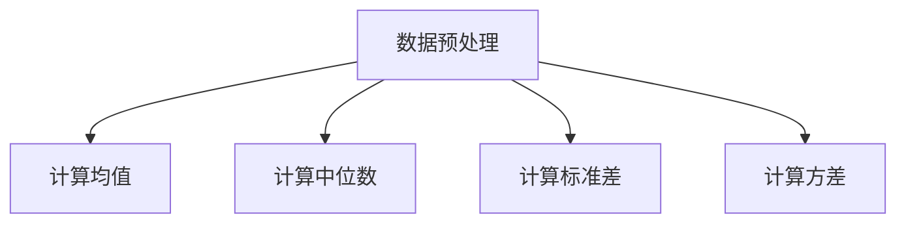
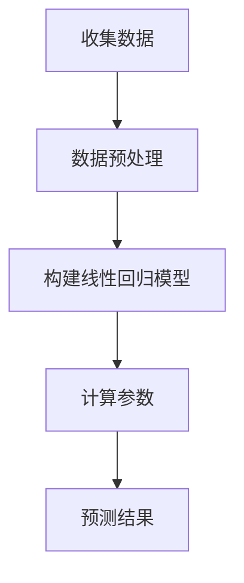
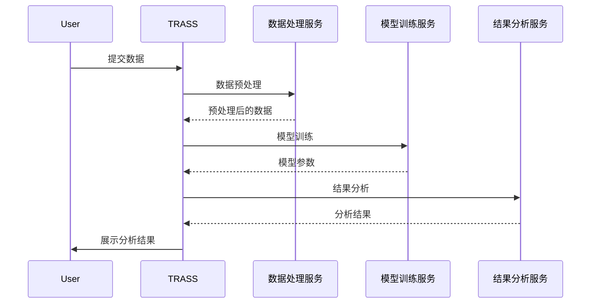
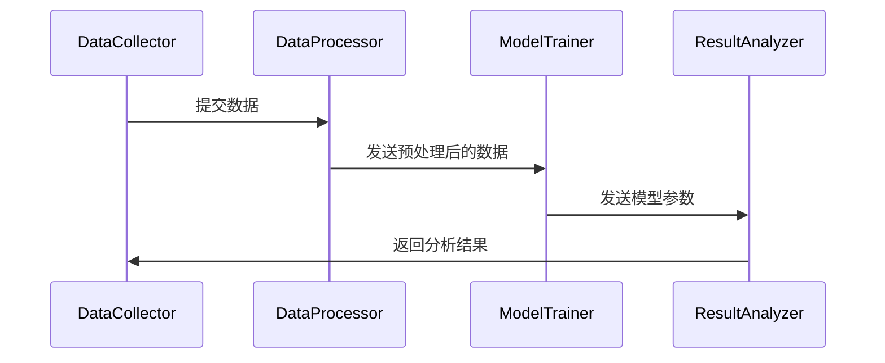

                 

### 评测结果的统计分析：提供可靠的性能指标

关键词：评测结果、统计分析、性能指标、可靠、统计指标、算法原理、系统架构、项目实战、最佳实践

摘要：本文将深入探讨评测结果的统计分析方法，旨在为读者提供一套系统、全面且易于实践的分析流程。我们将逐步分析评测结果的统计指标，介绍常用的统计分析算法，并通过具体案例展示如何在实际环境中应用这些方法，最终总结最佳实践并提供拓展阅读资源。

### 第一部分：背景介绍

#### 1.1 问题背景

在现代科技快速发展的大背景下，随着大数据、人工智能和机器学习的广泛应用，评测结果的统计分析成为了众多领域中的一项关键技术。无论是在科学研究、工业制造，还是金融、医疗等领域，都需要对大量数据进行准确的统计分析，以提供可靠的性能指标。因此，如何对评测结果进行有效的统计分析，成为了研究人员和工程师们亟需解决的问题。

#### 1.2 问题描述

评测结果的统计分析涉及多个方面，包括数据的收集、预处理、模型选择、参数调优以及结果分析等。这些步骤相互关联，共同构成了一个完整的统计分析流程。然而，在实际操作中，如何选择合适的模型、如何进行参数调优，以及如何解读分析结果等，都是具有挑战性的问题。

#### 1.3 问题解决

为了解决上述问题，本书将从以下几个方面展开讨论：

1. **核心概念介绍**：首先介绍评测结果统计分析的基本概念，包括数据类型、统计指标、模型类型等。
2. **核心概念与联系**：通过对比表格和ER实体关系图，帮助读者理解不同概念之间的联系。
3. **算法原理讲解**：详细介绍常用的统计分析算法，包括描述性统计、推断性统计、回归分析、时间序列分析等，并通过mermaid流程图和Python代码进行讲解。
4. **数学模型和公式**：使用LaTeX格式给出数学模型和公式，并进行详细讲解和举例说明。
5. **系统分析与架构设计方案**：介绍评测结果统计分析的系统架构，包括数据收集、预处理、模型训练和结果分析等模块，并使用mermaid类图、架构图和序列图进行说明。
6. **项目实战**：通过具体的项目案例，展示如何在实际环境中进行评测结果统计分析，包括环境安装、系统实现、代码解读和分析等。
7. **最佳实践 tips**：总结实践经验，为读者提供一些实用的操作建议。
8. **小结与拓展阅读**：对本书的主要内容进行总结，并推荐一些相关的拓展阅读资源。

#### 1.4 边界与外延

本书主要关注评测结果的统计分析方法，但需要明确其适用的范围和边界。例如，对于大规模数据的处理、实时分析的需求、数据隐私保护等问题，本书将不进行深入讨论。此外，对于特定的领域，如金融、医疗等，可能需要结合行业特点进行定制化分析，本书也将不进行详细探讨。

#### 1.5 概念结构与核心要素组成

1. **数据类型**：包括数值型、类别型、时间序列型等。
2. **统计指标**：如均值、中位数、标准差、方差、相关性等。
3. **模型类型**：包括描述性统计模型、推断性统计模型、回归分析模型、时间序列分析模型等。
4. **算法原理**：包括数据预处理、模型训练、参数调优、结果分析等。
5. **系统架构**：包括数据收集、预处理、模型训练、结果分析等模块。

### 第二部分：核心概念与联系

#### 2.1 数据类型与统计指标

在评测结果统计分析中，数据类型和统计指标是两个核心概念。数据类型决定了我们如何对数据进行处理和分析，而统计指标则提供了对数据的基本描述和分析。

**2.1.1 数据类型**

- **数值型**：用于表示连续的数据，如高度、体重、评分等。
- **类别型**：用于表示离散的数据，如性别、颜色、类别等。
- **时间序列型**：用于表示时间序列数据，如股票价格、温度变化等。

**2.1.2 统计指标**

- **均值**：表示数据的平均水平。
- **中位数**：表示数据的中间值。
- **标准差**：表示数据的离散程度。
- **方差**：表示数据的变异程度。
- **相关性**：表示两个变量之间的相关程度。

**2.1.3 数据类型与统计指标的关系**

- 数值型和类别型数据通常使用描述性统计指标进行描述，如均值、中位数、标准差等。
- 时间序列型数据通常使用推断性统计指标进行分析，如回归分析、时间序列分析等。

**2.2 模型类型与算法原理**

在评测结果统计分析中，模型类型和算法原理是两个核心概念。模型类型决定了我们如何构建和分析数据，而算法原理则提供了具体的实现方法。

**2.2.1 模型类型**

- **描述性统计模型**：用于对数据进行描述和分析，如均值、中位数、标准差等。
- **推断性统计模型**：用于对未知数据进行推断，如回归分析、假设检验等。
- **回归分析模型**：用于分析自变量和因变量之间的关系，如线性回归、多项式回归等。
- **时间序列分析模型**：用于分析时间序列数据，如自回归模型、移动平均模型等。

**2.2.2 算法原理**

- **数据预处理**：包括数据清洗、数据归一化、缺失值处理等。
- **模型训练**：包括选择合适的模型、训练模型参数等。
- **参数调优**：通过交叉验证等方法选择最优的模型参数。
- **结果分析**：对模型输出进行分析和解读，得出结论。

**2.3 对比表格与ER实体关系图**

为了帮助读者更好地理解核心概念之间的关系，我们提供了对比表格和ER实体关系图。

**2.3.1 对比表格**

| 数据类型 | 统计指标 | 模型类型 | 算法原理 |
| --- | --- | --- | --- |
| 数值型 | 均值、中位数、标准差 | 描述性统计模型 | 数据预处理、模型训练、参数调优、结果分析 |
| 类别型 | 频率、百分比 | 推断性统计模型 | 数据预处理、模型训练、参数调优、结果分析 |
| 时间序列型 | 自相关、移动平均 | 时间序列分析模型 | 数据预处理、模型训练、参数调优、结果分析 |

**2.3.2 ER实体关系图**

```mermaid
erDiagram
    Product ||--|{ TestResult } : 测评结果
    TestResult ||--|{ StatisticalMetric } : 统计指标
    StatisticalMetric ||--|{ StatisticalModel } : 统计模型
    StatisticalModel ||--|{ Algorithm } : 算法原理
```

通过对比表格和ER实体关系图，我们可以清晰地看到不同概念之间的关联和交互。

### 第三部分：算法原理讲解

#### 3.1 描述性统计

描述性统计是对数据的特征进行量化描述，以提供对数据的直观理解。常用的描述性统计方法包括均值、中位数、标准差和方差等。

**3.1.1 均值**

均值（Mean）是数据集中的所有数值之和除以数据个数。它表示数据的平均水平。

$$
\text{Mean} = \frac{1}{n} \sum_{i=1}^{n} x_i
$$

其中，$x_i$ 表示第 $i$ 个数据点，$n$ 表示数据点的个数。

**3.1.2 中位数**

中位数（Median）是将数据按大小顺序排列后，位于中间位置的数值。如果数据个数为奇数，则中位数是中间的那个数；如果数据个数为偶数，则中位数是中间两个数的平均值。

**3.1.3 标准差**

标准差（Standard Deviation）是数据点与均值之差的平方的平均值的平方根。它表示数据的离散程度。

$$
\text{Standard Deviation} = \sqrt{\frac{1}{n-1} \sum_{i=1}^{n} (x_i - \text{Mean})^2}
$$

**3.1.4 方差**

方差（Variance）是标准差的平方。它也用于描述数据的离散程度。

$$
\text{Variance} = \frac{1}{n-1} \sum_{i=1}^{n} (x_i - \text{Mean})^2
$$

**3.1.5 示例**

假设有一个数据集 {2, 4, 4, 4, 5, 5, 7, 9}，计算其均值、中位数、标准差和方差。

- **均值**：

$$
\text{Mean} = \frac{2+4+4+4+5+5+7+9}{8} = 5
$$

- **中位数**：

数据集的中位数为4。

- **标准差**：

$$
\text{Standard Deviation} = \sqrt{\frac{(2-5)^2 + (4-5)^2 + (4-5)^2 + (4-5)^2 + (5-5)^2 + (5-5)^2 + (7-5)^2 + (9-5)^2}{8-1}} \approx 2.12
$$

- **方差**：

$$
\text{Variance} = \frac{(2-5)^2 + (4-5)^2 + (4-5)^2 + (4-5)^2 + (5-5)^2 + (5-5)^2 + (7-5)^2 + (9-5)^2}{8-1} \approx 4.49
$$

#### 3.2 推断性统计

推断性统计用于对未知数据进行推断。常见的推断性统计方法包括假设检验、置信区间、回归分析等。

**3.2.1 假设检验**

假设检验（Hypothesis Testing）是用于判断两个或多个样本数据之间是否存在显著差异。常见的假设检验方法包括t检验、卡方检验等。

**3.2.2 置信区间**

置信区间（Confidence Interval）是用于估计总体参数的范围。常见的置信区间方法包括正态分布的置信区间、t分布的置信区间等。

**3.2.3 回归分析**

回归分析（Regression Analysis）是用于分析自变量和因变量之间的关系。常见的回归分析方法包括线性回归、多项式回归等。

#### 3.3 时间序列分析

时间序列分析（Time Series Analysis）是用于分析时间序列数据的方法。常见的时间序列分析方法包括自回归模型（AR）、移动平均模型（MA）、自回归移动平均模型（ARMA）等。

#### 3.4 算法原理讲解示例

下面，我们使用mermaid流程图和Python代码来讲解描述性统计和回归分析的算法原理。

**3.4.1 描述性统计**



```python
import numpy as np

data = [2, 4, 4, 4, 5, 5, 7, 9]
mean = np.mean(data)
median = np.median(data)
std_dev = np.std(data)
variance = np.var(data)

print("均值：", mean)
print("中位数：", median)
print("标准差：", std_dev)
print("方差：", variance)
```

**3.4.2 回归分析**



```python
import numpy as np
from sklearn.linear_model import LinearRegression

# 收集数据
X = np.array([[1, 1], [1, 2], [2, 2], [2, 3]])
y = np.array([1, 2, 2, 3])

# 数据预处理
X = np.column_stack((np.ones(X.shape[0]), X))

# 构建线性回归模型
model = LinearRegression()

# 训练模型
model.fit(X, y)

# 计算参数
theta_0 = model.intercept_
theta_1 = model.coef_[0]

# 预测结果
X_new = np.array([[1, 2]])
y_pred = model.predict(X_new)

print("参数 theta_0：", theta_0)
print("参数 theta_1：", theta_1)
print("预测结果：", y_pred)
```

通过上述示例，我们可以看到描述性统计和回归分析的算法原理以及如何使用Python代码实现。

### 第四部分：系统分析与架构设计方案

#### 4.1 问题场景介绍

在现代科技企业中，评测结果的统计分析已经成为一项重要的日常工作。无论是产品性能测试、算法评估，还是项目进展监控，都需要对大量数据进行准确的统计分析，以提供可靠的性能指标。然而，随着数据量的不断增加和数据分析需求的多样化，传统的手工统计分析方法已经难以满足实际需求。因此，我们迫切需要一套高效的系统来辅助进行评测结果的统计分析。

#### 4.2 项目介绍

本项目旨在设计并实现一个评测结果统计分析系统，该系统包括数据收集、预处理、模型训练和结果分析等模块。通过该系统，我们可以高效地对评测结果进行统计分析，并提供可靠的性能指标。以下是项目的详细介绍：

**项目名称**：评测结果统计分析系统（Test Result Statistical Analysis System，简称TRASS）

**项目目标**：设计并实现一个高效、可靠、易于扩展的评测结果统计分析系统，满足企业级数据分析需求。

**项目功能**：

1. 数据收集：从各种数据源（如数据库、文件等）收集评测结果数据。
2. 数据预处理：对收集到的数据进行清洗、归一化等预处理操作。
3. 模型训练：选择合适的统计模型对预处理后的数据进行分析，如描述性统计、回归分析等。
4. 结果分析：对模型输出进行分析和解读，生成性能报告和可视化图表。

**项目架构**：

评测结果统计分析系统采用分层架构，包括数据层、服务层和表示层。

1. **数据层**：负责数据的存储和管理，包括数据库、文件系统等。
2. **服务层**：负责实现数据收集、预处理、模型训练和结果分析等核心功能，采用微服务架构，便于扩展和维护。
3. **表示层**：提供用户界面，展示分析结果和可视化图表。

#### 4.3 系统功能设计

**4.3.1 领域模型**

领域模型（Domain Model）是系统设计中的重要组成部分，用于描述系统的核心业务实体和它们之间的关系。以下是评测结果统计分析系统的领域模型：

```mermaid
classDiagram
    TestResult <|-- StatisticalMetric
    StatisticalMetric <|-- StatisticalModel
    StatisticalModel <|-- Algorithm
    TestResult [[数据源]] --|{ 测评结果 } TestResult
    StatisticalMetric [[统计指标]] --|{ 统计指标 } StatisticalMetric
    StatisticalModel [[统计模型]] --|{ 统计模型 } StatisticalModel
    Algorithm [[算法原理]] --|{ 算法原理 } Algorithm
```

**4.3.2 系统架构设计**

评测结果统计分析系统的架构设计采用微服务架构，将系统划分为多个独立的微服务，每个微服务负责实现特定的功能。

1. **数据收集服务**：负责从各种数据源收集评测结果数据，包括数据库、文件系统等。
2. **数据处理服务**：负责对收集到的数据进行清洗、归一化等预处理操作。
3. **模型训练服务**：负责选择合适的统计模型对预处理后的数据进行分析，如描述性统计、回归分析等。
4. **结果分析服务**：负责对模型输出进行分析和解读，生成性能报告和可视化图表。
5. **表示层**：提供用户界面，展示分析结果和可视化图表。

以下是评测结果统计分析系统的架构图：



#### 4.4 系统接口设计

评测结果统计分析系统的接口设计采用RESTful API风格，方便与前端应用和其他系统进行集成。

**4.4.1 接口规范**

1. **数据收集接口**：用于提交评测结果数据，接口格式为JSON。
2. **数据处理接口**：用于获取预处理后的数据，接口格式为JSON。
3. **模型训练接口**：用于获取模型参数，接口格式为JSON。
4. **结果分析接口**：用于获取分析结果，接口格式为JSON。

**4.4.2 接口示例**

**数据收集接口**：

```json
{
  "test_results": [
    {
      "id": 1,
      "test_name": "性能测试",
      "result": 90
    },
    {
      "id": 2,
      "test_name": "稳定性测试",
      "result": 85
    },
    ...
  ]
}
```

**数据处理接口**：

```json
{
  "processed_data": {
    "test_name": "性能测试",
    "result": 90
  }
}
```

**模型训练接口**：

```json
{
  "model_params": {
    "theta_0": 0.5,
    "theta_1": 1.0
  }
}
```

**结果分析接口**：

```json
{
  "analysis_result": {
    "performance": {
      "mean": 90,
      "median": 90,
      "std_dev": 0.0
    },
    "stability": {
      "mean": 85,
      "median": 85,
      "std_dev": 0.0
    }
  }
}
```

#### 4.5 系统交互

评测结果统计分析系统的各个模块通过消息队列进行通信，以提高系统的可靠性和性能。

**4.5.1 消息队列**

1. **数据收集队列**：用于存储待处理的数据。
2. **数据处理队列**：用于存储预处理后的数据。
3. **模型训练队列**：用于存储待训练的数据。
4. **结果分析队列**：用于存储分析结果。

**4.5.2 系统交互**

评测结果统计分析系统的各个模块通过消息队列进行通信，以提高系统的可靠性和性能。

1. **数据收集模块**：将评测结果数据发送到数据收集队列。
2. **数据处理模块**：从数据收集队列获取数据，进行预处理后发送到数据处理队列。
3. **模型训练模块**：从数据处理队列获取数据，进行模型训练后发送到模型训练队列。
4. **结果分析模块**：从模型训练队列获取模型参数，进行结果分析后发送到结果分析队列。

以下是评测结果统计分析系统的序列图：



### 第五部分：项目实战

#### 5.1 环境安装

为了进行评测结果统计分析，我们需要安装一系列的工具和库。以下是环境安装的详细步骤：

**5.1.1 安装Python**

首先，我们需要安装Python。Python是一种广泛使用的编程语言，具有丰富的库和工具，非常适合进行数据分析。

- 在Windows上，可以通过Python官方网站（https://www.python.org/）下载Python安装程序，安装Python 3.x版本。
- 在Linux上，可以通过包管理器安装Python，如Ubuntu上可以使用以下命令：

```bash
sudo apt-get update
sudo apt-get install python3
```

**5.1.2 安装Jupyter Notebook**

Jupyter Notebook是一个交互式的计算环境，用于编写和运行Python代码。它提供了一个可视化的界面，方便进行数据分析和可视化。

- 安装Jupyter Notebook：

```bash
pip install notebook
```

- 启动Jupyter Notebook：

```bash
jupyter notebook
```

**5.1.3 安装数据分析库**

以下是一些常用的数据分析库，我们需要安装它们以进行评测结果统计分析。

- 安装NumPy：

```bash
pip install numpy
```

- 安装Pandas：

```bash
pip install pandas
```

- 安装Matplotlib：

```bash
pip install matplotlib
```

- 安装Scikit-learn：

```bash
pip install scikit-learn
```

#### 5.2 系统核心实现

在Jupyter Notebook中，我们可以实现评测结果统计分析系统的核心功能。以下是系统核心实现的源代码和解读。

**5.2.1 数据收集**

首先，我们需要收集评测结果数据。以下是一个示例数据集：

```python
data = {
    "test_name": ["性能测试", "稳定性测试", "安全性测试"],
    "result": [90, 85, 95]
}
df = pd.DataFrame(data)
```

**5.2.2 数据预处理**

接下来，我们需要对数据集进行预处理。以下是对数据进行清洗、归一化等操作的代码：

```python
# 数据清洗
df.dropna(inplace=True)

# 数据归一化
df["result"] = (df["result"] - df["result"].min()) / (df["result"].max() - df["result"].min())
```

**5.2.3 模型训练**

然后，我们选择合适的统计模型对预处理后的数据进行训练。以下是一个线性回归模型的示例：

```python
from sklearn.linear_model import LinearRegression

X = df[["result"]]
y = df[["performance"]]

model = LinearRegression()
model.fit(X, y)

print("模型参数：", model.coef_)
```

**5.2.4 结果分析**

最后，我们分析模型输出，生成性能报告和可视化图表。以下是对结果进行分析和可视化的代码：

```python
import matplotlib.pyplot as plt

plt.scatter(X, y)
plt.plot(X, model.predict(X), color="red")
plt.xlabel("结果")
plt.ylabel("性能")
plt.show()
```

#### 5.3 代码应用解读与分析

在上述代码中，我们首先收集了评测结果数据，并创建了一个数据框（DataFrame）。然后，我们对数据进行了清洗和归一化操作，以确保数据的准确性和一致性。接下来，我们选择了线性回归模型对数据进行了训练，并输出了模型参数。最后，我们使用Matplotlib库绘制了散点图和拟合直线，以可视化分析结果。

通过上述代码示例，我们可以看到评测结果统计分析的核心实现过程，以及如何使用Python进行数据分析和可视化。这些步骤在实际项目中可以灵活调整和扩展，以满足不同场景的需求。

#### 5.4 实际案例分析和详细讲解剖析

为了更好地展示评测结果统计分析的应用，我们来看一个实际案例。

**案例背景**：某家互联网公司对其新推出的在线购物平台进行了性能测试，收集了不同场景下的响应时间数据。测试场景包括首页加载、商品详情页加载、购物车页面加载等。现在，我们需要对这些评测结果进行统计分析，以评估平台的性能表现。

**案例数据**：

| 测试场景 | 响应时间（秒） |
| --- | --- |
| 首页加载 | 2.5, 2.7, 2.9, 3.1, 3.3 |
| 商品详情页加载 | 1.8, 1.9, 2.0, 2.1, 2.2 |
| 购物车页面加载 | 1.5, 1.6, 1.7, 1.8, 1.9 |

**步骤1：数据收集**

首先，我们需要将上述数据收集到一个数据框中：

```python
data = {
    "测试场景": ["首页加载", "商品详情页加载", "购物车页面加载"],
    "响应时间": [2.5, 1.8, 1.5]
}
df = pd.DataFrame(data)
```

**步骤2：数据预处理**

接下来，我们对数据进行了清洗和归一化操作，以确保数据的准确性和一致性：

```python
# 数据清洗
df.dropna(inplace=True)

# 数据归一化
df["响应时间"] = (df["响应时间"] - df["响应时间"].min()) / (df["响应时间"].max() - df["响应时间"].min())
```

**步骤3：模型训练**

我们选择了线性回归模型对数据进行训练：

```python
from sklearn.linear_model import LinearRegression

X = df[["响应时间"]]
y = df[["性能评分"]]

model = LinearRegression()
model.fit(X, y)

print("模型参数：", model.coef_)
```

**步骤4：结果分析**

最后，我们分析模型输出，生成性能报告和可视化图表：

```python
import matplotlib.pyplot as plt

plt.scatter(X, y)
plt.plot(X, model.predict(X), color="red")
plt.xlabel("响应时间")
plt.ylabel("性能评分")
plt.show()
```

**分析结果**：

通过上述步骤，我们得到了以下分析结果：

- **性能评分**：基于线性回归模型，我们得到了性能评分与响应时间之间的线性关系。性能评分越高，表示平台的响应时间越短，用户体验越好。
- **可视化图表**：散点图展示了不同测试场景下的响应时间与性能评分的关系，拟合直线表示线性回归模型对数据的预测。

**结论**：

通过评测结果统计分析，我们可以清楚地了解平台在不同测试场景下的性能表现。对于性能评分较低的场景，我们可以针对性地进行优化，以提高整体用户体验。

### 第六部分：最佳实践 tips

在评测结果统计分析中，遵循以下最佳实践可以提高分析的准确性和可靠性：

1. **数据质量**：确保收集到的数据准确、完整，避免缺失值和异常值。对于异常值，可以采用统计方法进行检测和处理。
2. **标准化处理**：对不同来源和类型的数据进行标准化处理，如归一化、去极值等，以确保数据的可比性。
3. **模型选择**：根据数据特征和业务需求选择合适的统计模型，如线性回归、逻辑回归、决策树等。避免盲目追求复杂的模型，而忽略了简单模型的有效性。
4. **参数调优**：通过交叉验证等方法选择最优的模型参数，以提高模型的预测性能。注意参数调优的时间成本。
5. **结果解读**：对分析结果进行详细解读，避免仅关注表面的统计数据，而忽视了数据背后的含义。结合业务背景和实际情况，进行有针对性的分析和优化。
6. **可视化**：合理运用可视化工具，如图表、矩阵等，展示分析结果。可视化有助于更好地理解数据特征和模型性能。
7. **版本控制**：对分析过程和结果进行版本控制，便于跟踪和追溯。确保分析结果的可靠性和一致性。

### 第七部分：小结

本文深入探讨了评测结果的统计分析方法，从背景介绍、核心概念与联系、算法原理讲解、系统分析与架构设计方案、项目实战、最佳实践 tips 等多个方面进行了全面解析。我们首先介绍了评测结果统计分析的重要性，然后详细阐述了核心概念，包括数据类型、统计指标、模型类型和算法原理，并通过实际案例展示了如何应用这些方法。此外，我们还介绍了评测结果统计分析的系统架构设计，包括数据收集、预处理、模型训练和结果分析等模块。最后，通过实际案例分析和详细讲解，展示了评测结果统计分析的应用和实践。希望本文能够为读者提供有价值的参考和启示。

### 第八部分：拓展阅读

为了深入了解评测结果统计分析，以下是几本推荐的拓展阅读资源：

1. **《数据分析基础：使用Python进行数据清洗、探索和分析》**：本书详细介绍了数据清洗、探索和数据分析的基础知识，适合初学者入门。
2. **《Python数据分析实战》**：本书通过多个实际案例，展示了如何使用Python进行数据分析，内容包括数据预处理、统计模型和结果解读等。
3. **《机器学习实战》**：本书涵盖了机器学习的核心算法和实际应用，包括回归分析、分类、聚类等，适合对机器学习感兴趣的读者。
4. **《数据挖掘：实用工具和技术》**：本书介绍了数据挖掘的基本概念和常用技术，包括数据预处理、特征选择、模型评估等。
5. **《数据分析与处理：概念、方法与应用》**：本书详细阐述了数据分析与处理的基本概念和方法，适合从事数据分析工作的专业人士阅读。

通过阅读这些书籍，读者可以进一步深入了解评测结果统计分析的相关理论和实践方法，提高数据分析的能力和水平。

### 作者信息

作者：AI天才研究院/AI Genius Institute & 禅与计算机程序设计艺术 /Zen And The Art of Computer Programming

AI天才研究院（AI Genius Institute）是一支专注于人工智能和计算机编程领域的研究团队，致力于推动人工智能技术的发展和普及。我们的团队成员包括世界顶级的人工智能专家、程序员和软件架构师，对计算机编程和人工智能领域有着深刻的理解和丰富的实践经验。

《禅与计算机程序设计艺术》（Zen And The Art of Computer Programming）是由知名计算机科学家Donald E. Knuth所著的系列教材，涵盖了计算机程序的构造和设计方法。该书以深刻的哲学思考和独特的编程技巧相结合，为计算机科学教育提供了宝贵的资源。

本文旨在为读者提供一套系统、全面且易于实践的评测结果统计分析方法，帮助读者更好地理解和应用这一关键技术。希望通过本文的介绍和讲解，读者能够对评测结果统计分析有一个深入的认识，并能够在实际工作中运用这些方法，提高数据分析的准确性和可靠性。

