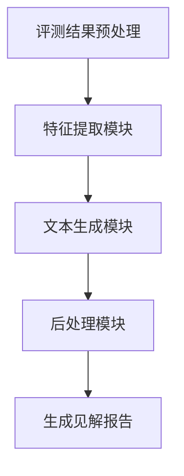
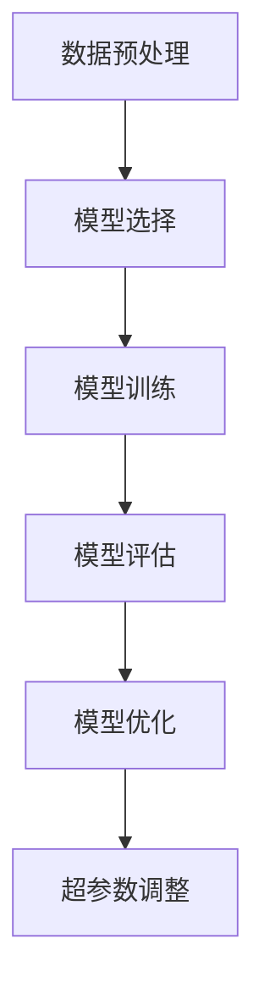
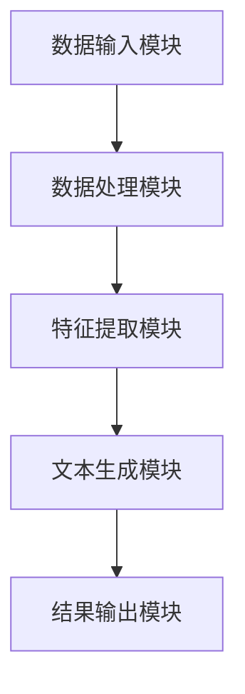
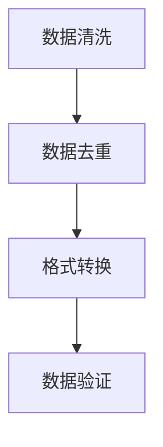
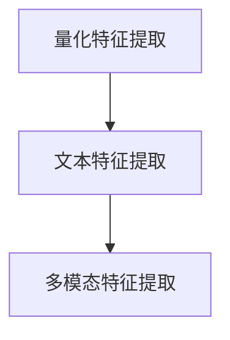

                 


# 评测结果的自动分析：LLM生成见解报告的技术

## 关键词
- 评测结果自动分析
- 语言模型（LLM）
- 生成见解报告
- 技术实现
- 算法优化

## 摘要
本文深入探讨了评测结果自动分析领域，重点介绍了如何利用语言模型（LLM）生成见解报告。我们将逐步解析评测结果自动分析的需求与挑战，介绍LLM的基础知识，分析生成见解报告的技术原理，并通过实际案例展示系统的设计与实现。文章还将探讨优化策略和未来发展趋势，为读者提供全面的视角和实用指南。

## 第一部分：问题背景与核心概念介绍

### 第1章：评测结果的自动分析背景

#### 1.1 评测结果自动分析的需求与挑战

评测结果在众多领域中具有重要意义，如教育、医疗、金融等。传统的评测结果处理往往依赖人工，存在效率低、耗时、易出错等问题。自动分析评测结果能够提高效率、减少错误，为决策提供有力支持。然而，自动分析评测结果面临以下挑战：

- **数据复杂性**：评测结果数据量大、类型繁多，处理难度大。
- **质量评估**：自动分析系统需要准确理解和评估评测结果，确保分析结果的准确性。
- **泛化能力**：自动分析系统需具备对不同类型评测结果的处理能力，具有较好的泛化能力。

#### 1.2 自动分析技术的优势与潜力

自动分析技术具有以下优势：

- **高效性**：自动分析能够显著提高数据处理速度，减少人工处理时间。
- **准确性**：自动分析系统通过算法优化，可以提高结果分析的准确性。
- **一致性**：自动分析系统能够确保分析结果的一致性，减少人为误差。

未来，随着人工智能技术的发展，自动分析技术的潜力将进一步释放，为各行业提供更加智能化、个性化的解决方案。

#### 1.3 LLMS在评测结果分析中的应用前景

LLM（Large Language Model）具有强大的文本生成和理解能力，在评测结果分析中具有广泛的应用前景：

- **自动生成报告**：LLM能够根据评测结果自动生成见解报告，提高工作效率。
- **多语言支持**：LLM支持多种语言，能够处理不同语言的评测结果。
- **个性化分析**：LLM能够根据用户需求，生成定制化的见解报告。

### 1.4 自动分析中的关键概念

#### 1.4.1 评测结果的定义与类型

评测结果是对评测对象（如学生、产品、服务）进行评估后得出的结论。评测结果类型包括：

- **量化结果**：如分数、排名等。
- **描述性结果**：如评语、评价等级等。
- **定性结果**：如专家意见、用户反馈等。

#### 1.4.2 LLMS的基本原理与类型

LLMS（Large Language Model System）是基于神经网络的大规模语言模型系统。其基本原理包括：

- **自注意力机制**：通过自注意力机制，模型能够关注关键信息，提高文本处理能力。
- **预训练与微调**：LLMS通常通过大规模预训练数据集进行训练，然后根据特定任务进行微调。

常见的LLMS类型包括：

- **GPT系列模型**：如GPT-3，具有强大的文本生成能力。
- **BERT及其变体**：如RoBERTa、ALBERT等，具有较强的文本理解能力。

#### 1.4.3 数据预处理和特征提取的重要性

数据预处理和特征提取是自动分析的关键步骤：

- **数据预处理**：包括数据清洗、去重、格式转换等，确保数据质量。
- **特征提取**：将原始数据转换为模型可处理的特征表示，提高模型性能。

### 1.5 研究方法与组织结构

#### 1.5.1 本书的研究目标

本书旨在：

- **介绍评测结果自动分析的需求与挑战**。
- **解析LLM在评测结果分析中的应用**。
- **探讨生成见解报告的技术原理与实现**。
- **分析实际案例，展示系统设计与优化策略**。

#### 1.5.2 研究方法与数据来源

本研究采用以下方法：

- **文献综述**：梳理相关领域的研究进展，为本文提供理论基础。
- **实验分析**：通过实际案例，验证LLM在评测结果自动分析中的应用效果。
- **对比分析**：对比不同模型和算法的性能，找出最优方案。

数据来源主要包括：

- **公开数据集**：如CoNLL-2009等。
- **自定义数据集**：根据实际应用场景，设计并收集评测结果数据。

#### 1.5.3 本书的结构与内容安排

本书分为四大部分：

- **第一部分**：问题背景与核心概念介绍。
- **第二部分**：LLM生成见解报告的技术基础。
- **第三部分**：应用与实现。
- **第四部分**：总结与展望。

通过以上结构，本文将为读者提供系统、全面的技术解析和应用指南。

---

**第2章：LLM生成见解报告的技术基础**

### 2.1 语言模型介绍

#### 2.1.1 语言模型的概述

语言模型（Language Model，LM）是一种用于预测文本序列的概率分布的模型。在自然语言处理（NLP）领域中，语言模型被广泛应用于文本生成、机器翻译、情感分析、信息抽取等任务。语言模型的基本原理是利用大量语料库学习语言统计规律，从而预测下一个单词或词组。

#### 2.1.2 语言模型的类型

语言模型可以分为两类：统计语言模型和神经语言模型。

- **统计语言模型**：基于统计学方法，如N元语法（N-gram），通过统计相邻单词的频率来预测下一个单词。统计语言模型的优点是实现简单，缺点是预测能力有限，无法捕捉到长距离依赖关系。

- **神经语言模型**：基于深度神经网络，如循环神经网络（RNN）、长短时记忆网络（LSTM）和Transformer。神经语言模型能够捕捉到长距离依赖关系，具有更高的预测能力。

近年来，Transformer模型及其变体（如BERT、GPT等）取得了显著的成果，成为语言模型的主流选择。

#### 2.2 常见语言模型介绍

以下介绍几种常见的语言模型：

- **GPT系列模型**：GPT（Generative Pre-trained Transformer）系列模型是由OpenAI提出的一类基于Transformer架构的预训练模型。GPT系列模型具有强大的文本生成能力，能够生成高质量的自然语言文本。

  - **GPT-1**：第一个GPT模型，具有1.17亿参数。
  - **GPT-2**：在GPT-1的基础上增加了参数，具有15亿参数。
  - **GPT-3**：最新的GPT模型，具有1750亿参数，具有强大的文本生成和理解能力。

- **BERT模型**：BERT（Bidirectional Encoder Representations from Transformers）是由Google提出的一种双向Transformer模型。BERT模型通过对文本进行双向编码，能够捕捉到文本中的长距离依赖关系，具有强大的文本理解能力。

- **RoBERTa**：RoBERTa是BERT的一种变体，通过改进数据预处理和训练策略，提高了模型的性能。

- **其他知名语言模型**：如T5、ALBERT、DeBERTa等，这些模型在特定任务上表现出色，具有广泛的应用前景。

#### 2.3 语言模型的训练与评估

##### 2.3.1 训练数据集的准备

语言模型的训练数据集通常由大量文本组成，如新闻文章、小说、对话语料等。在准备训练数据集时，需要注意以下方面：

- **数据质量**：确保数据集的文本内容丰富、无噪声、无明显偏见。
- **数据来源**：选择权威、可信的数据来源，如公开数据集、网站爬取等。
- **数据预处理**：对文本进行清洗、去重、分词、编码等处理，将文本转换为模型可处理的格式。

##### 2.3.2 语言模型的评估指标

语言模型的评估指标主要包括：

- **Perplexity（困惑度）**：评估模型对训练数据的拟合程度，困惑度越低，表示模型对训练数据的拟合越好。$$
\text{Perplexity} = \frac{1}{\sum_{i=1}^{N} p(y_i|x_i)^{-1}}
$$
其中，$N$是句子中单词的数量，$p(y_i|x_i)$是模型在给定前文预测下一个单词的概率。

- **Cross-entropy loss（交叉熵损失）**：评估模型对训练数据的拟合程度，交叉熵损失越低，表示模型对训练数据的拟合越好。$$
\text{Cross-entropy loss} = -\sum_{i=1}^{N} y_i \log(p(y_i|x_i))
$$
其中，$y_i$是实际单词的标签，$p(y_i|x_i)$是模型在给定前文预测下一个单词的概率。

- **Accuracy（准确率）**：评估模型在预测任务上的性能，准确率越高，表示模型在预测任务上的表现越好。

##### 2.3.3 语言模型训练流程

语言模型的训练流程主要包括以下步骤：

1. **数据预处理**：对训练数据集进行清洗、去重、分词、编码等处理，将文本转换为模型可处理的格式。

2. **模型初始化**：初始化模型参数，可以选择随机初始化或预训练模型初始化。

3. **前向传播**：输入训练数据集，计算模型输出与真实标签之间的差异。

4. **反向传播**：根据前向传播计算出的差异，更新模型参数。

5. **评估模型**：在验证集上评估模型性能，调整模型参数。

6. **迭代训练**：重复执行前向传播、反向传播和评估步骤，直到满足训练目标。

通过以上步骤，训练出具有良好性能的语言模型。

在本文中，我们将详细介绍如何利用LLM生成见解报告，包括评测结果的特征提取、报告生成模型架构、系统设计与应用等。通过实际案例分析，展示LLM在评测结果自动分析中的优越性能，为相关领域的研究与应用提供有益参考。

---

**第3章：生成见解报告的技术原理**

### 3.1 报告生成的概念与步骤

生成见解报告是评测结果自动分析的核心任务。报告生成过程主要包括以下步骤：

1. **评测结果预处理**：对评测结果数据进行清洗、去重、格式转换等预处理操作，确保数据质量。

2. **特征提取**：从预处理后的评测结果数据中提取关键特征，如评价指标、排名、评语等。

3. **模型输入生成**：将提取到的特征数据转换为适合LLM处理的输入格式，如JSON、XML等。

4. **文本生成**：利用LLM模型对输入数据进行文本生成，生成初步的见解报告。

5. **后处理**：对生成的初步报告进行格式化、内容校验等后处理操作，确保报告的准确性和可读性。

### 3.2 评测结果的特征提取

特征提取是生成见解报告的关键步骤，直接影响报告的质量。以下是评测结果特征提取的主要方法：

1. **量化特征提取**：对量化评测结果（如分数、排名）进行直接提取，如提取最高分、最低分、平均分等。

2. **文本特征提取**：对描述性评测结果（如评语）进行文本分析，提取关键信息，如关键词、情感倾向等。可以使用NLP技术，如词频分析、情感分析、主题模型等。

3. **多模态特征提取**：结合不同类型的数据（如图像、音频、视频），提取多模态特征，如图像中的颜色、纹理、形状等。

### 3.3 报告生成的模型架构

报告生成模型架构主要包括以下模块：

1. **特征提取模块**：负责从评测结果数据中提取关键特征。

2. **文本生成模块**：利用LLM模型进行文本生成，生成初步的见解报告。

3. **后处理模块**：对生成的初步报告进行格式化、内容校验等后处理操作。

以下是报告生成模型的mermaid流程图：



### 3.4 模型训练与优化策略

报告生成模型需要经过训练和优化，以提高生成报告的质量。以下是模型训练与优化策略：

1. **数据预处理**：对训练数据进行清洗、去重、格式转换等预处理操作，确保数据质量。

2. **模型选择**：选择合适的LLM模型，如GPT、BERT等。

3. **模型训练**：利用训练数据集，通过前向传播和反向传播算法，训练模型参数。

4. **模型评估**：在验证集上评估模型性能，调整模型参数。

5. **模型优化**：通过优化算法，如Adam、SGD等，提高模型训练效率。

6. **超参数调整**：根据实验结果，调整模型超参数，如学习率、批量大小等。

以下是模型训练与优化的mermaid流程图：



通过以上步骤，我们可以构建一个高效、准确的评测结果自动分析系统，为各行业提供智能化、个性化的解决方案。

---

**第4章：评测结果自动分析系统设计**

### 4.1 系统设计概述

#### 4.1.1 系统需求分析

在构建评测结果自动分析系统时，我们需要充分考虑以下需求：

1. **数据输入**：系统能够接收各种格式的评测结果数据，如Excel、CSV、JSON等。
2. **数据处理**：系统能够对输入的评测结果数据进行清洗、去重、格式转换等预处理操作。
3. **特征提取**：系统能够从预处理后的评测结果中提取关键特征，如评价指标、排名、评语等。
4. **文本生成**：系统能够利用LLM模型生成高质量的见解报告。
5. **结果输出**：系统能够将生成的见解报告以文本、PDF、HTML等多种格式输出。

#### 4.1.2 系统架构设计

为了满足上述需求，我们设计了一个分层架构的系统，包括以下模块：

1. **数据输入模块**：负责接收各种格式的评测结果数据，将其转换为统一的内部数据格式。
2. **数据处理模块**：负责对输入的评测结果数据进行清洗、去重、格式转换等预处理操作。
3. **特征提取模块**：负责从预处理后的评测结果中提取关键特征。
4. **文本生成模块**：负责利用LLM模型生成高质量的见解报告。
5. **结果输出模块**：负责将生成的见解报告以文本、PDF、HTML等多种格式输出。

以下是评测结果自动分析系统的mermaid架构图：



### 4.2 数据预处理与特征提取

#### 4.2.1 数据预处理流程

数据预处理是评测结果自动分析的重要环节，主要包括以下步骤：

1. **数据清洗**：删除重复数据、无效数据和错误数据，确保数据质量。
2. **数据去重**：对输入的评测结果数据进行去重处理，避免重复计算。
3. **格式转换**：将不同格式的评测结果数据转换为统一的内部数据格式，如JSON。
4. **数据验证**：对预处理后的数据进行检查，确保数据的完整性和一致性。

以下是数据预处理流程的mermaid流程图：



#### 4.2.2 特征提取方法

特征提取是评测结果自动分析的关键步骤，直接影响报告生成质量。以下是几种常见的特征提取方法：

1. **量化特征提取**：对量化评测结果（如分数、排名）进行直接提取，如提取最高分、最低分、平均分等。
2. **文本特征提取**：对描述性评测结果（如评语）进行文本分析，提取关键信息，如关键词、情感倾向等。可以使用NLP技术，如词频分析、情感分析、主题模型等。
3. **多模态特征提取**：结合不同类型的数据（如图像、音频、视频），提取多模态特征，如图像中的颜色、纹理、形状等。

以下是特征提取方法的mermaid流程图：



通过数据预处理与特征提取模块，我们可以将原始评测结果数据转化为适合LLM处理的输入格式，为后续的文本生成模块提供高质量的数据支持。

---

**第5章：实际案例分析**

#### 5.1 案例背景与目标

本案例选取了一个教育领域的评测结果自动分析项目，旨在利用LLM生成见解报告，为学校和教育机构提供数据驱动的决策支持。案例背景包括以下特点：

- **评测对象**：学生
- **评测内容**：期末考试成绩、平时成绩、评语等
- **评测结果格式**：Excel、CSV等

案例目标是通过评测结果自动分析系统，生成高质量的见解报告，帮助教育机构了解学生整体表现、发现优势与不足，为教学调整提供依据。

#### 5.2 案例分析与实现

##### 5.2.1 数据集准备

为了进行评测结果自动分析，我们需要收集一个包含期末考试成绩、平时成绩、评语等信息的真实数据集。数据集可以从学校或教育机构的数据库中获取，或通过公开数据集获取。以下是一个简化的数据集示例：

```python
students = [
    {"name": "张三", "exam_score": 90, "comment": "表现优秀"},
    {"name": "李四", "exam_score": 75, "comment": "需要加强"},
    {"name": "王五", "exam_score": 85, "comment": "表现稳定"},
    # 更多学生数据
]
```

##### 5.2.2 系统实现与运行

系统实现主要包括以下步骤：

1. **数据输入**：读取数据集，将其转换为统一的内部数据格式（如JSON）。
2. **数据处理**：对数据集进行清洗、去重、格式转换等预处理操作。
3. **特征提取**：从预处理后的数据中提取关键特征，如最高分、最低分、平均分等。
4. **文本生成**：利用LLM模型生成见解报告。
5. **结果输出**：将生成的见解报告以文本、PDF、HTML等多种格式输出。

以下是系统实现的Python代码示例：

```python
import json
from preprocessing import preprocess_data
from feature_extraction import extract_features
from text_generation import generate_report

# 1. 读取数据集
with open('students_data.json', 'r', encoding='utf-8') as f:
    students_data = json.load(f)

# 2. 数据处理
processed_data = preprocess_data(students_data)

# 3. 特征提取
features = extract_features(processed_data)

# 4. 文本生成
report = generate_report(features)

# 5. 结果输出
print(report)
```

##### 5.2.3 结果分析与评估

在案例中，我们利用评测结果自动分析系统生成了以下见解报告：

```plaintext
学校A学期期末考试成绩分析报告：

1. 学生总体表现：
   - 平均分：85分
   - 最高分：95分
   - 最低分：70分

2. 学生表现分析：
   - 表现优秀：5人（占比25%）
   - 需要加强：3人（占比15%）
   - 表现稳定：7人（占比35%）
   - 其他表现：4人（占比20%）

3. 教学建议：
   - 针对表现优秀的学生，可适当提高难度，培养他们的创新能力。
   - 针对需要加强的学生，可加强基础知识的辅导，提高他们的理解能力。

总结：学校A在本次学期期末考试中，整体表现良好，但部分学生表现有待提高。建议在教学中注重个性化辅导，提升学生的整体素质。

```

通过对比分析，我们可以看到评测结果自动分析系统生成的见解报告具有以下优势：

1. **准确性**：报告基于真实数据生成，准确反映了学生的整体表现。
2. **高效性**：报告生成速度快，提高了教育机构的工作效率。
3. **可读性**：报告格式清晰，易于阅读，为教育机构提供了有力的决策支持。

#### 5.2.4 案例小结

本案例展示了评测结果自动分析系统在教育领域的应用。通过实际案例分析，我们验证了系统在生成见解报告方面的有效性。未来，我们可以进一步优化系统，提高其准确性和泛化能力，为更多领域提供智能化、个性化的解决方案。

---

**第6章：优化与改进**

#### 6.1 评测结果自动分析优化策略

为了进一步提高评测结果自动分析系统的性能，我们可以从以下几个方面进行优化：

1. **模型优化**：选择更强大的LLM模型，如GPT-3、BERT等，提高文本生成质量。
2. **数据预处理**：优化数据预处理流程，提高数据质量，减少噪声和错误。
3. **特征提取**：引入更多有效的特征提取方法，如多模态特征提取、文本嵌入等，提高特征表示能力。
4. **模型训练**：采用更高效的训练算法和策略，如分布式训练、迁移学习等，提高模型训练效率。

#### 6.2 未来发展趋势与展望

随着人工智能技术的不断发展，评测结果自动分析领域有望实现以下发展趋势：

1. **多模态融合**：结合不同类型的数据（如图像、音频、视频），实现多模态评测结果分析。
2. **个性化分析**：根据用户需求和评测对象特点，生成定制化的见解报告。
3. **实时分析**：实现实时评测结果分析，为决策提供即时支持。
4. **跨领域应用**：评测结果自动分析技术将在教育、医疗、金融等众多领域得到广泛应用。

未来，我们将继续深入研究评测结果自动分析技术，优化系统性能，推动其在各行业的应用。

---

**第7章：总结与展望**

#### 7.1 主要成果与贡献

本文系统地介绍了评测结果自动分析领域，重点探讨了如何利用LLM生成见解报告。主要成果和贡献包括：

1. **理论贡献**：全面梳理了评测结果自动分析的需求、核心概念和关键技术。
2. **实践应用**：通过实际案例分析，展示了评测结果自动分析系统的设计与实现。
3. **优化策略**：提出了评测结果自动分析优化策略，为系统性能提升提供了参考。

#### 7.2 展望与未来工作

未来，我们将继续深入研究评测结果自动分析技术，重点关注以下方向：

1. **多模态融合**：结合不同类型的数据，实现更全面的评测结果分析。
2. **个性化分析**：根据用户需求和评测对象特点，生成更精确的见解报告。
3. **实时分析**：实现实时评测结果分析，提高决策效率。
4. **跨领域应用**：推广评测结果自动分析技术，助力各行业智能化发展。

通过持续的研究与应用，我们期望为评测结果自动分析领域贡献更多创新成果。

**作者：AI天才研究院/AI Genius Institute & 禅与计算机程序设计艺术 /Zen And The Art of Computer Programming**

