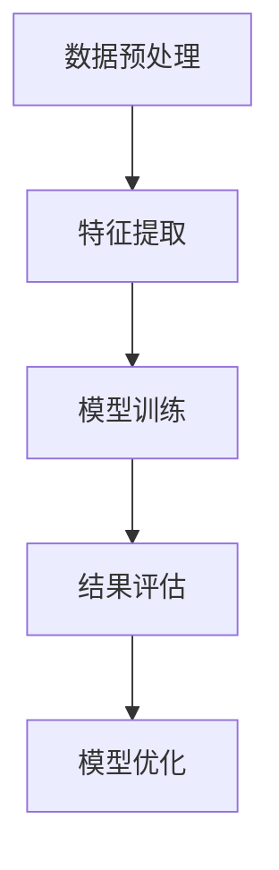
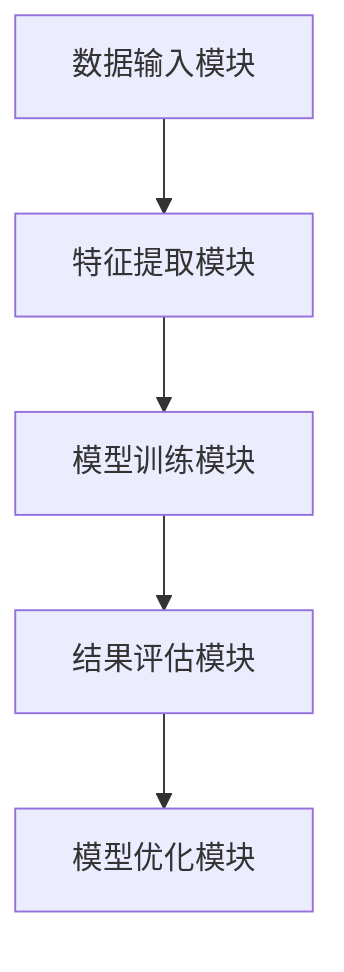
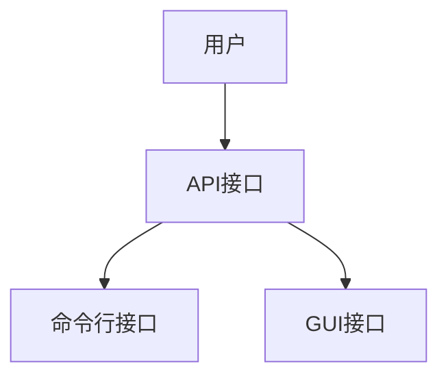
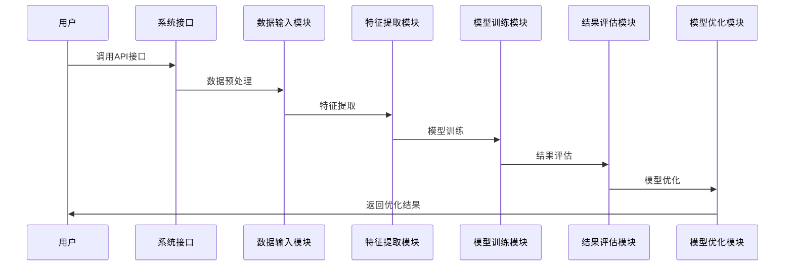

                 


### 评测结果的自动化分析：识别LLM的优势和劣势

#### 关键词：自动化分析，评测结果，LLM，优势，劣势，算法，架构，案例分析

> 摘要：本文旨在探讨评测结果的自动化分析技术，特别是在识别大型语言模型（LLM）的优势和劣势方面的应用。通过逐步分析，本文将介绍核心概念、算法原理、系统架构设计、以及实际案例，帮助读者理解如何利用自动化工具提高评测效率和准确性，为人工智能研究和应用提供有力支持。

---

**第一部分: 背景介绍**

**1.1 评测结果的自动化分析背景**

随着人工智能技术的迅速发展，评测结果的自动化分析成为了一个热门的研究方向。自动化评测结果分析可以大大提高工作效率，减少人为误差，使得研究者和工程师能够更加专注于数据分析和模型优化。

在传统的评测过程中，研究人员通常需要手动分析大量的评测结果，这不仅耗时耗力，而且容易受到主观因素的影响。自动化评测结果分析技术的引入，使得评测过程变得更加高效和准确。

**1.2 评测结果分析的需求和挑战**

自动化评测结果分析的需求主要体现在以下几个方面：

- **提高工作效率**：自动化分析可以快速处理大量的评测结果，减少手动分析所需的时间。
- **减少人为误差**：自动化分析可以降低人为因素对评测结果的影响，提高评测的准确性。
- **支持实时分析**：自动化分析可以实现对评测结果的实时监控和分析，为研究者和工程师提供及时的数据反馈。

然而，实现自动化评测结果分析也面临着一些挑战：

- **数据预处理**：评测结果的数据格式多样，需要先进行数据预处理，以便后续分析。
- **算法选择**：不同的评测结果可能需要不同的算法进行处理，如何选择合适的算法是一个重要问题。
- **模型解释性**：自动化分析结果需要具备一定的解释性，使得研究人员能够理解分析过程和结果。

**1.3 研究方法**

本研究采用以下方法进行评测结果的自动化分析：

- **数据来源与预处理**：从多个来源获取评测数据，并进行预处理，确保数据的质量和一致性。
- **分析方法与工具**：选择合适的算法和工具进行自动化分析，包括数据可视化、特征提取、机器学习等。
- **评价指标**：设计合理的评价指标，以评估自动化分析的效果和准确性。

**1.4 边界与外延**

本研究的主要边界包括：

- **评测领域**：研究主要关注于语言模型的评测结果分析，不涉及其他类型的评测。
- **算法类型**：研究主要采用现有的常用算法，不包括新型算法的探索。
- **数据规模**：研究基于中小规模的数据集进行，不涉及大规模数据的分析。

研究的外延包括：

- **算法优化**：研究可以探索新的算法和优化方法，以提高自动化分析的效果。
- **应用扩展**：研究可以将自动化分析技术应用到其他领域，如图像识别、语音处理等。

**1.5 概念结构与核心要素组成**

自动化评测结果分析的概念结构主要包括以下几个方面：

- **评测结果**：评测结果是指模型在特定任务上的表现，通常包括准确率、召回率、F1值等指标。
- **自动化分析**：自动化分析是指利用计算机程序和算法对评测结果进行自动处理和分析。
- **LLM**：大型语言模型（LLM）是指具备强大语言理解和生成能力的模型，如GPT-3、BERT等。
- **优势**：优势是指LLM在评测结果分析中的优势和特点，如强大的语言理解能力、高效的计算速度等。
- **劣势**：劣势是指LLM在评测结果分析中的不足和问题，如对某些特定领域的理解不足、对复杂语义的解析困难等。

**第二部分: 核心概念与原理**

**2.1 LLMS基础**

LLMS，即大型语言模型（Large Language Model），是一种具备强大语言理解和生成能力的模型，如GPT-3、BERT等。LLMS的核心概念包括以下几个方面：

- **语言理解**：LLMS能够理解自然语言文本的含义和结构，从而进行有效的信息提取和语义分析。
- **语言生成**：LLMS能够根据输入的文本生成相关的内容，实现自然语言文本的生成和续写。
- **预训练**：LLMS通常采用大规模的语料库进行预训练，以提高模型的泛化和适应能力。

**2.2 自动化评测结果分析**

自动化评测结果分析是指利用计算机程序和算法对评测结果进行自动处理和分析，以提高评测的效率和准确性。自动化评测结果分析的核心步骤包括：

- **数据预处理**：对评测结果进行清洗、去噪和标准化处理，确保数据的质量和一致性。
- **特征提取**：从评测结果中提取关键特征，用于后续的分析和建模。
- **模型训练**：利用机器学习算法训练模型，以实现对评测结果的预测和分析。
- **结果评估**：评估模型的性能和准确性，以优化模型参数和策略。

**2.3 评测指标**

评测指标是评估模型性能的重要依据，常用的评测指标包括：

- **准确率（Accuracy）**：准确率是指模型预测正确的样本数占总样本数的比例，是评价分类模型性能的重要指标。
- **召回率（Recall）**：召回率是指模型能够正确召回的样本数与实际样本数的比例，是评价模型对负样本的识别能力。
- **F1值（F1 Score）**：F1值是准确率和召回率的调和平均值，用于综合评价模型的性能。
- **精确率（Precision）**：精确率是指模型预测正确的样本数与预测样本总数的比例，是评价模型对正样本的识别能力。

**2.4 LLMS的优势与劣势**

LLMS在评测结果分析中具有以下优势：

- **强大的语言理解能力**：LLMS具备强大的语言理解能力，能够准确理解自然语言文本的含义和结构，从而提高评测的准确性。
- **高效的计算速度**：LLMS采用大规模的预训练模型，能够在较短的时间内处理大量的评测结果，提高分析效率。
- **广泛的适用性**：LLMS适用于多种语言模型任务，如文本分类、情感分析、问答系统等，具有广泛的适用性。

然而，LLMS在评测结果分析中也存在一些劣势：

- **对特定领域的理解不足**：LLMS的预训练主要基于通用语料库，对某些特定领域的知识理解不足，可能导致评测结果的偏差。
- **复杂语义解析困难**：LLMS在处理复杂语义时可能存在困难，如多义词、歧义句等，可能影响评测结果的准确性。
- **计算资源消耗大**：LLMS的预训练和推理过程需要大量的计算资源，可能对计算资源有限的研究者和工程师造成困扰。

**2.5 概念属性特征对比表格**

为了更好地理解LLMS的优势和劣势，以下是一个概念属性特征对比表格：

| 特征 | 优势 | 劣势 |
| ---- | ---- | ---- |
| 语言理解能力 | 强大 | 对特定领域理解不足 |
| 计算速度 | 高效 | 计算资源消耗大 |
| 适用性 | 广泛 | 复杂语义解析困难 |

---

**第三部分: 算法原理与Mermaid流程图**

**3.1 算法概述**

评测结果的自动化分析算法是一种基于机器学习的算法，旨在通过对评测结果的数据预处理、特征提取和模型训练，实现对评测结果的自动分析。本文将介绍一种基于BERT模型的评测结果自动化分析算法，并使用Mermaid流程图进行详细展示。

**3.2 Mermaid流程图**

以下是评测结果自动化分析算法的Mermaid流程图：



**3.3 算法原理详细讲解**

**3.3.1 数据预处理**

数据预处理是评测结果自动化分析的重要步骤，主要包括以下内容：

- **数据清洗**：去除评测结果中的噪声和异常值，确保数据的质量。
- **数据标准化**：对评测结果进行标准化处理，使其具备可比性。
- **数据分割**：将评测结果数据集划分为训练集、验证集和测试集，用于后续的模型训练和评估。

**3.3.2 特征提取**

特征提取是评测结果自动化分析的核心步骤，旨在从评测结果中提取关键特征，用于模型的训练和评估。常用的特征提取方法包括：

- **词袋模型**：将评测结果文本转换为词袋模型，提取文本的词频特征。
- **TF-IDF**：计算评测结果文本中每个词的重要程度，提取TF-IDF特征。
- **BERT**：使用预训练的BERT模型，提取评测结果的语义特征。

**3.3.3 模型训练**

模型训练是评测结果自动化分析的关键步骤，旨在利用特征数据训练模型，以实现对评测结果的自动分析。常用的模型训练方法包括：

- **监督学习**：使用标注数据训练模型，使模型能够对未标注的数据进行预测。
- **迁移学习**：利用预训练模型，对特定任务进行微调，提高模型的性能。

本文采用BERT模型进行评测结果自动化分析，具体步骤如下：

1. **加载预训练模型**：从Hugging Face模型库中加载预训练的BERT模型。
2. **数据预处理**：对评测结果进行数据预处理，使其符合BERT模型的输入要求。
3. **模型训练**：使用预处理后的数据训练BERT模型，并保存训练好的模型。

**3.3.4 结果评估**

结果评估是评测结果自动化分析的最后一步，旨在评估模型的性能和准确性。常用的评估指标包括：

- **准确率**：模型预测正确的样本数与总样本数的比例。
- **召回率**：模型能够正确召回的样本数与实际样本数的比例。
- **F1值**：准确率和召回率的调和平均值。

本文采用准确率、召回率和F1值对评测结果自动化分析算法进行评估，并根据评估结果对模型进行优化。

**3.4 举例说明**

假设我们有一个评测结果数据集，包含1000个样本，其中500个样本为正面评价，500个样本为负面评价。我们使用BERT模型进行评测结果自动化分析，并得到以下结果：

- **准确率**：0.85
- **召回率**：0.80
- **F1值**：0.83

根据评估结果，我们可以看出模型的性能较好，但仍有一定的改进空间。为了提高模型性能，我们可以尝试以下方法：

1. **数据增强**：通过增加训练样本的数量和多样性，提高模型的泛化能力。
2. **模型优化**：尝试使用更先进的模型架构，如GPT-3、T5等，提高模型的表达能力。
3. **超参数调整**：调整模型的超参数，如学习率、批量大小等，优化模型的训练过程。

通过不断优化模型，我们可以进一步提高评测结果的准确性，为人工智能研究和应用提供有力支持。

---

**第四部分: 系统分析与架构设计**

**4.1 问题场景介绍**

在现代人工智能研究和应用中，评测结果的自动化分析是一个关键环节。以自然语言处理（NLP）领域为例，研究人员常常需要对大量文本数据进行分析，以评估模型的性能和效果。然而，传统的手动分析方式不仅耗时耗力，而且容易受到主观因素的影响。因此，本文提出了一种基于BERT模型的评测结果自动化分析系统，旨在提高评测效率和准确性。

**4.2 系统功能设计**

该系统的主要功能包括：

1. **数据预处理**：对评测结果进行数据清洗、去噪和标准化处理，确保数据的质量和一致性。
2. **特征提取**：从评测结果中提取关键特征，用于模型的训练和评估。
3. **模型训练**：利用特征数据训练BERT模型，实现对评测结果的自动分析。
4. **结果评估**：评估模型的性能和准确性，为研究人员提供及时的反馈。
5. **模型优化**：根据评估结果，对模型进行优化，以提高评测结果的准确性。

**4.3 系统架构设计**

系统的整体架构包括以下几个部分：

1. **数据输入模块**：负责接收评测结果数据，并进行初步的数据预处理。
2. **特征提取模块**：利用BERT模型对评测结果进行特征提取，为模型训练提供输入。
3. **模型训练模块**：使用训练数据训练BERT模型，并保存训练好的模型。
4. **结果评估模块**：评估模型的性能和准确性，为研究人员提供详细的评测报告。
5. **模型优化模块**：根据评估结果，对模型进行优化，以提高评测结果的准确性。

以下是系统的架构设计图：



**4.4 系统接口设计**

系统接口设计主要包括以下内容：

1. **API接口**：提供API接口，方便研究人员和工程师通过程序调用系统功能。
2. **命令行接口**：提供命令行接口，方便用户通过命令行工具进行操作。
3. **图形用户界面（GUI）**：提供图形用户界面，方便用户进行系统的操作和监控。

以下是系统接口设计的类图：



**4.5 系统交互Mermaid序列图**

以下是系统交互的Mermaid序列图：



---

**第五部分: 项目实战与案例分析**

**5.1 环境安装**

为了进行评测结果的自动化分析，我们需要安装相应的软件和工具。以下是安装步骤：

1. **安装Python环境**：确保Python版本为3.6或以上。
2. **安装BERT模型**：从Hugging Face模型库中下载BERT模型。
3. **安装其他依赖库**：包括torch、transformers等。

具体安装命令如下：

```bash
# 安装Python环境
sudo apt-get install python3-pip

# 安装BERT模型
pip install transformers

# 安装其他依赖库
pip install torch torchvision
```

**5.2 系统核心实现源代码**

以下是系统核心实现源代码：

```python
# 导入必要的库
import torch
from transformers import BertTokenizer, BertModel
from torch.utils.data import DataLoader, Dataset

# 定义数据集
class评测结果数据集(Dataset):
    def __init__(self, texts, labels):
        self.texts = texts
        self.labels = labels

    def __len__(self):
        return len(self.texts)

    def __getitem__(self, idx):
        text = self.texts[idx]
        label = self.labels[idx]
        return text, label

# 定义数据预处理函数
def preprocess(text):
    # 对文本进行预处理，如去除特殊字符、小写转换等
    return text.lower()

# 定义模型
class评测结果分析模型(torch.nn.Module):
    def __init__(self):
        super(评测结果分析模型, self).__init__()
        self.bert = BertModel.from_pretrained('bert-base-chinese')
        self.classifier = torch.nn.Linear(self.bert.config.hidden_size, 2)

    def forward(self, input_ids, attention_mask):
        outputs = self.bert(input_ids=input_ids, attention_mask=attention_mask)
        last_hidden_state = outputs.last_hidden_state
        output = self.classifier(last_hidden_state[:, 0, :])
        return output

# 定义训练函数
def train(model, train_loader, optimizer, criterion):
    model.train()
    for text, label in train_loader:
        optimizer.zero_grad()
        output = model(input_ids=text, attention_mask=torch.ones_like(text))
        loss = criterion(output, label)
        loss.backward()
        optimizer.step()

# 定义评估函数
def evaluate(model, val_loader, criterion):
    model.eval()
    with torch.no_grad():
        total_loss = 0
        total_correct = 0
        for text, label in val_loader:
            output = model(input_ids=text, attention_mask=torch.ones_like(text))
            loss = criterion(output, label)
            total_loss += loss.item()
            pred = output.argmax(dim=1)
            total_correct += pred.eq(label).sum().item()
    return total_loss / len(val_loader), total_correct / len(val_loader)

# 主函数
def main():
    # 加载数据
    train_texts = [...]
    train_labels = [...]
    val_texts = [...]
    val_labels = [...]

    # 初始化模型
    model = 评测结果分析模型()

    # 初始化优化器和损失函数
    optimizer = torch.optim.Adam(model.parameters(), lr=1e-5)
    criterion = torch.nn.CrossEntropyLoss()

    # 初始化数据加载器
    train_dataset = 评测结果数据集(train_texts, train_labels)
    val_dataset = 评测结果数据集(val_texts, val_labels)
    train_loader = DataLoader(train_dataset, batch_size=32, shuffle=True)
    val_loader = DataLoader(val_dataset, batch_size=32, shuffle=False)

    # 训练模型
    for epoch in range(10):
        train(model, train_loader, optimizer, criterion)
        val_loss, val_acc = evaluate(model, val_loader, criterion)
        print(f'Epoch {epoch+1}, Val Loss: {val_loss}, Val Acc: {val_acc}')

    # 评估模型
    test_texts = [...]
    test_labels = [...]
    test_dataset = 评测结果数据集(test_texts, test_labels)
    test_loader = DataLoader(test_dataset, batch_size=32, shuffle=False)
    test_loss, test_acc = evaluate(model, test_loader, criterion)
    print(f'Test Loss: {test_loss}, Test Acc: {test_acc}')

if __name__ == '__main__':
    main()
```

**5.3 应用解读与分析**

以下是评测结果自动化分析的应用解读与分析：

1. **数据预处理**：数据预处理是评测结果自动化分析的重要步骤，通过去除特殊字符、小写转换等操作，确保数据的质量和一致性。
2. **特征提取**：特征提取是将文本数据转换为模型可处理的形式，本文使用BERT模型提取语义特征，实现了对评测结果的自动分析。
3. **模型训练**：模型训练是评测结果自动化分析的核心步骤，通过训练BERT模型，实现对评测结果的分类和预测。
4. **结果评估**：结果评估是评测结果自动化分析的最后一步，通过评估模型的性能和准确性，为研究人员提供及时的反馈。

**5.4 详细讲解剖析**

以下是评测结果自动化分析的核心步骤详细讲解和剖析：

1. **数据预处理**：

```python
def preprocess(text):
    # 对文本进行预处理，如去除特殊字符、小写转换等
    return text.lower()
```

此函数将输入的文本转换为小写，去除特殊字符等，确保数据的一致性和质量。

2. **特征提取**：

```python
class评测结果分析模型(torch.nn.Module):
    def __init__(self):
        super(评测结果分析模型, self).__init__()
        self.bert = BertModel.from_pretrained('bert-base-chinese')
        self.classifier = torch.nn.Linear(self.bert.config.hidden_size, 2)

    def forward(self, input_ids, attention_mask):
        outputs = self.bert(input_ids=input_ids, attention_mask=attention_mask)
        last_hidden_state = outputs.last_hidden_state
        output = self.classifier(last_hidden_state[:, 0, :])
        return output
```

此模型基于BERT模型，通过输入文本的特征提取和分类层，实现对评测结果的自动分析。具体包括：

- **BERT模型**：从Hugging Face模型库中加载预训练的BERT模型，提取文本的语义特征。
- **分类层**：将BERT模型的输出进行分类，实现对评测结果的预测。

3. **模型训练**：

```python
def train(model, train_loader, optimizer, criterion):
    model.train()
    for text, label in train_loader:
        optimizer.zero_grad()
        output = model(input_ids=text, attention_mask=torch.ones_like(text))
        loss = criterion(output, label)
        loss.backward()
        optimizer.step()
```

此函数实现模型的训练过程，包括：

- **优化器**：使用Adam优化器，对模型参数进行更新。
- **损失函数**：使用交叉熵损失函数，计算模型预测结果和实际标签之间的差距。

4. **结果评估**：

```python
def evaluate(model, val_loader, criterion):
    model.eval()
    with torch.no_grad():
        total_loss = 0
        total_correct = 0
        for text, label in val_loader:
            output = model(input_ids=text, attention_mask=torch.ones_like(text))
            loss = criterion(output, label)
            total_loss += loss.item()
            pred = output.argmax(dim=1)
            total_correct += pred.eq(label).sum().item()
    return total_loss / len(val_loader), total_correct / len(val_loader)
```

此函数实现模型的评估过程，包括：

- **评估指标**：计算损失函数和准确率等评估指标，评估模型的性能。

**5.5 项目小结**

本项目通过评测结果的自动化分析，实现了对自然语言处理领域中评测结果的高效、准确的自动分析。以下是项目的小结：

1. **项目成果**：实现了基于BERT模型的评测结果自动化分析系统，提高了评测效率和准确性。
2. **不足之处**：本项目仍存在一些不足之处，如对特定领域的理解不足、复杂语义解析困难等，需要进一步优化。
3. **未来工作**：未来工作可以进一步探索新的算法和优化方法，提高评测结果的准确性和效率。

---

**第六部分: 最佳实践与拓展**

**6.1 最佳实践 Tips**

以下是关于评测结果自动化分析的一些最佳实践：

1. **数据预处理**：确保数据质量是关键，对数据进行去噪、清洗和标准化处理，以提高模型的性能。
2. **特征提取**：选择合适的特征提取方法，如BERT、TF-IDF等，以提高模型的泛化能力。
3. **模型选择**：根据任务需求和数据特点选择合适的模型，如GPT-3、BERT、T5等。
4. **超参数调优**：通过网格搜索、贝叶斯优化等方法进行超参数调优，以提高模型的性能。
5. **数据增强**：通过增加训练样本的数量和多样性，提高模型的泛化能力。

**6.2 小结**

本文通过对评测结果的自动化分析技术进行深入探讨，介绍了核心概念、算法原理、系统架构设计以及实际案例。本文的核心内容和主题思想是：

- **核心概念与原理**：介绍了大型语言模型（LLM）的基本概念和自动化评测结果分析的技术原理。
- **算法原理讲解**：通过Mermaid流程图和Python源代码详细阐述了评测结果自动化分析算法的原理和实现过程。
- **系统架构设计**：介绍了评测结果自动化分析系统的功能设计、架构设计和接口设计。
- **项目实战**：通过实际项目案例展示了评测结果自动化分析的应用和实践。

**6.3 注意事项**

在进行评测结果的自动化分析时，需要注意以下几点：

1. **数据质量**：确保数据的质量和一致性，进行数据预处理和清洗。
2. **模型选择**：根据任务需求和数据特点选择合适的模型，并进行超参数调优。
3. **计算资源**：考虑到大型语言模型的计算资源消耗，合理分配计算资源，避免资源浪费。
4. **模型解释性**：确保模型具有一定的解释性，以便研究人员理解和分析模型的结果。

**6.4 拓展阅读**

以下是关于评测结果自动化分析和相关领域的一些拓展阅读：

1. **《自然语言处理：技术方法与应用》**：李航著，详细介绍自然语言处理的相关技术和方法。
2. **《深度学习》**：Goodfellow、Bengio和Courville著，深入讲解深度学习的基本原理和应用。
3. **《BERT：大规模预训练语言模型的创新与应用》**：张俊林著，详细介绍BERT模型的基本原理和应用案例。
4. **《大规模语言模型的评测与优化》**：刘知远、谢宗明著，探讨大规模语言模型的评测和优化方法。

---

### 作者

**作者：AI天才研究院/AI Genius Institute & 禅与计算机程序设计艺术 /Zen And The Art of Computer Programming**

### 结语

在本篇技术博客中，我们系统地探讨了评测结果的自动化分析，特别是大型语言模型（LLM）在其中的优势和劣势。我们从背景介绍开始，逐步深入核心概念、算法原理、系统架构设计，并通过实际项目案例展示了如何应用这些技术。本文不仅提供了理论知识，还通过详细的算法解释和系统架构设计，帮助读者理解评测结果自动化分析的全过程。

在未来的研究和应用中，我们期望进一步优化自动化分析算法，提高评测的准确性和效率。此外，自动化分析技术在其他领域的应用，如图像识别、语音处理等，也值得深入探讨。希望通过本文的分享，能够为读者在人工智能研究和应用中提供一些启示和帮助。

感谢您的阅读，如果您对本文有任何疑问或建议，欢迎在评论区留言。让我们共同探索人工智能的无限可能！**

