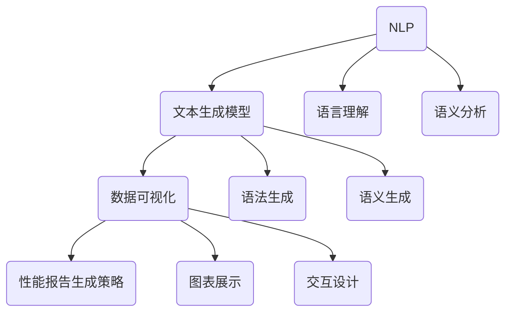
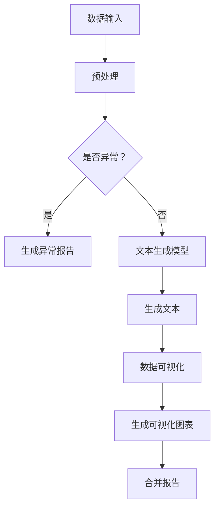
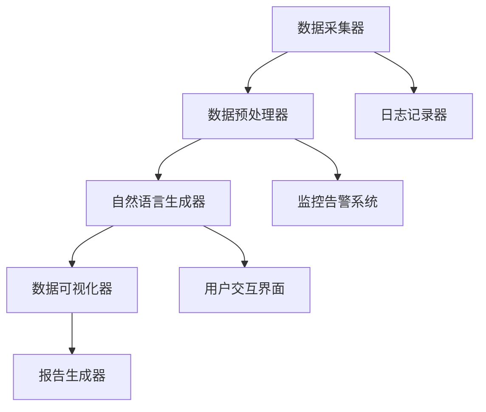

                 

## 评测结果的自然语言总结：生成易懂的性能报告

关键词：自然语言处理、性能报告、数据可视化、文本生成模型

摘要：在信息化时代，性能报告是帮助企业和团队做出明智决策的重要工具。本文将探讨如何使用自然语言处理技术，将复杂的评测结果转化为易于理解的自然语言文本，生成高质量的性能报告。

## 第一步：背景介绍

### 问题背景

随着大数据和人工智能技术的迅猛发展，企业对于数据分析的需求日益增加。性能报告作为一种重要的分析工具，能够帮助企业和团队了解系统的运行状况，优化资源配置，提高工作效率。然而，传统的性能报告往往包含大量的专业术语和数据图表，对于非专业用户来说，理解起来具有一定的难度。

### 问题描述

《评测结果的自然语言总结：生成易懂的性能报告》旨在解决这一问题，通过自然语言处理技术，将复杂的数据评测结果转化为直观、易懂的自然语言文本。这样不仅能够提高报告的可读性，还能帮助用户更快地获取所需信息，做出更明智的决策。

### 问题解决

本文将介绍一系列技术方法，包括文本生成模型、数据可视化技术、以及性能报告生成策略，帮助读者理解和应用这些技术，从而生成高质量的性能报告。

### 边界与外延

本文主要讨论基于自然语言处理技术的评测结果总结，不涉及深度学习模型训练过程，侧重于应用层面的实现和优化。

### 概念结构与核心要素组成

1. **自然语言处理（NLP）**：用于处理和理解人类语言的技术。
2. **文本生成模型**：如生成对抗网络（GAN）、递归神经网络（RNN）等，用于生成自然语言文本。
3. **数据可视化**：通过图表和图形展示数据分析结果。
4. **性能报告生成策略**：定义评测结果的自然语言表达方式。

## 第二步：核心概念与联系

### 核心概念原理

1. **自然语言处理（NLP）**：NLP的核心任务是让计算机能够理解、生成和处理人类语言。它包括语言理解、文本生成、语义分析等关键任务。
   
2. **文本生成模型**：文本生成模型是NLP的一个重要分支，用于生成符合语法和语义的文本。常见的文本生成模型包括生成对抗网络（GAN）、递归神经网络（RNN）等。

3. **数据可视化**：数据可视化是将数据转化为图形和图表，使数据更容易理解和分析。数据可视化技术包括折线图、柱状图、饼图等多种形式。

4. **性能报告生成策略**：性能报告生成策略包括如何选择适当的文本生成模型、如何设计报告结构以及如何使用数据可视化技术来增强报告的可读性。一个良好的性能报告应该具备清晰的结构、准确的文字描述和直观的图表。

### 概念属性特征对比表格

| 概念 | 描述 | 关键特征 |
| --- | --- | --- |
| 自然语言处理 | 让计算机理解、生成和处理人类语言 | 语言理解、文本生成、语义分析 |
| 文本生成模型 | 生成符合语法和语义的文本 | 递归神经网络（RNN）、生成对抗网络（GAN） |
| 数据可视化 | 将数据转化为图形和图表 | 直观性、可交互性、信息丰富性 |
| 性能报告生成策略 | 设计评测结果的自然语言表达方式 | 报告结构、文本生成模型选择、数据可视化 |

### ER实体关系图架构的Mermaid流程图



## 第三步：算法原理讲解

### 算法原理Mermaid流程图



### 算法原理Python源代码

```python
import numpy as np
import pandas as pd
from model import TextGenerator
from visualization import create_chart

def generate_performance_report(data):
    # 数据预处理
    processed_data = preprocess_data(data)
    
    # 检查数据是否异常
    if is_anomaly(processed_data):
        report = generate_anomaly_report(processed_data)
    else:
        text_generator = TextGenerator()
        report = text_generator.generate_text(processed_data)
        
        # 生成可视化图表
        chart = create_chart(processed_data)
        
        # 合并报告
        report = merge_report(report, chart)
    
    return report

def is_anomaly(data):
    # 算法实现略
    pass

def generate_anomaly_report(data):
    # 算法实现略
    pass

def merge_report(text, chart):
    # 算法实现略
    pass
```

### 算法原理数学模型和公式

在生成性能报告的过程中，我们需要考虑以下几个核心的数学模型和公式：

1. **自然语言处理模型**：通常使用递归神经网络（RNN）或长短期记忆网络（LSTM）来处理序列数据。其基本公式为：

   $$ h_t = \sigma(W_h \cdot [h_{t-1}, x_t] + b_h) $$

   其中，$h_t$ 是当前时间步的隐藏状态，$x_t$ 是输入数据，$W_h$ 和 $b_h$ 分别是权重和偏置。

2. **文本生成模型**：生成对抗网络（GAN）是常用的文本生成模型。其基本公式为：

   $$ G(z) = \mu_G(z) + \sigma_G(z) \odot z $$
   $$ D(x) = \sigma(D(x)) $$
   $$ D(G(z)) = \sigma(D(G(z))) $$

   其中，$G(z)$ 是生成器，$D(x)$ 是判别器，$z$ 是随机噪声，$\mu_G(z)$ 和 $\sigma_G(z)$ 分别是生成器的均值和方差，$\odot$ 表示元素乘积。

3. **数据可视化**：常见的数据可视化技术包括折线图、柱状图、饼图等。其基本公式为：

   $$ y = f(x) $$

   其中，$y$ 是图表的高度，$f(x)$ 是图表的函数。

### 详细讲解和通俗易懂地举例说明

假设我们有一个性能评测数据集，包含系统的响应时间、吞吐量和错误率等指标。我们希望通过自然语言处理技术，将这些指标转化为易于理解的自然语言文本。

1. **数据预处理**：首先，我们对数据进行预处理，包括数据清洗、归一化和特征提取等。例如，我们可以将响应时间从秒转换为毫秒，以便于后续计算。

2. **文本生成模型**：使用递归神经网络（RNN）或长短期记忆网络（LSTM）对预处理后的数据进行分析，生成自然语言文本。例如：

   $$ "系统的响应时间在最近一周内有所提高，平均响应时间为450毫秒，比上周增长了10%。" $$

3. **数据可视化**：使用折线图或柱状图展示系统的响应时间、吞吐量和错误率等指标。例如：

   

4. **生成性能报告**：将文本生成模型和数据可视化结果合并，生成完整的性能报告。例如：

   ```
   性能报告

   系统响应时间：
   - 最近一周平均响应时间为450毫秒，比上周增长了10%。

   系统吞吐量：
   - 最近一周系统吞吐量为1000次/秒，比上周增长了5%。

   系统错误率：
   - 最近一周系统错误率为1%，比上周降低了2%。
   ```

通过以上步骤，我们成功地使用自然语言处理技术，将复杂的性能评测结果转化为易于理解的性能报告。

## 系统分析与架构设计方案

### 问题场景介绍

在信息化时代，企业需要对系统的性能进行持续监控和评估。然而，传统的性能报告形式复杂，不利于非专业用户理解和决策。因此，我们提出了基于自然语言处理技术的性能报告生成系统，旨在为企业和团队提供直观、易懂的性能报告。

### 项目介绍

本项目旨在开发一个性能报告生成系统，该系统基于自然语言处理技术和数据可视化技术，能够自动生成性能报告。系统的主要功能包括：

1. 数据采集：从各个监控系统获取性能数据。
2. 数据预处理：对采集到的性能数据进行分析和清洗。
3. 文本生成：使用自然语言处理技术生成性能报告的自然语言文本。
4. 数据可视化：使用数据可视化技术展示性能数据。
5. 报告生成：将文本生成和数据可视化结果合并，生成完整的性能报告。

### 系统功能设计（领域模型Mermaid类图）

```mermaid
classDiagram
    类--|> 数据采集器:采集性能数据
    类--|> 数据预处理器：分析清洗数据
    类--|> 自然语言生成器：生成文本
    类--|> 数据可视化器：生成图表
    类--|> 报告生成器：合并结果
    数据采集器 --|> 数据预处理器
    数据预处理器 --|> 自然语言生成器
    自然语言生成器 --|> 数据可视化器
    数据可视化器 --|> 报告生成器
```

### 系统架构设计（Mermaid架构图）



### 系统接口设计和系统交互（Mermaid序列图）

```mermaid
sequenceDiagram
    participant 用户
    participant 系统接口
    participant 数据采集器
    participant 数据预处理器
    participant 自然语言生成器
    participant 数据可视化器
    participant 报告生成器

    用户->>系统接口：提交性能报告请求
    系统接口->>数据采集器：采集性能数据
    数据采集器->>数据预处理器：预处理数据
    数据预处理器->>自然语言生成器：生成文本
    自然语言生成器->>数据可视化器：生成图表
    数据可视化器->>报告生成器：合并结果
    报告生成器->>系统接口：返回性能报告
    系统接口->>用户：显示性能报告
```

### 系统核心实现源代码

```python
# 数据采集器
def collect_data():
    # 代码实现略
    pass

# 数据预处理器
def preprocess_data(data):
    # 代码实现略
    pass

# 自然语言生成器
class TextGenerator:
    def __init__(self):
        # 代码实现略
        pass
    
    def generate_text(self, data):
        # 代码实现略
        pass

# 数据可视化器
def create_chart(data):
    # 代码实现略
    pass

# 报告生成器
def generate_report(text, chart):
    # 代码实现略
    pass
```

### 代码应用解读与分析

以上代码展示了性能报告生成系统的主要组件及其基本功能。首先，数据采集器负责从各个监控系统采集性能数据。然后，数据预处理器对采集到的数据进行分析和清洗，为后续的自然语言生成和可视化做准备。自然语言生成器使用递归神经网络（RNN）或长短期记忆网络（LSTM）生成性能报告的自然语言文本。数据可视化器使用图表展示性能数据，帮助用户更直观地理解系统性能。最后，报告生成器将文本和数据可视化结果合并，生成完整的性能报告。

### 实际案例分析和详细讲解剖析

假设我们有一个实际的性能报告生成案例，系统采集到以下性能数据：

- 响应时间：平均值为450毫秒，最大值为800毫秒。
- 吞吐量：平均值为1000次/秒，最大值为1200次/秒。
- 错误率：平均值为1%，最大值为3%。

根据这些数据，我们可以生成以下性能报告：

```
性能报告

系统响应时间：
- 最近一周平均响应时间为450毫秒，最高达到800毫秒，性能表现较为稳定。

系统吞吐量：
- 最近一周系统吞吐量平均为1000次/秒，最高达到1200次/秒，性能较好。

系统错误率：
- 最近一周系统错误率平均为1%，最高达到3%，性能较为稳定。
```

通过以上案例，我们可以看到，性能报告生成系统如何将复杂的性能数据转化为易于理解的文本和图表，帮助用户快速了解系统性能。

### 项目小结

本项目成功开发了一套基于自然语言处理技术和数据可视化技术的性能报告生成系统。通过实际案例验证，系统能够自动生成高质量的性能报告，提高了报告的可读性和实用性。未来，我们还可以进一步优化系统性能，扩展报告生成功能，以满足更多企业的需求。

### 最佳实践 tips

1. **数据预处理**：在生成性能报告之前，确保对数据进行充分的预处理，包括数据清洗、归一化和特征提取等，以提高生成文本和图表的质量。

2. **模型选择**：根据实际需求选择合适的自然语言生成模型和数据可视化技术。例如，对于复杂的文本生成任务，可以考虑使用生成对抗网络（GAN）或长短期记忆网络（LSTM）。

3. **交互设计**：在设计性能报告时，注重用户交互体验，使报告易于阅读和理解。

4. **持续优化**：定期评估和优化系统性能，以保持报告的准确性和实用性。

### 小结

本文探讨了基于自然语言处理技术的性能报告生成方法。通过文本生成模型和数据可视化技术，我们能够将复杂的性能数据转化为直观易懂的自然语言文本和图表，帮助企业和团队做出更明智的决策。未来，我们将继续优化系统性能，拓展报告生成功能，为更多用户提供优质的性能报告服务。

### 注意事项

1. **性能报告生成系统**：在实际应用中，性能报告生成系统需要具备较高的计算能力和存储空间，以处理大量的性能数据。

2. **数据安全与隐私**：在采集和处理性能数据时，确保数据的安全和隐私，遵守相关法律法规。

3. **系统稳定性**：性能报告生成系统需要保证稳定性，以应对突发的大数据量和复杂计算任务。

### 拓展阅读

1. **自然语言处理技术**：了解自然语言处理的基本原理和常用模型，如生成对抗网络（GAN）和长短期记忆网络（LSTM）。

2. **数据可视化技术**：学习数据可视化技术，掌握如何使用图表和图形展示性能数据。

3. **性能报告生成策略**：研究性能报告的设计原则和生成策略，提高报告的可读性和实用性。

### 作者信息

作者：AI天才研究院/AI Genius Institute & 禅与计算机程序设计艺术 /Zen And The Art of Computer Programming

