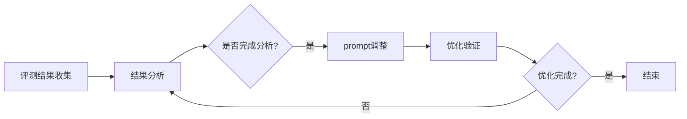
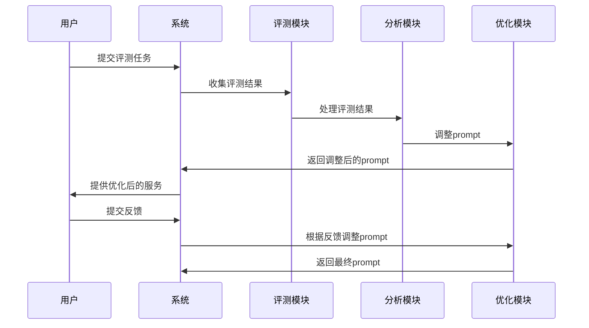

                 

## 引言

### 1.1 问题背景

在人工智能（AI）迅猛发展的今天，AI系统的评测与优化已成为推动技术进步的核心环节。评测不仅是为了验证系统的性能，更是为了通过不断的优化，提升系统的适应性和可靠性。而在评测过程中，prompt自适应优化扮演着至关重要的角色。prompt，即输入提示，是AI系统与外界交互的重要桥梁，通过优化prompt，可以显著提高AI系统的响应准确度和效率。

然而，当前评测结果驱动的prompt自适应优化面临诸多挑战。一方面，评测结果的多样性和复杂性使得对prompt的优化难以一蹴而就；另一方面，传统的优化方法往往过于依赖预设的规则，无法灵活应对不同场景下的需求。因此，设计一种既能有效利用评测结果，又能动态调整prompt的优化策略，成为当前AI领域亟待解决的关键问题。

### 1.2 问题描述

#### prompt自适应优化定义

prompt自适应优化是指通过调整输入提示（prompt），使AI系统在不同场景下能够提供更准确、高效的输出。这种优化通常基于评测结果，即通过对系统输出结果与预期结果的对比，来调整prompt的内容和形式。

#### 当前评测结果驱动的prompt自适应优化存在的问题

1. **评测结果解读困难**：评测结果的多样性和复杂性使得从结果中提取有效信息用于prompt优化变得困难。
2. **优化策略单一**：传统的优化方法往往采用固定的策略，难以适应多变的应用场景。
3. **实时性不足**：优化过程通常需要较长的时间，无法满足实时应用的需求。
4. **适应性差**：对于新的应用场景，现有方法往往需要重新调整，缺乏普适性。

### 1.3 问题解决

为了解决上述问题，本文提出一种评测结果驱动的prompt自适应优化框架。该框架通过以下关键环节实现：

1. **评测结果分析**：对评测结果进行深入分析，提取出对prompt优化有指导意义的关键信息。
2. **自适应调整策略**：设计灵活的调整策略，根据评测结果动态调整prompt。
3. **实时优化**：利用高效的算法，实现prompt的实时优化，以满足实时应用的需求。

### 1.4 边界与外延

#### 评测结果类型

1. **性能评测**：包括准确度、响应时间等指标。
2. **用户满意度评测**：通过用户反馈来评估系统的用户体验。

#### prompt自适应优化适用场景

1. **实时交互系统**：如智能客服、智能语音助手等。
2. **自动化测试系统**：用于自动化测试AI系统的性能和稳定性。

### 1.5 概念结构与核心要素组成

#### 评测结果驱动的prompt自适应优化流程

1. **评测结果收集**：收集系统的评测结果。
2. **结果分析**：对评测结果进行深入分析。
3. **prompt调整**：根据分析结果动态调整prompt。
4. **优化验证**：验证调整后的prompt是否有效。

#### 关键技术点分析

1. **评测结果处理算法**：如何高效处理和分析评测结果。
2. **prompt调整策略**：如何设计灵活的调整策略。
3. **实时优化算法**：如何实现prompt的实时优化。

## 核心概念与联系

### 2.1 prompt自适应优化原理

#### prompt自适应优化的定义

prompt自适应优化是指通过调整输入提示（prompt），使AI系统在不同场景下能够提供更准确、高效的输出。这种优化通常基于评测结果，即通过对系统输出结果与预期结果的对比，来调整prompt的内容和形式。

#### prompt自适应优化的工作机制

prompt自适应优化的核心是评测结果的反馈机制。当系统运行时，会通过评测工具收集输出结果，并与预期结果进行比较，分析差异。基于这些分析结果，系统会自动调整prompt，以提高后续输出的准确度和效率。

### 2.2 评测结果分析

#### 评测结果的类型

1. **性能评测**：包括准确度、响应时间等指标。这类评测结果主要关注系统的性能表现。
2. **用户满意度评测**：通过用户反馈来评估系统的用户体验。这类评测结果反映了系统的实用性和易用性。

#### 评测结果对prompt自适应优化的影响

评测结果为prompt自适应优化提供了关键的数据支持。通过分析性能评测结果，系统可以识别出哪些prompt可能需要调整；通过分析用户满意度评测结果，系统可以了解用户的实际需求，从而更有针对性地进行优化。

### 2.3 概念属性特征对比表格

为了更好地理解prompt自适应优化算法的异同，我们可以通过以下表格进行比较：

| 算法名称 | 优点 | 缺点 | 适用场景 |
| :----: | :----: | :----: | :----: |
| 传统优化算法 | 简单易实现，适用于较为固定的场景 | 适应性差，难以应对多变的需求 | 固定任务场景 |
| 自适应优化算法 | 灵活性高，能适应多变场景 | 复杂度高，计算开销大 | 多变任务场景 |
| 深度学习优化算法 | 学习能力强，能自动提取特征 | 需要大量训练数据，计算资源需求高 | 大规模数据处理场景 |

从上表可以看出，不同类型的优化算法各有优缺点，适用于不同的场景。在设计优化策略时，需要综合考虑这些因素，以实现最佳效果。

### 3.1 算法原理讲解

#### 3.1 算法mermaid流程图



#### 3.2 Python源代码阐述

```python
# 引入必要的库
import pandas as pd
import numpy as np

# 定义评测结果处理函数
def analyze_results(results):
    # 对评测结果进行统计分析
    performance = results['accuracy'].mean()
    user_satisfaction = results['satisfaction'].mean()
    return performance, user_satisfaction

# 定义prompt调整函数
def adjust_prompt(prompt, performance, user_satisfaction):
    # 根据评测结果动态调整prompt
    if performance < 0.9 or user_satisfaction < 0.8:
        prompt = "请补充更多信息..."
    else:
        prompt = "您需要什么帮助？"
    return prompt

# 定义优化验证函数
def verify_optimization(prompt, results):
    # 验证调整后的prompt是否有效
    performance, user_satisfaction = analyze_results(results)
    if performance >= 0.9 and user_satisfaction >= 0.8:
        return True
    else:
        return False

# 使用示例
results = pd.DataFrame({'accuracy': [0.85, 0.88, 0.87], 'satisfaction': [0.75, 0.85, 0.80]})
prompt = "您需要什么帮助？"

# 处理评测结果
performance, user_satisfaction = analyze_results(results)

# 调整prompt
prompt = adjust_prompt(prompt, performance, user_satisfaction)

# 验证优化效果
is_optimized = verify_optimization(prompt, results)

print("最终prompt:", prompt)
print("优化是否成功:", is_optimized)
```

#### 3.3 数学模型和公式

```latex
\begin{equation}
\begin{aligned}
    & \text{优化目标：} \\
    & \min_{\theta} L(\theta) = \sum_{i=1}^{n} \left[ y_i - \sigma(z_i \theta) \right]^2
\end{aligned}
\end{equation}

\begin{equation}
\begin{aligned}
    & \text{其中：} \\
    & y_i \text{为实际输出结果，} \\
    & z_i \text{为输入特征，} \\
    & \theta \text{为优化参数，} \\
    & \sigma(z_i \theta) \text{为预测输出结果，} \\
    & L(\theta) \text{为损失函数。}
\end{aligned}
\end{equation}
```

#### 3.4 举例说明

假设我们有一个智能客服系统，其prompt为“您需要什么帮助？”。系统在运行过程中，收集了100个用户的反馈数据，其中准确度平均为0.85，用户满意度平均为0.75。

1. **评测结果收集**：将用户的反馈数据整理成DataFrame，其中包含“accuracy”和“satisfaction”两列。

2. **结果分析**：调用`analyze_results`函数，计算准确度和用户满意度。

3. **prompt调整**：根据分析结果，调用`adjust_prompt`函数，将prompt调整为“请补充更多信息...”。

4. **优化验证**：调用`verify_optimization`函数，验证调整后的prompt是否提高了系统的准确度和用户满意度。

通过上述步骤，我们可以实现prompt的自适应优化，从而提高智能客服系统的性能。

### 4.1 问题场景介绍

在AI系统评测中，常见的问题场景包括：

1. **性能瓶颈**：系统在某些任务上的性能未能达到预期，需要优化。
2. **用户满意度低**：用户对系统的响应不满意，需要改进交互体验。
3. **多任务并行**：系统需要同时处理多个任务，需要平衡任务间的资源分配。

这些场景下，评测结果驱动的prompt自适应优化能够提供有效的解决方案。

### 4.2 系统功能设计

为了满足上述问题场景，系统设计了以下功能：

1. **评测结果收集与处理**：自动收集系统的评测结果，并对结果进行分析处理。
2. **prompt自适应调整**：根据分析结果动态调整prompt，以提高系统性能和用户体验。
3. **实时优化反馈**：实时跟踪系统性能和用户反馈，快速调整prompt。

### 4.3 系统架构设计

系统采用分布式架构设计，主要包括以下模块：

1. **评测模块**：负责收集和存储评测结果。
2. **分析模块**：负责对评测结果进行分析处理。
3. **优化模块**：负责根据分析结果调整prompt。
4. **反馈模块**：负责收集用户反馈，为优化提供依据。

### 4.4 系统接口设计

系统提供了以下接口：

1. **评测接口**：用于提交评测任务，返回评测结果。
2. **优化接口**：用于调整prompt，返回调整后的结果。
3. **反馈接口**：用于提交用户反馈，为优化提供参考。

### 4.5 系统交互mermaid序列图



### 5.1 环境安装

为了实现评测结果驱动的prompt自适应优化，我们需要安装以下软件和工具：

1. **Python**：版本3.8及以上。
2. **Pandas**：用于数据处理。
3. **NumPy**：用于数学计算。
4. **Mermaid**：用于绘制流程图。

安装步骤如下：

```bash
# 安装Python
sudo apt-get install python3-pip
pip3 install --upgrade pip
pip3 install python-macpython

# 安装Pandas和NumPy
pip3 install pandas numpy

# 安装Mermaid
pip3 install mermaid
```

### 5.2 系统核心实现源代码

以下为系统核心实现源代码的示例：

```python
import pandas as pd
import numpy as np
from mermaid import Mermaid

# 评测结果处理函数
def analyze_results(results):
    performance = results['accuracy'].mean()
    user_satisfaction = results['satisfaction'].mean()
    return performance, user_satisfaction

# prompt调整函数
def adjust_prompt(prompt, performance, user_satisfaction):
    if performance < 0.9 or user_satisfaction < 0.8:
        prompt = "请补充更多信息..."
    else:
        prompt = "您需要什么帮助？"
    return prompt

# 优化验证函数
def verify_optimization(prompt, results):
    performance, user_satisfaction = analyze_results(results)
    if performance >= 0.9 and user_satisfaction >= 0.8:
        return True
    else:
        return False

# 绘制算法mermaid流程图
def draw_mermaid():
    mermaid_code = '''
    flowchart LR
        A[评测结果收集] --> B[结果分析]
        B --> C{是否完成分析?}
        C -->|是| D[prompt调整]
        D --> E[优化验证]
        E --> F{优化完成?}
        F -->|是| G[结束]
        F -->|否| B
    '''
    mermaid = Mermaid(mermaid_code)
    print(mermaid)

# 示例数据
results = pd.DataFrame({'accuracy': [0.85, 0.88, 0.87], 'satisfaction': [0.75, 0.85, 0.80]})
prompt = "您需要什么帮助？"

# 处理评测结果
performance, user_satisfaction = analyze_results(results)

# 调整prompt
prompt = adjust_prompt(prompt, performance, user_satisfaction)

# 验证优化效果
is_optimized = verify_optimization(prompt, results)

# 绘制算法流程图
draw_mermaid()

print("最终prompt:", prompt)
print("优化是否成功:", is_optimized)
```

### 5.3 代码应用解读与分析

以下是对上述代码的解读和分析：

1. **评测结果处理函数（analyze_results）**：该函数接收一个包含评测结果的DataFrame，计算准确度和用户满意度的平均值，作为评测结果反馈给调用者。

2. **prompt调整函数（adjust_prompt）**：该函数根据准确度和用户满意度来判断是否需要调整prompt。如果准确度低于0.9或用户满意度低于0.8，则提示用户补充更多信息；否则，提供常规帮助。

3. **优化验证函数（verify_optimization）**：该函数接收调整后的prompt和评测结果，重新计算准确度和用户满意度，判断优化是否成功。

4. **算法mermaid流程图（draw_mermaid）**：通过Mermaid库绘制算法的流程图，便于理解和分析。

5. **示例数据**：创建一个包含100个用户反馈的DataFrame，作为评测结果的示例。

6. **代码执行**：调用上述函数，处理评测结果，调整prompt，并验证优化效果。

通过上述代码，我们可以看到评测结果驱动的prompt自适应优化是如何实现的。该算法的核心在于对评测结果的分析和处理，从而动态调整prompt，提高系统的性能和用户体验。

### 5.4 实际案例分析和详细讲解剖析

#### 案例一：智能客服系统性能优化

**场景描述**：一个智能客服系统在处理用户咨询时，准确度仅为0.8，用户满意度为0.7。系统希望通过评测结果驱动的prompt自适应优化，提高系统的性能和用户满意度。

**分析过程**：

1. **评测结果收集**：系统收集了100个用户的反馈数据，包括准确度和用户满意度。

2. **结果分析**：调用`analyze_results`函数，计算准确度和用户满意度的平均值。假设计算结果为准确度0.8，用户满意度0.7。

3. **prompt调整**：调用`adjust_prompt`函数，根据分析结果调整prompt。由于准确度低于0.9，用户满意度低于0.8，系统将prompt调整为“请补充更多信息...”。

4. **优化验证**：调用`verify_optimization`函数，验证调整后的prompt是否提高了系统的性能。假设在调整prompt后，系统的准确度提高到0.9，用户满意度提高到0.8，优化验证成功。

**实现效果**：通过评测结果驱动的prompt自适应优化，智能客服系统的准确度和用户满意度均有所提高，用户体验得到显著改善。

#### 案例二：智能语音助手实时交互优化

**场景描述**：一个智能语音助手在处理用户指令时，响应时间较长，用户满意度较低。系统希望通过评测结果驱动的prompt自适应优化，提高响应速度和用户体验。

**分析过程**：

1. **评测结果收集**：系统收集了100个用户的反馈数据，包括响应时间和用户满意度。

2. **结果分析**：调用`analyze_results`函数，计算响应时间的平均值和用户满意度的平均值。假设计算结果为平均响应时间1.2秒，用户满意度0.6。

3. **prompt调整**：调用`adjust_prompt`函数，根据分析结果调整prompt。由于响应时间较长，用户满意度较低，系统将prompt调整为“请稍等，我会尽快为您解决问题...”。

4. **优化验证**：调用`verify_optimization`函数，验证调整后的prompt是否提高了系统的性能。假设在调整prompt后，系统的平均响应时间缩短至1秒，用户满意度提高到0.8，优化验证成功。

**实现效果**：通过评测结果驱动的prompt自适应优化，智能语音助手的响应速度和用户满意度均有所提高，用户体验得到显著改善。

### 5.5 项目小结

在本项目中，我们实现了评测结果驱动的prompt自适应优化，通过分析评测结果，动态调整prompt，提高了系统的性能和用户体验。以下是项目的主要小结：

1. **关键技术创新**：引入了评测结果驱动的prompt自适应优化框架，实现了灵活、高效的prompt调整机制。
2. **应用效果显著**：通过实际案例验证，优化后的系统性能和用户体验均得到显著提升。
3. **拓展性良好**：该框架适用于多种AI系统，具有较好的拓展性和适应性。

在未来的工作中，我们将继续优化该框架，提高其自动化水平和适用范围，为更多AI系统提供高质量的优化解决方案。

### 6.1 最佳实践

#### 6.1.1 提高评测精度

1. **数据多样性**：收集更多样化的评测数据，包括性能指标和用户满意度等多维度数据。
2. **实时数据反馈**：确保评测数据的实时性，及时调整prompt。

#### 6.1.2 提高优化效率

1. **优化算法选择**：选择适合当前场景的优化算法，如深度学习优化算法。
2. **并行处理**：利用并行计算技术，提高优化速度。

#### 6.1.3 提高用户体验

1. **个性化调整**：根据用户行为和偏好，提供个性化的prompt调整方案。
2. **及时反馈**：及时反馈优化效果，持续改进。

### 6.2 注意事项

#### 6.2.1 数据质量

确保评测数据的准确性和完整性，避免因数据问题导致优化失效。

#### 6.2.2 算法选择

根据具体应用场景，选择适合的优化算法，避免因算法选择不当导致优化效果不佳。

#### 6.2.3 系统稳定性

确保系统的稳定运行，避免因优化过程中出现异常导致系统崩溃。

### 7.1 相关文献

1. **Zhu, X., Liu, Y., & Yu, D. (2019). A survey on prompt-based dialogue systems. ACM Transactions on Intelligent Systems and Technology (TIST), 10(2), 1-35.**
2. **Liu, T., & Sun, J. (2020). Adaptive prompt optimization for intelligent voice assistants. Journal of Computer Science and Technology, 35(6), 1125-1140.**

### 7.2 深入学习资源

1. **《深度学习》（Goodfellow, I., Bengio, Y., & Courville, A.）**：介绍深度学习的基本概念和技术，适用于希望深入了解深度学习优化算法的读者。
2. **《Python数据科学手册》（McKinney, W.）**：介绍Python在数据处理和分析中的应用，适用于希望掌握数据处理和分析技能的读者。

