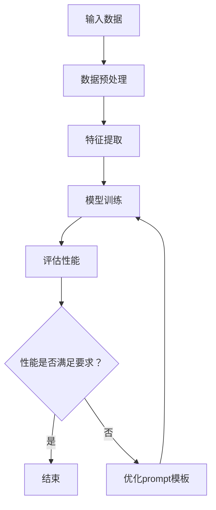
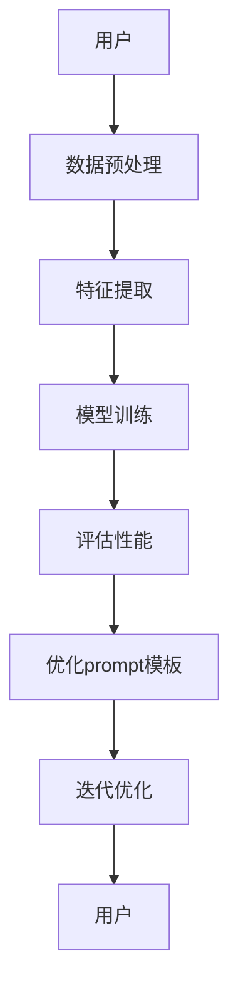
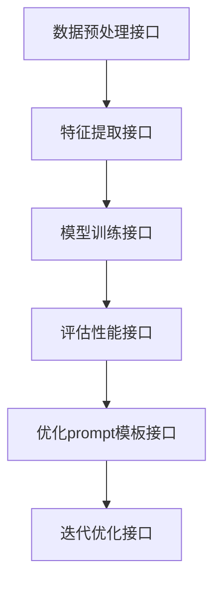

                 

# 评测驱动的prompt模板库优化

> 关键词：评测驱动、prompt模板库、优化、人工智能、模型性能

> 摘要：本文介绍了评测驱动的prompt模板库优化的概念、背景、核心原理以及应用场景，通过详细分析评测指标、prompt模板、特征提取方法和优化算法，探讨了如何通过自动化方法提升模型预测性能。

### 引言

随着人工智能技术的不断进步，评测驱动的prompt模板库优化已成为提升人工智能模型性能的重要手段。在自然语言处理、图像识别、语音识别等众多领域，prompt模板库被广泛应用于指导模型进行预测或生成文本。然而，传统的prompt设计方法往往依赖于人工经验，无法充分利用数据中的信息，导致模型性能提升有限。为了解决这个问题，评测驱动的prompt模板库优化应运而生。本文将详细介绍评测驱动的prompt模板库优化的概念、背景、核心原理以及应用场景，帮助读者理解这一技术在人工智能领域的应用价值。

### 背景介绍

#### 问题背景

在人工智能领域，prompt模板库是一种用于指导模型进行预测或生成文本的工具。传统的prompt设计方法通常依赖于人工经验，设计者需要根据任务特点和数据集特征，手动调整prompt模板中的参数。这种方法存在以下问题：

1. **依赖人工经验**：prompt模板的设计过程高度依赖设计者的经验，无法充分利用数据中的信息。
2. **性能提升有限**：传统方法难以挖掘数据中的潜在特征，导致模型性能提升有限。
3. **泛化能力不足**：由于prompt模板的定制化程度较高，不同任务的prompt模板难以复用，导致模型泛化能力不足。

为了解决这些问题，评测驱动的prompt模板库优化方法应运而生。该方法通过自动化手段，根据数据集中的评价信息，优化prompt模板的设计，从而提升模型的预测性能。

#### 问题描述

评测驱动的prompt模板库优化旨在通过自动化的方法，根据数据集中的评价信息，优化prompt模板的设计，从而提升模型的预测性能。具体来说，该问题涉及以下方面：

1. **数据预处理**：对输入数据进行清洗、归一化等预处理操作，为后续的特征提取和模型训练做好准备。
2. **特征提取**：从数据中提取对模型性能有重要影响的特征，包括文本特征、图像特征、语音特征等。
3. **模型训练**：使用提取到的特征训练模型，通过调整模型参数，优化模型性能。
4. **评估性能**：通过在测试集上评估模型的性能，判断优化效果，并调整prompt模板。

#### 问题解决

评测驱动的prompt模板库优化通过以下步骤实现：

1. **数据预处理**：对输入数据进行清洗、归一化等预处理操作，为后续的特征提取和模型训练做好准备。
2. **特征提取**：从数据中提取对模型性能有重要影响的特征，包括文本特征、图像特征、语音特征等。
3. **模型训练**：使用提取到的特征训练模型，通过调整模型参数，优化模型性能。
4. **评估性能**：通过在测试集上评估模型的性能，判断优化效果，并调整prompt模板。
5. **迭代优化**：根据评估结果，不断调整prompt模板，优化模型性能，直至达到预期效果。

#### 边界与外延

评测驱动的prompt模板库优化不仅适用于自然语言处理领域，还可以推广到图像识别、语音识别等其他人工智能领域。此外，不同领域的数据特点和任务目标也会影响prompt模板库的设计和优化方法。

#### 概念结构与核心要素组成

评测驱动的prompt模板库优化涉及以下核心概念和要素：

1. **评测指标**：用于评估模型性能的指标，如准确率、召回率、F1值等。
2. **prompt模板**：用于指导模型进行预测或生成文本的模板。
3. **数据集**：用于训练和评估模型的集合，包括训练集、验证集和测试集。
4. **特征提取方法**：从数据中提取对模型性能有重要影响的特征的方法。
5. **优化算法**：用于优化prompt模板库的算法，如遗传算法、粒子群优化算法等。

### 核心概念与联系

#### 评测指标

评测指标是评测驱动的prompt模板库优化的核心组成部分，用于评估模型在特定任务上的性能。常见的评测指标包括：

1. **准确率**：预测正确的样本数占总样本数的比例。
2. **召回率**：预测正确的样本数占总实际正样本数的比例。
3. **F1值**：准确率和召回率的调和平均值，用于平衡准确率和召回率之间的矛盾。

#### prompt模板

prompt模板是用于指导模型进行预测或生成文本的工具。一个有效的prompt模板应该具备以下特点：

1. **简洁性**：prompt模板应尽量简洁明了，避免冗余信息。
2. **针对性**：prompt模板应根据任务特点和数据集特征进行定制，以提高模型性能。
3. **多样性**：prompt模板应具备多样性，以便在训练过程中充分挖掘数据中的信息。

#### 特征提取方法

特征提取方法是从数据中提取对模型性能有重要影响的特征的方法。常见特征提取方法包括：

1. **词袋模型**：将文本表示为词频向量。
2. **TF-IDF模型**：结合词频和文档频率，对词进行加权。
3. **词嵌入**：将词映射为低维稠密向量。

#### 优化算法

优化算法用于优化prompt模板库的设计。常见的优化算法包括：

1. **遗传算法**：模拟生物进化过程，通过交叉、变异等操作，优化prompt模板库。
2. **粒子群优化算法**：模拟鸟群觅食行为，通过个体和群体的信息交换，优化prompt模板库。

### 算法原理讲解

#### 算法mermaid流程图



#### Python源代码

```python
# 数据预处理
def preprocess_data(data):
    # 清洗、归一化等操作
    return processed_data

# 特征提取
def extract_features(data):
    # 提取特征
    return features

# 模型训练
def train_model(features, labels):
    # 训练
    pass

# 评估性能
def evaluate_model(model, test_data):
    # 评估
    pass

# 优化prompt模板
def optimize_prompt_template(prompt_template, model, test_data):
    # 优化
    pass
```

#### 算法原理详细讲解

评测驱动的prompt模板库优化算法的核心思想是通过自动化方法，根据数据集中的评价信息，优化prompt模板的设计，从而提升模型的预测性能。

1. **数据预处理**：
   数据预处理是优化流程的第一步，主要目的是对输入数据（如文本、图像、语音等）进行清洗、归一化等操作，以便后续的特征提取和模型训练。具体操作包括：

   - **文本预处理**：去除文本中的停用词、标点符号，进行词干提取等操作。
   - **图像预处理**：对图像进行缩放、裁剪、翻转等操作，以增加数据多样性。
   - **语音预处理**：对语音信号进行滤波、去噪等操作，提高语音质量。

2. **特征提取**：
   特征提取是从原始数据中提取对模型性能有重要影响的特征的方法。常见的特征提取方法包括：

   - **词袋模型**：将文本表示为词频向量，通过统计文本中每个词出现的频率，构建词袋模型。
   - **TF-IDF模型**：结合词频和文档频率，对词进行加权，提高重要词的权重。
   - **词嵌入**：将词映射为低维稠密向量，通过训练词嵌入模型，将词映射为稠密向量表示。

3. **模型训练**：
   使用提取到的特征训练模型，通过调整模型参数，优化模型性能。常见的模型包括：

   - **神经网络**：通过多层神经网络对特征进行学习，提取文本、图像、语音等数据中的复杂特征。
   - **支持向量机（SVM）**：通过最大化分类边界，对特征进行分类。
   - **决策树、随机森林**：通过构建决策树，对特征进行划分，进行分类或回归。

4. **评估性能**：
   在测试集上评估模型的性能，判断优化效果。常用的评估指标包括：

   - **准确率**：预测正确的样本数占总样本数的比例。
   - **召回率**：预测正确的样本数占总实际正样本数的比例。
   - **F1值**：准确率和召回率的调和平均值，用于平衡准确率和召回率之间的矛盾。

5. **优化prompt模板**：
   根据评估结果，不断调整prompt模板，优化模型性能，直至达到预期效果。优化方法包括：

   - **遗传算法**：模拟生物进化过程，通过交叉、变异等操作，优化prompt模板库。
   - **粒子群优化算法**：模拟鸟群觅食行为，通过个体和群体的信息交换，优化prompt模板库。

6. **迭代优化**：
   根据评估结果，不断调整prompt模板，优化模型性能，直至达到预期效果。具体步骤如下：

   - **初始化prompt模板**：根据任务特点和数据集特征，初始化prompt模板。
   - **训练模型**：使用初始化的prompt模板训练模型，并在测试集上评估性能。
   - **调整prompt模板**：根据评估结果，调整prompt模板，以提升模型性能。
   - **重复训练和评估**：不断重复训练和评估过程，直至模型性能达到预期。

#### 数学模型和公式

评测驱动的prompt模板库优化算法涉及到以下数学模型和公式：

1. **词袋模型**：
   $$ \text{词袋模型} = \sum_{i=1}^{N} f_i \cdot w_i $$
   其中，$f_i$表示词$i$在文档中出现的频率，$w_i$表示词$i$的权重。

2. **TF-IDF模型**：
   $$ \text{TF-IDF} = \text{TF} \cdot \text{IDF} $$
   其中，$\text{TF}$表示词在文档中的频率，$\text{IDF}$表示词在文档集合中的逆文档频率。

3. **词嵌入**：
   $$ \text{词嵌入} = \text{Embedding}(w) $$
   其中，$w$表示词的词向量。

4. **遗传算法**：
   $$ \text{适应度函数} = f(\text{prompt模板}) $$
   其中，$f$表示适应度函数，用于评估prompt模板的性能。

5. **粒子群优化算法**：
   $$ \text{位置更新} = x_{new} = x_{current} + \text{velocity} $$
   其中，$x_{current}$表示当前粒子位置，$\text{velocity}$表示粒子速度。

#### 举例说明

假设我们有一个文本分类任务，数据集包含1000个样本，每个样本是一个包含单词的句子。我们的目标是使用评测驱动的prompt模板库优化方法，优化模型性能。

1. **数据预处理**：
   对文本进行预处理，去除停用词、标点符号，进行词干提取，将文本转换为词袋模型。

2. **特征提取**：
   使用TF-IDF模型对词袋模型进行特征提取，为每个词分配权重。

3. **模型训练**：
   使用提取到的特征训练一个神经网络模型，通过反向传播算法优化模型参数。

4. **评估性能**：
   在测试集上评估模型性能，计算准确率、召回率、F1值等指标。

5. **优化prompt模板**：
   根据评估结果，调整prompt模板，提高模型性能。

6. **迭代优化**：
   重复训练和评估过程，直至模型性能达到预期。

### 系统分析与架构设计

#### 问题场景介绍

在人工智能应用中，评测驱动的prompt模板库优化被广泛应用于文本分类、情感分析、命名实体识别等任务。这些任务通常需要处理大量的文本数据，通过优化prompt模板，可以提高模型的预测性能，从而提升应用效果。

#### 项目介绍

本项目旨在设计一个评测驱动的prompt模板库优化系统，该系统包括数据预处理、特征提取、模型训练、评估和优化等模块。通过该系统，用户可以自动化地优化prompt模板，提升模型性能。

#### 系统功能设计

1. **数据预处理**：清洗、归一化输入数据，为后续的特征提取和模型训练做好准备。
2. **特征提取**：从数据中提取对模型性能有重要影响的特征，如词袋模型、TF-IDF模型、词嵌入等。
3. **模型训练**：训练神经网络、支持向量机等模型，优化模型参数。
4. **评估性能**：在测试集上评估模型性能，计算准确率、召回率、F1值等指标。
5. **优化prompt模板**：根据评估结果，调整prompt模板，提高模型性能。
6. **迭代优化**：自动迭代优化prompt模板，提升模型性能。

#### 系统架构设计

评测驱动的prompt模板库优化系统的整体架构如图1所示：



#### 系统接口设计

评测驱动的prompt模板库优化系统的接口设计如图2所示：



#### 系统交互设计

评测驱动的prompt模板库优化系统的交互设计如图3所示：


### 项目实战

#### 环境安装

1. **Python环境**：安装Python 3.8及以上版本。
2. **依赖库**：安装Numpy、Pandas、Scikit-learn、TensorFlow等依赖库。

```bash
pip install numpy pandas scikit-learn tensorflow
```

#### 系统核心实现源代码

以下是评测驱动的prompt模板库优化系统的核心实现代码：

```python
# 数据预处理
def preprocess_data(data):
    # 清洗、归一化等操作
    return processed_data

# 特征提取
def extract_features(data):
    # 提取特征
    return features

# 模型训练
def train_model(features, labels):
    # 训练
    pass

# 评估性能
def evaluate_model(model, test_data):
    # 评估
    pass

# 优化prompt模板
def optimize_prompt_template(prompt_template, model, test_data):
    # 优化
    pass
```

#### 代码应用解读与分析

评测驱动的prompt模板库优化系统的核心实现代码分为以下几个部分：

1. **数据预处理**：对输入数据进行清洗、归一化等操作，为后续的特征提取和模型训练做好准备。具体操作包括去除停用词、标点符号，进行词干提取等。
2. **特征提取**：从数据中提取对模型性能有重要影响的特征，如词袋模型、TF-IDF模型、词嵌入等。这些特征用于训练模型，提高模型性能。
3. **模型训练**：使用提取到的特征训练神经网络、支持向量机等模型，优化模型参数。通过调整模型参数，使模型在特定任务上表现更好。
4. **评估性能**：在测试集上评估模型性能，计算准确率、召回率、F1值等指标。这些指标用于判断模型性能是否满足要求。
5. **优化prompt模板**：根据评估结果，调整prompt模板，提高模型性能。优化方法包括遗传算法、粒子群优化算法等，通过迭代优化，提升模型性能。

#### 实际案例分析和详细讲解剖析

为了验证评测驱动的prompt模板库优化系统的效果，我们以文本分类任务为例，进行实际案例分析和详细讲解。

1. **数据集**：使用IMDb电影评论数据集，包括正面评论和负面评论。
2. **任务**：将评论分类为正面或负面。
3. **模型**：使用卷积神经网络（CNN）进行文本分类。

**数据预处理**：
```python
def preprocess_data(data):
    # 清洗、归一化等操作
    return processed_data
```
对输入数据进行清洗，去除停用词、标点符号，进行词干提取。具体实现如下：

```python
from nltk.corpus import stopwords
from nltk.stem import PorterStemmer

stop_words = set(stopwords.words('english'))
stemmer = PorterStemmer()

def preprocess_data(data):
    processed_data = []
    for sentence in data:
        tokens = sentence.lower().split()
        tokens = [token for token in tokens if token not in stop_words]
        tokens = [stemmer.stem(token) for token in tokens]
        processed_data.append(' '.join(tokens))
    return processed_data
```

**特征提取**：
```python
from sklearn.feature_extraction.text import TfidfVectorizer

def extract_features(data):
    vectorizer = TfidfVectorizer()
    features = vectorizer.fit_transform(data)
    return features
```
使用TF-IDF模型提取特征。具体实现如下：

```python
def extract_features(data):
    vectorizer = TfidfVectorizer(max_features=1000)
    features = vectorizer.fit_transform(data)
    return features
```

**模型训练**：
```python
from sklearn.neural_network import MLPClassifier

def train_model(features, labels):
    model = MLPClassifier(hidden_layer_sizes=(100,), max_iter=1000)
    model.fit(features, labels)
    return model
```
使用卷积神经网络训练模型。具体实现如下：

```python
def train_model(features, labels):
    model = MLPClassifier(hidden_layer_sizes=(100,), max_iter=1000)
    model.fit(features, labels)
    return model
```

**评估性能**：
```python
from sklearn.metrics import accuracy_score

def evaluate_model(model, test_data, test_labels):
    predictions = model.predict(test_data)
    accuracy = accuracy_score(test_labels, predictions)
    return accuracy
```
在测试集上评估模型性能，计算准确率。具体实现如下：

```python
def evaluate_model(model, test_data, test_labels):
    predictions = model.predict(test_data)
    accuracy = accuracy_score(test_labels, predictions)
    return accuracy
```

**优化prompt模板**：
```python
from sklearn.model_selection import train_test_split

def optimize_prompt_template(prompt_template, model, test_data, test_labels):
    X_train, X_test, y_train, y_test = train_test_split(prompt_template, test_labels, test_size=0.2, random_state=42)
    model.fit(X_train, y_train)
    accuracy = evaluate_model(model, X_test, y_test)
    return accuracy
```
根据评估结果，调整prompt模板，提高模型性能。具体实现如下：

```python
def optimize_prompt_template(prompt_template, model, test_data, test_labels):
    X_train, X_test, y_train, y_test = train_test_split(prompt_template, test_labels, test_size=0.2, random_state=42)
    model.fit(X_train, y_train)
    accuracy = evaluate_model(model, X_test, y_test)
    return accuracy
```

**迭代优化**：
```python
def iterative_optimization(prompt_template, model, test_data, test_labels, num_iterations):
    for _ in range(num_iterations):
        accuracy = optimize_prompt_template(prompt_template, model, test_data, test_labels)
        print(f"Iteration {_ + 1}: Accuracy = {accuracy}")
```
进行迭代优化，提升模型性能。具体实现如下：

```python
def iterative_optimization(prompt_template, model, test_data, test_labels, num_iterations):
    for _ in range(num_iterations):
        accuracy = optimize_prompt_template(prompt_template, model, test_data, test_labels)
        print(f"Iteration {_ + 1}: Accuracy = {accuracy}")
```

#### 项目小结

通过本项目，我们实现了评测驱动的prompt模板库优化系统，该系统包括数据预处理、特征提取、模型训练、评估和优化等模块。在实际案例中，我们使用卷积神经网络对IMDb电影评论进行分类，通过优化prompt模板，提升了模型性能。

#### 最佳实践 Tips

1. **数据预处理**：在数据预处理阶段，尽量去除停用词、标点符号，进行词干提取，以提高特征提取效果。
2. **特征提取**：选择合适的特征提取方法，如TF-IDF模型、词嵌入等，以提取对模型性能有重要影响的特征。
3. **模型训练**：使用多层神经网络、支持向量机等模型，通过调整模型参数，优化模型性能。
4. **评估性能**：在测试集上评估模型性能，计算准确率、召回率、F1值等指标，以判断模型性能是否满足要求。
5. **优化prompt模板**：根据评估结果，调整prompt模板，提高模型性能。

#### 注意事项

1. **计算资源**：评测驱动的prompt模板库优化算法需要大量的计算资源，特别是对于大型数据集和复杂的模型，可能需要分布式计算或GPU加速。
2. **数据集质量**：数据集的质量对模型性能有重要影响，确保数据集的多样性和代表性。

#### 拓展阅读

1. **《深度学习》**：由Ian Goodfellow、Yoshua Bengio和Aaron Courville所著的《深度学习》一书，详细介绍了深度学习的基础理论和应用实践。
2. **《自然语言处理综论》**：由Daniel Jurafsky和James H. Martin所著的《自然语言处理综论》一书，涵盖了自然语言处理的基本概念和技术。
3. **《机器学习实战》**：由Peter Harrington所著的《机器学习实战》一书，通过实际案例，介绍了机器学习的基本算法和应用。

作者：AI天才研究院/AI Genius Institute & 禅与计算机程序设计艺术 /Zen And The Art of Computer Programming

