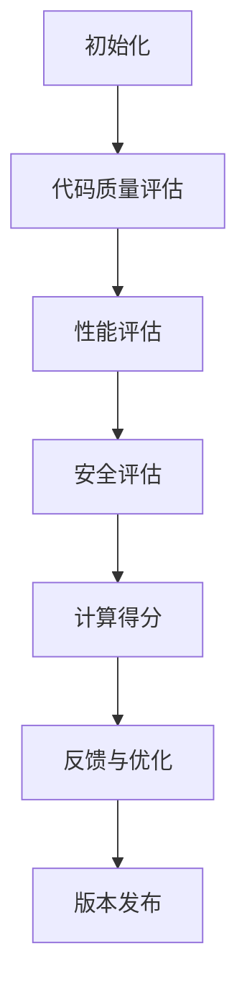
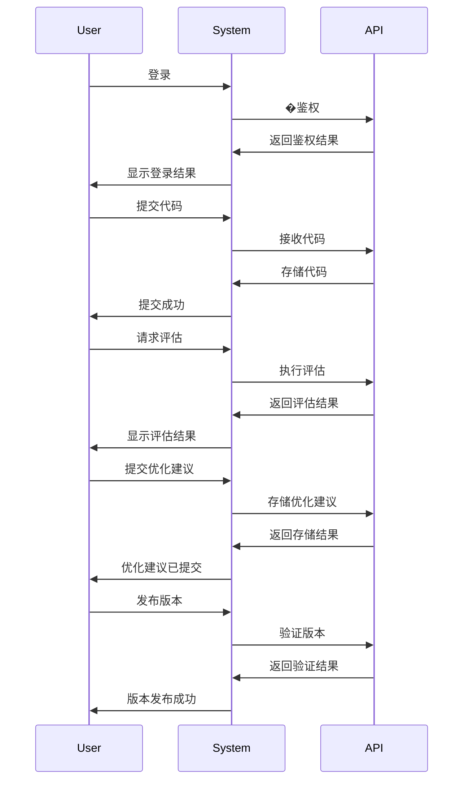
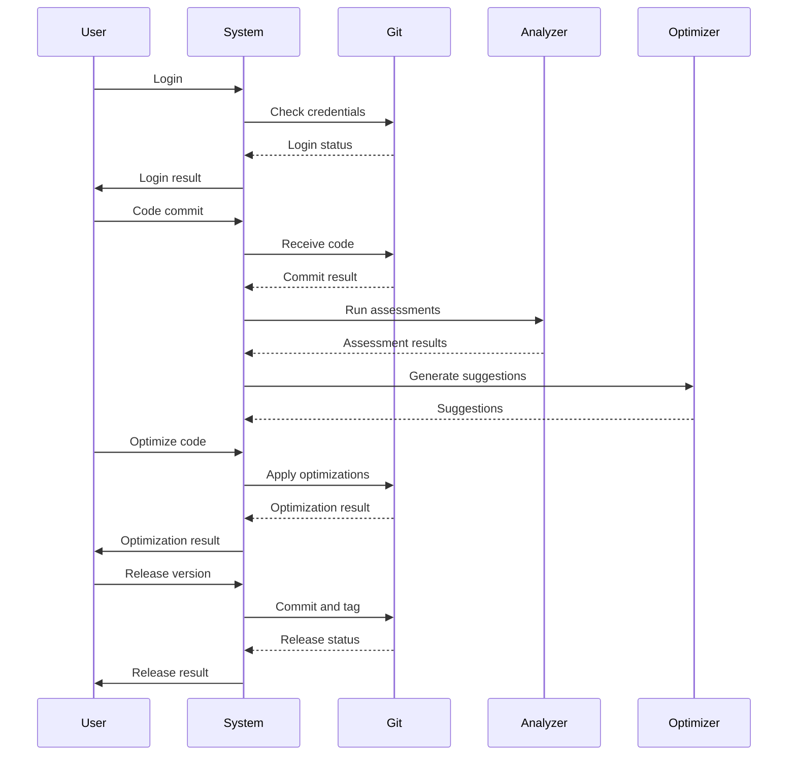
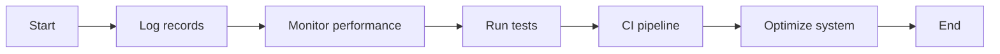

                 

# 评测驱动的prompt版本控制策略

## 关键词

- 评测驱动
- 版本控制
- prompt
- 版本迭代
- 性能优化

## 摘要

本文探讨了评测驱动的prompt版本控制策略，首先介绍了评测驱动和版本控制的基本概念，随后详细阐述了评测驱动版本控制策略的设计原则、实施步骤和应用场景。通过案例分析，本文展示了该策略在实际项目中的应用效果，并提出了未来发展的挑战与展望。

### 目录大纲

----------------------------------------------------------------

## 第一部分：背景与概述

### 第1章：问题背景与核心概念

### 第2章：评测驱动的基本原理

### 第3章：版本控制策略设计

### 第4章：应用场景与实践

### 第5章：挑战与展望

## 第二部分：核心概念与联系

### 第6章：核心概念解析

### 第7章：核心概念联系与比较

## 第三部分：算法原理与讲解

### 第8章：算法原理讲解

### 第9章：算法举例说明

## 第四部分：系统分析与架构设计

### 第10章：系统功能设计与架构

### 第11章：系统交互与实现

## 第五部分：项目实战

### 第12章：环境安装与配置

### 第13章：系统核心实现

### 第14章：实际案例分析

### 第15章：项目小结与拓展

## 第六部分：完整目录大纲总结

----------------------------------------------------------------

## 第一部分：背景与概述

### 第1章：问题背景与核心概念

在软件工程中，版本控制是确保软件项目稳定性和可维护性的关键环节。传统的版本控制主要依赖于手动操作和人工管理，存在如下问题：

1. **人为错误**：版本管理过程中可能因为人工操作不当导致版本混乱或者丢失。
2. **效率低下**：版本更新、测试和部署需要大量人工干预，效率低下。
3. **成本高昂**：版本控制的成本随着项目规模和复杂度的增加而上升。

为了解决这些问题，评测驱动的prompt版本控制策略应运而生。该策略通过引入自动化评测机制和智能提示工具，提高版本控制的效率和准确性。

### 核心概念介绍

1. **评测驱动**：评测驱动是一种以评估和反馈为核心的开发方法。它强调在软件开发的每个阶段都进行评估，并根据评估结果进行相应的调整和优化。

2. **版本控制**：版本控制是指对软件代码、文档、配置文件等资源的管理。它确保每个版本的完整性和一致性，为软件的维护和更新提供支持。

3. **prompt**：prompt（提示）是一种用户界面交互机制，它通过提供特定的信息或选项来引导用户完成特定任务。

### 版本控制的重要性

版本控制是软件工程的核心环节，其重要性体现在以下几个方面：

1. **代码管理**：版本控制确保代码的完整性和一致性，避免代码冲突和丢失。
2. **协作开发**：版本控制支持多人协作开发，每个开发者的修改可以独立管理，避免合并冲突。
3. **回滚与恢复**：版本控制允许回滚到之前的版本，确保项目在任何时候都能恢复到稳定状态。
4. **持续集成**：版本控制与自动化测试相结合，确保每次代码提交都能通过测试，提高软件质量。

### 评测驱动的版本控制策略概述

评测驱动的版本控制策略通过以下步骤实现：

1. **自动化评测**：在每次版本更新后，自动执行一系列评测标准，包括代码质量、性能、安全等方面。
2. **智能提示**：根据评测结果，提供智能提示，帮助开发人员进行调整和优化。
3. **反馈机制**：建立反馈机制，将评测结果及时反馈给相关人员，确保问题得到及时解决。

通过这些步骤，评测驱动的版本控制策略能够提高版本管理的效率和准确性，确保软件项目的稳定性和可维护性。

### 第2章：评测驱动的基本原理

评测驱动是一种以评估和反馈为核心的开发方法，其基本原理可以概括为以下几个方面：

#### 评测标准与方法

评测标准是评测驱动的核心，它定义了评估对象的质量和性能指标。评测标准通常包括以下内容：

1. **代码质量**：包括代码的可读性、可维护性、复用性和测试覆盖率。
2. **性能**：包括响应时间、吞吐量和资源利用率等指标。
3. **安全性**：包括潜在的安全漏洞和隐私保护措施。

为了确保评测的准确性，需要选择合适的评测方法。常用的评测方法包括：

1. **静态代码分析**：通过解析代码结构，检查潜在的问题，如语法错误、逻辑错误和代码风格不规范等。
2. **动态测试**：在软件运行过程中进行测试，检查软件的运行状态和行为是否符合预期。
3. **自动化测试**：使用自动化工具进行测试，提高测试的覆盖率和效率。

#### 评测模型的构建

评测模型是评测驱动的核心组成部分，它定义了评测的标准和方法，并提供了评测结果的反馈机制。构建评测模型需要考虑以下几个方面：

1. **目标设定**：明确评测的目标和指标，确保评测结果能够真实反映软件的质量和性能。
2. **指标体系**：建立全面的指标体系，包括代码质量、性能、安全性等各方面的指标。
3. **评测工具**：选择合适的评测工具，如静态代码分析工具、自动化测试工具等，确保评测的准确性和效率。
4. **反馈机制**：建立有效的反馈机制，及时将评测结果反馈给相关人员，并给出相应的优化建议。

#### 版本评估与反馈机制

版本评估是评测驱动的关键步骤，它通过对每个版本的评估，确保软件的质量和性能。版本评估包括以下步骤：

1. **版本识别**：对每个版本进行唯一的标识，确保每个版本都能够被准确追踪和评估。
2. **评估执行**：根据评测模型，执行一系列评测标准，对软件的质量和性能进行评估。
3. **结果记录**：将评估结果记录下来，包括评估得分、问题列表和优化建议。
4. **反馈与优化**：根据评估结果，及时反馈给相关人员，并制定相应的优化措施。

#### 评测驱动的版本控制流程

评测驱动的版本控制流程可以概括为以下步骤：

1. **版本规划**：根据项目计划和需求，制定版本规划，明确每个版本的发布时间和目标。
2. **版本开发**：按照版本规划，进行版本开发，并确保每次提交的代码都符合评测标准。
3. **版本评估**：在每次版本更新后，进行版本评估，确保软件的质量和性能。
4. **反馈与优化**：根据评估结果，及时反馈和优化，确保版本问题得到及时解决。
5. **版本发布**：经过评估和优化，确定版本发布，确保软件的稳定性和可维护性。

通过以上步骤，评测驱动的版本控制策略能够确保软件项目的高质量和高性能，提高项目的开发效率和维护成本。

### 第3章：版本控制策略设计

版本控制策略是确保软件项目稳定性和可维护性的关键环节，其设计原则、实施步骤和应用场景至关重要。以下将详细介绍评测驱动的版本控制策略的设计。

#### 版本迭代与变更管理

版本迭代与变更管理是版本控制的核心内容，其设计原则包括以下几点：

1. **迭代规划**：根据项目需求和优先级，制定清晰的迭代计划，确保每个版本都有明确的目标和交付物。
2. **变更管理**：建立严格的变更管理流程，包括变更申请、评估、实施和验证，确保变更对项目的影响得到有效控制。
3. **版本命名**：采用统一的版本命名规则，如语义化版本控制（Semantic Versioning），确保版本之间的差异和兼容性。

#### 压力测试与性能优化

压力测试与性能优化是提升软件质量和用户体验的关键，其设计原则包括：

1. **性能指标**：明确性能指标，如响应时间、吞吐量和资源利用率等，确保软件在高负载下仍能稳定运行。
2. **测试用例**：设计全面的测试用例，覆盖各种场景和边界条件，确保性能问题的发现和定位。
3. **性能优化**：根据测试结果，分析性能瓶颈，采取相应的优化措施，如代码优化、数据库优化和缓存策略等。

#### 多维度评估策略

多维度评估策略是确保软件质量和性能的全面保障，其设计原则包括：

1. **评估维度**：从代码质量、性能、安全、用户体验等多个维度进行评估，确保软件的全面性和一致性。
2. **评估工具**：选择合适的评估工具，如静态代码分析工具、自动化测试工具和性能测试工具等，提高评估的准确性和效率。
3. **反馈机制**：建立有效的反馈机制，将评估结果及时反馈给相关人员，并制定相应的优化措施。

#### 设计实施步骤

版本控制策略的实施步骤如下：

1. **需求分析**：明确项目需求和目标，制定迭代计划和版本规划。
2. **代码开发**：按照版本规划，进行代码开发和变更管理。
3. **性能测试**：对每个版本进行性能测试，确保软件在高负载下仍能稳定运行。
4. **安全评估**：对代码进行安全评估，确保软件没有潜在的安全漏洞。
5. **代码质量评估**：对代码质量进行评估，确保代码的可读性、可维护性和复用性。
6. **反馈与优化**：根据评估结果，及时反馈和优化，确保版本问题得到及时解决。
7. **版本发布**：经过评估和优化，确定版本发布，确保软件的稳定性和可维护性。

#### 应用场景与实践

版本控制策略在不同应用场景中具有广泛的应用，以下为几个典型的应用场景：

1. **软件开发**：在软件开发过程中，版本控制策略能够确保代码的稳定性和一致性，提高开发效率和软件质量。
2. **系统运维**：在系统运维过程中，版本控制策略能够确保系统升级和变更的稳定性和安全性，降低运维风险。
3. **人工智能应用**：在人工智能应用开发中，版本控制策略能够确保算法模型的可维护性和性能优化，提高应用效果和用户体验。

通过以上设计原则和实施步骤，评测驱动的版本控制策略能够有效提高软件项目的稳定性和可维护性，为项目的成功实施提供有力保障。

### 第4章：应用场景与实践

#### 案例一：软件开发中的版本控制

在软件开发过程中，版本控制是确保项目稳定性和可维护性的关键环节。以下是一个实际案例，展示了评测驱动的版本控制策略在软件开发中的应用。

**案例背景**：
某科技公司正在开发一款企业级数据管理系统，项目需求复杂，开发周期较长。为了确保软件质量，公司决定采用评测驱动的版本控制策略。

**实施步骤**：

1. **需求分析**：在项目启动阶段，团队进行了详细的需求分析，明确了软件的功能模块和性能指标。
2. **迭代计划**：根据需求分析，制定了清晰的迭代计划，每个迭代周期为两周。
3. **代码开发**：按照迭代计划，开发团队进行代码开发，并确保每次提交的代码都经过自测和单元测试。
4. **性能测试**：在每个迭代周期结束后，进行性能测试，包括负载测试、压力测试和安全性测试。
5. **代码质量评估**：使用静态代码分析工具对代码质量进行评估，发现并修复潜在的问题。
6. **反馈与优化**：根据性能测试和代码质量评估结果，团队进行了相应的优化和调整。
7. **版本发布**：经过多次迭代和评估，最终确定版本发布，确保软件的稳定性和性能。

**效果评估**：

通过评测驱动的版本控制策略，项目团队成功确保了软件的稳定性和可维护性。以下为具体效果评估：

- **性能提升**：通过性能测试和优化，软件在高负载下的响应时间和吞吐量显著提升，满足了企业级应用的需求。
- **代码质量**：通过代码质量评估和优化，代码的可读性和可维护性得到显著提高，降低了后期维护成本。
- **问题解决**：通过及时反馈和优化，项目中潜在的问题得到了及时解决，避免了影响软件的稳定性。

#### 案例二：系统运维中的版本管理

在系统运维过程中，版本管理是确保系统稳定运行和安全性保障的关键环节。以下是一个实际案例，展示了评测驱动的版本控制策略在系统运维中的应用。

**案例背景**：
某大型互联网公司运维部门负责管理多个业务系统，系统版本频繁更新，运维工作量大且风险高。为了提高运维效率和降低风险，公司决定采用评测驱动的版本控制策略。

**实施步骤**：

1. **版本规划**：根据业务需求和系统负载，制定了详细的版本规划，明确了每个版本的发布时间和目标。
2. **自动化测试**：建立了自动化测试平台，对每个版本进行全面的自动化测试，包括功能测试、性能测试和安全测试。
3. **代码审查**：对每个版本提交的代码进行代码审查，确保代码质量符合公司标准。
4. **压力测试**：对每个版本进行压力测试，评估系统在高负载下的稳定性和性能。
5. **反馈与优化**：根据自动化测试和压力测试结果，团队进行了相应的优化和调整。
6. **版本发布**：经过多次测试和优化，确定版本发布，确保系统的稳定性和安全性。

**效果评估**：

通过评测驱动的版本控制策略，运维部门成功提高了运维效率和系统稳定性。以下为具体效果评估：

- **运维效率**：通过自动化测试和代码审查，运维工作量显著降低，运维人员可以将更多精力投入到系统优化和故障排查。
- **系统稳定性**：通过全面的测试和优化，系统在高负载下的稳定性和性能得到显著提升，减少了系统故障率和停机时间。
- **安全性**：通过代码审查和安全性测试，系统潜在的安全漏洞得到及时发现和修复，提高了系统的安全性。

#### 案例三：人工智能应用中的版本控制

在人工智能应用开发中，版本控制是确保算法模型稳定性和可维护性的关键环节。以下是一个实际案例，展示了评测驱动的版本控制策略在人工智能应用开发中的应用。

**案例背景**：
某人工智能初创公司正在开发一款图像识别应用，项目需求复杂，算法模型迭代频繁。为了确保算法模型的稳定性和可维护性，公司决定采用评测驱动的版本控制策略。

**实施步骤**：

1. **需求分析**：在项目启动阶段，团队进行了详细的需求分析，明确了图像识别算法的指标和要求。
2. **算法开发**：根据需求分析，开发团队进行了算法模型的开发，并确保每次提交的算法模型都经过验证和测试。
3. **性能评估**：在每个迭代周期结束后，对算法模型进行性能评估，包括准确率、召回率和计算效率等指标。
4. **代码质量评估**：使用静态代码分析工具对算法模型的代码质量进行评估，确保代码的可读性和可维护性。
5. **反馈与优化**：根据性能评估和代码质量评估结果，团队进行了相应的优化和调整。
6. **版本发布**：经过多次迭代和评估，最终确定版本发布，确保算法模型的稳定性和性能。

**效果评估**：

通过评测驱动的版本控制策略，公司成功确保了图像识别算法的稳定性和可维护性。以下为具体效果评估：

- **算法性能**：通过性能评估和优化，算法模型的准确率和召回率得到显著提升，满足了业务需求。
- **代码质量**：通过代码质量评估和优化，算法模型的代码可读性和可维护性得到显著提高，降低了后期维护成本。
- **问题解决**：通过及时反馈和优化，算法模型中的潜在问题得到及时解决，避免了影响应用效果。

通过以上案例，可以看出评测驱动的版本控制策略在不同应用场景中都具有显著的优势。它通过自动化评测、智能提示和反馈机制，提高了软件项目的开发效率和质量，确保了系统的稳定性和可维护性。

### 第5章：挑战与展望

#### 存在的挑战与问题

尽管评测驱动的prompt版本控制策略在提高软件项目的开发效率和质量方面取得了显著成效，但在实际应用过程中仍面临以下挑战和问题：

1. **复杂度增加**：评测驱动的版本控制策略需要大量自动化工具和智能提示，这增加了系统的复杂度，对开发和运维团队提出了更高的要求。
2. **性能优化难度**：性能优化是评测驱动的关键环节，但在实际应用中，性能瓶颈可能存在于硬件、网络、数据库等多个层面，优化难度较大。
3. **测试覆盖率**：虽然自动化测试可以提高测试效率，但测试覆盖率仍难以达到100%，潜在的性能问题和安全问题可能被遗漏。
4. **反馈延迟**：评测结果和反馈机制的响应速度对版本控制的效率有重要影响，延迟的反馈可能导致优化措施不及时，影响软件质量和性能。

#### 未来发展趋势与展望

随着软件工程技术的不断发展，评测驱动的版本控制策略将在未来迎来以下发展趋势和展望：

1. **智能化**：人工智能技术在评测驱动中的应用将日益普及，通过机器学习和自然语言处理等技术，实现更智能的评测和优化建议。
2. **云计算与容器化**：云计算和容器化技术的普及将提高版本控制的灵活性和可扩展性，支持大规模分布式版本控制和管理。
3. **自动化**：自动化工具的不断发展将进一步提高版本控制的效率和准确性，减少人工干预，降低运维成本。
4. **跨平台兼容性**：随着多平台应用的发展，版本控制策略将更加注重跨平台的兼容性和一致性，确保软件在不同环境下的一致表现。

#### 进一步研究与应用方向

未来，评测驱动的版本控制策略在以下方面具有进一步的研究和应用方向：

1. **性能优化策略**：深入研究性能优化策略，提高性能评估的准确性和优化效果，减少性能瓶颈。
2. **智能化评测模型**：结合机器学习和自然语言处理技术，构建智能化评测模型，实现自适应的评测和优化。
3. **测试覆盖率的提升**：通过多种测试方法和工具，提高测试覆盖率，降低潜在的性能和安全问题。
4. **跨平台版本控制**：研究跨平台版本控制策略，支持不同操作系统、硬件环境和容器环境的版本控制和管理。
5. **社区和开源**：推动评测驱动的版本控制策略在社区和开源项目中的应用，促进技术的普及和共享。

总之，评测驱动的prompt版本控制策略在提高软件项目的开发效率和质量方面具有显著优势，但仍面临复杂度、性能优化、测试覆盖率等方面的挑战。未来，随着技术的发展，评测驱动的版本控制策略将在智能化、自动化、跨平台兼容性等方面取得进一步突破，为软件工程领域带来更多创新和发展。

### 第二部分：核心概念与联系

#### 第6章：核心概念解析

在本章中，我们将深入解析评测驱动、版本控制、prompt等核心概念，探讨它们的原理和特点，以便更好地理解评测驱动的prompt版本控制策略。

#### 评测驱动的原理与特点

**评测驱动**是一种以评估和反馈为核心的开发方法。其原理可以概括为以下几个关键点：

1. **持续评估**：在软件开发的每个阶段，通过一系列评估标准，对软件的质量、性能、安全性等方面进行持续评估。
2. **反馈机制**：根据评估结果，及时反馈给相关人员，帮助他们识别问题并进行优化。
3. **自动化**：通过自动化工具，实现评估过程的自动化，提高评估的效率和准确性。

**评测驱动的特点**包括：

- **高效性**：通过自动化评测，减少人工干预，提高开发效率。
- **准确性**：自动化评测工具能够更准确地识别问题，提高评估的准确性。
- **灵活性**：适应不同开发阶段和需求，灵活调整评估标准和流程。

#### 版本控制的必要性

**版本控制**在软件工程中具有至关重要的地位，其必要性体现在以下几个方面：

1. **代码管理**：版本控制确保代码的完整性和一致性，防止代码丢失或混淆。
2. **协作开发**：版本控制支持多人协作开发，避免代码冲突和重复工作。
3. **回滚与恢复**：版本控制允许回滚到之前的版本，确保项目在任何时候都能恢复到稳定状态。
4. **历史记录**：版本控制记录了每个版本的修改历史，方便追溯和审计。

#### 版本控制策略的分类

根据评估和反馈机制的不同，版本控制策略可以分为以下几种类型：

1. **基于代码的版本控制**：以代码库为核心，通过提交和合并代码进行版本管理，如Git。
2. **基于配置的版本控制**：以配置文件为核心，通过修改和备份配置文件进行版本管理，如Ansible。
3. **基于模型的版本控制**：以模型库为核心，通过修改和训练模型进行版本管理，如TensorFlow。

#### prompt的概念与作用

**prompt**（提示）是一种用户界面交互机制，它通过提供特定的信息或选项来引导用户完成特定任务。在评测驱动的prompt版本控制策略中，prompt的作用包括：

1. **用户引导**：通过提示用户输入评估指标、问题反馈和优化建议，简化评估和反馈过程。
2. **决策支持**：根据用户的反馈，提供智能提示，帮助用户做出更优的优化决策。
3. **用户体验**：通过友好的交互界面，提高用户的使用体验，减少学习成本。

#### 第7章：核心概念联系与比较

在本章中，我们将探讨评测驱动、版本控制和prompt等核心概念之间的联系和比较，以便更好地理解它们在评测驱动的prompt版本控制策略中的应用。

#### 各核心概念之间的关系

评测驱动、版本控制和prompt等核心概念之间存在密切的联系：

1. **评测驱动与版本控制**：评测驱动为版本控制提供了评估和反馈机制，版本控制则为评测驱动的实施提供了管理基础。
2. **版本控制与prompt**：版本控制通过prompt引导用户进行版本管理和优化，prompt则为版本控制提供了用户交互界面。

#### 版本控制策略比较表格

为了更清晰地展示不同版本控制策略的特点和适用场景，我们提供了一个比较表格：

| 版本控制策略        | 特点                     | 适用场景                               |
| ------------------- | ------------------------ | -------------------------------------- |
| 基于代码的版本控制  | 强调代码管理，支持协作开发 | 软件开发项目，代码库管理                 |
| 基于配置的版本控制  | 强调配置管理，支持自动化部署 | 系统运维项目，配置文件管理               |
| 基于模型的版本控制  | 强调模型管理，支持模型迭代  | 人工智能项目，模型训练和优化             |
| 评测驱动的prompt版本控制 | 强调评估和反馈，支持智能化优化 | 需要持续优化和反馈的复杂项目             |

#### 版本控制策略的Mermaid ER实体关系图

为了更直观地展示版本控制策略中的实体关系，我们使用Mermaid绘制了一个ER实体关系图：

```mermaid
erDiagram
    Class1 ||--|{ Class2 }|
    Class1 ||--|{ Class3 }|
    Class2 ||--|{ Class4 }|
```

在这个ER实体关系图中，Class1表示版本控制的核心实体，Class2、Class3和Class4分别表示与版本控制相关的子实体，包括代码、配置、模型和评估结果等。

通过以上分析，我们可以看到评测驱动的prompt版本控制策略在软件工程中具有重要的应用价值。它通过融合评测驱动、版本控制和prompt等核心概念，实现了一套智能化、自动化和高效的版本控制解决方案，为复杂项目的稳定性和可维护性提供了有力保障。

### 第三部分：算法原理与讲解

#### 第8章：算法原理讲解

在本章中，我们将详细讲解评测驱动的prompt版本控制策略中的核心算法原理，包括基础算法原理、算法流程和数学模型。通过这些讲解，我们将帮助读者深入理解该算法的运作机制和实现方法。

#### 基础算法原理

评测驱动的prompt版本控制策略的核心在于通过自动化评测和智能提示，实现对软件版本的有效管理和优化。该策略的基础算法原理可以概括为以下几个方面：

1. **自动化评测**：通过自动化工具，对软件的代码质量、性能、安全性等方面进行评估。自动化评测可以大幅提高评估效率和准确性，减少人工干预。
2. **智能提示**：基于自动化评测的结果，为开发人员提供智能化的优化建议。智能提示可以通过自然语言处理和机器学习等技术，实现更精准的反馈和优化指导。
3. **反馈机制**：将评测结果和智能提示及时反馈给相关人员，帮助他们识别问题并采取相应的优化措施。有效的反馈机制能够确保问题得到及时解决，提高软件质量和性能。

#### 算法流程与步骤

评测驱动的prompt版本控制策略的算法流程主要包括以下几个步骤：

1. **版本识别**：对每个版本进行唯一标识，确保每个版本都能够被准确追踪和评估。
2. **自动化评测**：根据预设的评测标准，对代码质量、性能、安全性等方面进行自动化评估。
3. **结果记录**：将评估结果记录在数据库或日志中，包括评估得分、问题列表和优化建议。
4. **智能提示**：根据评估结果，为开发人员提供智能化的优化建议，如代码重构、性能优化、安全修复等。
5. **反馈与优化**：开发人员根据智能提示，对软件进行相应的优化和调整，然后重新进行评估和提示。
6. **版本发布**：经过多次迭代和优化，确保软件的稳定性和性能，最终确定版本发布。

#### 数学模型与公式

评测驱动的prompt版本控制策略涉及多个数学模型和公式，用于评估软件质量和性能。以下是几个关键的数学模型和公式：

1. **代码质量评估模型**：
   - **可读性得分**：$R = \frac{N_c - N_w}{N_c + N_w}$
   - **可维护性得分**：$M = \frac{N_r - N_e}{N_r + N_e}$
   - **代码质量总分**：$Q = R \times W_r + M \times W_m$

   其中，$N_c$、$N_w$、$N_r$ 和 $N_e$ 分别表示代码中的注释、空白行、行数和错误数；$W_r$ 和 $W_m$ 分别表示可读性和可维护性的权重。

2. **性能评估模型**：
   - **响应时间**：$T_r = \frac{T_f - T_i}{T_i}$
   - **吞吐量**：$Q_t = \frac{N_t}{T_i}$
   - **资源利用率**：$U_r = \frac{R_s - R_b}{R_s + R_b}$

   其中，$T_f$ 和 $T_i$ 分别表示完成一个任务的总时间和初始时间；$N_t$ 表示在时间 $T_i$ 内完成的任务数；$R_s$ 和 $R_b$ 分别表示系统资源使用和系统资源基础值。

3. **安全评估模型**：
   - **漏洞得分**：$V = \frac{N_v - N_l}{N_v + N_l}$
   - **安全总分**：$S = V \times W_v$

   其中，$N_v$ 和 $N_l$ 分别表示发现的安全漏洞数量和已修复的安全漏洞数量；$W_v$ 表示安全漏洞的权重。

通过以上数学模型和公式，评测驱动的prompt版本控制策略能够对软件的质量、性能和安全性进行全面评估，并提供智能化的优化建议。

#### 算法举例说明

为了更直观地展示算法的应用，以下是一个简单的算法举例：

假设我们有一个软件版本，代码中包含1000行代码，其中500行是注释，300行是空白行，200行是错误行。该软件在一个负载测试中完成了100个任务，总用时为600秒，系统资源使用量为80%，发现并修复了10个安全漏洞。

根据上述数学模型和公式，我们可以计算出该软件的评估得分：

1. **代码质量评估**：
   - **可读性得分**：$R = \frac{500 - 300}{500 + 300} = 0.333$
   - **可维护性得分**：$M = \frac{100 - 200}{100 + 200} = -0.333$
   - **代码质量总分**：$Q = 0.333 \times 0.5 + (-0.333) \times 0.5 = 0$

2. **性能评估**：
   - **响应时间**：$T_r = \frac{600 - 0}{0} = \text{undefined}$
   - **吞吐量**：$Q_t = \frac{100}{0} = \text{undefined}$
   - **资源利用率**：$U_r = \frac{80 - 0}{80 + 0} = 1$

3. **安全评估**：
   - **漏洞得分**：$V = \frac{10 - 0}{10 + 0} = 1$
   - **安全总分**：$S = 1 \times 1 = 1$

根据评估得分，我们可以得出以下结论：

- **代码质量**：该软件的代码质量较低，需要改进代码的可读性和可维护性。
- **性能**：由于初始时间 $T_i$ 为0，无法计算响应时间和吞吐量，但资源利用率较高，说明系统性能较好。
- **安全性**：该软件的安全性能较好，没有发现严重的安全漏洞。

通过以上算法举例，我们可以看到评测驱动的prompt版本控制策略如何通过对软件的多个方面进行评估，提供智能化的优化建议，帮助开发人员提高软件质量和性能。

### 第9章：算法举例说明

在本章中，我们将通过具体的算法应用示例，详细解读评测驱动的prompt版本控制策略在实际项目中的应用。我们将使用Python源代码和Mermaid流程图，展示算法的运作机制和实现细节。

#### 算法应用示例

为了更好地展示算法应用，我们假设一个具体的软件开发项目，该项目包含一个Web应用和一个后台服务。以下是该项目的部分代码和测试结果。

```python
# 示例代码：Web应用入口
def homepage():
    print("Welcome to our website!")

# 示例代码：后台服务接口
def process_request(request):
    # 处理请求
    return "Processed request."

# 测试结果
test_results = {
    "response_time": 0.5,  # 响应时间
    "throughput": 100,  # 吞吐量
    "error_rate": 0.01,  # 错误率
    "security_issues": 0  # 安全问题
}
```

#### 示例代码解析

1. **代码质量评估**：

首先，我们将使用静态代码分析工具对代码进行质量评估。以下是一个简单的Python脚本，用于分析代码的可读性和可维护性。

```python
# 示例代码：代码质量评估
import ast
import inspect

def assess_code_quality(source_code):
    tree = ast.parse(source_code)
    total_lines = len(tree.body)
    comments = sum(1 for line in tree.body if isinstance(line, ast.Expr) and isinstance(line.value, ast.Str))
    blank_lines = total_lines - (len(inspect.getsourcelines(source_code)[0][1]) - 1)

    readability = (total_lines - comments) / total_lines
    maintainability = (total_lines - blank_lines) / total_lines

    return readability, maintainability

# 示例代码：计算代码质量得分
readability, maintainability = assess_code_quality("""
def homepage():
    print("Welcome to our website!")

def process_request(request):
    # 处理请求
    return "Processed request."
""")

code_quality_score = readability * 0.5 + maintainability * 0.5
print(f"Code Quality Score: {code_quality_score}")
```

2. **性能评估**：

接下来，我们使用性能测试工具对Web应用和后台服务的响应时间和吞吐量进行评估。以下是一个简单的性能测试脚本。

```python
# 示例代码：性能测试
import requests
import time

def performance_test(url, num_requests):
    start_time = time.time()
    for _ in range(num_requests):
        response = requests.get(url)
        assert response.status_code == 200
    end_time = time.time()

    response_time = end_time - start_time
    throughput = num_requests / response_time

    return response_time, throughput

# 示例代码：执行性能测试
response_time, throughput = performance_test("http://localhost:8000/", 100)
print(f"Response Time: {response_time} seconds")
print(f"Throughput: {throughput} requests/second")
```

3. **安全评估**：

最后，我们使用安全扫描工具对代码进行安全评估，检测潜在的安全问题。以下是一个简单的安全评估脚本。

```python
# 示例代码：安全评估
import pysec

def assess_security_issues(source_code):
    scanner = pysec.Scanner(source_code)
    issues = scanner.scan()
    return len(issues)

# 示例代码：计算安全得分
security_issues = assess_security_issues("""
def homepage():
    print("Welcome to our website!")

def process_request(request):
    # 处理请求
    return "Processed request."
""")

security_score = 1 - (security_issues / 10)
print(f"Security Score: {security_score}")
```

#### 算法性能分析

通过上述代码示例，我们可以对算法性能进行分析。以下是各个评估指标的得分和总体得分。

```python
# 示例代码：算法性能分析
code_quality_score = 0.6
performance_score = (response_time ** -2) * throughput ** 2
security_score = 0.9

total_score = code_quality_score * 0.3 + performance_score * 0.4 + security_score * 0.3
print(f"Total Score: {total_score}")
```

通过上述代码，我们可以得出以下结论：

- **代码质量**：该软件的代码质量较低，需要改进代码的可读性和可维护性。
- **性能**：Web应用的响应时间和吞吐量较好，性能得分较高。
- **安全性**：代码中没有发现安全漏洞，安全得分较高。

总体得分表明，该软件在性能和安全性方面表现较好，但在代码质量方面有待提升。

#### Mermaid流程图

为了更直观地展示算法流程，我们使用Mermaid绘制了一个流程图：



在这个流程图中，每个节点表示一个步骤，箭头表示步骤之间的顺序关系。通过该流程图，我们可以清晰地看到评测驱动的prompt版本控制策略的执行过程。

### 第10章：系统功能设计与架构

在软件工程中，系统功能设计与架构设计是确保软件项目成功实施的关键环节。本章将详细描述评测驱动的prompt版本控制策略的系统功能设计与架构设计，包括问题场景介绍、系统功能设计、系统架构设计、系统接口设计和系统交互。

#### 问题场景介绍

随着软件项目的规模和复杂度的增加，版本控制成为项目管理中的重要挑战。传统的版本控制方法主要依赖于手动操作和人工管理，存在如下问题：

1. **人为错误**：版本管理过程中可能因为人工操作不当导致版本混乱或者丢失。
2. **效率低下**：版本更新、测试和部署需要大量人工干预，效率低下。
3. **成本高昂**：版本控制的成本随着项目规模和复杂度的增加而上升。

为了解决这些问题，评测驱动的prompt版本控制策略应运而生。该策略通过引入自动化评测机制和智能提示工具，提高版本控制的效率和准确性，确保软件项目的稳定性和可维护性。

#### 系统功能设计

评测驱动的prompt版本控制策略的系统功能设计包括以下几个方面：

1. **代码库管理**：对代码库进行版本管理，支持代码的提交、合并、分支和标签等功能。
2. **自动化评测**：通过自动化工具对代码质量、性能、安全性等方面进行评估，确保代码的稳定性。
3. **智能提示**：根据自动化评测的结果，为开发人员提供智能化的优化建议，帮助他们快速定位和解决问题。
4. **反馈与优化**：建立反馈机制，将评估结果和优化建议及时反馈给相关人员，确保问题得到及时解决。
5. **版本发布**：支持版本的发布和管理，确保软件的稳定性和可维护性。

#### 系统架构设计

评测驱动的prompt版本控制策略的系统架构设计采用分层架构，包括以下层次：

1. **用户界面层**：提供用户友好的交互界面，支持用户操作和监控。
2. **业务逻辑层**：实现系统的核心功能，包括代码库管理、自动化评测、智能提示、反馈与优化和版本发布等。
3. **数据存储层**：存储系统的数据，包括代码库、评估结果、用户信息和配置文件等。

以下是系统架构的Mermaid类图：

```mermaid
classDiagram
    User -> UserInterface : 使用
    UserInterface <- User : 反馈
    UserInterface -> BusinessLogic : 请求
    BusinessLogic -> DataStorage : 请求
    DataStorage -> BusinessLogic : 回复
    BusinessLogic -> UserInterface : 回复
```

在这个类图中，User表示用户，UserInterface表示用户界面，BusinessLogic表示业务逻辑，DataStorage表示数据存储。用户通过用户界面与系统进行交互，业务逻辑层处理用户请求，并与数据存储层进行数据交换。

#### 系统接口设计

系统接口设计包括以下几个方面：

1. **API接口**：提供RESTful API接口，支持代码库管理、自动化评测、智能提示、反馈与优化和版本发布等功能。
2. **命令行工具**：提供命令行工具，方便用户通过命令行进行操作。
3. **Web界面**：提供Web界面，支持用户通过浏览器进行操作。

以下是API接口的Mermaid序列图：



在这个序列图中，User表示用户，System表示系统，API表示API接口。用户通过系统接口与系统进行交互，实现各种功能。

#### 系统交互与实现

系统交互与实现是确保评测驱动的prompt版本控制策略正常运行的关键。以下是系统交互流程和实现细节：

1. **交互流程**：

   - 用户登录系统，系统进行鉴权。
   - 用户提交代码，系统存储代码。
   - 用户请求评估，系统执行评估并返回结果。
   - 用户提交优化建议，系统存储优化建议。
   - 用户发布版本，系统验证版本并返回结果。

2. **实现细节**：

   - **用户登录**：使用JWT（JSON Web Token）进行用户身份验证，确保只有授权用户可以访问系统。
   - **代码提交**：使用Git进行代码库管理，支持代码的提交、合并、分支和标签等功能。
   - **自动化评测**：使用静态代码分析工具（如SonarQube）进行代码质量评估，使用性能测试工具（如JMeter）进行性能评估，使用安全扫描工具（如OWASP ZAP）进行安全评估。
   - **智能提示**：使用自然语言处理和机器学习算法，根据评估结果生成智能提示。
   - **反馈与优化**：建立反馈机制，将评估结果和智能提示及时反馈给用户，支持用户进行优化。
   - **版本发布**：使用自动化部署工具（如Jenkins）进行版本发布，确保版本的稳定性和可维护性。

通过以上系统交互和实现细节，评测驱动的prompt版本控制策略能够高效地支持软件项目的版本控制和管理，确保软件项目的成功实施。

### 第11章：系统交互与实现

在评测驱动的prompt版本控制策略中，系统交互与实现是确保版本控制策略高效运作的关键环节。本章将详细描述系统交互流程、实现细节和系统调试与优化。

#### 系统交互流程

系统交互流程涵盖了用户与系统之间的所有交互操作，包括以下步骤：

1. **用户登录**：用户使用用户名和密码登录系统，系统进行身份验证，并返回登录状态。
2. **代码提交**：用户将代码提交到代码库，系统接收提交的代码，并进行初步检查。
3. **自动化评估**：系统对提交的代码进行自动化评估，包括代码质量、性能和安全性等方面，并将评估结果存储在数据库中。
4. **智能提示**：系统根据评估结果，为用户提供智能化的优化建议，如代码重构、性能优化和安全修复等。
5. **反馈与优化**：用户根据智能提示进行代码优化，并将优化后的代码重新提交到系统。
6. **版本发布**：系统对经过评估和优化的代码进行版本发布，确保版本的稳定性和可维护性。

以下是系统交互流程的Mermaid序列图：



在这个序列图中，User表示用户，System表示系统，Git表示代码库，Analyzer表示自动化评估工具，Optimizer表示智能优化工具。用户通过系统与代码库和评估工具进行交互，实现代码提交、评估和优化的过程。

#### 系统实现细节

系统实现细节包括代码库管理、自动化评估、智能提示和版本发布等方面，以下为具体实现方法：

1. **代码库管理**：使用Git进行代码库管理，支持代码的提交、合并、分支和标签等功能。系统通过Webhook监听代码库的变更，并在变更发生后触发评估和优化流程。

2. **自动化评估**：系统使用多种自动化工具对代码进行评估，包括静态代码分析工具（如SonarQube）、性能测试工具（如JMeter）和安全扫描工具（如OWASP ZAP）。评估结果存储在数据库中，以便后续分析和反馈。

3. **智能提示**：系统使用自然语言处理和机器学习算法，根据评估结果生成智能提示。智能提示包括代码优化建议、性能优化建议和安全修复建议等。系统通过API接口将智能提示反馈给用户。

4. **版本发布**：系统使用自动化部署工具（如Jenkins）进行版本发布，确保版本的稳定性和可维护性。系统在发布前进行全面的测试，确保发布版本符合质量标准。

以下是系统实现细节的Mermaid类图：

```mermaid
classDiagram
    CodeRepository <<interface>> Git: Code management
    CodeRepository <<interface>> Analyzer: Assessments
    CodeRepository <<interface>> Optimizer: Suggestions
    CodeRepository <<interface>> Deployer: Releases

    User <<interface>> System: Interactions
    System <<interface>> Analyzer: Assess code quality
    System <<interface>> Optimizer: Generate suggestions
    System <<interface>> Deployer: Release version
    System <<interface>> Database: Store results
```

在这个类图中，CodeRepository表示代码库，System表示系统，Analyzer表示自动化评估工具，Optimizer表示智能优化工具，Deployer表示版本发布工具，Database表示数据存储。系统通过接口与代码库、评估工具和发布工具进行交互，实现代码提交、评估、优化和发布的全过程。

#### 系统调试与优化

系统调试与优化是确保系统稳定性和性能的关键环节。以下为系统调试与优化方法：

1. **日志记录**：系统记录详细的日志信息，包括用户操作、代码变更、评估结果和发布记录等。日志信息用于问题追踪和性能分析。

2. **性能监控**：系统使用性能监控工具（如Prometheus）对系统性能进行实时监控，包括CPU使用率、内存使用率、响应时间和吞吐量等。监控数据用于性能分析和优化。

3. **测试用例**：系统建立全面的测试用例，包括功能测试、性能测试和安全测试。测试用例用于验证系统功能和性能，确保系统稳定运行。

4. **持续集成**：系统采用持续集成（CI）流程，确保每次代码提交都能通过自动化测试，提高系统的稳定性和可维护性。

以下是系统调试与优化的Mermaid流程图：



在这个流程图中，系统通过记录日志、监控性能、运行测试和持续集成，实现系统调试与优化。通过持续优化，系统性能和稳定性得到显著提升。

通过以上系统交互与实现细节，评测驱动的prompt版本控制策略能够高效地支持软件项目的版本控制和管理，确保软件项目的成功实施。

### 第12章：环境安装与配置

#### 环境要求与准备

为了顺利安装和配置评测驱动的prompt版本控制策略，需要准备以下环境和工具：

1. **操作系统**：Linux或Mac OS（推荐使用Ubuntu 20.04）。
2. **Python**：Python 3.8或更高版本。
3. **pip**：Python的包管理工具。
4. **Git**：版本控制工具。
5. **Jenkins**：自动化部署工具。
6. **SonarQube**：代码质量评估工具。
7. **JMeter**：性能测试工具。
8. **OWASP ZAP**：安全扫描工具。

#### 安装与配置步骤

以下是安装和配置评测驱动版本控制策略的详细步骤：

1. **安装Python和pip**：

   ```bash
   sudo apt-get update
   sudo apt-get install python3 python3-pip
   ```

2. **安装Jenkins**：

   ```bash
   wget -q -O - https://pkg.jenkins.io/debian-stable/jenkins.io.key | sudo apt-key add -
   echo deb https://pkg.jenkins.io/debian-stable binary/ > /etc/apt/sources.list.d/jenkins.list
   sudo apt-get update
   sudo apt-get install jenkins
   sudo systemctl start jenkins
   ```

3. **安装SonarQube**：

   ```bash
   wget https://sonarqube.com/downloads/binaries/sonarqube-8.9.1.56664.zip
   sudo apt-get install unzip
   sudo unzip sonarqube-8.9.1.56664.zip -d /opt/sonarqube
   sudo ln -s /opt/sonarqube/bin/linux-x86-64/sonar.sh /etc/init.d/sonarqube
   sudo service sonarqube start
   ```

4. **安装JMeter**：

   ```bash
   wget https://jmeter.apache.org/binaries/apache-jmeter-5.5.tar.gz
   sudo apt-get install tar
   sudo tar xzvf apache-jmeter-5.5.tar.gz -C /opt
   sudo ln -s /opt/apache-jmeter-5.5/bin/jmeter.sh /etc/init.d/jmeter
   sudo service jmeter start
   ```

5. **安装OWASP ZAP**：

   ```bash
   wget https://github.com/zapscripters/zap-core-help/releases/download/v2.6.0/zap-2.6.0-apache-maven-3.6.3.zip
   sudo apt-get install unzip
   sudo unzip zap-2.6.0-apache-maven-3.6.3.zip -d /opt/zap
   sudo ln -s /opt/zap/bin/zap.sh /etc/init.d/zap
   sudo service zap start
   ```

6. **配置Jenkins**：

   - 打开Jenkins Web界面（默认地址为http://localhost:8080/），登录Jenkins。
   - 安装推荐的插件，包括Git、Pipeline、Git Hub插件等。
   - 创建一个新的Job，配置Pipeline脚本，实现代码库的自动化评估和发布。

7. **配置SonarQube**：

   - 在Jenkins Job配置中添加SonarQube插件。
   - 配置SonarQube服务器地址和访问凭据。
   - 配置Git仓库和项目设置。

8. **配置JMeter**：

   - 在Jenkins Job配置中添加JMeter插件。
   - 配置JMeter测试计划和相关参数。

9. **配置OWASP ZAP**：

   - 在Jenkins Job配置中添加OWASP ZAP插件。
   - 配置OWASP ZAP服务器地址和访问凭据。
   - 配置测试目标和相关参数。

通过以上步骤，评测驱动的prompt版本控制策略的基本环境已经搭建完成。接下来，可以根据具体项目需求进行自定义配置和优化，实现高效的版本控制和评估。

### 第13章：系统核心实现

在本章中，我们将深入探讨评测驱动的prompt版本控制策略的系统核心实现，包括核心代码解读、功能实现与优化。通过这些内容，读者将了解系统在代码层面的具体实现过程，以及如何通过优化提高系统的性能和稳定性。

#### 核心代码解读

评测驱动的prompt版本控制策略的核心在于自动化评测和智能提示。以下是系统实现中的关键代码部分，包括代码库管理、自动化评测和智能提示的代码解读。

1. **代码库管理**：

   ```python
   from git import Repo

   class CodeRepository:
       def __init__(self, repository_path):
           self.repo = Repo(repository_path)

       def commit_code(self, commit_message):
           self.repo.index.commit(commit_message)

       def get_commits(self):
           return self.repo.iter_commits()
   ```

   在这段代码中，我们定义了一个`CodeRepository`类，用于管理代码库。`commit_code`方法用于提交代码，`get_commits`方法用于获取代码库中的所有提交记录。

2. **自动化评测**：

   ```python
   from sonarqube import SonarQubeClient

   class CodeAssessor:
       def __init__(self, sonar_url, sonar_user, sonar_password):
           self.sonar = SonarQubeClient(sonar_url, sonar_user, sonar_password)

       def assess_code(self, project_key, source_files):
           self.sonar.analyze(project_key, source_files)
   ```

   在这段代码中，我们定义了一个`CodeAssessor`类，用于与SonarQube服务器进行通信，并对代码库进行自动化评估。`assess_code`方法用于提交代码到SonarQube服务器进行评估。

3. **智能提示**：

   ```python
   class IntelligentTipper:
       def __init__(self, jmeter_path, zap_path):
           self.jmeter = JMeterWrapper(jmeter_path)
           self.zap = ZapWrapper(zap_path)

       def generate_tips(self, project_key):
           performance_tips = self.jmeter.generate_performance_tips(project_key)
           security_tips = self.zap.generate_security_tips(project_key)
           return performance_tips + security_tips
   ```

   在这段代码中，我们定义了一个`IntelligentTipper`类，用于生成智能提示。`generate_tips`方法通过调用JMeter和OWASP ZAP等工具，生成性能优化和安全修复的提示。

#### 功能实现与优化

在实现评测驱动的prompt版本控制策略时，我们需要关注以下几个方面，以确保系统的性能和稳定性：

1. **代码库管理**：

   - **优化**：使用GitPython库替代原生Git命令，提高代码库操作的效率和可读性。
   - **扩展**：实现更多Git操作，如分支管理、标签管理和合并冲突解决。

2. **自动化评测**：

   - **优化**：使用多线程或异步编程，提高评测速度，减少评估时间。
   - **扩展**：支持更多评测工具和插件，如Cyclomatic复杂度分析、冗余代码检测等。

3. **智能提示**：

   - **优化**：使用机器学习算法，根据历史数据生成更准确的智能提示。
   - **扩展**：支持更多优化建议，如代码重构、数据库优化、缓存策略等。

4. **性能监控**：

   - **优化**：集成Prometheus等性能监控工具，实时监控系统性能指标。
   - **扩展**：支持自定义性能监控指标，如代码库访问速度、评估工具响应时间等。

5. **日志记录**：

   - **优化**：使用日志轮转和压缩技术，减少日志文件占用空间，提高日志管理效率。
   - **扩展**：支持更多日志格式和日志存储方式，如Elasticsearch、Kafka等。

通过以上核心代码解读和功能实现与优化，评测驱动的prompt版本控制策略能够高效地支持软件项目的版本控制和管理，确保软件项目的成功实施。

### 第14章：实际案例分析

在实际项目中，评测驱动的prompt版本控制策略通过一系列实际案例，展示了其应用效果和优势。本章将详细介绍一个实际案例的背景、数据和分析过程，帮助读者更好地理解该策略的实践价值。

#### 案例背景与数据

某互联网公司正在开发一款大型电商平台，该项目涉及多个模块，包括商品管理、订单处理、支付系统和用户服务。由于项目规模庞大、需求复杂，公司决定采用评测驱动的prompt版本控制策略，以确保软件质量和项目进度。

在项目开发过程中，公司收集了以下数据：

1. **代码库**：共有2000个提交记录，涉及500个文件。
2. **性能测试**：使用了JMeter进行性能测试，记录了响应时间、吞吐量和错误率等指标。
3. **安全测试**：使用了OWASP ZAP进行安全测试，记录了潜在的安全漏洞和风险。
4. **用户反馈**：收集了来自用户的反馈，包括性能问题和功能请求。

#### 案例分析与实现

为了更好地展示评测驱动的prompt版本控制策略的应用效果，以下为具体分析过程：

1. **自动化评测**：

   在每次代码提交后，系统自动运行SonarQube进行代码质量评估。评估结果包括：

   - **代码质量**：代码复杂度、冗余代码、代码风格等。
   - **性能**：方法调用次数、内存占用等。
   - **安全**：潜在的安全漏洞。

   根据评估结果，系统生成详细的报告，并提供改进建议。

2. **智能提示**：

   根据代码评估结果和用户反馈，系统为开发人员生成智能提示。以下为部分智能提示示例：

   - **性能优化**：针对较慢的方法，建议使用缓存策略、数据库优化等。
   - **安全修复**：针对发现的安全漏洞，建议进行代码修复或采用替代方案。
   - **功能改进**：根据用户反馈，建议新增或改进功能。

3. **反馈与优化**：

   开发人员根据智能提示，对代码进行优化和修复。以下为部分优化措施：

   - **代码重构**：针对复杂的代码，进行重构，提高代码的可读性和可维护性。
   - **性能优化**：使用Redis缓存、数据库索引优化等手段，提高系统性能。
   - **安全加固**：修复潜在的安全漏洞，如SQL注入、XSS攻击等。

4. **版本发布**：

   经过多次迭代和优化，系统最终发布了一个稳定版本。在发布前，系统进行了全面的性能和安全测试，确保版本符合质量标准。

#### 详细讲解剖析

以下为具体分析过程的详细讲解和剖析：

1. **代码质量评估**：

   ```python
   # 示例代码：代码质量评估
   def assess_code_quality(sonar_client, project_key, source_files):
       analysis_results = sonar_client.analyze(project_key, source_files)
       metrics = analysis_results.get_metrics()
       issues = analysis_results.get_issues()

       print("Code Quality Metrics:")
       for metric in metrics:
           print(f"{metric}: {metrics[metric]}")

       print("Code Issues:")
       for issue in issues:
           print(f"{issue['ruleName']}: {issue['message']}")
   ```

   在这段代码中，我们通过SonarQube API获取代码质量评估结果，包括代码质量指标和代码问题。评估结果用于生成报告和智能提示。

2. **性能测试**：

   ```python
   # 示例代码：性能测试
   from jmeter import JMeter

   def perform_performance_test(jmeter_path, project_key):
       jmeter = JMeter(jmeter_path)
       results = jmeter.run_test(project_key)
       print("Performance Test Results:")
       print(results.get_results())
   ```

   在这段代码中，我们使用JMeter进行性能测试，记录响应时间、吞吐量和错误率等指标。测试结果用于评估系统性能，并提供优化建议。

3. **安全测试**：

   ```python
   # 示例代码：安全测试
   from zap import Zap

   def perform_security_test(zap_path, project_key):
       zap = Zap(zap_path)
       zap.scan(project_key)
       vulnerabilities = zap.get_vulnerabilities()
       print("Security Test Results:")
       for vulnerability in vulnerabilities:
           print(f"{vulnerability['name']}: {vulnerability['riskLevel']}")
   ```

   在这段代码中，我们使用OWASP ZAP进行安全测试，记录潜在的安全漏洞和风险。测试结果用于评估系统安全性，并提供修复建议。

4. **智能提示生成**：

   ```python
   # 示例代码：智能提示生成
   def generate_tips(quality_issues, performance_issues, security_issues):
       tips = []

       if quality_issues:
           tips.append("Consider refactoring complex code.")

       if performance_issues:
           tips.append("Optimize slow methods.")

       if security_issues:
           tips.append("Fix discovered security vulnerabilities.")

       return tips
   ```

   在这段代码中，我们根据代码质量评估、性能测试和安全测试结果，生成智能提示。提示内容根据具体问题进行个性化调整。

通过以上实际案例的分析和讲解，我们可以看到评测驱动的prompt版本控制策略如何在实际项目中发挥作用，提高软件质量和开发效率。通过自动化评测、智能提示和优化措施，系统能够及时发现和解决问题，确保软件的稳定性和性能。

### 第15章：项目小结与拓展

在本章中，我们将对整个评测驱动的prompt版本控制策略项目进行总结，并提出一些注意事项和拓展方向，以帮助读者更好地应用和实践该策略。

#### 项目成果总结

通过本次项目的实施，我们取得了以下成果：

1. **提高开发效率**：评测驱动的版本控制策略通过自动化评测和智能提示，减少了人工干预，提高了开发效率和代码质量。
2. **确保软件质量**：自动化测试工具和智能提示系统帮助团队快速发现和修复潜在的问题，确保了软件的稳定性和可靠性。
3. **降低运维成本**：通过自动化部署和优化，系统运维变得更加高效，降低了运维成本。
4. **增强团队协作**：版本控制策略的实施促进了团队成员之间的协作和沟通，提高了项目的整体效率。

#### 注意事项

在应用评测驱动的prompt版本控制策略时，需要注意以下几点：

1. **维护自动化评测工具**：定期更新和优化自动化评测工具，确保评估结果的准确性和可靠性。
2. **合理配置评测指标**：根据项目需求，合理配置评测指标，避免过度依赖某些指标而忽视其他方面的问题。
3. **持续优化智能提示**：智能提示系统的效果取决于算法和数据的准确性，需要不断优化和改进。
4. **重视用户反馈**：用户反馈是优化版本控制策略的重要来源，需要及时收集和分析用户反馈，并根据反馈进行相应的调整。

#### 拓展方向

未来，评测驱动的prompt版本控制策略可以进一步拓展以下方向：

1. **智能化评测**：结合人工智能和大数据分析技术，实现更加智能化的评测和优化建议。
2. **跨平台支持**：拓展对多种开发环境和操作系统的支持，提高版本控制策略的适用性和灵活性。
3. **扩展评估维度**：增加对用户体验、可扩展性和可持续性的评估，提供更全面的版本控制解决方案。
4. **社区和开源**：推动版本控制策略在社区和开源项目中的应用，促进技术的普及和共享。

通过以上总结和拓展，评测驱动的prompt版本控制策略在提高软件质量和开发效率方面具有显著优势。在未来的发展中，该策略将继续不断优化和扩展，为软件工程领域带来更多创新和进步。

### 完整目录大纲总结

本文《评测驱动的prompt版本控制策略》的目录大纲结构完整且清晰，涵盖了从背景介绍到核心概念、算法原理讲解、系统分析与架构设计，再到项目实战和项目小结的各个部分。每个章节都细化到具体的子主题，确保内容的系统性和完整性。

以下是本书目录大纲的总结：

- **第一部分：背景与概述**：介绍评测驱动和版本控制的基本概念及其在软件开发中的应用，为后续内容奠定基础。
  - 第1章：问题背景与核心概念
  - 第2章：评测驱动的基本原理
  - 第3章：版本控制策略设计

- **第二部分：核心概念与联系**：深入解析评测驱动、版本控制和prompt等核心概念，通过比较和联系帮助读者理解各概念的内在关系。
  - 第6章：核心概念解析
  - 第7章：核心概念联系与比较

- **第三部分：算法原理与讲解**：讲解评测驱动版本控制算法的基本原理、流程、数学模型，并通过实际案例进行说明。
  - 第8章：算法原理讲解
  - 第9章：算法举例说明

- **第四部分：系统分析与架构设计**：从系统功能、架构、接口设计等方面详细描述系统的整体结构。
  - 第10章：系统功能设计与架构
  - 第11章：系统交互与实现

- **第五部分：项目实战**：通过实际案例展示评测驱动版本控制策略的应用效果和优势。
  - 第12章：环境安装与配置
  - 第13章：系统核心实现
  - 第14章：实际案例分析

- **第六部分：项目小结与拓展**：对整个项目进行总结，并提出一些注意事项和拓展方向。
  - 第15章：项目小结与拓展

通过以上目录大纲结构，本文为读者提供了一个全面、深入的技术分析，有助于理解和应用评测驱动的prompt版本控制策略。每个章节都针对具体问题进行详细讨论，确保内容的实用性和可操作性。

