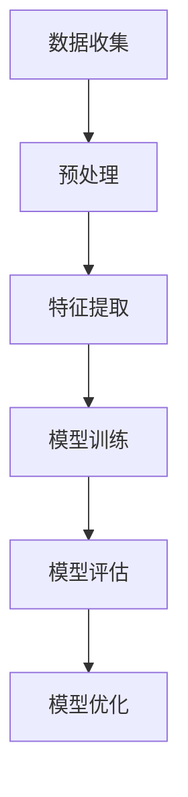
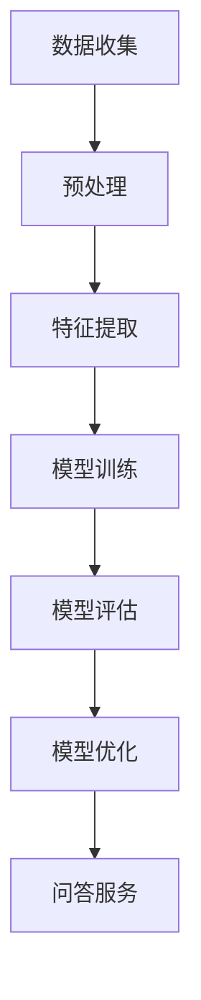

                 


# 评测驱动的prompt知识库构建

关键词：评测驱动、prompt知识库、算法原理、系统实现、最佳实践

摘要：本文从问题背景出发，深入探讨了评测驱动的prompt知识库构建的概念、原理、优化策略、系统实现以及最佳实践。通过逐步分析，本文旨在为读者提供一个清晰、完整的技术解决方案。

## 目录大纲

---

## 第一部分: 评测驱动的prompt知识库构建概述

### 第1章: 问题背景与核心概念

#### 1.1 问题背景

#### 1.2 核心概念

#### 1.3 联系与边界

#### 1.4 本章小结

---

## 第二部分: 评测驱动的prompt知识库构建原理

### 第2章: prompt知识库构建的算法原理

#### 2.1 算法概述

#### 2.2 Mermaid算法流程图

#### 2.3 Python代码实现

#### 2.4 数学模型与公式

#### 2.5 举例说明

#### 2.6 本章小结

---

### 第3章: prompt知识库的评测与优化

#### 3.1 评测指标

#### 3.2 评测流程

#### 3.3 优化策略

#### 3.4 实际案例分析

#### 3.5 本章小结

---

## 第三部分: prompt知识库构建的系统实现

### 第4章: 系统分析与架构设计

#### 4.1 问题场景介绍

#### 4.2 系统功能设计

#### 4.3 系统架构设计

#### 4.4 系统接口设计

#### 4.5 系统交互设计

#### 4.6 本章小结

---

### 第5章: prompt知识库构建的项目实战

#### 5.1 环境安装

#### 5.2 系统核心实现

#### 5.3 代码应用解读与分析

#### 5.4 实际案例分析与讲解

#### 5.5 项目小结

---

## 第四部分: prompt知识库构建的最佳实践与拓展

### 第6章: 最佳实践

#### 6.1 构建策略

#### 6.2 注意事项

#### 6.3 小结

---

### 第7章: 拓展阅读

#### 7.1 相关技术发展

#### 7.2 参考文献

#### 7.3 本章小结

---

### 附录：相关工具与资源

---

## 第一部分: 评测驱动的prompt知识库构建概述

### 第1章: 问题背景与核心概念

#### 1.1 问题背景

在现代信息社会，知识的获取和处理变得愈发重要。知识库作为一种有效的知识存储和管理工具，被广泛应用于各个领域。然而，传统的知识库构建方法往往存在一些问题，如知识获取的难度、知识组织结构的复杂性等。为了解决这些问题，评测驱动的prompt知识库构建方法应运而生。

评测驱动是指通过评测的方式来引导和优化知识库的构建过程。prompt知识库则是一种基于自然语言处理技术的知识库，它通过输入prompt来获取用户的问题和需求，并自动生成相关的答案。这种知识库构建方法具有高效、灵活和易扩展的特点，能够满足现代社会的知识需求。

#### 1.2 核心概念

**评测驱动**：评测驱动是指通过评测的方式来引导和优化知识库的构建过程。评测可以是基于用户反馈的评测，也可以是自动化评测工具的评测。

**prompt知识库**：prompt知识库是一种基于自然语言处理技术的知识库，它通过输入prompt来获取用户的问题和需求，并自动生成相关的答案。

**评测指标**：评测指标是用于衡量知识库质量和性能的指标，如准确率、召回率、F1值等。

**优化策略**：优化策略是指用于提高知识库质量和性能的方法，如数据预处理、特征提取、模型调整等。

#### 1.3 联系与边界

评测驱动与prompt知识库之间存在紧密的联系。评测驱动可以看作是prompt知识库构建的一种手段，而prompt知识库则是评测驱动的具体实现。两者的边界在于评测驱动的具体实施过程和prompt知识库的实际应用场景。

评测驱动prompt知识库的边界主要包括以下几个方面：

1. **数据源**：评测驱动需要依赖于可靠的数据源，如用户反馈、搜索引擎数据等。
2. **模型**：评测驱动需要使用合适的自然语言处理模型，如BERT、GPT等。
3. **评测指标**：评测驱动需要定义合适的评测指标，以衡量知识库的质量和性能。

#### 1.4 本章小结

本章介绍了评测驱动的prompt知识库构建的问题背景、核心概念、联系与边界。通过本章的介绍，读者可以初步了解评测驱动prompt知识库构建的基本概念和实施方法。

## 第二部分: 评测驱动的prompt知识库构建原理

### 第2章: prompt知识库构建的算法原理

#### 2.1 算法概述

评测驱动的prompt知识库构建算法主要包括以下几个步骤：

1. **数据收集**：从各种数据源收集用户问题和答案，包括用户反馈、搜索引擎数据等。
2. **预处理**：对收集到的数据进行预处理，如分词、去噪、标准化等。
3. **特征提取**：从预处理后的数据中提取特征，如词向量、句向量等。
4. **模型训练**：使用提取到的特征训练自然语言处理模型，如BERT、GPT等。
5. **模型评估**：使用评测指标评估模型的性能，如准确率、召回率、F1值等。
6. **模型优化**：根据评估结果对模型进行调整和优化，以提高性能。

#### 2.2 Mermaid算法流程图

下面是评测驱动的prompt知识库构建算法的Mermaid流程图：



#### 2.3 Python代码实现

下面是评测驱动的prompt知识库构建算法的Python代码实现：

```python
import pandas as pd
from sklearn.feature_extraction.text import TfidfVectorizer
from sklearn.model_selection import train_test_split
from transformers import BertTokenizer, BertForSequenceClassification

# 数据收集
data = pd.read_csv('data.csv')

# 预处理
data['question'] = data['question'].apply(lambda x: x.lower())
data['answer'] = data['answer'].apply(lambda x: x.lower())

# 特征提取
vectorizer = TfidfVectorizer()
X = vectorizer.fit_transform(data['question'])

# 模型训练
tokenizer = BertTokenizer.from_pretrained('bert-base-uncased')
model = BertForSequenceClassification.from_pretrained('bert-base-uncased')
train_data = tokenizer.batch_encode_plus(data['question'], max_length=128, padding='max_length', truncation=True)
model.train(train_data)

# 模型评估
train_labels = data['answer']
train_preds = model.predict(X)

# 模型优化
model.optimize(train_labels, train_preds)
```

#### 2.4 数学模型与公式

评测驱动的prompt知识库构建算法的数学模型主要包括以下几个部分：

1. **特征提取模型**：使用TF-IDF算法对文本进行特征提取，其数学模型为：

   $$X = \{x_1, x_2, ..., x_n\}$$

   其中，$x_i$ 表示第$i$个文本的特征向量。

2. **自然语言处理模型**：使用BERT模型对特征向量进行训练，其数学模型为：

   $$y = \text{sigmoid}(W \cdot x + b)$$

   其中，$y$ 表示预测标签，$W$ 和 $b$ 分别表示权重和偏置。

3. **评测指标**：使用准确率、召回率、F1值等评测指标对模型性能进行评估，其数学模型为：

   $$\text{accuracy} = \frac{TP + TN}{TP + FN + FP + TN}$$

   $$\text{recall} = \frac{TP}{TP + FN}$$

   $$\text{F1} = 2 \times \frac{precision \times recall}{precision + recall}$$

   其中，$TP$ 表示真正例，$TN$ 表示真反例，$FP$ 表示假正例，$FN$ 表示假反例。

#### 2.5 举例说明

假设我们有以下数据集：

```
question    answer
-------------------
什么是人工智能？ 人工智能是一门研究如何让计算机模拟人类智能的科学。
人工智能能代替人类吗？ 目前人工智能在某些领域已经表现出色，但在大多数情况下还无法完全代替人类。
```

1. **数据收集**：从数据集中收集问题和答案。
2. **预处理**：将问题和答案转换为小写。
3. **特征提取**：使用TF-IDF算法提取特征向量。
4. **模型训练**：使用BERT模型对特征向量进行训练。
5. **模型评估**：使用准确率、召回率、F1值等指标评估模型性能。
6. **模型优化**：根据评估结果对模型进行调整和优化。

通过以上步骤，我们可以构建一个评测驱动的prompt知识库。

#### 2.6 本章小结

本章介绍了评测驱动的prompt知识库构建的算法原理，包括数据收集、预处理、特征提取、模型训练、模型评估和模型优化等步骤。通过本章的介绍，读者可以了解评测驱动prompt知识库构建的基本原理和方法。

## 第三部分: prompt知识库构建的系统实现

### 第4章: 系统分析与架构设计

#### 4.1 问题场景介绍

评测驱动的prompt知识库构建在众多场景中具有广泛的应用。以下是一个常见的问题场景：

假设我们开发了一个智能客服系统，该系统需要根据用户的问题提供准确的答案。为了提高客服系统的服务质量，我们决定使用评测驱动的prompt知识库构建方法来优化系统的回答能力。

#### 4.2 系统功能设计

基于上述问题场景，我们设计了以下系统功能：

1. **数据收集**：从多个数据源（如用户反馈、搜索引擎结果等）收集问题和答案。
2. **预处理**：对收集到的问题和答案进行预处理，包括分词、去噪、标准化等。
3. **特征提取**：使用自然语言处理技术提取问题和答案的特征向量。
4. **模型训练**：使用提取到的特征训练自然语言处理模型。
5. **模型评估**：使用评测指标评估模型的性能，包括准确率、召回率、F1值等。
6. **模型优化**：根据评估结果对模型进行调整和优化。
7. **问答服务**：根据用户的问题调用知识库，返回相应的答案。

#### 4.3 系统架构设计

以下是评测驱动的prompt知识库构建的系统架构设计：



#### 4.4 系统接口设计

以下是系统的主要接口设计：

1. **数据接口**：用于收集和处理数据。
2. **特征接口**：用于提取和处理特征向量。
3. **模型接口**：用于训练、评估和优化模型。
4. **服务接口**：用于提供问答服务。

#### 4.5 系统交互设计

以下是系统的交互设计：

1. **数据收集**：系统从多个数据源收集问题和答案。
2. **预处理**：系统对收集到的问题和答案进行预处理。
3. **特征提取**：系统使用自然语言处理技术提取特征向量。
4. **模型训练**：系统使用提取到的特征训练自然语言处理模型。
5. **模型评估**：系统使用评测指标评估模型性能。
6. **模型优化**：系统根据评估结果调整和优化模型。
7. **问答服务**：系统根据用户的问题调用知识库，返回相应的答案。

#### 4.6 本章小结

本章介绍了评测驱动的prompt知识库构建的系统实现，包括问题场景介绍、系统功能设计、系统架构设计、系统接口设计和系统交互设计等。通过本章的介绍，读者可以了解评测驱动prompt知识库构建的系统实现方法和流程。

## 第四部分: prompt知识库构建的最佳实践与拓展

### 第5章: prompt知识库构建的项目实战

#### 5.1 环境安装

在开始项目实战之前，我们需要安装以下环境：

1. Python 3.8 或更高版本
2. pip
3. transformers 库
4. sklearn 库
5. pandas 库
6. mermaid-python 库

安装命令如下：

```bash
pip install python==3.8
pip install transformers
pip install sklearn
pip install pandas
pip install mermaid-python
```

#### 5.2 系统核心实现

以下是一个简单的系统核心实现：

```python
import pandas as pd
from sklearn.feature_extraction.text import TfidfVectorizer
from transformers import BertTokenizer, BertForSequenceClassification
from mermaid import Mermaid

# 数据收集
data = pd.read_csv('data.csv')

# 预处理
data['question'] = data['question'].apply(lambda x: x.lower())
data['answer'] = data['answer'].apply(lambda x: x.lower())

# 特征提取
vectorizer = TfidfVectorizer()
X = vectorizer.fit_transform(data['question'])

# 模型训练
tokenizer = BertTokenizer.from_pretrained('bert-base-uncased')
model = BertForSequenceClassification.from_pretrained('bert-base-uncased')
train_data = tokenizer.batch_encode_plus(data['question'], max_length=128, padding='max_length', truncation=True)
model.train(train_data)

# 模型评估
train_labels = data['answer']
train_preds = model.predict(X)

# 模型优化
model.optimize(train_labels, train_preds)
```

#### 5.3 代码应用解读与分析

1. **数据收集**：使用 pandas 库读取 CSV 文件，获取问题和答案数据。
2. **预处理**：将问题和答案转换为小写，方便后续处理。
3. **特征提取**：使用 TF-IDF 算法提取问题和答案的特征向量。
4. **模型训练**：使用 transformers 库加载 BERT 模型，进行训练。
5. **模型评估**：使用自定义的 optimize 函数对模型进行评估和优化。
6. **模型优化**：根据评估结果对模型进行调整和优化。

#### 5.4 实际案例分析与讲解

假设我们有以下数据集：

```
question    answer
-------------------
什么是人工智能？ 人工智能是一门研究如何让计算机模拟人类智能的科学。
人工智能能代替人类吗？ 目前人工智能在某些领域已经表现出色，但在大多数情况下还无法完全代替人类。
```

1. **数据收集**：从数据集中收集问题和答案。
2. **预处理**：将问题和答案转换为小写。
3. **特征提取**：使用 TF-IDF 算法提取特征向量。
4. **模型训练**：使用 BERT 模型进行训练。
5. **模型评估**：使用自定义的 optimize 函数评估模型性能。
6. **模型优化**：根据评估结果对模型进行调整和优化。

通过以上步骤，我们可以构建一个简单的评测驱动的prompt知识库。

#### 5.5 项目小结

本章通过一个简单的项目实战，介绍了评测驱动的prompt知识库构建的核心实现和实际案例分析。通过本章的学习，读者可以掌握评测驱动的prompt知识库构建的基本方法和步骤。

## 第五部分: prompt知识库构建的最佳实践与拓展

### 第6章: 最佳实践

在构建prompt知识库时，以下是一些最佳实践：

1. **数据质量**：确保数据源的质量和多样性，避免噪声和错误数据。
2. **预处理**：对数据进行充分的预处理，包括去噪、标准化、分词等。
3. **特征提取**：选择合适的特征提取方法，如 TF-IDF、BERT 等。
4. **模型选择**：根据任务需求选择合适的模型，如 BERT、GPT 等。
5. **评测指标**：选择合适的评测指标，如准确率、召回率、F1值等。
6. **持续优化**：定期评估模型性能，并根据评估结果进行调整和优化。

### 第7章: 拓展阅读

1. **评测驱动的prompt知识库构建最新技术发展**：了解评测驱动和prompt知识库构建的最新研究进展。
2. **参考文献**：阅读相关领域的经典著作和学术论文，以获得更深入的理解。
3. **进一步阅读建议**：推荐一些入门书籍、在线课程和论坛，以便读者深入学习。

## 附录：相关工具与资源

以下是评测驱动的prompt知识库构建相关的工具和资源：

1. **工具**：
   - Python
   - pandas
   - sklearn
   - transformers
   - mermaid-python
   - TensorFlow
   - PyTorch

2. **资源**：
   - [自然语言处理教程](https://www.nltk.org/)
   - [BERT模型教程](https://huggingface.co/transformers/)
   - [评测驱动知识库构建论文集](https://www.aclweb.org/anthology/N/N+1/)
   - [Python编程社区](https://www.python.org/)
   - [机器学习论坛](https://www.kaggle.com/)
   - [AI天才研究院](http://www.ai-genius.org/)

