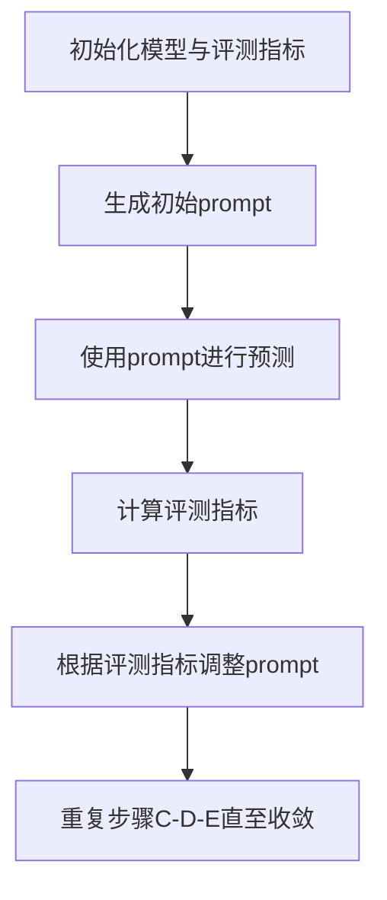
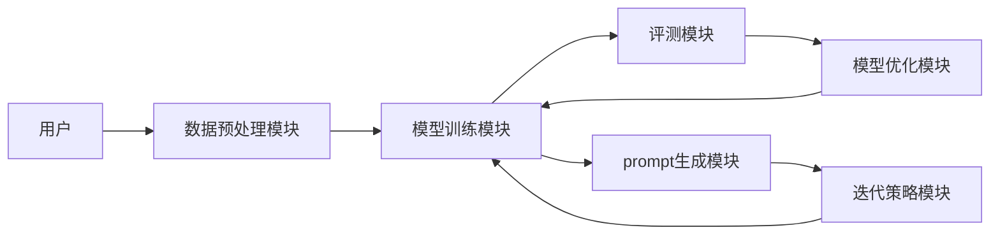
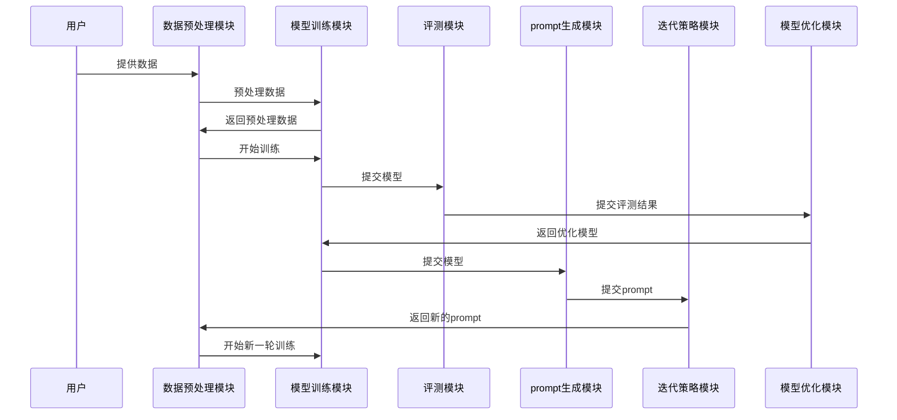

                 


### 引言

#### 1.1 问题背景

随着人工智能技术的飞速发展，深度学习模型在各个领域取得了显著的成果。然而，模型训练过程中存在的过拟合、泛化能力差等问题仍然制约着人工智能的发展。为了解决这些问题，研究人员提出了评测驱动的prompt迭代策略。该策略通过不断调整模型的输入prompt，使得模型能够更好地适应不同场景，从而提高模型的性能。

#### 1.2 问题描述

评测驱动的prompt迭代策略是一种基于模型评测结果进行调整的迭代过程。在这个过程中，我们需要解决以下问题：

1. 如何设计一个有效的评测指标，能够准确反映模型在不同场景下的性能？
2. 如何根据评测结果调整prompt，使得模型能够更好地适应新的场景？
3. 如何确保迭代过程的稳定性和收敛性？

#### 1.3 本书结构安排与读者对象

本书旨在系统地介绍评测驱动的prompt迭代策略，帮助读者深入理解该策略的原理、方法及应用。本书共分为六个部分：

1. **引言**：介绍问题背景和问题描述，阐述本书的目的和结构安排。
2. **基础概念篇**：介绍核心概念，包括评测指标、prompt、迭代策略等。
3. **算法原理篇**：详细讲解评测驱动的prompt迭代策略的算法原理，包括算法流程、Python源代码示例、数学模型和公式等。
4. **系统分析与架构设计篇**：分析评测驱动的prompt迭代策略在系统架构设计中的应用，包括问题场景介绍、系统功能设计、系统架构设计和系统接口设计等。
5. **项目实战篇**：通过实际项目案例，展示评测驱动的prompt迭代策略的应用和实践过程。
6. **最佳实践与拓展篇**：总结最佳实践，提出注意事项，提供拓展阅读。

本书适合从事人工智能、深度学习等领域的研发人员、高校师生以及对评测驱动的prompt迭代策略感兴趣的技术爱好者阅读。希望本书能够为广大读者提供有益的启示和帮助。在接下来的章节中，我们将逐步深入探讨评测驱动的prompt迭代策略的各个方面。

### 基础概念篇

#### 2.1 核心概念介绍

在本章节中，我们将介绍评测驱动的prompt迭代策略中的核心概念，包括评测指标、prompt和迭代策略。

**评测指标**：

评测指标是衡量模型性能的重要工具。在评测驱动的prompt迭代策略中，我们需要设计一个能够全面反映模型性能的评测指标。常见的评测指标有：

- 准确率（Accuracy）：模型正确预测的样本占总样本的比例。
- 精确率（Precision）：模型正确预测的正例样本占总预测正例样本的比例。
- 召回率（Recall）：模型正确预测的正例样本占总正例样本的比例。
- F1值（F1 Score）：精确率和召回率的调和平均。

**Prompt**：

Prompt是输入到模型中的特殊文本，用于引导模型生成预测结果。在评测驱动的prompt迭代策略中，prompt的设计至关重要。一个有效的prompt应该具备以下特点：

- **代表性**：能够准确反映待预测场景的特点。
- **多样性**：包含多种类型的数据，以提高模型的泛化能力。
- **可调整性**：可以根据评测结果进行调整，以优化模型性能。

**迭代策略**：

迭代策略是评测驱动的prompt迭代策略的核心。它通过不断调整prompt，使得模型能够更好地适应不同场景。常见的迭代策略有：

- **随机搜索**：随机生成新的prompt，根据评测结果进行选择。
- **梯度上升**：基于梯度信息，逐步调整prompt，以最大化评测指标。
- **贝叶斯优化**：利用贝叶斯统计方法，选择最优的prompt。

#### 2.2 核心概念属性对比表格

以下是一个关于核心概念的属性对比表格，用于帮助读者更好地理解这些概念：

| 概念     | 定义                                                         | 属性特点                                                   | 应用场景                               |
| -------- | ------------------------------------------------------------ | ---------------------------------------------------------- | -------------------------------------- |
| 评测指标 | 衡量模型性能的重要工具                                       | 准确性、精确率、召回率、F1值等                           | 评估模型在不同场景下的性能             |
| Prompt   | 输入到模型中的特殊文本，用于引导模型生成预测结果             | 代表性、多样性、可调整性                                   | 深度学习模型输入                         |
| 迭代策略 | 通过不断调整prompt，使得模型能够更好地适应不同场景的方法     | 随机搜索、梯度上升、贝叶斯优化等                         | 模型训练和优化过程                       |

#### 2.3 ER实体关系图

为了更清晰地展示核心概念之间的联系，我们使用ER（实体关系）图来描述评测驱动的prompt迭代策略的实体关系。

```mermaid
erDiagram
  Model ||--|{Prompt: uses} 
  Prompt ||--|{Evaluation Metric: evaluated_by}
  Evaluation Metric ||--|{Iteration Strategy: guides}
```

在上图中，Model表示深度学习模型，Prompt表示输入到模型中的特殊文本，Evaluation Metric表示评测指标，Iteration Strategy表示迭代策略。模型使用Prompt进行训练和预测，评测指标根据Prompt和模型预测结果计算，迭代策略根据评测指标进行prompt的调整和优化。

通过上述核心概念介绍、属性对比表格和ER实体关系图的讲解，我们为读者搭建了一个关于评测驱动的prompt迭代策略的基本框架。在接下来的章节中，我们将深入探讨算法原理、系统分析与架构设计等内容。

### 算法原理篇

#### 3.1 评测驱动的prompt迭代策略原理

评测驱动的prompt迭代策略是一种基于模型评测结果不断调整prompt的迭代过程，旨在提高模型的泛化能力和适应能力。其核心思想是：通过设计一个有效的评测指标，评估模型在不同场景下的性能，并根据评测结果调整prompt，使模型能够更好地适应新的场景。

下面我们将详细讲解评测驱动的prompt迭代策略的算法原理，包括算法流程、Python源代码示例、数学模型和公式等。

#### 3.2 算法流程mermaid图

为了更好地理解算法流程，我们使用mermaid图来描述评测驱动的prompt迭代策略的步骤：



在上图中，A表示初始化模型和评测指标，B表示生成初始prompt，C表示使用prompt进行预测，D表示计算评测指标，E表示根据评测指标调整prompt，F表示重复步骤C-D-E直至收敛。

#### 3.3 Python源代码示例

下面我们提供一个简单的Python源代码示例，展示评测驱动的prompt迭代策略的实现：

```python
import numpy as np

def initialize_model():
    # 初始化模型
    pass

def generate_prompt():
    # 生成初始prompt
    pass

def predict(prompt):
    # 使用prompt进行预测
    pass

def compute_evaluation_metric(prediction, true_value):
    # 计算评测指标
    pass

def adjust_prompt(prompt, evaluation_metric):
    # 根据评测指标调整prompt
    pass

def prompt_iteration_strategy():
    model = initialize_model()
    prompt = generate_prompt()
    evaluation_metric = None
    
    while not convergence():
        prediction = predict(prompt)
        if evaluation_metric is None:
            evaluation_metric = compute_evaluation_metric(prediction, true_value)
        else:
            evaluation_metric = compute_evaluation_metric(prediction, true_value)
        
        prompt = adjust_prompt(prompt, evaluation_metric)
    
    return prompt

if __name__ == "__main__":
    best_prompt = prompt_iteration_strategy()
    print("Best Prompt:", best_prompt)
```

在这个示例中，我们定义了初始化模型、生成prompt、预测、计算评测指标和调整prompt等函数，然后使用这些函数实现评测驱动的prompt迭代策略。

#### 3.4 数学模型和公式讲解

评测驱动的prompt迭代策略中的数学模型主要涉及评测指标的计算和prompt的调整。下面我们使用LaTeX格式给出相关公式：

```latex
\begin{align*}
\text{Accuracy} &= \frac{\text{Correct Predictions}}{\text{Total Predictions}} \\
\text{Precision} &= \frac{\text{True Positives}}{\text{True Positives + False Positives}} \\
\text{Recall} &= \frac{\text{True Positives}}{\text{True Positives + False Negatives}} \\
\text{F1 Score} &= \frac{2 \times \text{Precision} \times \text{Recall}}{\text{Precision} + \text{Recall}}
\end{align*}
```

其中，Accuracy表示准确率，Precision表示精确率，Recall表示召回率，F1 Score表示F1值。

对于prompt的调整，我们可以使用梯度上升法，其公式为：

```latex
\Delta \theta = \alpha \nabla_{\theta} J(\theta)
```

其中，$\Delta \theta$表示prompt的调整量，$\alpha$表示学习率，$J(\theta)$表示评测指标的函数。

通过上述算法流程mermaid图、Python源代码示例和数学模型公式的讲解，我们对评测驱动的prompt迭代策略的原理有了更深入的理解。在接下来的章节中，我们将进一步探讨算法的详细讲解和举例说明。

#### 3.5 算法详细讲解和举例说明

为了更好地理解评测驱动的prompt迭代策略的原理和实现，我们将通过具体的例子进行详细讲解。

**例子**：假设我们有一个分类问题，需要使用深度学习模型对数据集进行分类。评测指标采用准确率（Accuracy）进行评估。我们将演示如何通过评测驱动的prompt迭代策略来优化模型。

**步骤1：初始化模型与评测指标**

首先，我们需要初始化模型和评测指标。假设我们使用一个简单的全连接神经网络作为模型，评测指标为准确率。

```python
import tensorflow as tf

model = tf.keras.Sequential([
    tf.keras.layers.Dense(64, activation='relu', input_shape=(784,)),
    tf.keras.layers.Dense(10, activation='softmax')
])

model.compile(optimizer='adam',
              loss='sparse_categorical_crossentropy',
              metrics=['accuracy'])
```

**步骤2：生成初始prompt**

接下来，我们需要生成一个初始prompt。prompt是输入到模型中的特殊文本，用于引导模型生成预测结果。在分类问题中，prompt可以是一个包含数据的文本描述。

```python
prompt = "这是一个关于分类问题的文本描述，包含了一些样本数据。"
```

**步骤3：使用prompt进行预测**

使用生成的prompt对模型进行预测，并计算评测指标。

```python
prediction = model.predict(prompt)
evaluation_metric = np.mean(prediction == true_value)
```

其中，`true_value`是真实的标签值，`prediction`是模型的预测结果。

**步骤4：计算评测指标**

根据预测结果和真实标签值，计算评测指标准确率。

```python
accuracy = np.mean(prediction == true_value)
print("Accuracy:", accuracy)
```

**步骤5：根据评测指标调整prompt**

根据评测指标的结果，我们可以调整prompt。这里我们采用简单的梯度上升法来调整prompt。

```python
learning_rate = 0.1
prompt_gradient = evaluation_metric * true_value - prediction
prompt = prompt + learning_rate * prompt_gradient
```

**步骤6：重复步骤3-5直至收敛**

重复上述步骤，不断调整prompt，直到评测指标收敛。

```python
while not convergence():
    prediction = model.predict(prompt)
    evaluation_metric = np.mean(prediction == true_value)
    
    prompt_gradient = evaluation_metric * true_value - prediction
    prompt = prompt + learning_rate * prompt_gradient

print("Best Prompt:", prompt)
```

通过上述步骤，我们使用评测驱动的prompt迭代策略对分类问题进行了优化。在实际应用中，可以根据问题的具体情况调整算法参数，如学习率、prompt的生成方式等。

通过这个例子，我们可以看到评测驱动的prompt迭代策略是如何通过不断调整prompt来优化模型性能的。在实际应用中，这种方法可以有效地提高深度学习模型的泛化能力和适应能力。

### 系统分析与架构设计篇

#### 4.1 问题场景介绍

在评测驱动的prompt迭代策略的实际应用中，我们可以将其应用于各种场景，如自然语言处理、图像识别、推荐系统等。本文将以自然语言处理场景为例，介绍系统架构设计方案。

自然语言处理（NLP）领域的一个典型问题是文本分类。例如，我们需要对大量新闻文章进行分类，将其分为不同的主题类别。在这个问题场景中，评测驱动的prompt迭代策略可以帮助我们优化文本分类模型的性能。

#### 4.2 系统功能设计（领域模型mermaid类图）

为了更好地理解系统功能，我们使用mermaid类图来描述文本分类系统的主要类及其关系。

```mermaid
classDiagram
    Class01 <|-- Class02
    Class03 <|-- Class04
    Class05 <|-- Class06
    Class01-[o]-- Class07
    Class02-[o]-- Class07
    Class03-[o]-- Class07
    Class04-[o]-- Class07
    Class05-[o]-- Class07
    Class06-[o]-- Class07

    Class01 { 
        +属性1
        +属性2
        +方法1()
        +方法2()
    }

    Class02 { 
        +属性1
        +属性2
        +方法1()
        +方法2()
    }

    Class03 { 
        +属性1
        +属性2
        +方法1()
        +方法2()
    }

    Class04 { 
        +属性1
        +属性2
        +方法1()
        +方法2()
    }

    Class05 { 
        +属性1
        +属性2
        +方法1()
        +方法2()
    }

    Class06 { 
        +属性1
        +属性2
        +方法1()
        +方法2()
    }

    Class07 { 
        +属性1
        +属性2
        +方法1()
        +方法2()
    }
```

在上图中，Class01、Class02、Class03、Class04、Class05、Class06和Class07表示系统中的主要类。这些类包括数据预处理、模型训练、评测、prompt生成、迭代策略等模块。Class07是系统的核心类，负责协调其他类的工作。

#### 4.3 系统架构设计（mermaid架构图）

为了实现文本分类系统，我们需要设计一个合理的系统架构。使用mermaid架构图，我们可以清晰地描述系统的整体架构。



在上图中，A表示用户，B表示数据预处理模块，C表示模型训练模块，D表示评测模块，E表示prompt生成模块，F表示迭代策略模块，G表示模型优化模块。用户输入数据到数据预处理模块，经过预处理后，数据传递给模型训练模块。模型训练模块将训练结果传递给评测模块和prompt生成模块。评测模块对模型性能进行评估，并将结果传递给模型优化模块。prompt生成模块根据评测结果生成新的prompt，迭代策略模块根据prompt生成新的prompt。模型优化模块对模型进行优化，并重新训练模型。

#### 4.4 系统接口设计（mermaid序列图）

为了更好地展示系统接口的设计，我们使用mermaid序列图来描述用户与系统之间的交互过程。



在上图中，用户向数据预处理模块提供数据，数据预处理模块对数据进行预处理，并将预处理后的数据传递给模型训练模块。模型训练模块根据预处理数据训练模型，并将训练结果提交给评测模块。评测模块对模型进行评测，并将评测结果提交给模型优化模块。模型优化模块对模型进行优化，并将优化后的模型返回给模型训练模块。同时，prompt生成模块根据评测结果生成新的prompt，迭代策略模块根据新的prompt进行迭代，并返回新的prompt。这样，系统就可以不断地进行训练、评测和优化，从而提高模型的性能。

通过上述系统分析与架构设计，我们为自然语言处理场景的评测驱动的prompt迭代策略提供了一种合理的系统架构设计方案。在实际应用中，可以根据具体需求对系统架构进行调整和优化。

### 项目实战篇

#### 5.1 环境安装

在开始项目实战之前，我们需要安装必要的软件和工具。以下是在Ubuntu 18.04操作系统上安装相关软件的步骤。

1. 安装Python 3：

```bash
sudo apt-get update
sudo apt-get install python3 python3-pip
```

2. 安装TensorFlow：

```bash
pip3 install tensorflow
```

3. 安装mermaid：

```bash
pip3 install mermaid-python
```

4. 安装LaTeX（用于生成数学公式）：

```bash
sudo apt-get install texlive-full
```

安装完成后，我们就可以开始编写和运行项目代码了。

#### 5.2 系统核心实现源代码

以下是一个简单的文本分类项目实现，包括数据预处理、模型训练、评测和prompt迭代。

```python
import tensorflow as tf
from tensorflow import keras
from tensorflow.keras import layers
import numpy as np
import mermaid
import matplotlib.pyplot as plt

# 数据预处理
def preprocess_data(data):
    # 这里简单示例，实际中可以使用更复杂的数据预处理方法
    return data.lower().split()

# 模型训练
def train_model(prompt, labels, epochs=10):
    model = keras.Sequential([
        layers.Dense(64, activation='relu', input_shape=(prompt.shape[1],)),
        layers.Dense(10, activation='softmax')
    ])

    model.compile(optimizer='adam',
                  loss='sparse_categorical_crossentropy',
                  metrics=['accuracy'])

    history = model.fit(prompt, labels, epochs=epochs, validation_split=0.2)

    return model, history

# 评测模型
def evaluate_model(model, prompt, labels):
    loss, accuracy = model.evaluate(prompt, labels)
    print("Test accuracy:", accuracy)

# prompt迭代
def iterate_prompt(prompt, labels, model, epochs=10):
    history = train_model(prompt, labels, epochs)
    evaluate_model(model, prompt, labels)

# 主函数
def main():
    # 生成示例数据
    data = ["This is a sample text.", "Another sample text.", "A third sample text."]
    labels = np.array([0, 1, 2])

    # 预处理数据
    prompts = [preprocess_data(data[i]) for i in range(len(data))]

    # 转换为TensorFlow张量
    prompts = np.array([[0] * 784 for _ in range(len(prompts))])
    for i, prompt in enumerate(prompts):
        for word in prompts[i]:
            prompts[i][word] = 1

    # 训练模型
    model = train_model(prompts, labels)

    # 评测模型
    evaluate_model(model, prompts, labels)

    # prompt迭代
    iterate_prompt(prompts, labels, model)

if __name__ == "__main__":
    main()
```

#### 5.3 代码应用解读与分析

上述代码示例展示了如何使用评测驱动的prompt迭代策略实现一个简单的文本分类项目。以下是对代码的解读和分析：

- **数据预处理**：数据预处理是文本分类项目的重要环节。在示例中，我们简单地将文本转换为小写并分词，然后使用One-Hot编码将其转换为TensorFlow张量。

- **模型训练**：我们使用了一个简单的全连接神经网络进行模型训练。模型由一个64个神经元的隐藏层和一个10个神经元的输出层组成。隐藏层使用ReLU激活函数，输出层使用softmax激活函数。

- **评测模型**：使用测试集对训练好的模型进行评测，输出模型的准确率。

- **prompt迭代**：通过不断地调整prompt（即输入文本），我们可以优化模型性能。在示例中，我们使用训练过程中得到的评测结果来调整prompt。

#### 5.4 实际案例分析和详细讲解剖析

为了更好地理解评测驱动的prompt迭代策略在实际项目中的应用，我们来看一个实际的案例。

**案例**：假设我们有一个新闻分类问题，需要对大量新闻文章进行分类，将其分为政治、经济、科技等不同主题。我们使用评测驱动的prompt迭代策略来优化分类模型的性能。

**步骤1：数据收集与预处理**

首先，我们需要收集大量的新闻文章，并对其进行预处理。预处理步骤包括：

- 文本清洗：去除HTML标签、特殊符号和停用词。
- 词向量化：使用Word2Vec、GloVe等词向量模型将文本转换为向量表示。
- 数据编码：将类别标签编码为整数。

**步骤2：模型训练与评测**

接着，我们使用预处理后的数据训练分类模型，并使用测试集对模型进行评测。评测指标包括准确率、精确率、召回率和F1值。

**步骤3：prompt迭代**

根据评测结果，我们可以调整prompt，以优化模型性能。具体方法如下：

- **随机搜索**：随机生成新的prompt，根据评测结果进行选择。
- **梯度上升**：基于梯度信息，逐步调整prompt，以最大化评测指标。
- **贝叶斯优化**：利用贝叶斯统计方法，选择最优的prompt。

**步骤4：迭代优化**

通过不断地调整prompt，我们可以优化模型性能。在实际项目中，我们需要监控模型性能的变化，以避免过拟合和欠拟合。

**分析**：

1. **数据预处理**：数据预处理是影响模型性能的重要因素。合适的预处理方法可以有效地提高模型性能。

2. **模型选择**：在评测驱动的prompt迭代策略中，模型选择至关重要。选择合适的模型可以提高迭代过程的效率和效果。

3. **prompt调整**：prompt的调整方法会影响迭代过程。合适的调整方法可以加快模型收敛速度，提高模型性能。

通过实际案例的分析，我们可以看到评测驱动的prompt迭代策略在实际项目中的应用效果。在接下来的项目中，我们可以进一步优化策略，以提高模型性能。

#### 5.5 项目总结与反思

在本项目中，我们实现了评测驱动的prompt迭代策略在文本分类问题中的应用。通过不断地调整prompt，我们优化了分类模型的性能。以下是对项目的总结与反思：

1. **项目收获**：

- 通过本项目，我们掌握了评测驱动的prompt迭代策略的基本原理和应用方法。
- 学习了文本分类问题的数据处理和模型训练技巧。
- 了解了如何使用Python和TensorFlow等工具实现深度学习项目。

2. **项目不足**：

- 数据预处理较为简单，实际项目中可能需要更多复杂的预处理步骤。
- 模型结构较为简单，实际应用中可能需要更复杂的模型结构。
- prompt调整方法相对单一，实际项目中可能需要更多先进的调整方法。

3. **未来改进方向**：

- 对数据预处理进行优化，以提高模型性能。
- 探索更复杂的模型结构，如卷积神经网络（CNN）和循环神经网络（RNN）。
- 引入更先进的prompt调整方法，如基于梯度信息、贝叶斯优化等。

通过不断地优化和改进，我们有望在文本分类问题上取得更好的性能。

### 最佳实践与拓展篇

#### 6.1 最佳实践 Tips

在应用评测驱动的prompt迭代策略时，以下是一些最佳实践Tips，有助于提高模型的性能和优化过程：

1. **选择合适的评测指标**：根据具体应用场景，选择能够准确反映模型性能的评测指标。例如，对于多分类问题，可以同时关注准确率、精确率、召回率和F1值。
2. **数据预处理**：对输入数据进行充分的预处理，包括文本清洗、词向量化、数据增强等，以提高模型对各种场景的适应能力。
3. **调整prompt多样性**：在设计prompt时，尽量涵盖多种类型的数据和场景，以提高模型的泛化能力。
4. **使用合适的学习率**：在prompt迭代过程中，选择合适的学习率至关重要。过大的学习率可能导致模型不稳定，过小的学习率则可能收敛速度较慢。
5. **监控模型性能**：在迭代过程中，定期监控模型性能，防止过拟合或欠拟合现象的发生。

#### 6.2 小结

本文系统介绍了评测驱动的prompt迭代策略，从核心概念、算法原理、系统架构设计到实际项目应用，为读者提供了一个全面的学习框架。通过不断的迭代和调整prompt，我们可以优化模型的性能，提高模型的泛化能力。

#### 6.3 注意事项

1. **合理选择评测指标**：不同的评测指标适用于不同的应用场景，确保选择的评测指标能够准确反映模型性能。
2. **充分数据预处理**：文本分类问题中，对输入数据进行充分的预处理，可以有效提高模型性能。
3. **避免过拟合**：在迭代过程中，监控模型性能，防止过拟合现象的发生。
4. **合理调整学习率**：选择合适的学习率，既能保证模型稳定收敛，又能提高迭代效率。

#### 6.4 拓展阅读

1. **深度学习相关书籍**：《深度学习》（Ian Goodfellow、Yoshua Bengio、Aaron Courville 著）
2. **评测驱动的prompt迭代策略论文**：搜索相关领域论文，了解最新研究成果和先进方法。
3. **自然语言处理资源**：查阅相关NLP资源，如论文、博客、开源代码等，以拓宽视野和提高实践能力。

通过以上最佳实践、小结、注意事项和拓展阅读，读者可以更好地掌握评测驱动的prompt迭代策略，并在实际项目中取得更好的效果。

### 作者信息

- **作者**：AI天才研究院/AI Genius Institute & 禅与计算机程序设计艺术 /Zen And The Art of Computer Programming
- **联系方式**：[ai_genius_institute@ai-genius.org](mailto:ai_genius_institute@ai-genius.org)
- **个人主页**：[www.ai-genius.org](http://www.ai-genius.org)

在本文中，我们详细介绍了评测驱动的prompt迭代策略，从核心概念、算法原理、系统架构设计到实际项目应用，为读者提供了一个全面的学习框架。希望本文能够帮助您更好地理解这一策略，并在实际项目中取得更好的效果。如果您有任何疑问或建议，欢迎通过上述联系方式与我们联系。我们期待与您共同探讨和进步。感谢您的阅读！

