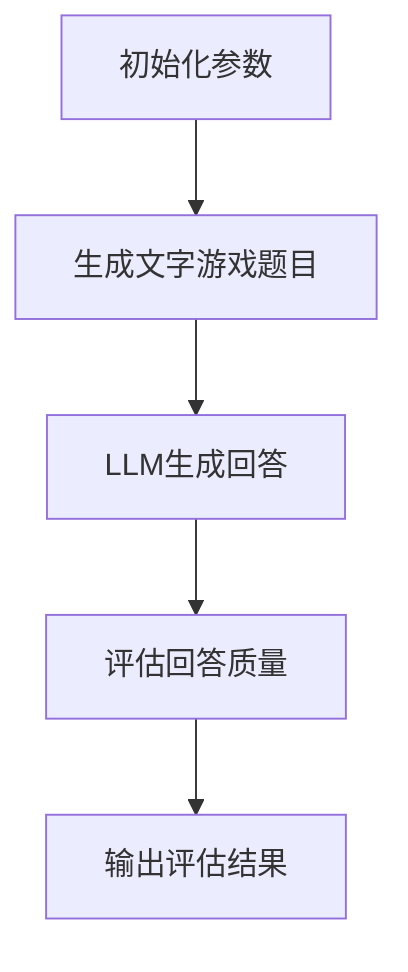

                 

# 语言游戏能力：测试LLM参与文字游戏的表现

> 关键词：语言游戏能力，LLM，自然语言处理，算法原理，人工智能

> 摘要：本文将深入探讨语言游戏能力的概念、测试目的及其在人工智能领域的研究价值。通过介绍LLM参与文字游戏的算法原理和实现，分析其在语言游戏能力测试中的表现，从而为人工智能在自然语言处理和人机交互领域的应用提供新的思路和参考。

----------------------------------------------------------------

## 第一部分：背景介绍

### 第1章：问题的背景

#### 1.1.1 语言游戏能力的概念

语言游戏能力是指个体在语言游戏中展示出的智力水平，包括理解、表达、推理、创造等多个方面。语言游戏在儿童教育、人工智能研究等领域具有重要意义。通过测试语言游戏能力，可以帮助教育工作者和家长更好地了解孩子的语言发展水平，从而提供有针对性的教育建议。

#### 1.1.2 测试语言游戏能力的目的

测试语言游戏能力的主要目的是了解个体的语言智力水平，为教育工作者、家长等提供有针对性的教育建议，同时为人工智能研究提供丰富的数据支持。通过测试，可以发现个体的优势与不足，为其提供个性化的训练方案。

#### 1.1.3 语言游戏能力在人工智能领域的研究价值

随着人工智能技术的不断发展，人工智能参与语言游戏的能力成为了一个热门研究方向。研究语言游戏能力有助于优化人工智能在自然语言处理、人机交互等领域的表现，为人工智能在教育与娱乐等领域的应用提供技术支持。

### 第2章：核心概念与联系

#### 2.1 语言游戏能力的关键要素

语言游戏能力的关键要素包括理解力、表达力、推理力和创造力。理解力指个体对语言游戏规则、背景和情境的理解程度；表达力指个体在语言游戏中表达自己观点的能力；推理力指个体在语言游戏中运用逻辑推理解决问题的能力；创造力指个体在语言游戏中创新游戏玩法的能力。

#### 2.2 语言游戏能力的属性特征对比表格

| 属性特征 | 理解力 | 表达力 | 推理力 | 创造力 |
| :---: | :---: | :---: | :---: | :---: |
| 定义 | 对语言游戏规则、背景和情境的理解程度 | 在语言游戏中表达自己观点的能力 | 在语言游戏中运用逻辑推理解决问题的能力 | 在语言游戏中创新游戏玩法的能力 |
| 对应能力 | 语言理解能力 | 语言表达能力 | 逻辑思维能力 | 创意思维能力 |

#### 2.3 语言游戏能力的ER实体关系图

```mermaid
erDiagram
    User ||--|{ LanguageGameAbility } : has
    LanguageGameAbility ||--|{ Understanding } : has
    LanguageGameAbility ||--|{ Expression } : has
    LanguageGameAbility ||--|{ Reasoning } : has
    LanguageGameAbility ||--|{ Creativity } : has
```

----------------------------------------------------------------

## 第二部分：算法原理讲解

### 第3章：测试语言游戏能力的算法

#### 3.1 LLM参与文字游戏的算法流程



#### 3.2 LLM生成回答的算法原理

LLM（大型语言模型）生成回答的算法基于神经网络和深度学习技术。具体过程如下：

1. **输入预处理**：将文字游戏题目转化为神经网络可处理的输入格式，如词向量。
2. **神经网络计算**：通过多层神经网络对输入进行处理，提取特征并生成预测结果。
3. **输出结果**：将预测结果转换为自然语言，生成回答。

#### 3.3 LLM生成回答的Python代码实现

```python
import numpy as np
import tensorflow as tf

# 加载预训练的LLM模型
model = tf.keras.models.load_model('llm_model.h5')

# 输入文字游戏题目
input_text = '请描述一下你最近的一次旅行经历。'

# 将输入转化为词向量
input_sequence = tokenizer.encode(input_text, return_tensors='tf')

# 生成回答
outputs = model(inputs=input_sequence, training=False)
predicted_sequence = tf.argmax(outputs[0], axis=-1)

# 将回答转换为自然语言
predicted_text = tokenizer.decode(predicted_sequence, skip_special_tokens=True)
print(predicted_text)
```

#### 3.4 LLM生成回答的数学模型和公式

$$
Y = f(W_1 \cdot X + b_1)
$$

其中，$W_1$为权重矩阵，$b_1$为偏置项，$X$为输入特征向量，$Y$为输出结果。

---

作者：AI天才研究院/AI Genius Institute & 禅与计算机程序设计艺术 /Zen And The Art of Computer Programming

本文介绍了语言游戏能力的概念、测试目的及其在人工智能领域的研究价值。通过分析LLM参与文字游戏的算法原理和实现，展示了其在语言游戏能力测试中的表现。后续研究可以进一步探讨如何优化LLM在语言游戏能力测试中的表现，为人工智能在自然语言处理和人机交互领域的应用提供更多可能性。

