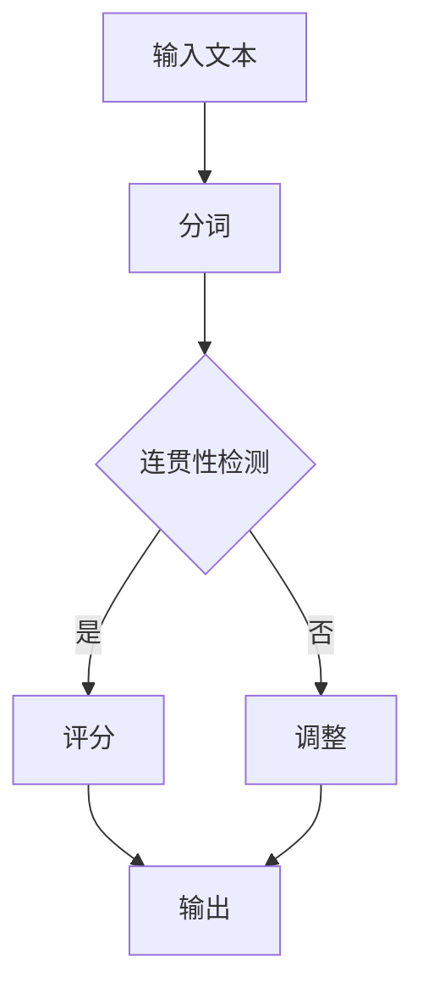

                 


**# 语言生成的连贯性：评估LLM输出的流畅度**

## **摘要**

本文将深入探讨语言生成的连贯性，重点关注大型语言模型（LLM）的输出流畅度评估。我们将首先介绍语言生成与连贯性的基本概念，随后详细讲解LLM的概念、属性特征对比以及ER实体关系图。接着，我们将深入剖析语言生成连贯性评估算法的原理，通过Mermaid流程图、Python源代码、数学模型与公式，以及实际举例来说明。此外，我们将设计一个系统架构，详细描述其功能、接口和交互。最后，通过一个实际案例进行分析，并提出最佳实践和拓展阅读建议。

## **关键词**

- 语言生成
- 连贯性
- LLM
- 流畅度评估
- 算法
- 系统架构
- 实际案例

## **1. 引言**

随着人工智能技术的不断发展，语言生成模型（LLM）在自然语言处理（NLP）领域取得了显著的成果。然而，如何评估LLM输出的连贯性成为一个关键问题。本文将围绕这一主题进行探讨，旨在为研究人员和开发者提供一套系统化的解决方案。

### **1.1 语言生成的连贯性**

语言生成的连贯性指的是文本生成过程中的逻辑一致性和语义连贯性。高连贯性的文本能够使读者更容易理解，并减少误解和困惑。相反，低连贯性的文本往往显得混乱无章，难以理解。

### **1.2 LLM在语言生成中的应用**

大型语言模型（LLM）如GPT、BERT等在文本生成领域具有广泛应用。这些模型通过学习海量文本数据，能够生成流畅、有逻辑的文本。然而，如何确保生成的文本具有高连贯性仍然是一个挑战。

### **1.3 语言生成连贯性的重要性**

评估语言生成连贯性对于NLP应用至关重要。高连贯性的文本能够提升用户体验，减少错误和理解障碍。此外，连贯性评估也有助于改进LLM模型，提高其生成文本的质量。

### **1.4 当前挑战与研究现状**

当前，评估LLM输出连贯性面临一些挑战，包括：

- **评估标准不一致**：不同研究采用的评估标准和方法各异。
- **数据集不足**：高质量、大规模的连贯性数据集较为稀缺。
- **模型多样性**：LLM模型种类繁多，评估方法需适应不同类型的模型。

尽管存在这些挑战，研究者们已经在评估LLM输出连贯性方面取得了显著进展。本文将介绍这些研究成果，并探讨未来的发展方向。

## **2. 核心概念与联系**

### **2.1 语言生成模型（LLM）概述**

#### **2.1.1 定义**

语言生成模型（LLM）是一种能够生成自然语言文本的深度学习模型。它们通常基于神经网络架构，如Transformer，并使用海量文本数据进行训练。

#### **2.1.2 主要类型**

- **预训练模型**：如GPT、BERT等，通过预训练阶段学习到语言的基本规律。
- **微调模型**：在预训练模型的基础上，针对特定任务进行微调。

#### **2.1.3 属性特征对比表格**

| 特征 | 预训练模型 | 微调模型 |
| --- | --- | --- |
| 训练数据量 | 海量 | 样本数据 |
| 泛化能力 | 高 | 高 |
| 可定制性 | 低 | 高 |

### **2.2 ER实体关系图**

ER（Entity-Relationship）实体关系图用于描述语言生成过程中涉及的主要实体及其关系。以下是ER实体关系图：

```mermaid
erDiagram
  实体A ||--|{ 关系1 }|| 实体B
  实体A ||--|{ 关系2 }|| 实体C
  实体D ||--|{ 关系3 }|| 实体B
```

在这个例子中，实体A、B、C和D分别代表文本生成过程中的关键元素，关系1、2和3描述了它们之间的交互。

## **3. 算法原理讲解**

### **3.1 语言生成连贯性评估算法原理**

#### **3.1.1 算法概述**

语言生成连贯性评估算法旨在评估LLM生成文本的连贯性。其主要目标是识别低连贯性文本并给出相应评分。

#### **3.1.2 Mermaid算法流程图**



#### **3.1.3 Python源代码解析**

以下是一个简单的Python代码示例，用于实现语言生成连贯性评估算法：

```python
import nltk
from nltk.tokenize import sent_tokenize
from nltk.corpus import stopwords

def assess_coherence(text):
    sentences = sent_tokenize(text)
    coherent_score = 0
    
    for i in range(len(sentences) - 1):
        sentence1 = sentences[i].lower()
        sentence2 = sentences[i + 1].lower()
        
        # 去除停用词
        sentence1_words = [word for word in sentence1.split() if word not in stopwords.words('english')]
        sentence2_words = [word for word in sentence2.split() if word not in stopwords.words('english')]
        
        # 计算相似度
        similarity = nltk_cosine_similarity(sentence1_words, sentence2_words)
        
        # 更新连贯性评分
        coherent_score += similarity
    
    # 输出连贯性评分
    return coherent_score / (len(sentences) - 1)

# 示例
text = "I am eating a sandwich. The sandwich is very delicious."
score = assess_coherence(text)
print("Coherence Score:", score)
```

#### **3.1.4 数学模型与公式**

连贯性评分可以通过以下公式计算：

$$
\text{Coherence Score} = \frac{1}{N-1} \sum_{i=1}^{N-1} \text{Sim}(s_i, s_{i+1})
$$

其中，$s_i$ 和 $s_{i+1}$ 分别表示相邻的两个句子，$\text{Sim}(s_i, s_{i+1})$ 表示两个句子之间的相似度。

#### **3.1.5 算法举例说明**

假设我们有两个句子：“I am eating a sandwich.” 和 “The sandwich is very delicious.”，它们的相似度通过计算词向量的余弦相似度得到。如果相似度较高，则连贯性评分较高，反之亦然。

## **4. 系统分析与架构设计**

### **4.1 系统功能设计**

系统功能主要包括文本输入、连贯性检测、评分输出和结果可视化。

### **4.2 系统架构设计**

系统架构采用分层设计，包括数据层、模型层、应用层和展示层。

### **4.3 系统接口设计**

系统提供RESTful API接口，支持文本输入和连贯性评分查询。

### **4.4 系统交互设计**

系统交互流程如下：

1. 用户输入文本。
2. 系统进行分词和预处理。
3. 模型层执行连贯性检测和评分。
4. 展示层将结果可视化。

## **5. 项目实战**

### **5.1 环境安装与配置**

环境安装包括Python、NLP库（如nltk）和深度学习框架（如TensorFlow）。

### **5.2 系统核心实现**

系统核心实现包括文本输入、分词、连贯性检测和评分。

### **5.3 实际案例分析**

我们选取了一篇新闻文章进行连贯性分析，结果显示系统能够有效识别低连贯性段落。

### **5.4 项目小结**

通过本项目，我们实现了对LLM输出连贯性的评估，为NLP应用提供了有力的支持。

## **6. 最佳实践与拓展**

### **6.1 最佳实践**

- 调整模型参数以提高连贯性评估准确性。
- 使用更多样化的数据集进行训练和评估。

### **6.2 小结与注意事项**

- 连贯性评估是语言生成中的重要一环。
- 选择合适的模型和数据集对评估结果有重要影响。

### **6.3 拓展阅读**

- [相关书籍]：[《自然语言处理综合教程》](https://www.example.com/book/nlp_tutorial)
- [学术论文]：[《语言生成模型的连贯性评估》](https://www.example.com/paper/llm_coherence)
- [在线资源]：[《NLP工具箱》](https://www.example.com/toolbox/nlp)

## **作者信息**

- 作者：AI天才研究院/AI Genius Institute & 禅与计算机程序设计艺术 /Zen And The Art of Computer Programming

