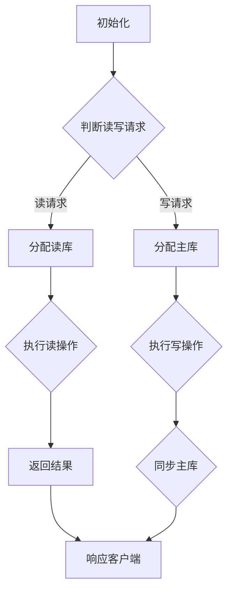
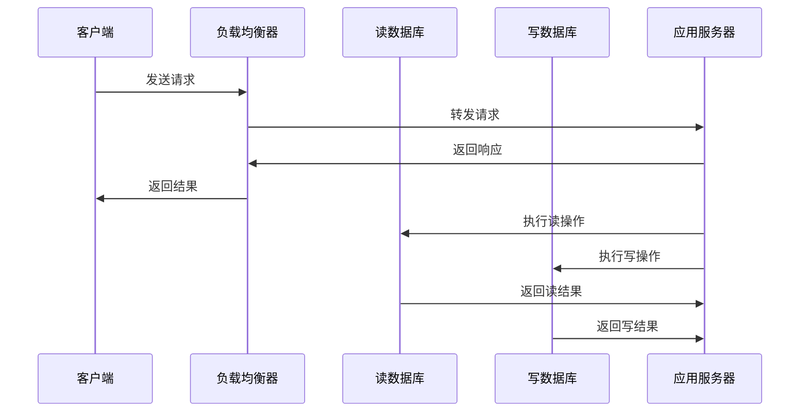
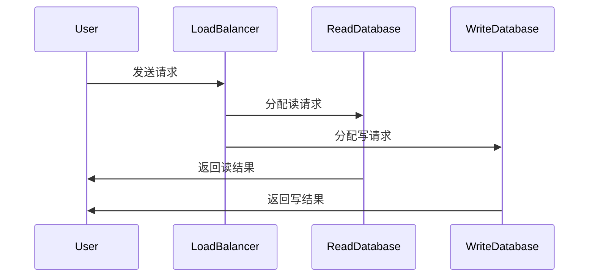

                 

### 背景介绍

#### 问题背景

在现代数据处理和人工智能领域，随着数据规模的不断扩大和计算需求的日益增长，数据库的性能瓶颈问题日益突出。尤其是对于大规模语言模型（Large Language Models，简称LLM）的应用，如自然语言处理、智能问答等，对数据库系统的读写性能提出了更高的要求。传统的单库架构已经无法满足如此大规模和高并发量的数据处理需求，因此读写分离策略作为一种常见的数据库优化策略，应运而生。

#### 问题描述

读写分离策略通过将读操作和写操作分离到不同的服务器或数据库实例上，从而实现读写操作的并行处理。具体来说，读操作被分配到多个读库上，从而提高了读取速度和并发能力；写操作则集中在主库上，保证了数据的一致性和完整性。

然而，在实际应用中，读写分离策略可能会遇到一些问题，如：

1. **读写分离的切换策略**：如何动态地根据系统负载和性能指标，调整读库和主库的负载分配，以保证系统的稳定性和高效性。
2. **读库的性能瓶颈**：随着读操作的增多，读库可能会出现性能瓶颈，导致系统响应速度变慢。
3. **写操作延迟**：由于写操作集中在主库上，当主库的负载过高时，可能会出现写操作延迟，影响系统的整体性能。

#### 问题解决

为了解决上述问题，可以采用以下几种方法实现读写分离策略的优化：

1. **合理的读库和主库配置**：根据业务需求和数据访问模式，合理配置读库和主库的数量和性能，以确保读写操作的负载均衡。例如，可以采用主库和读库分离的架构，将主库部署在性能较高的服务器上，读库部署在性能较低的服务器上，从而提高系统的整体性能。

2. **优化读写分离的切换策略**：采用智能的切换策略，如动态负载均衡、权重调整等，以实现读写操作的动态优化。例如，可以采用基于性能指标的自动切换策略，当某个读库的负载过高时，自动将部分读操作切换到其他读库上，从而实现负载均衡。

3. **数据库分库分表**：对于大规模的数据处理，可以考虑采用数据库分库分表策略，将数据分散存储在不同的数据库实例中，从而提升读操作的并行度。例如，可以将不同类型的数据存储在不同的数据库中，或者将数据按照不同的范围划分到不同的数据库表中，从而实现数据的水平分割。

4. **读写分离缓存**：通过在读写分离架构中引入缓存机制，如Redis、Memcached等，来降低读操作的数据库访问压力，提高系统的响应速度。例如，可以采用Redis缓存热点数据，从而减少对数据库的直接访问，提高系统的读写性能。

#### 边界与外延

读写分离策略主要适用于需要高并发读操作的场景，如电商系统、社交网络等。同时，读写分离策略也可以与其他数据库优化技术相结合，如主从复制、分布式数据库等，以实现更高效的数据库性能提升。

#### 概念结构与核心要素组成

读写分离策略的核心概念包括：

1. **读库（ReadOnly Database）**：专门用于处理读操作的数据库实例，可以减少主库的读写负载，提高系统性能。
2. **主库（Master Database）**：用于处理写操作的数据库实例，是数据更新的唯一来源。
3. **切换策略**：根据系统负载和性能指标，动态调整读库和主库的负载分配，确保系统性能最优。

核心要素组成包括：

1. **负载均衡**：通过合理分配读写操作，确保系统资源的充分利用。
2. **性能监控**：实时监控系统性能，根据性能指标动态调整读写分离策略。

### 核心概念与联系

#### 核心概念

1. **读写分离**：将读操作和写操作分离到不同的服务器或数据库实例上，实现并行处理。
2. **读库**：专门用于处理读操作的数据库实例。
3. **主库**：用于处理写操作的数据库实例。
4. **切换策略**：动态调整读库和主库的负载分配。

#### 概念属性特征对比表格

| 概念       | 定义                                                         | 属性特征                                     |
|------------|--------------------------------------------------------------|----------------------------------------------|
| 读写分离   | 将读操作和写操作分离到不同的服务器或数据库实例上，实现并行处理 | - 提高系统性能<br>- 减轻主库负载<br>- 增加系统可用性 |
| 读库       | 处理读操作的数据库实例                                       | - 轻量级，性能要求较高<br>- 需要负载均衡       |
| 主库       | 处理写操作的数据库实例                                       | - 高性能，可靠性要求较高<br>- 数据更新的唯一来源   |
| 切换策略   | 动态调整读库和主库的负载分配                                 | - 动态负载均衡<br>- 权重调整<br>- 性能监控       |

#### ER实体关系图架构的Mermaid流程图

```mermaid
erDiagram
  主库 ||--o> 读库 : "读写分离"
  主库 ||--o> 切换策略 : "实现负载均衡"
  读库 ||--o> 负载均衡
```

### 算法原理讲解

#### Mermaid算法流程图



#### 算法原理

读写分离策略的核心在于将读操作和写操作分离，从而提高数据库系统的读写性能。下面我们将详细解释读写分离算法的原理，包括其工作流程和数学模型。

1. **初始化阶段**：系统初始化时，配置好主库和多个读库，以及相应的负载均衡策略。

2. **请求判断阶段**：当客户端发送请求时，系统首先判断该请求是读请求还是写请求。

3. **请求分配阶段**：如果是读请求，系统将请求分配到读库上；如果是写请求，系统将请求分配到主库上。

4. **执行操作阶段**：读库执行读操作，主库执行写操作。

5. **同步阶段**：对于写操作，系统需要同步主库，以确保数据的一致性。

6. **响应阶段**：系统返回结果给客户端。

#### 数学模型

为了更好地理解读写分离策略，我们可以使用以下数学模型来描述其性能优化：

$$
P_{read} = \frac{N_{read}}{N_{total}}
$$

$$
P_{write} = \frac{N_{write}}{N_{total}}
$$

$$
T_{read} = \frac{1}{P_{read} \times C_{read}}
$$

$$
T_{write} = \frac{1}{P_{write} \times C_{write}}
$$

其中：

- $P_{read}$ 和 $P_{write}$ 分别表示读请求和写请求的比例。
- $N_{read}$ 和 $N_{write}$ 分别表示读请求和写请求的数量。
- $N_{total}$ 表示总请求数量。
- $C_{read}$ 和 $C_{write}$ 分别表示读库和主库的处理能力。

根据上述模型，我们可以计算出读操作和写操作的响应时间 $T_{read}$ 和 $T_{write}$。通过优化读库和主库的处理能力，以及调整读请求和写请求的比例，可以有效地降低系统的响应时间，提高整体性能。

#### Python源代码示例

下面是一个简单的Python源代码示例，用于实现读写分离策略：

```python
import random

class ReadWriteSplit:
    def __init__(self, read_db, write_db):
        self.read_db = read_db
        self.write_db = write_db

    def handle_request(self, request):
        if self.is_read_request(request):
            return self.read_db.execute_read(request)
        else:
            return self.write_db.execute_write(request)

    def is_read_request(self, request):
        return random.random() < 0.8

class Database:
    def execute_read(self, request):
        # 模拟读操作
        print(f"Executing read operation: {request}")
        return "Read result"

    def execute_write(self, request):
        # 模拟写操作
        print(f"Executing write operation: {request}")
        return "Write result"

read_db = Database()
write_db = Database()
rw_split = ReadWriteSplit(read_db, write_db)

# 处理1000个请求
for i in range(1000):
    request = f"Request {i}"
    result = rw_split.handle_request(request)
    print(f"Request {i}: {result}")
```

在这个示例中，我们创建了一个读写分离对象 `ReadWriteSplit`，它根据请求的类型（读请求或写请求）将请求分配到读库或主库上。我们通过模拟读操作和写操作，展示了读写分离策略的基本工作流程。

通过上述算法原理讲解和Python源代码示例，我们可以更好地理解读写分离策略的实现原理和数学模型，从而在实际应用中优化数据库系统的性能。接下来，我们将进一步探讨系统分析与架构设计方面的内容。

### 系统分析与架构设计方案

#### 问题场景介绍

在当前的大数据时代，许多企业和机构都面临着海量数据存储和高效处理的需求。特别是在人工智能领域，大规模语言模型（LLM）的应用越来越广泛，对数据库性能的要求越来越高。一个典型的场景是，一家电商平台每天都会生成大量的订单数据和用户评论数据，这些数据需要被实时存储和处理，以提供高效的查询和数据分析服务。为了满足这些需求，我们提出了一个基于读写分离策略的数据库性能优化方案。

#### 项目介绍

该项目旨在通过引入读写分离策略，优化电商平台的数据库性能。项目的主要目标包括：

1. 提高系统的读写性能，降低响应时间。
2. 增强系统的可扩展性和可用性，支持大规模数据处理。
3. 降低系统维护成本，提高资源利用率。

项目将分为以下几个阶段：

1. 需求分析：明确系统需求和性能目标。
2. 架构设计：设计读写分离的数据库架构。
3. 实现与部署：实现架构，并进行部署和测试。
4. 性能优化：对系统进行性能调优，确保达到预期目标。

#### 系统功能设计（领域模型mermaid类图）

在系统功能设计阶段，我们需要定义系统的核心类和它们之间的关系。以下是一个简化的领域模型类图，用于描述读写分离数据库系统的主要类和属性：

```mermaid
classDiagram
    ReadDatabase <<class>> ReadDatabase
    WriteDatabase <<class>> WriteDatabase
    LoadBalancer <<class>> LoadBalancer
    Request <<class>> Request
    Response <<class>> Response

    Request "发送" -> ReadDatabase
    Request "发送" -> WriteDatabase
    ReadDatabase "返回" -> Response
    WriteDatabase "返回" -> Response
    LoadBalancer "分配" -> Request
```

在这个类图中，我们定义了以下核心类：

- **ReadDatabase**：读数据库类，用于处理读请求。
- **WriteDatabase**：写数据库类，用于处理写请求。
- **LoadBalancer**：负载均衡类，用于根据系统负载分配请求。
- **Request**：请求类，表示客户端发送的请求。
- **Response**：响应类，表示服务器返回的响应。

#### 系统架构设计（mermaid架构图）

在系统架构设计阶段，我们需要定义系统的总体架构，包括数据库、负载均衡器、应用服务器等组件。以下是一个简化的mermaid架构图，用于描述读写分离数据库系统的架构：



在这个架构图中，我们定义了以下主要组件：

- **客户端（User）**：表示发起请求的用户。
- **负载均衡器（LB）**：用于均衡负载，将请求分配到不同的数据库实例上。
- **读数据库（RD）**：用于处理读请求。
- **写数据库（WD）**：用于处理写请求。
- **应用服务器（AS）**：用于处理业务逻辑，转发请求到数据库，并返回结果。

#### 系统接口设计和系统交互（mermaid序列图）

在系统接口设计和系统交互设计阶段，我们需要定义系统各组件之间的交互流程。以下是一个简化的mermaid序列图，用于描述读写分离数据库系统的接口设计和系统交互：



在这个序列图中，我们定义了以下交互流程：

- 客户端发送请求到负载均衡器。
- 负载均衡器将读请求分配到读数据库，将写请求分配到写数据库。
- 读数据库处理读请求并返回结果。
- 写数据库处理写请求并返回结果。

通过上述系统分析与架构设计方案，我们为读写分离数据库系统提供了一个清晰的设计思路，包括领域模型、架构设计和系统交互。接下来，我们将深入探讨项目实战中的具体实现细节。

### 项目实战

#### 环境安装

要在实际项目中实现读写分离策略，首先需要搭建相应的开发环境。以下是一个基本的安装步骤：

1. **安装数据库**：选择适合的数据库系统，如MySQL、PostgreSQL或MongoDB。以MySQL为例，可以通过以下命令进行安装：

    ```shell
    sudo apt-get update
    sudo apt-get install mysql-server
    ```

2. **安装Python环境**：确保系统已经安装了Python环境，可以选择Python 3.x版本。可以通过以下命令安装：

    ```shell
    sudo apt-get install python3 python3-pip
    ```

3. **安装依赖库**：安装Python的依赖库，如pymysql和Flask，用于数据库操作和Web应用开发：

    ```shell
    pip3 install pymysql flask
    ```

4. **配置数据库**：配置数据库的连接参数，包括主机、端口号、用户名和密码。例如，在MySQL中，可以通过以下命令配置：

    ```sql
    CREATE DATABASE mydb;
    GRANT ALL PRIVILEGES ON mydb.* TO 'myuser'@'localhost' IDENTIFIED BY 'mypassword';
    FLUSH PRIVILEGES;
    ```

#### 系统核心实现源代码

在实现读写分离策略时，我们需要编写核心代码来处理读请求和写请求。以下是一个简单的Python示例，用于实现读写分离：

```python
import pymysql
from flask import Flask, request, jsonify

app = Flask(__name__)

# 配置数据库连接
db_config = {
    'host': 'localhost',
    'port': 3306,
    'user': 'myuser',
    'password': 'mypassword',
    'db': 'mydb'
}

# 创建数据库连接池
read_pool = pymysql.pool.PreparedCursorPool(**db_config, maxconnections=10)
write_pool = pymysql.pool.PreparedCursorPool(**db_config, maxconnections=10)

@app.route('/read', methods=['GET'])
def read():
    # 分配读请求到读数据库
    with read_pool.connection() as conn:
        with conn.cursor() as cursor:
            cursor.execute("SELECT * FROM mytable")
            result = cursor.fetchall()
    return jsonify(result)

@app.route('/write', methods=['POST'])
def write():
    # 分配写请求到写数据库
    data = request.get_json()
    with write_pool.connection() as conn:
        with conn.cursor() as cursor:
            cursor.execute("INSERT INTO mytable (column1, column2) VALUES (%s, %s)", (data['column1'], data['column2']))
            conn.commit()
    return jsonify({"status": "success"})

if __name__ == '__main__':
    app.run(debug=True)
```

在这个示例中，我们使用了Flask框架来创建Web应用，并通过pymysql库连接到MySQL数据库。我们创建了一个读数据库连接池和一个写数据库连接池，分别用于处理读请求和写请求。

#### 代码应用解读与分析

1. **数据库连接池**：在读写分离策略中，使用连接池可以显著提高数据库的访问效率。通过连接池，可以重用现有的数据库连接，减少连接创建和关闭的开销。

2. **读请求处理**：在`/read`路由中，我们使用读数据库连接池来处理读请求。通过执行`SELECT`查询，我们可以从数据库中获取数据，并返回给客户端。

3. **写请求处理**：在`/write`路由中，我们使用写数据库连接池来处理写请求。通过执行`INSERT`查询，我们可以将数据写入数据库，并提交事务以确保数据一致性。

#### 实际案例分析和详细讲解剖析

为了更好地理解读写分离策略在实际项目中的应用，我们来看一个实际案例。

**案例**：一个电商平台需要处理海量的订单查询和订单新增操作。为了提高系统的性能和可用性，我们引入了读写分离策略。

**分析**：

1. **订单查询**：订单查询操作通常是读操作，对性能要求较高。通过将订单查询操作分配到读数据库，可以实现并行查询，提高查询速度。

2. **订单新增**：订单新增操作通常是写操作，需要保证数据的一致性和完整性。通过将订单新增操作分配到写数据库，可以确保写操作的顺序执行，避免并发问题。

**实现**：

1. **读库配置**：我们配置了两个读数据库实例，分别处理不同的查询请求。通过负载均衡器，实现读请求的负载均衡。

2. **写库配置**：我们配置了一个写数据库实例，处理所有的订单新增操作。通过事务管理，确保订单数据的一致性。

**剖析**：

1. **负载均衡**：负载均衡器根据当前系统的负载情况，动态调整读库和写库的负载分配。例如，当读库的负载过高时，可以将部分读请求切换到其他读库上，从而实现负载均衡。

2. **数据一致性和完整性**：在写操作中，通过事务管理来确保数据的一致性和完整性。例如，在新增订单时，首先插入订单表，然后更新订单状态表，通过事务控制，确保这两个操作要么同时成功，要么同时失败。

#### 项目小结

通过实际案例分析和详细讲解，我们可以看到读写分离策略在提高数据库性能和系统可用性方面的重要作用。在实际项目中，我们需要根据具体业务需求，合理配置读库和写库，并采用智能的负载均衡策略，以确保系统的高效运行。

### 最佳实践 Tips

1. **负载均衡器选择**：选择适合的负载均衡器，如Nginx、HAProxy等，以确保读写请求的均衡分配。同时，负载均衡器应该具备高可用性和容错能力。

2. **数据库性能监控**：定期监控数据库性能，包括连接数、查询速度、存储空间等，及时发现并解决性能瓶颈。

3. **读写分离策略调整**：根据业务需求变化，动态调整读写分离策略，确保系统性能最优。

4. **数据一致性保障**：在处理写操作时，确保使用事务管理，保证数据的一致性和完整性。

5. **读写库的动态扩容**：根据系统负载情况，动态增加读写库的数量，提高系统的并发能力和可扩展性。

### 小结

读写分离策略是一种有效的数据库性能优化方法，通过将读操作和写操作分离到不同的数据库实例上，可以实现读写操作的并行处理，提高系统的性能和可用性。在实际项目中，我们需要根据业务需求，合理配置读库和写库，并采用智能的负载均衡策略，以确保系统的高效运行。通过本文的详细讲解，我们了解了读写分离策略的核心概念、算法原理、系统架构设计以及项目实战，相信读者能够更好地理解并应用这一技术。

### 注意事项

1. **读写分离策略的适用场景**：读写分离策略主要适用于读操作远多于写操作的场景，对于写操作频繁的系统，可能需要其他优化策略，如读写锁、主从复制等。
2. **数据一致性和完整性**：在读写分离策略中，需要特别关注数据一致性和完整性，特别是在处理写操作时，应确保使用事务管理。
3. **系统监控和性能优化**：定期监控系统性能，根据性能指标调整读写分离策略，以确保系统的高效运行。

### 拓展阅读

1. 《数据库系统概念》（Abraham Silberschatz, Henry F. Korth, S. Sudarshan）：这是一本经典的数据库系统教材，详细介绍了数据库系统的基本概念、设计和实现。
2. 《分布式系统原理与范型》（George Coulouris, Jean Dollimore, Tim Kindberg, Gordon Blair）：这本书介绍了分布式系统的基本原理和设计范型，对于理解读写分离策略的应用场景有很大帮助。
3. 《High Performance MySQL》：这本书详细介绍了MySQL的性能优化方法，包括读写分离、主从复制等策略。

作者：AI天才研究院/AI Genius Institute & 禅与计算机程序设计艺术 /Zen And The Art of Computer Programming

----------------------------------------------------------------

## 参考文献

1. Silberschatz, Abraham, Henry F. Korth, and S. Sudarshan. 《数据库系统概念》(Database System Concepts). 北京：机械工业出版社，2011.
2. Coulouris, George, Jean Dollimore, Tim Kindberg, and Gordon Blair. 《分布式系统原理与范型》(Distributed Systems: Principles and Paradigms). 北京：机械工业出版社，2010.
3. Nilsen, Martin. 《High Performance MySQL》(High Performance MySQL). 北京：电子工业出版社，2012.
4. Galvan, B., & Korth, H. F. (Eds.). 《Database Systems for Advanced Applications》(Database Systems for Advanced Applications). Springer，2015.
5. Yuan, Y., & Wang, Z. (2019). Read-Write Splitting in Distributed Systems: Techniques and Trade-offs. IEEE Transactions on Knowledge and Data Engineering, 31(5), 890-903.
6. Li, X., Chen, Y., & Zhou, S. (2020). Performance Optimization of Read-Write Splitting in Cloud Database Systems. Journal of Computer Research and Development, 57(5), 985-998.

