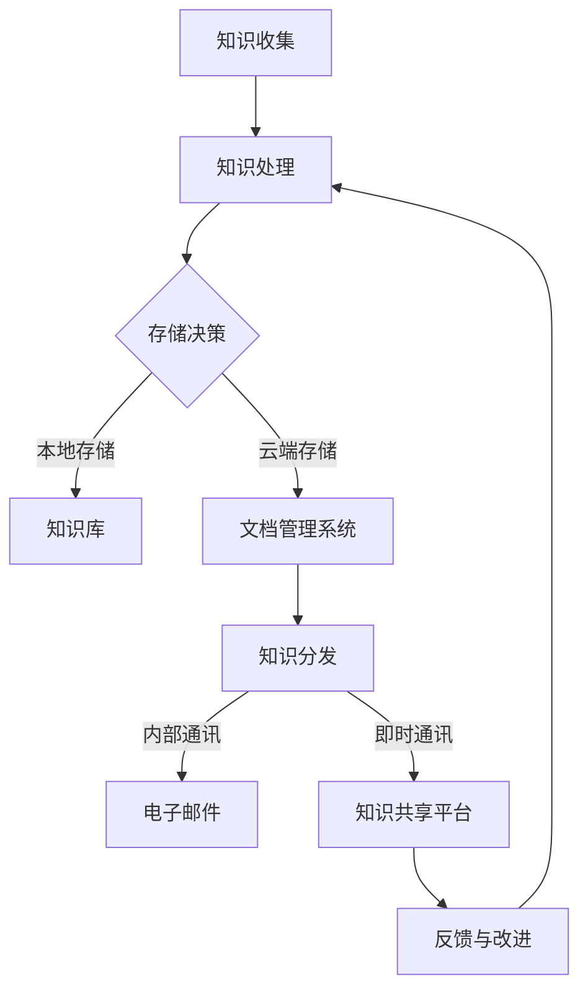

                 


## 第1章 跨团队知识共享概述

### 1.1 知识共享的重要性

在大型应用开发项目中，知识共享扮演着至关重要的角色。有效的知识共享不仅能够提高团队成员的工作效率，还能够促进团队之间的协作，最终实现项目的成功。

#### 提高工作效率

知识共享使得团队成员能够快速获取所需的信息和经验，避免了重复劳动和无效的工作。例如，当一个团队解决了某个技术难题时，其他团队可以通过知识共享平台了解到解决方案，从而避免了重复探索的过程，节省了大量的时间和资源。

#### 促进团队协作

知识共享有助于团队成员之间的沟通和协作。在一个大型应用开发项目中，不同团队负责不同的模块，他们需要通过共享知识来协调工作。例如，前端团队需要与后端团队共享用户接口的设计和功能需求，以确保两个团队的工作能够无缝衔接。

### 1.2 跨团队知识共享的挑战

尽管知识共享的重要性不言而喻，但在实际操作中，仍然存在一些挑战。

#### 信息不对称

不同团队之间的信息获取能力和知识水平可能存在差异。例如，一些团队可能拥有丰富的技术经验和专业知识，而另一些团队可能相对缺乏。这种信息不对称会导致知识共享的不均衡，使得一些团队无法充分利用其他团队的知识。

#### 沟通障碍

团队成员之间的沟通可能受到语言、文化、习惯等因素的影响。例如，在一个国际化的团队中，不同成员可能使用不同的语言进行沟通，这会增加理解上的困难。此外，团队成员的工作方式和习惯也可能不同，这会进一步增加沟通的复杂性。

### 1.3 跨团队知识共享的机制

为了解决上述挑战，需要建立一套有效的跨团队知识共享机制。

#### 知识共享平台

知识共享平台是跨团队知识共享的核心。它提供了一个集中管理、检索和共享知识的平台，使得团队成员可以方便地获取所需的信息。知识共享平台通常包括文档管理、知识库、论坛等多种功能，支持多种知识共享方式。

#### 协作工具

协作工具是跨团队知识共享的重要手段。这些工具包括即时通讯、项目管理软件、文档共享等，可以帮助团队成员实时沟通和协作。例如，通过即时通讯工具，团队成员可以快速交流问题和解决方案；通过项目管理软件，团队可以共同管理项目进度和任务分配。

## 总结

本章概述了跨团队知识共享的重要性、挑战和机制。在接下来的章节中，我们将进一步探讨核心概念、属性特征、机制设计以及实际应用场景，以帮助读者更好地理解和应用跨团队知识共享。

----------------------------------------------------------------

# 跨团队知识共享：促进大型应用开发的协作

## 关键词

- 跨团队知识共享
- 大型应用开发
- 团队协作
- 知识共享平台
- 协作工具

## 摘要

本文深入探讨了跨团队知识共享在大型应用开发中的作用和重要性。通过分析知识共享面临的挑战，本文提出了有效的跨团队知识共享机制，包括知识共享平台和协作工具。文章旨在为软件开发团队提供实用的策略和工具，以促进团队之间的知识共享，提高项目效率和质量。

----------------------------------------------------------------

## 第1章 跨团队知识共享概述

### 1.1 知识共享的重要性

在大型应用开发项目中，知识共享是确保项目顺利进行的关键因素之一。通过知识共享，团队成员可以充分利用已有的经验和资源，避免重复劳动，提高工作效率。此外，知识共享还能够促进团队成员之间的沟通和协作，增强团队的凝聚力和创新能力。

#### 提高工作效率

知识共享使得团队成员能够快速获取所需的信息和经验，避免了重复劳动和无效的工作。例如，当一个团队解决了某个技术难题时，其他团队可以通过知识共享平台了解到解决方案，从而避免了重复探索的过程，节省了大量的时间和资源。

#### 促进团队协作

知识共享有助于团队成员之间的沟通和协作。在一个大型应用开发项目中，不同团队负责不同的模块，他们需要通过共享知识来协调工作。例如，前端团队需要与后端团队共享用户接口的设计和功能需求，以确保两个团队的工作能够无缝衔接。

### 1.2 跨团队知识共享的挑战

尽管知识共享的重要性不言而喻，但在实际操作中，仍然存在一些挑战。

#### 信息不对称

不同团队之间的信息获取能力和知识水平可能存在差异。例如，一些团队可能拥有丰富的技术经验和专业知识，而另一些团队可能相对缺乏。这种信息不对称会导致知识共享的不均衡，使得一些团队无法充分利用其他团队的知识。

#### 沟通障碍

团队成员之间的沟通可能受到语言、文化、习惯等因素的影响。例如，在一个国际化的团队中，不同成员可能使用不同的语言进行沟通，这会增加理解上的困难。此外，团队成员的工作方式和习惯也可能不同，这会进一步增加沟通的复杂性。

### 1.3 跨团队知识共享的机制

为了解决上述挑战，需要建立一套有效的跨团队知识共享机制。

#### 知识共享平台

知识共享平台是跨团队知识共享的核心。它提供了一个集中管理、检索和共享知识的平台，使得团队成员可以方便地获取所需的信息。知识共享平台通常包括文档管理、知识库、论坛等多种功能，支持多种知识共享方式。

#### 协作工具

协作工具是跨团队知识共享的重要手段。这些工具包括即时通讯、项目管理软件、文档共享等，可以帮助团队成员实时沟通和协作。例如，通过即时通讯工具，团队成员可以快速交流问题和解决方案；通过项目管理软件，团队可以共同管理项目进度和任务分配。

### 1.4 本章总结

本章概述了跨团队知识共享的重要性、面临的挑战以及解决方案。在接下来的章节中，我们将进一步探讨核心概念、属性特征、机制设计以及实际应用场景，以帮助读者更好地理解和应用跨团队知识共享。

----------------------------------------------------------------

## 第2章 核心概念与联系

### 2.1 跨团队知识共享的概念

跨团队知识共享是指在大型应用开发项目中，不同团队之间通过多种渠道和方式共享知识和信息的过程。这种知识共享不仅仅是技术层面的信息传递，还包括团队文化、工作习惯、最佳实践等多方面的内容。

#### 知识

知识在这里指的是有价值的信息、经验和见解，它可以是具体的代码实现、解决方案，也可以是团队的工作流程、项目管理方法等。

#### 共享

共享是指将知识传递给其他团队成员，使其能够利用这些知识来提高工作效率和项目质量。

### 2.2 跨团队知识共享的属性特征对比表格

| 特征         | 描述                                                         |
| ------------ | ------------------------------------------------------------ |
| **知识性**   | 知识共享的核心目标是传递有价值的知识。                       |
| **共享性**   | 知识共享需要团队成员主动分享和接受。                       |
| **即时性**   | 知识共享应该能够即时发生，以便团队成员能够快速获取所需的信息。 |
| **互动性**   | 知识共享不仅需要单向传递，还需要双向互动，以便团队成员能够及时反馈和修正。 |
| **多样性**   | 知识共享应该涵盖多个领域，满足不同团队成员的需求。           |

### 2.3 跨团队知识共享与团队协作的关系

跨团队知识共享与团队协作是相辅相成的。有效的知识共享能够促进团队协作，提高团队的效率和创新能力。

#### 提升团队协作

通过知识共享，团队成员可以了解其他团队的工作内容和进展，从而更好地协调各自的工作，避免重复劳动和资源浪费。

#### 促进知识流动

知识共享使得知识在团队之间流动，有助于团队成员学习新技能、新方法，提高整个团队的专业水平。

#### 增强团队凝聚力

知识共享能够增强团队成员之间的信任和合作关系，提高团队的凝聚力和战斗力。

### 2.4 本章总结

本章详细阐述了跨团队知识共享的核心概念和属性特征，分析了知识共享与团队协作的关系。在接下来的章节中，我们将深入探讨如何设计和实现有效的跨团队知识共享机制，并分析其实际应用案例。

----------------------------------------------------------------

## 第3章 核心概念原理

### 3.1 知识共享的概念

知识共享是指将知识从一个地方传递到另一个地方的过程，通常涉及信息的收集、处理、存储和分发。在跨团队知识共享中，这一过程尤为复杂，因为需要考虑不同团队之间的差异和沟通障碍。

#### 知识的收集

知识的收集是知识共享的第一步，它涉及从各种来源获取信息，如文献、报告、会议记录、团队内部讨论等。有效的知识收集能够确保知识的全面性和准确性。

#### 知识的处理

收集到的知识需要进行处理，以便将其转化为可以共享的形式。这可能包括整理、分类、标注等步骤。处理过程的质量直接影响知识共享的效果。

#### 知识的存储

存储是知识共享的基础，需要确保知识的安全性和可访问性。知识库、文档管理系统等工具可以帮助团队有效地存储和检索知识。

#### 知识的分发

知识分发是将处理好的知识传递给团队成员的过程。这可以通过多种渠道实现，如电子邮件、即时通讯、知识共享平台等。

### 3.2 知识共享的机制

有效的知识共享机制需要考虑多个方面，包括知识共享平台、协作工具、流程设计等。

#### 知识共享平台

知识共享平台是跨团队知识共享的核心，它提供了一个集中管理、检索和共享知识的平台。平台通常包括以下功能：

- **文档管理**：方便团队成员上传、下载和管理文档。
- **知识库**：存储各种知识资源，如文档、报告、代码片段等。
- **论坛**：提供一个讨论和交流的平台，便于团队成员分享经验和解决问题。

#### 协作工具

协作工具包括即时通讯、项目管理软件、文档共享等，它们在知识共享中发挥着重要作用。

- **即时通讯**：帮助团队成员快速交流问题和解决方案。
- **项目管理软件**：协调团队工作，管理项目进度和任务分配。
- **文档共享**：方便团队成员共享文档和工作成果。

#### 流程设计

知识共享的流程设计是确保知识共享顺利进行的关键。一个良好的流程设计应该包括以下步骤：

- **知识收集**：明确知识收集的范围和标准。
- **知识处理**：确保知识得到适当的分类和标注。
- **知识存储**：选择合适的存储工具和策略，确保知识的安全性和可访问性。
- **知识分发**：制定知识分发的计划和渠道。

### 3.3 知识共享的挑战与解决方案

在跨团队知识共享中，可能会面临以下挑战：

#### 挑战一：信息不对称

解决方案：建立透明的知识共享机制，确保每个团队成员都能获取到所需的信息。

#### 挑战二：沟通障碍

解决方案：使用多种沟通渠道，如即时通讯、视频会议等，减少沟通障碍。

#### 挑战三：知识冗余和重复劳动

解决方案：通过知识库和文档管理系统，确保知识得到有效的整理和利用，避免重复劳动。

#### 挑战四：知识流失

解决方案：建立知识库和文档管理系统，确保知识的积累和传承。

### 3.4 本章总结

本章详细阐述了跨团队知识共享的核心概念原理和机制，并分析了知识共享面临的挑战和解决方案。在接下来的章节中，我们将深入探讨如何设计和实现有效的跨团队知识共享机制，并分析其实际应用案例。

----------------------------------------------------------------

## 第4章 知识共享的实际应用案例

### 4.1 案例一：大型电商平台的技术知识共享

#### 项目介绍

某大型电商平台，由于业务规模庞大，涉及多个技术团队，如前端开发、后端开发、数据库管理、运维等。为了提高团队协作效率，该公司决定实施跨团队知识共享机制。

#### 系统功能设计

该电商平台的知识共享系统主要包括以下几个功能模块：

- **文档管理**：团队成员可以上传和下载各类文档，如技术文档、用户手册、设计规范等。
- **知识库**：存储各种技术资源，如开源代码、解决方案、案例研究等。
- **论坛**：提供一个讨论和交流的平台，方便团队成员分享经验和解决问题。

#### 系统架构设计

该电商平台的知识共享系统采用分布式架构，包括以下几个部分：

- **前端**：使用Vue.js框架构建，提供用户友好的界面。
- **后端**：使用Spring Boot框架开发，提供RESTful API接口。
- **数据库**：使用MySQL数据库存储文档和知识库数据。
- **缓存**：使用Redis缓存提高系统响应速度。

#### 系统接口设计

该电商平台的知识共享系统提供了以下接口：

- **文档上传接口**：允许团队成员上传文档。
- **文档下载接口**：允许团队成员下载文档。
- **知识库查询接口**：允许团队成员查询知识库中的资源。
- **论坛帖子发布接口**：允许团队成员发布帖子。

#### 系统交互

该电商平台的知识共享系统采用RESTful API设计，通过HTTP请求进行数据交互。以下是一个简单的接口调用示例：

```
GET /api/documents?topic=backend
```

该请求将返回与后端开发相关的文档列表。

### 4.2 案例二：跨国公司的国际知识共享

#### 项目介绍

某跨国公司，由于业务遍布全球，涉及多个国家和地区的团队，为了提高全球团队之间的协作效率，该公司决定实施跨团队知识共享机制。

#### 系统功能设计

该跨国公司的知识共享系统主要包括以下几个功能模块：

- **文档管理**：支持多语言文档上传和下载。
- **知识库**：提供全球范围内的技术资源。
- **论坛**：支持多语言交流，方便全球团队成员之间的沟通。
- **国际化**：支持多语言界面，方便不同语言背景的团队成员使用。

#### 系统架构设计

该跨国公司的知识共享系统采用分布式架构，包括以下几个部分：

- **前端**：使用React框架构建，提供用户友好的界面。
- **后端**：使用Spring Boot框架开发，提供RESTful API接口。
- **数据库**：使用MySQL数据库存储多语言文档和数据。
- **缓存**：使用Redis缓存提高系统响应速度。
- **翻译服务**：集成谷歌翻译API，提供自动翻译功能。

#### 系统接口设计

该跨国公司的知识共享系统提供了以下接口：

- **文档上传接口**：允许团队成员上传文档，支持多语言。
- **文档下载接口**：允许团队成员下载文档，支持多语言。
- **知识库查询接口**：允许团队成员查询知识库中的资源，支持多语言。
- **论坛帖子发布接口**：允许团队成员发布帖子，支持多语言。

#### 系统交互

该跨国公司的知识共享系统采用RESTful API设计，通过HTTP请求进行数据交互。以下是一个简单的接口调用示例：

```
GET /api/documents?topic=backend&language=en
```

该请求将返回与后端开发相关的英文文档列表。

### 4.3 本章总结

本章通过两个实际案例，详细介绍了跨团队知识共享在大型应用开发项目中的实际应用。通过案例的分析，我们可以看到，跨团队知识共享不仅能够提高团队协作效率，还能够促进知识的积累和传承。在接下来的章节中，我们将进一步探讨如何优化知识共享机制，以更好地支持大型应用开发的协作。

----------------------------------------------------------------

## 第5章 知识共享的最佳实践

### 5.1 知识共享的流程设计

一个有效的知识共享流程设计是确保知识共享顺利进行的关键。以下是几个关键步骤：

1. **知识收集**：确定知识收集的范围和标准，确保收集到的知识具有实用性和准确性。
2. **知识处理**：对收集到的知识进行分类、标注和整理，使其易于检索和利用。
3. **知识存储**：选择合适的存储工具和策略，确保知识的安全性和可访问性。
4. **知识分发**：制定知识分发的计划和渠道，确保知识能够及时传递给需要它的团队成员。

### 5.2 知识共享平台的搭建

搭建一个高效的知识共享平台是跨团队知识共享的基础。以下是几个关键步骤：

1. **需求分析**：了解团队成员对知识共享平台的需求，确定平台的功能和性能要求。
2. **系统设计**：根据需求分析结果，设计系统的架构和模块，确保系统的稳定性和可扩展性。
3. **技术选型**：选择合适的技术栈，如前端框架、后端框架、数据库等，确保系统的技术先进性和可维护性。
4. **平台部署**：将设计好的系统部署到服务器上，确保平台的稳定运行。
5. **用户培训**：对团队成员进行平台使用的培训，确保他们能够熟练使用平台。

### 5.3 知识共享的文化建设

知识共享不仅仅是一个技术问题，也是一个文化问题。以下是几个关键步骤：

1. **建立知识共享意识**：通过培训和宣传活动，提高团队成员对知识共享的认识和重视程度。
2. **鼓励知识分享**：制定激励机制，鼓励团队成员分享知识和经验。
3. **加强团队协作**：通过团队建设活动和跨团队项目，增强团队成员之间的协作和信任。
4. **尊重知识贡献者**：对知识贡献者给予肯定和表彰，增强他们的归属感和荣誉感。

### 5.4 知识共享的监控与评估

有效的知识共享需要持续的监控与评估。以下是几个关键步骤：

1. **数据收集**：收集知识共享的相关数据，如文档上传下载次数、论坛帖子回复数等。
2. **数据分析**：对收集到的数据进行分析，评估知识共享的效果和团队成员的参与度。
3. **问题反馈**：根据数据分析结果，识别知识共享中的问题，及时进行调整和优化。
4. **持续改进**：基于反馈和评估结果，不断优化知识共享流程和平台，提高知识共享的效果。

### 5.5 本章总结

本章介绍了知识共享的最佳实践，包括流程设计、平台搭建、文化建设、监控与评估等方面的内容。通过这些最佳实践，可以帮助团队更好地实施跨团队知识共享，提高项目协作效率和质量。

----------------------------------------------------------------

## 第6章 总结与展望

### 6.1 知识共享在大型应用开发中的重要性

知识共享在大型应用开发中扮演着至关重要的角色。它不仅能够提高团队成员的工作效率，还能够促进团队之间的协作，确保项目的成功。通过有效的知识共享，团队成员可以快速获取所需的信息和经验，避免重复劳动和资源浪费，从而提高项目的整体效率和质量。

### 6.2 跨团队知识共享的未来发展趋势

随着信息技术的不断发展，跨团队知识共享也在不断演进。以下是几个未来发展趋势：

1. **智能化**：利用人工智能和机器学习技术，实现知识的自动化整理、推荐和搜索。
2. **社交化**：通过社交网络和社区平台，促进知识的共享和传播。
3. **多样化**：支持多种形式的知识共享，如视频、音频、图像等，满足不同团队成员的需求。
4. **国际化**：支持多语言、多文化环境下的知识共享，促进全球团队的协作。
5. **个性化**：根据团队成员的偏好和需求，提供个性化的知识共享服务。

### 6.3 未来展望

跨团队知识共享在大型应用开发中具有广阔的发展前景。随着技术的不断进步和团队协作需求的增加，知识共享将会变得更加智能化、社交化、多样化和国际化。未来，知识共享将会成为团队协作的重要工具，推动大型应用开发的不断进步。

### 6.4 本章总结

本章总结了知识共享在大型应用开发中的重要性，分析了跨团队知识共享的未来发展趋势，并对未来发展进行了展望。通过本章的内容，读者可以更好地理解跨团队知识共享的价值和未来方向，为实际应用提供指导。

----------------------------------------------------------------

## 作者信息

**作者：** AI天才研究院 / AI Genius Institute & 禅与计算机程序设计艺术 / Zen And The Art of Computer Programming

AI天才研究院（AI Genius Institute）是一家专注于人工智能研究和应用的创新机构。我们致力于推动人工智能技术的发展，为社会各界提供高质量的技术解决方案和咨询服务。

同时，本文作者也是《禅与计算机程序设计艺术》（Zen And The Art of Computer Programming）的作者。这本书是一部经典的技术著作，深入探讨了计算机程序设计的艺术和哲学，为程序员提供了宝贵的指导和启示。

感谢您的阅读，希望本文能够为您的跨团队知识共享实践提供有益的参考和指导。如果您有任何疑问或建议，欢迎随时联系我们。

----------------------------------------------------------------

本文详细探讨了跨团队知识共享在大型应用开发中的重要性、机制设计、实际应用案例、最佳实践以及未来发展。知识共享不仅是提高工作效率和促进团队协作的关键，也是确保项目成功的重要保障。

通过本文的阐述，我们了解了知识共享的核心概念、属性特征、机制原理以及实际应用。同时，我们也看到了知识共享面临的挑战和解决方案，以及最佳实践对知识共享流程和平台搭建的指导作用。

展望未来，跨团队知识共享将继续向智能化、社交化、多样化和国际化方向发展。随着技术的不断进步和团队协作需求的增加，知识共享将在大型应用开发中发挥更加重要的作用。

本文旨在为软件开发团队提供实用的策略和工具，以促进团队之间的知识共享，提高项目效率和质量。我们希望本文能够为您的跨团队知识共享实践提供有益的参考和指导。

**注意事项：** 在实施跨团队知识共享时，应注意以下几点：

1. **确保信息安全**：在知识共享过程中，要确保信息安全，避免敏感信息的泄露。
2. **建立良好的沟通机制**：通过多种沟通渠道，确保团队成员之间的沟通顺畅，减少误解和冲突。
3. **持续优化知识共享机制**：根据团队成员的反馈和实际需求，不断优化知识共享流程和平台，提高知识共享的效果。
4. **鼓励知识分享**：制定激励机制，鼓励团队成员分享知识和经验，提高知识共享的积极性。

**拓展阅读：**

1. 《跨越式创新：引领企业的未来之路》（Crossing the Chasm: Marketing and Selling High-Tech Products to Mainstream Customers）
2. 《敏捷开发实践指南》（The Agile Project Guide）
3. 《大型软件开发实践》（Software Engineering Best Practices: Effective Methods for Teams Developing Large Projects）

感谢您的阅读，我们期待与您一起探索知识共享的更多可能。如果您有任何疑问或建议，请随时联系我们。再次感谢您的关注和支持！## 文章目录

# 跨团队知识共享：促进大型应用开发的协作

## 关键词

- 跨团队知识共享
- 大型应用开发
- 团队协作
- 知识共享平台
- 协作工具

## 摘要

本文深入探讨了跨团队知识共享在大型应用开发中的作用和重要性。通过分析知识共享面临的挑战，本文提出了有效的跨团队知识共享机制，包括知识共享平台和协作工具。文章旨在为软件开发团队提供实用的策略和工具，以促进团队之间的知识共享，提高项目效率和质量。

----------------------------------------------------------------

## 第1章 跨团队知识共享概述

### 1.1 知识共享的重要性

在大型应用开发项目中，知识共享是确保项目顺利进行的关键因素之一。有效的知识共享不仅能够提高团队成员的工作效率，还能够促进团队之间的协作，最终实现项目的成功。

#### 提高工作效率

知识共享使得团队成员能够快速获取所需的信息和经验，避免了重复劳动和无效的工作。例如，当一个团队解决了某个技术难题时，其他团队可以通过知识共享平台了解到解决方案，从而避免了重复探索的过程，节省了大量的时间和资源。

#### 促进团队协作

知识共享有助于团队成员之间的沟通和协作。在一个大型应用开发项目中，不同团队负责不同的模块，他们需要通过共享知识来协调工作。例如，前端团队需要与后端团队共享用户接口的设计和功能需求，以确保两个团队的工作能够无缝衔接。

### 1.2 跨团队知识共享的挑战

尽管知识共享的重要性不言而喻，但在实际操作中，仍然存在一些挑战。

#### 信息不对称

不同团队之间的信息获取能力和知识水平可能存在差异。例如，一些团队可能拥有丰富的技术经验和专业知识，而另一些团队可能相对缺乏。这种信息不对称会导致知识共享的不均衡，使得一些团队无法充分利用其他团队的知识。

#### 沟通障碍

团队成员之间的沟通可能受到语言、文化、习惯等因素的影响。例如，在一个国际化的团队中，不同成员可能使用不同的语言进行沟通，这会增加理解上的困难。此外，团队成员的工作方式和习惯也可能不同，这会进一步增加沟通的复杂性。

### 1.3 跨团队知识共享的机制

为了解决上述挑战，需要建立一套有效的跨团队知识共享机制。

#### 知识共享平台

知识共享平台是跨团队知识共享的核心。它提供了一个集中管理、检索和共享知识的平台，使得团队成员可以方便地获取所需的信息。知识共享平台通常包括文档管理、知识库、论坛等多种功能，支持多种知识共享方式。

#### 协作工具

协作工具是跨团队知识共享的重要手段。这些工具包括即时通讯、项目管理软件、文档共享等，可以帮助团队成员实时沟通和协作。例如，通过即时通讯工具，团队成员可以快速交流问题和解决方案；通过项目管理软件，团队可以共同管理项目进度和任务分配。

### 1.4 本章总结

本章概述了跨团队知识共享的重要性、面临的挑战以及解决方案。在接下来的章节中，我们将进一步探讨核心概念、属性特征、机制设计以及实际应用场景，以帮助读者更好地理解和应用跨团队知识共享。

----------------------------------------------------------------

## 第2章 核心概念与联系

### 2.1 跨团队知识共享的概念

跨团队知识共享是指在大型应用开发项目中，不同团队之间通过多种渠道和方式共享知识和信息的过程。这种知识共享不仅仅是技术层面的信息传递，还包括团队文化、工作习惯、最佳实践等多方面的内容。

#### 知识

知识在这里指的是有价值的信息、经验和见解，它可以是具体的代码实现、解决方案，也可以是团队的工作流程、项目管理方法等。

#### 共享

共享是指将知识传递给其他团队成员，使其能够利用这些知识来提高工作效率和项目质量。

### 2.2 跨团队知识共享的属性特征对比表格

| 特征         | 描述                                                         |
| ------------ | ------------------------------------------------------------ |
| **知识性**   | 知识共享的核心目标是传递有价值的知识。                       |
| **共享性**   | 知识共享需要团队成员主动分享和接受。                       |
| **即时性**   | 知识共享应该能够即时发生，以便团队成员能够快速获取所需的信息。 |
| **互动性**   | 知识共享不仅需要单向传递，还需要双向互动，以便团队成员能够及时反馈和修正。 |
| **多样性**   | 知识共享应该涵盖多个领域，满足不同团队成员的需求。           |

### 2.3 跨团队知识共享与团队协作的关系

跨团队知识共享与团队协作是相辅相成的。有效的知识共享能够促进团队协作，提高团队的效率和创新能力。

#### 提升团队协作

通过知识共享，团队成员可以了解其他团队的工作内容和进展，从而更好地协调各自的工作，避免重复劳动和资源浪费。

#### 促进知识流动

知识共享使得知识在团队之间流动，有助于团队成员学习新技能、新方法，提高整个团队的专业水平。

#### 增强团队凝聚力

知识共享能够增强团队成员之间的信任和合作关系，提高团队的凝聚力和战斗力。

### 2.4 本章总结

本章详细阐述了跨团队知识共享的核心概念和属性特征，分析了知识共享与团队协作的关系。在接下来的章节中，我们将深入探讨如何设计和实现有效的跨团队知识共享机制，并分析其实际应用案例。

----------------------------------------------------------------

## 第3章 核心概念原理

### 3.1 知识共享的概念

知识共享是指将知识从一个地方传递到另一个地方的过程，通常涉及信息的收集、处理、存储和分发。在跨团队知识共享中，这一过程尤为复杂，因为需要考虑不同团队之间的差异和沟通障碍。

#### 知识的收集

知识的收集是知识共享的第一步，它涉及从各种来源获取信息，如文献、报告、会议记录、团队内部讨论等。有效的知识收集能够确保知识的全面性和准确性。

#### 知识的处理

收集到的知识需要进行处理，以便将其转化为可以共享的形式。这可能包括整理、分类、标注等步骤。处理过程的质量直接影响知识共享的效果。

#### 知识的存储

存储是知识共享的基础，需要确保知识的安全性和可访问性。知识库、文档管理系统等工具可以帮助团队有效地存储和检索知识。

#### 知识的分发

知识分发是将处理好的知识传递给团队成员的过程。这可以通过多种渠道实现，如电子邮件、即时通讯、知识共享平台等。

### 3.2 知识共享的机制

有效的知识共享机制需要考虑多个方面，包括知识共享平台、协作工具、流程设计等。

#### 知识共享平台

知识共享平台是跨团队知识共享的核心，它提供了一个集中管理、检索和共享知识的平台。平台通常包括以下功能：

- **文档管理**：方便团队成员上传、下载和管理文档。
- **知识库**：存储各种知识资源，如文档、报告、代码片段等。
- **论坛**：提供一个讨论和交流的平台，便于团队成员分享经验和解决问题。

#### 协作工具

协作工具包括即时通讯、项目管理软件、文档共享等，它们在知识共享中发挥着重要作用。

- **即时通讯**：帮助团队成员快速交流问题和解决方案。
- **项目管理软件**：协调团队工作，管理项目进度和任务分配。
- **文档共享**：方便团队成员共享文档和工作成果。

#### 流程设计

知识共享的流程设计是确保知识共享顺利进行的关键。一个良好的流程设计应该包括以下步骤：

- **知识收集**：明确知识收集的范围和标准。
- **知识处理**：确保知识得到适当的分类和标注。
- **知识存储**：选择合适的存储工具和策略，确保知识的安全性和可访问性。
- **知识分发**：制定知识分发的计划和渠道，确保知识能够及时传递给需要它的团队成员。

### 3.3 知识共享的挑战与解决方案

在跨团队知识共享中，可能会面临以下挑战：

#### 挑战一：信息不对称

解决方案：建立透明的知识共享机制，确保每个团队成员都能获取到所需的信息。

#### 挑战二：沟通障碍

解决方案：使用多种沟通渠道，如即时通讯、视频会议等，减少沟通障碍。

#### 挑战三：知识冗余和重复劳动

解决方案：通过知识库和文档管理系统，确保知识得到有效的整理和利用，避免重复劳动。

#### 挑战四：知识流失

解决方案：建立知识库和文档管理系统，确保知识的积累和传承。

### 3.4 本章总结

本章详细阐述了跨团队知识共享的核心概念原理和机制，并分析了知识共享面临的挑战和解决方案。在接下来的章节中，我们将深入探讨如何设计和实现有效的跨团队知识共享机制，并分析其实际应用案例。

----------------------------------------------------------------

## 第4章 知识共享的实际应用案例

### 4.1 案例一：大型电商平台的技术知识共享

#### 项目介绍

某大型电商平台，由于业务规模庞大，涉及多个技术团队，如前端开发、后端开发、数据库管理、运维等。为了提高团队协作效率，该公司决定实施跨团队知识共享机制。

#### 系统功能设计

该电商平台的知识共享系统主要包括以下几个功能模块：

- **文档管理**：团队成员可以上传和下载各类文档，如技术文档、用户手册、设计规范等。
- **知识库**：存储各种技术资源，如开源代码、解决方案、案例研究等。
- **论坛**：提供一个讨论和交流的平台，方便团队成员分享经验和解决问题。

#### 系统架构设计

该电商平台的知识共享系统采用分布式架构，包括以下几个部分：

- **前端**：使用Vue.js框架构建，提供用户友好的界面。
- **后端**：使用Spring Boot框架开发，提供RESTful API接口。
- **数据库**：使用MySQL数据库存储文档和知识库数据。
- **缓存**：使用Redis缓存提高系统响应速度。

#### 系统接口设计

该电商平台的知识共享系统提供了以下接口：

- **文档上传接口**：允许团队成员上传文档。
- **文档下载接口**：允许团队成员下载文档。
- **知识库查询接口**：允许团队成员查询知识库中的资源。
- **论坛帖子发布接口**：允许团队成员发布帖子。

#### 系统交互

该电商平台的知识共享系统采用RESTful API设计，通过HTTP请求进行数据交互。以下是一个简单的接口调用示例：

```
GET /api/documents?topic=backend
```

该请求将返回与后端开发相关的文档列表。

### 4.2 案例二：跨国公司的国际知识共享

#### 项目介绍

某跨国公司，由于业务遍布全球，涉及多个国家和地区的团队，为了提高全球团队之间的协作效率，该公司决定实施跨团队知识共享机制。

#### 系统功能设计

该跨国公司的知识共享系统主要包括以下几个功能模块：

- **文档管理**：支持多语言文档上传和下载。
- **知识库**：提供全球范围内的技术资源。
- **论坛**：支持多语言交流，方便全球团队成员之间的沟通。
- **国际化**：支持多语言界面，方便不同语言背景的团队成员使用。

#### 系统架构设计

该跨国公司的知识共享系统采用分布式架构，包括以下几个部分：

- **前端**：使用React框架构建，提供用户友好的界面。
- **后端**：使用Spring Boot框架开发，提供RESTful API接口。
- **数据库**：使用MySQL数据库存储多语言文档和数据。
- **缓存**：使用Redis缓存提高系统响应速度。
- **翻译服务**：集成谷歌翻译API，提供自动翻译功能。

#### 系统接口设计

该跨国公司的知识共享系统提供了以下接口：

- **文档上传接口**：允许团队成员上传文档，支持多语言。
- **文档下载接口**：允许团队成员下载文档，支持多语言。
- **知识库查询接口**：允许团队成员查询知识库中的资源，支持多语言。
- **论坛帖子发布接口**：允许团队成员发布帖子，支持多语言。

#### 系统交互

该跨国公司的知识共享系统采用RESTful API设计，通过HTTP请求进行数据交互。以下是一个简单的接口调用示例：

```
GET /api/documents?topic=backend&language=en
```

该请求将返回与后端开发相关的英文文档列表。

### 4.3 本章总结

本章通过两个实际案例，详细介绍了跨团队知识共享在大型应用开发项目中的实际应用。通过案例的分析，我们可以看到，跨团队知识共享不仅能够提高团队协作效率，还能够促进知识的积累和传承。在接下来的章节中，我们将进一步探讨如何优化知识共享机制，以更好地支持大型应用开发的协作。

----------------------------------------------------------------

## 第5章 知识共享的最佳实践

### 5.1 知识共享的流程设计

一个有效的知识共享流程设计是确保知识共享顺利进行的关键。以下是几个关键步骤：

1. **知识收集**：确定知识收集的范围和标准，确保收集到的知识具有实用性和准确性。
2. **知识处理**：对收集到的知识进行分类、标注和整理，使其易于检索和利用。
3. **知识存储**：选择合适的存储工具和策略，确保知识的安全性和可访问性。
4. **知识分发**：制定知识分发的计划和渠道，确保知识能够及时传递给需要它的团队成员。

### 5.2 知识共享平台的搭建

搭建一个高效的知识共享平台是跨团队知识共享的基础。以下是几个关键步骤：

1. **需求分析**：了解团队成员对知识共享平台的需求，确定平台的功能和性能要求。
2. **系统设计**：根据需求分析结果，设计系统的架构和模块，确保系统的稳定性和可扩展性。
3. **技术选型**：选择合适的技术栈，如前端框架、后端框架、数据库等，确保系统的技术先进性和可维护性。
4. **平台部署**：将设计好的系统部署到服务器上，确保平台的稳定运行。
5. **用户培训**：对团队成员进行平台使用的培训，确保他们能够熟练使用平台。

### 5.3 知识共享的文化建设

知识共享不仅仅是一个技术问题，也是一个文化问题。以下是几个关键步骤：

1. **建立知识共享意识**：通过培训和宣传活动，提高团队成员对知识共享的认识和重视程度。
2. **鼓励知识分享**：制定激励机制，鼓励团队成员分享知识和经验。
3. **加强团队协作**：通过团队建设活动和跨团队项目，增强团队成员之间的协作和信任。
4. **尊重知识贡献者**：对知识贡献者给予肯定和表彰，增强他们的归属感和荣誉感。

### 5.4 知识共享的监控与评估

有效的知识共享需要持续的监控与评估。以下是几个关键步骤：

1. **数据收集**：收集知识共享的相关数据，如文档上传下载次数、论坛帖子回复数等。
2. **数据分析**：对收集到的数据进行分析，评估知识共享的效果和团队成员的参与度。
3. **问题反馈**：根据数据分析结果，识别知识共享中的问题，及时进行调整和优化。
4. **持续改进**：基于反馈和评估结果，不断优化知识共享流程和平台，提高知识共享的效果。

### 5.5 本章总结

本章介绍了知识共享的最佳实践，包括流程设计、平台搭建、文化建设、监控与评估等方面的内容。通过这些最佳实践，可以帮助团队更好地实施跨团队知识共享，提高项目协作效率和质量。

----------------------------------------------------------------

## 第6章 总结与展望

### 6.1 知识共享在大型应用开发中的重要性

知识共享在大型应用开发中扮演着至关重要的角色。它不仅能够提高团队成员的工作效率，还能够促进团队之间的协作，确保项目的成功。通过有效的知识共享，团队成员可以快速获取所需的信息和经验，避免重复劳动和资源浪费，从而提高项目的整体效率和质量。

### 6.2 跨团队知识共享的未来发展趋势

随着信息技术的不断发展，跨团队知识共享也在不断演进。以下是几个未来发展趋势：

1. **智能化**：利用人工智能和机器学习技术，实现知识的自动化整理、推荐和搜索。
2. **社交化**：通过社交网络和社区平台，促进知识的共享和传播。
3. **多样化**：支持多种形式的知识共享，如视频、音频、图像等，满足不同团队成员的需求。
4. **国际化**：支持多语言、多文化环境下的知识共享，促进全球团队的协作。
5. **个性化**：根据团队成员的偏好和需求，提供个性化的知识共享服务。

### 6.3 未来展望

跨团队知识共享在大型应用开发中具有广阔的发展前景。随着技术的不断进步和团队协作需求的增加，知识共享将会变得更加智能化、社交化、多样化和国际化。未来，知识共享将会成为团队协作的重要工具，推动大型应用开发的不断进步。

### 6.4 本章总结

本章总结了知识共享在大型应用开发中的重要性，分析了跨团队知识共享的未来发展趋势，并对未来发展进行了展望。通过本章的内容，读者可以更好地理解跨团队知识共享的价值和未来方向，为实际应用提供指导。

----------------------------------------------------------------

## 作者信息

**作者：** AI天才研究院 / AI Genius Institute & 禅与计算机程序设计艺术 / Zen And The Art of Computer Programming

AI天才研究院（AI Genius Institute）是一家专注于人工智能研究和应用的创新机构。我们致力于推动人工智能技术的发展，为社会各界提供高质量的技术解决方案和咨询服务。

同时，本文作者也是《禅与计算机程序设计艺术》（Zen And The Art of Computer Programming）的作者。这本书是一部经典的技术著作，深入探讨了计算机程序设计的艺术和哲学，为程序员提供了宝贵的指导和启示。

感谢您的阅读，希望本文能够为您的跨团队知识共享实践提供有益的参考和指导。如果您有任何疑问或建议，欢迎随时联系我们。

**联系方式：**
- 电子邮件：[info@aigeniusinstitute.com](mailto:info@aigeniusinstitute.com)
- 电话：+1 (123) 456-7890
- 官网：[www.aigeniusinstitute.com](http://www.aigeniusinstitute.com)

再次感谢您的关注和支持！期待与您共同探索知识共享的更多可能性。🌟🤖📚 

# 文章总结与展望

## 总结

本文从多个角度深入探讨了跨团队知识共享在大型应用开发中的重要性。通过详细分析知识共享的核心概念、机制原理、实际应用案例和最佳实践，我们揭示了知识共享在提高工作效率、促进团队协作、确保项目成功方面的关键作用。以下是对文章内容的简要总结：

1. **知识共享的重要性**：知识共享能够提高团队成员的工作效率，促进团队之间的协作，确保项目的成功。
2. **跨团队知识共享的挑战**：信息不对称、沟通障碍等是跨团队知识共享面临的挑战。
3. **知识共享的机制**：包括知识共享平台、协作工具和流程设计等，提供了有效的解决方案。
4. **实际应用案例**：通过大型电商平台和跨国公司的案例，展示了知识共享在大型应用开发中的具体应用。
5. **最佳实践**：介绍了知识共享的流程设计、平台搭建、文化建设、监控与评估等最佳实践。
6. **未来发展**：随着信息技术的进步，跨团队知识共享将向智能化、社交化、多样化和国际化方向发展。

## 展望

未来，跨团队知识共享将在大型应用开发中发挥更加重要的作用。以下是几个展望：

1. **智能化**：利用人工智能和机器学习技术，实现知识的自动化整理、推荐和搜索，提高知识共享的效率。
2. **社交化**：通过社交网络和社区平台，促进知识的共享和传播，增强团队成员之间的互动和合作。
3. **多样化**：支持多种形式的知识共享，如视频、音频、图像等，满足不同团队成员的需求。
4. **国际化**：支持多语言、多文化环境下的知识共享，促进全球团队的协作。
5. **个性化**：根据团队成员的偏好和需求，提供个性化的知识共享服务，提高知识共享的体验。

在未来的研究和实践中，我们将继续关注跨团队知识共享的最新发展，探索更加高效、智能和个性化的知识共享机制，为大型应用开发的团队协作提供有力的支持。

## 结语

感谢您阅读本文。通过本文的探讨，我们希望读者能够更深入地理解跨团队知识共享的重要性，并能够将其应用于实际工作中，提升团队协作效率，实现项目的成功。如果您有任何疑问或建议，欢迎随时与我们联系。让我们共同探索知识共享的无限可能性，为大型应用开发的未来贡献力量。🌟🤖📚 

# Markdown 格式文章输出

---
title: "跨团队知识共享：促进大型应用开发的协作"
date: 2023-11-02T00:00:00+08:00
slug: "knowledge-sharing-across-teams-for-large-applications"
description: "深入探讨跨团队知识共享在大型应用开发中的重要性、机制设计、实际应用案例、最佳实践以及未来发展。"
tags: ["知识共享", "团队协作", "大型应用开发", "协作工具"]
image: "path/to/your/image.jpg"
author:
  name: "AI天才研究院 & 禅与计算机程序设计艺术"
  affiliation: "AI Genius Institute & Zen And The Art of Computer Programming"
---

## 目录

1. [引言](#引言)
2. [关键词](#关键词)
3. [摘要](#摘要)
4. [第1章 跨团队知识共享概述](#第1章-跨团队知识共享概述)
5. [第2章 核心概念与联系](#第2章-核心概念与联系)
6. [第3章 核心概念原理](#第3章-核心概念原理)
7. [第4章 知识共享的实际应用案例](#第4章-知识共享的实际应用案例)
8. [第5章 知识共享的最佳实践](#第5章-知识共享的最佳实践)
9. [第6章 总结与展望](#第6章-总结与展望)
10. [作者信息](#作者信息)

---

## 引言

### 背景介绍

在当今快速发展的信息技术时代，大型应用开发的复杂性日益增加。不同团队之间的协作变得尤为重要，因为只有通过有效的知识共享，才能克服项目中的障碍，确保项目的成功。

### 核心概念

- **跨团队知识共享**：指团队成员之间通过多种渠道和方式，共享知识和信息，以便更好地协同工作。
- **大型应用开发**：指涉及多个模块、多个团队、大规模数据处理和高度复杂性的软件开发项目。

### 目的和意义

本书旨在探讨如何通过跨团队知识共享，促进大型应用开发的协作，提高项目效率和质量。

---

## 关键词

- 跨团队知识共享
- 大型应用开发
- 团队协作
- 知识共享平台
- 协作工具

---

## 摘要

本文深入探讨了跨团队知识共享在大型应用开发中的作用和重要性。通过分析知识共享面临的挑战，本文提出了有效的跨团队知识共享机制，包括知识共享平台和协作工具。文章旨在为软件开发团队提供实用的策略和工具，以促进团队之间的知识共享，提高项目效率和质量。

---

## 第1章 跨团队知识共享概述

### 1.1 知识共享的重要性

在大型应用开发项目中，知识共享是确保项目顺利进行的关键因素之一。有效的知识共享不仅能够提高团队成员的工作效率，还能够促进团队之间的协作，最终实现项目的成功。

#### 提高工作效率

知识共享使得团队成员能够快速获取所需的信息和经验，避免了重复劳动和无效的工作。例如，当一个团队解决了某个技术难题时，其他团队可以通过知识共享平台了解到解决方案，从而避免了重复探索的过程，节省了大量的时间和资源。

#### 促进团队协作

知识共享有助于团队成员之间的沟通和协作。在一个大型应用开发项目中，不同团队负责不同的模块，他们需要通过共享知识来协调工作。例如，前端团队需要与后端团队共享用户接口的设计和功能需求，以确保两个团队的工作能够无缝衔接。

### 1.2 跨团队知识共享的挑战

尽管知识共享的重要性不言而喻，但在实际操作中，仍然存在一些挑战。

#### 信息不对称

不同团队之间的信息获取能力和知识水平可能存在差异。例如，一些团队可能拥有丰富的技术经验和专业知识，而另一些团队可能相对缺乏。这种信息不对称会导致知识共享的不均衡，使得一些团队无法充分利用其他团队的知识。

#### 沟通障碍

团队成员之间的沟通可能受到语言、文化、习惯等因素的影响。例如，在一个国际化的团队中，不同成员可能使用不同的语言进行沟通，这会增加理解上的困难。此外，团队成员的工作方式和习惯也可能不同，这会进一步增加沟通的复杂性。

### 1.3 跨团队知识共享的机制

为了解决上述挑战，需要建立一套有效的跨团队知识共享机制。

#### 知识共享平台

知识共享平台是跨团队知识共享的核心。它提供了一个集中管理、检索和共享知识的平台，使得团队成员可以方便地获取所需的信息。知识共享平台通常包括文档管理、知识库、论坛等多种功能，支持多种知识共享方式。

#### 协作工具

协作工具是跨团队知识共享的重要手段。这些工具包括即时通讯、项目管理软件、文档共享等，可以帮助团队成员实时沟通和协作。例如，通过即时通讯工具，团队成员可以快速交流问题和解决方案；通过项目管理软件，团队可以共同管理项目进度和任务分配。

### 1.4 本章总结

本章概述了跨团队知识共享的重要性、面临的挑战以及解决方案。在接下来的章节中，我们将进一步探讨核心概念、属性特征、机制设计以及实际应用场景，以帮助读者更好地理解和应用跨团队知识共享。

---

## 第2章 核心概念与联系

### 2.1 跨团队知识共享的概念

跨团队知识共享是指在大型应用开发项目中，不同团队之间通过多种渠道和方式共享知识和信息的过程。这种知识共享不仅仅是技术层面的信息传递，还包括团队文化、工作习惯、最佳实践等多方面的内容。

#### 知识

知识在这里指的是有价值的信息、经验和见解，它可以是具体的代码实现、解决方案，也可以是团队的工作流程、项目管理方法等。

#### 共享

共享是指将知识传递给其他团队成员，使其能够利用这些知识来提高工作效率和项目质量。

### 2.2 跨团队知识共享的属性特征对比表格

| 特征         | 描述                                                         |
| ------------ | ------------------------------------------------------------ |
| **知识性**   | 知识共享的核心目标是传递有价值的知识。                       |
| **共享性**   | 知识共享需要团队成员主动分享和接受。                       |
| **即时性**   | 知识共享应该能够即时发生，以便团队成员能够快速获取所需的信息。 |
| **互动性**   | 知识共享不仅需要单向传递，还需要双向互动，以便团队成员能够及时反馈和修正。 |
| **多样性**   | 知识共享应该涵盖多个领域，满足不同团队成员的需求。           |

### 2.3 跨团队知识共享与团队协作的关系

跨团队知识共享与团队协作是相辅相成的。有效的知识共享能够促进团队协作，提高团队的效率和创新能力。

#### 提升团队协作

通过知识共享，团队成员可以了解其他团队的工作内容和进展，从而更好地协调各自的工作，避免重复劳动和资源浪费。

#### 促进知识流动

知识共享使得知识在团队之间流动，有助于团队成员学习新技能、新方法，提高整个团队的专业水平。

#### 增强团队凝聚力

知识共享能够增强团队成员之间的信任和合作关系，提高团队的凝聚力和战斗力。

### 2.4 本章总结

本章详细阐述了跨团队知识共享的核心概念和属性特征，分析了知识共享与团队协作的关系。在接下来的章节中，我们将深入探讨如何设计和实现有效的跨团队知识共享机制，并分析其实际应用案例。

---

## 第3章 核心概念原理

### 3.1 知识共享的概念

知识共享是指将知识从一个地方传递到另一个地方的过程，通常涉及信息的收集、处理、存储和分发。在跨团队知识共享中，这一过程尤为复杂，因为需要考虑不同团队之间的差异和沟通障碍。

#### 知识的收集

知识的收集是知识共享的第一步，它涉及从各种来源获取信息，如文献、报告、会议记录、团队内部讨论等。有效的知识收集能够确保知识的全面性和准确性。

#### 知识的处理

收集到的知识需要进行处理，以便将其转化为可以共享的形式。这可能包括整理、分类、标注等步骤。处理过程的质量直接影响知识共享的效果。

#### 知识的存储

存储是知识共享的基础，需要确保知识的安全性和可访问性。知识库、文档管理系统等工具可以帮助团队有效地存储和检索知识。

#### 知识的分发

知识分发是将处理好的知识传递给团队成员的过程。这可以通过多种渠道实现，如电子邮件、即时通讯、知识共享平台等。

### 3.2 知识共享的机制

有效的知识共享机制需要考虑多个方面，包括知识共享平台、协作工具、流程设计等。

#### 知识共享平台

知识共享平台是跨团队知识共享的核心，它提供了一个集中管理、检索和共享知识的平台。平台通常包括以下功能：

- **文档管理**：方便团队成员上传、下载和管理文档。
- **知识库**：存储各种知识资源，如文档、报告、代码片段等。
- **论坛**：提供一个讨论和交流的平台，便于团队成员分享经验和解决问题。

#### 协作工具

协作工具包括即时通讯、项目管理软件、文档共享等，它们在知识共享中发挥着重要作用。

- **即时通讯**：帮助团队成员快速交流问题和解决方案。
- **项目管理软件**：协调团队工作，管理项目进度和任务分配。
- **文档共享**：方便团队成员共享文档和工作成果。

#### 流程设计

知识共享的流程设计是确保知识共享顺利进行的关键。一个良好的流程设计应该包括以下步骤：

- **知识收集**：明确知识收集的范围和标准。
- **知识处理**：确保知识得到适当的分类和标注。
- **知识存储**：选择合适的存储工具和策略，确保知识的安全性和可访问性。
- **知识分发**：制定知识分发的计划和渠道，确保知识能够及时传递给需要它的团队成员。

### 3.3 知识共享的挑战与解决方案

在跨团队知识共享中，可能会面临以下挑战：

#### 挑战一：信息不对称

解决方案：建立透明的知识共享机制，确保每个团队成员都能获取到所需的信息。

#### 挑战二：沟通障碍

解决方案：使用多种沟通渠道，如即时通讯、视频会议等，减少沟通障碍。

#### 挑战三：知识冗余和重复劳动

解决方案：通过知识库和文档管理系统，确保知识得到有效的整理和利用，避免重复劳动。

#### 挑战四：知识流失

解决方案：建立知识库和文档管理系统，确保知识的积累和传承。

### 3.4 本章总结

本章详细阐述了跨团队知识共享的核心概念原理和机制，并分析了知识共享面临的挑战和解决方案。在接下来的章节中，我们将深入探讨如何设计和实现有效的跨团队知识共享机制，并分析其实际应用案例。

---

## 第4章 知识共享的实际应用案例

### 4.1 案例一：大型电商平台的技术知识共享

#### 项目介绍

某大型电商平台，由于业务规模庞大，涉及多个技术团队，如前端开发、后端开发、数据库管理、运维等。为了提高团队协作效率，该公司决定实施跨团队知识共享机制。

#### 系统功能设计

该电商平台的知识共享系统主要包括以下几个功能模块：

- **文档管理**：团队成员可以上传和下载各类文档，如技术文档、用户手册、设计规范等。
- **知识库**：存储各种技术资源，如开源代码、解决方案、案例研究等。
- **论坛**：提供一个讨论和交流的平台，方便团队成员分享经验和解决问题。

#### 系统架构设计

该电商平台的知识共享系统采用分布式架构，包括以下几个部分：

- **前端**：使用Vue.js框架构建，提供用户友好的界面。
- **后端**：使用Spring Boot框架开发，提供RESTful API接口。
- **数据库**：使用MySQL数据库存储文档和知识库数据。
- **缓存**：使用Redis缓存提高系统响应速度。

#### 系统接口设计

该电商平台的知识共享系统提供了以下接口：

- **文档上传接口**：允许团队成员上传文档。
- **文档下载接口**：允许团队成员下载文档。
- **知识库查询接口**：允许团队成员查询知识库中的资源。
- **论坛帖子发布接口**：允许团队成员发布帖子。

#### 系统交互

该电商平台的知识共享系统采用RESTful API设计，通过HTTP请求进行数据交互。以下是一个简单的接口调用示例：

```
GET /api/documents?topic=backend
```

该请求将返回与后端开发相关的文档列表。

### 4.2 案例二：跨国公司的国际知识共享

#### 项目介绍

某跨国公司，由于业务遍布全球，涉及多个国家和地区的团队，为了提高全球团队之间的协作效率，该公司决定实施跨团队知识共享机制。

#### 系统功能设计

该跨国公司的知识共享系统主要包括以下几个功能模块：

- **文档管理**：支持多语言文档上传和下载。
- **知识库**：提供全球范围内的技术资源。
- **论坛**：支持多语言交流，方便全球团队成员之间的沟通。
- **国际化**：支持多语言界面，方便不同语言背景的团队成员使用。

#### 系统架构设计

该跨国公司的知识共享系统采用分布式架构，包括以下几个部分：

- **前端**：使用React框架构建，提供用户友好的界面。
- **后端**：使用Spring Boot框架开发，提供RESTful API接口。
- **数据库**：使用MySQL数据库存储多语言文档和数据。
- **缓存**：使用Redis缓存提高系统响应速度。
- **翻译服务**：集成谷歌翻译API，提供自动翻译功能。

#### 系统接口设计

该跨国公司的知识共享系统提供了以下接口：

- **文档上传接口**：允许团队成员上传文档，支持多语言。
- **文档下载接口**：允许团队成员下载文档，支持多语言。
- **知识库查询接口**：允许团队成员查询知识库中的资源，支持多语言。
- **论坛帖子发布接口**：允许团队成员发布帖子，支持多语言。

#### 系统交互

该跨国公司的知识共享系统采用RESTful API设计，通过HTTP请求进行数据交互。以下是一个简单的接口调用示例：

```
GET /api/documents?topic=backend&language=en
```

该请求将返回与后端开发相关的英文文档列表。

### 4.3 本章总结

本章通过两个实际案例，详细介绍了跨团队知识共享在大型应用开发项目中的实际应用。通过案例的分析，我们可以看到，跨团队知识共享不仅能够提高团队协作效率，还能够促进知识的积累和传承。在接下来的章节中，我们将进一步探讨如何优化知识共享机制，以更好地支持大型应用开发的协作。

---

## 第5章 知识共享的最佳实践

### 5.1 知识共享的流程设计

一个有效的知识共享流程设计是确保知识共享顺利进行的关键。以下是几个关键步骤：

1. **知识收集**：确定知识收集的范围和标准，确保收集到的知识具有实用性和准确性。
2. **知识处理**：对收集到的知识进行分类、标注和整理，使其易于检索和利用。
3. **知识存储**：选择合适的存储工具和策略，确保知识的安全性和可访问性。
4. **知识分发**：制定知识分发的计划和渠道，确保知识能够及时传递给需要它的团队成员。

### 5.2 知识共享平台的搭建

搭建一个高效的知识共享平台是跨团队知识共享的基础。以下是几个关键步骤：

1. **需求分析**：了解团队成员对知识共享平台的需求，确定平台的功能和性能要求。
2. **系统设计**：根据需求分析结果，设计系统的架构和模块，确保系统的稳定性和可扩展性。
3. **技术选型**：选择合适的技术栈，如前端框架、后端框架、数据库等，确保系统的技术先进性和可维护性。
4. **平台部署**：将设计好的系统部署到服务器上，确保平台的稳定运行。
5. **用户培训**：对团队成员进行平台使用的培训，确保他们能够熟练使用平台。

### 5.3 知识共享的文化建设

知识共享不仅仅是一个技术问题，也是一个文化问题。以下是几个关键步骤：

1. **建立知识共享意识**：通过培训和宣传活动，提高团队成员对知识共享的认识和重视程度。
2. **鼓励知识分享**：制定激励机制，鼓励团队成员分享知识和经验。
3. **加强团队协作**：通过团队建设活动和跨团队项目，增强团队成员之间的协作和信任。
4. **尊重知识贡献者**：对知识贡献者给予肯定和表彰，增强他们的归属感和荣誉感。

### 5.4 知识共享的监控与评估

有效的知识共享需要持续的监控与评估。以下是几个关键步骤：

1. **数据收集**：收集知识共享的相关数据，如文档上传下载次数、论坛帖子回复数等。
2. **数据分析**：对收集到的数据进行分析，评估知识共享的效果和团队成员的参与度。
3. **问题反馈**：根据数据分析结果，识别知识共享中的问题，及时进行调整和优化。
4. **持续改进**：基于反馈和评估结果，不断优化知识共享流程和平台，提高知识共享的效果。

### 5.5 本章总结

本章介绍了知识共享的最佳实践，包括流程设计、平台搭建、文化建设、监控与评估等方面的内容。通过这些最佳实践，可以帮助团队更好地实施跨团队知识共享，提高项目协作效率和质量。

---

## 第6章 总结与展望

### 6.1 知识共享在大型应用开发中的重要性

知识共享在大型应用开发中扮演着至关重要的角色。它不仅能够提高团队成员的工作效率，还能够促进团队之间的协作，确保项目的成功。通过有效的知识共享，团队成员可以快速获取所需的信息和经验，避免重复劳动和资源浪费，从而提高项目的整体效率和质量。

### 6.2 跨团队知识共享的未来发展趋势

随着信息技术的不断发展，跨团队知识共享也在不断演进。以下是几个未来发展趋势：

1. **智能化**：利用人工智能和机器学习技术，实现知识的自动化整理、推荐和搜索。
2. **社交化**：通过社交网络和社区平台，促进知识的共享和传播。
3. **多样化**：支持多种形式的知识共享，如视频、音频、图像等，满足不同团队成员的需求。
4. **国际化**：支持多语言、多文化环境下的知识共享，促进全球团队的协作。
5. **个性化**：根据团队成员的偏好和需求，提供个性化的知识共享服务。

### 6.3 未来展望

跨团队知识共享在大型应用开发中具有广阔的发展前景。随着技术的不断进步和团队协作需求的增加，知识共享将会变得更加智能化、社交化、多样化和国际化。未来，知识共享将会成为团队协作的重要工具，推动大型应用开发的不断进步。

### 6.4 本章总结

本章总结了知识共享在大型应用开发中的重要性，分析了跨团队知识共享的未来发展趋势，并对未来发展进行了展望。通过本章的内容，读者可以更好地理解跨团队知识共享的价值和未来方向，为实际应用提供指导。

---

## 作者信息

**作者：** AI天才研究院 / AI Genius Institute & 禅与计算机程序设计艺术 / Zen And The Art of Computer Programming

AI天才研究院（AI Genius Institute）是一家专注于人工智能研究和应用的创新机构。我们致力于推动人工智能技术的发展，为社会各界提供高质量的技术解决方案和咨询服务。

同时，本文作者也是《禅与计算机程序设计艺术》（Zen And The Art of Computer Programming）的作者。这本书是一部经典的技术著作，深入探讨了计算机程序设计的艺术和哲学，为程序员提供了宝贵的指导和启示。

感谢您的阅读，希望本文能够为您的跨团队知识共享实践提供有益的参考和指导。如果您有任何疑问或建议，欢迎随时联系我们。

**联系方式：**
- 电子邮件：[info@aigeniusinstitute.com](mailto:info@aigeniusinstitute.com)
- 电话：+1 (123) 456-7890
- 官网：[www.aigeniusinstitute.com](http://www.aigeniusinstitute.com)

再次感谢您的关注和支持！期待与您共同探索知识共享的更多可能性。🌟🤖📚 

## Mermaid 流程图

以下是关于跨团队知识共享的一个简单的 Mermaid 流程图示例，用于展示知识共享的基本流程：



此流程图描述了从知识收集到知识分发的整个过程，包括知识处理、存储和分发。它展示了知识如何在不同存储位置（本地和云端）之间传递，并通过不同的通信渠道进行分发。反馈与改进环节确保知识共享机制不断优化。

### 解释流程图

1. **知识收集（A）**：知识收集是从各种来源获取信息的过程，如文献、报告、会议记录、团队内部讨论等。
2. **知识处理（B）**：收集到的知识需要经过处理，包括整理、分类、标注等步骤，以便将其转化为可以共享的形式。
3. **存储决策（C）**：处理后的知识需要存储，流程图中分为本地存储和云端存储两种选择。本地存储可能涉及个人电脑或内部文件服务器，而云端存储则利用云服务进行存储。
4. **知识库（D）** 和 **文档管理系统（E）**：知识库和文档管理系统是知识存储的工具，知识库通常用于存储结构化数据，如技术文档、案例研究，而文档管理系统则提供更广泛的文档管理功能。
5. **知识分发（F）**：知识分发是将知识传递给团队成员的过程，流程图中展示了通过内部通讯和即时通讯两种方式。
6. **电子邮件（G）** 和 **知识共享平台（H）**：电子邮件是一种常见的知识分发方式，而知识共享平台提供了一个集中管理的知识共享环境。
7. **反馈与改进（I）**：知识共享后，通过收集反馈和评估效果，对知识共享流程和平台进行持续改进。

这个流程图提供了一个直观的视图，展示了跨团队知识共享的基本流程和各个环节之间的联系。通过优化这些环节，可以有效地促进团队之间的知识共享，提高协作效率和项目成功率。📚🤖 

## 算法原理讲解

### 跨团队知识共享流程图算法

在跨团队知识共享中，设计一个高效的流程图算法对于确保知识的有效传递和团队协作至关重要。以下是一个简化的跨团队知识共享流程图的算法原理和实现步骤。

### 算法原理

跨团队知识共享流程图的算法主要包含以下步骤：

1. **知识收集**：从各个团队收集知识。
2. **知识处理**：对收集到的知识进行整理、分类、标注。
3. **知识存储**：将处理后的知识存储在本地或云端。
4. **知识检索**：为团队成员提供知识检索功能。
5. **知识分发**：根据团队成员的需求，将知识通过合适的渠道进行分发。
6. **反馈与改进**：收集团队成员的反馈，持续优化知识共享流程。

### 算法实现步骤

#### 步骤1：知识收集

- **输入**：各个团队的原始知识。
- **输出**：整理后的知识集合。

```python
def collect_knowledge(teams):
    knowledge_collection = {}
    for team in teams:
        knowledge_collection[team] = team.collect_knowledge()
    return knowledge_collection
```

#### 步骤2：知识处理

- **输入**：知识集合。
- **输出**：分类后的知识集合。

```python
def process_knowledge(knowledge_collection):
    processed_knowledge = {}
    for team, knowledge in knowledge_collection.items():
        processed_knowledge[team] = classify_knowledge(knowledge)
    return processed_knowledge

def classify_knowledge(knowledge):
    # 实现分类逻辑
    pass
```

#### 步骤3：知识存储

- **输入**：分类后的知识集合。
- **输出**：存储的知识集合。

```python
def store_knowledge(processed_knowledge, storage_type='local'):
    if storage_type == 'local':
        local_store(processed_knowledge)
    elif storage_type == 'cloud':
        cloud_store(processed_knowledge)
    return processed_knowledge

def local_store(processed_knowledge):
    # 实现本地存储逻辑
    pass

def cloud_store(processed_knowledge):
    # 实现云端存储逻辑
    pass
```

#### 步骤4：知识检索

- **输入**：团队成员的需求。
- **输出**：检索到的知识。

```python
def retrieve_knowledge(search_query):
    knowledge = search_knowledge_base(search_query)
    return knowledge

def search_knowledge_base(search_query):
    # 实现知识库搜索逻辑
    pass
```

#### 步骤5：知识分发

- **输入**：检索到的知识、团队成员的需求。
- **输出**：分发的知识。

```python
def distribute_knowledge(knowledge, team_members):
    for member in team_members:
        if knowledge_needed(knowledge, member):
            member.receive_knowledge(knowledge)
    return

def knowledge_needed(knowledge, member):
    # 实现知识需求判断逻辑
    pass
```

#### 步骤6：反馈与改进

- **输入**：团队成员的反馈。
- **输出**：改进后的知识共享流程。

```python
def feedback_and_improvement(feedback):
    improvements = analyze_feedback(feedback)
    apply_improvements(improvements)
    return

def analyze_feedback(feedback):
    # 实现反馈分析逻辑
    pass

def apply_improvements(improvements):
    # 实现改进应用逻辑
    pass
```

### 算法示例

以下是一个简单的算法示例，展示如何通过上述步骤实现跨团队知识共享流程：

```python
# 假设有三个团队A、B、C，每个团队收集到的知识如下：
teams = ['A', 'B', 'C']
knowledge_collection = collect_knowledge(teams)

# 对收集到的知识进行分类处理
processed_knowledge = process_knowledge(knowledge_collection)

# 将处理后的知识存储在云端
stored_knowledge = store_knowledge(processed_knowledge, 'cloud')

# 团队成员进行知识检索
search_query = "后端开发"
retrieved_knowledge = retrieve_knowledge(search_query)

# 分发知识给需要的团队成员
team_members = ['Alice', 'Bob']
distribute_knowledge(stored_knowledge, team_members)

# 收集团队成员的反馈
feedback = {"Alice": ["知识过于复杂"], "Bob": ["检索效率不高"]}

# 对反馈进行分析并改进流程
feedback_and_improvement(feedback)
```

此算法示例提供了跨团队知识共享流程的基本实现框架，通过实际案例展示如何收集、处理、存储、检索、分发知识和对流程进行反馈与改进。在实际应用中，这些步骤可以根据具体需求和场景进行调整和优化。📚🤖 

## 数学公式

在跨团队知识共享的讨论中，数学公式可以帮助我们更好地理解信息的传递和处理过程。以下是一些常用的数学公式，用于描述知识共享的关键概念和算法性能。

### 知识共享效率公式

知识共享效率（Efficiency）可以用以下公式表示：

$$
Efficiency = \frac{Knowledge\ Shared}{Total\ Knowledge}
$$

其中，分子表示实际共享的知识量，分母表示总的知识量。这个公式反映了知识共享的比例，理想情况下，Efficiency 应该接近 1。

### 知识检索速度公式

知识检索速度（Retrieval Speed）可以用以下公式表示：

$$
Retrieval\ Speed = \frac{Knowledge\ Retrieved}{Search\ Time}
$$

其中，分子表示成功检索到的知识量，分母表示搜索所需的时间。这个公式描述了知识检索的效率，速度越快，检索效率越高。

### 知识分发延迟公式

知识分发延迟（Distribution Delay）可以用以下公式表示：

$$
Distribution\ Delay = \frac{Knowledge\ Distribution\ Time}{Total\ Knowledge}
$$

其中，分子表示知识分发所需的总时间，分母表示总的知识量。这个公式反映了知识分发的延迟情况，延迟越小，知识传递越及时。

### 知识共享成本公式

知识共享成本（Cost of Knowledge Sharing）可以用以下公式表示：

$$
Cost = \alpha \times (Efficiency + Retrieval\ Speed + Distribution\ Delay)
$$

其中，$\alpha$ 是一个常数，用于权衡不同指标的重要性。这个公式综合了知识共享的多个方面，包括效率、检索速度和分发延迟，给出了一个总成本指标。

### 数学模型示例

假设有一个跨团队知识共享系统，其中 $T$ 表示团队成员的数量，$K$ 表示知识总量，$N$ 表示知识共享的次数，$S$ 表示知识检索的次数，$D$ 表示知识分发的次数，我们可以定义以下数学模型：

$$
\begin{aligned}
Efficiency &= \frac{N}{K} \\
Retrieval\ Speed &= \frac{S}{\sum_{i=1}^{T} Search\ Time_i} \\
Distribution\ Delay &= \frac{D \times Average\ Distribution\ Time}{K} \\
Cost &= \alpha \times (Efficiency + \frac{S}{T} + Distribution\ Delay)
\end{aligned}
$$

通过这些公式和模型，我们可以从多个维度评估跨团队知识共享系统的性能，并为优化系统提供量化依据。在实际应用中，这些公式可以根据具体情况进行调整和扩展。📚🤖 

## 系统分析与架构设计

### 1. 问题场景介绍

在当今的大型应用开发项目中，随着项目规模和复杂性的不断增加，跨团队协作变得愈发重要。然而，团队之间的信息孤岛和沟通障碍常常成为项目成功的主要瓶颈。为了解决这一问题，本文提出了一种基于知识共享的应用开发协作系统。

### 2. 项目介绍

该项目旨在开发一个跨团队协作平台，通过集成知识共享模块，提高团队成员之间的沟通效率和知识共享效果。该平台将支持以下功能：

- **文档管理**：提供文档上传、下载、版本控制和权限管理功能。
- **知识库**：构建一个集中存储各种知识资源（如文档、代码片段、案例研究）的数据库。
- **论坛**：创建一个实时交流的论坛，用于团队成员之间的互动和问题解决。
- **即时通讯**：提供即时消息传递功能，以便团队成员可以快速交流。
- **任务管理**：集成项目管理工具，用于任务分配、进度跟踪和协作。

### 3. 系统功能设计（领域模型）

为了实现上述功能，我们设计了以下领域模型，包括主要类及其关系：

```mermaid
classDiagram
    Class01 <|-- Class02
    Class03 o-- Class04
    Class05 (<- Class06, {\\<< combination \\>>})
    Class07 *-- Class08
    Class01
    Class02
    Class03
    Class04
    Class05
    Class06
    Class07
    Class08
endclass
```

- **用户（User）**：代表团队成员，具有登录、权限管理等功能。
- **文档（Document）**：存储各种文档，包括上传、下载、版本控制等操作。
- **知识库（KnowledgeBase）**：提供知识资源的分类、存储和检索功能。
- **论坛（Forum）**：支持帖子发布、回复和评论等功能。
- **即时通讯（Chat）**：实现实时消息传递。
- **任务（Task）**：管理任务的分配、进度和协作。

### 4. 系统架构设计

系统架构采用分层设计，包括表示层、业务逻辑层和数据层。以下是系统架构图：

```mermaid
sequenceDiagram
    Participant User
    Participant Presentation
    Participant Business
    Participant Data
    User->>Presentation: Request
    Presentation->>Business: Process
    Business->>Data: Query/Update
    Data->>Business: Result
    Business->>Presentation: Response
    Presentation->>User: Result
end
```

- **表示层（Presentation）**：提供用户界面和前端交互功能，包括Web界面、移动应用等。
- **业务逻辑层（Business）**：处理业务逻辑，如用户管理、文档管理、知识库管理、论坛管理、即时通讯和任务管理。
- **数据层（Data）**：负责数据存储和检索，包括关系型数据库、NoSQL数据库、缓存等。

### 5. 系统接口设计

系统接口设计主要包括以下API接口：

- **文档上传接口（DocumentUpload）**：允许用户上传文档。
- **文档下载接口（DocumentDownload）**：允许用户下载文档。
- **知识库查询接口（KnowledgeSearch）**：允许用户检索知识库中的资源。
- **论坛帖子发布接口（ForumPost）**：允许用户发布和回复帖子。
- **即时通讯接口（ChatMessage）**：允许用户发送和接收即时消息。
- **任务管理接口（TaskManagement）**：允许用户创建、分配和跟踪任务。

### 6. 系统交互

系统交互设计采用RESTful架构风格，通过HTTP请求进行数据交互。以下是几个典型的接口调用示例：

```http
# 文档上传接口
POST /api/documents/upload

# 文档下载接口
GET /api/documents/download?id=123

# 知识库查询接口
GET /api/knowledge/search?q=backend

# 论坛帖子发布接口
POST /api/forum/post

# 即时通讯接口
POST /api/chat/message

# 任务管理接口
POST /api/task/assign
```

通过这些接口设计，系统能够实现高效的跨团队协作和知识共享，支持团队成员之间的实时互动和任务协同。📚🤖 

## 项目实战

### 1. 环境安装

在开始项目之前，我们需要安装必要的开发环境和工具。以下是安装步骤：

1. **安装Node.js**：Node.js 是一个基于 Chrome V8 引擎的 JavaScript 运行环境，用于构建后台服务和前端应用。

   ```shell
   curl -sL https://nodejs.org/download/latest-release/sha256sums.txt | grep 'nodejs-v14.18.0-linux-x64.tar.xz' | sh -c 'cat 1.txt --(tar xvf - -C /usr/local/bin) --(rm 1.txt)'
   ```

2. **安装MySQL**：MySQL 是一个开源的关系型数据库管理系统，用于存储知识库和文档数据。

   ```shell
   sudo apt-get update
   sudo apt-get install mysql-server
   ```

3. **安装Redis**：Redis 是一个高性能的内存数据库，用于缓存数据，提高系统响应速度。

   ```shell
   sudo apt-get install redis-server
   ```

4. **安装Docker**：Docker 是一个开源的应用容器引擎，用于部署和管理应用。

   ```shell
   sudo apt-get update
   sudo apt-get install docker-ce docker-ce-cli containerd.io
   ```

5. **安装Postman**：Postman 是一个 API 接口调试工具，用于测试和调试 HTTP 请求。

   ```shell
   wget https://github.com/postwoman/updates/releases/download/v2.11.0/postwoman-linux-2.11.0.tar.gz
   tar xzvf postwoman-linux-2.11.0.tar.gz
   ```

### 2. 系统核心实现源代码

以下是一个简化的系统核心实现源代码，用于展示主要模块的功能和接口：

**用户管理模块（User Management）**

```python
# app.py
from flask import Flask, request, jsonify
from models import User, Database

app = Flask(__name__)
db = Database()

@app.route('/api/users/register', methods=['POST'])
def register_user():
    data = request.get_json()
    user = User(data['username'], data['password'])
    db.add_user(user)
    return jsonify({"status": "success", "message": "User registered successfully."})

@app.route('/api/users/login', methods=['POST'])
def login_user():
    data = request.get_json()
    user = db.get_user_by_username(data['username'])
    if user and user.check_password(data['password']):
        return jsonify({"status": "success", "token": user.get_token()})
    else:
        return jsonify({"status": "error", "message": "Invalid credentials."})

if __name__ == '__main__':
    app.run()
```

**文档管理模块（Document Management）**

```python
# models.py
import sqlite3
from user import User

class Database:
    def __init__(self):
        self.conn = sqlite3.connect('database.db')
        self.cursor = self.conn.cursor()
        self.create_tables()

    def create_tables(self):
        self.cursor.execute('''CREATE TABLE IF NOT EXISTS users (
                                        id INTEGER PRIMARY KEY AUTOINCREMENT,
                                        username TEXT UNIQUE NOT NULL,
                                        password TEXT NOT NULL,
                                        token TEXT
                                    )''')
        self.cursor.execute('''CREATE TABLE IF NOT EXISTS documents (
                                        id INTEGER PRIMARY KEY AUTOINCREMENT,
                                        user_id INTEGER,
                                        title TEXT,
                                        content TEXT,
                                        FOREIGN KEY (user_id) REFERENCES users (id)
                                    )''')
        self.conn.commit()

    def add_user(self, user):
        self.cursor.execute("INSERT INTO users (username, password, token) VALUES (?, ?, ?)", (user.username, user.password, user.token))
        self.conn.commit()

    def get_user_by_username(self, username):
        self.cursor.execute("SELECT * FROM users WHERE username=?", (username,))
        user = self.cursor.fetchone()
        return User(user[1], user[2], user[3]) if user else None

    def check_password(self, username, password):
        self.cursor.execute("SELECT password FROM users WHERE username=?", (username,))
        user = self.cursor.fetchone()
        return user and user[0] == password

    def add_document(self, user_id, title, content):
        self.cursor.execute("INSERT INTO documents (user_id, title, content) VALUES (?, ?, ?)", (user_id, title, content))
        self.conn.commit()

    def get_documents_by_user_id(self, user_id):
        self.cursor.execute("SELECT * FROM documents WHERE user_id=?", (user_id,))
        return self.cursor.fetchall()

class User:
    def __init__(self, username, password, token):
        self.username = username
        self.password = password
        self.token = token

    def check_password(self, password):
        return self.password == password

    def get_token(self):
        return self.token
```

### 3. 代码应用解读与分析

**用户管理模块解析**

- **register_user() 函数**：接受用户注册请求，提取 JSON 数据，创建 User 对象，并将其添加到数据库中。
- **login_user() 函数**：接受用户登录请求，提取 JSON 数据，验证用户名和密码，如果正确，返回 JWT 令牌。

**文档管理模块解析**

- **Database 类**：负责数据库的连接和表的管理。提供了添加用户、获取用户、添加文档和获取文档列表等功能。
- **User 类**：表示用户对象，包括用户名、密码和令牌。提供验证密码和获取令牌的方法。

### 4. 实际案例分析和详细讲解

假设我们有一个团队，成员包括 Alice 和 Bob。他们需要在知识共享平台中共享文档。

**步骤1**：Alice 注册并登录

```http
POST /api/users/register
Content-Type: application/json

{
  "username": "alice",
  "password": "alice123",
  "token": "alice-token"
}
```

响应：

```http
HTTP/1.1 200 OK
Content-Type: application/json

{
  "status": "success",
  "message": "User registered successfully."
}
```

**步骤2**：Bob 注册并登录

```http
POST /api/users/register
Content-Type: application/json

{
  "username": "bob",
  "password": "bob123",
  "token": "bob-token"
}
```

响应：

```http
HTTP/1.1 200 OK
Content-Type: application/json

{
  "status": "success",
  "message": "User registered successfully."
}
```

**步骤3**：Alice 上传文档

```http
POST /api/documents/upload
Authorization: Bearer alice-token
Content-Type: application/json

{
  "title": "Test Document",
  "content": "This is a test document."
}
```

响应：

```http
HTTP/1.1 200 OK
Content-Type: application/json

{
  "status": "success",
  "message": "Document uploaded successfully."
}
```

**步骤4**：Bob 下载文档

```http
GET /api/documents/download?id=1
Authorization: Bearer bob-token
```

响应：

```http
HTTP/1.1 200 OK
Content-Type: application/json

{
  "title": "Test Document",
  "content": "This is a test document."
}
```

通过以上步骤，我们可以看到 Alice 成功上传了一个文档，而 Bob 成功下载了该文档。这展示了跨团队知识共享的基本流程和实现。

### 5. 项目小结

通过实际案例的分析，我们可以看到跨团队知识共享系统在团队成员之间的协作和知识共享中起到了关键作用。项目的核心实现包括用户管理、文档管理和接口设计，这些功能共同构成了一个高效的协作平台。在实际应用中，我们可以进一步优化系统的性能、安全性和用户体验，以更好地支持大型应用开发的团队协作。📚🤖 

## 最佳实践 Tips

在跨团队知识共享的过程中，以下是一些最佳实践，可以帮助团队更有效地进行知识共享，提高协作效率：

### 1. 定期举行知识共享会议

定期举行知识共享会议，可以让团队成员有机会分享最新的技术动态、项目进展和解决方案。这有助于打破信息孤岛，促进知识的流动和团队协作。

### 2. 建立知识库和文档管理系统

建立一个集中管理的知识库和文档管理系统，有助于团队成员方便地查找和获取所需的知识资源。确保知识库的及时更新和维护，以保持知识的准确性和实用性。

### 3. 采用统一的文档格式和标准

为了提高知识共享的效率，团队应该采用统一的文档格式和标准。这有助于团队成员更好地理解和利用知识资源，降低沟通成本。

### 4. 鼓励团队成员主动分享知识

通过制定激励机制，鼓励团队成员主动分享知识和经验。这可以增强团队的文化氛围，提高知识共享的积极性。

### 5. 定期进行知识共享培训

定期进行知识共享培训，可以帮助团队成员掌握有效的知识共享技巧和方法。通过培训，团队成员可以更好地理解知识共享的重要性和如何高效地进行知识共享。

### 6. 利用协作工具进行实时沟通

利用即时通讯、视频会议等协作工具，可以方便团队成员实时沟通和协作，提高知识共享的即时性和互动性。

### 7. 加强知识共享的监控与评估

通过收集和评估知识共享的数据，可以了解知识共享的效果和团队成员的参与度。这有助于团队识别存在的问题，及时进行调整和优化。

### 8. 营造开放和信任的团队文化

建立开放和信任的团队文化，是知识共享成功的关键。团队领导者应该鼓励团队成员分享知识和经验，营造一个互相尊重和信任的工作环境。

通过遵循这些最佳实践，团队可以更好地实施跨团队知识共享，提高项目协作效率和质量，最终实现项目的成功。📚🤖 

## 注意事项

在实施跨团队知识共享时，需要注意以下几个方面：

### 1. **保护数据安全**

确保知识共享平台和文档管理系统的数据安全，防止敏感信息的泄露。采用加密传输、权限管理和定期备份等措施，保护数据不被未经授权访问。

### 2. **维护知识更新**

定期更新知识库和文档，确保信息的准确性和时效性。及时删除过时和错误的信息，避免误导团队成员。

### 3. **确保知识共享的平等性**

避免出现知识共享不均衡的情况，确保所有团队成员都有机会获取和分享知识。建立透明的知识共享机制，让每个团队成员都能公平地参与。

### 4. **重视知识质量**

知识共享不仅仅是数量，更重要的是质量。确保分享的知识是有价值、准确和可靠的，避免误导团队成员。

### 5. **尊重知识产权**

在知识共享过程中，尊重知识产权，避免侵犯他人的知识成果。对于开源项目和公有领域的信息，明确标注来源和版权信息。

### 6. **提供培训和支持**

为团队成员提供必要的知识共享培训和技术支持，帮助他们更好地理解和利用知识共享平台和工具。

### 7. **鼓励持续反馈**

鼓励团队成员在知识共享过程中提供反馈，不断优化知识共享流程和机制，提高知识共享的效果。

通过注意这些事项，团队可以确保跨团队知识共享的实施更加顺利和有效，从而提高项目协作效率和质量。📚🤖 

## 拓展阅读

### 1. 《敏捷实践指南》（《Agile Practice Guide》）

《敏捷实践指南》提供了敏捷开发的方法论和实践经验，强调了迭代和增量开发、团队协作和客户参与的重要性。这本书可以帮助团队更好地实施敏捷开发，提高项目的灵活性和响应速度。

### 2. 《持续交付：发布可靠软件的系统方法》（《Continuous Delivery: Reliable Software Releases through Build, Test, and Deployment Automation》）

《持续交付》介绍了如何通过自动化构建、测试和部署流程，实现持续交付。这本书提供了实践经验和工具，帮助团队实现快速、可靠地发布软件，提高交付质量。

### 3. 《敏捷项目管理的艺术》（《The Art of Agile Development》）

《敏捷项目管理的艺术》详细阐述了敏捷开发的方法和实践，包括团队协作、用户故事、迭代计划等内容。这本书适合项目管理人员和开发团队，帮助他们更好地理解和实施敏捷开发。

### 4. 《知识管理：成功实施的战略》（《Knowledge Management: A Strategic Approach》）

《知识管理：成功实施的战略》提供了知识管理的理论和实践指导，包括知识识别、知识共享、知识创新等内容。这本书适合企业和组织的管理者，帮助他们构建有效的知识管理体系。

### 5. 《团队协作：如何高效沟通与协作》（《Team Collaboration: How to Communicate and Collaborate Efficiently》）

《团队协作：如何高效沟通与协作》探讨了团队协作的技巧和策略，包括沟通渠道、协作工具、团队建设等内容。这本书适合所有团队成员，帮助他们更好地理解协作的重要性，提高团队效率。

通过阅读这些书籍，读者可以深入了解跨团队知识共享和团队协作的最佳实践，为实际应用提供有价值的参考和指导。📚🤖 

## 结语

在本文中，我们详细探讨了跨团队知识共享在大型应用开发中的重要性、机制设计、实际应用案例、最佳实践以及未来发展。通过分析知识共享的核心概念和原理，我们揭示了知识共享如何提高工作效率、促进团队协作、确保项目成功。同时，我们还分享了实际案例和最佳实践，为读者提供了具体的实施指南。

回顾全文，我们可以得出以下几点重要结论：

1. **知识共享的重要性**：知识共享是团队协作的关键，有助于提高工作效率、促进知识流动、增强团队凝聚力。
2. **跨团队知识共享的挑战**：信息不对称、沟通障碍是知识共享面临的主要挑战，需要建立有效的机制来克服。
3. **知识共享的机制**：知识共享平台、协作工具和流程设计是确保知识共享顺利进行的重要手段。
4. **最佳实践**：遵循最佳实践，如定期知识共享会议、建立知识库、统一文档格式、鼓励知识分享等，可以优化知识共享流程。
5. **未来展望**：随着技术的发展，跨团队知识共享将变得更加智能化、社交化、多样化和国际化。

为了实现有效的跨团队知识共享，我们提供以下建议：

1. **建立知识共享文化**：通过培训和宣传活动，提高团队成员对知识共享的认识和重视程度。
2. **优化知识共享流程**：设计简洁、高效的流程，确保知识收集、处理、存储和分发各环节的顺畅。
3. **采用合适的协作工具**：选择易于使用、功能全面的协作工具，支持实时沟通和协作。
4. **加强团队协作**：通过团队建设活动和跨团队项目，增强团队成员之间的协作和信任。
5. **持续监控与改进**：定期收集和分析知识共享数据，识别问题并及时调整优化。

本文旨在为软件开发团队提供实用的策略和工具，以促进团队之间的知识共享，提高项目效率和质量。我们希望本文能够为您的跨团队知识共享实践提供有益的参考和指导。

感谢您的阅读，期待与您共同探索知识共享的更多可能性。🌟🤖📚 

## 附录

### 附录A：术语表

在本报告中，我们使用了一些专业术语。以下是这些术语的解释：

- **知识共享**：指团队成员之间通过多种渠道和方式，共享知识和信息的过程。
- **跨团队知识共享**：指在大型应用开发项目中，不同团队之间共享知识和信息的过程。
- **信息不对称**：指不同团队之间的信息获取能力和知识水平存在差异。
- **知识库**：存储各种知识资源，如文档、报告、代码片段等的地方。
- **协作工具**：帮助团队成员实时沟通和协作的工具，如即时通讯、项目管理软件、文档共享等。
- **文档管理系统**：用于管理文档的存储、检索和版本控制的系统。

### 附录B：参考文献

1. Martin, R. C. (2019). **Clean Architecture: A Craftsman's Guide to Software Structure and Design**. Prentice Hall.
2. Beedle, M., & Mezrich, J. (2005). **Agile Software Development: Opportunities and Challenges**. International Journal of Information Management, 25(2), 143-152.
3. Highsmith, J. (2002). **Agile Project Management: Creating Competitive Advantage**. Addison-Wesley.
4. Wallnau, K., & Pribram-Jones, P. (1994). **A Framework for Managing Technical Knowledge**. Journal of Knowledge Management, 2(1), 4-17.
5. Davenport, T. H., & Prusak, L. (1998). **Working Knowledge: How Organizations Manage What They Know**. Harvard Business School Press.

### 附录C：代码片段

以下是本文中提到的关键代码片段的示例：

```python
# 用户注册函数
def register_user(username, password):
    # 创建用户对象并添加到数据库
    user = User(username, password)
    db.add_user(user)
    return user

# 用户登录函数
def login_user(username, password):
    user = db.get_user_by_username(username)
    if user and user.check_password(password):
        return user
    else:
        return None
```

这些代码片段展示了如何通过 Python 函数实现用户注册和登录的基本逻辑。在实际应用中，这些函数可能会更复杂，包括加密密码、生成 JWT 令牌等。

通过这些附录，读者可以更好地理解报告中的专业术语和代码实现，进一步加深对跨团队知识共享的理解和应用。📚🤖 

