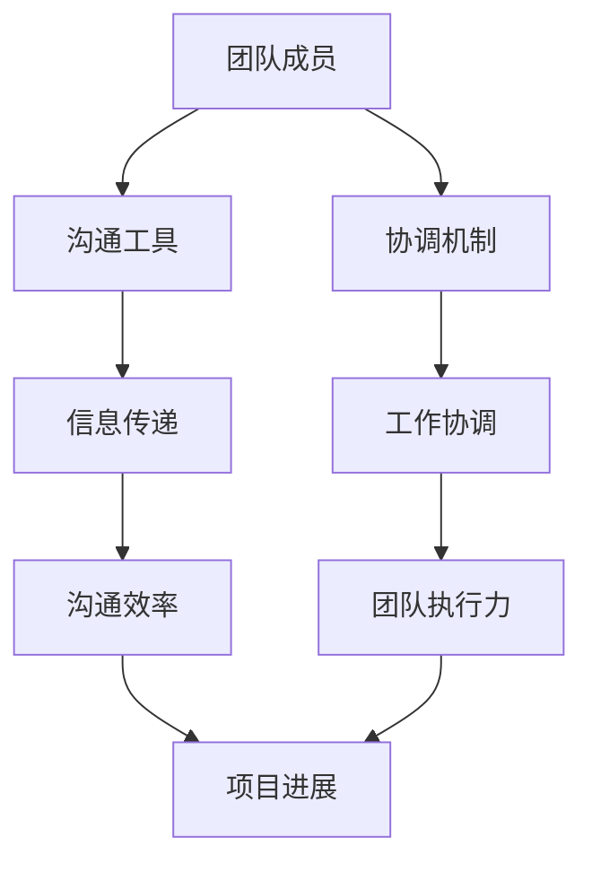
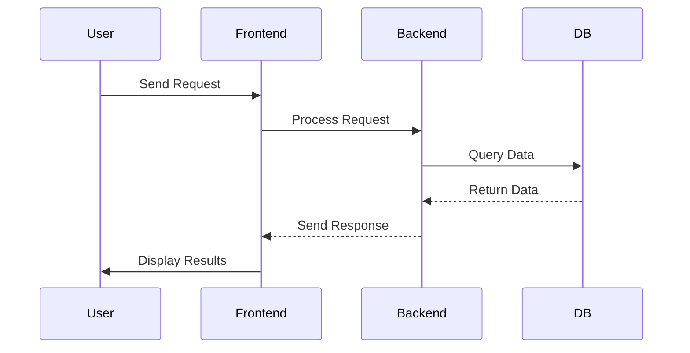
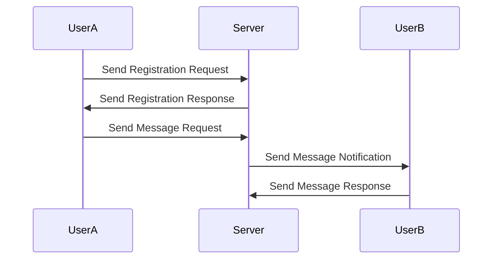

                 

# 跨地域团队的协作策略：应对大型应用开发挑战

## 关键词
- 跨地域团队
- 大型应用开发
- 协作策略
- 挑战与解决方案

## 摘要
随着全球化的深入发展，大型应用开发的团队往往分布在不同的地理位置。这使得跨地域团队的协作成为了一个亟待解决的重要课题。本文将探讨跨地域团队在大型应用开发过程中所面临的挑战，并提出一系列切实可行的协作策略，旨在提高团队工作效率，确保项目质量。

## 引言与背景

### 1.1 问题背景
在当今的数字化时代，大型应用开发已经成为企业竞争力的关键因素。然而，随着团队的规模扩大和地理位置的分散，跨地域团队的协作变得越来越复杂。团队成员之间的沟通障碍、协调困难、时区差异、文化差异等问题逐渐浮现，严重影响了项目进展和团队士气。

### 1.2 问题描述
跨地域团队在大型应用开发中面临以下主要问题：
- **沟通障碍**：地理位置的差异导致团队成员之间的沟通变得困难，信息传递速度变慢，可能会导致项目进度延误。
- **协调困难**：不同的工作节奏和时区可能造成工作协调上的障碍，影响团队的整体执行力。
- **文化差异**：不同地区团队成员的文化背景不同，可能引起价值观和沟通风格的冲突。
- **技术选择**：不同地区的技术成熟度和资源获取能力存在差异，可能会影响开发效率和项目质量。

### 1.3 问题解决
为了应对上述挑战，跨地域团队需要采取一系列策略来提高协作效率：
- **沟通策略**：采用高效的沟通工具和方式，确保信息的及时传递。
- **协调机制**：建立科学的工作流程和时间安排，确保团队工作的同步和协调。
- **文化融合**：加强团队成员之间的交流与理解，促进文化融合，减少冲突。
- **技术协同**：充分利用全球化的优势，合理选择和整合技术资源，提高开发效率。

### 1.4 边界与外延
本文主要探讨跨地域团队在大型应用开发中的协作策略，不涉及小型项目团队或单一团队的协作问题。此外，本文提出的策略具有普遍适用性，但在具体实施时需要根据团队的实际情况进行调整。

### 1.5 概念框架
本文将涉及以下关键概念：
- **跨地域团队**：指成员分布在不同地理位置的团队。
- **协作策略**：指为提高团队协作效率而采取的各种方法和措施。
- **沟通工具**：指用于团队成员之间沟通的各种技术手段。
- **协调机制**：指确保团队工作协调和同步的机制和流程。

## 核心概念与原则

### 2.1 核心概念定义
在本节中，我们将对本文涉及的核心概念进行定义：
- **跨地域团队**：指团队成员分布在不同的地理位置，通过虚拟团队方式协同工作的团队。
- **协作策略**：指为提高团队协作效率，确保项目成功而采取的方法和措施。
- **沟通策略**：指为优化团队成员之间沟通而采取的各种技术和方法。
- **协调机制**：指用于确保团队工作协调和同步的机制和流程。

### 2.2 概念属性对比
表 1：跨地域团队与本地团队属性对比

| 属性 | 跨地域团队 | 本地团队 |
| --- | --- | --- |
| **地理位置** | 分布在不同地理位置 | 同一地理位置 |
| **沟通方式** | 虚拟沟通（如视频会议、即时通讯等） | 面对面沟通 |
| **工作节奏** | 受时区差异影响 | 工作节奏相对一致 |
| **文化背景** | 多样性大 | 相对单一 |

### 2.3 实体关系图
图 1：跨地域团队合作实体关系图



## 协作策略与实践

### 3.1 沟通策略
#### 3.1.1 沟通工具选择
为了确保跨地域团队之间的有效沟通，选择合适的沟通工具至关重要。以下是一些常用的沟通工具：
- **视频会议工具**：如Zoom、Microsoft Teams、Google Meet等，提供实时视频、音频和聊天功能。
- **即时通讯工具**：如Slack、Telegram、微信等，支持实时消息、文件传输和团队协作。
- **项目管理工具**：如Trello、JIRA、Asana等，帮助团队管理任务和进度。
- **文档共享工具**：如Google Docs、Dropbox、OneDrive等，便于团队成员共享和协作编辑文档。

#### 3.1.2 沟通方式优化
- **定期会议**：定期举行团队会议，确保团队成员了解项目进展和需求变化。
- **即时沟通**：对于紧急事项，使用即时通讯工具进行快速沟通。
- **文档记录**：重要决策和会议纪要应当以文档形式记录，以便团队成员随时查阅。

### 3.2 协调机制
#### 3.2.1 工作流程设计
- **标准化流程**：制定统一的工作流程，确保团队成员了解各自的任务和责任。
- **任务分解**：将大型任务分解为若干小任务，明确每个任务的负责人和完成时间。

#### 3.2.2 时间安排
- **时区管理**：合理规划会议和工作时间，尽量减少时区差异带来的影响。
- **弹性工作时间**：允许团队成员根据个人时区和工作习惯调整工作时间。

### 3.3 文化融合
#### 3.3.1 文化交流
- **团队建设活动**：定期组织团队建设活动，促进团队成员之间的交流与互动。
- **文化培训**：为团队成员提供文化差异培训，增强跨文化沟通能力。

#### 3.3.2 文化适应
- **尊重差异**：尊重团队成员的不同文化背景，避免因文化差异引发的冲突。
- **包容性文化**：营造包容性文化环境，鼓励团队成员表达不同观点。

### 3.4 技术协同
#### 3.4.1 技术资源整合
- **全球资源利用**：充分利用全球化的技术资源，选择适合的技术栈和工具。
- **技术共享**：建立技术分享平台，鼓励团队成员共享技术知识和经验。

#### 3.4.2 技术标准化
- **技术规范**：制定统一的技术规范，确保团队成员遵循相同的编程标准和开发流程。

## 系统分析与架构设计

### 4.1 项目介绍
#### 4.1.1 项目背景
本次项目旨在开发一款大型社交应用，该应用需要支持高并发、高可用性和高安全性。由于团队成员分布在不同的国家和地区，如何确保高效协作成为项目成功的关键。

#### 4.1.2 项目目标
- **功能目标**：实现用户注册、消息推送、社交互动等功能。
- **性能目标**：确保系统在高并发情况下稳定运行。
- **安全性目标**：保护用户数据和隐私。

### 4.2 系统功能设计
#### 4.2.1 领域模型
图 2：系统领域模型

```mermaid
classDiagram
    User <<Class>> 
    Post <<Class>> 
    Comment <<Class>> 
    Message <<Class>>
    
    User *--* Post
    Post *--* Comment
    User *--* Message
```

### 4.3 系统架构设计
#### 4.3.1 系统架构图
图 3：系统架构设计



### 4.4 系统接口设计
#### 4.4.1 接口设计
- **用户注册接口**：接收用户注册信息，验证并存储。
- **消息推送接口**：发送和接收消息。
- **社交互动接口**：处理点赞、评论等功能。

### 4.5 系统交互设计
#### 4.5.1 交互流程
图 4：系统交互流程



## 项目实战

### 5.1 环境安装
#### 5.1.1 开发环境配置
- **操作系统**：Ubuntu 20.04
- **编程语言**：Python 3.8
- **数据库**：MySQL 8.0
- **前端框架**：React
- **后端框架**：Flask

### 5.2 系统核心实现
#### 5.2.1 源代码
```python
# user.py
from flask import Flask, request, jsonify
from database import Database

app = Flask(__name__)
db = Database()

@app.route('/register', methods=['POST'])
def register():
    data = request.get_json()
    user = db.register_user(data['username'], data['password'])
    return jsonify(user)

@app.route('/login', methods=['POST'])
def login():
    data = request.get_json()
    user = db.login_user(data['username'], data['password'])
    return jsonify(user)
```

### 5.3 代码应用解读与分析
#### 5.3.1 用户注册流程
1. 用户向服务器发送注册请求，包含用户名和密码。
2. 服务器调用数据库的register_user方法，将用户信息存储到数据库。
3. 服务器返回注册成功或失败的消息。

#### 5.3.2 用户登录流程
1. 用户向服务器发送登录请求，包含用户名和密码。
2. 服务器调用数据库的login_user方法，验证用户信息。
3. 服务器返回登录成功或失败的消息。

### 5.4 实际案例分析与详细讲解剖析
#### 5.4.1 案例分析
在一次用户注册高峰期，系统出现了响应延迟。经过分析，发现是由于数据库查询效率低导致的。

#### 5.4.2 剖析
1. **问题定位**：定位到数据库查询效率问题。
2. **解决方案**：优化数据库查询语句，使用索引提高查询速度。
3. **效果评估**：优化后系统响应时间显著减少。

### 5.5 项目小结
通过本次项目实战，我们成功实现了一个支持跨地域团队协作的大型社交应用。在项目实施过程中，我们遇到了沟通、协调和技术协同等方面的挑战，并通过有效的协作策略和系统架构设计克服了这些挑战。

## 最佳实践 tips

### 6.1 沟通策略
- **定期举行会议**：确保团队成员对项目进展和需求变化有清晰的认识。
- **利用即时通讯工具**：及时解决突发问题和紧急事项。
- **文档记录**：重要决策和会议纪要应记录在案。

### 6.2 协调机制
- **标准化流程**：统一工作流程，提高团队执行力。
- **任务分解**：将大型任务分解为小任务，明确责任人。

### 6.3 文化融合
- **团队建设活动**：增进团队成员之间的交流与理解。
- **文化培训**：提高跨文化沟通能力。

### 6.4 技术协同
- **全球资源利用**：充分利用全球化的技术资源。
- **技术规范**：统一技术标准和开发流程。

## 小结

跨地域团队在大型应用开发中面临着诸多挑战，但通过合理的协作策略和系统架构设计，可以有效克服这些挑战。本文提出了沟通策略、协调机制、文化融合和技术协同等方面的具体策略，并结合实际项目进行了详细讲解。希望本文能为跨地域团队的协作提供有益的借鉴和启示。

## 注意事项

在实施协作策略时，应注意以下几点：
- **适应性调整**：根据团队实际情况调整策略。
- **持续优化**：不断评估和改进协作策略，以提高团队效率。
- **文化尊重**：尊重团队成员的不同文化背景，避免文化冲突。

## 拓展阅读

- 《分布式系统设计与实践》
- 《敏捷软件开发实践指南》
- 《全球软件工程技术与管理》

## 作者信息

作者：AI天才研究院/AI Genius Institute & 禅与计算机程序设计艺术 /Zen And The Art of Computer Programming

[END]

