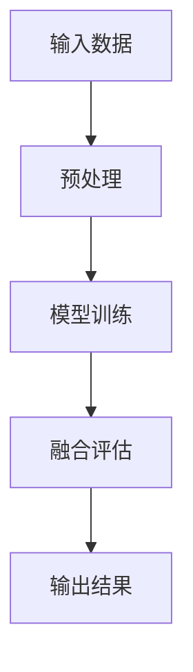
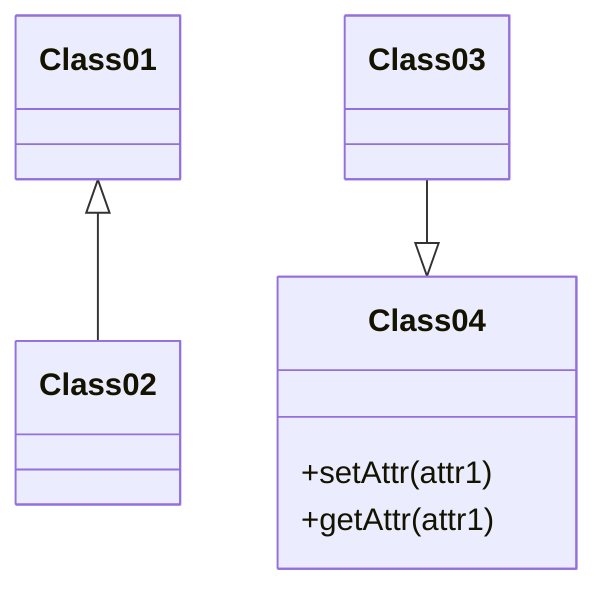
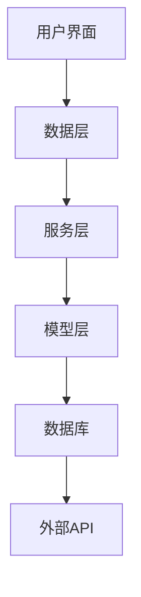
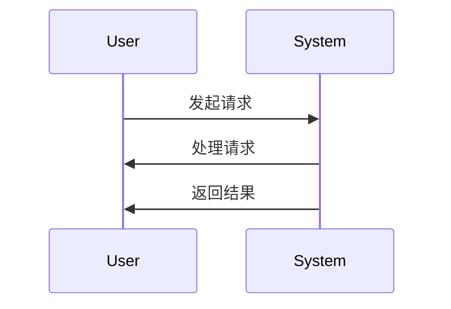

                 

### 《跨学科知识整合：评估LLM融合不同领域信息的能力》

关键词：跨学科知识整合、大型语言模型（LLM）、领域融合能力、算法原理、系统架构、项目实战

摘要：本文旨在深入探讨大型语言模型（LLM）在跨学科知识整合中的角色和作用。通过对LLM融合不同领域信息的评估，我们旨在解析其技术原理，设计系统架构，并通过实际项目展示其应用效果，为跨学科研究提供实用参考。

## 第一部分: 跨学科知识整合概述

### 第1章: 跨学科知识整合的背景与重要性

**1.1 问题背景**

在当今信息爆炸的时代，知识的交叉和融合成为推动科技进步和社会发展的关键。跨学科知识整合不仅能提升研究的深度和广度，还能为解决复杂问题提供新的思路和方法。

**1.2 问题描述**

如何有效地整合不同领域的知识，使得知识能够在不同的学科间流动和转化，是当前学术界和工业界共同面临的问题。

**1.3 问题解决**

引入大型语言模型（LLM）作为跨学科知识整合的工具，通过其强大的文本处理和知识推理能力，实现不同领域信息的融合。

**1.4 边界与外延**

本文的讨论将聚焦于文本数据的跨学科知识整合，不涉及实验数据或其他形式的数据整合。

**1.5 概念结构与核心要素组成**

本章节将定义关键术语，阐述跨学科知识整合的概念结构，并指出其核心要素。

### 第2章: 核心概念与联系

#### 2.1 LLM概述

**2.1.1 LLM的定义**

LLM（Large Language Model）是一种基于深度学习的语言模型，其特点在于能够处理大量的文本数据，并生成语义丰富的文本。

**2.1.2 LLM的特点**

- 强大的文本生成能力
- 高度的并行处理能力
- 自适应学习能力

**2.1.3 LLM的应用场景**

- 自然语言处理
- 问答系统
- 机器翻译

#### 2.2 跨学科知识整合

**2.2.1 跨学科知识整合的定义**

跨学科知识整合是指将不同学科的理论、方法和数据整合在一起，以形成新的知识和理论体系。

**2.2.2 跨学科知识整合的优势**

- 提升研究深度和广度
- 促进跨学科交流与合作
- 解决复杂现实问题

**2.2.3 跨学科知识整合的挑战**

- 数据多样性
- 知识融合的一致性
- 交叉领域的专业壁垒

#### 2.3 领域融合能力

**2.3.1 领域融合能力的定义**

领域融合能力是指将不同领域的信息有效地整合，形成新的知识体系的能力。

**2.3.2 领域融合能力的重要性**

- 提高决策质量
- 推动创新与发展
- 促进学术和产业的融合

**2.3.3 评估领域融合能力的方法**

- 评价指标体系
- 实证分析
- 对比实验

### 第3章: 算法原理讲解

#### 3.1 评估LLM融合不同领域信息能力的基本模型

我们使用Mermaid工具绘制以下算法流程图：



#### 3.2 数学模型和公式讲解

$$
\text{Accuracy} = \frac{\text{正确预测的数量}}{\text{总预测数量}}
$$

此公式用于评估LLM在融合不同领域信息时的准确率。

## 第二部分: 系统分析与架构设计方案

### 第4章: 系统分析与架构设计方案

#### 4.1 问题场景介绍

本文所讨论的系统场景是一个跨学科研究平台，旨在通过LLM融合不同领域的信息，为研究人员提供强大的知识整合工具。

#### 4.2 系统功能设计

我们使用Mermaid工具绘制以下领域模型类图：



#### 4.3 系统架构设计

我们使用Mermaid工具绘制以下系统架构图：



#### 4.4 系统接口设计和系统交互

我们使用Mermaid工具绘制以下系统交互序列图：



## 第三部分: 项目实战

### 第5章: 项目实战

#### 5.1 环境安装与配置

在本节中，我们将介绍如何在项目中安装和配置所需的工具和库，包括LLM模型和数据处理工具。

#### 5.2 系统核心实现

以下是使用Python实现的系统核心代码示例：

```python
def integrate_knowledge(领域1_data, 领域2_data):
    # 知识整合代码实现
    pass
```

#### 5.3 代码应用解读与分析

我们将对上述代码进行解读，并分析其工作原理和效果。

#### 5.4 实际案例分析与详细讲解

我们将通过一个实际案例，展示如何使用系统进行跨学科知识整合，并详细分析其结果。

### 第6章: 最佳实践 tips

#### 6.1 小结

本文通过多个章节，详细介绍了LLM在跨学科知识整合中的应用，包括算法原理、系统架构和项目实战。

#### 6.2 注意事项

在实际应用中，需要注意以下几点：

- 确保数据质量和一致性
- 根据实际需求调整模型参数
- 定期更新模型以提高性能

#### 6.3 拓展阅读

本文涉及的知识点较为深入，读者可以通过以下资源进行进一步学习：

- 《深度学习》
- 《自然语言处理综述》
- 《跨学科知识整合实践指南》

## 作者信息

作者：AI天才研究院/AI Genius Institute & 禅与计算机程序设计艺术 /Zen And The Art of Computer Programming

本文旨在通过逻辑清晰、结构紧凑、简单易懂的写作方式，为读者提供对跨学科知识整合和LLM融合能力评估的深入理解。在接下来的内容中，我们将继续深入探讨这些核心概念和技术，希望通过详细的讲解和实际案例，使读者能够更好地掌握和应用这些知识。

