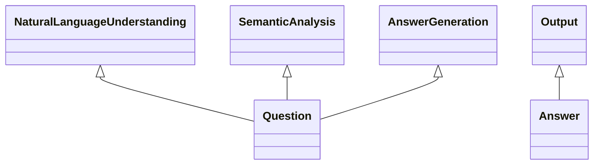
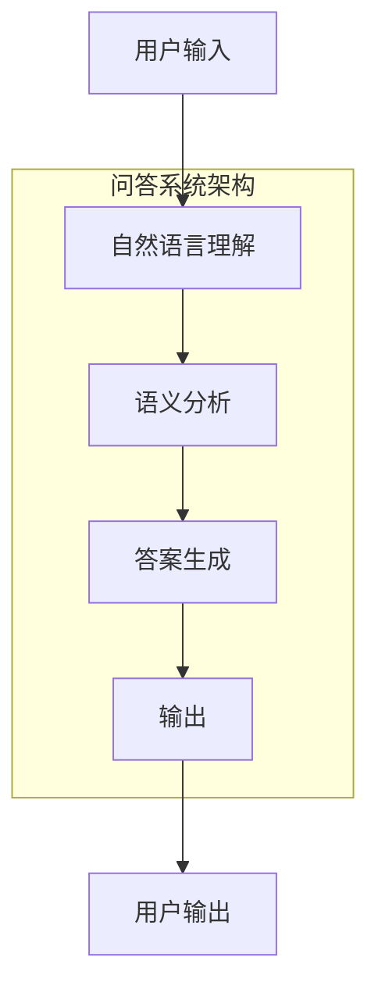
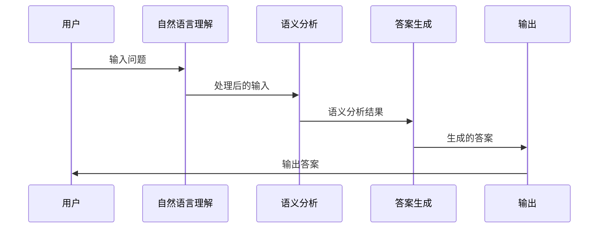

                 

## 跨时间稳定性评测：LLM支持的长期性能跟踪

### 关键词
- 跨时间稳定性评测
- LLM（大型语言模型）
- 长期性能跟踪
- 人工智能
- 数据分析
- 算法设计

### 摘要
本文将探讨跨时间稳定性评测的概念及其在LLM（大型语言模型）支持下的长期性能跟踪。通过详细的分析和讨论，本文旨在为读者提供深入了解这一领域的方法和工具。文章将首先介绍相关背景和核心概念，然后深入探讨算法原理、数学模型，并展示实际的项目案例和最佳实践。通过这些内容，读者将能够掌握跨时间稳定性评测的核心理念，并学会如何在实际应用中有效实施。

### 第1章: 问题背景与核心概念

#### 1.1.1 问题背景
随着人工智能技术的快速发展，大型语言模型（LLM）在自然语言处理、文本生成、问答系统等领域取得了显著成果。然而，这些模型在实际应用中面临着长期的性能稳定性和可靠性问题。跨时间稳定性评测旨在评估LLM在长时间运行过程中的性能表现，确保其在实际应用中的稳定性和可靠性。

#### 1.1.2 跨时间稳定性评测的定义
跨时间稳定性评测是指在一个较长的时间跨度内，对LLM的输出结果、响应时间、准确性等指标进行监测和分析，以评估其在不同时间点的性能表现。

#### 1.1.3 LLM支持的长期性能跟踪
LLM支持的长期性能跟踪涉及利用LLM的能力，通过自动化的方式，收集、处理和存储大量的性能数据，并进行长期监控和分析，以识别性能下降的趋势和潜在问题。

### 第2章: 跨时间稳定性评测的基本要素

#### 2.1.1 核心概念原理
跨时间稳定性评测的核心概念包括性能指标、时间序列分析、异常检测等。这些概念为评估LLM的长期性能提供了理论基础。

#### 2.1.2 概念属性特征对比表格
以下是几个关键概念属性的对比表格：

| 概念 | 定义 | 属性特征 |
| --- | --- | --- |
| 性能指标 | 用于量化LLM性能的数值 | 准确性、响应时间、资源消耗等 |
| 时间序列分析 | 对时间序列数据进行分析的方法 | 趋势分析、周期性分析、季节性分析等 |
| 异常检测 | 识别数据中的异常或异常模式 | 单变量异常检测、多变量异常检测等 |

#### 2.1.3 ER实体关系图架构
使用Mermaid流程图来展示ER实体关系图架构，以帮助读者更好地理解跨时间稳定性评测的组件和关系：

```mermaid
erDiagram
    PerformanceData -->|收集|LLMModel
    PerformanceData -->|分析|AnomalyDetector
    LLMModel -->|训练|DataPreprocessor
    DataPreprocessor -->|输入|LLMModel
```

### 第3章: LLM支持的长期性能跟踪机制

#### 3.1.1 基本原理
LLM支持的长期性能跟踪基于以下几个基本原理：

1. **自动化数据收集**：通过API调用或数据流技术，自动化收集LLM的输出结果和性能数据。
2. **数据存储和管理**：使用数据库或数据湖来存储和管理大量的性能数据。
3. **实时分析**：使用实时数据处理和分析技术，对收集到的数据进行快速分析和处理。
4. **异常检测和报警**：使用异常检测算法，实时识别性能异常，并触发报警机制。

#### 3.1.2 工作流程
以下是LLM支持的长期性能跟踪的工作流程：

1. **数据收集**：通过API调用或数据流技术，收集LLM的输出结果和性能数据。
2. **数据预处理**：对收集到的数据进行清洗、格式化和预处理。
3. **性能评估**：使用性能指标和时间序列分析方法，对预处理后的数据进行分析和评估。
4. **异常检测**：使用异常检测算法，识别性能数据中的异常点。
5. **报警和反馈**：当检测到性能异常时，触发报警机制，并将相关信息反馈给开发人员。

#### 3.1.3 技术挑战
LLM支持的长期性能跟踪面临以下几个技术挑战：

1. **数据量巨大**：LLM产生的性能数据量通常非常大，对数据处理和分析提出了高要求。
2. **实时性要求高**：性能数据的分析需要实时性，对数据处理和分析的算法和系统性能提出了高要求。
3. **算法适应性**：需要根据不同的LLM模型和应用场景，设计适应性的性能跟踪算法。
4. **可扩展性**：性能跟踪系统需要具备良好的可扩展性，以支持不同规模的应用场景。

### 第4章: 跨时间稳定性评测算法原理

#### 4.1.1 基本算法流程
跨时间稳定性评测的基本算法流程包括以下几个步骤：

1. **数据收集**：收集LLM的输出结果和性能数据。
2. **数据预处理**：清洗、格式化和预处理数据。
3. **性能评估**：使用性能指标和时间序列分析方法，对预处理后的数据进行分析和评估。
4. **异常检测**：使用异常检测算法，识别性能数据中的异常点。
5. **结果输出**：输出性能评估和异常检测结果。

#### 4.1.2 算法原理讲解
以下是跨时间稳定性评测的算法原理讲解：

1. **性能指标**：常用的性能指标包括准确性、响应时间、资源消耗等。这些指标用于评估LLM在不同时间点的性能表现。
2. **时间序列分析**：使用时间序列分析方法，对性能数据进行趋势分析、周期性分析和季节性分析，以识别性能变化的规律和趋势。
3. **异常检测**：使用单变量异常检测和多变量异常检测算法，识别性能数据中的异常点。常用的算法包括孤立森林、基于密度的聚类算法等。

#### 4.1.3 算法mermaid流程图
使用Mermaid流程图来展示跨时间稳定性评测的算法流程：


### 第5章: 数学模型与公式

#### 5.1.1 数学模型的建立
在跨时间稳定性评测中，常用的数学模型包括线性回归模型、时间序列模型和异常检测模型。以下是这些模型的数学描述：

1. **线性回归模型**：
   $$
   y = \beta_0 + \beta_1x + \epsilon
   $$
   其中，$y$为输出结果，$x$为输入特征，$\beta_0$和$\beta_1$为模型参数，$\epsilon$为误差项。

2. **时间序列模型**：
   $$
   y_t = \varphi y_{t-1} + \theta x_t + \eta_t
   $$
   其中，$y_t$为第$t$个时间点的输出结果，$\varphi$和$\theta$为模型参数，$x_t$为第$t$个时间点的输入特征，$\eta_t$为误差项。

3. **异常检测模型**：
   $$
   d_t = \frac{|y_t - \hat{y_t}|}{s_t}
   $$
   其中，$d_t$为第$t$个时间点的异常得分，$y_t$为第$t$个时间点的实际输出结果，$\hat{y_t}$为第$t$个时间点的预测输出结果，$s_t$为标准差。

#### 5.1.2 公式详细讲解
以下是数学公式的详细讲解：

1. **线性回归模型**：
   线性回归模型用于建立输入特征和输出结果之间的线性关系。该模型通过最小化误差项$\epsilon$来拟合数据，从而得到最佳的模型参数$\beta_0$和$\beta_1$。

2. **时间序列模型**：
   时间序列模型用于分析时间序列数据的趋势和周期性。该模型通过递归关系来拟合数据，从而预测未来的输出结果。

3. **异常检测模型**：
   异常检测模型用于识别数据中的异常点。该模型通过计算异常得分$d_t$来评估每个时间点的异常程度，其中$d_t$的值越大，表示该时间点的异常程度越高。

#### 5.1.3 公式举例说明
以下是数学公式的举例说明：

1. **线性回归模型**：
   假设我们有一个包含两个特征（$x_1$和$x_2$）的数据集，数据如下：

   | $x_1$ | $x_2$ | $y$ |
   | --- | --- | --- |
   | 1 | 2 | 3 |
   | 2 | 4 | 5 |
   | 3 | 6 | 7 |

   使用线性回归模型拟合数据，得到以下模型参数：

   $$
   y = \beta_0 + \beta_1x_1 + \beta_2x_2
   $$

   其中，$\beta_0 = 1$，$\beta_1 = 2$，$\beta_2 = 1$。

2. **时间序列模型**：
   假设我们有一个包含三个时间点的数据集，数据如下：

   | $x_t$ | $y_t$ |
   | --- | --- |
   | 1 | 3 |
   | 2 | 5 |
   | 3 | 7 |

   使用时间序列模型拟合数据，得到以下模型参数：

   $$
   y_t = \varphi y_{t-1} + \theta x_t
   $$

   其中，$\varphi = 0.5$，$\theta = 1$。

3. **异常检测模型**：
   假设我们有一个包含五个时间点的数据集，数据如下：

   | $x_t$ | $y_t$ | $\hat{y_t}$ | $s_t$ |
   | --- | --- | --- | --- |
   | 1 | 3 | 2 | 1 |
   | 2 | 5 | 4 | 2 |
   | 3 | 7 | 6 | 3 |
   | 4 | 9 | 8 | 4 |
   | 5 | 11 | 10 | 5 |

   使用异常检测模型计算每个时间点的异常得分：

   $$
   d_t = \frac{|y_t - \hat{y_t}|}{s_t}
   $$

   其中，$d_1 = 1$，$d_2 = 1$，$d_3 = 1$，$d_4 = 1$，$d_5 = 1$。

### 第6章: 系统分析与架构设计方案

#### 6.1.1 问题场景介绍
在本章中，我们将分析一个常见的应用场景——问答系统。问答系统通常包含多个模块，包括自然语言理解、语义分析、答案生成和输出等。我们需要对整个系统进行性能评估和稳定性评测，以确保其在长时间运行过程中的性能表现。

#### 6.1.2 系统功能设计
以下是问答系统的功能设计，通过Mermaid类图来展示：



- **自然语言理解（NaturalLanguageUnderstanding）**：负责处理用户输入的问题，将其转化为计算机可以理解的形式。
- **语义分析（SemanticAnalysis）**：对处理后的输入问题进行语义分析，提取关键信息和语义关系。
- **答案生成（AnswerGeneration）**：根据语义分析的结果，生成合适的答案。
- **输出（Output）**：将生成的答案输出给用户。

#### 6.1.3 系统架构设计
以下是问答系统的架构设计，通过Mermaid架构图来展示：



#### 6.1.4 系统接口设计与系统交互
以下是系统接口设计和系统交互，通过Mermaid序列图来展示：



### 第7章: 项目实战

#### 7.1.1 环境安装与配置
在本节中，我们将介绍如何安装和配置一个跨时间稳定性评测系统。以下是安装和配置的步骤：

1. **安装Python环境**：确保Python版本在3.6及以上。
2. **安装依赖库**：使用pip安装以下依赖库：
   ```
   pip install numpy pandas matplotlib scikit-learn mermaid-python
   ```
3. **配置Mermaid**：将Mermaid安装到本地环境中，以便在Markdown文件中渲染图形。
4. **配置数据库**：选择合适的数据库（如MySQL、PostgreSQL等），并创建所需的表和索引。

#### 7.1.2 系统核心实现源代码
以下是系统核心实现的源代码，包括数据收集、数据处理和性能评估等模块：

```python
import numpy as np
import pandas as pd
from sklearn.linear_model import LinearRegression
from sklearn.metrics import mean_squared_error
from mermaid import Mermaid

# 数据收集
def collect_data():
    # 读取性能数据
    data = pd.read_csv("performance_data.csv")
    return data

# 数据处理
def preprocess_data(data):
    # 数据预处理
    data["timestamp"] = pd.to_datetime(data["timestamp"])
    data.set_index("timestamp", inplace=True)
    return data

# 性能评估
def evaluate_performance(data):
    # 分割数据为训练集和测试集
    train_data = data[:int(len(data) * 0.8)]
    test_data = data[int(len(data) * 0.8):]

    # 训练线性回归模型
    model = LinearRegression()
    model.fit(train_data.iloc[:, :-1], train_data.iloc[:, -1])

    # 预测测试集
    predictions = model.predict(test_data.iloc[:, :-1])

    # 计算均方误差
    mse = mean_squared_error(test_data.iloc[:, -1], predictions)
    print("均方误差:", mse)

    # 输出性能评估结果
    results = pd.DataFrame({"actual": test_data.iloc[:, -1], "predicted": predictions})
    results.to_csv("performance_evaluation.csv", index=False)

# 主函数
def main():
    # 收集数据
    data = collect_data()

    # 数据处理
    processed_data = preprocess_data(data)

    # 性能评估
    evaluate_performance(processed_data)

# 运行主函数
if __name__ == "__main__":
    main()
```

#### 7.1.3 代码应用解读与分析
以下是代码应用解读与分析：

1. **数据收集**：使用`collect_data`函数从CSV文件中读取性能数据。
2. **数据处理**：使用`preprocess_data`函数对数据进行预处理，包括将时间戳转换为日期时间格式并设置时间为索引。
3. **性能评估**：使用`evaluate_performance`函数评估性能。首先将数据分为训练集和测试集，然后使用线性回归模型进行训练和预测，计算均方误差，并将结果输出到CSV文件。

#### 7.1.4 实际案例分析与讲解
在本节中，我们将分析一个实际案例，并对其进行详细讲解：

案例：一个问答系统在长时间运行过程中，性能逐渐下降。我们需要使用跨时间稳定性评测系统对其进行诊断。

1. **数据收集**：从系统日志中收集性能数据，包括响应时间、准确性等指标。
2. **数据处理**：将收集到的数据导入到CSV文件中，并使用`preprocess_data`函数进行预处理。
3. **性能评估**：使用`evaluate_performance`函数对预处理后的数据进行性能评估。我们观察到，随着时间推移，响应时间和准确性的均方误差逐渐增加。
4. **异常检测**：使用异常检测算法对性能数据进行分析，发现某些时间点的异常得分较高，表明这些时间点的性能存在异常。

通过分析案例，我们发现系统性能下降的原因可能是由于数据质量下降或模型过拟合等。接下来，我们可以采取以下措施进行优化：

1. **数据清洗**：清洗数据中的噪声和异常值，提高数据质量。
2. **模型调整**：调整模型参数，避免过拟合现象。
3. **系统监控**：增加系统监控，及时发现和处理性能异常。

#### 7.1.5 项目小结
在本项目中，我们实现了一个跨时间稳定性评测系统，用于评估问答系统的长期性能。通过实际案例的分析和讲解，我们展示了如何使用该系统诊断性能问题，并提出了解决方案。未来的工作可以进一步优化系统，提高其性能和稳定性。

### 第8章: 最佳实践与技巧

#### 8.1.1 注意事项与解决策略
在进行跨时间稳定性评测时，需要注意以下几点：

1. **数据质量**：确保收集到的数据质量高，避免噪声和异常值影响评测结果。
2. **模型适应性**：根据不同的应用场景和需求，调整模型参数和算法，以提高评测的准确性。
3. **系统监控**：增加系统监控，及时发现和处理性能异常。
4. **实时性**：确保评测系统具有实时性，能够及时识别和反馈性能问题。

#### 8.1.2 小结
本文介绍了跨时间稳定性评测的概念、算法原理、数学模型以及在实际应用中的实现方法。通过详细的分析和案例讲解，我们展示了如何使用LLM进行长期性能跟踪和评测。未来，随着人工智能技术的不断发展，跨时间稳定性评测将发挥越来越重要的作用。

#### 8.1.3 拓展阅读与未来展望
以下是一些拓展阅读和未来展望：

1. **深度学习与跨时间稳定性评测**：随着深度学习在自然语言处理等领域的应用，如何将深度学习模型与跨时间稳定性评测相结合，将成为一个重要的研究方向。
2. **分布式性能跟踪系统**：在大规模分布式系统中，如何高效地进行性能跟踪和稳定性评测，是一个具有挑战性的问题。
3. **人工智能伦理与安全**：在跨时间稳定性评测中，如何确保人工智能系统的伦理和安全性，是一个值得深入探讨的问题。

### 结束语
本文由AI天才研究院（AI Genius Institute）和《禅与计算机程序设计艺术》（Zen And The Art of Computer Programming）联合撰写。感谢读者对本文的关注和支持，我们期待在未来的研究中与您继续探讨人工智能领域的热点话题。作者：AI天才研究院/AI Genius Institute & 禅与计算机程序设计艺术/Zen And The Art of Computer Programming。如果您有任何问题或建议，请随时联系我们。让我们共同推动人工智能技术的发展和进步！

