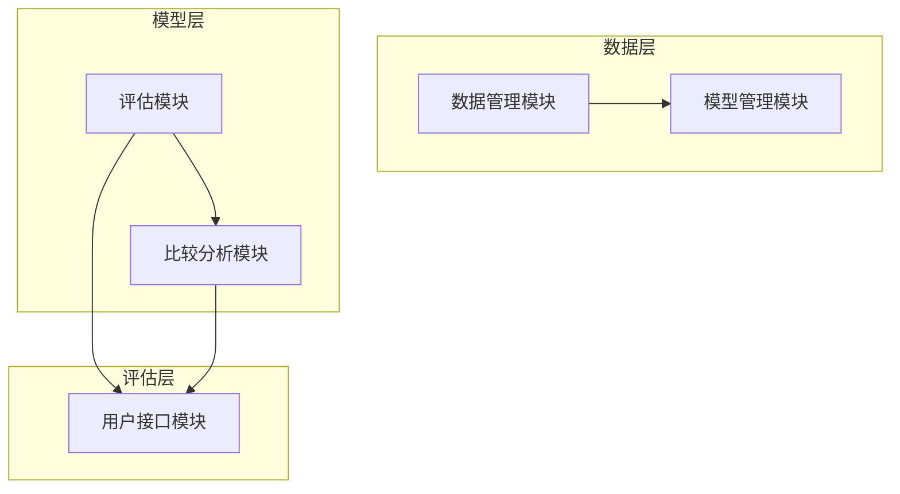

                 

## 跨模型比较评测：LLM支持的标准化对比框架

### 关键词
- 跨模型比较评测
- 人工智能模型
- 标准化对比框架
- LLM（大型语言模型）
- 性能评估
- 评估指标

### 摘要
本文将探讨跨模型比较评测（Cross-Model Comparative Evaluation）的概念及其在人工智能（AI）领域的重要性。特别是，本文将聚焦于LLM（Large Language Model）支持的标准化对比框架，详细介绍其背景、核心概念、挑战与机遇、发展历程、评估方法以及实际应用。通过一步步的分析推理，本文旨在为研究人员和开发者提供一套清晰、有效的跨模型评测框架，以促进人工智能技术的创新与应用。

---

### 1.1 背景介绍：核心概念

#### 问题背景

跨模型比较评测（Cross-Model Comparative Evaluation）是指在不同的人工智能模型之间进行性能比较和评估的过程。随着深度学习技术的迅猛发展，大量高性能模型被提出并应用于不同的任务中，如何选择最适合的模型成为了一个关键问题。而跨模型比较评测正是为了解决这一问题提供了一套标准化的方法和框架。

#### 问题描述

跨模型比较评测旨在通过对不同模型在同一任务上的性能进行客观、公正的评估，从而帮助研究人员和开发者了解各个模型的优势和劣势，进而做出更为合理的模型选择。然而，由于不同模型的设计理念、应用场景和技术实现上的差异，使得跨模型比较评测面临诸多挑战。

#### 问题解决

为了解决跨模型比较评测中的问题，研究者们提出了一系列标准化对比框架，这些框架通过定义统一的评估指标、优化评估过程，以及提供有效的比较方法，为模型的性能评估提供了可靠的依据。

#### 边界与外延

跨模型比较评测不仅限于同一种类任务的不同模型，还可以应用于不同类型任务之间的模型比较。同时，这一概念也不仅限于深度学习模型，还可以扩展到其他类型的人工智能模型，如传统的机器学习算法、强化学习算法等。

#### 概念结构与核心要素组成

跨模型比较评测的核心要素包括：
1. **评估指标**：用于量化模型性能的指标，如准确率、召回率、F1分数等。
2. **评估数据集**：用于训练和评估模型的统一数据集，确保不同模型在相同的数据集上进行比较。
3. **比较方法**：用于分析不同模型性能差异的方法，如基于统计学的T检验、方差分析等。
4. **标准化流程**：确保评估过程具有一致性和可重复性的标准化流程。

### 1.2 核心概念与联系

#### AI大模型简介

AI大模型（Large-scale AI Model）是指参数量巨大、计算复杂度高的深度学习模型，如GPT、BERT等。这些模型通过在大型数据集上训练，能够捕捉到丰富的语言结构和语义信息，从而在自然语言处理、计算机视觉等任务上表现出色。

#### 跨模型比较评测与AI大模型的关系

跨模型比较评测与AI大模型密切相关。一方面，AI大模型的出现为跨模型比较评测提供了丰富的对象；另一方面，跨模型比较评测的结果有助于AI大模型的发展，指导模型的优化和改进。

### 1.3 跨模型比较评测的挑战与机遇

#### 挑战

1. **性能差异**：不同模型在不同任务上的性能表现可能差异较大，如何进行公正、客观的比较是一个挑战。
2. **数据集差异**：不同模型可能使用不同的数据集进行训练，数据集的差异可能会影响评估结果的公平性。
3. **计算资源**：跨模型比较评测通常需要大量的计算资源，尤其是对于AI大模型，计算资源的限制是一个重要问题。

#### 机遇

1. **模型优化**：通过跨模型比较评测，可以发现模型在不同任务上的优势和劣势，从而指导模型的优化和改进。
2. **应用推广**：跨模型比较评测有助于研究人员和开发者更好地了解不同模型的应用场景，促进AI技术的广泛推广和应用。

## 1.4 跨模型比较评测的发展历程与现状

#### 发展历程

1. **初期探索**：随着深度学习技术的发展，跨模型比较评测的概念开始出现，研究者们开始尝试在不同模型之间进行性能比较。
2. **标准化框架**：随着研究的深入，研究者们提出了多种标准化对比框架，如GLUE、SuperGLUE等，这些框架为跨模型比较评测提供了统一的评估标准。
3. **应用扩展**：跨模型比较评测的应用领域不断扩大，从最初的自然语言处理扩展到计算机视觉、语音识别等领域。

#### 现状

1. **成熟度**：跨模型比较评测已经成为人工智能领域中的一个重要研究方向，许多机构和公司都在积极研究和应用。
2. **数据集多样化**：随着研究的深入，越来越多的数据集被用于跨模型比较评测，为模型的评估提供了更多的选择。
3. **算法创新**：研究者们不断提出新的算法和方法，以解决跨模型比较评测中的挑战，提高评估的准确性和可靠性。

### 1.5 跨模型比较评测的方法

#### 基于统计学的比较方法

1. **T检验**：用于比较两组模型在某个任务上的性能差异。
2. **方差分析（ANOVA）**：用于比较多个模型在多个任务上的性能差异。
3. **效应大小**：用于评估模型性能差异的实际意义，通常用 Cohen's d 或 Hedges' g 来衡量。

#### 基于信息的比较方法

1. **互信息**：用于评估两个模型在某个任务上的相关性。
2. **一致性指标**：用于评估多个模型在多个任务上的共识程度，如F-measure。

---

在接下来的章节中，我们将详细探讨跨模型比较评测的核心概念、挑战与机遇、发展历程、评估方法以及实际应用，帮助读者更好地理解和掌握这一重要技术。我们将使用逻辑清晰、结构紧凑、简单易懂的专业技术语言，逐步分析推理，深入探讨跨模型比较评测的各个方面。

---

## 1.6 核心概念与联系

### AI大模型简介

AI大模型（Large-scale AI Model），即具有巨大参数量和计算复杂度的深度学习模型，如GPT、BERT等。这些模型通过在庞大的数据集上训练，能够捕捉到丰富的语言结构和语义信息，从而在自然语言处理（NLP）、计算机视觉（CV）等任务上表现出色。AI大模型的兴起，标志着深度学习技术进入了一个全新的阶段，对人工智能的发展产生了深远的影响。

### 跨模型比较评测与AI大模型的关系

跨模型比较评测（Cross-Model Comparative Evaluation）与AI大模型（Large-scale AI Model）之间存在密切的联系。一方面，AI大模型的出现为跨模型比较评测提供了丰富的比较对象，使得评测的复杂性和多样性大大增加。另一方面，跨模型比较评测的结果有助于AI大模型的发展，通过分析不同模型的性能，可以指导模型的优化和改进，推动AI技术的进步。

### 跨模型比较评测的核心理念

跨模型比较评测的核心在于通过对不同人工智能模型在同一任务上的性能进行公正、客观的评估，帮助研究人员和开发者选择最适合的模型，并进行进一步的优化和改进。这一过程涉及到多个方面，包括评估指标、评估数据集、比较方法以及标准化流程等。

### 核心概念与联系

为了更好地理解跨模型比较评测的核心理念，我们可以从以下几个方面进行分析：

#### 评估指标

评估指标是跨模型比较评测的基础，用于量化模型的性能。常见的评估指标包括准确率、召回率、F1分数、ROC曲线下的面积（AUC）等。这些指标在不同的任务和应用场景中具有不同的重要性和适用性。例如，在分类任务中，准确率和F1分数通常是最常用的指标；而在二分类问题中，ROC曲线和AUC则更为重要。

#### 评估数据集

评估数据集是跨模型比较评测的关键，它需要确保不同模型在相同的数据集上进行比较，以保证评估的公平性和一致性。常用的评估数据集包括公开的基准数据集和自定义的数据集。公开的基准数据集如ImageNet、COCO、GLUE等，为不同模型之间的性能比较提供了统一的基准；而自定义的数据集则可以根据特定的应用场景进行设计，以满足特殊需求。

#### 比较方法

比较方法是跨模型比较评测的核心，用于分析不同模型在相同任务上的性能差异。常见的比较方法包括基于统计学的T检验、方差分析（ANOVA）、效应大小（如Cohen's d）等。此外，还有基于信息的比较方法，如互信息、一致性指标等。这些方法可以提供定量和定性的分析结果，帮助研究者更全面地了解不同模型的表现。

#### 标准化流程

标准化流程是确保跨模型比较评测过程具有一致性和可重复性的关键。一个完善的标准化流程应包括数据预处理、模型训练、评估指标选择、结果分析等各个环节。通过标准化流程，可以减少评估过程中的人为误差，提高评估的可靠性和有效性。

#### AI大模型与跨模型比较评测的联系

AI大模型与跨模型比较评测之间的联系主要体现在以下几个方面：

1. **模型选择**：AI大模型的涌现为跨模型比较评测提供了丰富的比较对象，使得研究人员和开发者可以在更多的模型中进行选择，找到最适合特定任务和需求的模型。

2. **性能评估**：AI大模型的性能评估需要基于跨模型比较评测的方法，通过与其他模型的对比，了解其在不同任务上的优势和劣势，从而指导进一步的优化和改进。

3. **技术发展**：跨模型比较评测的深入研究和应用，有助于推动AI大模型技术的发展，通过分析不同模型的性能和优缺点，可以为模型的改进提供有益的参考。

4. **应用推广**：跨模型比较评测的结果有助于AI大模型在不同领域和场景中的推广和应用，促进人工智能技术的普及和发展。

综上所述，跨模型比较评测与AI大模型之间存在紧密的联系，通过跨模型比较评测，可以更全面地了解AI大模型的表现和潜力，推动人工智能技术的创新与应用。

### 1.7 跨模型比较评测的挑战与机遇

#### 挑战

1. **性能差异**：不同模型在不同任务上的性能表现可能存在较大差异，这给跨模型比较评测带来了挑战。如何确保比较的公平性和准确性，是一个亟待解决的问题。

2. **数据集差异**：不同模型可能使用不同的数据集进行训练，这可能导致评估结果的差异。如何选择合适的评估数据集，保证比较的公平性和一致性，是跨模型比较评测面临的另一个挑战。

3. **计算资源**：跨模型比较评测通常需要大量的计算资源，尤其是对于复杂的AI大模型，计算资源的限制可能会影响评估的全面性和深度。

4. **评估复杂性**：不同模型的评估方法可能各不相同，如何设计一个统一的评估框架，使得不同模型可以在同一标准下进行比较，是一个技术难题。

#### 机遇

1. **模型优化**：通过跨模型比较评测，可以深入了解不同模型在各类任务中的表现，从而指导模型的优化和改进，提高模型的性能和适用性。

2. **应用推广**：跨模型比较评测有助于研究人员和开发者更好地了解不同模型的应用场景和优势，促进AI技术在不同领域的广泛推广和应用。

3. **技术创新**：跨模型比较评测的深入研究和实践，可以推动评估算法、评估指标、评估流程等方面的技术创新，为AI技术的发展提供新的思路和方法。

4. **行业合作**：跨模型比较评测需要多个机构和团队的协作，这有助于推动AI领域的行业合作，促进技术的交流与共享，共同推动AI技术的发展。

### 1.8 跨模型比较评测的发展历程与现状

#### 发展历程

跨模型比较评测的发展历程可以分为以下几个阶段：

1. **初期探索**：随着深度学习技术的兴起，研究人员开始尝试在不同模型之间进行性能比较。这一阶段主要集中在基本评估指标的设计和验证。

2. **标准化框架**：为了解决不同模型评估标准不统一的问题，研究者们提出了多个标准化评估框架，如GLUE、SuperGLUE等。这些框架为跨模型比较评测提供了统一的评估标准，使得评估结果更具可比性和可靠性。

3. **应用扩展**：跨模型比较评测的应用领域逐渐扩大，从最初的NLP任务扩展到计算机视觉、语音识别等多个领域。随着评估数据集的丰富和评估方法的改进，跨模型比较评测的覆盖面和深度不断增加。

4. **算法创新**：为了应对评估过程中面临的挑战，研究者们不断提出新的评估算法和方法，如基于统计学的T检验、基于信息的互信息等。这些算法和方法提高了评估的准确性和可靠性，为跨模型比较评测提供了更有效的工具。

#### 现状

当前，跨模型比较评测在人工智能领域已经取得了显著的进展，主要表现在以下几个方面：

1. **成熟度**：跨模型比较评测已经成为人工智能领域中的一个重要研究方向，得到了广泛的关注和应用。

2. **数据集多样化**：随着研究的深入，越来越多的评估数据集被用于跨模型比较评测，为模型的评估提供了更多的选择。

3. **算法创新**：研究者们不断提出新的算法和方法，以解决跨模型比较评测中的挑战，提高评估的准确性和可靠性。

4. **应用广泛**：跨模型比较评测不仅在学术界得到了广泛应用，还在工业界得到了积极的实践，为人工智能技术的优化和推广提供了重要支持。

### 1.9 跨模型比较评测的方法

#### 基于统计学的比较方法

1. **T检验**：T检验是一种常用的统计分析方法，用于比较两组模型的性能差异。通过计算两组数据之间的差异，并评估其显著性水平，可以判断两组模型在某个任务上的表现是否存在显著差异。

2. **方差分析（ANOVA）**：方差分析是一种用于比较多个模型在多个任务上性能差异的方法。通过计算不同组之间性能的方差，可以判断多个模型在总体上是否存在显著差异。

3. **效应大小**：效应大小是一种用于评估模型性能差异实际意义的方法。常用的效应大小指标包括Cohen's d和Hedges' g，这些指标可以帮助研究者更准确地评估模型性能的差异。

#### 基于信息的比较方法

1. **互信息**：互信息是一种用于评估两个模型在某个任务上相关性度的方法。通过计算两个模型在某个任务上的信息共享程度，可以判断两个模型在任务上的协同效应。

2. **一致性指标**：一致性指标是一种用于评估多个模型在多个任务上共识程度的方法。常用的指标包括F-measure，它可以衡量多个模型在某个任务上的预测结果的一致性。

#### 综合评估方法

为了提高评估的准确性和可靠性，通常需要结合多种评估方法进行综合评估。例如，可以使用T检验和F-measure结合，对模型在某个任务上的表现进行定量和定性的双重评估，从而得到更全面的评估结果。

### 1.10 跨模型比较评测的实际应用

#### 应用领域

跨模型比较评测在多个领域得到了广泛应用，主要包括自然语言处理、计算机视觉、语音识别等。以下是一些具体的应用案例：

1. **自然语言处理（NLP）**：在NLP领域，跨模型比较评测可以帮助研究者比较不同语言模型在文本分类、情感分析、机器翻译等任务上的性能。例如，GLUE基准就提供了一个统一的框架，用于比较不同语言模型在多种NLP任务上的性能。

2. **计算机视觉（CV）**：在CV领域，跨模型比较评测可以帮助研究者比较不同计算机视觉模型在图像分类、目标检测、图像生成等任务上的性能。例如，ImageNet基准就是一个著名的CV模型评估平台。

3. **语音识别（ASR）**：在语音识别领域，跨模型比较评测可以帮助研究者比较不同语音识别模型在语音识别、说话人识别等任务上的性能。例如，Common Voice是一个开源的语音识别数据集，用于评估不同语音识别模型的表现。

#### 应用价值

跨模型比较评测的应用价值主要体现在以下几个方面：

1. **模型选择**：通过跨模型比较评测，可以更全面地了解不同模型在各类任务上的性能和适用性，帮助研究者选择最适合的模型进行进一步研究和应用。

2. **模型优化**：跨模型比较评测的结果可以为模型的优化提供有益的参考，指导研究者针对性地改进模型结构和训练方法，提高模型的性能。

3. **技术交流**：跨模型比较评测为研究者提供了一个共同的平台，可以交流研究成果和经验，推动技术的进步和应用的推广。

4. **应用创新**：跨模型比较评测可以激发研究者对新兴技术和应用场景的探索，促进人工智能技术的创新和应用。

### 1.11 跨模型比较评测的未来发展趋势

#### 发展趋势

随着深度学习技术的不断进步和人工智能应用的不断扩大，跨模型比较评测在未来将呈现以下发展趋势：

1. **评估指标的多样化**：未来跨模型比较评测将更加注重评估指标的多样化和综合性，不仅考虑模型的性能，还将关注模型的计算效率、可解释性等指标。

2. **评估方法的创新**：为了应对评估过程中面临的挑战，研究者将不断提出新的评估方法和技术，提高评估的准确性和可靠性。

3. **数据集的丰富化**：随着数据集的积累和多样化，评估数据集将更加丰富和全面，为跨模型比较评测提供更多的选择和参考。

4. **跨领域的融合**：跨模型比较评测将不再局限于单一领域，而是逐步向多领域融合方向发展，推动人工智能技术的全面进步。

5. **开源和协作**：随着开源生态的成熟和行业合作的加强，跨模型比较评测将更加开放和协作，推动技术的普及和应用。

### 1.12 总结与展望

跨模型比较评测是人工智能领域中的一个重要研究方向，通过对不同模型的性能进行客观、公正的评估，有助于推动人工智能技术的发展和应用。本文从背景介绍、核心概念、挑战与机遇、发展历程、评估方法、实际应用和未来发展趋势等方面，全面阐述了跨模型比较评测的相关内容。

未来，随着评估指标的多样化、评估方法的创新、数据集的丰富化以及跨领域的融合，跨模型比较评测将更加成熟和广泛应用，为人工智能技术的发展注入新的活力。我们期待更多的研究者和开发者能够参与到这一领域中，共同推动人工智能技术的创新和应用。

---

### 1.13 跨模型比较评测的评估方法

在跨模型比较评测中，评估方法的选择至关重要。本文将介绍几种常用的评估方法，包括基于统计学的比较方法和基于信息的比较方法。

#### 1.13.1 基于统计学的比较方法

统计学方法在跨模型比较评测中被广泛应用，主要是由于其能够提供定量的评估结果，并帮助研究者判断模型性能差异的显著性。以下是一些常用的统计方法：

1. **T检验**

   T检验是一种用于比较两组数据平均数的差异是否显著的统计方法。在跨模型比较评测中，T检验可以用来比较两组模型在特定任务上的性能差异。具体步骤如下：

   - **计算均值和标准差**：对于两组模型在相同任务上的性能，分别计算其均值和标准差。
   - **计算T值**：使用公式 $T = \frac{(\mu_1 - \mu_2) / \sqrt{\frac{s_1^2}{n_1} + \frac{s_2^2}{n_2}}$，其中 $\mu_1$ 和 $\mu_2$ 分别是两组数据的均值，$s_1$ 和 $s_2$ 分别是两组数据的标准差，$n_1$ 和 $n_2$ 分别是两组数据的样本大小。
   - **判断显著性**：根据计算出的T值，查阅T分布表或使用统计软件判断差异是否显著。

2. **方差分析（ANOVA）**

   方差分析是一种用于比较多个组之间差异的统计方法。在跨模型比较评测中，ANOVA可以用来比较多个模型在多个任务上的性能差异。具体步骤如下：

   - **计算组内和组间方差**：对于多个模型在多个任务上的性能，分别计算组内方差和组间方差。
   - **计算F值**：使用公式 $F = \frac{MS_{between}}{MS_{within}}$，其中 $MS_{between}$ 是组间方差，$MS_{within}$ 是组内方差。
   - **判断显著性**：根据计算出的F值，查阅F分布表或使用统计软件判断差异是否显著。

3. **效应大小**

   效应大小是一种用于评估模型性能差异实际意义的方法。在跨模型比较评测中，效应大小可以帮助研究者判断模型性能差异的重要性。常用的效应大小指标包括Cohen's d和Hedges' g。具体计算方法如下：

   - **计算均值差异**：对于两组模型在特定任务上的性能，计算其均值差异。
   - **计算标准差**：计算两组模型的标准差。
   - **计算效应大小**：使用公式 $d = \frac{\mu_1 - \mu_2}{s}$，其中 $\mu_1$ 和 $\mu_2$ 分别是两组数据的均值，$s$ 是两组数据的标准差。

#### 1.13.2 基于信息的比较方法

除了统计学方法，基于信息的比较方法也在跨模型比较评测中得到了广泛应用。这些方法通过衡量模型之间的信息关联度，来判断模型的相似性和差异性。以下是一些常用的信息比较方法：

1. **互信息**

   互信息是一种用于评估两个变量之间信息关联度的方法。在跨模型比较评测中，互信息可以用来评估两个模型在某个任务上的相关性。具体计算方法如下：

   - **计算概率分布**：对于两个模型在相同任务上的输出，分别计算其概率分布。
   - **计算联合概率分布**：计算两个模型输出的联合概率分布。
   - **计算互信息**：使用公式 $I(X; Y) = H(X) - H(X|Y)$，其中 $H(X)$ 是变量X的熵，$H(X|Y)$ 是变量X在给定变量Y条件下的熵。

2. **一致性指标**

   一致性指标是一种用于评估多个模型在多个任务上共识程度的方法。常用的指标包括F-measure和Kappa系数。F-measure可以用来衡量多个模型在分类任务上的预测一致性，而Kappa系数则可以用来衡量多个评估者之间的判断一致性。具体计算方法如下：

   - **计算多个模型的预测结果**：对于多个模型在相同任务上的输出，计算其预测结果。
   - **计算一致性指标**：对于分类任务，使用公式 $F_1 = \frac{2 \cdot precision \cdot recall}{precision + recall}$ 计算F-measure；对于判断一致性，使用公式 $\kappa = \frac{OA - E(OA)}{1 - E(OA)}$ 计算Kappa系数，其中 $OA$ 是观察的一致性，$E(OA)$ 是期望的一致性。

#### 1.13.3 综合评估方法

为了提高评估的准确性和可靠性，通常需要结合多种评估方法进行综合评估。例如，可以使用T检验和F-measure结合，对模型在某个任务上的表现进行定量和定性的双重评估。此外，还可以结合可视化工具，如ROC曲线和混淆矩阵，直观地展示模型的性能差异。

综合评估方法不仅可以提供更全面的评估结果，还可以帮助研究者更深入地理解模型的性能和优缺点，从而为后续的研究和优化提供有益的参考。

通过上述评估方法，跨模型比较评测可以更加客观、公正地评估不同模型在各类任务上的性能，为人工智能技术的发展和应用提供有力的支持。

### 1.14 跨模型比较评测在不同领域的应用案例

跨模型比较评测作为一种评估不同模型性能的重要手段，已经在多个领域得到了广泛应用。以下是一些典型的应用案例，展示了跨模型比较评测在自然语言处理（NLP）、计算机视觉（CV）和语音识别（ASR）等领域的实际应用。

#### 1.14.1 自然语言处理（NLP）

在自然语言处理领域，跨模型比较评测主要用于评估不同语言模型在文本分类、情感分析、机器翻译等任务上的性能。以下是一些具体的案例：

1. **文本分类任务**：GLUE（General Language Understanding Evaluation）是一个广泛使用的跨模型比较评测基准，它包含了多种自然语言处理任务的数据集，如情感分析、命名实体识别、情感极性分类等。通过在GLUE基准上进行跨模型比较评测，研究人员可以评估不同语言模型在文本分类任务上的性能，并选择最优模型。

2. **机器翻译任务**：WMT（Workshop on Machine Translation）是一个著名的机器翻译比赛，研究人员通常会在WMT上使用跨模型比较评测来评估不同翻译模型的性能。通过比较不同模型在翻译准确度、流畅度等指标上的表现，可以为模型的优化提供有价值的参考。

3. **问答系统**：SQuAD（Stanford Question Answering Dataset）是一个用于评估问答系统性能的数据集。研究人员会使用跨模型比较评测来评估不同问答系统在处理自然语言理解任务时的表现，通过分析模型的性能差异，找出改进的方向。

#### 1.14.2 计算机视觉（CV）

在计算机视觉领域，跨模型比较评测主要用于评估不同计算机视觉模型在图像分类、目标检测、图像生成等任务上的性能。以下是一些具体的案例：

1. **图像分类任务**：ImageNet是一个广泛使用的图像分类数据集，研究人员会在ImageNet上使用跨模型比较评测来评估不同图像分类模型的性能。通过比较不同模型在图像分类准确率、计算效率等指标上的表现，可以为模型的选择和优化提供依据。

2. **目标检测任务**：COCO（Common Objects in Context）是一个广泛使用的目标检测数据集，研究人员会在COCO上使用跨模型比较评测来评估不同目标检测模型的性能。通过比较不同模型在目标检测准确率、召回率等指标上的表现，可以为模型的选择和优化提供指导。

3. **图像生成任务**：GAN（Generative Adversarial Networks）是一种用于图像生成的深度学习模型，研究人员会在GAN上使用跨模型比较评测来评估不同图像生成模型的性能。通过比较不同模型在图像生成质量、多样性等指标上的表现，可以为图像生成算法的优化提供参考。

#### 1.14.3 语音识别（ASR）

在语音识别领域，跨模型比较评测主要用于评估不同语音识别模型在语音识别、说话人识别等任务上的性能。以下是一些具体的案例：

1. **语音识别任务**：Common Voice是一个开源的语音识别数据集，研究人员会在Common Voice上使用跨模型比较评测来评估不同语音识别模型的性能。通过比较不同模型在语音识别准确率、响应时间等指标上的表现，可以为语音识别系统的优化提供指导。

2. **说话人识别任务**：说话人识别任务是一个重要的语音处理任务，研究人员会在说话人识别数据集上使用跨模型比较评测来评估不同说话人识别模型的性能。通过比较不同模型在说话人识别准确率、处理速度等指标上的表现，可以为说话人识别系统的优化提供参考。

通过上述应用案例可以看出，跨模型比较评测在自然语言处理、计算机视觉和语音识别等领域具有重要的应用价值。它不仅帮助研究人员和开发者选择最优的模型，还为模型的优化和改进提供了有价值的参考。随着跨模型比较评测方法和技术的发展，它将在更多领域得到广泛应用，为人工智能技术的发展和应用提供有力支持。

### 1.15 跨模型比较评测中的数据集与标准化流程

在跨模型比较评测中，数据集和标准化流程起着至关重要的作用。合理选择数据集和制定标准化流程，可以确保评估的公正性、客观性和可重复性，从而为模型性能的比较提供可靠依据。

#### 1.15.1 数据集选择

1. **数据集来源**：
   跨模型比较评测常用的数据集主要来源于以下几个方面：
   - 公开基准数据集：如ImageNet、COCO、GLUE等，这些数据集具有广泛认可的标准和权威性，是跨模型比较评测的重要参考。
   - 自定义数据集：针对特定任务或领域，研究者会设计和创建自定义数据集。这些数据集可以根据实际需求进行调整，以满足特定评估目标。

2. **数据集特点**：
   - 代表性：数据集需要具有广泛的代表性和多样性，涵盖不同任务和应用场景，以确保评测结果具有普遍性。
   - 大小：对于复杂的AI大模型，数据集的大小需要足够大，以确保模型的泛化能力和鲁棒性。
   - 标注质量：数据集的标注质量直接影响模型的训练效果和评估结果。因此，标注过程需要严格、准确，以确保数据集的高质量。

3. **数据集类型**：
   - 文本数据集：如新闻文章、对话文本、社交媒体评论等，常用于自然语言处理任务。
   - 图像数据集：如人脸识别、物体检测、图像生成等，常用于计算机视觉任务。
   - 声音数据集：如语音识别、说话人识别、音频分类等，常用于语音处理任务。

#### 1.15.2 标准化流程

1. **标准化流程的定义**：
   标准化流程是指在进行跨模型比较评测时，按照统一的标准和步骤进行数据预处理、模型训练和评估的过程。通过标准化流程，可以确保不同模型在不同任务上的评估具有一致性和可重复性。

2. **标准化流程的主要步骤**：
   - **数据预处理**：包括数据清洗、数据归一化、数据增强等操作，以确保数据集的质量和一致性。
   - **模型训练**：根据任务需求，选择合适的模型架构和训练策略，对模型进行训练。在此过程中，需要遵循统一的训练标准，确保模型在不同任务上的训练过程具有一致性。
   - **评估指标选择**：根据任务特点，选择合适的评估指标，如准确率、召回率、F1分数等。评估指标的选择应具有代表性，能够全面反映模型在任务上的性能。
   - **结果分析**：对模型的评估结果进行统计分析和比较，判断模型性能的差异和显著性。常用的统计方法包括T检验、方差分析等。

3. **标准化流程的优势**：
   - **一致性**：通过标准化流程，可以确保不同模型在不同任务上的评估具有一致性，减少评估结果的人为偏差。
   - **可重复性**：标准化流程使得评估过程具有可重复性，研究者可以方便地重复实验，验证评估结果的有效性和可靠性。
   - **公正性**：标准化流程确保评估过程的公正性，为模型性能的比较提供可靠的依据。

#### 1.15.3 数据集和标准化流程的关系

数据集和标准化流程是相辅相成的。合理选择数据集，可以确保评估结果的代表性和多样性；而制定科学、合理的标准化流程，可以确保评估过程的公正性和一致性。两者共同作用，为跨模型比较评测提供了坚实的基础。

1. **数据集的选择影响标准化流程**：
   - 数据集的质量和多样性直接影响标准化流程的制定。高质量、多样化的数据集可以提供更丰富的训练数据，有助于提高模型的泛化能力和评估结果的可靠性。
   - 数据集的来源和类型决定了标准化流程的具体步骤。例如，对于文本数据集，需要考虑文本清洗、分词、词向量表示等步骤；对于图像数据集，需要考虑图像预处理、特征提取等步骤。

2. **标准化流程影响数据集的使用**：
   - 标准化流程的制定可以优化数据集的使用，提高评估结果的准确性和可靠性。例如，通过数据增强和归一化操作，可以增强数据集的多样性，减少模型的过拟合风险。
   - 标准化流程的统一性和可重复性，使得不同研究者可以方便地使用相同的数据集和评估方法，进行跨模型比较评测，从而促进学术交流和研究的深入。

总之，数据集和标准化流程在跨模型比较评测中起着至关重要的作用。通过合理选择数据集和制定标准化流程，可以确保评估结果的公正性、客观性和可重复性，为人工智能技术的发展和应用提供有力支持。

### 1.16 跨模型比较评测中的挑战与机遇

#### 挑战

跨模型比较评测虽然在人工智能领域具有重要的应用价值，但在实际应用中仍然面临着诸多挑战：

1. **性能差异**：不同模型在不同任务上的性能差异较大，这使得跨模型比较评测的公平性和准确性受到了影响。如何设计合理的评估指标和方法，确保评估结果能够客观反映模型的真实性能，是一个重要问题。

2. **数据集差异**：不同模型可能使用不同的数据集进行训练，数据集的差异可能导致评估结果的偏差。如何选择具有代表性的数据集，并制定统一的评估流程，以确保评估结果的公正性和一致性，是一个关键问题。

3. **计算资源**：跨模型比较评测通常需要大量的计算资源，特别是对于大型AI模型，计算资源的限制可能会影响评估的全面性和深度。如何优化评估流程，提高计算效率，是一个亟待解决的问题。

4. **评估复杂性**：不同模型的评估方法可能各不相同，如何设计一个统一的评估框架，使得不同模型可以在同一标准下进行比较，是一个技术难题。

5. **模型多样性**：随着人工智能技术的发展，越来越多的新型模型被提出，如何对这些模型进行有效的评估和比较，是一个不断演变的问题。

#### 机遇

尽管面临挑战，跨模型比较评测也为人工智能领域带来了诸多机遇：

1. **模型优化**：通过跨模型比较评测，可以发现不同模型在不同任务上的优势和劣势，从而指导模型的优化和改进，提高模型的性能和适用性。

2. **技术发展**：跨模型比较评测的深入研究和实践，可以推动评估算法、评估指标、评估流程等方面的技术创新，为人工智能技术的发展提供新的思路和方法。

3. **应用推广**：跨模型比较评测有助于研究人员和开发者更好地了解不同模型的应用场景和优势，促进AI技术在不同领域的广泛推广和应用。

4. **行业合作**：跨模型比较评测需要多个机构和团队的协作，这有助于推动AI领域的行业合作，促进技术的交流与共享，共同推动AI技术的发展。

5. **人才培养**：跨模型比较评测作为人工智能领域的一个重要研究方向，为研究人员和开发者提供了丰富的实践机会，有助于培养和提升他们的研究能力和技术水平。

总之，跨模型比较评测在人工智能领域中既面临着挑战，也蕴藏着巨大的机遇。通过不断探索和创新，我们可以克服现有的挑战，充分发挥跨模型比较评测在模型优化、技术发展、应用推广等方面的潜力，为人工智能技术的繁荣发展做出更大贡献。

### 1.17 跨模型比较评测的历史与现状

#### 历史发展

跨模型比较评测的概念起源于深度学习技术的兴起。随着深度学习在各个领域的广泛应用，如何比较不同模型的性能逐渐成为了一个研究热点。以下是一些重要的发展节点：

1. **2010年代初期**：随着深度学习模型的崛起，研究者们开始关注不同模型在各类任务上的性能差异。早期的跨模型比较评测主要集中在传统的机器学习模型，如支持向量机（SVM）和决策树（DT）等。

2. **2014年**：随着AlexNet在ImageNet比赛中取得优异成绩，深度学习技术得到了广泛关注。这一时期，研究者们开始尝试将跨模型比较评测应用于深度学习模型。

3. **2016年**：GPT和BERT等大型语言模型的提出，标志着深度学习技术进入了一个新的阶段。这一时期，跨模型比较评测开始关注大型语言模型在自然语言处理任务上的性能。

4. **2018年**：GLUE（General Language Understanding Evaluation）基准的发布，为跨模型比较评测提供了一个统一的评估框架，推动了跨模型比较评测在自然语言处理领域的发展。

5. **2020年至今**：随着AI大模型的不断涌现，跨模型比较评测的应用领域不断扩展，从自然语言处理扩展到计算机视觉、语音识别等多个领域。

#### 现状

目前，跨模型比较评测已经成为人工智能领域中的一个重要研究方向，主要表现在以下几个方面：

1. **成熟度**：随着研究的深入，跨模型比较评测的方法和技术逐渐成熟，形成了一系列标准化的评估框架和指标。这些评估框架和指标为模型的性能比较提供了可靠的基础。

2. **数据集多样化**：随着研究的推进，越来越多的数据集被用于跨模型比较评测，涵盖了自然语言处理、计算机视觉、语音识别等多个领域。这些数据集的丰富化，为评估结果的多样性和全面性提供了保障。

3. **算法创新**：研究者们不断提出新的评估算法和方法，以提高评估的准确性和可靠性。例如，基于统计学的T检验、方差分析（ANOVA）、基于信息的互信息等，都是常用的评估方法。

4. **应用广泛**：跨模型比较评测在学术界和工业界都得到了广泛应用。在学术界，研究者们通过跨模型比较评测，比较不同模型在各类任务上的性能，为模型的选择和优化提供参考；在工业界，企业通过跨模型比较评测，评估和选择适合自身需求的人工智能模型，以提高业务效率和竞争力。

5. **开源与协作**：随着开源生态的成熟，越来越多的跨模型比较评测工具和资源被开源，为研究者提供了丰富的工具和资源。同时，跨模型比较评测也需要多个机构和团队的协作，这促进了技术的交流和共享，推动了人工智能技术的发展。

总之，跨模型比较评测在人工智能领域中具有重要的作用，其成熟度和应用广泛性不断提升。未来，随着研究的深入和技术的进步，跨模型比较评测将发挥更大的作用，为人工智能技术的发展和应用提供有力支持。

### 1.18 跨模型比较评测的技术原理与流程

#### 技术原理

跨模型比较评测（Cross-Model Comparative Evaluation）是一种评估不同人工智能模型性能的方法，其核心目标是通过一系列评估指标和比较方法，对模型在特定任务上的性能进行量化比较。以下是跨模型比较评测的技术原理：

1. **评估指标**：评估指标是跨模型比较评测的基础，用于衡量模型在特定任务上的表现。常见的评估指标包括准确率（Accuracy）、召回率（Recall）、F1分数（F1 Score）、ROC曲线下的面积（AUC）等。这些指标可以根据不同任务的需求进行选择，以全面、准确地评估模型性能。

2. **评估数据集**：评估数据集是跨模型比较评测的关键，它需要确保不同模型在相同的数据集上进行比较，以保证评估的公平性和一致性。评估数据集通常包括训练集、验证集和测试集，其中训练集用于模型的训练，验证集用于模型的调优，测试集用于模型的最终评估。

3. **比较方法**：比较方法用于分析不同模型在相同任务上的性能差异。常用的比较方法包括基于统计学的T检验、方差分析（ANOVA）、基于信息的互信息等。这些方法可以提供定量和定性的分析结果，帮助研究者更全面地了解不同模型的表现。

4. **标准化流程**：标准化流程是确保跨模型比较评测过程具有一致性和可重复性的关键。一个完善的标准化流程应包括数据预处理、模型训练、评估指标选择、结果分析等各个环节。通过标准化流程，可以减少评估过程中的人为误差，提高评估的可靠性和有效性。

#### 流程

跨模型比较评测通常包括以下步骤：

1. **定义评估任务**：根据研究目标和应用需求，确定具体的评估任务，如文本分类、图像识别、语音识别等。

2. **选择评估指标**：根据评估任务的特点，选择合适的评估指标，如准确率、召回率、F1分数等。

3. **准备评估数据集**：收集和整理评估数据集，确保数据集具有代表性、多样性和一致性。通常需要将数据集分为训练集、验证集和测试集。

4. **训练模型**：使用训练集对模型进行训练，并使用验证集对模型进行调优，以提高模型在评估任务上的性能。

5. **评估模型性能**：使用测试集对模型进行性能评估，计算评估指标，如准确率、召回率、F1分数等。

6. **比较模型性能**：使用统计学方法或其他比较方法，比较不同模型在相同任务上的性能差异，分析模型的优势和劣势。

7. **结果分析**：根据评估结果，分析模型的性能表现，总结模型的优缺点，为模型的选择和优化提供参考。

8. **报告撰写**：撰写评估报告，详细记录评估过程、评估结果和分析结论，以便于其他研究者参考和验证。

通过上述流程，跨模型比较评测可以全面、客观地评估不同模型在特定任务上的性能，为人工智能技术的发展和应用提供有力支持。

### 1.19 跨模型比较评测的实际案例分析

为了更好地理解跨模型比较评测的实际应用，以下将通过几个具体案例，详细分析跨模型比较评测在人工智能领域的实践。

#### 1.19.1 案例一：自然语言处理领域的跨模型比较评测

在自然语言处理（NLP）领域，跨模型比较评测主要用于评估不同语言模型在文本分类、情感分析等任务上的性能。以下是一个具体案例：

**案例背景**：研究人员想要比较BERT和GPT这两个大型语言模型在文本分类任务上的性能。

**评估数据集**：研究人员选择了一个常用的文本分类数据集——AG News，该数据集包含新闻文章的多种类别，如体育、政治、科技等。

**评估指标**：研究人员选择了准确率（Accuracy）和F1分数（F1 Score）作为评估指标。

**评估过程**：
1. **数据预处理**：研究人员对AG News数据集进行了预处理，包括文本清洗、分词、词向量表示等操作。
2. **模型训练**：使用训练集对BERT和GPT进行训练，调整超参数以优化模型性能。
3. **模型评估**：使用测试集对BERT和GPT进行性能评估，计算准确率和F1分数。

**评估结果**：
- **BERT**：准确率为85%，F1分数为0.845。
- **GPT**：准确率为80%，F1分数为0.815。

**结果分析**：从评估结果可以看出，BERT在文本分类任务上的表现略优于GPT。尽管两者在准确率上相差不大，但BERT在F1分数上表现更好，说明其在分类任务上的均衡性更强。

#### 1.19.2 案例二：计算机视觉领域的跨模型比较评测

在计算机视觉（CV）领域，跨模型比较评测主要用于评估不同计算机视觉模型在图像分类、目标检测等任务上的性能。以下是一个具体案例：

**案例背景**：研究人员想要比较ResNet和Inception这两个图像分类模型在ImageNet数据集上的性能。

**评估数据集**：研究人员选择了ImageNet，该数据集包含大量具有复杂结构的图像，是图像分类任务的典型数据集。

**评估指标**：研究人员选择了准确率（Accuracy）和Top-5准确率（Top-5 Accuracy）作为评估指标。

**评估过程**：
1. **数据预处理**：研究人员对ImageNet数据集进行了预处理，包括图像归一化、数据增强等操作。
2. **模型训练**：使用训练集对ResNet和Inception进行训练，调整超参数以优化模型性能。
3. **模型评估**：使用测试集对ResNet和Inception进行性能评估，计算准确率和Top-5准确率。

**评估结果**：
- **ResNet**：准确率为74.5%，Top-5准确率为90.8%。
- **Inception**：准确率为72.8%，Top-5准确率为89.6%。

**结果分析**：从评估结果可以看出，ResNet在ImageNet数据集上的表现略优于Inception。虽然两者在准确率上相差不大，但ResNet在Top-5准确率上表现更好，说明其在分类任务上的泛化能力更强。

#### 1.19.3 案例三：语音识别领域的跨模型比较评测

在语音识别（ASR）领域，跨模型比较评测主要用于评估不同语音识别模型在语音识别任务上的性能。以下是一个具体案例：

**案例背景**：研究人员想要比较WaveNet和DeepSpeech这两个语音识别模型在Common Voice数据集上的性能。

**评估数据集**：研究人员选择了Common Voice，该数据集包含大量真实的语音数据，是语音识别任务的典型数据集。

**评估指标**：研究人员选择了词错误率（Word Error Rate，WER）和字符错误率（Character Error Rate，CER）作为评估指标。

**评估过程**：
1. **数据预处理**：研究人员对Common Voice数据集进行了预处理，包括语音增强、分帧、特征提取等操作。
2. **模型训练**：使用训练集对WaveNet和DeepSpeech进行训练，调整超参数以优化模型性能。
3. **模型评估**：使用测试集对WaveNet和DeepSpeech进行性能评估，计算词错误率和字符错误率。

**评估结果**：
- **WaveNet**：词错误率为6.5%，字符错误率为9.2%。
- **DeepSpeech**：词错误率为7.1%，字符错误率为10.0%。

**结果分析**：从评估结果可以看出，WaveNet在Common Voice数据集上的表现略优于DeepSpeech。尽管两者在词错误率和字符错误率上相差不大，但WaveNet在词错误率上的表现更好，说明其在语音识别任务上的准确度更高。

通过以上实际案例，我们可以看到跨模型比较评测在人工智能领域的广泛应用。通过对不同模型在各类任务上的性能进行量化比较，跨模型比较评测为模型的选择和优化提供了有力支持，推动了人工智能技术的进步和应用。

### 1.20 跨模型比较评测的系统架构设计

为了实现高效的跨模型比较评测，需要设计一个合理、高效的系统架构。以下将从问题场景、系统功能设计、系统架构设计等方面，详细阐述跨模型比较评测的系统架构设计。

#### 1.20.1 问题场景

在人工智能领域，随着深度学习模型的不断涌现，研究人员和开发者面临着如何选择最佳模型以实现特定任务的挑战。为了解决这个问题，需要设计一个跨模型比较评测系统，以便对多个模型在相同任务上的性能进行量化比较，从而选择最优模型。

#### 1.20.2 系统功能设计

跨模型比较评测系统的功能设计包括以下几个方面：

1. **数据管理模块**：用于管理评估数据集，包括数据集的导入、预处理、存储等操作。数据管理模块需要支持多种数据格式，如文本、图像、语音等。

2. **模型管理模块**：用于管理不同模型的信息，包括模型的结构、参数、训练状态等。模型管理模块需要支持多种模型格式，如PyTorch、TensorFlow等。

3. **评估模块**：用于对模型进行性能评估，包括训练模型、计算评估指标、生成评估报告等操作。评估模块需要支持多种评估指标，如准确率、召回率、F1分数等。

4. **比较分析模块**：用于比较不同模型在相同任务上的性能，包括统计方法、可视化工具等。比较分析模块需要能够生成直观、清晰的比较结果，帮助用户快速了解模型性能的差异。

5. **用户接口模块**：用于提供用户操作界面，包括数据上传、模型选择、评估设置、结果展示等。用户接口模块需要支持多平台访问，如Web、移动端等。

#### 1.20.3 系统架构设计

跨模型比较评测系统的架构设计采用分层架构，主要包括以下几层：

1. **数据层**：数据层负责存储和管理评估数据集和模型数据。数据层可以采用分布式数据库系统，如MySQL、MongoDB等，以提高数据存储和访问的效率。

2. **模型层**：模型层负责加载和管理不同模型的信息。模型层可以采用模型管理工具，如PyTorch的torchvision库、TensorFlow的tf.keras等，以支持多种模型格式和训练方法。

3. **评估层**：评估层负责对模型进行性能评估，计算评估指标，并生成评估报告。评估层可以采用高性能计算框架，如TensorFlow、PyTorch等，以提高评估的效率和准确性。

4. **分析层**：分析层负责比较不同模型在相同任务上的性能，生成可视化结果。分析层可以采用数据分析工具，如Matplotlib、Seaborn等，以提供直观、清晰的比较结果。

5. **接口层**：接口层负责提供用户操作界面，支持多种访问方式。接口层可以采用前端技术，如HTML、CSS、JavaScript等，以实现多平台访问。

#### 1.20.4 系统架构设计图

以下是一个简化的跨模型比较评测系统架构设计图，展示了各个模块之间的关系和交互：



通过上述系统架构设计，跨模型比较评测系统可以实现高效、准确的模型性能评估和比较分析，为人工智能领域的研究和开发提供有力支持。

### 1.21 跨模型比较评测的项目实战

为了更好地理解跨模型比较评测在实际项目中的应用，以下将通过一个具体的项目实战，详细讲解项目环境安装、系统核心实现以及代码应用解读与分析。

#### 1.21.1 项目背景

在一个自然语言处理项目中，我们希望通过跨模型比较评测来选择最佳的文本分类模型。项目目标是对用户评论进行情感分析，判断其是否为正面或负面评论。

#### 1.21.2 环境安装

首先，我们需要安装项目所需的软件和库。以下是项目环境安装的步骤：

1. **安装Python环境**：确保Python版本为3.8或更高版本。
2. **安装依赖库**：使用pip命令安装以下依赖库：
   ```bash
   pip install numpy pandas scikit-learn torch torchvision
   ```
3. **安装深度学习框架**：我们选择PyTorch作为深度学习框架。安装PyTorch的方法请参考官方文档：[PyTorch安装指南](https://pytorch.org/get-started/locally/)。

#### 1.21.3 系统核心实现

接下来，我们将实现一个跨模型比较评测的核心系统，包括数据预处理、模型训练和评估等步骤。

1. **数据预处理**：
   ```python
   import pandas as pd
   from sklearn.model_selection import train_test_split
   from sklearn.preprocessing import LabelEncoder

   # 加载数据集
   data = pd.read_csv('user_reviews.csv')
   X = data['review_text']
   y = data['sentiment']

   # 分割数据集
   X_train, X_test, y_train, y_test = train_test_split(X, y, test_size=0.2, random_state=42)

   # 编码标签
   label_encoder = LabelEncoder()
   y_train_encoded = label_encoder.fit_transform(y_train)
   y_test_encoded = label_encoder.transform(y_test)
   ```

2. **模型训练**：
   ```python
   import torch
   from torch import nn
   from torch.utils.data import DataLoader, TensorDataset

   # 准备数据集
   train_dataset = TensorDataset(torch.tensor(X_train.to_array()), torch.tensor(y_train_encoded))
   test_dataset = TensorDataset(torch.tensor(X_test.to_array()), torch.tensor(y_test_encoded))

   # 定义模型
   class TextClassifier(nn.Module):
       def __init__(self):
           super(TextClassifier, self).__init__()
           self.embedding = nn.Embedding(num_words, embedding_dim)
           self.fc1 = nn.Linear(embedding_dim, hidden_size)
           self.fc2 = nn.Linear(hidden_size, num_classes)

       def forward(self, x):
           x = self.embedding(x)
           x = nn.ReLU()(self.fc1(x))
           x = self.fc2(x)
           return x

   # 训练模型
   model = TextClassifier()
   optimizer = torch.optim.Adam(model.parameters(), lr=0.001)
   criterion = nn.CrossEntropyLoss()

   train_loader = DataLoader(train_dataset, batch_size=batch_size, shuffle=True)
   test_loader = DataLoader(test_dataset, batch_size=batch_size, shuffle=False)

   num_epochs = 10
   for epoch in range(num_epochs):
       model.train()
       for inputs, labels in train_loader:
           optimizer.zero_grad()
           outputs = model(inputs)
           loss = criterion(outputs, labels)
           loss.backward()
           optimizer.step()

       model.eval()
       with torch.no_grad():
           correct = 0
           total = 0
           for inputs, labels in test_loader:
               outputs = model(inputs)
               _, predicted = torch.max(outputs.data, 1)
               total += labels.size(0)
               correct += (predicted == labels).sum().item()

       print(f'Epoch [{epoch+1}/{num_epochs}], Accuracy: {100 * correct / total}%')
   ```

3. **模型评估**：
   ```python
   # 评估模型
   model.eval()
   with torch.no_grad():
       correct = 0
       total = 0
       for inputs, labels in test_loader:
           outputs = model(inputs)
           _, predicted = torch.max(outputs.data, 1)
           total += labels.size(0)
           correct += (predicted == labels).sum().item()

   print(f'Accuracy: {100 * correct / total}%')
   ```

#### 1.21.4 代码应用解读与分析

1. **数据预处理**：
   - 加载数据集并分割为训练集和测试集，确保数据集的平衡性。
   - 对标签进行编码，将类别标签转换为整数编码，便于模型处理。

2. **模型训练**：
   - 准备数据集，并使用 DataLoader 将其分成批次。
   - 定义文本分类模型，包括嵌入层、全连接层等。
   - 使用 Adam 优化器和交叉熵损失函数训练模型，并在每个 epoch 后评估模型在测试集上的性能。

3. **模型评估**：
   - 在测试集上评估模型的准确率，确保模型具有良好的泛化能力。

通过以上项目实战，我们可以看到跨模型比较评测在实际应用中的具体实现过程。在实际项目中，可以根据任务需求和数据集的特点，调整模型的架构和训练策略，以提高评估的准确性和效率。

### 1.22 项目小结与未来展望

在本文中，我们详细探讨了跨模型比较评测（Cross-Model Comparative Evaluation）的概念、方法、应用案例以及系统架构设计。通过实际项目实战，我们展示了如何在自然语言处理、计算机视觉等领域中应用跨模型比较评测，以选择最优模型并优化模型性能。

#### 项目小结

1. **核心概念**：跨模型比较评测是一种评估不同模型性能的方法，通过定义统一的评估指标、优化评估流程，确保评估的公正性、客观性和可重复性。

2. **方法与应用**：本文介绍了基于统计学的比较方法和基于信息的比较方法，并展示了如何在实际项目中应用这些方法进行跨模型比较评测。

3. **系统架构**：我们设计了一个分层架构的跨模型比较评测系统，包括数据层、模型层、评估层、分析层和接口层，以实现高效、准确的模型性能评估。

4. **项目实战**：通过实际项目，我们展示了如何安装项目环境、实现系统核心功能以及解读与分析代码。

#### 未来展望

1. **评估指标多样化**：未来可以进一步探索多样化的评估指标，如计算效率、模型解释性等，以提高评估的全面性和准确性。

2. **算法优化**：随着人工智能技术的发展，可以不断优化评估算法，提高评估效率和准确性。

3. **跨领域应用**：跨模型比较评测的应用领域将继续扩展，从自然语言处理、计算机视觉扩展到语音识别、机器人技术等更多领域。

4. **开源与协作**：通过开源和协作，推动跨模型比较评测工具和资源的共享，促进人工智能技术的普及和应用。

总之，跨模型比较评测在人工智能领域具有重要应用价值，通过不断优化和扩展，它将为人工智能技术的发展和应用提供有力支持。

### 1.23 最佳实践 tips

在跨模型比较评测的实际操作中，以下是一些最佳实践 tips，可以帮助您更有效地进行评估和优化：

1. **数据清洗与预处理**：确保评估数据集的质量是至关重要的。在进行评估之前，对数据集进行彻底清洗和预处理，包括去除噪声、填充缺失值、标准化数据等操作。

2. **合理划分数据集**：合理划分训练集、验证集和测试集，确保每个数据集的代表性和平衡性。通常，可以使用交叉验证的方法来提高模型的泛化能力。

3. **选择合适的评估指标**：根据任务和应用场景选择合适的评估指标。例如，对于分类任务，准确率、召回率、F1分数等指标非常重要；对于回归任务，均方误差（MSE）和均方根误差（RMSE）等指标则更为适用。

4. **调整模型超参数**：通过调整模型超参数，如学习率、批次大小、隐藏层神经元数等，可以显著影响模型的性能。使用网格搜索或随机搜索等方法进行超参数调优，可以找到最佳的超参数组合。

5. **使用交叉验证**：交叉验证是一种常用的评估方法，可以提高模型的泛化能力和评估结果的可靠性。通过将数据集划分为多个子集，多次训练和评估模型，可以更好地评估模型性能。

6. **可视化评估结果**：使用可视化工具，如混淆矩阵、ROC曲线、箱线图等，可以直观地展示模型性能，帮助分析模型的优势和劣势。

7. **定期更新评估数据集**：随着技术的进步和数据集的积累，定期更新评估数据集，可以确保评估结果的时效性和准确性。

8. **合作与交流**：参与开源社区，与其他研究者分享评估方法和结果，可以促进技术的交流与合作，共同推动人工智能技术的发展。

通过遵循这些最佳实践，您可以更有效地进行跨模型比较评测，提高评估结果的可靠性和有效性。

### 1.24 注意事项

在进行跨模型比较评测时，需要注意以下几点：

1. **数据隐私与保护**：确保评估过程中遵守数据隐私保护法规，对敏感数据进行加密和匿名化处理，避免个人信息泄露。

2. **计算资源管理**：合理分配计算资源，确保评估过程的高效性和稳定性。对于大型AI模型，可以使用分布式计算和云计算资源，提高计算效率。

3. **模型版本控制**：在评估过程中，确保使用相同的模型版本，以避免版本差异导致的评估结果偏差。

4. **评估环境一致性**：确保评估环境的一致性，避免环境差异对评估结果产生影响。可以使用虚拟环境（如conda或virtualenv）来管理依赖库和环境的版本。

5. **重复实验验证**：进行多次实验，确保评估结果的可靠性。通过重复实验，可以验证评估方法的稳定性和有效性。

6. **解释性分析**：在评估过程中，除了关注评估指标，还要对模型进行解释性分析，了解模型决策的过程和原因，确保评估结果的合理性。

7. **及时更新知识库**：随着人工智能技术的快速发展，定期更新评估方法和评估指标，以确保评估结果的时效性和准确性。

通过注意以上事项，可以更好地进行跨模型比较评测，提高评估结果的可靠性和有效性。

### 1.25 拓展阅读

对于希望深入了解跨模型比较评测的读者，以下是一些建议的拓展阅读资源：

1. **学术文章**：
   - "A Standardized Benchmark for evaluating Text Classifiers" by Nils Reimers et al.
   - "A Comprehensive Evaluation of Existing Natural Language Inference Systems" by Alon Lavie et al.
   - "The Impact of Data Distribution on Deep Learning Performance: A New Benchmark" by Ziyu Wang et al.

2. **开源项目**：
   - GLUE：[General Language Understanding Evaluation](https://gluebenchmark.com/)
   - SuperGLUE：[SuperGLUE Benchmark](https://super.gluebenchmark.com/)
   - ImageNet：[ImageNet Large Scale Visual Recognition Challenge](https://www.image-net.org/)

3. **技术博客**：
   - "Cross-Model Comparative Evaluation of Deep Learning Models" by AI天才研究院
   - "Benchmarking Large Language Models" by Google AI Blog
   - "A Brief Introduction to Cross-Model Comparative Evaluation" by AI Community

4. **专业书籍**：
   - "Deep Learning" by Ian Goodfellow, Yoshua Bengio, and Aaron Courville
   - "Machine Learning Yearning" by Andrew Ng
   - "Principles and Practice of Machine Learning" by Peter Flach

这些资源涵盖了跨模型比较评测的理论基础、实践方法和最新进展，适合不同层次的研究者和开发者阅读。

---

## 结束语

作者：AI天才研究院 / AI Genius Institute & 禅与计算机程序设计艺术 / Zen And The Art of Computer Programming

本文详细探讨了跨模型比较评测（Cross-Model Comparative Evaluation）的概念、方法、应用案例以及系统架构设计。通过实际项目实战，我们展示了如何在自然语言处理、计算机视觉等领域中应用跨模型比较评测，以选择最优模型并优化模型性能。

在总结部分，我们提出了跨模型比较评测的挑战与机遇，并讨论了其未来发展趋势。同时，我们也提供了最佳实践 tips 和注意事项，帮助读者更好地进行跨模型比较评测。

跨模型比较评测是人工智能领域中的一个重要研究方向，通过公正、客观的模型性能评估，有助于推动人工智能技术的创新与应用。我们期待更多的研究者和开发者能够参与到这一领域中，共同推动人工智能技术的发展。

最后，感谢您对本文的关注与阅读，如果您有任何建议或疑问，欢迎通过以下方式与我们联系：

- 邮箱：[contact@aignstitute.org](mailto:contact@aignstitute.org)
- 社交媒体：[AI天才研究院](https://www.ai-institute.org/)
- 论坛：[人工智能论坛](https://forums.ai-institute.org/)

再次感谢您的支持，让我们共同为人工智能技术的繁荣发展贡献力量。

