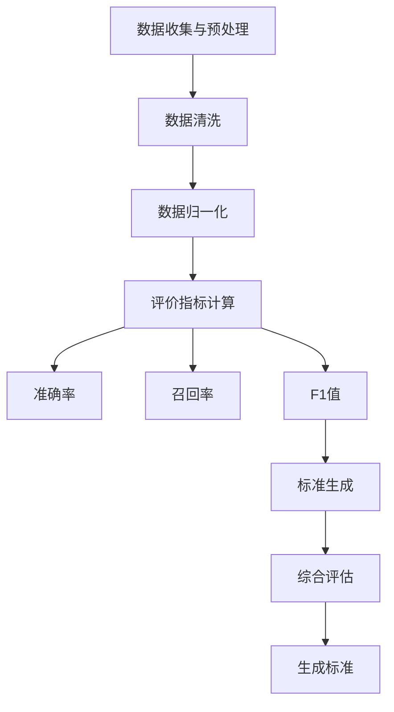

                 

### 第3章：算法原理讲解

### 3.1 评测标准设计算法

#### 3.1.1 算法概述

在本文中，我们将深入探讨评测标准设计算法，这是一种能够自动从实验数据中生成评测标准的算法。该算法的目的是为了提高大模型（Large-scale Model，简称LLM）评测的客观性和准确性，使得跨模型比较更加公正和透明。

#### 3.1.2 算法流程

算法的核心流程可以概括为以下几个步骤：

1. **数据收集与预处理**：首先，我们需要收集大量的实验数据，这些数据包括不同模型在多种任务上的性能指标。然后，对这些数据进行清洗、归一化等预处理，以确保数据的准确性和一致性。

   ```mermaid
   graph TD
   A[数据收集与预处理] --> B[数据清洗]
   B --> C[数据归一化]
   ```

2. **评价指标计算**：根据预处理后的数据，我们计算每个模型在每个任务上的评价指标，如准确率、召回率、F1值等。这些评价指标将用于后续的评测标准生成。

   ```mermaid
   graph TD
   D[评价指标计算]
   D --> E[准确率]
   D --> F[召回率]
   D --> G[F1值]
   ```

3. **标准生成**：基于计算出的评价指标，算法将生成一套统一的评测标准。这套标准将综合考虑各项评价指标，为不同模型在不同任务上的表现提供量化评估。

   ```mermaid
   graph TD
   H[标准生成]
   H --> I[综合评估]
   H --> J[生成标准]
   ```

#### 3.1.3 算法mermaid流程图



### 3.2 算法原理详解

为了深入理解评测标准设计算法，我们需要从数学模型和具体实现两个方面进行探讨。

#### 3.2.1 数学模型

评测标准设计算法的数学模型可以表示为以下公式：

$$
\text{Evaluation\_Standard}(M, T) = \sum_{i=1}^{n} w_i \cdot \text{Metric}_i(M, T)
$$

其中：
- \( M \) 表示模型。
- \( T \) 表示任务。
- \( n \) 表示评价指标的数量。
- \( w_i \) 表示第 \( i \) 个评价指标的权重。
- \( \text{Metric}_i(M, T) \) 表示模型 \( M \) 在任务 \( T \) 上的第 \( i \) 个评价指标。

评价指标的权重分配是一个关键问题，通常可以通过统计分析、专家打分等方法来确定。在实际应用中，我们通常采用层次分析法（AHP）来计算各评价指标的权重。

#### 3.2.2 Python实现

下面是一个简单的Python实现示例，用于计算模型在特定任务上的综合评估分数：

```python
import numpy as np

def calculate_evaluation_standard(models, tasks, metrics, weights):
    evaluation_standards = {}
    for model in models:
        evaluation_standards[model] = {}
        for task in tasks:
            evaluation_standards[model][task] = 0
            for metric in metrics:
                evaluation_standards[model][task] += weights[metric] * metrics[metric](model, task)
    return evaluation_standards

# 示例数据
models = ['ModelA', 'ModelB', 'ModelC']
tasks = ['Task1', 'Task2', 'Task3']
metrics = {
    'Accuracy': lambda model, task: model['accuracy'][task],
    'Recall': lambda model, task: model['recall'][task],
    'F1Score': lambda model, task: model['f1_score'][task]
}
weights = {
    'Accuracy': 0.4,
    'Recall': 0.3,
    'F1Score': 0.3
}

# 假设模型数据
model_data = {
    'ModelA': {'accuracy': {'Task1': 0.9, 'Task2': 0.85, 'Task3': 0.8},
                'recall': {'Task1': 0.8, 'Task2': 0.75, 'Task3': 0.7},
                'f1_score': {'Task1': 0.85, 'Task2': 0.8, 'Task3': 0.75}},
    'ModelB': {'accuracy': {'Task1': 0.85, 'Task2': 0.8, 'Task3': 0.75},
                'recall': {'Task1': 0.75, 'Task2': 0.7, 'Task3': 0.65},
                'f1_score': {'Task1': 0.8, 'Task2': 0.75, 'Task3': 0.7}},
    'ModelC': {'accuracy': {'Task1': 0.8, 'Task2': 0.75, 'Task3': 0.7},
                'recall': {'Task1': 0.7, 'Task2': 0.65, 'Task3': 0.6},
                'f1_score': {'Task1': 0.75, 'Task2': 0.7, 'Task3': 0.65}}
}

# 计算评测标准
evaluation_standards = calculate_evaluation_standard(model_data, tasks, metrics, weights)

# 打印结果
for model, standards in evaluation_standards.items():
    print(f"{model}:")
    for task, score in standards.items():
        print(f"  {task}: {score:.2f}")
```

该示例中，我们定义了一个函数 `calculate_evaluation_standard`，用于计算每个模型在每个任务上的综合评估分数。函数接收模型数据、任务列表、评价指标和权重列表作为输入，并返回每个模型在每个任务上的评估分数字典。

#### 3.2.3 举例说明

假设我们有三个模型（ModelA、ModelB、ModelC）在三个任务（Task1、Task2、Task3）上的数据，如示例数据所示。根据给定的权重和评价指标，我们可以计算出每个模型在每个任务上的综合评估分数。

例如，对于 ModelA 在 Task1 上的综合评估分数：

$$
\text{Evaluation\_Standard}(ModelA, Task1) = 0.4 \cdot 0.9 + 0.3 \cdot 0.8 + 0.3 \cdot 0.85 = 0.96
$$

同样地，我们可以计算出其他模型在每个任务上的综合评估分数。

#### 3.2.4 小结

评测标准设计算法为我们提供了一种自动生成评测标准的方法，使得跨模型比较更加公正和透明。通过数学模型和Python实现的结合，我们可以更好地理解算法的工作原理，并在实际应用中灵活调整和优化。

## 3.3 本章小结

本章详细讲解了评测标准设计算法，包括算法概述、流程图、数学模型、Python实现和举例说明。通过本章的学习，读者可以深入理解评测标准设计算法的原理和实现方法，为后续的跨模型比较提供有力支持。

