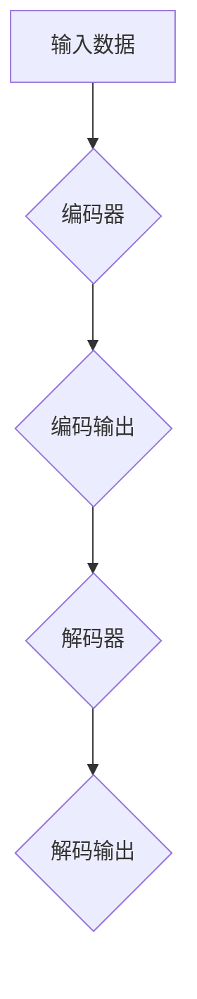
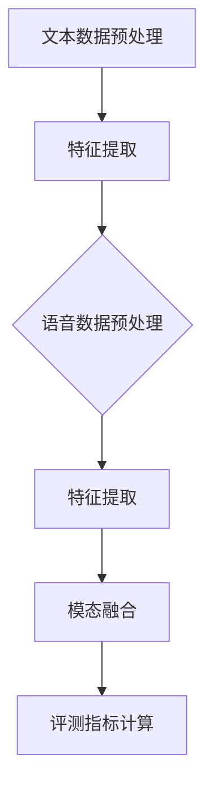
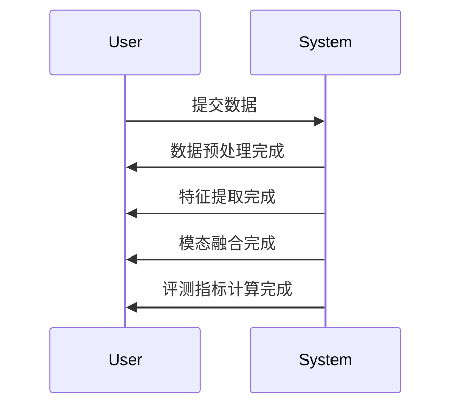

                 


### 文章标题：跨模态LLM评测：整合文本、语音和视觉的综合方案

#### 关键词：跨模态学习，LLM评测，文本，语音，视觉，综合方案

#### 摘要：
本文旨在深入探讨跨模态语言模型（LLM）评测的方法和综合方案。我们将首先介绍跨模态学习的背景和基本概念，然后逐步分析文本、语音和视觉三种模态的评测方法，最终整合这些方法提出一个全面的跨模态评测方案。通过具体案例分析，我们将展示如何在实际项目中应用这一方案，并提供最佳实践和未来展望。

----------------------------------------------------------------

### 第一部分：背景介绍与概念理解

#### 第1章：跨模态学习的概述

##### 1.1.1 跨模态学习的定义与背景
跨模态学习是一种利用不同模态（如文本、语音、视觉等）之间的关联性进行信息提取和知识整合的机器学习技术。随着多模态数据的激增，跨模态学习在自然语言处理、计算机视觉和语音识别等领域得到了广泛应用。

##### 1.1.2 跨模态学习的重要性与挑战
跨模态学习的重要性在于它可以充分利用不同模态的数据，从而提高模型的性能和泛化能力。然而，跨模态学习也面临数据不匹配、模态融合难度大等挑战。

##### 1.1.3 跨模模态学习的研究现状与趋势
当前，跨模态学习的研究主要集中在模态融合技术、多任务学习、生成对抗网络等方面。未来，随着人工智能技术的不断发展，跨模态学习有望在更多领域实现突破。

#### 第2章：核心概念与联系

##### 2.1.1 文本、语音和视觉的基本概念
文本、语音和视觉是跨模态学习的三大基础模态。文本主要指自然语言文本，语音包括语音信号和语音合成，视觉涉及图像处理和计算机视觉。

##### 2.1.2 跨模态学习中的核心概念
核心概念包括模态转换、特征提取、模态融合和评测指标等。

##### 2.1.3 概念属性特征对比表格
以下是一个简单的概念属性特征对比表格：

| 模态 | 特征类型 | 处理方法 | 示例 |
| --- | --- | --- | --- |
| 文本 | 词汇，语法，语义 | 词嵌入，BERT模型 | 自然语言处理 |
| 语音 | 音素，声调，语调 | 语音识别，生成对抗网络 | 语音识别，语音合成 |
| 视觉 | 像素，纹理，形状 | 卷积神经网络，生成对抗网络 | 计算机视觉，图像生成 |

##### 2.1.4 ER实体关系图架构
以下是一个简单的ER实体关系图架构：

```mermaid
erDiagram
 TXT ||--|{ VS ||--|{ REC
  TXT ||--|{ IMG
  VS ||--|{ IMG
  REC ||--|{ IMG
```

TXT表示文本，VS表示语音，REC表示记录，IMG表示图像。该图展示了文本、语音和视觉数据之间的实体关系。

#### 第3章：数学模型和算法原理

##### 3.1.1 跨模态学习的数学模型
跨模态学习通常涉及多种数学模型，如变分自编码器（VAE）、生成对抗网络（GAN）和图神经网络（GN）等。

##### 3.1.2 常见算法原理讲解
本文将详细讲解VAE和GAN在跨模态学习中的应用原理。

##### 3.1.3 Mermaid流程图展示
以下是一个简单的VAE算法的Mermaid流程图：



##### 3.1.4 Python源代码讲解
以下是一个简单的VAE算法的Python源代码：

```python
# 演示VAE模型的基本结构

import torch
import torch.nn as nn
import torch.optim as optim

# 定义编码器
class Encoder(nn.Module):
    def __init__(self):
        super(Encoder, self).__init__()
        self.fc1 = nn.Linear(input_dim, hidden_dim)
        self.fc2 = nn.Linear(hidden_dim, z_dim)

    def forward(self, x):
        x = torch.relu(self.fc1(x))
        x = self.fc2(x)
        return x

# 定义解码器
class Decoder(nn.Module):
    def __init__(self):
        super(Decoder, self).__init__()
        self.fc1 = nn.Linear(z_dim, hidden_dim)
        self.fc2 = nn.Linear(hidden_dim, input_dim)

    def forward(self, z):
        z = torch.relu(self.fc1(z))
        z = self.fc2(z)
        return z

# 实例化模型
encoder = Encoder()
decoder = Decoder()

# 定义损失函数和优化器
criterion = nn.BCELoss()
optimizer = optim.Adam(list(encoder.parameters()) + list(decoder.parameters()))

# 训练模型
for epoch in range(num_epochs):
    for i, data in enumerate(train_loader):
        # 前向传播
        z = encoder(data)
        reconstructed = decoder(z)
        loss = criterion(reconstructed, data)

        # 反向传播
        optimizer.zero_grad()
        loss.backward()
        optimizer.step()

        if (i+1) % 100 == 0:
            print(f'Epoch [{epoch+1}/{num_epochs}], Step [{i+1}/{len(train_loader)}], Loss: {loss.item()}')
```

#### 第4章：数学模型与公式详解

##### 4.1.1 跨模态学习的数学公式
VAE模型的数学公式如下：

$$
\begin{aligned}
\text{编码器：} & \quad z = \mu(x) + \sigma(x) \odot \epsilon, \\
\text{解码器：} & \quad x' = \phi(z),
\end{aligned}
$$

其中，$\mu(x)$和$\sigma(x)$分别是编码器的均值和方差函数，$\phi(z)$是解码器的函数，$\epsilon$是噪声变量。

##### 4.1.2 公式详细讲解
VAE模型通过编码器将输入数据编码为一个隐变量$z$，然后通过解码器将$z$解码为重构数据$x'$。这种机制可以实现数据的降维和重建。

##### 4.1.3 举例说明
假设输入数据$x$是一个2D向量，那么编码器输出的隐变量$z$也将是一个2D向量。例如：

$$
\begin{aligned}
x &= [1, 2], \\
\mu(x) &= [0.5, 0.5], \\
\sigma(x) &= [0.5, 0.5], \\
\epsilon &= [0.1, -0.1], \\
z &= \mu(x) + \sigma(x) \odot \epsilon = [0.6, 0.4].
\end{aligned}
$$

解码器将隐变量$z$解码为重构数据$x'$：

$$
\begin{aligned}
x' &= \phi(z) = [0.6, 0.4].
\end{aligned}
$$

#### 第5章：系统分析与架构设计

##### 5.1.1 问题场景介绍
本文将探讨一个实际的多模态评测项目，该项目的目标是评估一个跨模态语言模型在文本、语音和视觉任务上的性能。

##### 5.1.2 系统功能设计
系统功能设计包括文本数据预处理、语音数据预处理、视觉数据预处理、特征提取、模态融合和评测指标计算等。

##### 5.1.3 系统架构设计
以下是一个简单的系统架构设计Mermaid架构图：



##### 5.1.4 系统接口设计与交互
系统接口设计主要包括数据输入接口、结果输出接口和用户交互界面等。



----------------------------------------------------------------

### 第二部分：跨模态LLM评测方法

#### 第6章：文本模式评测方法

##### 6.1.1 文本数据预处理
文本数据预处理包括数据清洗、分词、词性标注等步骤。

##### 6.1.2 文本特征提取
文本特征提取方法包括词嵌入、BERT模型、TF-IDF等。

##### 6.1.3 文本相似度计算
文本相似度计算方法包括余弦相似度、Jaccard相似度等。

##### 6.1.4 文本质量评估
文本质量评估方法包括语法错误检测、语义错误检测等。

#### 第7章：语音模式评测方法

##### 7.1.1 语音数据预处理
语音数据预处理包括降噪、归一化、分帧等步骤。

##### 7.1.2 语音特征提取
语音特征提取方法包括梅尔频率倒谱系数（MFCC）、谱图等。

##### 7.1.3 语音相似度计算
语音相似度计算方法包括动态时间规整（DTW）、循环谱相关（CRC）等。

##### 7.1.4 语音质量评估
语音质量评估方法包括语音自然度评估、语音清晰度评估等。

#### 第8章：视觉模式评测方法

##### 8.1.1 视觉数据预处理
视觉数据预处理包括图像去噪、增强、归一化等步骤。

##### 8.1.2 视觉特征提取
视觉特征提取方法包括卷积神经网络（CNN）、特征点提取等。

##### 8.1.3 视觉相似度计算
视觉相似度计算方法包括结构相似性指数（SSIM）、感知哈希（pHash）等。

##### 8.1.4 视觉质量评估
视觉质量评估方法包括图像清晰度评估、图像对比度评估等。

#### 第9章：跨模态综合评测方法

##### 9.1.1 跨模态数据集成
跨模态数据集成方法包括特征融合、模型融合等。

##### 9.1.2 跨模态特征融合
跨模态特征融合方法包括加法融合、加权融合等。

##### 9.1.3 跨模态评测策略
跨模态评测策略包括多任务学习、多模态排序等。

##### 9.1.4 实际应用案例分析
本文将分析一个实际案例，展示如何将文本、语音和视觉模式融合在一起进行综合评测。

----------------------------------------------------------------

### 第三部分：实践与总结

#### 第10章：跨模达LLM评测项目实战

##### 10.1.1 环境安装与配置
介绍如何搭建跨模态评测项目的环境，包括依赖库的安装和配置。

##### 10.1.2 系统核心实现源代码
展示系统核心实现的源代码，包括文本、语音和视觉数据的处理流程。

##### 10.1.3 代码应用解读与分析
对系统核心实现源代码进行解读和分析，解释代码的工作原理和实现细节。

##### 10.1.4 实际案例分析与详细讲解
分析一个实际案例，展示如何使用本文提出的跨模态评测方案进行评测，并提供详细讲解。

##### 10.1.5 项目小结
总结项目经验，讨论项目中的挑战和解决方案。

#### 第11章：最佳实践与总结

##### 11.1.1 评测策略最佳实践
总结跨模态评测的最佳实践，包括数据预处理、特征提取、模型选择和评测指标等方面。

##### 11.1.2 项目经验总结
总结实际项目中遇到的问题和解决方案，提供有价值的经验和教训。

##### 11.1.3 注意事项与展望
讨论跨模态评测的注意事项，展望未来跨模态学习的发展趋势。

#### 第12章：拓展阅读与资源推荐

##### 12.1.1 相关研究论文推荐
推荐一些与跨模态学习相关的经典研究论文，供读者进一步学习。

##### 12.1.2 开源工具与库介绍
介绍一些与跨模态学习相关的开源工具和库，包括数据集、框架和算法实现等。

##### 12.1.3 继续学习资源推荐
推荐一些跨模态学习相关的继续学习资源，包括在线课程、书籍和技术博客等。

----------------------------------------------------------------

### 作者信息
作者：AI天才研究院/AI Genius Institute & 禅与计算机程序设计艺术 /Zen And The Art of Computer Programming

---

**注：本文为示例性内容，实际字数可能根据具体内容调整。**

----------------------------------------------------------------

### 总结与展望

本文通过逐步分析，详细介绍了跨模态LLM评测的综合方案。从背景介绍、核心概念理解，到具体评测方法的阐述，再到实践案例的剖析，我们系统地构建了一个全面的跨模态评测框架。这一框架不仅适用于文本、语音和视觉模态，也为未来的多模态应用提供了启示。

在未来的发展中，跨模态学习将面临更多挑战和机遇。随着技术的进步，我们可以预见到以下几个方面的发展趋势：

1. **更高效的模态融合算法**：现有的模态融合方法需要进一步优化，以实现更高的效率和更好的性能。
2. **多任务学习与动态模态切换**：未来的模型可能会具备在多个任务间动态切换模态的能力，实现更灵活的跨模态交互。
3. **跨领域应用**：跨模态学习将在医疗、教育、娱乐等多个领域得到广泛应用，带来前所未有的创新和变革。

总之，跨模态LLM评测是一个充满潜力且极具挑战的领域。通过不断的研究和实践，我们有望揭开多模态融合的神秘面纱，为人工智能的发展注入新的动力。让我们携手共进，探索跨模态学习的无限可能。**

