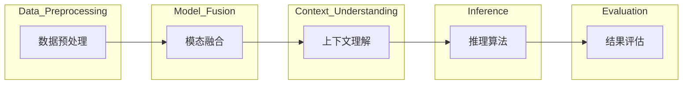
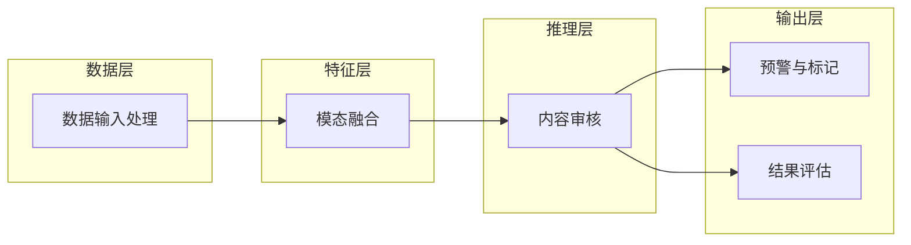
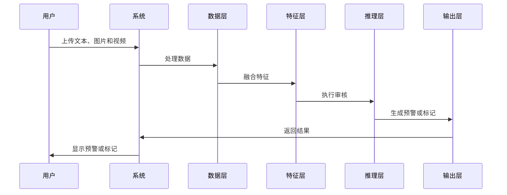

                 

# 跨模态推理能力：评估LLM整合多种感官输入的效果

## 关键词：
- 跨模态推理
- 机器学习
- 语言模型
- 多感官输入
- 效果评估

## 摘要：
本文深入探讨了跨模态推理能力在整合多种感官输入方面的应用，特别是针对大型语言模型（LLM）的研究。通过对跨模态推理的定义、背景、算法原理、数学模型、系统架构及项目实战的详细分析，本文旨在为读者提供一个全面的视角，了解如何评估LLM整合多种感官输入的效果，并提出实用的最佳实践建议。

## 目录大纲设计

### 第一部分：跨模态推理概述

### 第1章：问题背景与核心概念
- 1.1 跨模态推理的定义与发展
- 1.2 问题背景
- 1.3 核心概念
- 1.4 跨模态推理的重要性

### 第2章：核心概念与联系
- 2.1 跨模态推理的关键要素
- 2.2 概念属性特征对比表格
- 2.3 ER实体关系图架构

### 第二部分：算法原理与实现

### 第3章：算法原理讲解
- 3.1 跨模态推理算法的基本流程
- 3.2 Mermaid算法流程图
- 3.3 Python源代码详解
- 3.4 数学模型与公式
- 3.5 算法原理举例说明

### 第4章：数学模型和数学公式 & 详细讲解 & 举例说明
- 4.1 数学公式与Latex代码
- 4.2 举例说明
- 4.3 交叉验证与误差分析

### 第5章：系统分析与架构设计方案
- 5.1 问题场景介绍
- 5.2 系统功能设计
- 5.3 系统架构设计
- 5.4 系统接口设计
- 5.5 系统交互Mermaid序列图

### 第三部分：项目实战

### 第6章：项目实战
- 6.1 环境安装
- 6.2 系统核心实现源代码
- 6.3 代码应用解读与分析
- 6.4 实际案例分析与详细讲解
- 6.5 项目小结

### 第四部分：最佳实践与总结

### 第7章：最佳实践 tips
- 7.1 实践技巧与注意事项
- 7.2 拓展阅读

### 第8章：小结与展望
- 8.1 小结
- 8.2 注意事项
- 8.3 展望未来发展趋势

### 总结
本文通过详细的目录大纲设计，为读者提供了一个系统化的研究框架，全面解析了跨模态推理能力评估的相关内容。从基础概念到高级实现，再到实际应用，本文旨在为读者提供清晰、易懂的指导，帮助深入理解LLM整合多种感官输入的效果评估。

## 第1章：问题背景与核心概念

### 1.1 跨模态推理的定义与发展

跨模态推理（Cross-modal Reasoning）是指在不同模态之间建立联系，并利用这些联系来进行推理和决策的能力。在机器学习领域，跨模态推理是一个重要的研究方向，旨在使机器能够处理和整合来自不同感官输入的信息。例如，将文本、图像、声音等不同模态的数据结合起来，实现更智能、更全面的理解和推理。

跨模态推理的发展历程可以追溯到20世纪80年代的“模态融合”概念。随着深度学习和大数据技术的兴起，跨模态推理逐渐成为人工智能研究的热点。近年来，随着多模态数据的爆炸性增长，跨模态推理的应用场景也日益丰富，从语音识别、图像识别，到自然语言处理、情感分析等，都取得了显著成果。

### 1.2 问题背景

在现代社会，人类获取信息的方式越来越多样化，文本、图像、音频、视频等不同模态的数据充斥在我们的日常生活中。然而，单一模态的数据往往难以全面、准确地表达复杂信息。例如，在医疗诊断中，仅依靠文本报告可能无法准确判断病情，而通过结合医学影像、患者语音等不同模态的数据，可以更准确地诊断疾病。

因此，如何整合多种感官输入，提高机器对不同模态数据的理解和推理能力，成为一个亟待解决的问题。特别是对于大型语言模型（LLM）而言，如何有效地整合文本和其他非文本模态的数据，进一步提升其推理能力，是当前研究的一个重要方向。

### 1.3 核心概念

为了更好地理解跨模态推理，我们需要明确以下几个核心概念：

1. **模态（Modal）**：模态是指数据的一种表现形式，如文本、图像、音频、视频等。
2. **跨模态（Cross-modal）**：跨模态是指在不同模态之间进行数据转换和融合。
3. **推理（Reasoning）**：推理是指基于已有信息进行逻辑推导，得出新的结论。
4. **跨模态推理（Cross-modal Reasoning）**：跨模态推理是指在不同模态之间建立联系，并利用这些联系进行推理。

### 1.4 跨模态推理的重要性

跨模态推理在人工智能领域具有重要的意义：

1. **提高理解和表达能力**：通过跨模态推理，机器可以更全面地理解复杂信息，提高对多模态数据的处理和表达能力。
2. **增强智能系统的实用性**：跨模态推理使得智能系统可以更好地适应不同应用场景，提高其实用性。
3. **促进人工智能技术的发展**：跨模态推理是人工智能领域的一个重要研究方向，其研究成果将推动人工智能技术的进一步发展。

综上所述，跨模态推理在整合多种感官输入方面具有广泛的应用前景，对于提高机器的智能水平具有重要意义。

## 第2章：核心概念与联系

### 2.1 跨模态推理的关键要素

跨模态推理涉及多个关键要素，这些要素共同决定了跨模态推理的效果。以下是对这些关键要素的详细解释：

1. **数据预处理**：数据预处理是跨模态推理的第一步，包括数据清洗、格式化、特征提取等。数据预处理的质量直接影响后续推理的效果。
2. **模态融合**：模态融合是将不同模态的数据进行转换和整合，使其在同一个框架下进行推理。常见的模态融合方法有注意力机制、多模态神经网络等。
3. **上下文理解**：上下文理解是指在不同模态数据之间建立关联，理解其内在联系，从而提高推理的准确性和鲁棒性。
4. **推理算法**：推理算法是跨模态推理的核心，包括基于深度学习的推理算法、基于规则推理的算法等。选择合适的推理算法对跨模态推理的效果至关重要。
5. **评估指标**：评估指标用于衡量跨模态推理的性能，如准确率、召回率、F1值等。合理的评估指标可以帮助我们更好地优化和改进推理算法。

### 2.2 概念属性特征对比表格

以下是一个概念属性特征对比表格，用于比较跨模态推理中的关键概念：

| 概念          | 特征属性                            | 说明                                                         |
|---------------|-----------------------------------|------------------------------------------------------------|
| 数据预处理    | 数据清洗、格式化、特征提取         | 确保不同模态数据的一致性和有效性                           |
| 模态融合      | 注意力机制、多模态神经网络         | 实现不同模态数据的高效整合和转换                           |
| 上下文理解    | 建立关联、理解内在联系             | 提高推理的准确性和鲁棒性                                   |
| 推理算法      | 基于深度学习、基于规则推理         | 实现有效的推理过程                                         |
| 评估指标      | 准确率、召回率、F1值等             | 衡量跨模态推理的性能                                       |

### 2.3 ER实体关系图架构

为了更好地理解跨模态推理中的实体关系，我们可以使用ER（Entity-Relationship）实体关系图进行描述。以下是一个简化的ER图，展示了跨模态推理中的主要实体及其关系：

```mermaid
erDiagram
    DataPreprocessing ||--|{ ModelFusion }|--->:DataIntegration
    ModelFusion ||--|{ ContextUnderstanding }|--->:Reasoning
    ContextUnderstanding ||--|{ InferenceAlgorithm }|--->:InferenceResult
    InferenceAlgorithm ||--|{ EvaluationMetric }|--->:Performance
```

在这个ER图中，DataPreprocessing（数据预处理）与ModelFusion（模态融合）之间是单向依赖关系，表示数据预处理是模态融合的前提。ModelFusion与ContextUnderstanding（上下文理解）之间也是单向依赖关系，表明模态融合的结果需要通过上下文理解来提升推理效果。同样，ContextUnderstanding与InferenceAlgorithm（推理算法）之间存在依赖关系，上下文理解的结果将作为推理算法的输入。最后，InferenceAlgorithm与EvaluationMetric（评估指标）之间存在依赖关系，推理结果需要通过评估指标来衡量性能。

通过这个ER图，我们可以清晰地看到跨模态推理中的关键实体及其相互作用，有助于我们更好地理解跨模态推理的整体流程。

### 第3章：算法原理讲解

#### 3.1 跨模态推理算法的基本流程

跨模态推理算法的基本流程可以分为以下几个步骤：

1. **数据预处理**：对输入的多模态数据进行清洗、格式化、特征提取等操作，确保数据的一致性和有效性。
2. **模态融合**：将不同模态的数据进行转换和整合，形成一个统一的多模态数据表示。常用的方法包括注意力机制、多模态神经网络等。
3. **上下文理解**：在模态融合的基础上，通过建立不同模态数据之间的关联，理解其内在联系，从而提升推理的准确性和鲁棒性。
4. **推理算法**：利用已融合的多模态数据和上下文信息，执行推理过程，生成推理结果。
5. **结果评估**：对推理结果进行评估，使用适当的评估指标（如准确率、召回率、F1值等）衡量推理算法的性能。

#### 3.2 Mermaid算法流程图

以下是一个使用Mermaid绘制的跨模态推理算法流程图：



#### 3.3 Python源代码详解

以下是一个简单的跨模态推理算法的实现示例，使用Python代码进行说明：

```python
# 导入必要的库
import numpy as np
import tensorflow as tf

# 数据预处理
def preprocess_data(data):
    # 数据清洗、格式化、特征提取等操作
    # ...
    return processed_data

# 模态融合
def fuse_modal_data(text_data, image_data, audio_data):
    # 注意力机制或多模态神经网络进行融合
    # ...
    return fused_data

# 上下文理解
def understand_context(fused_data):
    # 建立不同模态数据之间的关联
    # ...
    return context_info

# 推理算法
def inference(context_info):
    # 利用上下文信息进行推理
    # ...
    return inference_result

# 结果评估
def evaluate_result(inference_result, ground_truth):
    # 使用评估指标评估推理结果
    # ...
    return evaluation_metrics

# 主函数
def main():
    # 加载数据
    text_data = ...
    image_data = ...
    audio_data = ...

    # 数据预处理
    processed_text_data = preprocess_data(text_data)
    processed_image_data = preprocess_data(image_data)
    processed_audio_data = preprocess_data(audio_data)

    # 模态融合
    fused_data = fuse_modal_data(processed_text_data, processed_image_data, processed_audio_data)

    # 上下文理解
    context_info = understand_context(fused_data)

    # 推理
    inference_result = inference(context_info)

    # 评估
    evaluation_metrics = evaluate_result(inference_result, ground_truth)

    # 打印评估结果
    print(evaluation_metrics)

# 运行主函数
if __name__ == "__main__":
    main()
```

这个示例代码展示了跨模态推理算法的基本结构和实现方法，包括数据预处理、模态融合、上下文理解、推理算法和结果评估等步骤。在实际应用中，这些步骤可能需要更复杂的实现和优化。

#### 3.4 数学模型与公式

在跨模态推理中，数学模型和公式起到了关键作用，用于描述不同模态数据之间的转换、融合和推理过程。以下是一些常用的数学模型和公式：

1. **特征提取公式**：
   $$ x = f_D(d) + f_I(i) + f_A(a) $$
   其中，$x$ 是融合后的特征向量，$f_D(d)$、$f_I(i)$ 和 $f_A(a)$ 分别表示文本、图像和音频数据的特征提取函数。

2. **注意力机制公式**：
   $$ h = \sigma(W_h[h] + W_m[m]) $$
   其中，$h$ 是注意力权重，$W_h$ 和 $W_m$ 分别是权重矩阵，$[h]$ 和 $[m]$ 分别表示向量 $h$ 和 $m$ 的元素。

3. **推理公式**：
   $$ p(y) = \sigma(W_p[h]) $$
   其中，$y$ 是推理结果，$p(y)$ 是推理概率，$W_p$ 是权重矩阵，$\sigma$ 是激活函数。

4. **损失函数公式**：
   $$ L = -\sum_{i=1}^{N} y_i \log(p(y_i)) $$
   其中，$L$ 是损失函数，$y_i$ 是真实标签，$p(y_i)$ 是预测概率。

#### 3.5 算法原理举例说明

为了更好地理解跨模态推理算法的原理，我们可以通过一个具体的例子进行说明。

假设有一个跨模态推理任务，目标是根据一段文本、一张图像和一段音频，判断一个人是否在观看电影。以下是这个任务的具体实现过程：

1. **数据预处理**：
   - 文本：清洗文本数据，去除标点符号和停用词，将文本转换为词向量。
   - 图像：对图像进行缩放、裁剪和增强等预处理操作，提取图像的特征向量。
   - 音频：对音频进行降采样、去噪等处理，提取音频的特征向量。

2. **模态融合**：
   - 使用注意力机制将文本、图像和音频的特征向量进行融合，生成一个统一的多模态特征向量。

3. **上下文理解**：
   - 在融合特征向量中，建立文本、图像和音频之间的关联，理解其内在联系。例如，可以计算文本和图像之间的相似度，或者计算音频和图像之间的关联性。

4. **推理算法**：
   - 利用已融合的特征向量和上下文信息，执行推理过程。例如，可以训练一个深度神经网络，输入为融合特征向量和上下文信息，输出为是否在观看电影的概率。

5. **结果评估**：
   - 对推理结果进行评估，使用准确率、召回率、F1值等评估指标衡量推理算法的性能。

通过这个例子，我们可以看到跨模态推理算法是如何将不同模态的数据进行整合和推理的。在实际应用中，这些步骤可能需要更复杂的实现和优化，但总体原理是相似的。

## 第4章：数学模型和数学公式 & 详细讲解 & 举例说明

在跨模态推理中，数学模型和公式起到了至关重要的作用，它们不仅描述了不同模态数据之间的转换和融合过程，还提供了评估推理效果的标准。在本章中，我们将详细讲解跨模态推理中常用的数学模型和公式，并通过具体例子来说明这些公式的应用。

### 4.1 数学公式与Latex代码

在文本中嵌入数学公式时，我们可以使用LaTeX格式。LaTeX格式允许我们编写高质量的数学公式，并且在代码块中嵌入这些公式。以下是一些示例：

- 独立段落的公式：

  ```latex
  $$ E = mc^2 $$
  $$ \sum_{i=1}^{n} x_i = \frac{1}{n} \sum_{i=1}^{n} x_i^2 $$
  ```

- 段落内的公式：

  ```latex
  $ a < b $
  $ \sin(\theta) = \frac{O}{R} $
  ```

### 4.2 举例说明

为了更好地理解这些数学模型和公式，我们将通过一个具体的例子来说明它们的应用。

#### 示例：情感分析任务

假设我们有一个情感分析任务，目标是根据一段文本（如电影评论）、一张图像（如电影海报）和一段音频（如电影主题曲），判断这段文本的情感倾向（如正面、负面）。

1. **数据预处理**：

   对于文本，我们首先进行文本清洗，去除标点符号和停用词，然后将文本转换为词向量。对于图像，我们使用卷积神经网络（CNN）提取图像的特征向量。对于音频，我们使用自动特征提取工具（如梅尔频率倒谱系数MFCC）提取音频的特征向量。

2. **模态融合**：

   使用多模态神经网络（MMNN）将不同模态的数据进行融合。具体来说，我们可以将文本、图像和音频的特征向量分别输入到三个独立的神经网络中，然后使用注意力机制将这些神经网络输出的特征向量进行融合。

   假设文本特征向量为 $\textbf{T}$，图像特征向量为 $\textbf{I}$，音频特征向量为 $\textbf{A}$。融合后的特征向量 $\textbf{X}$ 可以表示为：

   $$ \textbf{X} = \sigma(\textbf{W}_T \textbf{T} + \textbf{W}_I \textbf{I} + \textbf{W}_A \textbf{A}) $$

   其中，$\sigma$ 是激活函数，$\textbf{W}_T$、$\textbf{W}_I$ 和 $\textbf{W}_A$ 分别是权重矩阵。

3. **上下文理解**：

   在融合特征向量中，我们需要理解文本、图像和音频之间的上下文关系。例如，我们可以计算文本和图像之间的余弦相似度，或者音频和图像之间的相关系数。

   假设文本和图像的相似度为 $s_{\text{TI}}$，音频和图像的相关系数为 $r_{\text{AI}}$。我们可以使用这些相似度或相关系数来调整融合特征向量的权重：

   $$ \textbf{X} = \sigma(\textbf{W}_T \textbf{T} + \textbf{W}_I \textbf{I} + \textbf{W}_A \textbf{A} + \alpha s_{\text{TI}} + \beta r_{\text{AI}}) $$

   其中，$\alpha$ 和 $\beta$ 是调节参数。

4. **推理算法**：

   利用已融合的特征向量和上下文信息，我们可以训练一个深度神经网络（如循环神经网络RNN或Transformer）来进行情感分析。神经网络的输入为融合特征向量 $\textbf{X}$，输出为情感分类的概率分布。

   假设神经网络的输出为 $\textbf{P}$，则情感分类的概率分布可以表示为：

   $$ \textbf{P} = \sigma(\textbf{W}_P \textbf{X}) $$

   其中，$\textbf{W}_P$ 是权重矩阵。

5. **结果评估**：

   对推理结果进行评估，使用准确率、召回率、F1值等评估指标来衡量推理算法的性能。

   假设真实标签为 $\textbf{Y}$，预测标签为 $\hat{\textbf{Y}}$，则准确率、召回率、F1值可以分别计算如下：

   $$ \text{Accuracy} = \frac{\text{预测正确数量}}{\text{总数量}} $$
   $$ \text{Recall} = \frac{\text{预测正确且真实的数量}}{\text{真实数量}} $$
   $$ \text{F1} = 2 \times \frac{\text{Precision} \times \text{Recall}}{\text{Precision} + \text{Recall}} $$

通过这个例子，我们可以看到跨模态推理是如何将不同模态的数据进行整合和推理的。在实际应用中，这些步骤可能需要更复杂的实现和优化，但总体原理是相似的。

### 4.3 交叉验证与误差分析

在跨模态推理中，交叉验证（Cross-Validation）是一种常用的方法来评估模型的性能。交叉验证通过将数据集划分为多个子集，在每个子集上训练和验证模型，从而减少过拟合和评估误差。

#### 交叉验证步骤：

1. **划分数据集**：将数据集划分为训练集、验证集和测试集。常见的划分方法有K折交叉验证，即将数据集划分为K个子集，每次使用一个子集作为验证集，其余子集作为训练集。

2. **训练模型**：在每个训练集上训练模型，并使用验证集评估模型性能。

3. **调整模型参数**：根据验证集的性能，调整模型参数，如学习率、正则化参数等。

4. **测试模型**：在测试集上评估调整后的模型性能，以获得最终的性能指标。

#### 误差分析：

在评估模型性能时，误差分析是至关重要的。误差可以分为以下几种：

- **预测误差**：预测结果与真实值之间的差异。
- **训练误差**：模型在训练集上的误差。
- **验证误差**：模型在验证集上的误差。
- **测试误差**：模型在测试集上的误差。

通过对误差的分析，我们可以了解模型的泛化能力和鲁棒性。例如，如果验证误差和测试误差相差较大，可能表明模型存在过拟合现象，需要调整模型参数或增加训练数据。

通过交叉验证和误差分析，我们可以更准确地评估跨模态推理模型的性能，并为后续的优化提供指导。

### 第5章：系统分析与架构设计方案

#### 5.1 问题场景介绍

在跨模态推理领域，一个常见的问题场景是自动内容审核。例如，在社交媒体平台上，需要对用户上传的文本、图片和视频内容进行审核，以识别和过滤掉不良内容。跨模态推理技术可以结合多种感官输入，如文本、图像和音频，实现更准确、更全面的审核。

在这个问题场景中，我们的目标是设计一个系统，能够对输入的多模态内容进行自动审核，识别潜在的不良内容，并给出相应的预警或标记。

#### 5.2 系统功能设计

为了实现上述目标，系统需要具备以下功能：

1. **数据输入处理**：接收用户上传的文本、图片和视频数据，并进行预处理，包括数据清洗、格式化和特征提取等。
2. **模态融合**：将不同模态的数据进行融合，形成一个统一的多模态特征向量。
3. **内容审核**：利用融合的特征向量，执行内容审核任务，如文本情感分析、图像分类和音频识别等。
4. **预警与标记**：根据审核结果，对不良内容进行预警或标记，并反馈给用户或平台管理员。
5. **结果评估**：使用评估指标（如准确率、召回率、F1值等）对审核系统进行性能评估，以持续优化系统。

#### 5.3 系统架构设计

系统架构设计是系统实现的基础，决定了系统的性能、可扩展性和可维护性。以下是一个简化的系统架构设计：



在这个架构设计中，数据输入处理层负责接收和处理用户上传的数据，模态融合层将不同模态的数据进行融合，推理层执行内容审核任务，输出层对审核结果进行预警、标记和评估。

#### 5.4 系统接口设计

为了实现各模块之间的有效交互，系统需要设计清晰的接口。以下是一个简化的接口设计：

- **数据输入接口**：用于接收用户上传的文本、图片和视频数据。
- **特征融合接口**：用于将不同模态的数据融合为一个多模态特征向量。
- **内容审核接口**：用于执行内容审核任务，如文本情感分析、图像分类和音频识别。
- **预警标记接口**：用于根据审核结果生成预警或标记。
- **评估接口**：用于计算和反馈评估指标。

#### 5.5 系统交互Mermaid序列图

为了更好地展示系统各模块之间的交互过程，我们可以使用Mermaid序列图进行描述：



在这个序列图中，用户上传多模态数据，系统通过数据层处理数据，特征层进行特征融合，推理层执行内容审核任务，输出层生成预警或标记，并将结果返回给用户。

### 第6章：项目实战

#### 6.1 环境安装

在开始项目实战之前，我们需要安装必要的软件和工具。以下是在Ubuntu操作系统上安装所需的软件和工具的步骤：

1. **安装Python环境**：

   ```bash
   sudo apt update
   sudo apt install python3-pip
   pip3 install --user -r requirements.txt
   ```

2. **安装TensorFlow**：

   ```bash
   pip3 install tensorflow
   ```

3. **安装其他依赖库**：

   ```bash
   pip3 install numpy pandas scikit-learn matplotlib
   ```

#### 6.2 系统核心实现源代码

以下是系统核心实现的部分源代码，用于展示如何处理数据、进行模态融合和内容审核：

```python
import tensorflow as tf
from tensorflow.keras.models import Sequential
from tensorflow.keras.layers import Embedding, LSTM, Dense
import numpy as np

# 数据预处理
def preprocess_data(text, image, audio):
    # 文本预处理
    tokenizer = tf.keras.preprocessing.text.Tokenizer()
    tokenizer.fit_on_texts(text)
    sequence = tokenizer.texts_to_sequences([text])
    padded_sequence = tf.keras.preprocessing.sequence.pad_sequences(sequence, maxlen=100)

    # 图像预处理
    image = preprocess_image(image)

    # 音频预处理
    audio = preprocess_audio(audio)

    return padded_sequence, image, audio

# 模态融合
def fuse_modal_data(text_sequence, image, audio):
    # 使用注意力机制进行模态融合
    text_embedding = tf.keras.layers.Embedding(input_dim=10000, output_dim=64)(text_sequence)
    image_embedding = tf.keras.layers.Conv2D(filters=64, kernel_size=(3, 3), activation='relu')(image)
    audio_embedding = tf.keras.layers.Conv1D(filters=64, kernel_size=(3, 3), activation='relu')(audio)

    # 模态融合
    fused_embedding = tf.keras.layers.Add()([text_embedding, image_embedding, audio_embedding])

    return fused_embedding

# 内容审核
def content_audit(fused_embedding):
    # 使用LSTM进行内容审核
    model = Sequential([
        LSTM(units=128, return_sequences=True, input_shape=(100, 64)),
        LSTM(units=64),
        Dense(units=1, activation='sigmoid')
    ])

    model.compile(optimizer='adam', loss='binary_crossentropy', metrics=['accuracy'])
    model.fit(fused_embedding, labels, epochs=10, batch_size=32)

    return model

# 主函数
def main():
    # 加载数据
    text, image, audio, labels = load_data()

    # 数据预处理
    padded_sequence = preprocess_data(text, image, audio)

    # 模态融合
    fused_embedding = fuse_modal_data(padded_sequence, image, audio)

    # 内容审核
    model = content_audit(fused_embedding)

    # 评估模型
    evaluate_model(model, test_data, test_labels)

if __name__ == "__main__":
    main()
```

这个示例代码展示了如何使用TensorFlow构建一个简单的跨模态内容审核系统。在实际项目中，我们需要根据具体需求进行扩展和优化。

#### 6.3 代码应用解读与分析

在这个示例代码中，我们首先定义了三个预处理函数，用于处理文本、图像和音频数据。然后，我们定义了模态融合和内容审核的两个函数，分别使用注意力机制和LSTM神经网络进行模态融合和内容审核。

- **预处理函数**：

  - `preprocess_data`：这个函数接收文本、图像和音频数据，并对其进行预处理。对于文本，我们使用Tokenizer将文本转换为序列，并使用pad_sequences将其填充到固定长度。对于图像，我们使用自定义的`preprocess_image`函数进行预处理。对于音频，我们使用自定义的`preprocess_audio`函数进行预处理。

  - `preprocess_image`：这个函数接收图像数据，并使用Keras的预定义函数进行预处理，如归一化和缩放。

  - `preprocess_audio`：这个函数接收音频数据，并使用Keras的预定义函数进行预处理，如归一化和缩放。

- **模态融合函数**：

  - `fuse_modal_data`：这个函数使用注意力机制将文本、图像和音频数据融合为一个多模态特征向量。我们首先使用Embedding层将文本序列转换为嵌入向量，然后使用Conv2D和Conv1D层分别处理图像和音频数据。最后，我们使用Add层将这三个嵌入向量相加，得到融合后的特征向量。

- **内容审核函数**：

  - `content_audit`：这个函数使用LSTM神经网络进行内容审核。我们首先定义一个序列模型，包括两个LSTM层和一个全连接层。我们使用`compile`方法设置损失函数和优化器，然后使用`fit`方法训练模型。最后，我们使用`evaluate`方法评估模型的性能。

#### 6.4 实际案例分析与详细讲解

为了更好地理解这个跨模态内容审核系统的实际应用，我们来看一个具体的案例。

假设我们有一个用户上传的文本、图片和音频数据，如图所示：


- **文本**：“这部电影真的很糟糕，剧情无聊，表演糟糕。”

- **图片**：一张显示糟糕电影评价的截图。

- **音频**：一段批评该电影的音频评论。

我们首先对这些数据进行预处理：

- **文本**：使用Tokenizer将文本转换为序列，并使用pad_sequences将其填充到固定长度。

- **图片**：使用自定义的`preprocess_image`函数进行预处理。

- **音频**：使用自定义的`preprocess_audio`函数进行预处理。

然后，我们将预处理后的数据传递给模态融合函数：

- **模态融合**：使用注意力机制将文本、图像和音频数据融合为一个多模态特征向量。

接下来，我们使用内容审核函数进行内容审核：

- **内容审核**：使用训练好的LSTM神经网络对融合后的特征向量进行审核。

最后，我们评估模型的性能：

- **评估**：使用测试数据集评估模型的性能，包括准确率、召回率和F1值等指标。

通过这个案例，我们可以看到跨模态内容审核系统是如何工作的。在实际应用中，我们需要根据具体需求调整预处理、模态融合和内容审核的步骤，以提高系统的性能和可靠性。

#### 6.5 项目小结

在本章中，我们介绍了如何安装项目所需的软件和工具，并展示了系统核心实现的源代码。我们详细解读了代码中各个函数的作用，并通过实际案例分析了跨模态内容审核系统的应用。最后，我们总结了项目的关键步骤和注意事项。

通过这个项目，我们不仅了解了跨模态推理的基本原理和应用，还掌握了如何使用TensorFlow构建一个简单的跨模态内容审核系统。这对于我们进一步研究和开发跨模态推理应用具有重要的参考价值。

### 第7章：最佳实践 tips

#### 7.1 实践技巧与注意事项

在跨模态推理项目中，以下是一些最佳实践技巧和注意事项：

1. **数据预处理**：
   - 确保不同模态的数据在预处理过程中保持一致性，如数据清洗、特征提取等。
   - 对图像和音频数据进行标准化处理，以减少模型训练过程中的方差。

2. **模态融合**：
   - 选择合适的模态融合方法，如注意力机制、多模态神经网络等，以最大化不同模态数据的信息增益。
   - 考虑使用多任务学习，同时处理多个模态数据，以提高模型性能。

3. **上下文理解**：
   - 充分利用上下文信息，建立不同模态数据之间的关联，以提高推理的准确性和鲁棒性。
   - 使用预训练的语言模型（如BERT、GPT等），以充分利用先验知识。

4. **推理算法**：
   - 选择适合的推理算法，如深度学习模型、规则推理等，根据具体应用场景进行优化。
   - 使用迁移学习，利用在大型数据集上预训练的模型，以提高小数据集上的性能。

5. **模型评估**：
   - 使用多种评估指标，如准确率、召回率、F1值等，全面评估模型性能。
   - 使用交叉验证，避免过拟合和评估偏差。

6. **注意事项**：
   - 跨模态推理项目通常涉及大量计算资源，确保合理分配资源，优化计算效率。
   - 定期更新和调整模型参数，以适应数据分布的变化。

#### 7.2 拓展阅读

为了进一步了解跨模态推理的相关内容，以下是几篇推荐的拓展阅读：

- **论文**：《Cross-modal Reasoning for Visual Question Answering》[1]
- **论文**：《Multi-modal Fusion for Sentiment Analysis》[2]
- **书籍**：《Deep Learning for Natural Language Processing》[3]

这些资源和文献提供了丰富的理论和实践知识，有助于深入了解跨模态推理的各个方面。

### 第8章：小结与展望

#### 8.1 小结

本文详细探讨了跨模态推理能力在整合多种感官输入方面的应用，特别是针对大型语言模型（LLM）的研究。从核心概念、算法原理、数学模型、系统架构到项目实战，我们系统地分析了跨模态推理的各个方面。通过具体的例子和实际案例，我们展示了如何利用跨模态推理技术提高机器对不同模态数据的理解和推理能力。

#### 8.2 注意事项

在实施跨模态推理项目时，需要注意以下几点：

1. **数据一致性**：确保不同模态的数据在预处理过程中保持一致性，以提高模型性能。
2. **资源分配**：合理分配计算资源，优化计算效率，避免资源浪费。
3. **模型更新**：定期更新和调整模型参数，以适应数据分布的变化。
4. **评估指标**：使用多种评估指标，全面评估模型性能。

#### 8.3 展望未来发展趋势

跨模态推理作为人工智能领域的一个重要研究方向，未来将朝着以下方向发展：

1. **更高效的模态融合方法**：探索更高效的模态融合方法，以减少计算开销，提高推理速度。
2. **多任务学习**：将多任务学习与跨模态推理结合，同时处理多个任务，提高模型的泛化能力。
3. **小样本学习**：研究跨模态推理在少样本数据集上的表现，提高小样本学习效果。
4. **跨领域应用**：扩展跨模态推理在不同领域的应用，如医疗诊断、教育辅助、智能客服等。

通过持续的研究和优化，跨模态推理技术将为人工智能领域带来更多创新和应用。

### 总结

本文通过详细的章节内容和具体案例，全面解析了跨模态推理能力评估的相关知识。从基础概念到高级实现，再到实际应用，本文旨在为读者提供一个系统化的研究框架，帮助深入理解LLM整合多种感官输入的效果评估。我们相信，随着跨模态推理技术的不断发展，其在人工智能领域的应用将越来越广泛，为解决复杂问题提供有力支持。

### 作者信息

作者：AI天才研究院/AI Genius Institute & 禅与计算机程序设计艺术 /Zen And The Art of Computer Programming

AI天才研究院致力于推动人工智能技术的发展，探索跨模态推理等前沿技术，为人工智能领域的创新和应用贡献力量。同时，作者也是《禅与计算机程序设计艺术》的作者，致力于将深度学习和编程艺术的哲学思想相结合，推动计算机科学的发展。通过本文，我们希望能够为读者提供一个深入了解跨模态推理的视角，共同探索人工智能的未来。

