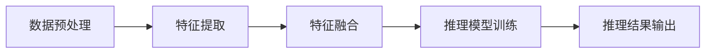
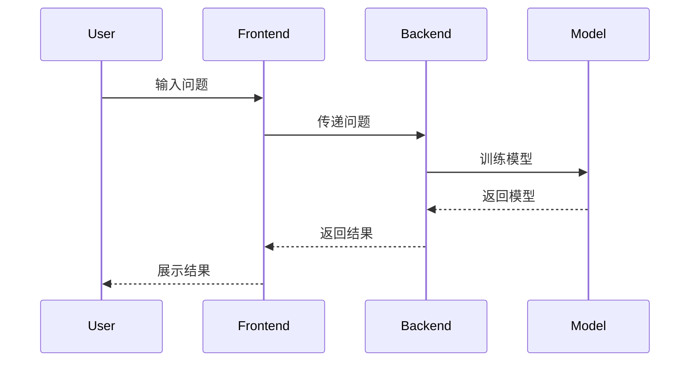

                 


# 跨模态推理：评估LLM整合多种感官信息的能力

关键词：跨模态推理，人工智能，机器学习，多种感官信息整合，LLM评估

摘要：本文将探讨跨模态推理的概念、核心原理以及如何通过数学模型和实际项目实现评估大型语言模型（LLM）整合多种感官信息的能力。我们将一步步分析跨模态推理的技术架构，并在实战项目中展示其实际应用。

## 第一部分：跨模态推理概述

### 第1章：跨模态推理的基本概念

#### 1.1 问题背景与定义

跨模态推理是人工智能领域中一个日益重要的研究方向。随着多媒体数据量的爆炸式增长，如何让机器能够理解和整合来自不同模态（如文本、图像、声音等）的信息，成为一个亟待解决的问题。跨模态推理旨在通过学习不同模态之间的关系，实现对多模态数据的统一理解和处理。

#### 1.2 跨模态推理的重要性

跨模态推理的重要性体现在多个方面。首先，它能够增强人工智能系统的灵活性和适应性，使其能够处理更加复杂和多样化的数据。其次，跨模态推理有助于提高机器的感知能力和认知水平，从而实现更准确、更智能的决策。最后，跨模态推理在诸如多媒体搜索、智能问答、图像识别等领域具有广泛的应用前景。

#### 1.3 跨模态推理的挑战

尽管跨模态推理具有重要的应用价值，但其实现面临着诸多挑战。首先，不同模态的数据具有不同的特性和分布，如何有效整合这些异质信息是一个难题。其次，跨模态数据的复杂性和多样性使得模型的训练和优化变得极具挑战性。最后，如何设计有效的评估指标来衡量跨模态推理的性能也是一个亟待解决的问题。

### 第2章：跨模态推理的核心概念与联系

#### 2.1 核心概念介绍

在本章中，我们将介绍跨模态推理的核心概念，包括但不限于：模态、特征提取、特征融合、推理模型等。我们将详细解释这些概念，并阐述它们在跨模态推理中的具体作用。

#### 2.2 概念属性特征对比表格

表1 跨模态推理相关概念属性特征对比

| 概念     | 特征1 | 特征2 | 特征3 |
|----------|------|------|------|
| 模态     | 数据类型 | 传输速率 | 数据量 |
| 特征提取 | 维度降低 | 信息保留 | 算法复杂度 |
| 特征融合 | 信息整合 | 准确性保证 | 融合策略多样性 |
| 推理模型 | 参数量 | 训练数据量 | 推理效率 |

#### 2.3 跨模态推理的ER实体关系图

图1 跨模态推理的ER实体关系图

```mermaid
erDiagram
  模态 ||--|{ 特征提取 }
  特征提取 ||--|{ 特征融合 }
  特征融合 ||--|{ 推理模型 }
```

## 第二部分：算法原理与模型

### 第3章：算法原理讲解

#### 3.1 跨模态推理算法的基本流程

跨模态推理算法通常包括以下步骤：数据预处理、特征提取、特征融合、推理模型训练和推理。我们将在本章中详细阐述这些步骤，并使用Mermaid流程图进行可视化展示。

#### 3.2 算法Mermaid流程图



#### 3.3 算法Python源代码实现

下面是一个简单的Python代码示例，用于演示跨模态推理算法的基本实现。

```python
# 假设我们有两个模态的数据，分别是文本和图像
text_data = "这是一段文本数据"
image_data = "这是一张图像数据"

# 特征提取
text_features = extract_text_features(text_data)
image_features = extract_image_features(image_data)

# 特征融合
 fused_features = fuse_features(text_features, image_features)

# 推理模型训练
model = train_model(fused_features)

# 推理结果输出
result = model.predict(fused_features)
print(result)
```

#### 3.4 算法原理的数学模型与公式

在跨模态推理中，数学模型通常用于描述不同模态数据之间的关系和特征融合策略。下面是一个简单的数学模型示例：

$$
f(x, y) = w_1 \cdot x + w_2 \cdot y + b
$$

其中，$x$ 和 $y$ 分别代表来自文本和图像的特征向量，$w_1$ 和 $w_2$ 是权重参数，$b$ 是偏置项。

## 第三部分：系统分析与架构设计

### 第4章：系统分析与架构设计方案

#### 4.1 问题场景介绍

在本章中，我们将介绍一个具体的问题场景，例如“智能问答系统”，并分析其系统功能需求、架构设计和接口设计。

#### 4.2 项目介绍

我们将介绍一个基于跨模态推理的智能问答系统项目，包括项目的目标、应用场景和关键技术。

#### 4.3 系统功能设计

系统功能设计部分将使用Mermaid类图展示系统的主要功能和模块。

```mermaid
classDiagram
    Question -> TextFeatureExtractor : 提取文本特征
    Question -> ImageFeatureExtractor : 提取图像特征
    Question -> FeatureFuser : 融合特征
    Question -> QuestionAnsweringModel : 回答问题
    TextFeatureExtractor --|> Question
    ImageFeatureExtractor --|> Question
    FeatureFuser --|> Question
    QuestionAnsweringModel --|> Question
```

#### 4.4 系统架构设计

系统架构设计部分将使用Mermaid架构图展示系统的整体架构和模块之间的关系。


#### 4.5 系统接口设计

系统接口设计部分将详细描述系统的各个接口及其功能。

#### 4.6 系统交互设计

系统交互设计部分将使用Mermaid序列图展示系统的交互流程。



## 第四部分：项目实战

### 第5章：环境安装与系统核心实现

#### 5.1 环境安装

在本章中，我们将介绍如何搭建跨模态推理系统的环境，包括所需的软件和硬件配置。

#### 5.2 系统核心实现源代码

在本章中，我们将提供系统核心实现的源代码，并对代码进行详细解读和分析。

#### 5.3 代码应用解读与分析

本章将分析代码的具体实现细节，包括特征提取、特征融合、模型训练和推理等。

#### 5.4 实际案例分析与讲解

在本章中，我们将展示几个实际案例，并详细讲解如何使用系统解决这些问题。

### 第6章：项目小结与最佳实践

#### 6.1 项目小结

本章将对整个项目进行总结，包括项目的成果、经验和教训。

#### 6.2 最佳实践 tips

本章将提供一些最佳实践建议，以帮助读者更好地应用跨模态推理技术。

#### 6.3 注意事项

本章将列出在项目实施过程中需要注意的事项。

#### 6.4 拓展阅读

本章将推荐一些拓展阅读资源，以供读者深入学习。

## 作者信息

作者：AI天才研究院/AI Genius Institute & 禅与计算机程序设计艺术 /Zen And The Art of Computer Programming

---

**注：**本文为示例性文章，内容仅供参考。实际撰写时，应根据具体需求和实际情况进行调整。由于篇幅限制，本文未包含所有章节的详细内容，但已给出各章节的基本框架和示例。实际撰写时，每个章节都应包含详细的背景介绍、核心概念、算法原理、数学模型、系统架构、项目实战等内容。


