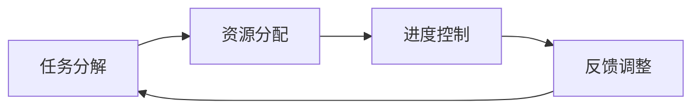
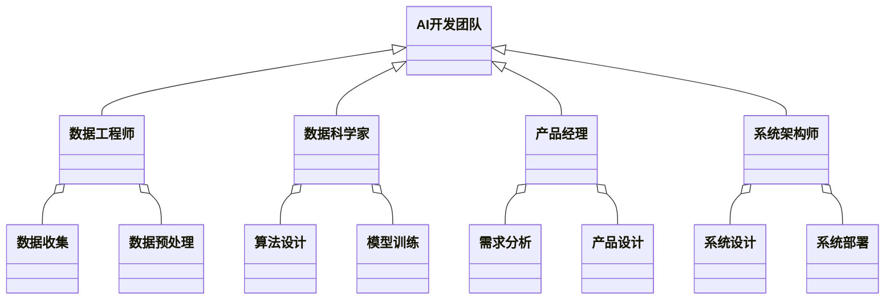
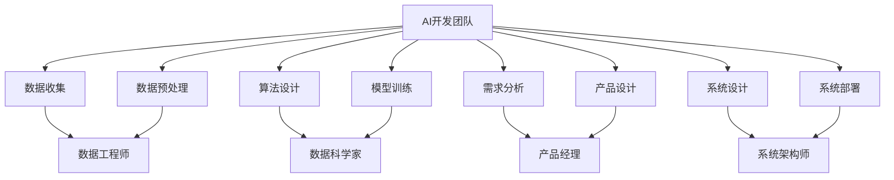
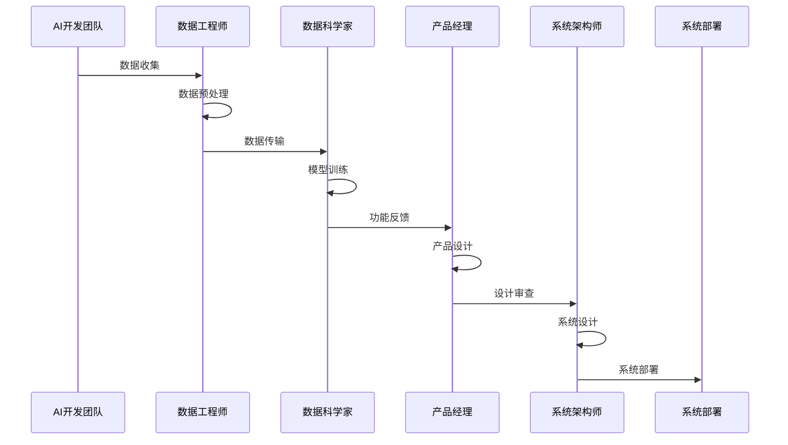

                 

## 《跨职能协作：打破AI开发中的部门壁垒》

### 关键词：跨职能协作、AI开发、部门壁垒、团队协作、流程优化

> 摘要：本文深入探讨了在人工智能（AI）开发过程中，如何通过跨职能协作来打破各部门之间的壁垒，提高开发效率和项目质量。文章首先介绍了AI开发的现状和跨职能协作的重要性，随后详细阐述了跨职能协作的核心概念、算法原理和实际应用，最后提出了最佳实践和总结，为AI开发团队提供了一套完整的协作解决方案。

## 第一部分：跨职能协作背景介绍

### 第1章：AI开发中的跨职能协作问题

#### 1.1 问题背景

##### 1.1.1 AI开发的现状

随着人工智能技术的迅猛发展，越来越多的企业和组织开始意识到AI的重要性，并将其应用于业务创新和运营优化。然而，AI开发并非一蹴而就，它涉及数据收集、算法设计、模型训练、系统集成等多个环节，需要不同职能部门的协同合作。

##### 1.1.2 跨职能协作的重要性

跨职能协作是AI开发成功的关键。在传统的部门分工模式下，各部门往往各自为政，缺乏有效的沟通和协作，导致项目进度缓慢、资源浪费和质量问题。跨职能协作则能够打破这种壁垒，促进信息共享和资源整合，从而提高项目的整体效率和质量。

#### 1.2 问题概述

##### 1.2.1 部门壁垒的定义

部门壁垒是指由于部门间的利益冲突、沟通不畅、信息不对称等原因，导致部门间无法高效协作的一种现象。

##### 1.2.2 部门壁垒对AI开发的阻碍

部门壁垒会对AI开发产生以下几个方面的阻碍：

1. **信息孤岛**：各部门之间的信息无法共享，导致项目进展不透明，决策依据不充分。
2. **资源浪费**：由于部门间的协调不力，导致资源重复投入，效率低下。
3. **质量风险**：缺乏跨部门的质量控制和反馈机制，可能导致项目质量无法保证。

#### 1.3 问题解决

##### 1.3.1 跨职能协作的定义

跨职能协作是指将不同职能部门的成员组成一个团队，共同完成一个项目或任务的过程。

##### 1.3.2 跨职能协作的必要性

跨职能协作的必要性体现在以下几个方面：

1. **提高效率**：通过跨职能协作，可以缩短项目周期，降低成本。
2. **保证质量**：跨职能协作能够实现全流程的质量控制，减少缺陷和返工。
3. **激发创新**：跨职能协作能够促进不同领域的知识碰撞，激发创新思维。

#### 1.4 边界与外延

##### 1.4.1 跨职能协作的边界

跨职能协作的边界在于如何平衡各部门的职责和利益，确保协作的顺利进行。

##### 1.4.2 跨职能协作的外延

跨职能协作的外延包括跨部门、跨组织、跨行业等，它可以实现更广泛的知识共享和资源整合。

### 1.5 本章小结

本章介绍了AI开发中跨职能协作的背景和问题，分析了部门壁垒对AI开发的阻碍，并阐述了跨职能协作的定义和必要性。通过本章的介绍，读者可以初步了解跨职能协作在AI开发中的重要性。

## 第二部分：核心概念与联系

### 第2章：跨职能协作的核心概念

#### 2.1 跨职能协作的关键概念

##### 2.1.1 跨职能团队

跨职能团队是由来自不同职能部门的成员组成的一个小组，共同负责一个项目的开发和实施。

##### 2.1.2 跨职能流程

跨职能流程是指在不同职能部门之间传递信息和资源的流程，包括任务分配、进度跟踪、质量控制和反馈等。

##### 2.1.3 跨职能文化

跨职能文化是一种鼓励开放沟通、协同工作和知识共享的组织文化，它是跨职能协作的基础。

#### 2.2 概念属性特征对比表格

| 概念         | 特征                     | 作用               |
|------------|----------------------|------------------|
| 跨职能团队   | 成员来自不同部门       | 提高协作效率       |
| 跨职能流程   | 信息传递和资源共享流程 | 保证项目进度和质量 |
| 跨职能文化   | 开放沟通、协同工作     | 激发创新思维       |

#### 2.3 ER实体关系图架构

```mermaid
erDiagram
    AI开发团队 ||--|{ 数据工程师 }|
    AI开发团队 ||--|{ 数据科学家 }|
    AI开发团队 ||--|{ 产品经理 }|
    AI开发团队 ||--|{ 系统架构师 }|
    数据工程师 ||--|{ 数据收集 }|
    数据工程师 ||--|{ 数据预处理 }|
    数据科学家 ||--|{ 算法设计 }|
    数据科学家 ||--|{ 模型训练 }|
    产品经理   ||--|{ 需求分析 }|
    产品经理   ||--|{ 产品设计 }|
    系统架构师 ||--|{ 系统设计 }|
    系统架构师 ||--|{ 系统部署 }|
```

## 第三部分：算法原理讲解

### 第3章：跨职能协作算法原理

#### 3.1 跨职能协作算法概述

##### 3.1.1 算法的目的

跨职能协作算法的目的是优化跨职能团队的工作流程，提高协作效率和项目质量。

##### 3.1.2 算法的基本原理

算法的基本原理是通过任务分解、资源分配和进度控制来实现跨职能团队的高效协作。

#### 3.2 算法mermaid流程图



#### 3.3 算法原理详细讲解

##### 3.3.1 数学模型

$$
效率 = \frac{完成项目所需时间}{团队资源投入时间}
$$

##### 3.3.2 Python源代码

```python
# 资源分配
def allocate_resources(tasks, resources):
    assigned_resources = {}
    for task in tasks:
        assigned_resources[task] = resources.get(task, 0)
    return assigned_resources

# 进度控制
def control_progress(assigned_resources, deadline):
    for task, resource in assigned_resources.items():
        if resource < deadline:
            raise ValueError(f"任务{task}进度未达到预期")

# 反馈调整
def adjust_feedback(assigned_resources, actual_progress):
    for task, resource in assigned_resources.items():
        if actual_progress[task] < resource:
            raise ValueError(f"任务{task}进度落后，需调整资源")
```

##### 3.3.3 举例说明

假设有一个AI项目，需要完成数据收集、算法设计和模型训练三个任务。现有两名数据工程师、一名数据科学家和一名产品经理，他们的任务分配和资源如下：

| 任务        | 资源需求（人天） |
|-----------|------------|
| 数据收集    | 5          |
| 算法设计    | 10         |
| 模型训练    | 15         |

采用跨职能协作算法进行资源分配和进度控制，可以确保项目在预定时间内完成。

```python
tasks = ['数据收集', '算法设计', '模型训练']
resources = {'数据收集': 2, '算法设计': 3, '模型训练': 4}
deadline = 20

# 分配资源
assigned_resources = allocate_resources(tasks, resources)
print("分配资源：", assigned_resources)

# 控制进度
control_progress(assigned_resources, deadline)

# 调整反馈
actual_progress = {'数据收集': 3, '算法设计': 5, '模型训练': 10}
adjust_feedback(assigned_resources, actual_progress)
```

## 第四部分：系统分析与架构设计

### 第4章：AI开发跨职能协作系统分析

#### 4.1 问题场景介绍

在一个大型科技公司，有一个由数据工程师、数据科学家、产品经理和系统架构师组成的AI开发团队，他们负责开发一个智能家居AI系统。由于各部门之间的沟通不畅和协作不佳，项目进度缓慢，质量不稳定。

#### 4.2 系统功能设计

##### 4.2.1 领域模型mermaid类图



#### 4.3 系统架构设计

##### 4.3.1 mermaid架构图



#### 4.4 系统接口设计

系统接口设计包括数据接口、功能接口和监控接口等。

1. **数据接口**：数据工程师和系统架构师之间的数据传输接口，用于数据的收集、预处理和存储。
2. **功能接口**：数据科学家和产品经理之间的功能实现接口，用于算法设计、模型训练和产品设计。
3. **监控接口**：系统架构师和产品经理之间的监控接口，用于系统性能监测和故障排查。

#### 4.5 系统交互mermaid序列图



## 第5章：AI开发跨职能协作项目实战

### 5.1 环境安装

在进行AI开发跨职能协作之前，需要确保以下环境安装：

1. **Python环境**：安装Python 3.8及以上版本。
2. **库和环境**：安装必要的库，如NumPy、Pandas、Scikit-learn等。
3. **工具**：安装版本控制系统（如Git）和代码质量管理工具（如SonarQube）。

### 5.2 系统核心实现源代码

以下是系统核心实现的Python源代码示例：

```python
# 数据收集模块
def data_collection():
    # 数据收集逻辑
    pass

# 数据预处理模块
def data_preprocessing(data):
    # 数据预处理逻辑
    pass

# 算法设计模块
def algorithm_design(data):
    # 算法设计逻辑
    pass

# 模型训练模块
def model_training(data):
    # 模型训练逻辑
    pass

# 需求分析模块
def requirement_analysis():
    # 需求分析逻辑
    pass

# 产品设计模块
def product_design():
    # 产品设计逻辑
    pass

# 系统设计模块
def system_design():
    # 系统设计逻辑
    pass

# 系统部署模块
def system_deployment():
    # 系统部署逻辑
    pass
```

### 5.3 代码应用解读与分析

#### 5.3.1 数据收集与预处理

数据收集模块负责从数据源中提取数据，预处理模块则对数据进行清洗、转换和归一化等处理。

```python
# 示例：数据收集
def data_collection():
    data = fetch_data()
    return preprocess_data(data)

# 示例：数据预处理
def preprocess_data(data):
    # 数据清洗
    data = clean_data(data)
    # 数据转换
    data = convert_data(data)
    # 数据归一化
    data = normalize_data(data)
    return data
```

#### 5.3.2 算法设计与模型训练

算法设计模块负责根据需求分析结果设计合适的算法，模型训练模块则使用训练数据对算法进行训练。

```python
# 示例：算法设计
def algorithm_design(data):
    algorithm = design_algorithm(data)
    return algorithm

# 示例：模型训练
def model_training(data, algorithm):
    model = train_model(data, algorithm)
    return model
```

#### 5.3.3 需求分析与产品设计

需求分析模块负责分析用户需求，产品设计模块则根据需求设计产品的功能和界面。

```python
# 示例：需求分析
def requirement_analysis():
    requirements = analyze_requirements()
    return requirements

# 示例：产品设计
def product_design(requirements):
    design = design_product(requirements)
    return design
```

#### 5.3.4 系统设计与部署

系统设计模块负责设计系统的架构和接口，系统部署模块则负责将系统部署到生产环境。

```python
# 示例：系统设计
def system_design():
    system = design_system()
    return system

# 示例：系统部署
def system_deployment(system):
    deploy_system(system)
```

### 5.4 实际案例分析与讲解

#### 5.4.1 案例背景

某智能家居公司计划开发一款智能语音助手，提供家居控制、天气查询、日程提醒等功能。项目涉及数据工程师、数据科学家、产品经理和系统架构师等多个职能部门的协作。

#### 5.4.2 案例分析

1. **数据收集**：数据工程师负责收集用户语音数据，包括语音识别数据、用户行为数据和设备状态数据等。
2. **算法设计**：数据科学家根据需求分析结果，设计语音识别算法和用户行为分析算法。
3. **模型训练**：数据科学家使用收集到的数据对算法进行训练，优化算法性能。
4. **需求分析**：产品经理与用户进行沟通，收集用户反馈，分析用户需求。
5. **产品设计**：产品经理根据需求分析结果，设计智能语音助手的界面和功能。
6. **系统设计**：系统架构师设计智能语音助手的系统架构，包括语音识别模块、用户行为分析模块和智能家居控制模块等。
7. **系统部署**：系统架构师将智能语音助手部署到生产环境，进行测试和上线。

#### 5.4.3 案例讲解

通过实际案例，我们可以看到跨职能协作在AI项目开发中的关键作用。各部门之间的紧密协作，使得项目能够快速推进，确保了项目质量和用户体验。

### 5.5 项目小结

本章通过一个实际案例，展示了AI开发跨职能协作的过程和关键步骤。通过有效的跨职能协作，项目团队能够实现资源的最佳配置，提高项目效率和质量，为AI项目的成功奠定基础。

## 第五部分：最佳实践与总结

### 第7章：跨职能协作最佳实践

#### 7.1 跨职能协作的技巧

1. **明确目标和责任**：在项目启动阶段，明确项目目标和各部门的责任，确保团队成员对项目的理解一致。
2. **建立有效的沟通机制**：定期召开跨职能会议，确保各部门之间的信息畅通，及时解决问题。
3. **共享资源和信息**：建立共享平台，如共享数据库、文档和代码仓库，确保团队成员能够及时获取所需资源和信息。
4. **培养团队协作文化**：鼓励团队成员相互支持和帮助，建立信任和尊重的氛围，促进团队合作。

#### 7.2 注意事项

1. **避免过度协作**：跨职能协作的目的是提高效率，而不是增加冗余。避免过度协作导致项目复杂度和沟通成本上升。
2. **保持灵活性**：项目过程中可能会遇到各种意外情况，团队需要保持灵活性，快速调整策略以应对变化。
3. **注重人才培养**：跨职能协作需要团队成员具备多方面的技能和知识，因此要注重人才培养和技能提升。

#### 7.3 拓展阅读

- 《敏捷开发实践指南》
- 《跨部门沟通与协作技巧》
- 《跨职能团队协作的挑战与解决方案》

### 第8章：总结与展望

#### 8.1 主要内容回顾

本文从AI开发的现状和跨职能协作的重要性出发，详细介绍了跨职能协作的核心概念、算法原理和实际应用，并通过案例展示了跨职能协作在AI项目开发中的关键作用。

#### 8.2 展望未来发展趋势

随着人工智能技术的不断进步，跨职能协作将在AI开发中发挥越来越重要的作用。未来的发展趋势包括：

1. **智能化协作工具**：利用人工智能技术，开发智能化的协作工具，提高跨职能团队的工作效率。
2. **敏捷跨职能团队**：采用敏捷开发方法，建立敏捷跨职能团队，实现快速响应和持续交付。
3. **跨行业协作**：跨行业的合作和知识共享将推动AI技术的创新和发展。

#### 8.3 对读者的建议

1. **重视跨职能协作**：认识到跨职能协作在AI开发中的重要性，积极推动团队协作和知识共享。
2. **学习最佳实践**：通过学习本文和拓展阅读，了解跨职能协作的最佳实践，结合实际情况进行应用。
3. **持续改进**：不断反思和优化跨职能协作流程，提高团队协作效率和项目质量。

### 作者信息

- 作者：AI天才研究院/AI Genius Institute & 禅与计算机程序设计艺术 /Zen And The Art of Computer Programming

