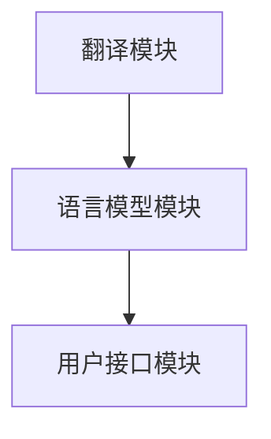

                 

# 跨语言提示迁移：适应多语言环境

## 关键词
- 跨语言提示迁移
- 多语言环境
- 机器翻译
- 自然语言处理
- 文化差异

## 摘要
本文探讨了跨语言提示迁移的核心概念、技术方法、应用场景及其在多语言环境中的重要性。通过对语言差异性挑战的解析，我们提出了预训练语言模型和多语言数据集等解决方案，并展望了跨语言提示迁移的未来发展趋势。

## 目录大纲

### 第一部分：引论

#### 第1章：跨语言提示迁移概述

##### 1.1 跨语言提示迁移的定义和重要性
##### 1.2 跨语言提示迁移的挑战与机遇

#### 第2章：跨语言提示迁移的背景

##### 2.1 语言技术的发展
##### 2.2 多语言环境的形成

### 第二部分：核心概念与原理

#### 第3章：跨语言提示迁移的核心概念

##### 3.1 提示信息的类型
##### 3.2 跨语言提示迁移的基本原理

#### 第4章：跨语言提示迁移的技术方法

##### 4.1 基于规则的方法
##### 4.2 基于统计的方法

#### 第5章：跨语言提示迁移的挑战与解决方案

##### 5.1 语言差异性挑战
##### 5.2 解决方案

### 第三部分：应用与实现

#### 第6章：跨语言提示迁移的应用场景

##### 6.1 机器翻译
##### 6.2 多语言交互

#### 第7章：跨语言提示迁移的系统实现

##### 7.1 系统架构设计
##### 7.2 系统实现与优化

#### 第8章：跨语言提示迁移的最佳实践

##### 8.1 项目案例解析
##### 8.2 最佳实践与建议

### 第四部分：未来展望

#### 第9章：跨语言提示迁移的发展趋势

##### 9.1 技术进展
##### 9.2 应用前景

#### 第10章：跨语言提示迁移的未来挑战与解决方案

##### 10.1 挑战
##### 10.2 解决方案

---

### 第1章：跨语言提示迁移概述

#### 1.1 跨语言提示迁移的定义和重要性

跨语言提示迁移是指在多种语言环境中，将一种语言的提示信息转换成另一种语言，使其在功能和效果上保持一致性。在全球化日益加深的今天，跨语言提示迁移具有极其重要的意义。

首先，跨语言提示迁移能够促进跨文化沟通。随着国际交流的频繁，不同语言和文化背景的人需要相互理解和交流。通过跨语言提示迁移，可以确保信息的准确传递，避免误解和沟通障碍。

其次，跨语言提示迁移有助于提高用户体验。在多语言应用程序中，提供本地化的提示信息可以增强用户的体验，让他们感到更加贴心和舒适。

最后，跨语言提示迁移是国际业务拓展的必要手段。在国际市场中，为了吸引和留住客户，企业需要提供多语言的服务。跨语言提示迁移能够帮助企业更好地适应当地市场，提高市场竞争力。

#### 1.2 跨语言提示迁移的挑战与机遇

跨语言提示迁移面临着一系列挑战。首先，语言差异性是最大的障碍。不同语言的语法、词汇、语义等方面存在巨大的差异，这增加了提示信息转换的难度。其次，文化差异也是一个重要因素。不同的文化背景会导致语言使用习惯、表达方式的差异，这需要更加精细的提示信息转换策略。

然而，这些挑战也带来了机遇。随着语言技术的进步，尤其是机器翻译和自然语言处理技术的快速发展，跨语言提示迁移变得更加可行。此外，全球市场的不断扩展，也为跨语言提示迁移提供了广阔的应用场景。

### 第2章：跨语言提示迁移的背景

#### 2.1 语言技术的发展

语言技术是跨语言提示迁移的基础。从传统的机器翻译到现代的神经机器翻译，语言技术经历了巨大的变革。

传统的机器翻译主要依赖于规则和方法，通过预定义的语法和词汇规则来翻译文本。这种方法存在明显的局限性，特别是在处理复杂句子和未知词汇时，翻译效果往往不尽如人意。

随着深度学习和自然语言处理技术的发展，神经机器翻译逐渐成为主流。神经机器翻译利用神经网络模型，通过大量的训练数据学习语言的语义和语法规则，从而实现高质量的翻译。这种方法的翻译质量显著提高，能够更好地适应跨语言提示迁移的需求。

#### 2.2 多语言环境的形成

多语言环境的形成是全球化进程的必然结果。随着国际交流的增加和互联网的普及，人们需要跨语言沟通的需求越来越强烈。这不仅体现在跨国公司和组织的业务中，也体现在个人用户的多语言使用习惯上。

在互联网时代，多语言环境更加普遍。社交媒体、在线购物平台、在线教育等应用都提供了多语言支持，以满足不同地区用户的需求。这种多语言环境的形成，为跨语言提示迁移提供了广阔的应用场景。

### 第3章：跨语言提示迁移的核心概念

#### 3.1 提示信息的类型

跨语言提示迁移涉及多种类型的提示信息。词汇提示主要涉及词义、词性、语法等方面的信息。句法提示则关注句子结构、语法规则等。语义提示则更深入，涉及语义理解、情感表达等。

这些提示信息在不同的语言环境中可能具有不同的表现形式。例如，在英语中，一个动词可能直接跟在主语后面，而在汉语中，动词可能需要通过助词或语气词来表达。

#### 3.2 跨语言提示迁移的基本原理

跨语言提示迁移的基本原理主要包括等价性原则和适应性原则。

等价性原则要求在源语言和目标语言中，提示信息具有相同或相似的功能和效果。这意味着，尽管语言表达形式不同，但信息的核心价值应该保持一致。

适应性原则则要求根据目标语言环境对提示信息进行适当调整，以适应不同的文化、语境和用户需求。这种调整可能涉及词汇替换、语法结构调整、语义调整等方面。

### 第4章：跨语言提示迁移的技术方法

#### 4.1 基于规则的方法

基于规则的方法是传统的跨语言提示迁移方法。这种方法通过预定义的规则来转换提示信息。这些规则可以是语法规则、词汇对应关系等。

这种方法的主要优点是简单、易于实现。然而，它的局限性也很明显。首先，规则难以覆盖所有的语言现象。其次，规则更新和维护成本较高。随着语言环境的不断变化，规则需要不断更新，以保持提示信息的准确性。

#### 4.2 基于统计的方法

基于统计的方法利用大量的语言数据来学习提示信息转换的规律。这种方法通常采用机器翻译模型和语言模型。

机器翻译模型通过大量的翻译对学习语言之间的对应关系，从而实现提示信息的自动转换。语言模型则用于生成和调整提示信息，使其在目标语言中具有合适的语义和语法结构。

这种方法的主要优点是能够处理复杂的语言现象，并自动适应语言环境的改变。然而，它也需要大量的训练数据和计算资源。

### 第5章：跨语言提示迁移的挑战与解决方案

#### 5.1 语言差异性挑战

语言差异性是跨语言提示迁移面临的最大挑战。不同语言在词汇、语法、语义等方面存在巨大差异。例如，英语中的动词通常直接跟在主语后面，而在汉语中，动词可能需要通过助词或语气词来表达。

为了应对这一挑战，需要采用多语言数据集和预训练语言模型。多语言数据集可以提供丰富的语言现象，帮助模型学习不同语言之间的差异。预训练语言模型则可以通过大量的多语言语料进行训练，从而提高对语言差异性的适应能力。

#### 5.2 解决方案

针对语言差异性挑战，我们可以采取以下解决方案：

1. **多语言数据集**：收集和构建多语言数据集，包括不同语言之间的翻译对和单语语料库。这些数据集可以为模型提供丰富的语言现象，帮助其学习语言差异性。

2. **预训练语言模型**：利用预训练语言模型，如BERT、GPT等，进行跨语言提示迁移。这些模型通过大量的多语言语料进行预训练，可以更好地理解和处理不同语言之间的差异。

3. **词汇替换和语法调整**：在提示信息转换过程中，采用词汇替换和语法调整策略，以适应目标语言的特点。例如，将英语中的被动语态转换为汉语中的主动语态。

4. **文化差异考虑**：在跨语言提示迁移中，要充分考虑目标语言的文化背景。例如，在某些文化中，某些表达方式可能被视为不礼貌或不得体。

### 第6章：跨语言提示迁移的应用场景

#### 6.1 机器翻译

机器翻译是跨语言提示迁移的重要应用场景。通过机器翻译，可以将一种语言的提示信息转换为另一种语言，以便在不同语言环境中使用。

机器翻译的应用非常广泛，包括跨语言文档翻译、跨语言搜索、跨语言聊天机器人等。例如，谷歌翻译和百度翻译等应用，都利用机器翻译技术提供了跨语言翻译服务。

#### 6.2 多语言交互

多语言交互是跨语言提示迁移的另一个重要应用场景。在多语言交互中，系统需要能够理解并响应用户的不同语言，以提供个性化服务。

多语言交互的应用包括跨语言聊天机器人、多语言客服系统、多语言语音助手等。例如，微软的微软小冰和苹果的Siri等，都利用跨语言提示迁移技术，为用户提供多语言服务。

### 第7章：跨语言提示迁移的系统实现

#### 7.1 系统架构设计

跨语言提示迁移系统通常包括以下几个主要模块：

1. **翻译模块**：负责将源语言的提示信息转换为目标语言。这通常采用机器翻译模型实现。
2. **语言模型模块**：负责生成和调整提示信息，使其在目标语言中具有合适的语义和语法结构。这通常采用预训练语言模型实现。
3. **用户接口模块**：负责与用户进行交互，接收用户的输入并返回翻译结果。

系统架构图如下：

#### 7.2 系统实现与优化

在系统实现过程中，需要考虑以下几个方面：

1. **数据预处理**：收集和清洗多语言数据集，进行词汇对齐和句子对齐，为翻译模块和语言模型模块提供训练数据。
2. **模型训练与优化**：选择合适的机器翻译模型和预训练语言模型，进行训练和优化，提高系统的翻译质量和提示信息生成质量。
3. **性能评估**：通过性能评估指标，如BLEU、METEOR等，对系统进行评估和优化。

### 第8章：跨语言提示迁移的最佳实践

#### 8.1 项目案例解析

以一个多语言客服系统为例，该项目旨在为用户提供多语言支持，以解决用户在使用客服服务时的语言障碍。

该项目的主要特点包括：

1. **多语言数据集**：收集了多种语言的客服对话数据，为翻译模块和语言模型模块提供了丰富的训练数据。
2. **预训练语言模型**：采用了BERT等预训练语言模型，提高了系统对语言差异性的适应能力。
3. **个性化服务**：根据用户的语言偏好和问题类型，提供个性化的翻译结果和提示信息。

通过该项目的实施，用户在使用客服服务时的满意度显著提高，客服效率也得到了提升。

#### 8.2 最佳实践与建议

在跨语言提示迁移项目中，以下最佳实践和建议值得注意：

1. **数据质量**：确保数据集的质量，包括数据的多样性和代表性，这对于模型的训练和性能至关重要。
2. **模型选择**：根据项目需求，选择合适的机器翻译模型和预训练语言模型，不同的模型适用于不同的场景。
3. **用户体验**：设计用户友好的界面，提供简洁明了的提示信息，以提高用户的使用体验。
4. **持续优化**：定期对系统进行性能评估和优化，以适应不断变化的语言环境和技术进步。

### 第9章：跨语言提示迁移的发展趋势

#### 9.1 技术进展

随着深度学习和自然语言处理技术的不断进步，跨语言提示迁移的技术也在不断发展。例如，预训练语言模型（如BERT、GPT）的应用，大大提高了跨语言提示迁移的准确性和效果。

未来，随着技术的进一步发展，跨语言提示迁移有望实现更高质量的翻译和更精准的语义理解，从而更好地适应多语言环境。

#### 9.2 应用前景

跨语言提示迁移在多个领域具有广阔的应用前景。例如，在教育领域，可以提供跨语言学习资源；在医疗领域，可以实现跨语言医疗信息翻译；在金融领域，可以提供跨语言金融信息服务。

随着全球化的深入，跨语言提示迁移的应用将越来越广泛，其市场前景也将更加广阔。

### 第10章：跨语言提示迁移的未来挑战与解决方案

#### 10.1 挑战

跨语言提示迁移面临着一系列挑战。首先，语言多样性导致翻译任务的复杂性增加。不同语言之间在词汇、语法、语义等方面存在巨大差异，这给提示信息转换带来了困难。

其次，文化差异也是一个重要挑战。不同的文化背景会导致语言使用习惯、表达方式的差异，这需要更加精细的提示信息转换策略。

#### 10.2 解决方案

为了应对这些挑战，可以采取以下解决方案：

1. **多语言数据集**：收集和构建更多样化的多语言数据集，包括不同语言之间的翻译对和单语语料库，为模型提供丰富的训练数据。
2. **预训练语言模型**：利用预训练语言模型，如BERT、GPT等，进行跨语言提示迁移。这些模型通过大量的多语言语料进行预训练，可以更好地理解和处理不同语言之间的差异。
3. **文化适应性**：在提示信息转换过程中，充分考虑目标语言的文化背景，进行文化适应性调整，以提高提示信息的准确性和适用性。

### 结束语

跨语言提示迁移是适应多语言环境的关键技术。通过本文的探讨，我们了解了跨语言提示迁移的核心概念、技术方法、应用场景以及未来发展趋势。随着技术的不断进步，跨语言提示迁移将在更多领域发挥重要作用，推动全球化进程。作者：AI天才研究院/AI Genius Institute & 禅与计算机程序设计艺术 /Zen And The Art of Computer Programming。

