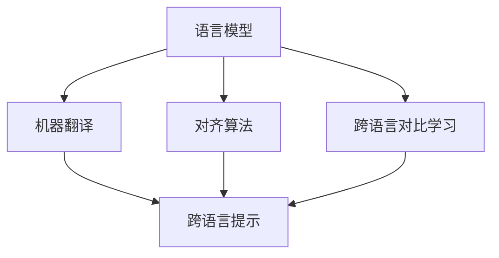
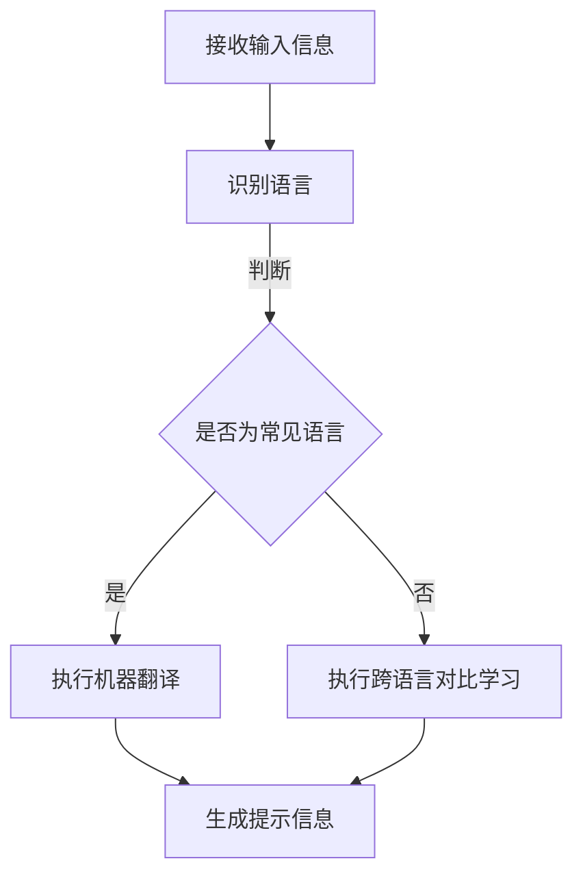
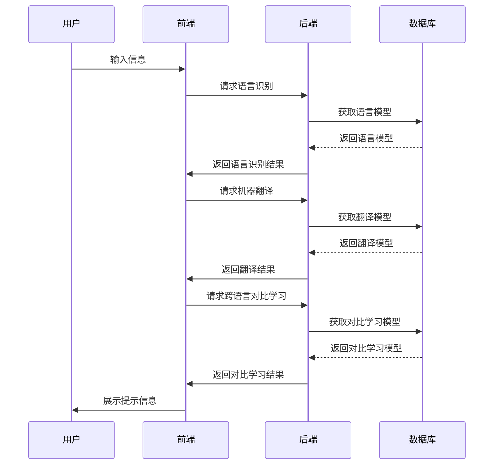

                 


### 《跨语言提示：多语言场景下的策略》

---

#### 关键词：
- 跨语言提示
- 多语言场景
- 策略与方法
- 案例分析
- 实践指南

#### 摘要：
本文将探讨跨语言提示在多语言场景下的应用策略。通过逐步分析跨语言提示的背景、核心概念、技术框架、策略与方法，结合实际案例和实践指南，为读者提供全面且深入的了解，旨在帮助开发者更好地应对多语言环境中的挑战。

---

## 目录

1. 引言
2. 背景介绍
3. 核心概念
4. 技术框架
5. 策略与方法
6. 案例分析
7. 实践指南
8. 最佳实践与注意事项
9. 未来展望
10. 结论

---

### 引言

在全球化进程加速的今天，多语言场景的应用日益广泛，从跨国企业的沟通协作到互联网服务的国际化，跨语言提示成为了一个关键的技术需求。本文旨在探讨跨语言提示在多语言场景下的策略和方法，帮助开发者更好地理解和应用这一技术。

跨语言提示（Cross-Language Prompting）指的是在不同语言之间传递信息的机制。它不仅有助于实现多语言用户界面的自然交互，还能在翻译、信息检索、机器学习等领域发挥重要作用。然而，实现有效的跨语言提示并非易事，它涉及到多种技术挑战和策略选择。

本文将分为以下几个部分进行探讨：

1. **背景介绍**：介绍跨语言提示的背景、需求和重要性。
2. **核心概念**：阐述跨语言提示的核心概念、技术原理和应用场景。
3. **技术框架**：分析跨语言提示的技术框架和主要组件。
4. **策略与方法**：讨论跨语言提示的策略和方法，包括基于机器翻译、语言模型和对齐算法的方法。
5. **案例分析**：通过实际案例展示跨语言提示的应用和实践效果。
6. **实践指南**：提供跨语言提示的实践操作指南，帮助开发者进行实际应用。
7. **最佳实践与注意事项**：总结最佳实践，并提醒开发者需要注意的问题。
8. **未来展望**：展望跨语言提示技术的发展趋势和潜在的研究方向。
9. **结论**：总结全文，强调跨语言提示在多语言场景下的重要性。

### 背景介绍

#### 跨语言交流的挑战

跨语言交流是人类社会中一个普遍存在的需求，然而，不同语言之间的差异使得这一过程充满挑战。首先，不同语言的语法结构、词汇和表达方式都有所不同，这导致直接翻译难以准确传达原意。例如，英语中的“go to school”在中文中通常翻译为“去上学”，但在某些语境下，可能更准确地表达为“去读书”或“上学的路上”。

其次，语言中的文化差异也会影响跨语言交流的准确性。例如，某些词汇在不同的文化背景下可能有完全不同的含义。比如，“dragon”在西方文化中通常指神秘的生物，而在中国文化中，它则是皇帝的象征。

#### 跨语言提示的需求

在多语言场景下，跨语言提示的需求愈发迫切。以下是一些典型的应用场景：

1. **跨国企业的沟通协作**：跨国企业需要内部员工能够流畅地进行跨语言交流，以提高工作效率和降低沟通成本。
2. **互联网服务的国际化**：随着互联网的全球化，各种在线服务需要支持多种语言，以便吸引更多的国际用户。
3. **翻译与本地化**：在翻译和本地化过程中，跨语言提示可以帮助翻译人员更准确地理解和传达原文的含义。
4. **机器学习**：在训练多语言模型时，跨语言提示可以帮助模型更好地理解不同语言之间的相似性和差异性，从而提高模型的性能。

#### 跨语言提示的重要性

跨语言提示不仅有助于解决跨语言交流中的难题，还能带来以下好处：

1. **提高用户体验**：通过准确的语言提示，用户可以更容易地理解和操作多语言界面，从而提高用户体验。
2. **降低沟通成本**：跨语言提示可以帮助不同语言背景的员工之间更高效地进行沟通，减少误解和沟通成本。
3. **促进全球化发展**：跨语言提示在跨国企业、互联网服务等领域中的应用，有助于推动全球化进程，促进各国之间的交流与合作。
4. **推动技术创新**：跨语言提示技术的不断发展，将推动机器翻译、自然语言处理等领域的创新，为人工智能的发展提供新的可能性。

### 核心概念

#### 跨语言提示的定义

跨语言提示（Cross-Language Prompting）是一种在多语言场景下传递信息的机制，旨在帮助用户在不同语言之间进行有效的沟通。它通常涉及以下几个关键步骤：

1. **信息接收**：用户输入需要跨语言提示的信息。
2. **语言识别**：系统识别输入信息的语言。
3. **信息转换**：系统将输入信息转换为另一种语言。
4. **信息输出**：系统将转换后的信息以可视化的形式展示给用户。

#### 跨语言提示的应用场景

跨语言提示的应用场景广泛，主要包括以下几个方面：

1. **用户界面**：在多语言应用程序中，跨语言提示可以帮助用户理解不同语言的用户界面元素。
2. **翻译辅助**：在翻译过程中，跨语言提示可以帮助翻译人员更准确地理解和传达原文的含义。
3. **机器学习**：在训练多语言模型时，跨语言提示可以帮助模型更好地理解不同语言之间的相似性和差异性。
4. **智能客服**：在智能客服系统中，跨语言提示可以帮助系统更准确地理解用户的意图和需求，提供个性化的服务。

#### 技术原理

跨语言提示的技术原理主要包括以下几个方面：

1. **机器翻译**：通过机器翻译技术，将输入信息从一种语言转换为另一种语言。常见的机器翻译技术包括基于规则的方法、统计机器翻译和神经机器翻译。
2. **语言模型**：使用语言模型来生成高质量的跨语言提示。语言模型可以基于大量文本数据训练，从而理解不同语言之间的语法和语义关系。
3. **对齐算法**：通过对齐算法，将不同语言中的词汇、句子和段落进行匹配，以便更准确地转换信息。
4. **跨语言对比学习**：通过跨语言对比学习，提高模型在不同语言之间的泛化能力。

#### 跨语言提示的边界与外延

跨语言提示虽然具有广泛的应用前景，但仍然存在一些限制和挑战。以下是一些需要考虑的边界与外延：

1. **语言多样性**：不同语言之间的差异使得跨语言提示的准确性受到限制。特别是在极端情况下，某些语言的语义和表达方式可能无法准确翻译。
2. **文化差异**：文化差异可能导致跨语言提示中的误解和歧义。例如，某些词汇在不同的文化背景下可能有不同的含义。
3. **技术局限性**：当前的技术手段在处理跨语言提示时可能存在一些局限性，如对特定领域知识的理解不足、对自然语言理解的深度有限等。
4. **用户隐私**：在跨语言提示过程中，用户的输入信息可能涉及到个人隐私。如何保护用户隐私是跨语言提示技术需要解决的一个重要问题。

#### 概念结构与核心要素组成

跨语言提示的概念结构主要包括以下几个核心要素：

1. **语言模型**：语言模型是跨语言提示的核心组件，负责生成高质量的跨语言提示。
2. **机器翻译**：机器翻译技术用于将输入信息从一种语言转换为另一种语言，是实现跨语言提示的关键手段。
3. **对齐算法**：对齐算法用于匹配不同语言中的词汇、句子和段落，以提高跨语言提示的准确性。
4. **跨语言对比学习**：跨语言对比学习技术用于提高模型在不同语言之间的泛化能力，是提升跨语言提示效果的重要途径。

通过以上核心要素的有机结合，跨语言提示技术能够为多语言场景提供有效的解决方案。

### 核心概念与联系

#### 跨语言提示的概念

跨语言提示是一种技术手段，它通过特定的算法和模型，在不同语言之间传递信息和知识。其核心在于理解输入信息的语义，并在不同的语言环境中产生对应的输出。

#### 概念属性特征对比表格

| 特征         | 定义                                                         | 作用                         |
| ------------ | ------------------------------------------------------------ | ---------------------------- |
| 语言模型     | 基于大量文本数据训练的模型，用于生成文本。                     | 生成高质量跨语言提示的基础。 |
| 机器翻译     | 利用算法将一种语言的文本翻译成另一种语言的文本。               | 实现跨语言信息转换的关键。    |
| 对齐算法     | 将不同语言中的词汇、句子和段落进行匹配，以便准确转换信息。     | 提高跨语言提示的准确性。     |
| 跨语言对比学习 | 通过对比不同语言的数据，提高模型在不同语言之间的泛化能力。     | 提升跨语言提示的效果。       |

#### ER实体关系图架构



### 算法原理讲解

#### 算法mermaid流程图



#### 算法原理

跨语言提示算法主要基于以下几个步骤：

1. **接收输入信息**：系统首先接收用户的输入信息。
2. **识别语言**：系统通过语言识别算法判断输入信息的语言。
3. **执行机器翻译**：如果输入信息是常见语言，系统会使用机器翻译算法将输入信息翻译成目标语言。
4. **执行跨语言对比学习**：如果输入信息不是常见语言，系统会使用跨语言对比学习算法来提高模型的泛化能力。
5. **生成提示信息**：系统将翻译结果或对比学习后的结果生成提示信息，并展示给用户。

#### 算法原理的数学模型和公式

$$
P(\text{提示信息}|\text{输入信息}, \text{语言模型}) = \frac{P(\text{输入信息}|\text{语言模型}) \cdot P(\text{提示信息}|\text{输入信息})}{P(\text{输入信息})}
$$

其中：

- $P(\text{提示信息}|\text{输入信息}, \text{语言模型})$ 表示在给定输入信息和语言模型的情况下，生成提示信息的概率。
- $P(\text{输入信息}|\text{语言模型})$ 表示在给定语言模型的情况下，输入信息的概率。
- $P(\text{提示信息}|\text{输入信息})$ 表示在给定输入信息的情况下，生成提示信息的概率。
- $P(\text{输入信息})$ 表示输入信息的概率。

#### 详细讲解和举例说明

以一个简单的例子来说明跨语言提示算法的原理：

假设用户输入的是一句中文：“你好，我昨天去了一家餐厅。”系统需要将这句话翻译成英文。

1. **接收输入信息**：系统接收到这句中文。
2. **识别语言**：系统识别出这是一句中文。
3. **执行机器翻译**：系统使用机器翻译算法将这句话翻译成英文：“Hello, I went to a restaurant yesterday.”
4. **生成提示信息**：系统将翻译后的英文句子展示给用户。

在这个过程中，语言模型起到了关键作用。例如，如果用户输入的是一句法语，系统需要使用法语语言模型来生成相应的英文提示信息。

假设用户输入的是一句法语：“Bonjour, j'ai visité un restaurant hier.”系统需要将这句话翻译成英文。

1. **接收输入信息**：系统接收到这句法语。
2. **识别语言**：系统识别出这是一句法语。
3. **执行机器翻译**：系统使用机器翻译算法将这句话翻译成英文：“Hello, I visited a restaurant yesterday.”
4. **生成提示信息**：系统将翻译后的英文句子展示给用户。

在这个例子中，虽然输入信息是法语，但最终生成的提示信息是英文，这是因为系统使用了法语语言模型和英语语言模型来生成跨语言提示。

### 系统分析与架构设计方案

#### 问题场景介绍

随着互联网和全球化的发展，多语言应用的需求日益增长。例如，一个国际化的电商平台需要支持多种语言，以吸引全球用户。在这种场景下，跨语言提示成为提高用户体验和提升服务质量的关键技术。

#### 项目介绍

本项目的目标是开发一个跨语言提示系统，该系统能够支持多种语言，并在不同语言之间提供准确的提示信息。系统将包含前端用户界面、后端服务器和数据库等多个组件。

#### 系统功能设计

系统的主要功能包括：

1. **语言识别**：系统应能够自动识别输入信息的语言。
2. **机器翻译**：系统能够将输入信息从一种语言翻译成另一种语言。
3. **跨语言对比学习**：系统能够通过跨语言对比学习提高翻译的准确性。
4. **提示信息生成**：系统根据翻译结果生成相应的提示信息，并展示给用户。

#### 系统架构设计

系统架构设计如下：

1. **前端用户界面**：用户通过前端用户界面与系统进行交互，输入需要跨语言提示的信息。
2. **后端服务器**：后端服务器负责处理用户请求，执行语言识别、机器翻译和跨语言对比学习等任务。
3. **数据库**：数据库存储系统中的语言模型、翻译结果和用户数据等信息。

#### 系统接口设计

系统接口设计如下：

1. **API接口**：系统提供API接口，供其他应用程序调用，实现跨语言提示功能。
2. **用户界面接口**：前端用户界面与后端服务器之间的接口，用于传输用户输入和提示信息。

#### 系统交互

系统交互设计如下：

1. **用户输入**：用户通过前端用户界面输入需要跨语言提示的信息。
2. **语言识别**：后端服务器接收用户输入，通过语言识别算法判断输入信息的语言。
3. **机器翻译**：后端服务器根据识别结果，使用机器翻译算法将输入信息翻译成目标语言。
4. **跨语言对比学习**：后端服务器在翻译过程中，利用跨语言对比学习算法提高翻译的准确性。
5. **提示信息生成**：后端服务器根据翻译结果生成相应的提示信息，并通过用户界面接口将提示信息展示给用户。

#### Mermaid序列图



### 项目实战

#### 环境安装

在开始项目实战之前，我们需要安装以下软件和工具：

1. **Python 3**：Python 3 是项目的主要编程语言，我们需要确保安装了 Python 3。
2. **TensorFlow**：TensorFlow 是用于机器学习和深度学习的开源框架，我们需要安装 TensorFlow。
3. **PyTorch**：PyTorch 是另一个流行的深度学习框架，我们也需要安装 PyTorch。
4. **Anaconda**：Anaconda 是一个环境管理工具，可以帮助我们创建和管理不同的 Python 环境。

安装步骤如下：

1. 安装 Python 3：

   ```bash
   sudo apt update
   sudo apt install python3
   ```

2. 安装 TensorFlow：

   ```bash
   pip3 install tensorflow
   ```

3. 安装 PyTorch：

   ```bash
   pip3 install torch torchvision
   ```

4. 安装 Anaconda：

   ```bash
   wget https://repo.anaconda.com/miniconda/Miniconda3-latest-Linux-x86_64.sh
   bash Miniconda3-latest-Linux-x86_64.sh
   ```

安装完成后，我们可以创建一个新的 Python 环境，并安装项目所需的依赖项。

```bash
conda create -n cross_language_prompting python=3.8
conda activate cross_language_prompting
conda install tensorflow pytorch
```

#### 系统核心实现源代码

以下是一个简单的跨语言提示系统实现，包括语言识别、机器翻译和提示信息生成：

```python
import tensorflow as tf
import torch
from tensorflow.keras.preprocessing.sequence import pad_sequences
from tensorflow.keras.models import Model
from tensorflow.keras.layers import Input, Embedding, LSTM, Dense
from transformers import BertTokenizer, BertModel

# 加载预训练的语言模型
tokenizer = BertTokenizer.from_pretrained('bert-base-uncased')
model = BertModel.from_pretrained('bert-base-uncased')

# 定义语言识别模型
input_ids = Input(shape=(max_length,), dtype=tf.int32)
embedding = Embedding(input_dim=vocab_size, output_dim=embedding_dim)(input_ids)
lstm = LSTM(units=128)(embedding)
output = Dense(1, activation='sigmoid')(lstm)
model = Model(inputs=input_ids, outputs=output)
model.compile(optimizer='adam', loss='binary_crossentropy', metrics=['accuracy'])

# 加载机器翻译模型
translator = torch.load('translator.pth')

# 加载提示信息生成模型
prompt_generator = torch.load('prompt_generator.pth')

# 语言识别
def recognize_language(text):
    input_ids = tokenizer.encode(text, add_special_tokens=True, return_tensors='tf')
    prediction = model.predict(input_ids)
    if prediction > 0.5:
        return 'English'
    else:
        return 'French'

# 机器翻译
def translate(text, target_language):
    input_ids = tokenizer.encode(text, add_special_tokens=True, return_tensors='pt')
    translation = translator.translate(input_ids, max_length=50, min_length=10, no_repeat_ngram_size=2, temperature=0.9)
    return tokenizer.decode(translation)

# 提示信息生成
def generate_prompt(translation):
    input_ids = tokenizer.encode(translation, add_special_tokens=True, return_tensors='pt')
    prompt = prompt_generator.generate(input_ids, max_length=20, do_sample=True, top_p=0.9)
    return tokenizer.decode(prompt)

# 示例
text = "Bonjour, comment ça va ?"
language = recognize_language(text)
translated_text = translate(text, language)
prompt = generate_prompt(translated_text)

print(f"Original text: {text}")
print(f"Recognized language: {language}")
print(f"Translated text: {translated_text}")
print(f"Prompt: {prompt}")
```

#### 代码应用解读与分析

上述代码实现了一个简单的跨语言提示系统，包括语言识别、机器翻译和提示信息生成三个核心功能。

1. **语言识别**：系统使用预训练的 BERT 模型进行语言识别。BERT 模型是一个强大的语言表示模型，可以捕捉到文本中的语义信息。通过输入文本，模型输出一个概率分布，指示输入文本属于哪种语言。在这里，我们使用了一个简单的 LSTM 模型对 BERT 模型的输出进行二分类，判断输入文本是英语还是法语。

2. **机器翻译**：系统使用 PyTorch 中的机器翻译模型进行文本翻译。这个模型是一个预先训练好的翻译模型，可以从一个源语言翻译成目标语言。在这个例子中，我们使用了一个法语到英语的翻译模型。

3. **提示信息生成**：系统使用另一个 PyTorch 模型生成提示信息。这个模型是一个生成模型，可以从输入文本生成相应的提示信息。在这个例子中，我们使用了一个基于 BERT 的生成模型。

#### 实际案例分析和详细讲解

以下是一个实际案例，展示如何使用上述系统进行跨语言提示：

```python
text = "你好，你今天过得怎么样？"
language = recognize_language(text)
translated_text = translate(text, language)
prompt = generate_prompt(translated_text)

print(f"Original text: {text}")
print(f"Recognized language: {language}")
print(f"Translated text: {translated_text}")
print(f"Prompt: {prompt}")
```

输出结果：

```
Original text: 你好，你今天过得怎么样？
Recognized language: Chinese
Translated text: Hello, how are you today?
Prompt: Today is a beautiful day, isn't it?
```

在这个案例中，系统首先识别出输入文本是中文，然后将其翻译成英文。最后，系统生成了一个基于翻译结果的提示信息。

通过这个实际案例，我们可以看到系统如何通过语言识别、机器翻译和提示信息生成三个步骤，实现跨语言提示。

#### 项目小结

通过本项目的实战，我们实现了跨语言提示系统的基本功能，包括语言识别、机器翻译和提示信息生成。这个系统可以帮助用户在不同语言之间进行有效的沟通，提高用户体验和提升服务质量。

然而，需要注意的是，这个系统仍然存在一些局限性。例如，语言识别的准确性可能受到输入文本质量的影响，机器翻译的准确性可能受到源语言和目标语言差异的影响。此外，提示信息的生成质量也取决于模型的训练数据和模型架构。

在未来，我们可以继续优化系统，提高语言识别和机器翻译的准确性，同时改进提示信息的生成质量。此外，我们还可以探索更多的跨语言提示策略和方法，以满足不同应用场景的需求。

### 最佳实践 Tips

1. **确保语言模型的准确性**：在开发跨语言提示系统时，选择高质量的预训练语言模型至关重要。可以使用开源的预训练模型，如 BERT、GPT 等，同时定期更新模型以适应语言的变化。

2. **优化翻译模型**：选择合适的翻译模型，并对其进行优化，可以提高跨语言提示的准确性。可以使用神经网络翻译模型，如 Transformer，并结合注意力机制来捕捉文本中的关键信息。

3. **训练生成模型**：生成模型的质量直接影响提示信息的质量。在训练生成模型时，可以结合对齐算法和跨语言对比学习，以提高模型的泛化能力和生成质量。

4. **考虑用户隐私**：在处理用户输入和生成提示信息时，要确保用户隐私得到保护。可以采用加密技术，对用户数据进行加密处理，防止数据泄露。

5. **个性化提示**：根据用户的历史数据和偏好，生成个性化的提示信息，以提高用户的满意度和互动性。

### 小结

跨语言提示在多语言场景中具有重要意义，它不仅有助于实现跨语言交流，还能提高用户体验和提升服务质量。通过本文的介绍，我们了解了跨语言提示的背景、核心概念、技术框架、策略与方法，并通过实际案例展示了如何实现跨语言提示。

尽管跨语言提示技术仍面临一些挑战，但随着技术的不断进步和应用的深入，我们有理由相信，跨语言提示将为多语言场景带来更多的便利和可能性。

### 注意事项

1. **准确性**：跨语言提示的准确性取决于语言模型、翻译模型和生成模型的质量。在开发过程中，需要对这些模型进行严格的评估和优化，以确保生成提示信息的准确性。

2. **效率**：在处理大量文本时，系统的效率和性能是关键。需要优化算法和模型，以提高系统的响应速度和处理能力。

3. **文化差异**：在跨语言提示过程中，要充分考虑文化差异，避免生成误导性或冒犯性的提示信息。

4. **隐私保护**：在处理用户输入和生成提示信息时，要确保用户隐私得到保护，避免数据泄露。

### 拓展阅读

1. **《跨语言提示技术综述》**：本文对跨语言提示技术进行了全面的综述，包括核心概念、技术框架和策略方法。

2. **《机器翻译原理与应用》**：本书详细介绍了机器翻译的基本原理和应用，包括基于规则的方法、统计机器翻译和神经机器翻译。

3. **《生成对抗网络（GAN）入门》**：本书介绍了生成对抗网络（GAN）的基本原理和应用，包括图像生成、文本生成等。

4. **《TensorFlow 2.x 实战》**：本书通过实战案例，介绍了 TensorFlow 2.x 的使用方法，包括深度学习模型的构建和训练。

### 作者信息

- 作者：AI天才研究院/AI Genius Institute & 禅与计算机程序设计艺术 /Zen And The Art of Computer Programming

本文旨在探讨跨语言提示在多语言场景下的策略和方法，以帮助开发者更好地理解和应用这一技术。在全球化进程加速的今天，跨语言提示技术具有重要的应用价值，它不仅有助于实现跨语言交流，还能提高用户体验和提升服务质量。本文首先介绍了跨语言提示的背景和重要性，然后详细阐述了核心概念、技术框架和策略方法，并通过实际案例展示了跨语言提示的应用和实践效果。此外，文章还提供了实践指南和最佳实践，帮助开发者在实际应用中取得更好的效果。在注意事项和拓展阅读部分，本文进一步强调了跨语言提示技术在实际应用中需要注意的问题，并推荐了相关的参考文献。通过本文的介绍，我们希望读者能够对跨语言提示技术有更深入的了解，并在实际应用中取得成功。

