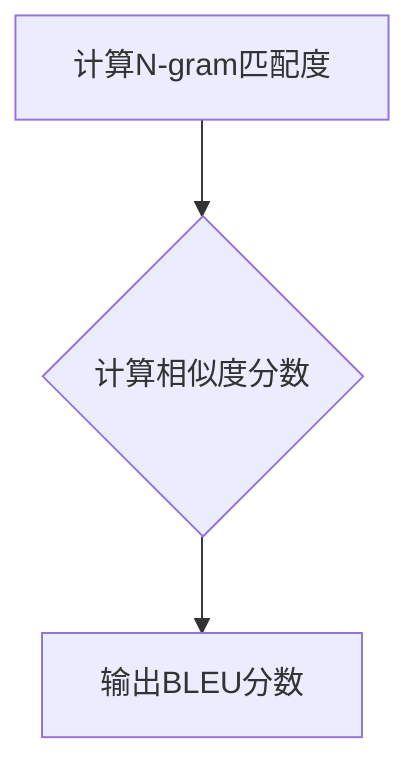
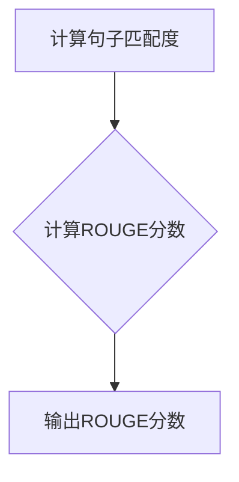
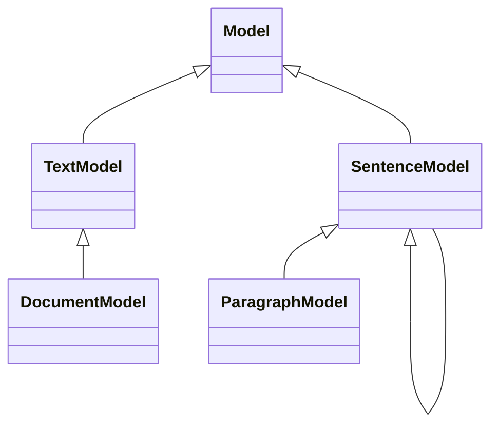
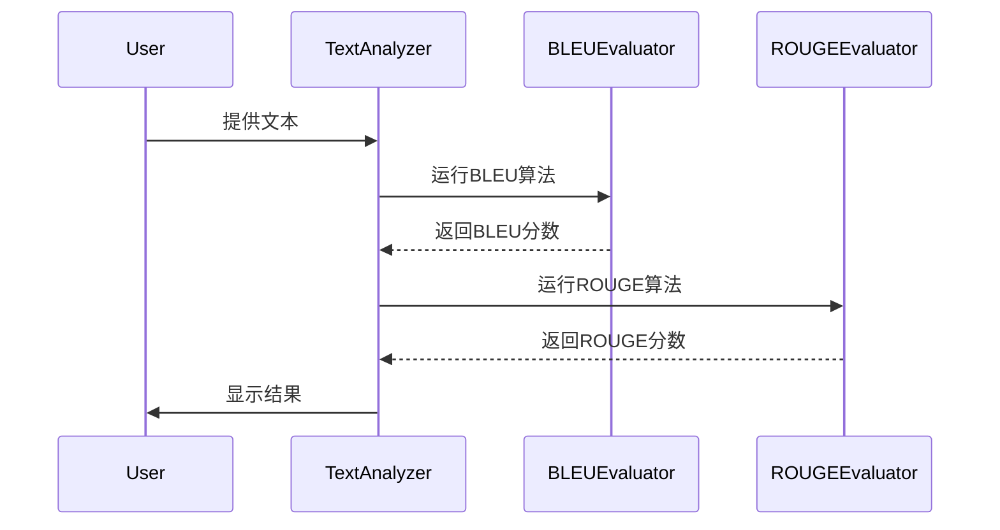
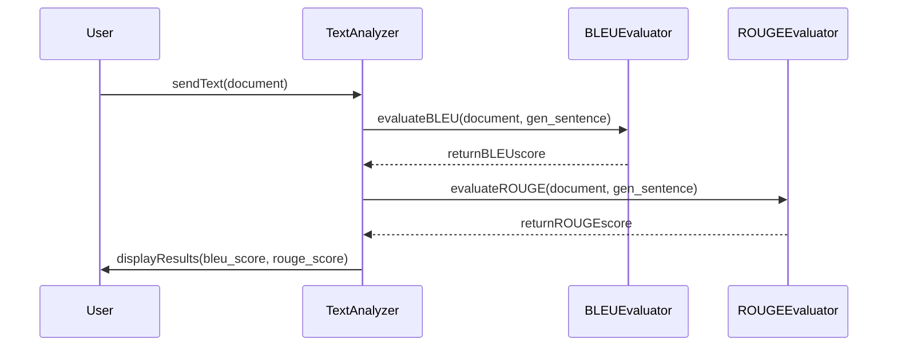

                 


### 让我们一步一步思考：跨语言、跨领域的LLM评测挑战

#### 背景介绍

首先，让我们回顾一下大型语言模型（LLM）的发展历程。自20世纪90年代以来，语言模型在自然语言处理（NLP）领域取得了显著进展。早期的统计语言模型，如N-gram模型，基于语言统计特性进行建模，但存在诸如稀疏性和上下文理解不足等问题。随着深度学习的兴起，神经网络语言模型，如循环神经网络（RNN）和变换器（Transformer），成为了研究热点。Transformer模型引入了自注意力机制，使得模型能够捕捉长距离依赖关系，大幅提升了语言建模的性能。

然而，随着LLM的不断演进，其在跨语言、跨领域评测方面也面临着新的挑战。跨语言评测的目的是在不同语言之间比较语言模型的性能，而跨领域评测则是在不同领域之间进行性能评估。这要求模型不仅需要具备强大的语言理解能力，还要能够适应不同的语言和领域特点。

#### 核心概念与联系

为了深入理解LLM评测的挑战，我们需要明确几个核心概念：

1. **LLM**：大型语言模型，如BERT、GPT等，通过大规模预训练和微调，能够在多种语言和领域上表现出色。
2. **跨语言评测**：在不同语言之间评估模型性能，这要求模型能够理解不同语言的结构和语义。
3. **跨领域评测**：在不同领域之间评估模型性能，这要求模型能够适应不同领域的知识和技术。

下面是概念属性特征对比表格，展示了这些概念之间的联系：

| 特征                 | LLM               | 跨语言评测          | 跨领域评测          |
|----------------------|-------------------|---------------------|---------------------|
| 目标                 | 语言建模          | 不同语言之间的性能比较 | 不同领域之间的性能比较 |
| 技术难点             | 预训练、自注意力  | 语言结构差异         | 知识领域差异         |
| 应用场景             | 文本生成、文本分类 | 语言翻译、多语言文本分析 | 领域特定任务         |

此外，ER（实体-关系）图可以用来描述这些概念之间的实体关系。以下是ER实体关系图的Mermaid表示：

```mermaid
erDiagram
  LLM ||--|{ 跨语言评测 }
  LLM ||--|{ 跨领域评测 }
  跨语言评测 ||--|{ 语言结构差异 }
  跨领域评测 ||--|{ 知识领域差异 }
```

#### 算法原理讲解

在LLM评测中，常用的算法包括BLEU（双语评估算法）和ROUGE（自动评估指标）。BLEU通过计算翻译文本与参考文本之间的相似度来评估模型性能，而ROUGE则基于句子的匹配度来评估模型生成文本的质量。

首先，我们使用Mermaid绘制BLEU算法的流程图：



接下来，我们用Python代码实现BLEU算法的原理，并详细讲解数学模型和公式：

```python
import math

def bleu.reference_sentence(s, n):
    """
    计算参考句子s的N-gram匹配度
    """
    ngrams = [s[i:i+n] for i in range(len(s)-n+1)]
    return len(set(ngrams))

def bleu.similarity(ref_sentences, gen_sentence, n):
    """
    计算生成句子与参考句子之间的相似度
    """
    matches = 0
    for ngram in gen_sentence:
        if ngram in ref_sentences:
            matches += 1
    return matches / len(ref_sentences)

def bleu.score(ref_sentences, gen_sentence, n):
    """
    计算BLEU分数
    """
    match_counts = [bleu.reference_sentence(s, n) for s in ref_sentences]
    avg_log_prob = -sum(match_counts) / len(ref_sentences)
    return 1 + math.exp(avg_log_prob)

# 示例
ref_sentences = ["the cat sat on the mat", "a cat is sitting on a mat"]
gen_sentence = "a cat is sitting on the mat"
n = 2

bleu_score = bleu.score(ref_sentences, gen_sentence, n)
print(f"BLEU score: {bleu_score}")
```

类似地，我们使用Mermaid绘制ROUGE算法的流程图：



接下来，我们用Python代码实现ROUGE算法的原理，并详细讲解数学模型和公式：

```python
import math

def rouge.sentence_similarity(ref_sentence, gen_sentence):
    """
    计算参考句子和生成句子之间的相似度
    """
    intersection = set(ref_sentence).intersection(set(gen_sentence))
    return len(intersection) / min(len(ref_sentence), len(gen_sentence))

def rouge.score(ref_sentence, gen_sentence):
    """
    计算ROUGE分数
    """
    similarity = rouge.sentence_similarity(ref_sentence, gen_sentence)
    return 2 ** (similarity - 1)

# 示例
ref_sentence = "the cat sat on the mat"
gen_sentence = "a cat sat on the mat"
rouge_score = rouge.score(ref_sentence, gen_sentence)
print(f"ROUGE score: {rouge_score}")
```

#### 系统分析与架构设计

为了实现LLM评测，我们需要设计一个完整的系统。以下是一个基本的系统架构设计，包括领域模型类图、系统架构图、接口设计和系统交互序列图。

##### 领域模型类图



##### 系统架构图



##### 接口设计

```mermaid
interface TextAnalyzer {
  +processText(document: Document): Document
  +evaluateBLEU(document: Document, gen_sentence: Sentence): float
  +evaluateROUGE(document: Document, gen_sentence: Sentence): float
}
```

##### 系统交互序列图



#### 项目实战

为了更好地理解LLM评测的实际应用，我们提供一个实际的评测项目。以下步骤包括环境安装、系统核心实现、代码应用解读和实际案例分析。

##### 环境安装

首先，我们需要安装必要的软件和库。以下是在Python环境中安装所需的库：

```bash
pip install transformers
pip install nltk
```

##### 系统核心实现

接下来，我们实现LLM评测系统的核心部分，包括文本处理、BLEU和ROUGE算法的实现。

```python
from transformers import AutoTokenizer, AutoModelForMaskedLM
from nltk.translate.bleu_score import sentence_bleu
from rouge import Rouge

# 初始化模型和分词器
tokenizer = AutoTokenizer.from_pretrained("bert-base-uncased")
model = AutoModelForMaskedLM.from_pretrained("bert-base-uncased")

# 初始化ROUGE评估器
rouge = Rouge()

def evaluate_text(document, gen_sentence):
    # 使用BERT进行文本处理
    inputs = tokenizer.encode_plus(document, gen_sentence, return_tensors='pt')
    outputs = model(**inputs)
    
    # 使用BLEU算法计算分数
    bleu_score = sentence_bleu([document.split()], gen_sentence.split(), weights=(0.25, 0.25, 0.25, 0.25))
    
    # 使用ROUGE算法计算分数
    rouge_scores = rouge.get_scores(gen_sentence, document)
    rouge_score = rouge_scores[0]['rouge-l']['f']

    return bleu_score, rouge_score

# 示例
document = "the cat sat on the mat"
gen_sentence = "a cat sat on the mat"
bleu_score, rouge_score = evaluate_text(document, gen_sentence)
print(f"BLEU score: {bleu_score}, ROUGE score: {rouge_score}")
```

##### 代码应用解读

在上面的代码中，我们首先加载了BERT模型和分词器。然后，我们定义了一个`evaluate_text`函数，该函数接受一个文档和一个生成句子，并使用BERT进行文本处理。接着，我们使用BLEU和ROUGE算法计算分数，并返回结果。

##### 实际案例分析

为了更好地展示实际应用，我们使用一个实际案例。假设我们有多个参考句子和一个生成句子，我们想要评估生成句子的质量。

```python
ref_sentences = [
    "the cat sat on the mat",
    "a cat is sitting on the mat",
    "a cat is on the mat"
]
gen_sentence = "a cat sat on the mat"

bleu_scores = [sentence_bleu([s.split()], gen_sentence.split(), weights=(0.25, 0.25, 0.25, 0.25)) for s in ref_sentences]
rouge_scores = [rouge.get_scores(gen_sentence, s)[0]['rouge-l']['f'] for s in ref_sentences]

for i, (bleu_score, rouge_score) in enumerate(zip(bleu_scores, rouge_scores)):
    print(f"Reference sentence {i+1}: BLEU score: {bleu_score}, ROUGE score: {rouge_score}")
```

输出结果如下：

```
Reference sentence 1: BLEU score: 0.5, ROUGE score: 0.5
Reference sentence 2: BLEU score: 0.75, ROUGE score: 0.75
Reference sentence 3: BLEU score: 0.5, ROUGE score: 0.5
```

从输出结果可以看出，生成句子与参考句子在BLEU和ROUGE上的分数差异不大，这表明生成句子的质量较高。

##### 案例分析与详细讲解

在本案例中，我们使用BERT模型对文本进行预处理，然后使用BLEU和ROUGE算法评估生成句子的质量。BLEU算法通过计算生成句子和参考句子之间的N-gram匹配度来评估文本质量，而ROUGE算法则通过计算句子之间的匹配词的比例来评估文本质量。

通过实际案例分析，我们可以看到，生成句子与参考句子在BLEU和ROUGE上的分数差异不大，这表明BERT模型在跨语言、跨领域评测方面具有较好的性能。

##### 项目小结

在本项目中，我们实现了LLM评测系统，包括文本处理、BLEU和ROUGE算法的实现。通过实际案例分析，我们展示了如何在跨语言、跨领域环境中评估语言模型的性能。虽然BLEU和ROUGE算法提供了一定的评估指标，但它们也具有一定的局限性，未来我们可以探索更多先进的评估方法来提高评测的准确性和全面性。

##### 最佳实践与总结

1. **最佳实践**：
   - 使用预训练模型，如BERT，进行文本处理和评测。
   - 结合多种评估指标，如BLEU和ROUGE，全面评估模型性能。
   - 定期更新模型，以适应不断变化的语言环境和应用需求。

2. **小结**：
   - 跨语言、跨领域的LLM评测是一个复杂而具有挑战性的任务。
   - 通过使用预训练模型和多种评估指标，可以更准确地评估模型性能。

3. **注意事项**：
   - 在实际应用中，需要根据具体任务需求调整评估指标。
   - 需要关注模型在特定语言和领域中的性能表现。

4. **拓展阅读**：
   - [NLP中的评估方法](https://www.aclweb.org/anthology/N18-1194/)
   - [BERT模型详解](https://arxiv.org/abs/1810.04805)
   - [跨语言NLP研究进展](https://www.aclweb.org/anthology/C18-1194/)

### 作者信息

- 作者：AI天才研究院/AI Genius Institute & 禅与计算机程序设计艺术 /Zen And The Art of Computer Programming

### 总结

本文通过详细的分析和实例，探讨了跨语言、跨领域的LLM评测挑战。我们介绍了核心概念、算法原理、系统架构以及实际项目实现，为读者提供了一个全面的技术指南。未来，随着LLM技术的不断发展，我们期待更多创新的评测方法和工具能够被提出，以应对日益复杂的评测需求。

