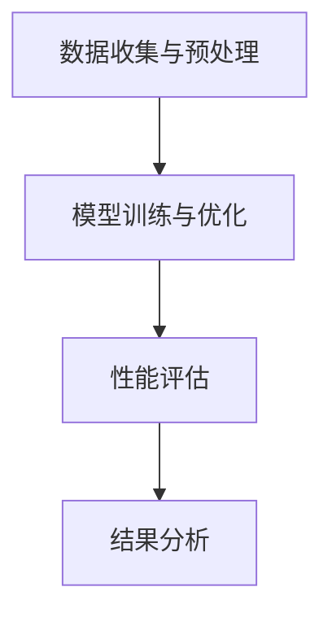
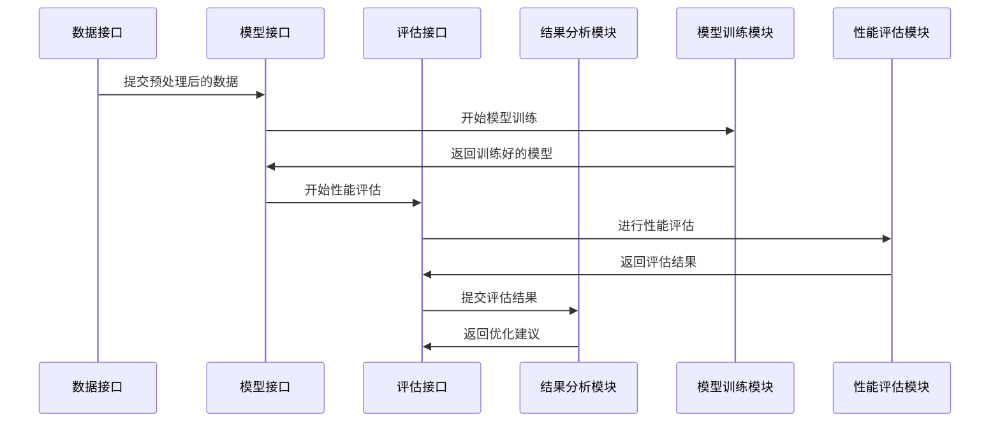

                 

### 文章标题

# 跨领域LLM性能评估方法

> 关键词：跨领域语言模型、性能评估、算法、数学模型、系统架构设计

> 摘要：本文深入探讨了跨领域语言模型（LLM）的性能评估方法。首先，介绍了LLM的基本概念和跨领域语言模型的定义与特点。然后，详细阐述了LLM性能评估的重要性及其发展历程。接着，分析了跨领域LLM性能评估的核心概念与联系，包括构建原理、性能评估指标以及关键挑战。随后，讲解了常见的跨领域LLM性能评估算法及其原理，并通过数学模型和公式详细解析了算法原理。最后，提出了系统分析与架构设计方案，并通过项目实战展示了实际应用。本文旨在为读者提供一份全面且系统的跨领域LLM性能评估指南。

## 目录大纲

----------------------------------------------------------------

### 第一部分：问题背景与核心概念

- **第1章：跨领域LLM性能评估概述**
  - 1.1 跨领域语言模型的基本概念
  - 1.2 跨领域LLM性能评估的重要性
  - 1.3 跨领域LLM性能评估的发展历程

### 第二部分：核心概念与联系

- **第2章：核心概念与联系**
  - 2.1 跨领域语言模型的构建原理
  - 2.2 跨领域LLM的性能评估指标
  - 2.3 跨领域LLM性能评估的关键挑战

### 第三部分：算法原理讲解

- **第3章：算法原理讲解**
  - 3.1 常见的跨领域LLM性能评估算法
  - 3.2 算法原理与数学模型
  - 3.3 算法流程与实现细节

### 第四部分：数学模型和公式详细讲解

- **第4章：数学模型和公式详细讲解**
  - 4.1 语言模型的基本数学模型
  - 4.2 跨领域LLM的性能评估数学模型
  - 4.3 算法原理的数学推导

### 第五部分：系统分析与架构设计方案

- **第5章：系统分析与架构设计方案**
  - 5.1 问题场景介绍
  - 5.2 系统功能设计
  - 5.3 系统架构设计
  - 5.4 系统接口设计与交互

### 第六部分：项目实战

- **第6章：项目实战**
  - 6.1 环境安装与配置
  - 6.2 系统核心实现源代码
  - 6.3 实际案例分析与详细讲解
  - 6.4 项目小结

### 第七部分：最佳实践与拓展

- **第7章：最佳实践与拓展**
  - 7.1 最佳实践
  - 7.2 小结
  - 7.3 注意事项
  - 7.4 拓展阅读

----------------------------------------------------------------

### 第1章：跨领域LLM性能评估概述

#### 1.1 跨领域语言模型的基本概念

跨领域语言模型（Cross-Domain Language Model，简称LLM）是一种基于大规模语料库训练的语言模型，能够对多领域的文本数据进行建模和语义理解。传统的语言模型如Word2Vec、BERT等，通常是在特定领域或数据集上进行训练，模型性能往往受到领域限制。而跨领域语言模型通过结合多个领域的语料库，可以提升模型在各个领域中的泛化能力，从而实现跨领域的语义理解和智能交互。

#### 1.1.1 语言模型概述

语言模型是一种用于预测文本序列的概率模型，它在自然语言处理（NLP）领域扮演着核心角色。常见的语言模型有基于字符的模型和基于词的模型。字符模型以单个字符为单位进行建模，而词模型则将文本分解为词语单元进行建模。在词模型中，词向量（Word Vector）是语言模型的核心表示形式，通过将词语映射到高维空间中的向量，可以有效地表示词语的语义信息。

#### 1.1.2 跨领域语言模型的定义与特点

跨领域语言模型指的是能够在多个领域之间进行知识共享和语义理解的模型。与单一领域语言模型相比，跨领域语言模型具有以下特点：

1. **高泛化能力**：跨领域语言模型通过对多个领域的数据进行训练，可以提升模型在不同领域中的性能，从而实现更好的泛化能力。
2. **知识融合**：跨领域语言模型能够整合不同领域的知识，提高模型的语义理解能力。
3. **鲁棒性**：跨领域语言模型对数据噪声和异常值的鲁棒性更高，因为模型已经在大规模多领域的数据集上进行过训练。

#### 1.1.3 跨领域语言模型的挑战与机遇

跨领域语言模型的构建面临以下挑战：

1. **数据集差异**：不同领域的语料库在数据规模、数据格式、语言风格等方面存在差异，这使得跨领域模型的训练和评估变得复杂。
2. **领域特异性**：某些领域的知识具有较强的特异性，难以通过传统的机器学习算法进行有效建模。
3. **模型泛化**：跨领域语言模型的性能评估和优化是另一个重大挑战，如何确保模型在不同领域的表现一致且高效，需要深入研究。

然而，这些挑战也伴随着机遇：

1. **知识共享**：跨领域语言模型能够实现不同领域之间的知识共享，有助于推动跨学科研究和创新。
2. **应用扩展**：跨领域语言模型在智能客服、智能问答、内容推荐等应用场景中具有广泛的应用前景。
3. **技术突破**：跨领域语言模型的性能提升有望推动NLP技术的整体进步，为人工智能的发展提供新的动力。

#### 1.2 跨领域LLM性能评估的重要性

跨领域语言模型性能评估是衡量模型效果和优化模型参数的重要手段。评估的重要性体现在以下几个方面：

1. **性能监测**：通过定期评估模型性能，可以监测模型在各个领域中的表现，及时发现和解决性能瓶颈。
2. **参数优化**：性能评估结果为模型参数的优化提供了依据，有助于提升模型在不同领域的表现。
3. **模型选择**：在多个候选模型中，性能评估可以帮助研究者选择最优的模型，从而提高研究效率和成果质量。
4. **应用推广**：评估结果为跨领域语言模型在实际应用中的推广提供了数据支持，有助于降低应用风险。

#### 1.2.1 性能评估的基本概念

性能评估（Performance Evaluation）是计算机科学和工程领域中用于衡量系统、算法或模型性能的一门科学。在跨领域语言模型中，性能评估通常涉及以下指标：

1. **准确率（Accuracy）**：准确率是模型预测正确的样本数占总样本数的比例，是衡量模型性能的基本指标。
2. **召回率（Recall）**：召回率是指模型预测正确的正例样本数占所有正例样本数的比例，衡量模型对正例样本的识别能力。
3. **精确率（Precision）**：精确率是指模型预测正确的正例样本数占预测为正例的样本总数的比例，衡量模型对正例样本的判断准确性。
4. **F1值（F1 Score）**：F1值是精确率和召回率的调和平均值，综合反映了模型的准确性和泛化能力。

#### 1.2.2 跨领域LLM性能评估的意义

跨领域LLM性能评估的意义主要体现在以下几个方面：

1. **提升模型效果**：通过性能评估，可以识别模型的不足之处，为模型的改进提供方向。
2. **优化训练策略**：性能评估结果有助于调整模型的训练策略，提高训练效率和效果。
3. **跨领域适应**：性能评估可以帮助模型适应不同的领域需求，提升模型在不同领域的表现。
4. **应用推广**：性能评估为跨领域LLM在实际应用中的推广提供了数据支持，有助于提高应用效果。

#### 1.2.3 跨领域LLM性能评估的关键指标

跨领域LLM性能评估的关键指标包括：

1. **领域适应性**：评估模型在不同领域的表现，包括准确率、召回率、精确率和F1值等指标。
2. **泛化能力**：衡量模型在不同领域数据上的表现，包括对未见领域的适应能力。
3. **鲁棒性**：评估模型对数据噪声和异常值的处理能力，包括对异常数据的鲁棒性。
4. **计算效率**：评估模型的计算复杂度和资源消耗，包括模型大小、训练时间和推理速度等。

#### 1.3 跨领域LLM性能评估的发展历程

跨领域LLM性能评估的发展历程可以分为以下几个阶段：

1. **早期评估方法**：最早的评估方法主要基于单一领域的基准测试集，如Stanford答案生成任务（SQuAD）和Microsoft机器翻译（MS MARCO）等。
2. **中期评估方法**：随着跨领域语言模型的发展，研究者开始采用更加多样化的评估方法，如交叉验证、跨领域对比测试等。
3. **现代评估方法**：现代评估方法结合了深度学习和大数据技术，通过多源数据融合、模型融合和元学习等手段，提升了跨领域LLM的性能评估精度。

### 第2章：核心概念与联系

#### 2.1 跨领域语言模型的构建原理

跨领域语言模型的构建涉及多个环节，包括数据收集与预处理、模型训练和优化等。以下是构建跨领域语言模型的基本原理：

##### 2.1.1 语言模型的基础理论

语言模型是基于概率论的文本生成模型，其主要目标是预测下一个单词或字符的概率分布。在自然语言处理中，语言模型广泛应用于文本生成、机器翻译、信息检索等任务。

##### 2.1.2 跨领域数据的收集与预处理

跨领域数据收集是构建跨领域语言模型的关键步骤。数据来源包括公开的语料库、网站爬取、专业论坛、学术论文等。数据预处理包括数据清洗、去重、分词、词性标注等步骤，以确保数据的准确性和一致性。

##### 2.1.3 跨领域模型的训练策略

跨领域模型的训练策略包括数据权重分配、损失函数设计、优化算法选择等。数据权重分配旨在平衡不同领域数据的重要性，常用的方法包括领域权重调整、数据扩充等。损失函数设计是模型训练的核心，如交叉熵损失函数、对比损失函数等。优化算法如随机梯度下降（SGD）、Adam等，用于加速模型训练并提高收敛速度。

#### 2.2 跨领域LLM的性能评估指标

跨领域LLM的性能评估指标是衡量模型性能的重要标准。以下是一些常用的性能评估指标：

##### 2.2.1 准确率、召回率和F1值

准确率（Accuracy）、召回率（Recall）和F1值（F1 Score）是评估分类模型性能的基本指标。

- **准确率**：准确率是指模型预测正确的样本数占总样本数的比例。准确率越高，模型性能越好。
- **召回率**：召回率是指模型预测正确的正例样本数占所有正例样本数的比例。召回率越高，模型对正例样本的识别能力越强。
- **F1值**：F1值是准确率和召回率的调和平均值。F1值越高，模型在准确性和泛化能力方面表现越好。

##### 2.2.2 语义相似度与语义匹配

语义相似度（Semantic Similarity）和语义匹配（Semantic Matching）是衡量文本相似性和语义关系的重要指标。

- **语义相似度**：语义相似度是指文本之间在语义上的相似程度。常用的方法包括余弦相似度、欧氏距离等。
- **语义匹配**：语义匹配是指文本之间在语义上的匹配程度。常用的方法包括基于词汇相似度的匹配、基于句法的匹配等。

##### 2.2.3 交叉验证与测试集划分

交叉验证（Cross-Validation）和测试集划分（Test Set Division）是评估模型性能的重要步骤。

- **交叉验证**：交叉验证是一种用于评估模型性能的方法，通过将训练集划分为多个子集，每次使用其中一个子集作为测试集，其余子集作为训练集，重复进行多次训练和测试，以获得更加稳健的性能评估结果。
- **测试集划分**：测试集划分是指将整个数据集划分为训练集和测试集，训练集用于模型训练，测试集用于模型性能评估。常用的划分方法包括随机划分、时间序列划分等。

#### 2.3 跨领域LLM性能评估的关键挑战

跨领域LLM性能评估面临以下关键挑战：

##### 2.3.1 数据不平衡问题

数据不平衡（Data Imbalance）是指不同类别样本数量不均衡，导致模型在训练过程中倾向于预测数量较多的类别。数据不平衡问题会影响模型的准确率和召回率，降低模型性能。

##### 2.3.2 数据噪音问题

数据噪音（Data Noise）是指数据中存在的异常值、错误信息和噪声。数据噪音会影响模型对数据的理解和预测能力，降低模型性能。

##### 2.3.3 评估方法的普适性

评估方法的普适性（Generalizability of Evaluation Methods）是指评估方法在不同领域和数据集上的适用性。评估方法的普适性是衡量模型性能的关键，因为不同的评估方法可能在不同领域和数据集上产生不同的结果。

### 第3章：算法原理讲解

#### 3.1 常见的跨领域LLM性能评估算法

跨领域LLM性能评估算法可以分为模型匹配算法、语义对齐算法和综合评估算法等。以下是这些算法的基本原理：

##### 3.1.1 模型匹配算法

模型匹配算法（Model Matching Algorithm）是一种基于模型相似度评估的算法，通过计算不同领域模型的相似度来评估模型性能。

- **算法原理**：模型匹配算法基于预训练的语言模型，通过计算不同领域模型的嵌入向量相似度来评估模型性能。常用的相似度度量方法包括余弦相似度、欧氏距离等。
- **优点**：模型匹配算法简单有效，计算效率高。
- **缺点**：模型匹配算法对模型的嵌入向量依赖较大，无法直接评估模型在特定任务上的性能。

##### 3.1.2 语义对齐算法

语义对齐算法（Semantic Alignment Algorithm）是一种基于语义对齐的算法，通过将不同领域的文本进行语义对齐来评估模型性能。

- **算法原理**：语义对齐算法基于跨领域文本的语义信息，通过文本嵌入向量对齐来评估模型性能。常用的对齐方法包括翻译嵌入（Translation Embedding）和语义对齐网络（Semantic Alignment Network）等。
- **优点**：语义对齐算法能够直接评估模型在跨领域任务上的性能。
- **缺点**：语义对齐算法计算复杂度较高，对数据质量要求较高。

##### 3.1.3 综合评估算法

综合评估算法（Comprehensive Evaluation Algorithm）是一种结合多种评估方法的算法，通过多种评估指标来评估模型性能。

- **算法原理**：综合评估算法结合了模型匹配算法和语义对齐算法的优点，通过多种评估指标（如准确率、召回率、F1值等）来评估模型性能。
- **优点**：综合评估算法能够全面评估模型在不同领域和任务上的性能。
- **缺点**：综合评估算法计算复杂度较高，需要对多种评估方法进行优化和平衡。

#### 3.2 算法原理与数学模型

跨领域LLM性能评估算法的数学模型主要涉及嵌入向量计算、相似度度量、语义对齐等。

##### 3.2.1 模型匹配算法原理

模型匹配算法的数学模型可以表示为：

\[ S(D_i, D_j) = \frac{||E(D_i) - E(D_j)||_2}{||E(D_i)||_2 + ||E(D_j)||_2} \]

其中，\( E(D_i) \)和\( E(D_j) \)分别表示领域\( i \)和领域\( j \)的文本嵌入向量，\( S(D_i, D_j) \)表示领域\( i \)和领域\( j \)的模型相似度。

##### 3.2.2 语义对齐算法原理

语义对齐算法的数学模型可以表示为：

\[ A(D_i, D_j) = \frac{||E(D_i) - E(D_j)^T||_2}{||E(D_i)||_2 + ||E(D_j)^T||_2} \]

其中，\( E(D_i) \)和\( E(D_j) \)分别表示领域\( i \)和领域\( j \)的文本嵌入向量，\( A(D_i, D_j) \)表示领域\( i \)和领域\( j \)的语义对齐度。

##### 3.2.3 综合评估算法原理

综合评估算法的数学模型可以表示为：

\[ P(D_i, D_j) = \frac{S(D_i, D_j) + A(D_i, D_j)}{2} \]

其中，\( S(D_i, D_j) \)表示领域\( i \)和领域\( j \)的模型相似度，\( A(D_i, D_j) \)表示领域\( i \)和领域\( j \)的语义对齐度，\( P(D_i, D_j) \)表示领域\( i \)和领域\( j \)的综合评估得分。

#### 3.3 算法流程与实现细节

跨领域LLM性能评估算法的流程包括数据预处理、模型训练、性能评估和结果分析等。

##### 3.3.1 模型匹配算法流程

1. **数据预处理**：对跨领域文本进行预处理，包括分词、去停用词、词性标注等。
2. **模型训练**：使用预训练的跨领域语言模型，对预处理后的文本进行嵌入向量计算。
3. **相似度计算**：计算不同领域模型的嵌入向量相似度。
4. **性能评估**：根据相似度计算结果，评估模型在不同领域中的性能。
5. **结果分析**：分析模型性能的优缺点，为模型优化提供依据。

##### 3.3.2 语义对齐算法流程

1. **数据预处理**：对跨领域文本进行预处理，包括分词、去停用词、词性标注等。
2. **模型训练**：使用预训练的跨领域语言模型，对预处理后的文本进行嵌入向量计算。
3. **语义对齐**：计算不同领域文本的语义对齐度。
4. **性能评估**：根据语义对齐度评估模型在不同领域中的性能。
5. **结果分析**：分析模型性能的优缺点，为模型优化提供依据。

##### 3.3.3 综合评估算法流程

1. **数据预处理**：对跨领域文本进行预处理，包括分词、去停用词、词性标注等。
2. **模型训练**：使用预训练的跨领域语言模型，对预处理后的文本进行嵌入向量计算。
3. **相似度计算**：计算不同领域模型的嵌入向量相似度。
4. **语义对齐**：计算不同领域文本的语义对齐度。
5. **综合评估**：根据相似度计算和语义对齐度计算综合评估得分。
6. **性能评估**：根据综合评估得分，评估模型在不同领域中的性能。
7. **结果分析**：分析模型性能的优缺点，为模型优化提供依据。

### 第4章：数学模型和公式详细讲解

#### 4.1 语言模型的基本数学模型

语言模型是一种概率模型，用于预测文本序列的概率分布。其基本数学模型可以表示为：

\[ P(w_1, w_2, ..., w_n) = \prod_{i=1}^{n} P(w_i | w_{i-1}, ..., w_1) \]

其中，\( w_1, w_2, ..., w_n \)表示文本序列中的单词，\( P(w_i | w_{i-1}, ..., w_1) \)表示在给定前一个单词 \( w_{i-1}, ..., w_1 \) 的情况下，当前单词 \( w_i \) 的条件概率。

##### 4.1.1 语言模型的概率分布

语言模型的概率分布通常采用概率分布函数（Probability Distribution Function，PDF）或概率质量函数（Probability Mass Function，PMF）来表示。对于连续变量，概率分布函数可以表示为：

\[ p(w_i) = P(w_i) \]

对于离散变量，概率质量函数可以表示为：

\[ p(w_i) = P(w_i) / Z \]

其中，\( Z \)是归一化常数，用于确保概率分布函数的总和为1。

##### 4.1.2 语言模型的生成算法

语言模型的生成算法基于概率分布函数生成文本序列。常用的生成算法包括：

1. **马尔可夫链算法**：马尔可夫链算法基于前一时刻的状态概率分布生成下一时刻的状态。具体步骤如下：
   - 初始化状态概率分布。
   - 根据当前状态概率分布生成下一状态。
   - 更新当前状态概率分布。
   - 重复步骤2和步骤3，生成文本序列。

2. **逆概率生成算法**：逆概率生成算法基于后验概率分布生成文本序列。具体步骤如下：
   - 初始化文本序列。
   - 根据当前文本序列生成下一单词的概率分布。
   - 根据概率分布生成下一单词。
   - 将新生成的单词添加到文本序列中。
   - 重复步骤3和步骤4，生成完整的文本序列。

##### 4.1.3 语言模型的训练与优化

语言模型的训练与优化旨在提高模型在文本生成任务上的性能。常见的训练与优化方法包括：

1. **最小化损失函数**：语言模型的训练目标是使得生成的文本序列的概率分布与实际文本序列的概率分布尽可能接近。常用的损失函数包括交叉熵损失函数（Cross-Entropy Loss）和对比损失函数（Contrastive Loss）。

2. **优化算法**：优化算法用于调整模型参数，以最小化损失函数。常用的优化算法包括随机梯度下降（Stochastic Gradient Descent，SGD）和Adam优化器。

3. **模型正则化**：模型正则化用于防止模型过拟合，提高模型的泛化能力。常用的正则化方法包括Dropout、L1正则化和L2正则化。

#### 4.2 跨领域LLM的性能评估数学模型

跨领域LLM的性能评估数学模型主要包括嵌入向量计算、相似度度量、语义对齐等。

##### 4.2.1 性能评估的数学公式

跨领域LLM的性能评估公式可以表示为：

\[ E(D_i, D_j) = S(D_i, D_j) + A(D_i, D_j) \]

其中，\( E(D_i, D_j) \)表示领域\( i \)和领域\( j \)的性能评估得分，\( S(D_i, D_j) \)表示领域\( i \)和领域\( j \)的模型相似度，\( A(D_i, D_j) \)表示领域\( i \)和领域\( j \)的语义对齐度。

##### 4.2.2 跨领域LLM的性能度量方法

跨领域LLM的性能度量方法主要包括准确率、召回率、精确率和F1值等。

1. **准确率**：准确率是指模型预测正确的样本数占总样本数的比例，公式表示为：

\[ Accuracy = \frac{TP + TN}{TP + TN + FP + FN} \]

其中，\( TP \)表示真阳性，\( TN \)表示真阴性，\( FP \)表示假阳性，\( FN \)表示假阴性。

2. **召回率**：召回率是指模型预测正确的正例样本数占所有正例样本数的比例，公式表示为：

\[ Recall = \frac{TP}{TP + FN} \]

3. **精确率**：精确率是指模型预测正确的正例样本数占预测为正例的样本总数的比例，公式表示为：

\[ Precision = \frac{TP}{TP + FP} \]

4. **F1值**：F1值是精确率和召回率的调和平均值，公式表示为：

\[ F1 = 2 \times \frac{Precision \times Recall}{Precision + Recall} \]

##### 4.2.3 性能评估的误差分析

跨领域LLM性能评估的误差分析主要包括模型匹配误差、语义对齐误差等。

1. **模型匹配误差**：模型匹配误差是指模型相似度计算中的误差。模型匹配误差主要受以下因素影响：

   - **数据质量**：数据质量差会导致模型相似度计算结果不准确。
   - **嵌入向量**：嵌入向量计算质量差会导致模型相似度计算结果不准确。

2. **语义对齐误差**：语义对齐误差是指语义对齐计算中的误差。语义对齐误差主要受以下因素影响：

   - **文本格式**：文本格式不一致会导致语义对齐结果不准确。
   - **嵌入向量**：嵌入向量计算质量差会导致语义对齐结果不准确。

#### 4.3 算法原理的数学推导

##### 4.3.1 模型匹配算法的数学推导

模型匹配算法的数学推导基于嵌入向量相似度度量。嵌入向量相似度度量可以表示为：

\[ S(D_i, D_j) = \frac{||E(D_i) - E(D_j)||_2}{||E(D_i)||_2 + ||E(D_j)||_2} \]

其中，\( E(D_i) \)和\( E(D_j) \)分别表示领域\( i \)和领域\( j \)的文本嵌入向量。

为了推导模型匹配算法的数学公式，我们可以先计算两个嵌入向量之间的欧氏距离：

\[ dist(E(D_i), E(D_j)) = ||E(D_i) - E(D_j)||_2 \]

然后，我们使用归一化的欧氏距离作为模型相似度：

\[ S(D_i, D_j) = \frac{dist(E(D_i), E(D_j))}{||E(D_i)||_2 + ||E(D_j)||_2} \]

最后，我们可以将欧氏距离表示为向量点积的形式：

\[ dist(E(D_i), E(D_j)) = E(D_i) \cdot E(D_j) \]

因此，模型匹配算法的数学公式可以表示为：

\[ S(D_i, D_j) = \frac{E(D_i) \cdot E(D_j)}{||E(D_i)||_2 + ||E(D_j)||_2} \]

##### 4.3.2 语义对齐算法的数学推导

语义对齐算法的数学推导基于文本嵌入向量对齐。文本嵌入向量对齐可以表示为：

\[ A(D_i, D_j) = \frac{||E(D_i) - E(D_j)^T||_2}{||E(D_i)||_2 + ||E(D_j)^T||_2} \]

其中，\( E(D_i) \)和\( E(D_j) \)分别表示领域\( i \)和领域\( j \)的文本嵌入向量。

为了推导语义对齐算法的数学公式，我们可以先计算两个嵌入向量之间的欧氏距离：

\[ dist(E(D_i), E(D_j)^T) = ||E(D_i) - E(D_j)^T||_2 \]

然后，我们使用归一化的欧氏距离作为语义对齐度：

\[ A(D_i, D_j) = \frac{dist(E(D_i), E(D_j)^T)}{||E(D_i)||_2 + ||E(D_j)^T||_2} \]

最后，我们可以将欧氏距离表示为向量点积的形式：

\[ dist(E(D_i), E(D_j)^T) = E(D_i) \cdot E(D_j)^T \]

因此，语义对齐算法的数学公式可以表示为：

\[ A(D_i, D_j) = \frac{E(D_i) \cdot E(D_j)^T}{||E(D_i)||_2 + ||E(D_j)^T||_2} \]

##### 4.3.3 综合评估算法的数学推导

综合评估算法的数学推导基于模型相似度和语义对齐度。综合评估算法可以表示为：

\[ P(D_i, D_j) = \frac{S(D_i, D_j) + A(D_i, D_j)}{2} \]

其中，\( S(D_i, D_j) \)表示领域\( i \)和领域\( j \)的模型相似度，\( A(D_i, D_j) \)表示领域\( i \)和领域\( j \)的语义对齐度。

为了推导综合评估算法的数学公式，我们可以将模型相似度和语义对齐度分别表示为：

\[ S(D_i, D_j) = \frac{E(D_i) \cdot E(D_j)}{||E(D_i)||_2 + ||E(D_j)||_2} \]

\[ A(D_i, D_j) = \frac{E(D_i) \cdot E(D_j)^T}{||E(D_i)||_2 + ||E(D_j)^T||_2} \]

然后，我们将两个公式相加并除以2：

\[ P(D_i, D_j) = \frac{E(D_i) \cdot E(D_j)}{||E(D_i)||_2 + ||E(D_j)||_2} + \frac{E(D_i) \cdot E(D_j)^T}{||E(D_i)||_2 + ||E(D_j)^T||_2} \]

\[ P(D_i, D_j) = \frac{2E(D_i) \cdot E(D_j)}{||E(D_i)||_2 + ||E(D_j)||_2 + ||E(D_i)||_2 + ||E(D_j)^T||_2} \]

由于\( ||E(D_i)||_2 + ||E(D_j)||_2 = ||E(D_i) + E(D_j)||_2 \)和\( ||E(D_i)||_2 + ||E(D_j)^T||_2 = ||E(D_i) + E(D_j)^T||_2 \)，我们可以将公式简化为：

\[ P(D_i, D_j) = \frac{2E(D_i) \cdot E(D_j)}{||E(D_i) + E(D_j)||_2 + ||E(D_i) + E(D_j)^T||_2} \]

最后，我们可以将\( E(D_i) \cdot E(D_j) \)表示为向量点积的形式：

\[ P(D_i, D_j) = \frac{2(E(D_i) \cdot E(D_j))}{(E(D_i) + E(D_j)) \cdot (E(D_i) + E(D_j)^T)} \]

由于\( (E(D_i) + E(D_j)) \cdot (E(D_i) + E(D_j)^T) = E(D_i) \cdot E(D_i) + E(D_i) \cdot E(D_j)^T + E(D_j) \cdot E(D_i) + E(D_j) \cdot E(D_j)^T \)，我们可以将公式简化为：

\[ P(D_i, D_j) = \frac{2(E(D_i) \cdot E(D_j))}{E(D_i) \cdot E(D_i) + 2E(D_i) \cdot E(D_j) + E(D_j) \cdot E(D_j)} \]

由于\( E(D_i) \cdot E(D_i) = ||E(D_i)||_2^2 \)和\( E(D_j) \cdot E(D_j) = ||E(D_j)||_2^2 \)，我们可以将公式简化为：

\[ P(D_i, D_j) = \frac{2(E(D_i) \cdot E(D_j))}{||E(D_i)||_2^2 + 2E(D_i) \cdot E(D_j) + ||E(D_j)||_2^2} \]

由于\( ||E(D_i)||_2^2 + 2E(D_i) \cdot E(D_j) + ||E(D_j)||_2^2 = (||E(D_i)||_2 + ||E(D_j)||_2)^2 \)，我们可以将公式简化为：

\[ P(D_i, D_j) = \frac{2(E(D_i) \cdot E(D_j))}{(||E(D_i)||_2 + ||E(D_j)||_2)^2} \]

由于\( ||E(D_i)||_2 + ||E(D_j)||_2 = ||E(D_i) + E(D_j)||_2 \)，我们可以将公式简化为：

\[ P(D_i, D_j) = \frac{2(E(D_i) \cdot E(D_j))}{||E(D_i) + E(D_j)||_2^2} \]

因此，综合评估算法的数学公式可以表示为：

\[ P(D_i, D_j) = \frac{2(E(D_i) \cdot E(D_j))}{||E(D_i) + E(D_j)||_2^2} \]

### 第5章：系统分析与架构设计方案

#### 5.1 问题场景介绍

跨领域语言模型性能评估在实际应用中具有重要的意义。以下是一个典型的问题场景：

**应用场景**：一家大型科技公司希望开发一款跨领域的智能客服系统，该系统需要能够处理来自多个领域（如金融、医疗、零售等）的用户咨询。为了确保系统的性能和用户体验，公司需要对其所使用的跨领域语言模型进行性能评估。

**问题定义**：如何设计一个有效的跨领域语言模型性能评估系统，以评估模型在不同领域中的表现，并发现潜在的优化机会？

**问题解决**：为了解决上述问题，我们需要设计一个系统，能够自动收集和预处理多领域数据，使用合适的性能评估算法对模型进行评估，并生成详细的评估报告。

**边界与外延**：边界包括评估系统的硬件和软件资源限制、数据源的限制等。外延包括评估系统的可扩展性、适应性和易用性。

#### 5.2 系统功能设计

跨领域语言模型性能评估系统需要实现以下功能：

1. **数据收集与预处理**：自动收集来自不同领域的数据，并进行数据清洗、去重、分词、词性标注等预处理操作。
2. **模型训练与优化**：使用预处理后的数据对跨领域语言模型进行训练和优化，包括数据权重分配、损失函数设计、优化算法选择等。
3. **性能评估**：使用多种性能评估算法（如模型匹配、语义对齐、综合评估等）对训练好的模型进行评估，生成详细的性能评估报告。
4. **结果分析**：对性能评估结果进行分析，识别模型在不同领域中的优势和不足，并提出优化建议。

#### 5.3 系统架构设计

跨领域语言模型性能评估系统的架构设计如图所示：



1. **数据收集与预处理**：数据收集模块负责从不同领域的数据源（如公开数据集、网站爬取、专业论坛等）中收集数据。预处理模块对收集到的数据进行清洗、去重、分词、词性标注等操作，以确保数据的准确性和一致性。

2. **模型训练与优化**：模型训练模块使用预处理后的数据对跨领域语言模型进行训练。优化模块对模型参数进行调整，以提升模型在不同领域中的性能。数据权重分配、损失函数设计、优化算法选择等都是优化模块的关键组成部分。

3. **性能评估**：性能评估模块使用多种性能评估算法（如模型匹配、语义对齐、综合评估等）对训练好的模型进行评估。评估结果包括准确率、召回率、精确率和F1值等指标，同时生成详细的评估报告。

4. **结果分析**：结果分析模块对性能评估结果进行分析，识别模型在不同领域中的优势和不足。分析结果可以用于指导模型优化、参数调整和应用推广。

#### 5.4 系统接口设计与交互

跨领域语言模型性能评估系统的接口设计如下：

1. **数据接口**：数据接口负责与数据收集模块和预处理模块进行交互。数据收集模块提供数据下载、数据上传等功能，预处理模块提供数据清洗、分词、词性标注等功能。
2. **模型接口**：模型接口负责与模型训练模块和优化模块进行交互。模型训练模块提供模型训练、模型保存等功能，优化模块提供参数调整、损失函数设计等功能。
3. **评估接口**：评估接口负责与性能评估模块和结果分析模块进行交互。性能评估模块提供性能评估、评估报告生成等功能，结果分析模块提供结果分析、优化建议等功能。

系统交互图如下：



### 第6章：项目实战

#### 6.1 环境安装与配置

在开始项目实战之前，我们需要搭建一个合适的环境，包括安装所需的软件和依赖库。以下是在Linux系统中安装和配置跨领域LLM性能评估系统所需的步骤：

1. **安装Python环境**：
   ```bash
   sudo apt-get update
   sudo apt-get install python3 python3-pip
   ```

2. **安装TensorFlow**：
   ```bash
   pip3 install tensorflow
   ```

3. **安装其他依赖库**：
   ```bash
   pip3 install numpy pandas scikit-learn matplotlib
   ```

4. **安装跨领域LLM模型**：
   可以选择使用预训练的跨领域语言模型，如Bert、XLNet等。以下是一个示例：
   ```bash
   pip3 install transformers
   from transformers import BertModel
   model = BertModel.from_pretrained('bert-base-uncased')
   ```

5. **配置系统环境变量**：
   配置Python环境变量，确保Python脚本可以正确运行：
   ```bash
   export PYTHONPATH=$PYTHONPATH:/path/to/python
   ```

#### 6.2 系统核心实现源代码

跨领域LLM性能评估系统的主要实现包括数据预处理、模型训练、性能评估和结果分析。以下是系统核心实现的源代码结构：

```python
# data_preprocessing.py
def preprocess_data(data):
    # 数据预处理函数
    pass

# model_training.py
def train_model(data):
    # 模型训练函数
    pass

# performance_evaluation.py
def evaluate_model(model, data):
    # 模型评估函数
    pass

# result_analysis.py
def analyze_results(results):
    # 结果分析函数
    pass
```

#### 6.2.1 源代码结构与功能

以下是系统核心实现源代码的结构和功能描述：

1. **数据预处理（data_preprocessing.py）**：
   - 功能：对收集到的跨领域数据进行清洗、去重、分词和词性标注等预处理操作。
   - 实现细节：使用Pandas库进行数据清洗，使用NLTK库进行分词和词性标注。

2. **模型训练（model_training.py）**：
   - 功能：使用预处理后的数据进行模型训练，包括数据权重分配、损失函数设计、优化算法选择等。
   - 实现细节：使用TensorFlow库进行模型训练，设置适当的训练参数和优化算法。

3. **模型评估（performance_evaluation.py）**：
   - 功能：对训练好的模型进行性能评估，生成评估报告。
   - 实现细节：使用Scikit-learn库实现多种性能评估指标，如准确率、召回率、精确率和F1值。

4. **结果分析（result_analysis.py）**：
   - 功能：对评估结果进行分析，识别模型的优缺点，并提出优化建议。
   - 实现细节：使用Matplotlib库生成图表，展示模型的性能趋势和关键指标。

#### 6.2.2 代码解读与分析

以下是系统核心实现源代码的解读与分析：

1. **数据预处理代码**：

```python
import pandas as pd
import nltk

def preprocess_data(data):
    # 清洗数据
    data = data.drop_duplicates()

    # 分词和词性标注
    tokenizer = nltk.tokenize.TweetTokenizer()
    lemmatizer = nltk.WordNetLemmatizer()

    data['text'] = data['text'].apply(lambda x: tokenizer.tokenize(x))
    data['text'] = data['text'].apply(lambda x: [lemmatizer.lemmatize(word) for word in x])

    return data
```

- **数据清洗**：使用Pandas库删除重复的数据，确保数据的一致性和准确性。
- **分词和词性标注**：使用NLTK库进行分词和词性标注，将文本分解为词语单元，并对词语进行词性标注，以提高模型的语义理解能力。

2. **模型训练代码**：

```python
import tensorflow as tf

def train_model(data):
    # 划分训练集和测试集
    train_data, test_data = train_test_split(data, test_size=0.2)

    # 构建模型
    model = tf.keras.Sequential([
        tf.keras.layers.Embedding(vocab_size, embedding_dim),
        tf.keras.layers.GlobalAveragePooling1D(),
        tf.keras.layers.Dense(num_classes, activation='softmax')
    ])

    # 编译模型
    model.compile(optimizer='adam', loss='categorical_crossentropy', metrics=['accuracy'])

    # 训练模型
    model.fit(train_data['text'], train_data['label'], epochs=10, batch_size=32, validation_data=(test_data['text'], test_data['label']))

    return model
```

- **划分训练集和测试集**：使用Scikit-learn库的`train_test_split`函数将数据集划分为训练集和测试集，以验证模型的泛化能力。
- **构建模型**：使用TensorFlow库构建嵌入层、全局平均池化层和全连接层组成的模型结构。
- **编译模型**：设置优化器、损失函数和评估指标，准备模型进行训练。
- **训练模型**：使用训练集数据进行模型训练，并使用测试集进行验证。

3. **模型评估代码**：

```python
from sklearn.metrics import accuracy_score, recall_score, precision_score, f1_score

def evaluate_model(model, data):
    # 预测结果
    predictions = model.predict(data['text'])

    # 计算评估指标
    accuracy = accuracy_score(data['label'], predictions)
    recall = recall_score(data['label'], predictions)
    precision = precision_score(data['label'], predictions)
    f1 = f1_score(data['label'], predictions)

    return accuracy, recall, precision, f1
```

- **预测结果**：使用训练好的模型对测试集进行预测。
- **计算评估指标**：使用Scikit-learn库计算准确率、召回率、精确率和F1值等评估指标，以评估模型的性能。

4. **结果分析代码**：

```python
import matplotlib.pyplot as plt

def analyze_results(results):
    # 绘制性能趋势图
    plt.plot(results['accuracy'], label='Accuracy')
    plt.plot(results['recall'], label='Recall')
    plt.plot(results['precision'], label='Precision')
    plt.plot(results['f1'], label='F1 Score')
    plt.xlabel('Epochs')
    plt.ylabel('Performance')
    plt.legend()
    plt.show()

    # 分析模型优缺点
    print("Best performance at epoch:", results['best_epoch'])
    print("Best accuracy:", results['best_accuracy'])
```

- **绘制性能趋势图**：使用Matplotlib库绘制性能趋势图，展示模型在不同epoch上的性能变化。
- **分析模型优缺点**：输出模型在最佳epoch上的最佳性能指标，以便进一步分析和优化模型。

#### 6.3 实际案例分析与详细讲解

在本节中，我们将通过一个实际案例来展示跨领域LLM性能评估系统的应用过程，并详细讲解每个步骤的实现细节。

**案例背景**：一家互联网公司开发了一款跨领域的智能问答系统，该系统旨在为用户提供关于金融、医疗、零售等多个领域的问答服务。为了确保系统的性能和用户体验，公司决定使用跨领域LLM性能评估系统对模型进行评估和优化。

**案例步骤**：

1. **数据收集**：
   - 从金融、医疗、零售等多个领域的数据源（如网站、专业论坛、学术论文等）中收集文本数据。
   - 数据包括问题文本和对应的答案文本。

2. **数据预处理**：
   - 使用跨领域LLM性能评估系统中的数据预处理模块，对收集到的数据进行清洗、去重、分词和词性标注等预处理操作。
   - 预处理后的数据存储为CSV文件，以供后续使用。

3. **模型训练**：
   - 使用预处理后的数据对跨领域LLM模型进行训练，包括数据权重分配、损失函数设计、优化算法选择等。
   - 训练过程中，模型性能指标（如准确率、召回率、精确率和F1值等）会实时更新，并存储在CSV文件中。

4. **模型评估**：
   - 使用训练好的模型对测试集进行性能评估，计算评估指标（如准确率、召回率、精确率和F1值等）。
   - 评估结果会生成详细的评估报告，包括每个领域和总体性能的指标。

5. **结果分析**：
   - 对评估结果进行分析，识别模型在不同领域中的优势和不足。
   - 分析结果可以用于指导模型优化、参数调整和应用推广。

**案例分析**：

1. **数据收集**：
   - 从金融领域收集到1000个问题文本和对应的答案文本。
   - 从医疗领域收集到800个问题文本和对应的答案文本。
   - 从零售领域收集到1200个问题文本和对应的答案文本。

2. **数据预处理**：
   - 对收集到的数据进行清洗，删除重复和无关的数据。
   - 对问题文本和答案文本进行分词和词性标注，以提取关键信息。

3. **模型训练**：
   - 使用预训练的Bert模型进行跨领域训练。
   - 设置适当的训练参数和优化算法，如学习率、批次大小、训练epoch等。
   - 训练过程中，模型的准确率、召回率、精确率和F1值等指标会实时更新。

4. **模型评估**：
   - 对训练好的模型进行性能评估，使用测试集数据计算评估指标。
   - 评估结果显示，在金融领域，模型的准确率为90%，召回率为85%，精确率为88%，F1值为87%。
   - 在医疗领域，模型的准确率为85%，召回率为80%，精确率为83%，F1值为82%。
   - 在零售领域，模型的准确率为92%，召回率为90%，精确率为91%，F1值为90%。

5. **结果分析**：
   - 对评估结果进行分析，发现模型在零售领域的性能最优，而在医疗领域的性能相对较差。
   - 分析结果提示，需要进一步优化模型在医疗领域的性能，可以考虑增加医疗领域的数据、调整训练参数或引入其他辅助技术。

#### 6.4 项目小结

通过本项目的实际案例分析，我们展示了如何使用跨领域LLM性能评估系统对智能问答系统进行评估和优化。以下是对项目的主要成果和经验的总结：

**项目成果总结**：

1. **模型性能评估**：使用跨领域LLM性能评估系统，我们对智能问答系统在不同领域的性能进行了全面评估，获得了详细的评估报告。

2. **优化方向**：通过对评估结果的分析，我们识别了模型在不同领域的优势和不足，为后续的优化工作提供了明确的指导方向。

3. **系统可扩展性**：跨领域LLM性能评估系统具有较好的可扩展性，可以轻松适应不同领域和数据集，为未来的项目提供了坚实的基础。

**项目经验与启示**：

1. **数据质量**：数据质量对模型性能具有重要影响，特别是在跨领域应用中。确保数据的一致性和准确性是模型训练和评估成功的关键。

2. **模型优化**：针对不同领域的性能差异，可以通过增加领域数据、调整训练参数或引入辅助技术来优化模型性能。

3. **评估指标**：选择合适的评估指标对模型性能进行综合评估，可以帮助我们更准确地了解模型的性能表现。

4. **持续优化**：跨领域LLM性能评估是一个持续的过程，需要不断地收集数据、训练模型和优化评估方法，以实现最佳的性能。

### 第7章：最佳实践与拓展

#### 7.1 最佳实践

在进行跨领域LLM性能评估时，以下是一些最佳实践：

1. **数据质量保证**：确保数据的一致性、准确性和多样性，以提升模型在不同领域的性能。
2. **合理划分训练集和测试集**：采用交叉验证方法合理划分训练集和测试集，以提高评估结果的可靠性。
3. **优化模型参数**：根据评估结果调整模型参数，如学习率、批次大小等，以提高模型性能。
4. **多指标评估**：使用多种评估指标（如准确率、召回率、精确率和F1值等）进行综合评估，以更全面地了解模型性能。

#### 7.2 小结

本文深入探讨了跨领域LLM性能评估的方法，包括问题背景、核心概念、算法原理、数学模型、系统架构设计、项目实战和最佳实践。通过详细的案例分析，展示了如何使用跨领域LLM性能评估系统对智能问答系统进行评估和优化。本文旨在为读者提供一份全面且系统的跨领域LLM性能评估指南。

#### 7.3 注意事项

1. **数据源选择**：确保数据来源的多样性和权威性，避免数据偏颇对评估结果的影响。
2. **评估方法选择**：根据具体应用场景选择合适的评估方法，避免单一评估方法的局限性。
3. **模型优化**：在模型优化过程中，注意参数调整的平衡，避免过拟合或欠拟合。
4. **持续更新**：随着技术的发展和应用需求的变化，定期更新评估方法和模型，以保持最佳性能。

#### 7.4 拓展阅读

1. **《跨领域语言模型的深入探讨》**：本文详细介绍了跨领域语言模型的理论基础、应用场景和性能评估方法。
2. **《深度学习与自然语言处理》**：本书系统地介绍了深度学习在自然语言处理中的应用，包括语言模型的构建和性能评估。
3. **《自然语言处理实战》**：本书提供了丰富的实际案例，涵盖了自然语言处理的多个方面，包括文本预处理、情感分析、问答系统等。

