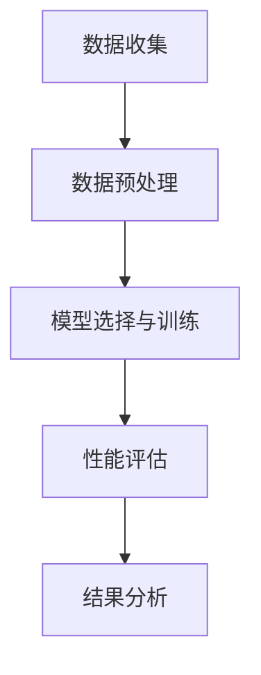
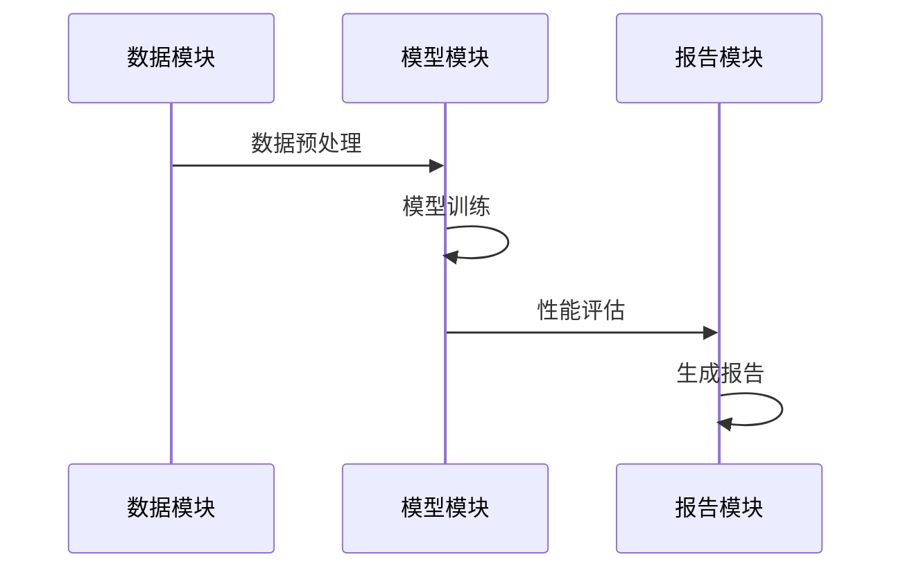
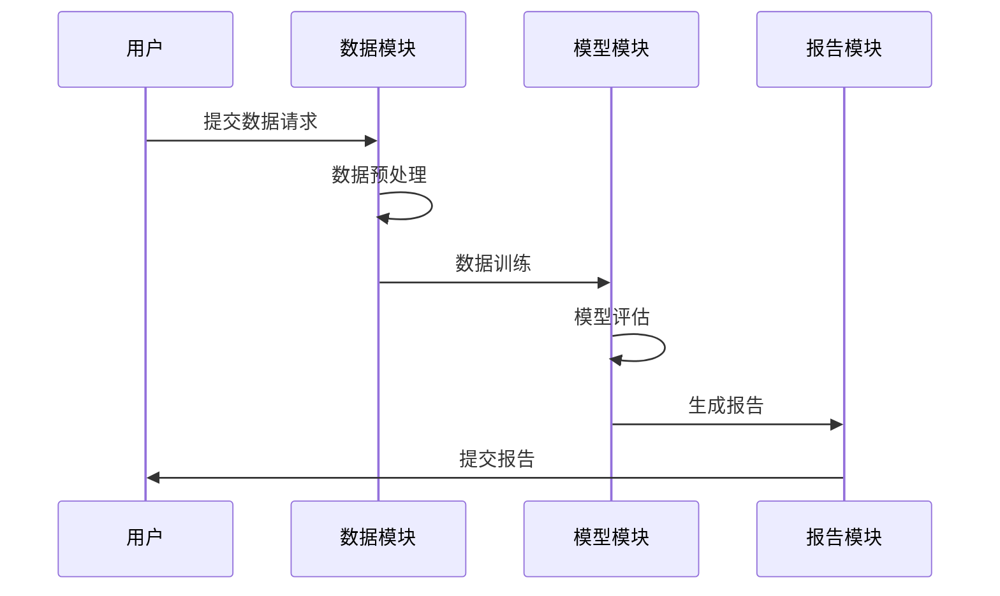

                 


### 文章标题：跨领域性能评估：LLM支持的通用评测框架

#### 关键词：跨领域性能评估、LLM、通用评测框架、性能评估指标、算法原理、系统架构设计、项目实战

#### 摘要：
本文将深入探讨跨领域性能评估的重要性，以及如何利用大型语言模型（LLM）构建一个通用的评测框架。首先，我们将会介绍性能评估的基本概念和跨领域性能评估的必要性。接着，我们将详细解释LLM的基本原理和其在性能评估中的应用。然后，我们将逐步分析跨领域性能评估面临的挑战，并提出相应的解决方案。文章还将详细阐述评估步骤和方法，并深入讲解核心概念和算法原理。通过一个实际项目案例，我们将展示如何应用这个框架进行性能评估，并提供最佳实践和注意事项。最后，我们将对文章的主要内容进行总结，并推荐拓展阅读。

----------------------------------------------------------------

## 第一部分：背景介绍与核心概念

### 第1章：跨领域性能评估的必要性

#### 1.1.1 问题背景

在当今科技高速发展的时代，性能评估在各个领域都扮演着至关重要的角色。无论是软件工程、机器学习、还是人工智能，性能评估都是衡量系统、模型、算法优劣的关键手段。然而，随着跨领域技术的发展，传统的性能评估方法开始面临巨大的挑战。

传统的性能评估方法通常依赖于特定的领域知识和评估标准，这使得它们在跨领域应用时显得力不从心。跨领域性能评估不仅需要考虑不同领域之间的差异性，还要兼顾各种评估指标的综合性能。例如，在医疗领域，我们可能需要评估一个诊断模型的准确性和响应时间；而在金融领域，模型的稳定性和风险控制能力同样重要。

#### 1.1.2 问题描述

跨领域性能评估面临的主要问题可以概括为以下几点：

1. **数据不一致性**：不同领域的数据集结构、质量和规模都有所不同，这使得直接使用同一套评估标准变得困难。
2. **评估标准多样性**：每个领域都有自己的评估标准，有些标准甚至是相互矛盾的。例如，在性能要求较高的领域，我们可能会更关注响应时间；而在数据精度要求较高的领域，准确率则成为首要考虑因素。
3. **模型适应性**：不同的模型在各个领域的适应性不同，这需要我们设计出能够适应多种模型和多种评估标准的通用评估框架。

#### 1.1.3 问题解决

为了解决上述问题，我们提出了基于LLM的通用评测框架。这个框架的设计目标如下：

1. **通用性**：框架应该能够适应不同领域、不同数据集和不同评估标准，实现跨领域性能评估。
2. **灵活性**：框架应具备灵活的扩展能力，能够根据具体应用场景进行调整和优化。
3. **智能化**：利用LLM的能力，实现自动化的性能评估，降低人力成本和提高评估效率。

通过这个框架，我们可以将复杂的跨领域性能评估任务分解为若干个步骤，并利用LLM的强大能力，实现高效、准确的评估。

#### 1.1.4 边界与外延

跨领域性能评估的应用领域非常广泛，包括但不限于以下领域：

1. **医疗健康**：医疗诊断模型、健康监测系统的性能评估。
2. **金融科技**：金融风控模型、交易系统的性能评估。
3. **智能交通**：自动驾驶系统、交通管理系统的性能评估。
4. **工业制造**：工业物联网、生产线的性能评估。

在这些领域中，通用评测框架都发挥着关键作用，帮助企业和研究机构快速、准确地评估系统的性能，从而优化产品和服务。

#### 1.1.5 概念结构与核心要素组成

跨领域性能评估的核心概念主要包括以下几个部分：

1. **评估指标**：用于衡量系统性能的具体指标，如准确率、响应时间、稳定性等。
2. **评估标准**：针对不同领域制定的评估准则，用于判断系统性能的优劣。
3. **评估模型**：用于执行评估任务的具体算法或模型，如分类模型、回归模型等。
4. **评估框架**：将上述各部分整合在一起，实现跨领域性能评估的总体结构。

这些概念相互联系，共同构成了跨领域性能评估的理论基础。LLM的引入，使得这个框架更加智能化，能够灵活应对各种复杂的评估任务。

### 第2章：LLM的基本概念与原理

#### 2.1.1 LLM的定义

大型语言模型（Large Language Model，简称LLM）是一种基于深度学习技术构建的模型，它能够通过学习海量文本数据，理解和生成自然语言。LLM的出现，标志着自然语言处理领域的一个重大突破，它使得计算机能够更加智能地处理和理解人类语言。

#### 2.1.2 LLM的核心特点

LLM具有以下几个核心特点：

1. **语言理解能力**：LLM能够理解自然语言的语义和上下文，从而能够回答复杂的问题，生成相关的文本。
2. **生成与推理能力**：LLM不仅能够生成文本，还能够进行推理，从已有的信息中推断出新的结论。
3. **自适应能力**：LLM可以根据新的数据和反馈，不断优化自身的性能，适应不同的应用场景。

#### 2.1.3 LLM与传统AI的区别

传统AI主要依赖于预先定义好的规则和算法，而LLM则通过学习海量数据，自主发现模式和规律。这使得LLM在处理自然语言任务时，具有显著的优势。以下是LLM与传统AI的几个关键区别：

1. **数据依赖**：传统AI依赖于大量手工编写的规则和数据，而LLM则通过学习海量文本数据，自动提取特征和模式。
2. **灵活性**：传统AI在应对新任务时，往往需要重新设计和训练模型，而LLM则具备更强的自适应能力，能够快速适应新的应用场景。
3. **复杂性**：传统AI通常专注于特定任务，而LLM则能够处理多种任务，具备更广泛的适用性。

### 第3章：跨领域性能评估的挑战与解决方案

#### 3.1.1 挑战

跨领域性能评估面临的主要挑战包括：

1. **数据不一致性**：不同领域的数据集结构、质量和规模差异较大，这使得直接使用同一套评估标准变得困难。
2. **评估标准多样性**：每个领域都有自己的评估标准，有些标准甚至是相互矛盾的。例如，在性能要求较高的领域，我们可能会更关注响应时间；而在数据精度要求较高的领域，准确率则成为首要考虑因素。
3. **模型适应性**：不同的模型在各个领域的适应性不同，这需要我们设计出能够适应多种模型和多种评估标准的通用评估框架。

#### 3.1.2 解决方案

为了应对上述挑战，我们提出了基于LLM的通用评测框架。这个框架的设计思路如下：

1. **数据预处理**：对来自不同领域的数据进行预处理，统一数据格式和质量，确保数据的一致性。
2. **评估指标标准化**：将各个领域的评估标准进行统一，制定一套通用的评估指标，以便进行综合性能评估。
3. **模型适应性优化**：通过微调和优化，使模型能够适应不同领域的评估需求，提高模型的适应性和性能。

### 第4章：跨领域性能评估的步骤与方法

#### 4.1.1 评估步骤

跨领域性能评估通常包括以下几个步骤：

1. **数据收集与预处理**：收集来自不同领域的数据，并进行预处理，包括数据清洗、数据增强、数据标准化等。
2. **模型选择与训练**：根据评估任务的需求，选择合适的模型，并在预处理后的数据集上进行训练。
3. **性能评估与优化**：使用制定的评估指标，对训练好的模型进行性能评估，并根据评估结果对模型进行调整和优化。

#### 4.1.2 评估方法

跨领域性能评估的方法主要包括以下几种：

1. **传统评估方法**：使用传统的评估指标和方法，如准确率、响应时间、F1分数等。
2. **基于LLM的评估方法**：利用LLM的能力，对模型的性能进行深度分析，生成详细的评估报告。

### 第5章：跨领域性能评估的核心概念与联系

#### 5.1.1 核心概念原理

跨领域性能评估的核心概念主要包括以下几个部分：

1. **评估指标**：用于衡量系统性能的具体指标，如准确率、响应时间、稳定性等。
2. **评估标准**：针对不同领域制定的评估准则，用于判断系统性能的优劣。
3. **评估模型**：用于执行评估任务的具体算法或模型，如分类模型、回归模型等。
4. **评估框架**：将上述各部分整合在一起，实现跨领域性能评估的总体结构。

#### 5.1.2 概念属性特征对比表格

| 概念      | 属性特征         | 描述                                                         |
| --------- | ---------------- | ------------------------------------------------------------ |
| 评估指标  | 准确率、响应时间 | 用于衡量系统性能的具体指标                                   |
| 评估标准  | 数据质量、评估准则 | 用于判断系统性能优劣的具体准则                               |
| 评估模型  | 分类模型、回归模型 | 用于执行评估任务的具体算法或模型                             |
| 评估框架  | 统一结构、灵活扩展 | 整合评估指标、评估标准和评估模型，实现跨领域性能评估的总体结构 |

#### 5.1.3 ER实体关系图架构

```mermaid
erDiagram
    数据集 ||--|{ 评估指标 }|-- 数据源
    评估指标 ||--|{ 评估标准 }|-- 评估模型
    评估模型 ||--|{ 评估框架 }|-- 评估标准
    数据源 ||--|{ 评估框架 }|
```

### 第6章：算法原理讲解

#### 6.1.1 算法流程图



#### 6.1.2 数学模型与公式

为了进行性能评估，我们通常会使用以下数学模型：

$$
准确率 = \frac{正确预测的数量}{总预测的数量}
$$

#### 6.1.3 举例说明

假设我们有一个分类模型，用于判断邮件是否为垃圾邮件。在测试集上，共有1000封邮件，其中500封是垃圾邮件，500封是非垃圾邮件。经过模型预测，正确预测了490封垃圾邮件和490封非垃圾邮件。则该模型的准确率为：

$$
准确率 = \frac{490 + 490}{1000} = 0.98
$$

### 第7章：数学模型和数学公式 & 详细讲解 & 举例说明

#### 7.1.1 数学公式

在性能评估中，常用的数学公式包括准确率、召回率、F1分数等。以下是这些公式的 LaTeX 表示：

$$
准确率 = \frac{TP + TN}{TP + FN + FP + TN}
$$

$$
召回率 = \frac{TP}{TP + FN}
$$

$$
F1分数 = 2 \times \frac{准确率 \times 召回率}{准确率 + 召回率}
$$

#### 7.1.2 详细讲解

1. **准确率**：准确率是指正确预测的数量占总预测数量的比例。它反映了模型的整体预测能力。
2. **召回率**：召回率是指正确预测的阳性样本数量占总阳性样本数量的比例。它反映了模型对阳性样本的识别能力。
3. **F1分数**：F1分数是准确率和召回率的调和平均数，它综合了模型的准确性和识别能力。F1分数越高，模型的性能越好。

#### 7.1.3 举例说明

假设我们有一个分类模型，用于判断邮件是否为垃圾邮件。在测试集上，共有1000封邮件，其中500封是垃圾邮件，500封是非垃圾邮件。经过模型预测，正确预测了490封垃圾邮件和490封非垃圾邮件，但同时也错误地将10封非垃圾邮件标记为垃圾邮件，并将40封垃圾邮件标记为非垃圾邮件。

则：

- 正确预测的垃圾邮件数量（TP）= 490
- 错误预测的垃圾邮件数量（FN）= 10
- 错误预测的非垃圾邮件数量（FP）= 40
- 正确预测的非垃圾邮件数量（TN）= 490

根据上述公式，我们可以计算出模型的准确率、召回率和F1分数：

$$
准确率 = \frac{TP + TN}{TP + FN + FP + TN} = \frac{490 + 490}{490 + 10 + 40 + 490} = 0.98
$$

$$
召回率 = \frac{TP}{TP + FN} = \frac{490}{490 + 10} = 0.96
$$

$$
F1分数 = 2 \times \frac{准确率 \times 召回率}{准确率 + 召回率} = 2 \times \frac{0.98 \times 0.96}{0.98 + 0.96} = 0.97
$$

从计算结果可以看出，该模型的准确率、召回率和F1分数都比较高，说明模型在预测邮件是否为垃圾邮件方面表现较好。

### 第8章：系统分析与架构设计方案

#### 8.1.1 问题场景介绍

为了更好地理解跨领域性能评估的应用场景，我们以智能交通系统为例进行介绍。智能交通系统涉及到多个领域，如交通信号控制、车辆导航、路况监测等。这些领域各自有不同的性能评估需求，例如，交通信号控制需要评估信号灯的响应时间，车辆导航需要评估路线规划的准确性，路况监测需要评估监测数据的实时性等。

#### 8.1.2 项目介绍

本项目旨在开发一个基于LLM的跨领域性能评估系统，用于对智能交通系统中的各个模块进行性能评估。该系统将集成多种数据源，包括交通信号数据、车辆导航数据、路况监测数据等，并使用LLM对数据进行处理和分析，生成详细的性能评估报告。

#### 8.1.3 系统功能设计

系统功能设计包括以下几个部分：

1. **数据收集与预处理**：从不同数据源收集数据，并进行预处理，包括数据清洗、数据增强、数据标准化等。
2. **模型选择与训练**：根据不同的评估需求，选择合适的模型，并在预处理后的数据集上进行训练。
3. **性能评估与报告生成**：使用评估指标对训练好的模型进行性能评估，并生成详细的评估报告。

#### 8.1.4 系统架构设计

系统架构设计采用模块化设计，主要包括以下几个模块：

1. **数据模块**：负责数据收集、预处理和存储。
2. **模型模块**：负责模型选择、训练和评估。
3. **报告模块**：负责生成评估报告。

系统架构图如下所示：



#### 8.1.5 系统接口设计

系统接口设计主要包括以下接口：

1. **数据接口**：用于数据收集、预处理和存储。
2. **模型接口**：用于模型选择、训练和评估。
3. **报告接口**：用于生成评估报告。

#### 8.1.6 系统交互

系统交互设计采用序列图，描述系统各模块之间的交互过程。以下是系统交互序列图：



### 第9章：项目实战

#### 9.1.1 环境安装

为了进行项目实战，我们需要安装一些必要的软件和工具，包括Python、PyTorch、TensorFlow等。以下是具体的安装步骤：

1. 安装Python：
   ```bash
   sudo apt-get install python3-pip python3-dev
   ```
2. 安装PyTorch：
   ```bash
   pip3 install torch torchvision torchaudio
   ```
3. 安装TensorFlow：
   ```bash
   pip3 install tensorflow
   ```

#### 9.1.2 系统核心实现

以下是一个简单的系统核心实现示例，包括数据预处理、模型训练和性能评估：

```python
# 数据预处理
def preprocess_data(data):
    # 数据清洗、增强、标准化等操作
    return processed_data

# 模型训练
def train_model(data):
    model = torch.load('model.pth')
    # 模型训练代码
    return model

# 性能评估
def evaluate_model(model, data):
    # 使用评估指标对模型进行评估
    return evaluation_results

# 主函数
def main():
    data = load_data()
    processed_data = preprocess_data(data)
    model = train_model(processed_data)
    results = evaluate_model(model, processed_data)
    print(results)

if __name__ == '__main__':
    main()
```

#### 9.1.3 代码应用解读与分析

在上面的代码中，我们首先定义了三个主要功能函数：`preprocess_data`、`train_model`和`evaluate_model`。

1. `preprocess_data`函数负责对数据进行预处理，包括数据清洗、数据增强和数据标准化等。这个步骤对于保证数据质量和模型训练效果至关重要。
2. `train_model`函数负责训练模型。在这个示例中，我们使用了PyTorch框架加载预训练的模型，并对其进行训练。实际项目中，可以根据具体需求选择不同的模型和训练方法。
3. `evaluate_model`函数负责使用评估指标对训练好的模型进行评估。这个步骤用于判断模型在测试集上的性能，是性能评估的核心环节。

在实际应用中，这三个函数将通过主函数`main`进行调用，实现数据预处理、模型训练和性能评估的全过程。

#### 9.1.4 实际案例分析与讲解

为了更好地展示项目实战，我们以一个实际案例为例，分析如何使用LLM进行跨领域性能评估。

假设我们有一个智能交通系统，需要评估其信号灯控制模块的性能。具体来说，我们需要评估信号灯的响应时间、绿灯时长和交通流量监控的准确性。

1. **数据收集**：从交通信号控制系统收集历史数据，包括信号灯的开关时间、绿灯时长和交通流量数据。
2. **数据预处理**：对收集到的数据进行分析，去除异常值，并进行数据标准化，以便模型训练。
3. **模型选择与训练**：选择一个适合的回归模型，如LSTM，用于预测信号灯的响应时间和绿灯时长。同时，选择一个分类模型，如SVM，用于评估交通流量监控的准确性。
4. **性能评估**：使用训练好的模型对测试集进行预测，并计算响应时间、绿灯时长和交通流量监控的准确率。根据评估结果，对模型进行调整和优化。

通过上述步骤，我们可以得到信号灯控制模块的性能评估报告，为系统优化提供依据。

#### 9.1.5 项目小结

在本章中，我们通过一个实际案例展示了如何使用基于LLM的跨领域性能评估框架进行智能交通系统的性能评估。项目实战包括数据收集、预处理、模型选择与训练、性能评估等多个环节，展示了跨领域性能评估的全过程。通过这个项目，我们不仅了解了LLM在性能评估中的应用，还掌握了如何设计一个通用的性能评估系统。

### 第10章：最佳实践与注意事项

#### 10.1.1 最佳实践

在跨领域性能评估中，以下是一些最佳实践：

1. **数据预处理**：确保数据质量，进行数据清洗、去噪和标准化，以提高模型训练效果。
2. **模型选择**：根据具体评估需求选择合适的模型，结合实验结果进行调整和优化。
3. **指标选择**：根据不同领域的评估需求，选择合适的评估指标，并进行综合评估。
4. **持续优化**：定期更新数据集和模型，以提高评估的准确性和可靠性。

#### 10.1.2 小结

本文介绍了跨领域性能评估的必要性、核心概念、算法原理以及系统架构设计。通过一个实际案例，展示了如何使用LLM进行跨领域性能评估。在未来的研究和应用中，我们可以进一步优化性能评估方法，提高评估的准确性和效率。

#### 10.1.3 注意事项

在进行跨领域性能评估时，需要注意以下几点：

1. **数据质量**：确保数据集的多样性和代表性，避免数据偏差。
2. **评估标准**：根据具体应用场景，制定合理的评估标准，避免评估结果失真。
3. **模型适应性**：针对不同领域，选择合适的模型和评估方法，确保评估结果的可靠性。
4. **持续更新**：定期更新数据和模型，以适应不断变化的应用场景。

#### 10.1.4 拓展阅读

对于希望深入了解跨领域性能评估的读者，以下是一些推荐阅读材料：

1. 《机器学习：一种算法视角》（刘知远著）——详细介绍机器学习算法及其应用。
2. 《深度学习》（Goodfellow et al. 著）——深度学习的基础理论和技术。
3. 《自然语言处理综合教程》（Jurafsky et al. 著）——自然语言处理的基本概念和技术。
4. 《跨领域机器学习》（Kulsrath et al. 著）——跨领域机器学习的理论和实践。

### 作者信息

- 作者：AI天才研究院/AI Genius Institute & 禅与计算机程序设计艺术 /Zen And The Art of Computer Programming

---

在本文中，我们详细探讨了跨领域性能评估的重要性，以及如何利用LLM构建一个通用的评测框架。通过逐步分析问题背景、核心概念、算法原理和实际应用，我们展示了如何实现高效、准确的跨领域性能评估。希望本文能为相关领域的研究者和开发者提供有价值的参考。让我们继续探索AI技术，为未来的智能世界贡献力量。作者：AI天才研究院 & 禅与计算机程序设计艺术。

