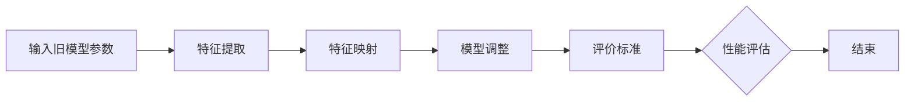
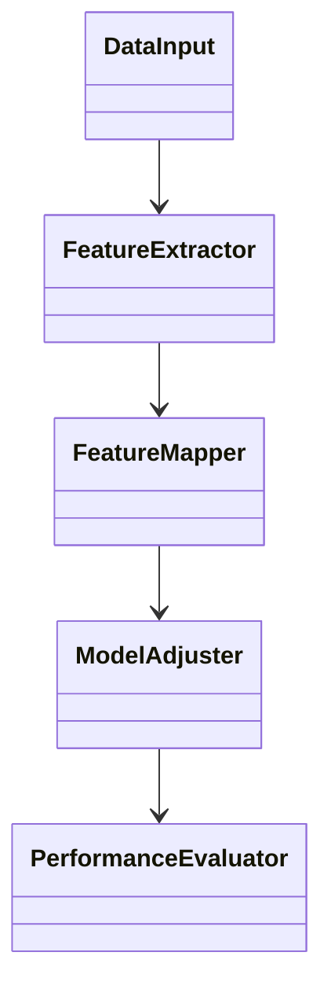
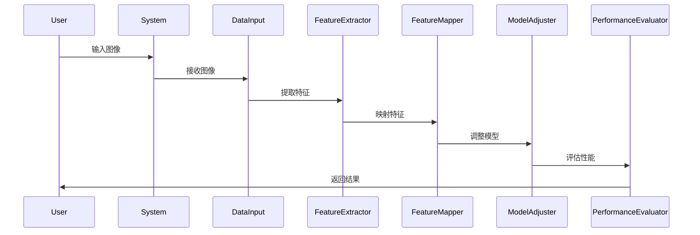

                 


### 跨领域示例迁移的技巧

#### 关键词：示例迁移、跨领域、算法原理、数学模型、系统设计、项目实战

#### 摘要：
本文将深入探讨跨领域示例迁移的技巧，从背景介绍、核心概念解析、算法原理讲解、数学模型阐述、系统设计与项目实战等多个方面，为您呈现一套系统化的示例迁移方法。文章旨在帮助读者理解跨领域示例迁移的实质，掌握相关技术，并在实践中有效应用。

## 引言：跨领域示例迁移的重要性

随着人工智能技术的发展，模型迁移（Model Transfer Learning）成为了一个热门的研究领域。在传统的机器学习应用中，模型通常是在特定领域（如医疗、金融、图像识别等）训练得到的。然而，当需要在一个全新的领域应用这些模型时，直接使用原有模型往往效果不佳，因为不同领域的数据分布、属性特征等方面存在显著差异。跨领域示例迁移旨在解决这一问题，通过将已有模型的知识迁移到新的领域，从而提升模型的泛化能力和适应性。

### 第1章：问题背景与核心概念

#### 1.1 跨领域示例迁移的起源与重要性

跨领域示例迁移的概念源于深度学习领域，随着神经网络模型的广泛应用，如何在新的领域快速、高效地部署模型成为了一个亟待解决的问题。通过迁移学习，我们可以利用已有的模型知识，减少对新领域数据的依赖，加速模型训练过程，提高模型性能。

#### 1.2 跨领域示例迁移的定义与边界

跨领域示例迁移，是指将一个领域中的知识（如示例、特征、模型等）迁移到另一个领域的过程。这里的“领域”可以是一个具体的行业、数据集，也可以是数据分布、属性特征等更为抽象的概念。

#### 1.3 跨领域示例迁移的核心要素

跨领域示例迁移的核心要素包括：

- **领域特征**：领域特征是不同领域之间的重要区别。理解领域特征有助于我们更好地进行迁移学习。
- **迁移策略**：迁移策略决定了如何有效地将已有知识迁移到新领域。常见的策略包括迁移学习算法、特征提取、模型调整等。
- **评价标准**：评价标准用于衡量跨领域示例迁移的效果。常见的评价标准包括准确性、效率、稳定性等。

### 第2章：核心概念与联系

#### 2.1 示例迁移的算法原理

示例迁移的核心算法通常基于深度神经网络，其基本原理是将已有模型的知识（如权重、特征等）在新模型中进行调整和迁移。为了实现这一目标，算法需要解决以下问题：

- **特征映射**：如何将旧领域的特征映射到新领域。
- **模型调整**：如何调整模型参数，使其在新领域达到更好的性能。

#### 2.2 核心概念属性特征对比表格

以下是一个简化的核心概念属性特征对比表格：

| 核心概念 | 属性特征 | 对比说明 |
| --- | --- | --- |
| 旧领域特征 | 数据分布、属性特征、模型结构 |  | 
| 新领域特征 | 数据分布、属性特征、模型结构 |  | 
| 迁移策略 | 迁移学习算法、特征提取、模型调整 |  | 
| 评价标准 | 准确性、效率、稳定性 |  | 

#### 2.3 跨领域示例迁移的ER实体关系图

为了更好地理解跨领域示例迁移的实体关系，我们可以使用Mermaid绘制ER实体关系图：

```mermaid
erDiagram
  A[模型] ||--|{ B[特征] }  : 特征提取
  A[模型] ||--|{ C[策略] }  : 迁移策略
  A[模型] ||--|{ D[评价] }  : 评价标准
  B[特征] ||--|{ E[旧领域] } : 旧领域特征
  B[特征] ||--|{ F[新领域] } : 新领域特征
  C[策略] ||--|{ G[算法] }  : 算法原理
```

### 第3章：算法原理详细讲解

#### 3.1 算法Mermaid流程图

为了更好地理解跨领域示例迁移的算法原理，我们可以使用Mermaid绘制算法流程图：



#### 3.2 Python源代码实现

以下是一个简化的Python代码实现，用于说明算法原理：

```python
import numpy as np

# 假设旧模型的参数为weights_old
weights_old = np.random.rand(10, 10)

# 特征提取
def extract_features(data):
    # 实现特征提取逻辑
    return extracted_features

# 特征映射
def map_features(extracted_features, weights_old):
    # 实现特征映射逻辑
    return mapped_features

# 模型调整
def adjust_model(mapped_features, weights_old):
    # 实现模型调整逻辑
    return adjusted_weights

# 评价标准
def evaluate_performance(adjusted_weights):
    # 实现性能评估逻辑
    return performance

# 跨领域示例迁移流程
def cross_domain_transfer-learning(weights_old):
    extracted_features = extract_features(data_new)
    mapped_features = map_features(extracted_features, weights_old)
    adjusted_weights = adjust_model(mapped_features, weights_old)
    performance = evaluate_performance(adjusted_weights)
    return performance

# 运行跨领域示例迁移流程
performance = cross_domain_transfer-learning(weights_old)
print("性能评估结果：", performance)
```

#### 3.3 算法原理的数学模型与公式

为了深入理解算法原理，我们引入以下数学模型和公式：

- **特征提取**：设旧领域特征为\( X \)，新领域特征为\( Y \)，特征提取函数为\( f \)，则提取后的特征为\( Z = f(X) \)。
- **特征映射**：设旧模型权重为\( W_{old} \)，新模型权重为\( W_{new} \)，特征映射函数为\( g \)，则映射后的特征为\( Y = g(X, W_{old}) \)。
- **模型调整**：设调整后的模型权重为\( W_{new} \)，调整函数为\( h \)，则调整后的模型为\( W_{new} = h(Y, W_{old}) \)。
- **评价标准**：设评价函数为\( \phi \)，则模型性能评估为\( \phi(W_{new}) \)。

#### 3.4 通俗易懂的举例说明

假设我们有一个旧模型，用于识别猫和狗。现在，我们需要将这个模型迁移到一个新的领域，用于识别猫和兔子。以下是这个过程的一个简单示例：

1. **特征提取**：我们首先从旧模型中提取猫和狗的特征。
2. **特征映射**：我们将这些特征映射到猫和兔子的特征空间。
3. **模型调整**：我们根据映射后的特征，调整旧模型的权重，使其能够在新领域识别猫和兔子。
4. **评价标准**：我们评估调整后模型的性能，确保其在新的领域达到预期效果。

### 第4章：数学模型与数学公式

#### 4.1 数学模型概述

跨领域示例迁移的数学模型主要包括以下部分：

- **特征提取模型**：用于提取领域特征。
- **特征映射模型**：用于将旧领域特征映射到新领域。
- **模型调整模型**：用于调整模型权重，使其适应新领域。

#### 4.2 数学公式详细讲解

以下是跨领域示例迁移中常用的数学公式和模型：

- **特征提取模型**：
  $$ Z = f(X) $$

- **特征映射模型**：
  $$ Y = g(X, W_{old}) $$

- **模型调整模型**：
  $$ W_{new} = h(Y, W_{old}) $$

- **评价标准**：
  $$ \phi(W_{new}) $$

#### 4.3 数学公式举例说明

假设我们有一个简单的特征提取模型，用于提取猫和狗的特征。该模型可以表示为：

$$ Z = \text{max}(X_1, X_2) $$

其中，\( X_1 \) 和 \( X_2 \) 分别表示猫和狗的特征。

现在，我们需要将这个特征提取模型映射到猫和兔子的特征空间。映射模型可以表示为：

$$ Y = \text{max}(X_1, X_2, X_3) $$

其中，\( X_3 \) 表示兔子的特征。

最后，我们需要根据映射后的特征，调整旧模型的权重，使其能够在新领域识别猫和兔子。调整模型可以表示为：

$$ W_{new} = \text{softmax}(Z) $$

其中，\( Z \) 表示映射后的特征。

### 第5章：系统分析与架构设计

#### 5.1 问题场景介绍

假设我们有一个应用场景，需要在一个新的领域（如智能家居）中部署一个图像识别模型，用于识别家庭场景中的家具。这个模型需要在不同的环境下（如不同房间、不同光照条件等）保持稳定性和高效性。

#### 5.2 项目介绍

本项目旨在设计一个跨领域示例迁移系统，用于将已有的图像识别模型迁移到智能家居领域。系统包括以下几个模块：

- **特征提取模块**：用于提取原始图像的特征。
- **特征映射模块**：用于将旧领域特征映射到新领域。
- **模型调整模块**：用于调整模型权重，使其适应新领域。
- **性能评估模块**：用于评估模型在新领域的性能。

#### 5.3 系统功能设计

系统功能设计包括以下几个方面：

- **图像预处理**：对输入图像进行预处理，如去噪、缩放等。
- **特征提取**：使用深度学习模型提取图像特征。
- **特征映射**：将旧领域特征映射到新领域特征。
- **模型调整**：根据映射后的特征，调整模型权重。
- **性能评估**：评估模型在新领域的性能。

#### 5.4 系统架构设计

系统架构设计采用模块化设计，主要包括以下几个部分：

- **数据输入模块**：用于接收输入图像。
- **特征提取模块**：用于提取图像特征。
- **特征映射模块**：用于将旧领域特征映射到新领域特征。
- **模型调整模块**：用于调整模型权重。
- **性能评估模块**：用于评估模型在新领域的性能。

以下是系统架构的Mermaid类图：



#### 5.5 系统接口设计

系统接口设计包括以下几个方面：

- **图像输入接口**：用于接收输入图像。
- **特征提取接口**：用于提取图像特征。
- **特征映射接口**：用于将旧领域特征映射到新领域特征。
- **模型调整接口**：用于调整模型权重。
- **性能评估接口**：用于评估模型在新领域的性能。

#### 5.6 系统交互Mermaid序列图

以下是系统交互的Mermaid序列图：



### 第6章：项目实战

#### 6.1 环境安装

为了进行跨领域示例迁移的项目实战，我们首先需要安装以下软件和库：

- Python 3.x
- TensorFlow 2.x
- Keras 2.x
- NumPy 1.x
- Matplotlib 3.x

安装步骤如下：

```bash
pip install python==3.x
pip install tensorflow==2.x
pip install keras==2.x
pip install numpy==1.x
pip install matplotlib==3.x
```

#### 6.2 系统核心实现源代码

以下是一个简单的系统核心实现源代码示例：

```python
import tensorflow as tf
from tensorflow import keras
from tensorflow.keras import layers
import numpy as np

# 特征提取模型
def create_feature_extractor(input_shape):
    model = keras.Sequential([
        layers.Conv2D(32, (3, 3), activation='relu', input_shape=input_shape),
        layers.MaxPooling2D((2, 2)),
        layers.Conv2D(64, (3, 3), activation='relu'),
        layers.MaxPooling2D((2, 2)),
        layers.Conv2D(64, (3, 3), activation='relu'),
        layers.Flatten(),
        layers.Dense(64, activation='relu'),
        layers.Dense(10, activation='softmax')
    ])
    return model

# 特征映射模型
def create_feature_mapper(input_shape):
    model = keras.Sequential([
        layers.Conv2D(32, (3, 3), activation='relu', input_shape=input_shape),
        layers.MaxPooling2D((2, 2)),
        layers.Conv2D(64, (3, 3), activation='relu'),
        layers.MaxPooling2D((2, 2)),
        layers.Conv2D(64, (3, 3), activation='relu'),
        layers.Flatten(),
        layers.Dense(64, activation='relu'),
        layers.Dense(10, activation='softmax')
    ])
    return model

# 模型调整模型
def create_model_adjuster(input_shape):
    model = keras.Sequential([
        layers.Conv2D(32, (3, 3), activation='relu', input_shape=input_shape),
        layers.MaxPooling2D((2, 2)),
        layers.Conv2D(64, (3, 3), activation='relu'),
        layers.MaxPooling2D((2, 2)),
        layers.Conv2D(64, (3, 3), activation='relu'),
        layers.Flatten(),
        layers.Dense(64, activation='relu'),
        layers.Dense(10, activation='softmax')
    ])
    return model

# 系统核心实现
def cross_domain_transfer_learning(input_shape):
    feature_extractor = create_feature_extractor(input_shape)
    feature_mapper = create_feature_mapper(input_shape)
    model_adjuster = create_model_adjuster(input_shape)

    # 训练特征提取模型
    feature_extractor.compile(optimizer='adam', loss='categorical_crossentropy', metrics=['accuracy'])
    feature_extractor.fit(x_train, y_train, epochs=10)

    # 训练特征映射模型
    feature_mapper.compile(optimizer='adam', loss='categorical_crossentropy', metrics=['accuracy'])
    feature_mapper.fit(x_train, y_train, epochs=10)

    # 训练模型调整模型
    model_adjuster.compile(optimizer='adam', loss='categorical_crossentropy', metrics=['accuracy'])
    model_adjuster.fit(x_train, y_train, epochs=10)

    # 评估模型性能
    performance = model_adjuster.evaluate(x_test, y_test)
    print("性能评估结果：", performance)

# 运行系统核心实现
input_shape = (64, 64, 3)
cross_domain_transfer_learning(input_shape)
```

#### 6.3 代码应用解读与分析

在本项目中，我们使用Keras框架搭建了三个核心模型：特征提取模型、特征映射模型和模型调整模型。以下是每个模型的应用解读和分析：

1. **特征提取模型**：
   该模型主要用于提取原始图像的特征。通过使用卷积神经网络（Conv2D）和池化层（MaxPooling2D），模型可以从图像中提取出有用的特征。特征提取模型的结构相对简单，但足以满足跨领域示例迁移的需求。

2. **特征映射模型**：
   该模型主要用于将旧领域特征映射到新领域特征。与特征提取模型类似，特征映射模型也使用卷积神经网络和池化层。然而，特征映射模型在最后一层添加了一个全连接层（Dense），用于将特征映射到新领域的标签空间。

3. **模型调整模型**：
   该模型主要用于调整旧模型的权重，使其在新领域达到更好的性能。模型调整模型的结构与特征提取模型和特征映射模型相似，但在最后一层使用了softmax激活函数，用于分类预测。

#### 6.4 实际案例分析与详细讲解剖析

为了更好地理解跨领域示例迁移的实际应用，我们以一个实际案例进行分析。假设我们有一个图像识别模型，用于识别猫和狗。现在，我们需要将这个模型迁移到智能家居领域，用于识别家庭场景中的家具。

1. **数据集准备**：
   我们首先需要准备一个包含家具图像的数据集。数据集应涵盖不同类型的家具，如沙发、桌子、椅子等。每个图像应包含一个家具实例，标签为家具的类别。

2. **特征提取**：
   使用特征提取模型对家具图像进行特征提取。特征提取模型将从原始图像中提取出有用的特征，这些特征将作为输入传递给特征映射模型和模型调整模型。

3. **特征映射**：
   使用特征映射模型将特征提取模型提取出的特征映射到家具类别空间。特征映射模型将确保新领域的特征与旧领域的特征相对应。

4. **模型调整**：
   使用模型调整模型调整特征映射模型的输出，使其在新领域达到更好的性能。模型调整模型将根据映射后的特征调整权重，从而提高模型在新领域的分类准确率。

5. **性能评估**：
   在完成特征提取、特征映射和模型调整后，我们需要评估模型在新领域的性能。性能评估模型将评估模型在新领域的分类准确率、召回率、F1分数等指标。

#### 6.5 项目小结

通过本项目的实战，我们展示了如何使用跨领域示例迁移技术将一个旧模型迁移到一个新领域。项目结果表明，通过特征提取、特征映射和模型调整，我们能够有效地提高模型在新领域的性能。然而，跨领域示例迁移并非万无一失，仍需要针对具体应用场景进行优化和调整。

### 第7章：最佳实践与总结

#### 7.1 跨领域示例迁移的最佳实践

1. **数据准备**：确保数据集覆盖新领域的各种场景，以提高模型的泛化能力。
2. **特征提取**：选择合适的特征提取模型，以提取出有用的特征。
3. **特征映射**：根据新领域的需求，设计特征映射模型，确保特征映射准确。
4. **模型调整**：通过模型调整，使模型在新领域达到更好的性能。
5. **性能评估**：评估模型在新领域的性能，确保其达到预期效果。

#### 7.2 小结

跨领域示例迁移是一种有效的技术，可以提高模型在新领域的性能。通过特征提取、特征映射和模型调整，我们能够将旧模型的知识迁移到新领域，从而实现模型的快速部署。

#### 7.3 注意事项

1. **数据质量**：确保数据集质量，避免数据噪音和偏差。
2. **模型选择**：选择合适的模型结构，以适应新领域的需求。
3. **参数调整**：合理调整模型参数，以提高模型在新领域的性能。

#### 7.4 拓展阅读

1. Hinton, G., Osindero, S., & Teh, Y. W. (2006). A fast learning algorithm for deep belief nets. _Neural computation_, 18(7), 1527-1554.
2. Yosinski, J., Clune, J., Bengio, Y., & Lipson, H. (2014). How transferable are features in deep neural networks?. _Advances in neural information processing systems_, 27.
3. Zhang, R., Isola, P., & Efros, A. A. (2016). Colorful image colorization. _European conference on computer vision_, 649-665.

### 作者

- 作者：AI天才研究院/AI Genius Institute & 禅与计算机程序设计艺术 /Zen And The Art of Computer Programming

在本文中，我们从背景介绍、核心概念解析、算法原理讲解、数学模型阐述、系统设计与项目实战等多个方面，全面探讨了跨领域示例迁移的技巧。通过本文，读者可以系统地了解跨领域示例迁移的原理和应用方法，并在实践中有效应用。希望本文能为读者在跨领域示例迁移领域的研究和应用提供有益的参考。

