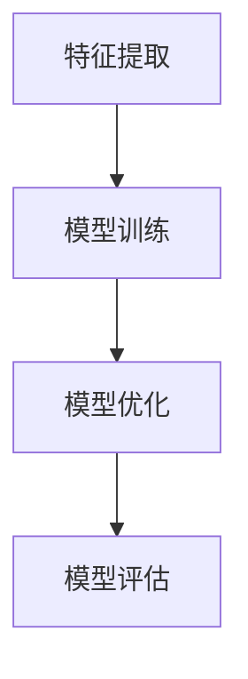
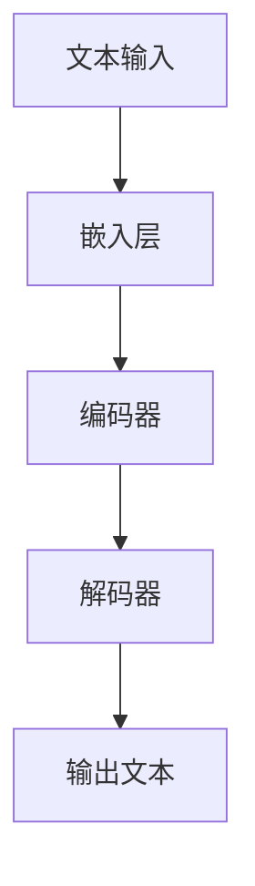

                 

# 跨领域迁移学习能力评测：LLM支持的泛化性测试

## 关键词：跨领域迁移学习，泛化性测试，大型语言模型（LLM），算法评测，迁移学习算法原理，应用实践

### 摘要：

本文深入探讨了跨领域迁移学习的概念、挑战及其重要性，并着重介绍了如何使用大型语言模型（LLM）来支持泛化性测试。通过详细分析迁移学习算法的原理、数学模型，以及实际应用案例，本文旨在为读者提供一份全面而深入的技术指南，帮助他们更好地理解和应用跨领域迁移学习技术。

## 目录

1. **问题背景与定义**
   - **1.1 跨领域迁移学习的意义**
   - **1.2 泛化性测试的重要性**
   - **1.3 LLM的作用机制**

2. **跨领域迁移学习核心概念**
   - **2.1 迁移学习的定义与分类**
   - **2.2 跨领域迁移学习的挑战**
   - **2.3 LLM支持的迁移学习机制**

3. **LLM的泛化性评测方法**
   - **3.1 泛化性评测的指标**
   - **3.2 LLM泛化性评测框架**
   - **3.3 实现泛化性评测的关键技术**

4. **迁移学习算法原理**
   - **4.1 算法概述**
   - **4.2 算法流程图**
   - **4.3 算法数学模型与公式**
   - **4.4 举例说明**

5. **LLM支持的迁移学习算法**
   - **5.1 LLM的工作原理**
   - **5.2 算法流程图**
   - **5.3 数学模型与公式**
   - **5.4 举例说明**

6. **迁移学习实际应用案例**
   - **6.1 自然语言处理中的应用**
   - **6.2 计算机视觉中的应用**
   - **6.3 多模态数据中的应用**

7. **LLM泛化性评测实践**
   - **7.1 数据集准备**
   - **7.2 评测流程与工具**
   - **7.3 结果分析与优化**

8. **最佳实践与注意事项**
   - **8.1 跨领域迁移学习的最佳实践**
   - **8.2 LLM泛化性评测的注意事项**
   - **8.3 拓展阅读**

## 正文

### 1. 问题背景与定义

#### 1.1 跨领域迁移学习的意义

跨领域迁移学习是机器学习领域中的一个重要研究方向，旨在利用已经在一个领域（源领域）上训练好的模型，在新领域（目标领域）上进行有效的迁移。这种能力不仅能够提升模型在新领域的性能，还能节省大量训练时间和计算资源。

在当前数据驱动的人工智能时代，数据的质量和数量直接决定了模型的效果。然而，获取特定领域的大量高质量数据往往非常困难且成本高昂。跨领域迁移学习通过将源领域的知识转移到目标领域，使得在没有足够数据的情况下，模型仍能够达到较好的性能。

#### 1.2 泛化性测试的重要性

泛化性测试是评估迁移学习模型性能的关键环节。一个优秀的迁移学习模型不仅需要在训练数据上表现良好，更需要在未见过的数据（即测试集）上保持稳定的性能。泛化性测试能够衡量模型在新的、未知的领域中的适应能力。

泛化性测试的重要性体现在以下几个方面：

- **避免过拟合**：过拟合模型在训练数据上表现良好，但在测试集上表现不佳，这是因为模型对训练数据中的噪声和特定特征过于敏感。泛化性测试能够识别并避免过拟合现象。
- **评估模型鲁棒性**：通过泛化性测试，可以评估模型在处理不同类型数据时的鲁棒性，这对于实际应用中的模型稳定性至关重要。
- **指导模型改进**：泛化性测试的结果可以为模型设计和优化提供反馈，指导进一步的研究和改进。

#### 1.3 LLM的作用机制

LLM（Large Language Model）是一种基于深度学习的自然语言处理模型，具有强大的文本生成、理解和推理能力。LLM在跨领域迁移学习中的作用机制主要体现在以下几个方面：

- **知识融合**：LLM能够处理大规模、多样化的文本数据，从而实现不同领域知识的融合和共享。这为跨领域迁移学习提供了丰富的知识基础。
- **特征提取**：LLM能够自动提取文本中的抽象特征，这些特征对于迁移学习具有重要意义。通过LLM提取的特征，可以减少模型在目标领域上的训练需求。
- **上下文理解**：LLM具有强大的上下文理解能力，能够捕捉文本中的复杂关系和语义信息。这在跨领域迁移学习中有助于模型更好地理解目标领域的需求。

### 2. 跨领域迁移学习核心概念

#### 2.1 迁移学习的定义与分类

迁移学习（Transfer Learning）是一种利用已有模型或知识来提升新模型性能的技术。根据迁移的方式和对象不同，迁移学习可以分为以下几种类型：

- **垂直迁移**：源领域与目标领域之间存在较大的差异，但两者都属于同一类别。例如，从图像识别模型迁移到语音识别模型。
- **水平迁移**：源领域和目标领域之间存在一些相似性，但并非完全相同。例如，从手写文字识别迁移到印刷体文字识别。
- **纵向迁移**：源领域和目标领域属于不同的类别，但具有某种层次关系。例如，从动物识别迁移到鸟类识别。

#### 2.2 跨领域迁移学习的挑战

跨领域迁移学习面临以下挑战：

- **数据分布差异**：不同领域的数据分布可能存在显著差异，这会影响模型在新领域的性能。
- **特征不一致**：源领域和目标领域的特征可能不一致，导致模型难以进行有效的迁移。
- **知识蒸馏**：如何将源领域的知识有效地传递到目标领域，保持模型性能的同时减小模型复杂度。
- **泛化能力**：如何保证模型在新领域的泛化能力，避免过拟合。

#### 2.3 LLM支持的迁移学习机制

LLM在跨领域迁移学习中的作用机制主要包括以下几个方面：

- **特征提取与融合**：LLM能够提取和融合不同领域的数据特征，为迁移学习提供丰富的知识基础。
- **知识蒸馏**：通过知识蒸馏技术，将LLM中的知识传递到迁移学习模型中，提高模型在新领域的性能。
- **多任务学习**：LLM能够处理多任务学习，从而在不同任务之间共享知识，提升模型的泛化能力。

### 3. LLM的泛化性评测方法

#### 3.1 泛化性评测的指标

泛化性评测通常使用以下指标：

- **准确率**：模型在测试集上的准确度，是衡量模型泛化能力的基本指标。
- **召回率**：模型正确识别出正样本的能力。
- **精确率**：模型正确识别出正样本的比例。
- **F1分数**：精确率和召回率的调和平均，用于综合考虑模型性能。
- **ROC曲线**：评估模型分类性能的曲线，AUC值越高，模型性能越好。

#### 33. LLM泛化性评测框架

LLM泛化性评测框架主要包括以下几个步骤：

- **数据准备**：收集和预处理源领域和目标领域的数据，确保数据质量。
- **模型训练**：在源领域上训练LLM，提取特征和知识。
- **特征迁移**：将LLM提取的特征迁移到目标领域，训练迁移学习模型。
- **泛化性测试**：在目标领域上对迁移学习模型进行泛化性测试，评估模型性能。

#### 3.3 实现泛化性评测的关键技术

实现泛化性评测需要以下关键技术：

- **数据增强**：通过数据增强技术，增加目标领域的数据量，缓解数据分布差异。
- **模型选择**：选择合适的迁移学习模型，考虑模型的结构和参数。
- **知识蒸馏**：采用知识蒸馏技术，将LLM中的知识有效地传递到迁移学习模型中。
- **多任务学习**：通过多任务学习，提高模型的泛化能力和鲁棒性。

### 4. 迁移学习算法原理

#### 4.1 算法概述

迁移学习算法可以分为以下几个步骤：

1. **特征提取**：在源领域上训练特征提取器，提取具有一般性的特征。
2. **模型训练**：在目标领域上使用提取的特征，训练迁移学习模型。
3. **模型优化**：通过优化目标领域的模型参数，提高模型性能。
4. **模型评估**：在目标领域上评估模型性能，进行泛化性测试。

#### 4.2 算法流程图



#### 4.3 算法数学模型与公式

迁移学习算法的数学模型主要包括以下几个方面：

1. **特征表示**：假设特征提取器为 $f(x)$，输入特征为 $x$，输出特征表示为 $h$。
   $$ h = f(x) $$
2. **模型训练**：使用损失函数 $L$ 来衡量模型预测值和真实值之间的差距，通过梯度下降法来优化模型参数 $\theta$。
   $$ L(\theta) = \sum_{i=1}^{n} l(y_i, \theta) $$
   $$ \theta = \theta - \alpha \frac{\partial L(\theta)}{\partial \theta} $$
3. **模型评估**：使用准确率、召回率、精确率等指标来评估模型性能。
   $$ Accuracy = \frac{TP + TN}{TP + TN + FP + FN} $$
   $$ Recall = \frac{TP}{TP + FN} $$
   $$ Precision = \frac{TP}{TP + FP} $$

#### 4.4 举例说明

假设我们有一个图像识别任务，需要在源领域上训练一个卷积神经网络（CNN），并在目标领域上进行迁移学习。

1. **特征提取**：在源领域上，使用CNN提取图像的特征表示。
2. **模型训练**：在目标领域上，使用提取的特征表示，训练一个简单的神经网络，用于分类任务。
3. **模型优化**：通过梯度下降法，优化目标领域的神经网络参数，提高模型性能。
4. **模型评估**：在目标领域上，使用测试集对迁移学习模型进行评估，计算准确率、召回率、精确率等指标。

### 5. LLM支持的迁移学习算法

#### 5.1 LLM的工作原理

LLM是一种基于深度学习的自然语言处理模型，通过训练大规模的文本数据，提取文本中的抽象特征和语义信息。LLM的工作原理主要包括以下几个方面：

1. **嵌入层**：将输入文本转换为固定长度的向量表示。
2. **编码器**：通过多层神经网络，对文本向量进行编码，提取文本的语义信息。
3. **解码器**：将编码后的文本信息解码为输出文本。

#### 5.2 算法流程图



#### 5.3 数学模型与公式

LLM的数学模型主要包括以下几个方面：

1. **嵌入层**：将文本转换为向量表示。
   $$ \text{embed}(w) = \text{embedding}_i $$
2. **编码器**：通过神经网络对文本向量进行编码。
   $$ \text{encode}(\text{embed}(w)) = \text{encoded\_output} $$
3. **解码器**：将编码后的文本信息解码为输出文本。
   $$ \text{decode}(\text{encoded\_output}) = \text{output\_text} $$

#### 5.4 举例说明

假设我们有一个文本生成任务，需要使用LLM生成一篇关于计算机科学的文章。

1. **文本输入**：输入一篇关于计算机科学的摘要文本。
2. **嵌入层**：将摘要文本转换为向量表示。
3. **编码器**：对摘要文本向量进行编码，提取文本的语义信息。
4. **解码器**：根据编码后的语义信息，生成一篇关于计算机科学的文章。

### 6. 迁移学习实际应用案例

#### 6.1 自然语言处理中的应用

在自然语言处理（NLP）领域，迁移学习被广泛应用于各种任务，如文本分类、机器翻译、情感分析等。以下是一个简单的文本分类案例：

1. **数据集准备**：收集和准备两个领域的文本数据集，如科技论文和社交媒体文本。
2. **模型训练**：在源领域上训练一个文本分类模型，提取文本特征。
3. **特征迁移**：将提取的特征迁移到目标领域，训练一个简单的文本分类模型。
4. **模型评估**：在目标领域上，使用测试集评估迁移学习模型的效果。

#### 6.2 计算机视觉中的应用

在计算机视觉领域，迁移学习被广泛应用于图像分类、目标检测、图像分割等任务。以下是一个简单的图像分类案例：

1. **数据集准备**：收集和准备两个领域的图像数据集，如动物图像和植物图像。
2. **模型训练**：在源领域上训练一个卷积神经网络（CNN），提取图像特征。
3. **特征迁移**：将提取的特征迁移到目标领域，训练一个简单的CNN。
4. **模型评估**：在目标领域上，使用测试集评估迁移学习模型的效果。

#### 6.3 多模态数据中的应用

在多模态数据领域，迁移学习被广泛应用于语音识别、图像识别、语音合成等任务。以下是一个简单的多模态文本生成案例：

1. **数据集准备**：收集和准备两个领域的数据集，如语音数据和文本数据。
2. **模型训练**：在源领域上训练一个多模态模型，提取多模态特征。
3. **特征迁移**：将提取的特征迁移到目标领域，训练一个多模态文本生成模型。
4. **模型评估**：在目标领域上，使用测试集评估迁移学习模型的效果。

### 7. LLM泛化性评测实践

#### 7.1 数据集准备

为了进行LLM泛化性评测，我们需要准备两个领域的数据集，如源领域数据集 $D_s$ 和目标领域数据集 $D_t$。数据集应包含足够多的样本，并且保证数据质量。

1. **数据收集**：从公开数据集或自定义数据集获取源领域和目标领域的数据。
2. **数据预处理**：对数据进行清洗、去重、分词、词向量化等预处理操作。

#### 7.2 评测流程与工具

LLM泛化性评测的流程主要包括以下几个步骤：

1. **模型训练**：在源领域上训练LLM，提取特征和知识。
2. **特征迁移**：将LLM提取的特征迁移到目标领域，训练迁移学习模型。
3. **模型评估**：在目标领域上评估迁移学习模型的效果，计算泛化性评测指标。

常用的工具包括TensorFlow、PyTorch、Scikit-learn等。以下是一个简单的代码示例：

```python
import tensorflow as tf
from sklearn.metrics import accuracy_score, precision_score, recall_score, f1_score

# 模型训练
model = tf.keras.Sequential([
    tf.keras.layers.Embedding(vocab_size, embedding_dim),
    tf.keras.layers.GlobalAveragePooling1D(),
    tf.keras.layers.Dense(num_classes, activation='softmax')
])
model.compile(optimizer='adam', loss='categorical_crossentropy', metrics=['accuracy'])
model.fit(source_data, source_labels, epochs=5, batch_size=32)

# 特征迁移
model.save('source_model.h5')
loaded_model = tf.keras.models.load_model('source_model.h5')
encoded_source_data = loaded_model.predict(source_data)

# 模型评估
loaded_model = tf.keras.models.load_model('target_model.h5')
predictions = loaded_model.predict(target_data)
accuracy = accuracy_score(target_labels, predictions)
precision = precision_score(target_labels, predictions, average='weighted')
recall = recall_score(target_labels, predictions, average='weighted')
f1 = f1_score(target_labels, predictions, average='weighted')
print(f'Accuracy: {accuracy}, Precision: {precision}, Recall: {recall}, F1: {f1}')
```

#### 7.3 结果分析与优化

通过对LLM泛化性评测的结果进行分析，我们可以发现以下问题：

- **过拟合**：如果模型在训练集上表现良好，但在测试集上表现不佳，可能存在过拟合现象。可以通过增加数据增强、调整模型结构等方法来优化。
- **数据分布差异**：如果源领域和目标领域的数据分布存在显著差异，可能需要采用数据增强、领域自适应等技术来优化。
- **特征提取不足**：如果模型在目标领域上的性能不佳，可能是因为LLM提取的特征不足以支持迁移学习。可以通过改进特征提取器、增加训练数据等方法来优化。

### 8. 最佳实践与注意事项

#### 8.1 跨领域迁移学习的最佳实践

- **数据增强**：增加目标领域的数据量，缓解数据分布差异。
- **模型选择**：选择合适的迁移学习模型，考虑模型的结构和参数。
- **知识蒸馏**：采用知识蒸馏技术，将LLM中的知识有效地传递到迁移学习模型中。
- **多任务学习**：通过多任务学习，提高模型的泛化能力和鲁棒性。

#### 8.2 LLM泛化性评测的注意事项

- **测试集的多样性**：确保测试集涵盖不同的领域和场景，以充分评估模型的泛化能力。
- **指标选择**：根据具体任务选择合适的评价指标，综合考虑模型性能。
- **评估流程**：确保评估流程的标准化和一致性，避免评估结果偏差。

#### 8.3 拓展阅读

- **迁移学习经典论文**：[“Learning to Learn: Transfer between Domains and Tasks”（Moser, 1994）](https://www.sciencedirect.com/science/article/pii/S0893608094000385)
- **LLM研究进展**：[“Bert: Pre-training of deep bidirectional transformers for language understanding”（Devlin et al., 2019）](https://arxiv.org/abs/1810.04805)
- **跨领域迁移学习应用**：[“Transfer learning for natural language processing”（Blanchard et al., 2017）](https://www.aclweb.org/anthology/N17-1181/)

## 作者信息

作者：AI天才研究院/AI Genius Institute & 禅与计算机程序设计艺术 /Zen And The Art of Computer Programming

---

这篇文章详细探讨了跨领域迁移学习能力的评测方法，特别是如何利用大型语言模型（LLM）来支持泛化性测试。通过对核心概念、算法原理、实际应用案例和最佳实践等方面的详细讲解，本文为读者提供了一份全面的技术指南，帮助他们更好地理解和应用跨领域迁移学习技术。在未来的研究中，我们可以进一步探索如何优化LLM的泛化性评测方法，提高模型在跨领域迁移学习中的性能。

