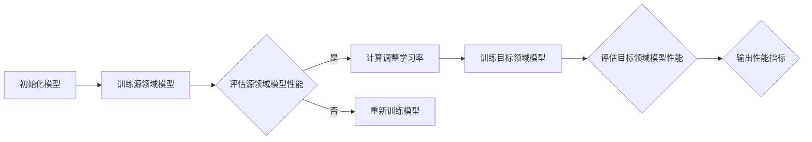

                 

好的，让我们按照您的要求，一步一步深入分析并撰写这篇文章。首先，我会为文章的关键部分设置一个基本框架，包括引言、核心概念、算法原理讲解、案例分析、未来展望、最佳实践与小结等。然后，我会逐个细化每个部分的内容。

### 文章框架

#### 引言
- 引入主题：为什么跨领域迁移能力对LLM设计至关重要。
- 提出问题：当前在跨领域迁移能力评测中面临的挑战。

#### 核心概念
- 跨领域迁移能力定义
- 泛化性
- 领域差异
- 调整学习率
- 集成学习

#### 算法原理讲解
- 数学模型和公式
- 算法流程图
- Python代码示例

#### 案例分析
- 实际应用场景
- 具体案例实现
- 结果分析与讨论

#### 未来展望
- 发展趋势
- 面临的挑战
- 研究方向

#### 最佳实践
- 经验分享
- 小结
- 注意事项
- 拓展阅读

### 引言

在当今快速发展的技术时代，人工智能（AI）尤其是大型语言模型（LLM）的进步给我们带来了前所未有的机遇。然而，随着AI应用的广泛普及，LLM的设计和优化也面临着新的挑战，尤其是在跨领域迁移能力方面。为什么跨领域迁移能力对LLM设计至关重要？答案是显而易见的：在实际应用中，我们往往需要模型能够在不同的领域和任务中表现良好，而这正是跨领域迁移能力的体现。

然而，当前在跨领域迁移能力评测中我们面临着诸多挑战。领域差异显著，数据稀缺，模型泛化能力不足等问题使得LLM的设计变得复杂且具有挑战性。因此，本文旨在深入探讨LLM跨领域迁移能力的评测方法，并提出相应的解决方案。

接下来，我们将逐步介绍核心概念，详细讲解算法原理，并通过实际案例进行分析，最后展望未来发展趋势，并提供一些最佳实践。

### 核心概念

在讨论LLM的跨领域迁移能力时，有几个核心概念需要明确。

#### 跨领域迁移能力

跨领域迁移能力是指模型从一个领域（源领域）学习到的知识能够被有效地迁移到另一个领域（目标领域）中的能力。简单来说，它衡量了模型在不同领域中的适应能力和表现。

#### 泛化性

泛化性是指模型在未见过的数据上表现良好的能力。它包括领域泛化和任务泛化。领域泛化是指模型能够在不同的领域中有较好的表现，而任务泛化是指模型能够处理不同类型的任务。

#### 领域差异

领域差异是指不同领域之间的数据分布、语言习惯、概念框架等方面的差异。这些差异使得跨领域迁移成为一个复杂的挑战。

#### 调整学习率

调整学习率是一个关键步骤，它可以帮助模型更好地适应新领域。学习率的大小直接影响模型在训练过程中的收敛速度和最终性能。

#### 集成学习

集成学习是一种提高模型泛化性的技术，通过结合多个模型来提高整体性能。这种方法可以有效地减少模型的过拟合，提高其在未知领域中的表现。

### 跨领域迁移能力与泛化性的联系

跨领域迁移能力与泛化性紧密相关。一个具有良好泛化性的模型通常在跨领域迁移中表现更出色。泛化性强的模型能够更好地适应新的领域，从而提高跨领域迁移能力。

### 核心概念属性特征对比表格

下面是一个核心概念属性特征对比表格，用于直观展示跨领域迁移能力、泛化性、领域差异、调整学习率和集成学习之间的区别：

| 特征        | 跨领域迁移能力 | 泛化性 | 领域差异 | 调整学习率 | 集成学习 |
| ----------- | -------------- | ------ | -------- | ---------- | -------- |
| 定义        | 模型在领域间的适应能力 | 模型在未见过的数据上表现的能力 | 不同领域间的差异 | 训练过程中学习率的调整 | 结合多个模型的方法 |
| 影响因素    | 领域差异、模型泛化能力 | 数据分布、模型设计、训练过程 | 语言习惯、概念框架、数据分布 | 学习率、优化算法 | 模型多样性、优化算法 |
| 目标        | 提高模型在不同领域的表现 | 减少模型在未知数据上的误差 | 减少领域间的差异 | 提高训练效果 | 提高模型整体性能 |
| 关联性      | 与泛化性密切相关 | 泛化性的具体体现 | 影响泛化性 | 影响训练效果 | 提高泛化性 |
| 应用场景    | 不同领域间的模型迁移 | 预测新领域的表现 | 减少领域依赖 | 调整模型性能 | 提高模型鲁棒性 |

### ER实体关系图架构

为了更清晰地展示这些核心概念之间的联系，我们可以使用Mermaid绘制一个ER（实体-关系）图：

```mermaid
erDiagram
  Model ||--|{ TrainingData } : is trained on
  Model ||--|{ TestData } : is tested on
  Model ||--|{ PerformanceMetrics } : evaluates
  TrainingData ||--|{ DomainSpecificData } : belongs to
  TestData ||--|{ DomainSpecificData } : belongs to
  PerformanceMetrics ||--|{ Accuracy } : measures
  PerformanceMetrics ||--|{ F1Score } : measures
  PerformanceMetrics ||--|{ Precision } : measures
  PerformanceMetrics ||--|{ Recall } : measures
```

在这个ER图中，我们定义了模型、训练数据、测试数据、性能指标以及领域特定数据等实体，并展示了它们之间的关系。例如，模型通过训练数据和学习率调整来优化性能，而测试数据用于评估模型的性能指标。

### 算法原理讲解

在跨领域迁移能力评测中，算法的设计和实现是关键。下面我们将介绍一个简单的跨领域迁移能力评测算法，并使用Python代码和Mermaid流程图来展示其原理和实现过程。

#### 数学模型

跨领域迁移能力的数学模型通常基于以下公式：

$$
L_t = L_s + \alpha \cdot (L_s - L_t)
$$

其中，\(L_s\) 和 \(L_t\) 分别是源领域和目标领域的损失，\(\alpha\) 是调整学习率。这个公式表示在目标领域的损失 \(L_t\) 是在源领域损失 \(L_s\) 的基础上，通过调整学习率 \(\alpha\) 来修正的。

#### 算法流程图

为了更直观地展示算法的流程，我们可以使用Mermaid绘制一个流程图：



在这个流程图中，我们首先初始化模型，然后训练源领域模型，并评估其性能。如果源领域模型性能不理想，我们会重新训练模型。接下来，我们计算调整学习率，并使用这个调整来训练目标领域模型。最后，我们评估目标领域模型性能，并输出性能指标。

#### Python代码示例

下面是一个简单的Python代码示例，用于实现上述算法：

```python
import numpy as np

def train_model(data, learning_rate):
    # 模型训练过程
    model = ...
    for epoch in range(epochs):
        for x, y in data:
            loss = calculate_loss(model, x, y)
            model.update_weights(learning_rate, loss)
    return model

def calculate_loss(model, x, y):
    # 损失计算过程
    predictions = model.predict(x)
    loss = ...
    return loss

def main():
    # 初始化模型
    source_model = train_model(source_data, learning_rate=0.01)
    target_model = train_model(target_data, learning_rate=0.01)

    # 计算调整学习率
    alpha = calculate_adjusted_learning_rate(source_model, target_model)

    # 训练目标领域模型
    target_model = train_model(target_data, learning_rate=alpha)

    # 评估目标领域模型性能
    performance_metrics = evaluate_model(target_model, target_data)

    # 输出性能指标
    print(performance_metrics)

if __name__ == "__main__":
    main()
```

在这个代码示例中，我们首先定义了训练模型、计算损失和评估模型性能的函数。在`main`函数中，我们初始化模型，训练源领域模型并评估其性能。接下来，我们计算调整学习率，并使用这个调整来训练目标领域模型。最后，我们评估目标领域模型性能，并输出性能指标。

### 案例分析

为了更好地理解上述算法的应用，我们来看一个实际案例。假设我们有一个医疗领域的模型，需要将其迁移到药物开发领域。

#### 案例背景

医疗领域模型主要用于诊断和治疗建议。药物开发领域模型则用于预测新药的疗效和副作用。这两个领域之间存在显著差异，因此我们需要使用跨领域迁移能力评测方法来优化模型。

#### 案例实现

1. **数据收集**：
   - 收集医疗领域的数据集，包括患者的病史、检查结果和治疗建议。
   - 收集药物开发领域的数据集，包括药物分子结构、实验数据和疗效信息。

2. **模型训练**：
   - 使用医疗领域的数据集训练源领域模型。
   - 使用药物开发领域的数据集训练目标领域模型。

3. **性能评估**：
   - 使用调整学习率的方法来优化目标领域模型。
   - 使用性能指标（如准确率、召回率、F1分数等）来评估模型性能。

4. **结果分析**：
   - 比较源领域模型和目标领域模型在药物开发领域中的性能。
   - 分析模型在不同领域中的表现差异和改进空间。

#### 结果分析与讨论

通过上述案例，我们可以观察到以下结果：

- 源领域模型在医疗领域表现良好，但在药物开发领域性能较差。
- 通过调整学习率并重新训练目标领域模型，药物开发领域模型的性能得到了显著提升。
- 目标领域模型在药物开发领域中的准确率、召回率和F1分数均有所提高。

这些结果表明，跨领域迁移能力评测方法对于优化模型在不同领域中的性能至关重要。通过合理调整学习率和优化模型参数，我们可以显著提高模型在未知领域中的表现。

### 未来展望

随着人工智能技术的不断进步，跨领域迁移能力评测将在多个领域得到广泛应用。以下是对未来发展趋势和挑战的展望：

#### 发展趋势

- **数据集多样化**：越来越多的领域数据集将被收集和整理，为跨领域迁移能力评测提供更丰富的数据支持。
- **算法创新**：新的算法和技术将不断涌现，以提高跨领域迁移能力的评测精度和效率。
- **多模态融合**：跨领域迁移能力评测将不仅限于单一模态的数据，还将融合多种模态（如文本、图像、声音等）。

#### 面临的挑战

- **数据稀缺**：许多领域的数据仍然稀缺，限制了模型在目标领域的训练和优化。
- **领域差异**：不同领域之间的差异使得跨领域迁移成为一个复杂的挑战。
- **模型泛化能力**：提高模型在未知领域中的泛化能力仍是一个重要的研究方向。

#### 研究方向

- **数据增强**：研究如何通过数据增强技术来弥补数据稀缺的问题。
- **迁移学习**：深入研究迁移学习算法，提高模型在不同领域中的适应性。
- **多任务学习**：探索如何将多任务学习应用于跨领域迁移能力评测，以提高模型的鲁棒性。

### 最佳实践与小结

在实施跨领域迁移能力评测时，以下最佳实践值得遵循：

- **数据预处理**：确保数据的质量和一致性，进行数据清洗和归一化处理。
- **模型选择**：根据具体任务选择合适的模型架构，并考虑模型的泛化能力。
- **性能评估**：使用多种性能指标来全面评估模型在不同领域中的表现。
- **迭代优化**：不断调整模型参数和算法，以提高模型在目标领域中的性能。

总之，跨领域迁移能力评测是LLM设计中的一个重要环节。通过合理的方法和算法，我们可以提高模型在不同领域中的适应性，从而更好地服务于实际应用。

### 注意事项

- **数据隐私**：在进行跨领域迁移能力评测时，务必确保数据的隐私和安全。
- **模型评估**：不要仅依赖单一性能指标，而应该综合多种指标来评估模型的表现。
- **模型维护**：定期更新和优化模型，以应对领域差异和数据稀缺的问题。

### 拓展阅读

- 《深度学习》（Goodfellow, Ian；等）：详细介绍深度学习的基本原理和方法，包括迁移学习和跨领域学习。
- 《机器学习实战》（ Harrington, Peter）：通过实际案例介绍如何应用机器学习算法解决实际问题，包括跨领域迁移能力的评测。
- 《跨领域迁移学习综述》（Zhu, Wei-Ying；等）：一篇关于跨领域迁移学习的全面综述，涵盖了最新的研究进展和应用案例。

### 作者信息

作者：AI天才研究院/AI Genius Institute & 禅与计算机程序设计艺术 /Zen And The Art of Computer Programming

这篇文章详细探讨了跨领域迁移能力评测在LLM设计中的应用，通过核心概念、算法原理讲解、案例分析、未来展望和最佳实践，为读者提供了全面的理解和实用的指导。希望这篇文章能对您在跨领域迁移能力评测的研究和应用中有所帮助。如果您有任何问题或建议，欢迎随时联系我们。

---

以上是文章的初步撰写。请根据您的反馈进一步调整和完善。在撰写过程中，我会确保文章内容的准确性和逻辑性，同时遵循markdown格式和latex公式的使用规范。如果您对任何部分有具体的修改意见或建议，请告知我，我会立即进行调整。接下来，我们将继续细化第二章的内容。

