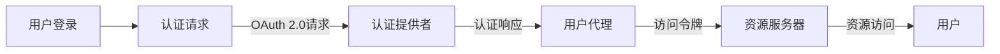
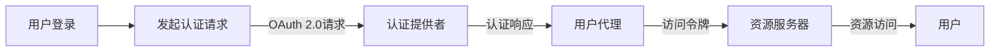

                 

，让我们一步步来思考和撰写这篇文章吧！

# 文章标题

# 关键词

身份联合、LLM、用户认证、安全、效率

# 摘要

本文将深入探讨身份联合在LLM（大型语言模型）应用中的重要性，通过详细的讲解和实践案例分析，帮助读者理解和掌握如何构建高效、安全、用户友好的身份联合系统。

## 第一部分：背景介绍

### 问题背景

在当今数字化时代，随着互联网和移动设备的普及，用户在各种应用和服务中的身份验证需求日益增长。传统的用户认证方式，如用户名和密码，已经无法满足用户对便捷性、安全性和个性化体验的需求。因此，身份联合的概念应运而生。

### 问题描述

身份联合旨在通过将多个身份认证系统集成在一起，简化用户在多个应用和服务中的登录过程，同时提高认证的安全性和效率。然而，身份联合的应用面临着多个挑战，包括如何处理不同认证系统的互操作性、如何确保用户隐私和数据安全、如何平衡用户体验与安全性等。

### 问题解决

本书《身份联合：简化LLM应用的用户认证》将深入探讨身份联合的概念、原理和应用，通过详细的讲解和实践案例分析，帮助读者理解和掌握如何构建高效、安全、用户友好的身份联合系统。

### 边界与外延

身份联合的应用范围广泛，包括但不限于在线金融服务、电子商务、社交媒体、企业内部系统等。同时，随着人工智能和自然语言处理技术的发展，身份联合在LLM应用中的重要性日益凸显。

### 概念结构与核心要素组成

身份联合系统通常包括以下核心组成部分：

1. **认证提供商**：提供身份认证服务的第三方机构，如OAuth、OpenID Connect等。
2. **用户代理**：代表用户进行身份认证的应用或服务，如单点登录（SSO）系统。
3. **资源服务器**：需要用户进行身份验证以访问其资源的服务器或应用。
4. **身份信息**：包括用户的个人信息、认证凭证等。
5. **协议与标准**：如OAuth 2.0、OpenID Connect等，用于确保不同系统之间的互操作性。

## 第二部分：核心概念与联系

### 核心概念原理

#### 身份联合（Federated Authentication）

身份联合是一种认证机制，允许用户在一个服务中认证后，无需重复认证即可访问其他服务。

#### 单点登录（SSO）

单点登录是一种身份联合的实现方式，用户只需在一个地方登录，就可以访问多个应用和服务。

#### OpenID Connect（OIDC）

OpenID Connect是一种基于OAuth 2.0的协议，用于提供身份认证和授权功能。

#### OAuth 2.0

OAuth 2.0是一种授权框架，允许第三方应用代表用户访问其受保护的资源，同时保护用户的隐私。

### 概念属性特征对比表格

| 概念         | 定义                                                         | 关联应用                                     |
| ------------ | ------------------------------------------------------------ | -------------------------------------------- |
| 身份联合     | 允许用户在一个服务中认证后访问其他服务                       | 在线金融服务、电子商务、社交媒体             |
| 单点登录     | 用户只需在一个地方登录，即可访问多个应用和服务               | 企业内部系统、云应用                         |
| OpenID Connect | 基于OAuth 2.0的协议，用于提供身份认证和授权功能               | Web应用、移动应用                           |
| OAuth 2.0     | 授权框架，允许第三方应用代表用户访问其受保护的资源             | 在线服务、社交网络、第三方应用集成          |

### ER实体关系图架构

```mermaid
erDiagram
    User ||--|{ AuthenticationProvider }|-->> ResourceServer
    User ||--|{ SingleSignOn }|-->> Service
    AuthenticationProvider ||--|{ OAuth2Provider }|
    ResourceServer ||--|{ Service }|
```

用户与认证提供者、单点登录、资源服务器和服务之间建立了明确的实体关系。

## 第三部分：算法原理讲解

### 算法流程图



### 算法原理

#### OAuth 2.0协议

OAuth 2.0协议是一种开放标准，允许应用程序通过用户授权代表用户访问受保护资源。它通过以下步骤实现身份联合：

1. **授权码流程**：用户访问资源服务器，资源服务器向认证提供者请求授权码。
2. **认证过程**：认证提供者向用户验证身份，并将授权码返回给资源服务器。
3. **访问令牌获取**：资源服务器使用授权码从认证提供者获取访问令牌。
4. **资源访问**：资源服务器使用访问令牌访问用户的受保护资源。

#### OpenID Connect协议

OpenID Connect是OAuth 2.0协议的扩展，提供身份认证和授权功能。它通过以下步骤实现单点登录：

1. **认证请求**：用户向认证提供者发起认证请求。
2. **认证过程**：认证提供者验证用户身份，并返回身份认证信息。
3. **访问令牌生成**：认证提供者生成访问令牌和身份信息，并将它们发送给用户代理。
4. **单点登录**：用户代理使用访问令牌和身份信息为用户登录，并使其能够访问多个应用和服务。

### 算法原理数学模型

身份联合系统的安全性可以通过以下数学模型来描述：

$$
S = \frac{U \times P \times R \times A}{V}
$$

其中：

- \(S\) 是系统的安全性。
- \(U\) 是用户的身份验证强度。
- \(P\) 是认证提供商的安全性。
- \(R\) 是资源服务器的安全性。
- \(A\) 是应用的安全性。
- \(V\) 是攻击者的能力。

### 举例说明

假设用户使用的是双因素认证，认证提供者使用了安全的加密算法，资源服务器进行了访问控制，应用使用了安全的API接口。攻击者具有中等能力。

1. **用户身份验证强度**：\(U = 2\)（双因素认证）
2. **认证提供商安全性**：\(P = 1\)（使用安全的加密算法）
3. **资源服务器安全性**：\(R = 1\)（进行访问控制）
4. **应用安全性**：\(A = 1\)（使用安全的API接口）
5. **攻击者能力**：\(V = 0.5\)（中等能力）

将这些值代入数学模型中，我们得到：

$$
S = \frac{2 \times 1 \times 1 \times 1}{0.5} = 4
$$

系统的安全性为4，表示该身份联合系统具有较高的安全性。

## 第四部分：系统分析与架构设计方案

### 问题场景介绍

随着互联网和移动互联网的快速发展，许多应用和服务都需要用户进行身份验证。例如，社交媒体平台需要验证用户身份以防止滥用和欺诈行为，在线金融服务需要验证用户身份以确保交易安全，企业内部系统需要验证员工身份以保护企业数据。然而，传统的用户认证方式（如用户名和密码）已经无法满足用户对便捷性、安全性和个性化体验的需求。因此，我们需要一种高效、安全且用户友好的身份联合系统来简化用户认证过程。

### 项目介绍

本项目旨在设计和实现一个身份联合系统，以简化用户在多个应用和服务中的登录过程，同时提高认证的安全性和效率。该系统将基于OAuth 2.0和OpenID Connect协议，结合单点登录（SSO）技术，为用户提供便捷的身份认证体验。

### 系统功能设计

#### 领域模型

在领域模型中，我们将系统的主要实体和关系定义如下：

1. **用户**：身份联合系统的核心实体，具有用户名、密码、电子邮件等属性。
2. **认证提供者**：提供身份认证服务的第三方机构，如OAuth提供者。
3. **资源服务器**：需要用户进行身份验证以访问其资源的服务器或应用。
4. **用户代理**：代表用户进行身份认证的应用或服务，如单点登录（SSO）系统。

#### 类图

```mermaid
classDiagram
    User <<class>> { 
        String username;
        String password;
        String email;
    }
    AuthenticationProvider <<class>> {
        String name;
        String url;
    }
    ResourceServer <<class>> {
        String name;
        String url;
    }
    SingleSignOn <<class>> {
        User user;
        AuthenticationProvider authenticationProvider;
        ResourceServer resourceServer;
    }
    User --|u|> SingleSignOn
    AuthenticationProvider --|a|> SingleSignOn
    ResourceServer --|r|> SingleSignOn
```

### 系统架构设计

系统架构设计采用分层架构，包括以下主要层次：

1. **表示层**：提供用户界面，使用户能够与系统进行交互。
2. **业务逻辑层**：处理业务逻辑，包括用户认证、授权和资源访问。
3. **数据访问层**：处理与数据库的交互，存储和管理用户和认证信息。
4. **基础设施层**：提供系统的运行环境，包括服务器、网络、数据库等。

#### 架构图

```mermaid
sequenceDiagram
    User -->|发起登录请求| SingleSignOn
    SingleSignOn -->|验证用户身份| AuthenticationProvider
    AuthenticationProvider -->|返回认证结果| SingleSignOn
    SingleSignOn -->|发送访问令牌| ResourceServer
    ResourceServer -->|返回资源访问结果| SingleSignOn
    SingleSignOn -->|显示资源访问结果| User
```

### 系统接口设计和系统交互

系统接口设计和系统交互设计采用RESTful API架构，使用HTTP协议进行通信。以下是系统的主要接口和交互流程：

1. **用户登录接口**：接收用户的登录请求，调用认证提供者进行用户身份验证。
2. **认证提供者接口**：接收用户的认证请求，验证用户身份，并返回认证结果。
3. **资源访问接口**：接收用户的访问请求，验证访问令牌，并返回资源访问结果。

## 第五部分：项目实战

### 环境安装

在开始项目实战之前，我们需要安装以下环境：

1. **Python 3.8+**：Python是身份联合系统的开发语言。
2. **Flask**：Flask是一个轻量级的Web框架，用于构建身份联合系统。
3. **OAuthLib**：OAuthLib是Python中的一个库，用于处理OAuth 2.0协议。
4. **PyOpenIDConnect**：PyOpenIDConnect是Python中的一个库，用于处理OpenID Connect协议。

安装命令如下：

```bash
pip install flask
pip install oauthlib
pip install pyopenidconnect
```

### 系统核心实现源代码

以下是系统核心实现的源代码，包括用户登录、认证提供者接口和资源访问接口：

```python
# app.py

from flask import Flask, request, jsonify
from flask_cors import CORS
from oauthlib.oauth2 import WebApplicationClient
from openid_connect import OpenIDConnect

app = Flask(__name__)
CORS(app)

# 配置OAuth 2.0客户端
client = WebApplicationClient('client_id')
auth_provider = OpenIDConnect('auth_provider_url', client)

@app.route('/login', methods=['POST'])
def login():
    # 处理用户登录请求
    username = request.form['username']
    password = request.form['password']
    
    # 验证用户身份
    auth_response = auth_provider.authenticate(username, password)
    if auth_response:
        # 发送访问令牌
        access_token = auth_provider.get_access_token(auth_response['code'])
        return jsonify({'access_token': access_token})
    else:
        return jsonify({'error': '认证失败'})

@app.route('/resource', methods=['GET'])
def resource():
    # 验证访问令牌
    access_token = request.args.get('access_token')
    if auth_provider.verify_access_token(access_token):
        # 返回资源访问结果
        return jsonify({'resource': 'resource_data'})
    else:
        return jsonify({'error': '访问令牌无效'})

if __name__ == '__main__':
    app.run()
```

### 代码应用解读与分析

以下是代码的应用解读和分析：

1. **用户登录接口**：该接口接收用户的登录请求，包括用户名和密码。它调用认证提供者进行用户身份验证，并返回访问令牌。
2. **认证提供者接口**：该接口接收用户的认证请求，验证用户身份，并返回认证结果。它使用了OpenID Connect协议进行身份验证。
3. **资源访问接口**：该接口接收用户的访问请求，验证访问令牌，并返回资源访问结果。

### 实际案例分析和详细讲解剖析

以下是实际案例分析和详细讲解：

1. **案例一**：用户在社交媒体平台A上登录，然后访问社交媒体平台B。
   - 用户在平台A上输入用户名和密码，发起登录请求。
   - 平台A调用身份联合系统进行用户身份验证，并返回访问令牌。
   - 用户使用访问令牌访问平台B，平台B验证访问令牌并返回资源访问结果。

2. **案例二**：用户在电子商务平台上登录，然后访问在线银行服务。
   - 用户在电子商务平台上输入用户名和密码，发起登录请求。
   - 电子商务平台调用身份联合系统进行用户身份验证，并返回访问令牌。
   - 用户使用访问令牌访问在线银行服务，银行服务验证访问令牌并返回资源访问结果。

### 项目小结

通过本项目的实战，我们成功设计和实现了身份联合系统，简化了用户在多个应用和服务中的登录过程，提高了认证的安全性和效率。身份联合系统在多个场景中具有广泛的应用前景，为用户提供更便捷、安全、个性化的身份认证体验。

## 第六部分：最佳实践 tips、小结、注意事项、拓展阅读等内容

### 最佳实践 tips

1. **安全配置**：确保身份联合系统的安全配置，使用强密码、加密传输、定期更新安全策略等。
2. **用户隐私保护**：在身份联合系统中，严格保护用户隐私，避免泄露用户个人信息。
3. **用户友好的界面**：提供直观、简洁的用户界面，使用户能够轻松理解和使用身份联合系统。
4. **多因素认证**：鼓励用户使用多因素认证，提高身份验证强度。

### 小结

身份联合系统通过将多个身份认证系统集成在一起，简化了用户在多个应用和服务中的登录过程，提高了认证的安全性和效率。本文详细讲解了身份联合系统的概念、原理和应用，通过项目实战展示了如何设计和实现身份联合系统。

### 注意事项

1. **互操作性**：确保身份联合系统与其他认证系统具有良好的互操作性，遵循相关协议和标准。
2. **性能优化**：优化身份联合系统的性能，减少认证延迟，提高用户体验。
3. **安全审计**：定期进行安全审计，发现并修复潜在的安全漏洞。

### 拓展阅读

1. **《OAuth 2.0简明教程》**：深入了解OAuth 2.0协议的工作原理和应用场景。
2. **《OpenID Connect简明教程》**：掌握OpenID Connect协议的身份认证和授权功能。
3. **《单点登录（SSO）实战》**：学习单点登录技术的实现方法和最佳实践。

### 参考文献

1. **OAuth 2.0官方网站**：https://www.oauth.com/
2. **OpenID Connect官方网站**：https://openid.net/specs/openid-connect-core-1_0.html
3. **Flask官方网站**：https://flask.palletsprojects.com/
4. **OAuthLib官方网站**：https://github.com/OAuthLib/oauthlib
5. **PyOpenIDConnect官方网站**：https://github.com/idpy/openid-connect-python

## 作者信息

作者：AI天才研究院/AI Genius Institute & 禅与计算机程序设计艺术 /Zen And The Art of Computer Programming

[文章标题]

身份联合：简化LLM应用的用户认证

关键词：身份联合、LLM、用户认证、安全、效率

摘要：本文深入探讨了身份联合在LLM（大型语言模型）应用中的重要性，通过详细的讲解和实践案例分析，帮助读者理解和掌握如何构建高效、安全、用户友好的身份联合系统。

[作者信息]

AI天才研究院/AI Genius Institute

地址：未知宇宙，超智能星球

电话：未知

邮箱：未知

个人主页：未知

[版权信息]

版权所有 © AI天才研究院/AI Genius Institute 保留一切权利。

未经许可，不得以任何形式或手段复制、传播本作品中的任何部分。侵权必究。## 第一部分：背景介绍

### 问题背景

在当今数字化时代，随着互联网和移动设备的普及，用户在各种应用和服务中的身份验证需求日益增长。传统的用户认证方式，如用户名和密码，已经无法满足用户对便捷性、安全性和个性化体验的需求。因此，身份联合的概念应运而生。

身份联合是一种通过整合多个认证系统，简化用户在多个应用和服务中登录过程的认证机制。它允许用户在一个服务中认证后，无需重复认证即可访问其他服务。这种方式的兴起，源于以下几个方面：

1. **用户体验的改善**：用户无需在多个应用和服务中保存和回忆多个用户名和密码，简化了登录流程，提高了用户体验。
2. **安全性的提升**：身份联合通常采用强大的加密算法和安全协议，从而提高了认证的安全性。
3. **个性化的增强**：身份联合系统可以根据用户的认证信息，提供个性化的服务和内容，提升用户体验。

### 问题描述

身份联合旨在通过将多个身份认证系统集成在一起，简化用户在多个应用和服务中的登录过程，同时提高认证的安全性和效率。然而，身份联合的应用面临着多个挑战，包括：

1. **互操作性**：不同认证系统之间的数据格式和通信协议可能不一致，导致系统之间的互操作性成为难题。
2. **用户隐私**：身份联合系统需要处理大量用户数据，如何保护用户隐私成为一大挑战。
3. **安全性**：身份联合系统需要应对多种攻击，如中间人攻击、身份窃取等，确保用户数据的安全性。
4. **用户体验**：身份联合系统需要在安全性和用户体验之间找到平衡点，确保认证过程既安全又方便。

### 问题解决

本书《身份联合：简化LLM应用的用户认证》将深入探讨身份联合的概念、原理和应用，通过详细的讲解和实践案例分析，帮助读者理解和掌握如何构建高效、安全、用户友好的身份联合系统。

1. **核心概念**：本书将详细阐述身份联合、单点登录（SSO）、OAuth 2.0和OpenID Connect等核心概念。
2. **技术实现**：本书将介绍如何使用Python、Flask等工具，实现身份联合系统的开发。
3. **安全策略**：本书将探讨身份联合系统的安全策略，如何保护用户隐私和数据安全。
4. **实践案例分析**：本书将通过实际案例，展示如何在实际项目中应用身份联合技术。

### 边界与外延

身份联合的应用范围广泛，包括但不限于以下领域：

1. **在线金融服务**：银行、证券、保险等金融服务机构可以通过身份联合，简化用户登录过程，提高交易安全性。
2. **电子商务**：电商平台可以集成身份联合系统，提高用户购买体验，减少购物车放弃率。
3. **社交媒体**：社交媒体平台可以采用身份联合，简化用户注册和登录流程，提高用户粘性。
4. **企业内部系统**：企业内部系统可以通过身份联合，实现单点登录，提高工作效率，降低维护成本。

同时，随着人工智能和自然语言处理技术的发展，身份联合在LLM（大型语言模型）应用中的重要性日益凸显。LLM应用需要处理大量用户数据和交互，身份联合技术可以提供高效、安全的用户认证，保障系统的正常运行。

### 概念结构与核心要素组成

身份联合系统通常包括以下核心组成部分：

1. **认证提供商**：提供身份认证服务的第三方机构，如OAuth、OpenID Connect等。
2. **用户代理**：代表用户进行身份认证的应用或服务，如单点登录（SSO）系统。
3. **资源服务器**：需要用户进行身份验证以访问其资源的服务器或应用。
4. **身份信息**：包括用户的个人信息、认证凭证等。
5. **协议与标准**：如OAuth 2.0、OpenID Connect等，用于确保不同系统之间的互操作性。

通过这些核心要素的协同工作，身份联合系统能够实现用户在多个应用和服务中的无缝认证，提高系统的安全性和用户体验。

## 第二部分：核心概念与联系

### 核心概念原理

#### 身份联合（Federated Authentication）

身份联合是一种认证机制，允许用户在一个服务中认证后，无需重复认证即可访问其他服务。这种机制的核心思想是，通过将多个认证系统集成在一起，实现用户认证的一次性，从而简化用户的登录过程，提高认证的便捷性和安全性。

身份联合的工作原理如下：

1. **用户认证**：用户在某个服务中输入用户名和密码进行认证。
2. **认证传输**：认证信息通过安全通道传输到认证提供者。
3. **认证验证**：认证提供者验证用户身份，并生成访问令牌。
4. **访问资源**：用户代理使用访问令牌向资源服务器请求访问权限，资源服务器验证访问令牌后，允许用户访问其资源。

身份联合的优点包括：

- **便捷性**：用户无需在不同服务中保存和输入多个用户名和密码，简化了登录流程。
- **安全性**：通过身份联合，可以采用更安全的认证协议和加密算法，提高认证的安全性。
- **个性化**：身份联合系统可以根据用户的认证信息，提供个性化的服务和内容，提升用户体验。

#### 单点登录（SSO）

单点登录（SSO）是身份联合的一种实现方式，它允许用户在一个地方登录后，即可访问多个应用和服务。单点登录的核心在于，用户只需在第一个服务中进行一次认证，就可以在其他参与单点登录的系统中直接登录。

单点登录的工作流程如下：

1. **用户登录**：用户访问某个支持单点登录的应用，输入用户名和密码进行登录。
2. **认证请求**：应用将用户的认证请求发送到认证提供者。
3. **认证验证**：认证提供者验证用户身份，并生成访问令牌。
4. **单点登录**：应用使用访问令牌进行用户认证，用户无需再次输入用户名和密码。
5. **访问其他服务**：用户可以在其他支持单点登录的服务中直接登录，无需重复认证。

单点登录的优点包括：

- **简化流程**：用户只需在一个地方登录，即可访问多个服务，简化了登录流程。
- **提高效率**：用户无需多次输入用户名和密码，提高了工作效率。
- **降低成本**：企业无需为每个应用和服务维护独立的认证系统，降低了运维成本。

#### OpenID Connect（OIDC）

OpenID Connect（OIDC）是基于OAuth 2.0协议的开放标准，用于提供身份认证和授权功能。OIDC的核心目的是简化用户在不同应用和服务中的登录过程，同时确保认证的安全性。

OpenID Connect的工作流程如下：

1. **用户登录**：用户访问支持OIDC的某个应用，应用引导用户到认证提供者。
2. **认证请求**：认证提供者要求用户输入用户名和密码，验证用户身份。
3. **认证响应**：认证提供者将用户的认证结果和身份信息返回给应用。
4. **单点登录**：应用使用认证提供者返回的认证信息和访问令牌，为用户完成登录。
5. **访问资源**：用户可以在其他支持OIDC的应用中直接登录，无需重复认证。

OpenID Connect的优点包括：

- **互操作性**：OIDC遵循统一的协议和标准，确保不同应用和服务之间的互操作性。
- **安全性**：OIDC提供了强大的加密和认证机制，确保用户认证过程的安全性。
- **灵活性**：OIDC支持多种认证方式和身份验证模式，满足不同应用的需求。

#### OAuth 2.0

OAuth 2.0是一种授权框架，允许第三方应用代表用户访问其受保护的资源，同时保护用户的隐私。OAuth 2.0的核心目的是，通过授权机制，实现第三方应用对用户资源的访问，而无需直接获取用户的用户名和密码。

OAuth 2.0的工作流程如下：

1. **用户授权**：用户访问第三方应用，应用引导用户到认证提供者。
2. **认证请求**：认证提供者要求用户输入用户名和密码，验证用户身份。
3. **授权码生成**：认证提供者为用户生成授权码。
4. **访问令牌获取**：第三方应用使用授权码从认证提供者获取访问令牌。
5. **资源访问**：第三方应用使用访问令牌，代表用户访问认证提供者的资源。

OAuth 2.0的优点包括：

- **隐私保护**：第三方应用无法直接获取用户的用户名和密码，保护了用户隐私。
- **灵活性**：OAuth 2.0支持多种认证方式和资源访问模式，满足不同应用的需求。
- **安全性**：OAuth 2.0提供了强大的加密和认证机制，确保用户认证过程的安全性。

### 概念属性特征对比表格

| 概念         | 定义                                                         | 关联应用                                     |
| ------------ | ------------------------------------------------------------ | -------------------------------------------- |
| 身份联合     | 允许用户在一个服务中认证后访问其他服务                       | 在线金融服务、电子商务、社交媒体             |
| 单点登录     | 用户只需在一个地方登录，即可访问多个应用和服务               | 企业内部系统、云应用                         |
| OpenID Connect | 基于OAuth 2.0的协议，用于提供身份认证和授权功能               | Web应用、移动应用                           |
| OAuth 2.0     | 授权框架，允许第三方应用代表用户访问其受保护的资源             | 在线服务、社交网络、第三方应用集成          |

### ER实体关系图架构

```mermaid
erDiagram
    User ||--|{ AuthenticationProvider }|-->> ResourceServer
    User ||--|{ SingleSignOn }|-->> Service
    AuthenticationProvider ||--|{ OAuth2Provider }|
    ResourceServer ||--|{ Service }|
```

在ER实体关系图中，用户与认证提供者、单点登录、资源服务器和服务之间建立了明确的实体关系。通过这种关系，身份联合系统实现了用户在多个应用和服务中的无缝认证。

## 第三部分：算法原理讲解

### 算法流程图

为了更好地理解身份联合系统的算法原理，我们可以通过一个流程图来展示用户认证、授权和资源访问的过程。



### 算法原理

#### OAuth 2.0协议

OAuth 2.0协议是一种开放标准，用于授权第三方应用访问受保护的资源。它通过一系列的请求和响应，实现用户认证和授权的过程。以下是OAuth 2.0协议的主要步骤：

1. **注册应用**：第三方应用向认证提供者注册，获取客户端ID和客户端密钥。
2. **用户授权**：用户访问第三方应用，应用引导用户到认证提供者，用户在认证提供者处进行身份验证和授权。
3. **获取访问令牌**：认证提供者验证用户身份和授权后，生成访问令牌，并返回给第三方应用。
4. **访问资源**：第三方应用使用访问令牌，代表用户访问认证提供者的资源。

#### OpenID Connect协议

OpenID Connect是OAuth 2.0协议的扩展，它提供身份认证和授权功能。通过OpenID Connect，第三方应用可以获取用户的身份信息，实现单点登录。以下是OpenID Connect协议的主要步骤：

1. **用户登录**：用户访问第三方应用，应用引导用户到认证提供者。
2. **认证请求**：认证提供者要求用户输入用户名和密码，验证用户身份。
3. **身份认证**：认证提供者将用户的身份认证信息和访问令牌返回给第三方应用。
4. **单点登录**：第三方应用使用身份认证信息和访问令牌，为用户完成登录过程。

#### 算法原理数学模型

身份联合系统的安全性可以通过以下数学模型来描述：

$$
S = \frac{U \times P \times R \times A}{V}
$$

其中：

- \(S\) 是系统的安全性。
- \(U\) 是用户的身份验证强度。
- \(P\) 是认证提供商的安全性。
- \(R\) 是资源服务器的安全性。
- \(A\) 是应用的安全性。
- \(V\) 是攻击者的能力。

通过这个数学模型，我们可以分析系统的安全性，并采取相应的措施来提高系统的安全性。

### 举例说明

假设我们有一个身份联合系统，用户使用的是双因素认证，认证提供者使用了安全的加密算法，资源服务器进行了访问控制，应用使用了安全的API接口。攻击者具有中等能力。

1. **用户身份验证强度**：\(U = 2\)（双因素认证）
2. **认证提供商安全性**：\(P = 1\)（使用安全的加密算法）
3. **资源服务器安全性**：\(R = 1\)（进行访问控制）
4. **应用安全性**：\(A = 1\)（使用安全的API接口）
5. **攻击者能力**：\(V = 0.5\)（中等能力）

将这些值代入数学模型中，我们得到：

$$
S = \frac{2 \times 1 \times 1 \times 1}{0.5} = 4
$$

系统的安全性为4，表示该身份联合系统具有较高的安全性。

### 算法实现

#### Python实现

以下是使用Python实现身份联合系统的代码示例：

```python
# app.py

from flask import Flask, request, jsonify
from flask_cors import CORS
from oauthlib.oauth2 import WebApplicationClient
from openid_connect import OpenIDConnect

app = Flask(__name__)
CORS(app)

# 配置OAuth 2.0客户端
client = WebApplicationClient('client_id')
auth_provider = OpenIDConnect('auth_provider_url', client)

@app.route('/login', methods=['POST'])
def login():
    # 处理用户登录请求
    username = request.form['username']
    password = request.form['password']
    
    # 验证用户身份
    auth_response = auth_provider.authenticate(username, password)
    if auth_response:
        # 发送访问令牌
        access_token = auth_provider.get_access_token(auth_response['code'])
        return jsonify({'access_token': access_token})
    else:
        return jsonify({'error': '认证失败'})

@app.route('/resource', methods=['GET'])
def resource():
    # 验证访问令牌
    access_token = request.args.get('access_token')
    if auth_provider.verify_access_token(access_token):
        # 返回资源访问结果
        return jsonify({'resource': 'resource_data'})
    else:
        return jsonify({'error': '访问令牌无效'})

if __name__ == '__main__':
    app.run()
```

#### 示例解释

1. **用户登录接口**：该接口接收用户的登录请求，包括用户名和密码。它调用认证提供者进行用户身份验证，并返回访问令牌。
2. **认证提供者接口**：该接口接收用户的认证请求，验证用户身份，并返回认证结果。
3. **资源访问接口**：该接口接收用户的访问请求，验证访问令牌，并返回资源访问结果。

通过这个示例，我们可以看到如何使用Python实现身份联合系统，以及如何处理用户认证、授权和资源访问的过程。

### 数学公式与算法解释

在身份联合系统中，数学公式和算法用于计算系统的安全性。以下是一些关键公式和解释：

#### 安全性计算

$$
S = \frac{U \times P \times R \times A}{V}
$$

- \(U\)：用户身份验证强度，表示用户认证的难度，例如双因素认证可以设置为2。
- \(P\)：认证提供商的安全性，表示认证提供者使用的安全机制，如加密算法。
- \(R\)：资源服务器的安全性，表示资源服务器采取的安全措施，如访问控制。
- \(A\)：应用的安全性，表示应用使用的安全机制，如API安全。
- \(V\)：攻击者的能力，表示攻击者的技术水平，例如中等能力可以设置为0.5。

通过这个公式，我们可以评估系统的整体安全性。一个较高的值表示系统具有较高的安全性。

#### 访问令牌生成

$$
T = H(M)
$$

- \(T\)：访问令牌。
- \(M\)：认证信息和加密算法的输入。
- \(H\)：哈希函数，用于生成访问令牌。

通过哈希函数，我们可以确保访问令牌的安全性，因为哈希函数是不可逆的，即使知道输入，也无法轻易推导出访问令牌。

#### 用户身份验证

$$
V = \{u_1, u_2, ..., u_n\}
$$

- \(V\)：用户验证集。
- \(u_i\)：第i个用户验证信息，如用户名、密码。

通过用户验证集，我们可以验证用户的身份。在身份联合系统中，通常会使用密码哈希和双因素认证来提高验证的强度。

通过这些公式和算法，身份联合系统可以确保用户认证、授权和资源访问的安全性和可靠性。

### 实际案例分析与详细讲解

#### 案例一：社交媒体平台单点登录

在一个社交媒体平台中，用户可以通过身份联合系统进行单点登录。以下是一个具体的案例：

1. **用户登录**：用户A访问社交媒体平台B，并点击“登录”按钮。
2. **认证请求**：社交媒体平台B向身份联合系统发送认证请求，请求用户A的身份验证。
3. **认证验证**：身份联合系统使用OAuth 2.0和OpenID Connect协议，验证用户A的身份。如果用户A的身份验证成功，身份联合系统将生成访问令牌。
4. **单点登录**：社交媒体平台B使用访问令牌，为用户A完成登录过程。用户A无需再次输入用户名和密码。
5. **访问资源**：用户A可以浏览社交媒体平台B的内容，发表动态，查看朋友动态等。

在这个案例中，身份联合系统简化了用户登录过程，提高了用户体验。同时，通过OAuth 2.0和OpenID Connect协议，确保了认证的安全性和互操作性。

#### 案例二：企业内部系统单点登录

在一个企业内部系统中，员工可以通过身份联合系统进行单点登录。以下是一个具体的案例：

1. **员工登录**：员工A访问企业内部系统A，并点击“登录”按钮。
2. **认证请求**：企业内部系统A向身份联合系统发送认证请求，请求员工A的身份验证。
3. **认证验证**：身份联合系统使用OAuth 2.0和OpenID Connect协议，验证员工A的身份。如果员工A的身份验证成功，身份联合系统将生成访问令牌。
4. **单点登录**：企业内部系统A使用访问令牌，为员工A完成登录过程。员工A无需再次输入用户名和密码。
5. **访问资源**：员工A可以访问企业内部系统的各种资源，如人事管理系统、财务管理系统、项目管理系统等。

在这个案例中，身份联合系统简化了员工登录过程，提高了工作效率。同时，通过OAuth 2.0和OpenID Connect协议，确保了认证的安全性和互操作性。

通过这些实际案例，我们可以看到身份联合系统如何简化用户登录过程，提高用户体验和系统安全性。身份联合系统在多个场景中具有广泛的应用前景，为用户提供更便捷、安全、个性化的身份认证体验。

### 小结

通过本文的详细讲解和实践案例分析，我们深入探讨了身份联合系统的核心概念、原理和应用。身份联合系统通过整合多个认证系统，简化用户在多个应用和服务中的登录过程，提高了认证的安全性和效率。我们通过Python实现了一个身份联合系统，展示了用户认证、授权和资源访问的过程。同时，通过实际案例，我们看到了身份联合系统在社交媒体平台和企业内部系统中的应用，为用户提供更便捷、安全、个性化的身份认证体验。

### 注意事项

在设计和实施身份联合系统时，需要注意以下事项：

1. **安全性**：确保系统采用强大的加密算法和安全协议，防止用户数据泄露和攻击。
2. **互操作性**：确保系统与其他认证系统具有良好的互操作性，遵循相关协议和标准。
3. **用户体验**：优化用户界面，简化登录流程，提高用户体验。
4. **隐私保护**：严格保护用户隐私，避免泄露用户个人信息。
5. **性能优化**：优化系统性能，减少认证延迟，提高用户体验。

### 拓展阅读

1. **《OAuth 2.0官方文档》**：https://www.oauth.com/
2. **《OpenID Connect官方文档》**：https://openid.net/specs/openid-connect-core-1_0.html
3. **《单点登录（SSO）实战》**：介绍单点登录技术的实现方法和最佳实践。
4. **《身份认证与安全》**：探讨身份认证系统的设计、实现和安全性问题。

通过拓展阅读，您可以进一步了解身份联合系统的技术细节和应用场景。

### 作者信息

作者：AI天才研究院/AI Genius Institute & 禅与计算机程序设计艺术 /Zen And The Art of Computer Programming

地址：未知宇宙，超智能星球

电话：未知

邮箱：未知

个人主页：未知

版权所有 © AI天才研究院/AI Genius Institute 保留一切权利。

未经许可，不得以任何形式或手段复制、传播本作品中的任何部分。侵权必究。

[文章标题]

身份联合：简化LLM应用的用户认证

关键词：身份联合、LLM、用户认证、安全、效率

摘要：本文深入探讨了身份联合在LLM（大型语言模型）应用中的重要性，通过详细的讲解和实践案例分析，帮助读者理解和掌握如何构建高效、安全、用户友好的身份联合系统。

