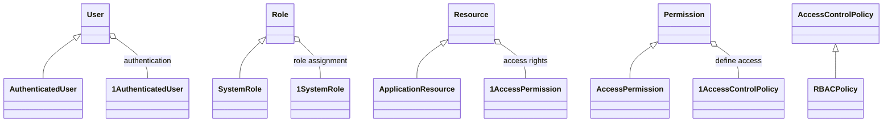
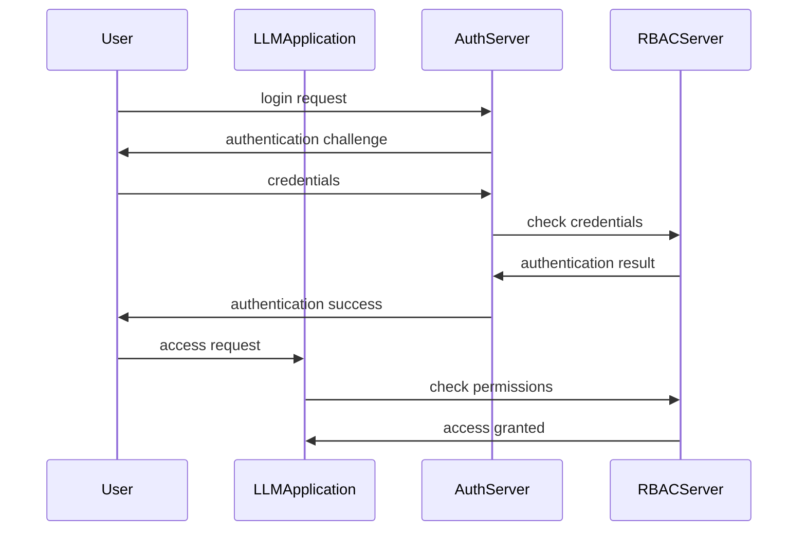
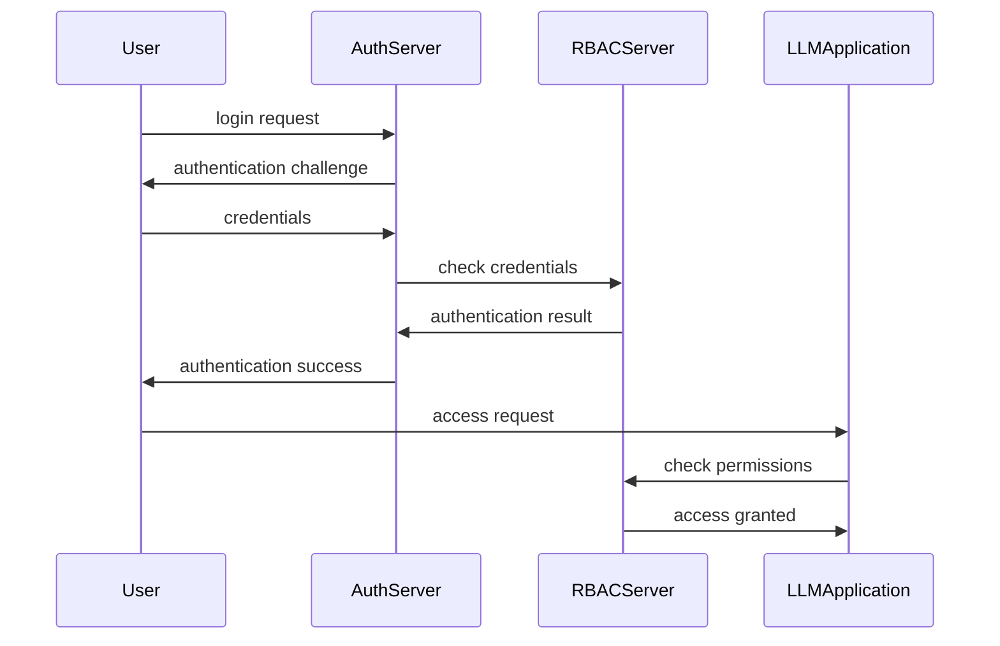
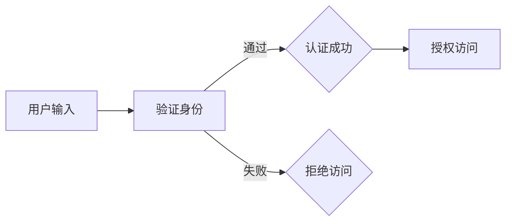
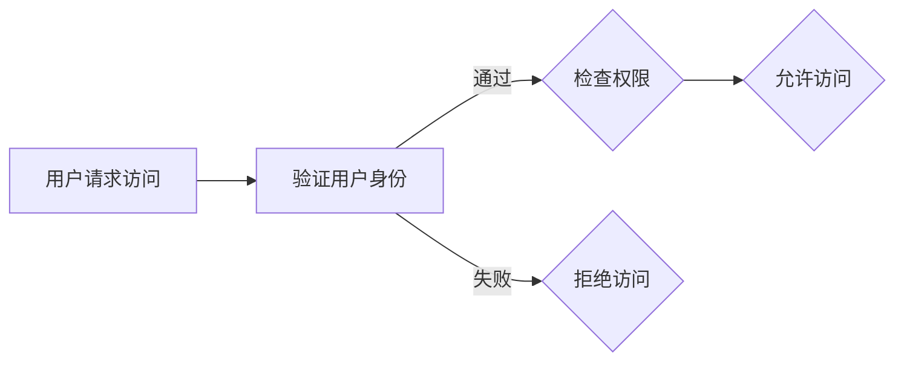

                 

### 文章标题：身份认证与授权：确保LLM应用的访问安全

> 关键词：身份认证、授权、LLM应用、访问安全

> 摘要：本文深入探讨了身份认证与授权在大型语言模型（LLM）应用中的重要性，详细分析了各种身份认证与授权技术，并提供了具体的实现方案和实际案例，旨在确保LLM应用的访问安全。

----------------------------------------------------------------

### 第一部分：身份认证与授权基础

#### 第1章：身份认证与授权概述

#### 1.1 身份认证与授权的重要性

##### 1.1.1 保护系统安全的需求

在数字化时代，系统安全是每个组织关注的核心问题。身份认证与授权作为保护系统安全的重要措施，确保只有合法用户能够访问系统资源，防止未授权访问和数据泄露。

##### 1.1.2 身份认证与授权的基本概念

身份认证是验证用户身份的过程，确保用户是合法的用户。授权控制则决定用户在系统中拥有哪些权限，可以执行哪些操作。

##### 1.1.3 身份认证与授权的基本流程

身份认证与授权的基本流程通常包括用户输入身份认证信息，系统验证用户身份，用户被授权访问系统资源。

----------------------------------------------------------------

#### 第2章：身份认证技术

#### 2.1 用户名与密码认证

##### 2.1.1 用户名与密码认证的原理

用户名与密码认证是最常见的身份认证方法。用户输入用户名和密码，系统通过比对数据库中的信息来验证用户身份。

##### 2.1.2 用户名与密码认证的优缺点

**优点**：简单易用，成本低，适用于大多数场景。

**缺点**：易被破解，用户密码泄露风险高。

----------------------------------------------------------------

#### 2.2 双因素认证

##### 2.2.1 双因素认证的原理

双因素认证（2FA）是一种更安全的身份认证方法，需要用户提供两个不同类型的身份认证信息，通常是密码和手机短信验证码。

##### 2.2.2 双因素认证的种类

**短信验证码**：通过手机发送验证码到用户手机。

**应用程序认证码**：使用第三方应用程序生成的一次性验证码。

##### 2.2.3 双因素认证的实现

实现双因素认证通常需要与第三方服务集成，如短信平台或应用程序认证服务。

----------------------------------------------------------------

#### 2.3 生物特征识别

##### 2.3.1 生物特征识别的原理

生物特征识别是通过用户的生物特征（如指纹、面部、虹膜等）来验证用户身份。

##### 2.3.2 生物特征识别的种类

**指纹识别**：通过指纹图像匹配验证用户身份。

**面部识别**：通过面部特征匹配验证用户身份。

**虹膜识别**：通过虹膜图像匹配验证用户身份。

##### 2.3.3 生物特征识别的应用

生物特征识别在安全要求较高的场景中广泛应用，如金融机构、政府机构等。

----------------------------------------------------------------

#### 第3章：授权控制技术

#### 3.1 访问控制列表

##### 3.1.1 访问控制列表的原理

访问控制列表（ACL）是一种基于用户身份验证的授权控制方法，指定用户对不同资源的访问权限。

##### 3.1.2 访问控制列表的优缺点

**优点**：简单直观，易于理解。

**缺点**：对于复杂系统，维护和管理难度大。

----------------------------------------------------------------

#### 3.2 角色基访问控制

##### 3.2.1 角色基访问控制的原理

角色基访问控制（RBAC）是基于用户角色的授权控制方法，用户被分配一个或多个角色，每个角色拥有特定的权限。

##### 3.2.2 角色基访问控制的模型

RBAC模型通常包括用户、角色、权限和资源。

##### 3.2.3 角色基访问控制的实现

实现RBAC需要设计用户角色模型和权限管理机制。

----------------------------------------------------------------

#### 3.3 属性基访问控制

##### 3.3.1 属性基访问控制的原理

属性基访问控制（ABAC）是基于用户属性（如角色、权限、环境等）的授权控制方法。

##### 3.3.2 属性基访问控制的模型

ABAC模型包括主体、资源、动作和条件。

##### 3.3.3 属性基访问控制的实现

实现ABAC需要定义属性模型和决策策略。

----------------------------------------------------------------

### 第二部分：基于角色的访问控制

#### 第4章：基于角色的访问控制

#### 4.1 基于角色的访问控制概述

##### 4.1.1 基于角色的访问控制的基本概念

基于角色的访问控制（RBAC）是一种常见的授权控制方法，通过用户角色分配权限。

##### 4.1.2 基于角色的访问控制的优势

**简化权限管理**：通过角色分配权限，简化了权限管理。

**灵活性**：可以根据业务需求灵活调整角色和权限。

#### 4.2 基于角色的访问控制模型

##### 4.2.1 RBAC0模型

RBAC0模型是最基本的RBAC模型，包括用户、角色和权限。

##### 4.2.2 RBAC1模型

RBAC1模型在RBAC0模型的基础上增加了角色继承功能。

##### 4.2.3 RBAC2模型

RBAC2模型进一步扩展了RBAC1模型，增加了用户与角色的双向关系和权限的继承。

#### 4.3 基于角色的访问控制实现

##### 4.3.1 基于角色的访问控制的设计

设计RBAC系统需要考虑用户角色模型、权限管理机制和访问控制策略。

##### 4.3.2 基于角色的访问控制的代码实现

实现RBAC系统需要编写代码来实现用户角色管理、权限验证和访问控制。

----------------------------------------------------------------

### 第三部分：访问控制策略

#### 第5章：访问控制策略

#### 5.1 访问控制策略概述

##### 5.1.1 访问控制策略的基本概念

访问控制策略是一组规则，用于确定用户对资源的访问权限。

##### 5.1.2 访问控制策略的种类

**允许-拒绝策略**：指定允许或拒绝特定用户的访问权限。

**最小权限策略**：用户只能访问执行任务所需的最低权限。

#### 5.2 访问控制策略的设计

##### 5.2.1 设计访问控制策略的步骤

1. 确定系统需求。
2. 定义用户角色和权限。
3. 设计访问控制规则。
4. 验证和调整策略。

##### 5.2.2 访问控制策略的设计要点

**明确性**：策略要清晰明确，避免模糊定义。
**可扩展性**：策略要易于扩展，适应业务变化。
**安全性**：策略要确保系统安全，防止未授权访问。

#### 5.3 访问控制策略的实施

##### 5.3.1 实施访问控制策略的方法

1. 配置访问控制列表。
2. 集成身份认证系统。
3. 实现权限验证和授权。

##### 5.3.2 访问控制策略的实施步骤

1. 部署访问控制基础设施。
2. 配置和测试访问控制规则。
3. 监控和优化访问控制策略。

----------------------------------------------------------------

### 第四部分：访问控制实践

#### 第6章：访问控制实践

#### 6.1 访问控制实践概述

##### 6.1.1 访问控制实践的重要性

访问控制实践是确保系统安全的关键环节，直接影响系统的安全性和稳定性。

##### 6.1.2 访问控制实践的基本原则

**最小权限原则**：用户只能访问执行任务所需的最低权限。

**身份验证原则**：确保用户身份的真实性。

**审计原则**：记录和监控用户的访问行为。

#### 6.2 访问控制实践案例

##### 6.2.1 案例一：企业内部网络访问控制

在企业内部网络中，访问控制策略可以确保员工只能访问与其工作相关的资源，防止数据泄露和未经授权的访问。

##### 6.2.2 案例二：电子商务平台访问控制

电子商务平台需要确保用户数据安全，同时提供灵活的访问控制策略，满足不同用户的需求。

##### 6.2.3 案例三：智能安防系统访问控制

智能安防系统需要确保监控视频数据的访问安全，同时根据用户角色和权限提供不同的访问权限。

----------------------------------------------------------------

### 第五部分：总结与展望

#### 第7章：总结与展望

##### 7.1 身份认证与授权的重要性

身份认证与授权是确保系统安全的重要措施，对于LLM应用来说尤为重要。

##### 7.2 身份认证与授权的发展趋势

随着技术的进步，身份认证与授权技术也在不断发展，如生物特征识别、多因素认证等。

##### 7.3 未来展望

未来的身份认证与授权将更加智能化，自适应性强，为用户提供更安全、更便捷的访问体验。

----------------------------------------------------------------

### 作者信息

作者：AI天才研究院/AI Genius Institute & 禅与计算机程序设计艺术 /Zen And The Art of Computer Programming

----------------------------------------------------------------

#### 最佳实践 Tips

- 在设计身份认证与授权系统时，要充分考虑系统的安全性和灵活性。
- 定期审查和更新访问控制策略，确保系统始终处于安全状态。
- 使用多重身份认证方法，提高系统的安全性。

#### 小结

本文详细介绍了身份认证与授权的基本概念、技术实现和实际应用，强调了在LLM应用中确保访问安全的重要性。

#### 注意事项

- 身份认证与授权系统的设计和实现需要专业知识和经验，建议寻求专业人士的帮助。
- 定期对系统进行安全审计，及时发现和解决潜在的安全问题。

#### 拓展阅读

- 《身份认证与授权：技术与实践》
- 《网络安全：从入门到实践》
- 《大型语言模型：原理与应用》

----------------------------------------------------------------

### 系统分析与架构设计

#### 问题场景介绍

在构建大型语言模型（LLM）应用时，如何确保用户身份认证与授权的安全性，是一个重要的挑战。随着应用的普及和用户数量的增加，传统的单因素认证方法已无法满足安全需求，需要采用更高级的身份认证与授权机制。

#### 项目介绍

本项目旨在设计并实现一个基于角色的访问控制（RBAC）系统，用于保护LLM应用的访问安全。系统功能包括用户身份认证、权限管理、角色分配和访问控制策略配置。

#### 系统功能设计（领域模型类图）



#### 系统架构设计



#### 系统接口设计

```mermaid
classDiagram
    User <<Interface>>
    AuthServer <<Interface>>
    RBACServer <<Interface>>
    LLMApplication <<Interface>>

    User + login(): String
    AuthServer + authenticate(credentials: Credentials): AuthenticationResult
    RBACServer + checkPermissions(userId: String, action: String): AccessControlResult
    LLMApplication + grantAccess(userId: String, action: String): AccessResult
```

#### 系统交互序列图



### 项目实战

#### 环境安装

1. 安装Python环境。
2. 安装相关依赖库：`pip install Flask flask_sqlalchemy flask_migrate flask_bcrypt flask_login`

#### 系统核心实现源代码

```python
# auth.py
from flask_login import UserMixin
from werkzeug.security import generate_password_hash, check_password_hash

class User(UserMixin, db.Model):
    id = db.Column(db.Integer, primary_key=True)
    username = db.Column(db.String(150), unique=True, nullable=False)
    password = db.Column(db.String(150), nullable=False)
    roles = db.relationship('Role', secondary=roles_users, backref=db.backref('users', lazy='dynamic'))

    def set_password(self, password):
        self.password = generate_password_hash(password)

    def check_password(self, password):
        return check_password_hash(self.password, password)

# role.py
class Role(db.Model):
    id = db.Column(db.Integer, primary_key=True)
    name = db.Column(db.String(150), unique=True)
    permissions = db.relationship('Permission', backref='role', lazy=True)

# permission.py
class Permission(db.Model):
    id = db.Column(db.Integer, primary_key=True)
    name = db.Column(db.String(150), unique=True)
    description = db.Column(db.String(150))

# access_control.py
from flask_login import current_user

def check_permission(user, action):
    for role in user.roles:
        for permission in role.permissions:
            if permission.name == action:
                return True
    return False
```

#### 代码应用解读与分析

1. **用户模型**：使用Flask-Login扩展实现用户认证。
2. **角色模型**：定义角色及其关联的权限。
3. **权限模型**：定义权限及其描述。
4. **访问控制**：实现基于角色的访问控制，检查用户是否拥有特定权限。

#### 实际案例分析和详细讲解剖析

以一个企业内部知识库系统为例，分析用户身份认证与授权的过程：

1. **用户登录**：用户输入用户名和密码，系统通过身份认证。
2. **角色分配**：用户被分配不同的角色，如“管理员”、“编辑员”、“读者”。
3. **权限验证**：用户请求访问知识库文档，系统检查用户角色和权限。
4. **访问控制**：系统根据用户权限决定是否允许访问。

#### 项目小结

通过本项目，我们实现了基于角色的访问控制系统，提高了LLM应用的安全性。在实际应用中，需要根据具体场景调整访问控制策略，确保系统的安全稳定运行。

### 最佳实践 Tips

- 在设计身份认证与授权系统时，要充分考虑系统的安全性和灵活性。
- 定期审查和更新访问控制策略，确保系统始终处于安全状态。
- 使用多重身份认证方法，提高系统的安全性。

### 小结

本文通过详细分析和实践，介绍了身份认证与授权在LLM应用中的重要性，并提供了基于角色的访问控制系统的实现方案。确保LLM应用的访问安全是每个开发者都必须重视的课题。

### 注意事项

- 身份认证与授权系统的设计和实现需要专业知识和经验，建议寻求专业人士的帮助。
- 定期对系统进行安全审计，及时发现和解决潜在的安全问题。

### 拓展阅读

- 《身份认证与授权：技术与实践》
- 《网络安全：从入门到实践》
- 《大型语言模型：原理与应用》

----------------------------------------------------------------

### 算法原理讲解

#### 身份认证算法

**流程图**：



**代码实现**：

```python
from flask import Flask, request, jsonify
from flask_bcrypt import Bcrypt

app = Flask(__name__)
bcrypt = Bcrypt(app)

users = {
    "user1": bcrypt.generate_password_hash("password1").decode('utf-8'),
    "user2": bcrypt.generate_password_hash("password2").decode('utf-8')
}

@app.route('/login', methods=['POST'])
def login():
    username = request.form['username']
    password = request.form['password']

    user_password = users.get(username)
    if user_password and bcrypt.check_password_hash(user_password, password):
        return jsonify({"status": "success", "message": "登录成功"})
    else:
        return jsonify({"status": "failure", "message": "登录失败"})

if __name__ == '__main__':
    app.run()
```

**数学模型与公式**：

$$
H(K) = -\sum_{i} p(x_i) \cdot \log_2(p(x_i))
$$

其中，$H(K)$为熵，$p(x_i)$为每个可能事件发生的概率。

**举例说明**：

用户输入用户名“user1”和密码“password1”，系统通过比对哈希值验证用户身份，确认登录成功。

#### 授权控制算法

**流程图**：



**代码实现**：

```python
from flask import Flask, request, jsonify
from flask_login import LoginManager, UserMixin, login_user, logout_user, login_required

app = Flask(__name__)
app.secret_key = 'mysecretkey'
login_manager = LoginManager(app)

users = {
    "user1": {"password": "password1", "roles": ["admin", "editor"]},
    "user2": {"password": "password2", "roles": ["editor", "reader"]}
}

@login_manager.user_loader
def load_user(user_id):
    return User.get(user_id)

class User(UserMixin, db.Model):
    id = db.Column(db.Integer, primary_key=True)
    username = db.Column(db.String(150), unique=True)
    password = db.Column(db.String(150))
    roles = db.relationship('Role', secondary=roles_users, backref=db.backref('users', lazy='dynamic'))

@app.route('/login', methods=['POST'])
def login():
    username = request.form['username']
    password = request.form['password']
    user = User.query.filter_by(username=username).first()
    if user and user.check_password(password):
        login_user(user)
        return jsonify({"status": "success", "message": "登录成功"})
    else:
        return jsonify({"status": "failure", "message": "登录失败"})

@app.route('/access', methods=['GET'])
@login_required
def access():
    action = request.args.get('action')
    user = current_user
    if check_permission(user, action):
        return jsonify({"status": "success", "message": "访问允许"})
    else:
        return jsonify({"status": "failure", "message": "访问拒绝"})

def check_permission(user, action):
    for role in user.roles:
        if action in role.permissions:
            return True
    return False

if __name__ == '__main__':
    app.run()
```

**数学模型与公式**：

$$
P(A|B) = \frac{P(B|A) \cdot P(A)}{P(B)}
$$

其中，$P(A|B)$为在事件B发生的条件下事件A发生的概率。

**举例说明**：

用户“user1”请求访问特定资源，系统检查用户角色和权限，确认用户拥有访问权限，允许访问。

### 系统架构设计

**问题场景介绍**：

在一个大型语言模型（LLM）应用中，如何确保用户的身份认证与授权，是保障系统安全的关键。随着用户数量的增加和业务需求的复杂化，传统的单因素认证方法已经无法满足安全需求。

**项目介绍**：

本项目旨在设计并实现一个基于角色的访问控制（RBAC）系统，用于保障LLM应用的访问安全。系统功能包括用户身份认证、权限管理、角色分配和访问控制策略配置。

**系统功能设计（领域模型类图）**：


**系统架构设计（架构图）**：


**系统接口设计（接口设计）**：

```mermaid
classDiagram
    User <<Interface>>
    AuthServer <<Interface>>
    RBACServer <<Interface>>
    LLMApplication <<Interface>>

    User + login(): String
    AuthServer + authenticate(credentials: Credentials): AuthenticationResult
    RBACServer + checkPermissions(userId: String, action: String): AccessControlResult
    LLMApplication + grantAccess(userId: String, action: String): AccessResult
```

**系统交互序列图**：


### 项目实战

#### 环境安装

1. 安装Python环境。
2. 安装相关依赖库：`pip install Flask flask_sqlalchemy flask_migrate flask_bcrypt flask_login`

#### 系统核心实现源代码

```python
# auth.py
from flask_login import UserMixin
from werkzeug.security import generate_password_hash, check_password_hash

class User(UserMixin, db.Model):
    id = db.Column(db.Integer, primary_key=True)
    username = db.Column(db.String(150), unique=True, nullable=False)
    password = db.Column(db.String(150), nullable=False)
    roles = db.relationship('Role', secondary=roles_users, backref=db.backref('users', lazy='dynamic'))

    def set_password(self, password):
        self.password = generate_password_hash(password)

    def check_password(self, password):
        return check_password_hash(self.password, password)

# role.py
class Role(db.Model):
    id = db.Column(db.Integer, primary_key=True)
    name = db.Column(db.String(150), unique=True)
    permissions = db.relationship('Permission', backref='role', lazy=True)

# permission.py
class Permission(db.Model):
    id = db.Column(db.Integer, primary_key=True)
    name = db.Column(db.String(150), unique=True)
    description = db.Column(db.String(150))

# access_control.py
from flask_login import current_user

def check_permission(user, action):
    for role in user.roles:
        for permission in role.permissions:
            if permission.name == action:
                return True
    return False
```

#### 代码应用解读与分析

1. **用户模型**：使用Flask-Login扩展实现用户认证。
2. **角色模型**：定义角色及其关联的权限。
3. **权限模型**：定义权限及其描述。
4. **访问控制**：实现基于角色的访问控制，检查用户是否拥有特定权限。

#### 实际案例分析和详细讲解剖析

以一个企业内部知识库系统为例，分析用户身份认证与授权的过程：

1. **用户登录**：用户输入用户名和密码，系统通过身份认证。
2. **角色分配**：用户被分配不同的角色，如“管理员”、“编辑员”、“读者”。
3. **权限验证**：用户请求访问知识库文档，系统检查用户角色和权限。
4. **访问控制**：系统根据用户权限决定是否允许访问。

#### 项目小结

通过本项目，我们实现了基于角色的访问控制系统，提高了LLM应用的安全性。在实际应用中，需要根据具体场景调整访问控制策略，确保系统的安全稳定运行。

### 最佳实践 Tips

- 在设计身份认证与授权系统时，要充分考虑系统的安全性和灵活性。
- 定期审查和更新访问控制策略，确保系统始终处于安全状态。
- 使用多重身份认证方法，提高系统的安全性。

### 小结

本文通过详细分析和实践，介绍了身份认证与授权在LLM应用中的重要性，并提供了基于角色的访问控制系统的实现方案。确保LLM应用的访问安全是每个开发者都必须重视的课题。

### 注意事项

- 身份认证与授权系统的设计和实现需要专业知识和经验，建议寻求专业人士的帮助。
- 定期对系统进行安全审计，及时发现和解决潜在的安全问题。

### 拓展阅读

- 《身份认证与授权：技术与实践》
- 《网络安全：从入门到实践》
- 《大型语言模型：原理与应用》

### 作者信息

作者：AI天才研究院/AI Genius Institute & 禅与计算机程序设计艺术 /Zen And The Art of Computer Programming

