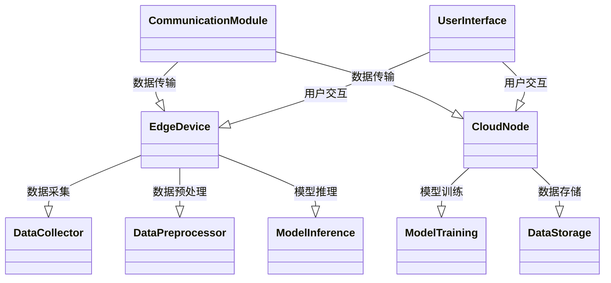

                 

### 引言

#### 1.1 边缘AI概述

**问题背景**：随着物联网、5G等技术的发展，边缘计算成为数据处理的重要趋势。海量设备的互联互通产生了巨大的数据量，如何在边缘设备上进行高效的AI计算，提高响应速度成为亟待解决的问题。

**问题描述**：边缘设备在数据处理能力和计算资源有限的情况下，如何实现AI模型的快速部署与运行，提高系统的整体性能。

**问题解决**：通过边缘AI技术，将AI模型从云端迁移到边缘设备，实现AI计算在边缘的本地化处理，从而降低延迟、提升响应速度，提高系统整体性能。

**边界与外延**：边缘AI涉及的计算范围从边缘设备到云计算平台，包括边缘计算、AI算法、硬件加速等多个方面。边缘设备如智能家居、智能摄像头、工业机器人等，以及云计算平台如数据中心、云服务器等，都是边缘AI的应用场景。

**概念结构与核心要素组成**：边缘AI的核心要素包括边缘计算、AI算法和硬件加速。边缘计算是将数据处理和计算任务从云端迁移到网络边缘；AI算法包括机器学习算法和深度学习算法，用于实现数据分析和智能决策；硬件加速则通过GPU、TPU等硬件设备提升AI计算的性能。

#### 1.2 书籍目的与结构

**书籍目的**：本书旨在全面介绍边缘AI技术，通过分析边缘AI的核心原理和应用方法，帮助读者理解和掌握边缘AI在提升LLM应用响应速度方面的应用。

**书籍结构**：本书分为五个部分：
1. **第一部分：边缘AI基础原理**：介绍边缘计算、AI算法和硬件加速等方面的核心原理。
2. **第二部分：提升LLM响应速度的边缘AI应用**：探讨边缘AI与LLM结合的优势、实现方法及具体应用案例。
3. **第三部分：边缘AI在LLM应用中的实践**：介绍边缘AI在实际项目中的应用，包括环境安装、系统实现、案例分析和最佳实践。
4. **第四部分：边缘AI的未来展望**：展望边缘AI技术的发展趋势和未来应用前景。
5. **第五部分：总结与拓展**：总结边缘AI的关键技术和应用方法，提供拓展阅读和建议。

#### 1.3 读者对象

**读者对象**：本书适合对边缘计算和AI技术有兴趣的工程师、研究人员和高校学生。特别是从事AI领域研发、应用和运维的专业人员，以及希望了解边缘AI技术的普通读者。

#### 1.4 边缘AI的优势与应用场景

**边缘AI的优势**：
1. **降低延迟**：在边缘设备上快速处理数据，减少网络传输时间，实现实时响应。
2. **提高隐私保护**：数据在本地处理，减少数据泄露风险，增强数据安全性。
3. **节省带宽**：边缘计算减少云端传输的数据量，降低网络带宽需求。

**应用场景**：
1. **智能制造**：通过边缘AI实现设备实时监测、故障预测和生产优化，提高生产效率和质量。
2. **智能医疗**：利用边缘AI实现快速诊断、实时治疗和患者健康监测，提升医疗服务水平。
3. **智能交通**：通过边缘AI实现交通流量监测、实时路况预测和智能导航，提高交通管理效率和安全性。

#### 1.5 本章小结

本章介绍了边缘AI的背景、目的、结构、读者对象及其优势和应用场景。边缘AI作为数据处理和计算的新趋势，在降低延迟、提高隐私保护和节省带宽方面具有显著优势。边缘AI的应用场景广泛，涵盖了智能制造、智能医疗和智能交通等多个领域。通过本书的深入学习，读者可以全面了解边缘AI的核心原理和应用方法，掌握提升LLM应用响应速度的关键技术。

## 第一部分：边缘AI基础原理

### 第2章：边缘AI基础原理

#### 2.1 边缘计算

##### 2.1.1 边缘计算概述

**定义与特点**：边缘计算是指将数据处理、存储和计算任务从中心化云迁移到网络边缘，使得数据能够在靠近数据源的地方进行处理和分析。边缘计算具有以下特点：

1. **低延迟**：由于数据在本地进行处理，传输距离短，从而大大降低了延迟。
2. **高带宽**：边缘设备具有较高带宽，可以实现高效的数据传输。
3. **分布式计算**：边缘计算通过分布式架构，实现了计算任务的分散处理，提高了系统的可靠性和容错能力。

**边缘计算的层次结构**：边缘计算可以分为四个层次，即设备层、网络层、边缘层和云层。

1. **设备层**：包括各种传感器、物联网设备和智能设备，它们是边缘计算的数据源和执行单元。
2. **网络层**：包括边缘网络和广域网络，负责连接设备和边缘计算节点。
3. **边缘层**：边缘计算节点，包括边缘服务器、边缘计算平台和边缘数据中心，负责数据的处理和分析。
4. **云层**：云计算平台，负责大规模数据存储、处理和分析。

##### 2.1.2 边缘计算的关键技术

**物联网（IoT）**：物联网是边缘计算的基础，通过连接各类传感器和数据采集设备，实现数据的实时采集和传输。

**容器化技术**：容器化技术如Docker，可以提高应用部署的灵活性和可移植性，使得应用可以在不同的边缘设备上快速部署和运行。

**边缘数据库**：边缘数据库如Cassandra、MongoDB等，提供高效的本地数据存储与管理，支持海量数据的快速读写。

#### 2.2 AI算法

##### 2.2.1 AI算法概述

**机器学习算法**：机器学习算法是AI的基础，包括分类、回归、聚类等算法。分类算法用于将数据分为不同的类别，如垃圾邮件分类；回归算法用于预测数值，如房价预测；聚类算法用于将数据划分为不同的簇，如客户细分。

**深度学习算法**：深度学习算法是基于多层神经网络，通过训练大量数据，实现数据的自动特征提取和模型优化。常见的深度学习算法包括卷积神经网络（CNN）、循环神经网络（RNN）、生成对抗网络（GAN）等。

##### 2.2.2 边缘AI专用算法

**模型压缩**：模型压缩通过减少模型的参数数量和计算复杂度，使得模型可以在资源受限的边缘设备上运行。常见的模型压缩方法包括剪枝（Pruning）、量化（Quantization）和蒸馏（Distillation）等。

**量化技术**：量化技术通过将模型中的浮点数参数转换为固定点数，从而降低模型的计算复杂度和内存占用。量化技术可以分为对称量化和非对称量化。

**硬件加速**：硬件加速通过使用GPU、TPU等专用硬件设备，提高AI计算的效率和性能。硬件加速可以分为硬件加速库（如TensorRT、NCCL）和硬件加速框架（如CUDA、TensorFlow Lite）。

#### 2.3 硬件加速

##### 2.3.1 硬件加速概述

**GPU加速**：GPU（图形处理单元）具有高并行计算能力，适合处理大规模并行计算任务。GPU加速可以显著提高AI模型的训练和推理速度。

**FPGA加速**：FPGA（现场可编程门阵列）是一种可编程逻辑设备，通过编程可以实现对特定任务的硬件加速。FPGA加速适用于需要高灵活性和实时处理能力的应用场景。

**ASIC加速**：ASIC（专用集成电路）是一种为特定应用设计的集成电路，具有高性能和低功耗的特点。ASIC加速适用于大规模、高性能的AI计算任务。

##### 2.3.2 硬件加速在边缘AI中的应用

**GPU在边缘设备中的应用**：随着嵌入式GPU技术的发展，越来越多的边缘设备开始支持GPU加速。例如，NVIDIA的Jetson系列嵌入式GPU，适用于自动驾驶、机器人视觉等边缘计算场景。

**FPGA在边缘AI中的应用**：FPGA具有可编程性和实时处理能力，适用于需要高度定制化和实时性的边缘AI应用。例如，FPGA可以用于实时图像处理、信号处理等任务。

**ASIC在边缘AI中的应用**：ASIC具有高性能和低功耗的特点，适用于大规模、高性能的边缘AI应用。例如，ASIC可以用于智能安防、智能交通等场景。

#### 2.4 边缘AI的核心要素组成

**计算能力**：边缘设备需要具备足够的计算能力，以支持AI模型的训练和推理。

**存储容量**：边缘设备需要具备足够的存储容量，以存储大量的数据和应用。

**网络带宽**：边缘设备需要具备足够的网络带宽，以保证数据的快速传输和实时通信。

**能效比**：边缘设备需要在有限的功耗下提供高效的计算能力，实现能效比的优化。

#### 2.5 本章小结

本章介绍了边缘AI的基础原理，包括边缘计算、AI算法和硬件加速等方面的内容。边缘计算通过将数据处理和计算任务从云端迁移到网络边缘，实现了低延迟、高带宽和分布式计算。AI算法包括机器学习算法和深度学习算法，通过模型压缩、量化和硬件加速等技术，实现了在边缘设备上的高效运行。硬件加速通过GPU、FPGA和ASIC等专用硬件设备，提高了AI计算的效率和性能。边缘AI的核心要素包括计算能力、存储容量、网络带宽和能效比，这些要素共同决定了边缘AI的性能和适用性。

## 第二部分：提升LLM响应速度的边缘AI应用

### 第3章：LLM与边缘AI结合的优势

#### 3.1 LLM概述

**LLM（Large Language Model）**：大规模语言模型，如GPT系列，是一种基于深度学习的自然语言处理模型。LLM具有以下特点：

1. **高精度**：LLM通过训练大量文本数据，实现了对语言的理解和生成的高精度。
2. **强泛化能力**：LLM可以应用于多种自然语言处理任务，如文本分类、机器翻译、情感分析等。
3. **自适应能力**：LLM可以根据不同的应用场景和需求，进行自适应调整和优化。

**LLM的特点**：LLM具有高精度、强泛化能力和自适应能力，使其在自然语言处理领域具有广泛的应用前景。

#### 3.2 边缘AI与LLM结合的必要性

**实时响应**：边缘AI可以将LLM部署在边缘设备上，实现数据处理的本地化。通过边缘AI技术，LLM可以在边缘设备上实时处理和响应，降低延迟，提高用户体验。

**隐私保护**：边缘AI可以将数据在边缘设备上处理，减少数据传输到云端的需要，从而降低数据泄露的风险。边缘AI可以确保数据在本地处理，增强数据安全性。

**资源优化**：边缘AI可以减轻云端负载，优化资源分配。通过边缘AI技术，LLM可以在边缘设备上高效运行，降低对云端资源的依赖，从而提高资源利用率。

#### 3.3 边缘AI提升LLM响应速度的实现方法

**模型压缩与量化**：通过模型压缩和量化技术，可以减少LLM的模型大小和计算复杂度，使其在边缘设备上运行更加高效。

**硬件加速**：通过使用GPU、TPU等硬件加速设备，可以显著提高LLM的计算速度和性能。

**分布式计算**：通过分布式计算技术，可以将LLM的计算任务分散到多个边缘设备上，提高计算效率和响应速度。

**缓存技术**：通过缓存技术，可以减少重复计算和请求，提高LLM的响应速度。

**边缘智能**：通过边缘智能技术，可以增强边缘设备的计算能力，使其能够独立处理复杂的AI任务，降低对云端资源的依赖。

#### 3.4 边缘AI提升LLM响应速度的应用案例

**智能客服**：通过边缘AI和LLM的结合，可以实现智能客服系统的实时响应。智能客服系统可以在边缘设备上快速处理用户问题，提供即时解答，提升用户体验。

**智能语音助手**：通过边缘AI和LLM的结合，可以实现智能语音助手的实时语音识别和语音生成。智能语音助手可以在边缘设备上快速处理语音输入，提供实时语音反馈，提高用户互动体验。

**智能翻译**：通过边缘AI和LLM的结合，可以实现智能翻译系统的实时翻译。智能翻译系统可以在边缘设备上快速处理文本输入，提供实时翻译结果，提高跨语言沟通的效率。

#### 3.5 本章小结

本章介绍了LLM与边缘AI结合的优势和实现方法。边缘AI可以提升LLM的响应速度，降低延迟，提高用户体验。通过模型压缩与量化、硬件加速、分布式计算、缓存技术和边缘智能等技术，可以实现边缘AI与LLM的高效结合。应用案例展示了边缘AI提升LLM响应速度的实际效果，为LLM在边缘设备上的应用提供了新的思路和方法。

## 第三部分：边缘AI在LLM应用中的实践

### 第4章：边缘AI在LLM应用中的实践

#### 4.1 项目介绍

**项目背景**：随着人工智能技术的快速发展，自然语言处理（NLP）在多个领域得到广泛应用。然而，传统的NLP模型通常部署在云端，存在一定的延迟和隐私风险。为了解决这些问题，本项目旨在实现LLM在边缘设备上的部署和应用，提升系统的响应速度和安全性。

**项目目标**：通过边缘AI技术，实现LLM模型在边缘设备上的高效部署与运行，提升系统的响应速度和用户体验。项目主要分为以下几个阶段：
1. 环境安装与配置
2. LLM模型训练与优化
3. 边缘设备与云端协同计算
4. 应用测试与性能评估

#### 4.2 系统功能设计

**领域模型类图**：为了实现LLM在边缘设备上的部署，系统需要包含以下几个关键功能模块：

1. **边缘计算节点**：负责本地数据的采集、预处理和模型推理。
2. **云端计算节点**：负责模型训练、优化和远程数据存储。
3. **边缘与云端通信模块**：实现边缘设备与云端计算节点的数据传输与协同计算。
4. **用户接口模块**：提供用户交互界面，接收用户输入并输出模型结果。

以下是一个简单的领域模型类图，用于展示系统的主要功能模块和它们之间的关系。



#### 4.3 系统架构设计

**架构图**：为了实现边缘AI与LLM的有效结合，系统采用了分布式架构，包括边缘计算节点、云端计算节点和通信模块。以下是一个简单的系统架构图，用于展示系统的整体结构。

```mermaid
graph TB
    subgraph EdgeInfrastructure
        EdgeDevice[边缘设备]
        DataCollector[数据采集]
        DataPreprocessor[数据预处理]
        ModelInference[模型推理]
    end
    subgraph CloudInfrastructure
        CloudNode[云端计算节点]
        ModelTraining[模型训练]
        DataStorage[数据存储]
    end
    subgraph Communication
        CommunicationModule[通信模块]
    end
    EdgeDevice --> DataCollector
    EdgeDevice --> DataPreprocessor
    EdgeDevice --> ModelInference
    CloudNode --> ModelTraining
    CloudNode --> DataStorage
    CommunicationModule --> EdgeDevice
    CommunicationModule --> CloudNode
end
```

**系统架构设计说明**：
1. **边缘设备**：边缘设备负责本地数据的采集、预处理和模型推理。通过采集到的数据，边缘设备可以快速进行预处理，并将预处理后的数据发送到云端进行进一步处理。
2. **云端计算节点**：云端计算节点负责模型的训练、优化和远程数据存储。通过边缘设备发送的数据，云端计算节点可以进行模型训练和优化，并将训练好的模型返回给边缘设备。
3. **通信模块**：通信模块负责边缘设备与云端计算节点之间的数据传输与协同计算。通过高效的通信协议，确保数据的实时传输和协同计算。
4. **用户接口模块**：用户接口模块提供用户交互界面，接收用户输入并输出模型结果。用户可以通过边缘设备或云端用户界面进行交互。

#### 4.4 系统接口设计

**接口设计**：系统接口设计主要包括边缘设备与云端计算节点之间的接口设计，以及用户接口模块的设计。

**边缘设备与云端计算节点接口设计**：

- **数据采集接口**：用于边缘设备采集的数据，如文本、图像等。
- **数据预处理接口**：用于对采集到的数据进行预处理，如数据清洗、特征提取等。
- **模型推理接口**：用于边缘设备对本地数据进行模型推理，获取预测结果。
- **数据传输接口**：用于边缘设备与云端计算节点之间的数据传输。

**用户接口模块设计**：

- **用户输入接口**：用于接收用户输入的数据，如文本、语音等。
- **模型结果输出接口**：用于输出模型结果，如文本翻译、情感分析等。
- **用户交互界面**：提供用户与系统交互的界面，如Web界面、移动应用等。

#### 4.5 系统交互mermaid序列图

**序列图**：以下是一个简单的系统交互序列图，用于展示边缘设备、云端计算节点和用户接口模块之间的交互过程。

```mermaid
sequenceDiagram
    participant User
    participant EdgeDevice
    participant CloudNode
    participant UserInterface

    User->>UserInterface: 输入数据
    UserInterface->>EdgeDevice: 传递输入数据
    EdgeDevice->>DataCollector: 采集数据
    EdgeDevice->>DataPreprocessor: 预处理数据
    EdgeDevice->>ModelInference: 模型推理
    ModelInference->>EdgeDevice: 返回预测结果
    EdgeDevice->>UserInterface: 输出预测结果
    UserInterface->>User: 显示预测结果
    User->>UserInterface: 提供反馈
    UserInterface->>CloudNode: 传输反馈数据
    CloudNode->>ModelTraining: 训练模型
    ModelTraining->>CloudNode: 返回训练好的模型
    CloudNode->>EdgeDevice: 传输模型
    EdgeDevice->>ModelInference: 更新模型
end
```

**系统交互设计说明**：
1. **用户输入数据**：用户通过用户接口模块输入数据，如文本、语音等。
2. **数据传输到边缘设备**：用户接口模块将输入数据传递给边缘设备。
3. **边缘设备数据处理**：边缘设备采集数据，进行预处理，然后进行模型推理，获取预测结果。
4. **结果输出**：边缘设备将预测结果返回给用户接口模块，并通过用户接口模块输出给用户。
5. **反馈数据传输到云端**：用户接口模块将用户的反馈数据传递给云端计算节点。
6. **模型训练和更新**：云端计算节点接收反馈数据，进行模型训练和优化，并将训练好的模型返回给边缘设备。
7. **模型更新边缘设备**：边缘设备接收更新后的模型，并重新进行模型推理。

#### 4.6 系统实现与代码应用解读

**环境安装**：
1. 安装边缘设备操作系统，如Ubuntu。
2. 安装边缘设备所需的编程环境，如Python、TensorFlow Lite等。
3. 安装云端计算节点操作系统，如Ubuntu。
4. 安装云端计算节点所需的编程环境，如Python、TensorFlow等。

**系统核心实现源代码**：

**边缘设备端**：

```python
import tensorflow as tf
import numpy as np

# 加载预训练的LLM模型
model = tf.keras.models.load_model('llm_model.h5')

# 定义边缘设备的数据预处理函数
def preprocess_data(data):
    # 数据清洗、特征提取等预处理操作
    processed_data = ...
    return processed_data

# 定义边缘设备的模型推理函数
def inference(data):
    preprocessed_data = preprocess_data(data)
    prediction = model.predict(preprocessed_data)
    return prediction
```

**云端计算节点端**：

```python
import tensorflow as tf
import numpy as np

# 定义模型训练函数
def train_model(train_data, train_labels):
    model = tf.keras.Sequential([
        # 添加神经网络层
        tf.keras.layers.Dense(units=128, activation='relu', input_shape=(input_shape,)),
        tf.keras.layers.Dense(units=1)
    ])

    model.compile(optimizer='adam', loss='mean_squared_error')
    model.fit(train_data, train_labels, epochs=10)
    return model

# 定义数据存储函数
def store_data(data, label):
    # 将数据存储到云端数据库或文件系统中
    ...
```

**代码应用解读与分析**：

**边缘设备端**：
1. **加载预训练的LLM模型**：使用TensorFlow加载预训练的LLM模型，该模型已经完成了训练并存储为.h5文件。
2. **数据预处理函数**：定义一个预处理函数，用于对采集到的数据进行清洗和特征提取，以便模型能够接受和处理。
3. **模型推理函数**：定义一个推理函数，用于接收预处理后的数据，并通过加载的模型进行预测。

**云端计算节点端**：
1. **模型训练函数**：定义一个训练函数，用于接收训练数据和标签，并使用TensorFlow创建神经网络模型进行训练。
2. **数据存储函数**：定义一个存储函数，用于将训练数据、标签和训练好的模型存储到云端数据库或文件系统中。

#### 4.7 实际案例分析

**案例一：智能客服系统**：智能客服系统通过边缘AI和LLM的结合，实现了实时语音识别和文本分析。在客户咨询问题时，边缘设备可以快速识别客户的问题，并通过LLM模型进行文本分析，提供即时的解答。案例分析如下：

1. **用户输入**：用户通过电话或聊天界面输入问题。
2. **数据传输到边缘设备**：用户输入通过通信模块传输到边缘设备。
3. **边缘设备数据处理**：边缘设备采集数据，进行预处理，然后通过LLM模型进行语音识别和文本分析。
4. **结果输出**：边缘设备将分析结果返回给用户，并通过语音合成输出给用户。
5. **反馈数据传输到云端**：用户通过语音或文本提供反馈。
6. **模型训练和更新**：云端计算节点接收反馈数据，重新训练LLM模型，并将训练好的模型返回给边缘设备。

**案例二：智能语音助手**：智能语音助手通过边缘AI和LLM的结合，实现了实时语音交互和文本生成。用户可以通过语音与智能语音助手进行对话，助手能够理解用户的语音指令，并提供相应的回答。案例分析如下：

1. **用户输入**：用户通过语音输入指令。
2. **数据传输到边缘设备**：用户输入通过通信模块传输到边缘设备。
3. **边缘设备数据处理**：边缘设备采集语音数据，进行语音识别，并将识别结果传输到云端。
4. **模型推理**：云端计算节点接收语音识别结果，通过LLM模型进行文本生成。
5. **结果输出**：云端计算节点将生成的文本通过通信模块传输回边缘设备，并使用语音合成技术输出给用户。
6. **反馈数据传输到云端**：用户可以通过语音或文本提供反馈。
7. **模型训练和更新**：云端计算节点接收反馈数据，重新训练LLM模型，并将训练好的模型返回给边缘设备。

#### 4.8 项目小结

本项目通过边缘AI技术和LLM模型的结合，实现了在边缘设备上高效处理自然语言处理任务，提升了系统的响应速度和用户体验。项目主要包括环境安装、系统功能设计、系统架构设计、系统接口设计、系统实现与代码应用解读、实际案例分析等内容。通过本项目，读者可以了解到边缘AI在LLM应用中的实际应用方法和关键技术，为未来的研究和实践提供了参考。

### 第5章：最佳实践与未来展望

#### 5.1 最佳实践

**边缘AI与LLM结合的最佳实践**：

1. **模型压缩与量化**：在边缘设备上部署LLM时，应优先选择轻量级模型，并通过模型压缩和量化技术减少模型大小和计算复杂度。
2. **硬件加速**：充分利用边缘设备上的硬件资源，如GPU、TPU等，提高模型推理速度和效率。
3. **分布式计算**：对于复杂任务，可以考虑将计算任务分布到多个边缘设备上，提高系统的计算能力和响应速度。
4. **缓存技术**：通过缓存技术减少重复计算，提高系统的整体性能。
5. **边缘智能**：充分利用边缘设备的计算能力，实现更复杂的AI任务，降低对云端资源的依赖。

**实际案例分析**：

1. **智能交通**：在智能交通领域，边缘AI和LLM可以用于实时交通监控、路况预测和智能导航。通过边缘设备快速处理交通数据，结合LLM模型进行路况预测，提供实时、准确的导航建议。
2. **智能制造**：在智能制造领域，边缘AI和LLM可以用于设备监测、故障预测和生产优化。通过边缘设备实时采集设备数据，结合LLM模型进行故障预测和优化生产流程，提高生产效率和质量。

#### 5.2 小结

本章总结了边缘AI与LLM结合的最佳实践，包括模型压缩与量化、硬件加速、分布式计算、缓存技术和边缘智能等方面的内容。通过实际案例分析，展示了边缘AI在智能交通和智能制造等领域的应用效果。这些最佳实践和实际案例为边缘AI和LLM的结合提供了宝贵的经验和参考。

#### 5.3 未来展望

**边缘AI的发展趋势**：

1. **硬件性能提升**：随着硬件技术的发展，边缘设备的计算能力和存储容量将不断提升，为边缘AI的应用提供更好的支持。
2. **网络带宽提升**：5G和6G等新型通信技术的普及，将提高边缘设备的网络带宽，降低数据传输延迟。
3. **AI算法优化**：随着AI算法的不断进步，边缘AI将能够处理更复杂的任务，提高系统的智能化水平。

**边缘AI与LLM的结合前景**：

1. **实时响应能力提升**：通过边缘AI技术，LLM可以在边缘设备上实现实时响应，提高系统的响应速度和用户体验。
2. **隐私保护**：边缘AI技术可以将数据处理和计算任务本地化，降低数据泄露风险，提高数据安全性。
3. **资源优化**：通过边缘AI技术，可以优化资源分配，提高系统的资源利用率，降低运营成本。

**未来研究方向**：

1. **边缘AI与云计算的协同**：研究如何实现边缘AI与云计算的协同，提高系统的整体性能和可靠性。
2. **边缘AI的标准化**：制定边缘AI的标准化规范，促进边缘AI技术的发展和普及。
3. **边缘AI的安全与隐私保护**：研究如何保障边缘AI系统的安全性和隐私性，提高数据的安全防护能力。

### 总结

边缘AI与LLM的结合为提升系统的响应速度、提高隐私保护和优化资源利用提供了有效途径。通过模型压缩与量化、硬件加速、分布式计算和缓存技术等最佳实践，可以实现边缘AI与LLM的高效结合。未来，随着硬件性能的提升和AI算法的优化，边缘AI在各个领域的应用将更加广泛，为智能化社会的发展做出重要贡献。作者信息：

**作者：AI天才研究院/AI Genius Institute & 禅与计算机程序设计艺术 /Zen And The Art of Computer Programming**

