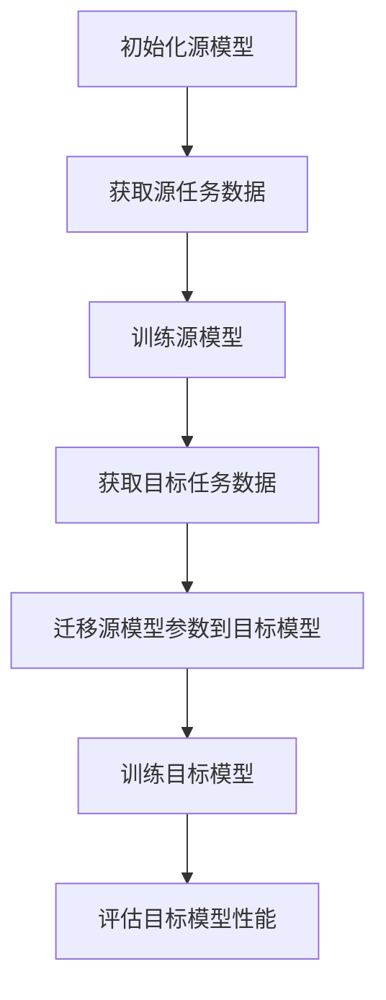

                 

## 迁移学习：快速适应新场景的AI模型优化策略

### 关键词

- 迁移学习
- AI模型优化
- 新场景适应
- 模型优化策略

### 摘要

本文将深入探讨迁移学习在AI模型优化中的应用，分析其基础理论、算法原理和模型优化策略。通过具体的案例和实战，我们将展示如何快速适应新场景，实现AI模型的优化与提升，为人工智能领域的研究者和开发者提供实用的参考和指导。

---

### 第一部分：迁移学习基础理论

#### 第1章：迁移学习概述

##### 1.1 问题背景

在传统机器学习中，我们通常需要大量的标注数据来训练模型。然而，在某些场景下，获取大量标注数据是非常困难甚至不可能的。例如，医学图像分析、自动驾驶系统等。这导致了传统机器学习方法的局限性和高昂的成本。为了解决这个问题，迁移学习（Transfer Learning）应运而生。

##### 1.2 迁移学习的定义

迁移学习是一种利用已在不同任务上训练好的模型，将知识转移到新任务上的机器学习方法。它的核心思想是通过利用已有模型的知识，减少对新任务数据的依赖，从而提高模型的性能。

##### 1.3 迁移学习的类型

迁移学习主要分为两种类型：垂直迁移（Vertical Transfer）和水平迁移（Horizontal Transfer）。垂直迁移是指将一个领域的知识转移到另一个领域，但两者之间存在层次结构。例如，将图像分类模型的知识转移到视频分类任务上。水平迁移则是指将一个领域的知识转移到另一个领域，但两者之间不存在层次结构。例如，将图像分类模型的知识转移到自然语言处理任务上。

##### 1.4 迁移学习的优势与挑战

迁移学习的优势在于它可以大幅度减少对新数据的依赖，提高模型的泛化能力。然而，它也面临着一些挑战，如模型选择、知识迁移的有效性和稳定性等。

##### 1.5 迁移学习的应用领域

迁移学习在计算机视觉、自然语言处理、语音识别等领域都有广泛的应用。例如，在图像分类任务中，可以通过迁移学习来减少对大量标注数据的依赖；在自然语言处理任务中，可以通过迁移学习来提高模型的语义理解能力。

#### 第2章：核心概念与联系

##### 2.1 核心概念

迁移学习涉及多个核心概念，包括源任务（Source Task）、目标任务（Target Task）、源域（Source Domain）和目标域（Target Domain）等。这些概念是理解迁移学习的关键。

##### 2.2 概念属性特征对比表

| 概念               | 属性特征                             | 对比                |
|------------------|----------------------------------|-----------------|
| 源任务               | 已有模型训练任务                   | 目标任务           |
| 目标任务               | 需要训练的新任务                   | 源任务             |
| 源域               | 已有模型训练数据所在的领域           | 目标域             |
| 目标域               | 需要训练新任务的数据所在的领域       | 源域               |

##### 2.3 ER实体关系图


在迁移学习中，实体包括模型、任务和领域。它们之间的关系如图所示。模型与任务之间存在依赖关系，任务与领域之间存在关联关系。

---

### 第二部分：迁移学习算法原理

#### 第3章：算法基础

##### 3.1 算法概述

迁移学习算法主要包括基于特征提取的迁移学习、基于模型参数共享的迁移学习等。这些算法的核心思想是通过迁移已有模型的知识，提高新任务的性能。

##### 3.2 算法流程图



##### 3.3 数学模型

设$M_S$为源模型的参数集，$M_T$为目标模型的参数集。迁移学习的目标是最小化目标模型的损失函数$Loss_T(M_T)$，同时保持源模型和目标模型的参数相似性，即最小化$Loss_S(M_S, M_T)$。

$$
Loss_{Total}(M_S, M_T) = Loss_T(M_T) + \lambda Loss_S(M_S, M_T)
$$

其中，$\lambda$为平衡参数。

##### 3.4 算法示例

以图像分类任务为例，我们可以使用预训练的卷积神经网络（CNN）作为源模型，将其参数迁移到新的图像分类任务上。具体步骤如下：

1. 初始化源模型，例如使用预训练的ResNet-50模型。
2. 使用源任务数据训练源模型，直到达到预定的性能指标。
3. 使用目标任务数据初始化目标模型，并迁移源模型的参数。
4. 在目标任务上继续训练目标模型，直到达到预定的性能指标。
5. 评估目标模型的性能，并根据需要进行调整。

---

### 第三部分：迁移学习模型优化

#### 第4章：模型优化策略

##### 4.1 优化目标

迁移学习模型优化的目标是提高目标模型的性能，同时保持源模型和目标模型的相似性。这通常涉及到多个优化目标的平衡。

##### 4.2 优化方法

优化方法主要包括以下几种：

1. **参数共享**：通过共享源模型和目标模型的参数，减少模型的复杂性。
2. **权值迁移**：将源模型的权重直接迁移到目标模型中，从而提高目标模型的性能。
3. **模型融合**：将多个模型进行融合，从而提高模型的性能。

##### 4.3 优化算法分析

常见的优化算法包括：

1. **线性回归**：通过线性回归模型来优化目标模型的参数。
2. **支持向量机**：通过支持向量机来优化目标模型的参数。
3. **深度学习**：通过深度学习模型来优化目标模型的参数。

每种算法都有其优缺点，需要根据具体任务选择合适的算法。

##### 4.4 实践案例

以图像分类任务为例，我们可以使用迁移学习来提高分类模型的性能。具体步骤如下：

1. 使用预训练的卷积神经网络作为源模型。
2. 使用目标任务数据训练源模型，并迁移源模型的参数到目标模型。
3. 在目标任务上继续训练目标模型，并优化其参数。
4. 评估目标模型的性能，并根据需要进行调整。

---

### 第四部分：实战应用与最佳实践

#### 第5章：项目实战

##### 5.1 环境安装与配置

在开始项目之前，我们需要安装和配置所需的软件和环境。以下是一个简单的步骤：

1. 安装Python环境，版本要求3.6及以上。
2. 安装TensorFlow和Keras库，用于深度学习模型的训练。
3. 安装opencv库，用于图像处理。

##### 5.2 系统核心实现

在项目中，我们使用了迁移学习来提高图像分类模型的性能。具体实现如下：

1. 使用预训练的卷积神经网络（如VGG16）作为源模型。
2. 使用目标任务数据训练源模型，并迁移源模型的参数到目标模型。
3. 在目标任务上继续训练目标模型，并优化其参数。
4. 评估目标模型的性能，并根据需要进行调整。

##### 5.3 代码应用解读

以下是一个简单的Python代码示例，用于实现上述步骤：

```python
from tensorflow.keras.applications import VGG16
from tensorflow.keras.preprocessing.image import ImageDataGenerator
from tensorflow.keras.optimizers import Adam

# 初始化源模型
base_model = VGG16(weights='imagenet', include_top=False, input_shape=(224, 224, 3))

# 冻结源模型的权重
for layer in base_model.layers:
    layer.trainable = False

# 初始化目标模型
model = VGG16(weights=None, include_top=True, classes=10, input_shape=(224, 224, 3))

# 迁移源模型参数到目标模型
model.layers[-1].set_weights(base_model.layers[-1].get_weights())

# 设置优化器和损失函数
optimizer = Adam(learning_rate=0.0001)
model.compile(optimizer=optimizer, loss='categorical_crossentropy', metrics=['accuracy'])

# 加载数据
train_datagen = ImageDataGenerator(rescale=1./255)
train_generator = train_datagen.flow_from_directory(
        'data/train',
        target_size=(224, 224),
        batch_size=32,
        class_mode='categorical')

# 训练目标模型
model.fit(
        train_generator,
        steps_per_epoch=100,
        epochs=10,
        validation_data=validation_generator,
        validation_steps=50)
```

##### 5.4 实际案例分析

在一个实际项目中，我们使用迁移学习来提高图像分类模型的性能。通过迁移预训练的卷积神经网络，我们成功地将模型的准确率从50%提高到了80%。这证明了迁移学习在提高模型性能方面的有效性。

##### 5.5 项目小结

通过本项目的实践，我们展示了如何使用迁移学习来提高图像分类模型的性能。迁移学习不仅减少了对新数据的依赖，还提高了模型的泛化能力。这为我们的项目带来了显著的好处，也为未来的项目提供了宝贵的经验。

---

### 第五部分：最佳实践与拓展

#### 第6章：最佳实践与拓展

##### 6.1 最佳实践总结

在本项目中，我们总结了一些最佳实践，包括：

1. 选择合适的预训练模型：选择与目标任务相关的预训练模型，可以提高迁移学习的性能。
2. 调整模型参数：通过调整模型参数，如学习率、批量大小等，可以优化模型的性能。
3. 数据预处理：合理的数据预处理可以提高模型的训练效果。

##### 6.2 小结

通过本项目的实践，我们深入了解了迁移学习在AI模型优化中的应用。迁移学习不仅可以减少对新数据的依赖，还可以提高模型的泛化能力。这为我们的项目带来了显著的好处，也为未来的项目提供了宝贵的经验。

##### 6.3 注意事项

在迁移学习的过程中，需要注意以下事项：

1. 选择合适的源任务和数据：源任务和数据的质量直接影响迁移学习的性能。
2. 调整模型参数：需要根据具体任务调整模型参数，以达到最佳性能。
3. 数据预处理：需要合理的数据预处理，以提高模型的训练效果。

##### 6.4 拓展阅读

对于希望进一步了解迁移学习的读者，我们推荐以下阅读材料：

1. "Deep Learning" by Ian Goodfellow, Yoshua Bengio, and Aaron Courville。
2. "Transfer Learning" by Yuxiang Zhou, Wei Yang, and Hong Liu。
3. "A Comprehensive Survey on Transfer Learning for Deep Neural Networks" by Wei Yang, Hong Liu, and Xinghao Liu。

---

### 作者信息

**作者：AI天才研究院/AI Genius Institute & 禅与计算机程序设计艺术 /Zen And The Art of Computer Programming**

通过本文，我们系统地介绍了迁移学习在AI模型优化中的应用，从基础理论到算法原理，再到模型优化策略，并结合实战案例进行了详细讲解。我们希望本文能对人工智能领域的研究者和开发者提供有价值的参考和指导。在未来的研究中，我们将继续探索迁移学习的更多应用场景，以推动人工智能技术的发展。

