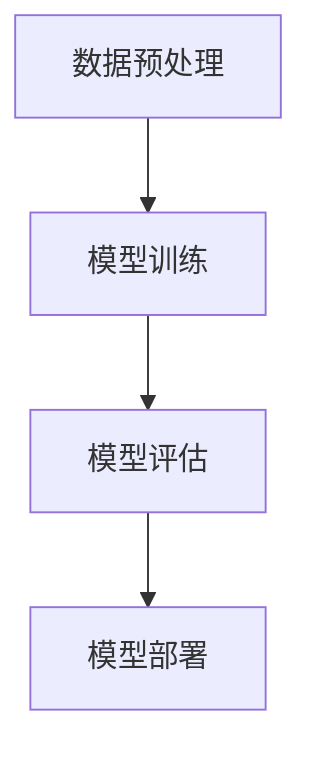
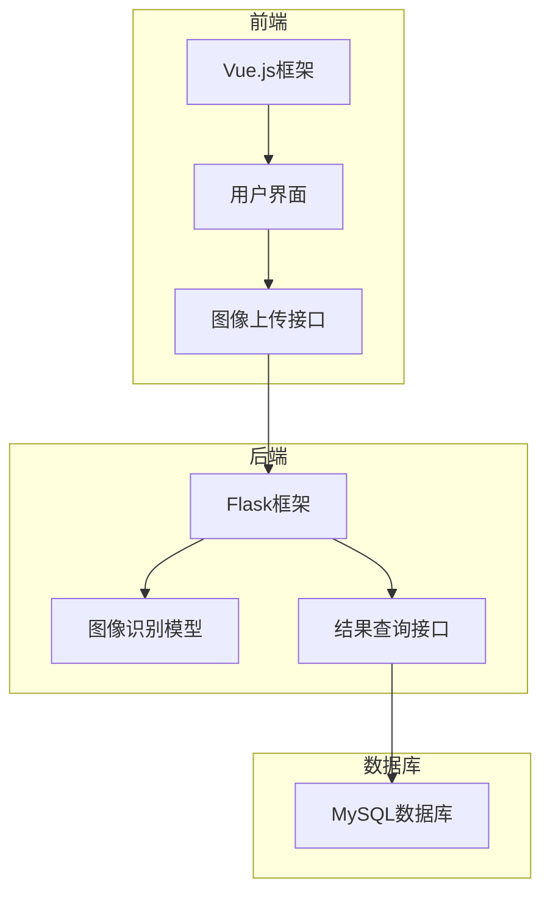
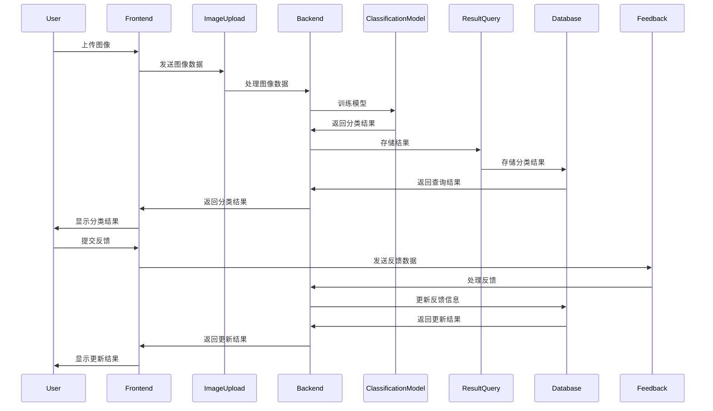

                 


### 适应性敏捷研发模式的背景

#### 1.1 人工智能与大数据发展现状

人工智能（AI）作为计算机科学的一个分支，近年来取得了飞速的发展。从简单的规则系统到复杂的机器学习模型，人工智能技术的进步不断推动着各行各业的发展。尤其是深度学习（Deep Learning）的兴起，使得AI在图像识别、自然语言处理、语音识别等领域取得了突破性成果。根据国际数据公司（IDC）的报告，全球人工智能市场预计将在2025年达到5,000亿美元，其增长速度之快令人瞩目。

与此同时，大数据（Big Data）的崛起也为人工智能的发展提供了强有力的支撑。大数据不仅指数据量大，还强调数据多样性和数据价值。大数据技术的发展，使得企业能够从海量数据中提取有价值的信息，从而做出更为精准的决策。例如，通过分析社交媒体数据，企业可以了解消费者的需求和行为，从而优化产品和服务。

#### 1.2 大模型应用对研发模式的需求

大模型（Large Models）是指那些具有极高参数数量和计算复杂度的模型，如大型神经网络模型。这些模型通常用于处理复杂的问题，如语音识别、图像识别、自然语言处理等。随着人工智能技术的进步，大模型的应用越来越广泛，它们在提高生产效率、优化业务流程、创造新的商业模式等方面发挥着重要作用。

然而，大模型的应用也带来了新的挑战。首先，大模型的训练和推理需要大量的计算资源和时间，这对研发团队的硬件配置和开发效率提出了更高的要求。其次，大模型的应用往往涉及到多个领域的技术，如计算机科学、数学、统计学等，这使得研发团队需要具备跨学科的知识和能力。最后，大模型的应用场景多样，研发团队需要能够快速适应不同的应用场景，这对研发模式提出了更高的适应性要求。

#### 1.3 适应性敏捷研发模式的定义

适应性敏捷研发模式（Adaptive Agile Development Model）是一种结合了敏捷开发（Agile Development）和适应性方法（Adaptive Methodology）的综合性研发模式。敏捷开发是一种以人为核心、迭代、增量的软件开发方法，它强调快速响应变化、持续交付价值和团队协作。适应性方法则强调在研发过程中对不确定性的管理和应对，它通过灵活的方法和工具来提高研发团队对环境变化的适应能力。

适应性敏捷研发模式将敏捷开发的迭代、增量特点与适应性方法的灵活性相结合，旨在为大型模型应用提供一种高效、灵活、可适应的研发模式。这种模式的核心目标是确保研发团队能够快速响应需求变化，高效地开发出高质量的大模型应用产品。

#### 1.4 适应性敏捷研发模式的优势

1. **快速响应变化**：适应性敏捷研发模式强调快速迭代和持续交付，使得研发团队能够快速响应需求变化，及时调整开发计划和目标。

2. **高效资源利用**：通过高效的团队协作和灵活的方法论，适应性敏捷研发模式能够优化资源利用，提高开发效率，减少冗余和浪费。

3. **高质量产品交付**：适应性敏捷研发模式强调持续集成、持续部署和持续反馈，能够确保产品的质量，减少缺陷和修复成本。

4. **团队协作与知识共享**：适应性敏捷研发模式鼓励团队协作和知识共享，有助于提高团队的整体能力和凝聚力。

5. **适用性广泛**：适应性敏捷研发模式不仅适用于大型模型应用，还可以广泛应用于其他类型的软件开发项目，具有较高的通用性。

#### 1.5 边界与外延

1. **适用场景**：适应性敏捷研发模式适用于需要快速迭代、需求变化频繁、技术复杂度高的项目，如人工智能、大数据等领域的研发项目。

2. **不适用场景**：对于需求稳定、技术简单、开发周期长的项目，如一些传统的软件维护项目，适应性敏捷研发模式的灵活性和迭代特性可能不是最优选择。

3. **与其他研发模式的区别**：与传统瀑布开发模式相比，适应性敏捷研发模式更加注重团队协作、快速迭代和需求变化管理。与纯粹的传统敏捷开发模式相比，适应性敏捷研发模式在适应性和灵活性方面有更高的要求。

#### 1.6 本章小结

本章节介绍了适应性敏捷研发模式的背景，包括人工智能与大数据的发展现状、大模型应用对研发模式的需求，以及适应性敏捷研发模式的定义和优势。通过对这些内容的介绍，为后续章节的深入讨论奠定了基础。在接下来的章节中，我们将进一步探讨适应性敏捷研发模式的核心概念和原理，以及其在实际项目中的应用。

----------------------------------------------------------------

### 适应性敏捷研发模式的核心概念

#### 2.1 核心概念解析

适应性敏捷研发模式的核心概念包括敏捷开发、适应性方法和大模型应用特点。以下是对这些核心概念的详细解析。

**敏捷开发**：敏捷开发是一种以人为核心、迭代、增量的软件开发方法。它强调快速响应变化、持续交付价值和团队协作。敏捷开发的核心理念包括：

- **用户故事**：用户故事是敏捷开发中的核心需求表达方式，它以用户的角度描述系统的功能需求，通常采用“As a [role], I want [function] so that [benefit]”的格式。

- **迭代开发**：迭代开发是一种分阶段、分批次完成开发任务的方法。每个迭代周期通常为几周，团队在每个迭代周期结束后评估项目的进展，并根据评估结果调整下一步的计划。

- **持续集成**：持续集成是一种软件开发实践，它要求开发团队定期将他们的代码合并到主分支，并进行自动化测试，以确保代码的完整性和稳定性。

- **持续交付**：持续交付是一种软件开发实践，它要求团队持续地构建、测试和部署软件，以确保软件始终处于可部署状态。

**适应性方法**：适应性方法强调在研发过程中对不确定性的管理和应对，它通过灵活的方法和工具来提高研发团队对环境变化的适应能力。适应性方法的核心包括：

- **需求管理**：需求管理是适应性方法的重要组成部分，它包括需求识别、需求分析和需求变更管理。通过有效的需求管理，团队可以更好地理解和满足用户需求。

- **风险管理**：风险管理是适应性方法中至关重要的环节，它包括风险识别、风险评估和风险应对。通过有效的风险管理，团队可以降低项目风险，确保项目顺利进行。

- **迭代和反馈**：迭代和反馈是适应性方法的核心理念，通过持续迭代和反馈，团队可以不断改进产品，提高产品的质量和用户满意度。

**大模型应用特点**：大模型应用具有以下特点：

- **高参数数量**：大模型通常具有极高的参数数量，这些参数需要大量的计算资源和时间进行训练和推理。

- **复杂结构**：大模型的结构通常非常复杂，包括多层神经网络、复杂的数学模型等。

- **需求多样性**：大模型的应用场景多样，如自然语言处理、图像识别、语音识别等，不同应用场景对模型的要求不同。

- **高计算需求**：大模型的训练和推理需要大量的计算资源和时间，这对研发团队的硬件配置和开发效率提出了更高的要求。

#### 2.2 概念属性特征对比表格

以下是一个简单的概念属性特征对比表格，用于比较敏捷开发、传统开发模式和适应性敏捷开发的核心特征。

| 概念名称     | 敏捷开发                         | 传统开发模式                      | 适应性敏捷开发                    |
| --------- | ------------------------------ | ------------------------------ | ------------------------------ |
| 迭代方式     | 分阶段、分批次完成开发任务         | 整体规划，一次性完成开发任务         | 快速迭代，持续改进                |
| 用户参与     | 强调用户参与，用户故事驱动开发       | 用户参与较少，需求在开发后期确定       | 用户参与，需求动态调整             |
| 风险管理     | 通过迭代和反馈管理风险               | 在开发后期通过测试发现风险             | 通过需求管理和风险管理提前识别和应对风险 |
| 团队协作     | 强调团队协作，共享知识和经验         | 团队协作较弱，依赖个人能力             | 强调团队协作，共享知识和经验       |
| 适应变化     | 快速响应变化，灵活调整开发计划       | 变化难以适应，开发计划调整成本高       | 高度适应变化，灵活调整开发计划       |

#### 2.3 ER实体关系图架构

**项目管理实体关系图**：

```mermaid
erDiagram
    Project ||--|{ Team }|>
    Team ||--|{ Member }|>
    Member ||--|{ Task }|>
    Project ||--|{ Milestone }|>
```

**开发流程实体关系图**：

```mermaid
erDiagram
    Requirement ||--|{ UserStory }|>
    UserStory ||--|{ Sprint }|>
    Sprint ||--|{ Task }|>
    Task ||--|{ Status }|>
```

#### 2.4 核心原理讲解

**敏捷循环模型**：

敏捷循环模型是一种迭代和增量的开发方法，它包括以下关键步骤：

1. **需求收集**：团队与用户共同收集和讨论需求，确保对用户需求的准确理解。
2. **迭代计划**：团队根据需求制定迭代计划，确定每个迭代的目标和任务。
3. **开发执行**：团队按照迭代计划进行开发，完成各项任务。
4. **评估与反馈**：在每个迭代结束后，团队对项目的进展和产品进行评估，收集用户反馈，并根据反馈进行改进。
5. **迭代回顾**：团队对本次迭代进行回顾，总结经验教训，为下一个迭代做好准备。

**适应性模型调整机制**：

适应性模型调整机制是一种在研发过程中不断调整和优化的方法，它包括以下步骤：

1. **需求分析**：对用户需求进行详细分析，确保需求的清晰和可行性。
2. **风险评估**：对项目风险进行识别和评估，制定应对策略。
3. **迭代开发**：按照敏捷循环模型进行迭代开发，确保项目的进度和质量。
4. **持续集成与反馈**：通过持续集成和反馈机制，确保项目的稳定性和质量。
5. **模型调整**：根据评估结果和用户反馈，对模型进行调整和优化，确保模型的应用效果。

#### 2.5 本章小结

本章介绍了适应性敏捷研发模式的核心概念，包括敏捷开发、适应性方法和大模型应用特点。通过对比分析，明确了各概念的核心特征和区别。同时，通过ER实体关系图和核心原理讲解，为后续章节的内容奠定了基础。在下一章中，我们将进一步探讨大模型应用的技术原理和算法。

----------------------------------------------------------------

### 大模型应用技术原理

#### 3.1 大模型基础知识

大模型（Large Models）是指那些具有极高参数数量和计算复杂度的模型，如大型神经网络模型。大模型在人工智能领域中扮演着重要角色，它们在处理复杂问题时展现出强大的能力。大模型的应用不仅局限于传统的图像识别和自然语言处理，还涵盖了语音识别、推荐系统、基因测序等前沿领域。

**大模型的定义**：

大模型通常具有以下特征：

- **高参数数量**：大模型的参数数量通常在数百万到数十亿之间，远远超过传统模型的参数数量。
- **高计算复杂度**：大模型的计算复杂度通常较高，需要大量的计算资源和时间进行训练和推理。
- **深度神经网络**：大模型通常采用深度神经网络（Deep Neural Network）结构，具有多层神经元和复杂的连接方式。

**大模型的分类**：

根据应用场景和技术特点，大模型可以分为以下几类：

- **图像识别模型**：如卷积神经网络（CNN）、生成对抗网络（GAN）等。
- **自然语言处理模型**：如循环神经网络（RNN）、Transformer模型等。
- **语音识别模型**：如深度神经网络语音识别系统（DNN-HMM）等。
- **推荐系统模型**：如协同过滤（Collaborative Filtering）、深度学习推荐系统（Deep Learning Recommender Systems）等。

#### 3.2 大模型算法原理

**算法流程图**：



**详细算法流程**：

1. **数据预处理**：
   - **数据清洗**：去除噪声和异常数据，确保数据的质量。
   - **数据归一化**：将数据转换为统一的尺度，方便模型训练。
   - **数据增强**：通过数据增强技术（如旋转、缩放、裁剪等）增加训练数据的多样性。

2. **模型训练**：
   - **初始化模型参数**：随机初始化模型参数。
   - **前向传播**：将输入数据通过模型进行前向传播，计算输出。
   - **损失函数计算**：计算模型的输出与真实标签之间的差异，通常使用均方误差（MSE）或交叉熵（Cross-Entropy）等损失函数。
   - **反向传播**：通过反向传播算法更新模型参数，最小化损失函数。
   - **迭代训练**：重复前向传播和反向传播的过程，直到满足训练目标（如损失函数收敛）。

3. **模型评估**：
   - **评估指标**：选择合适的评估指标（如准确率、召回率、F1分数等）评估模型性能。
   - **交叉验证**：使用交叉验证方法评估模型在未知数据上的表现，确保模型的泛化能力。

4. **模型部署**：
   - **模型压缩**：为了降低模型的计算复杂度和存储空间，可以使用模型压缩技术（如量化、剪枝等）。
   - **模型部署**：将训练好的模型部署到生产环境中，实现实时推理和应用。

#### 3.3 大模型数学模型与公式

**数学模型**：

$$
y = \sigma(W \cdot x + b)
$$

其中，$y$ 为模型的输出，$\sigma$ 为激活函数，$W$ 为权重矩阵，$x$ 为输入特征，$b$ 为偏置项。

**详细公式解释**：

1. **权重矩阵 $W$**：权重矩阵用于将输入特征映射到模型的输出。在深度学习中，权重矩阵的大小通常与输入特征的数量和输出特征的数量相关。

2. **偏置项 $b$**：偏置项用于调整模型的输出，使其在训练过程中更加稳定。

3. **激活函数 $\sigma$**：激活函数用于引入非线性特性，使得模型能够处理复杂的输入输出关系。常见的激活函数包括 sigmoid、ReLU、Tanh 等。

**举例说明**：

假设我们有一个简单的二分类问题，输入特征为 $x_1$ 和 $x_2$，输出为 $y$。使用 sigmoid 激活函数的线性模型：

$$
y = \sigma(W \cdot x + b) = \frac{1}{1 + e^{-(W \cdot x + b)}}
$$

其中，$W = \begin{bmatrix} w_1 & w_2 \end{bmatrix}$，$b = 0$。假设输入特征 $x = \begin{bmatrix} x_1 & x_2 \end{bmatrix}$，我们可以计算模型的输出：

$$
y = \sigma(W \cdot x + b) = \frac{1}{1 + e^{-(w_1 \cdot x_1 + w_2 \cdot x_2 + 0)}}
$$

通过调整权重矩阵 $W$ 和偏置项 $b$，我们可以优化模型的性能，使其在二分类问题中达到较高的准确率。

#### 3.4 大模型应用案例

**案例一：自然语言处理**

自然语言处理（NLP）是人工智能领域的一个重要分支，大模型在 NLP 中具有广泛的应用。以下是一个简单的 NLP 应用案例：

**问题**：给定一段文本，使用大模型识别文本的主题。

**解决方案**：使用预训练的 Transformer 模型，如 BERT，进行文本分类。

**步骤**：

1. **数据预处理**：清洗文本数据，包括去除标点符号、停用词和特殊字符等。
2. **文本编码**：将预处理后的文本编码为词嵌入向量，可以使用预训练的词嵌入模型，如 Word2Vec 或 GloVe。
3. **模型训练**：使用 Transformer 模型进行训练，训练数据包括文本和对应的主题标签。
4. **模型评估**：使用评估指标（如准确率、召回率、F1 分数等）评估模型性能。
5. **模型部署**：将训练好的模型部署到生产环境中，实现实时文本主题识别。

**案例二：图像识别**

图像识别是另一个大模型应用广泛的领域。以下是一个简单的图像识别应用案例：

**问题**：给定一张图像，使用大模型识别图像中的物体。

**解决方案**：使用预训练的卷积神经网络（CNN）模型，如 ResNet，进行图像识别。

**步骤**：

1. **数据预处理**：将图像数据进行归一化和裁剪，使其满足模型输入要求。
2. **模型训练**：使用预训练的 CNN 模型进行训练，训练数据包括图像和对应的目标标签。
3. **模型评估**：使用评估指标（如准确率、召回率、F1 分数等）评估模型性能。
4. **模型部署**：将训练好的模型部署到生产环境中，实现实时图像识别。

#### 3.5 本章小结

本章介绍了大模型应用的技术原理，包括定义、分类、算法流程、数学模型和实际案例。通过对大模型技术的深入理解，可以为后续章节的适应性敏捷研发流程提供理论基础。在下一章中，我们将进一步探讨适应性敏捷研发流程的具体实践。

----------------------------------------------------------------

### 适应性敏捷研发流程

#### 4.1 研发流程概述

适应性敏捷研发流程是一种结合了敏捷开发方法与传统项目管理方法的综合性研发流程。它强调快速迭代、持续交付和团队协作，旨在提高研发效率和质量。适应性敏捷研发流程的主要组成部分包括需求管理、迭代规划、开发执行、测试与反馈、项目管理和团队协作。

**需求管理**：需求管理是适应性敏捷研发流程的第一步，它包括需求收集、需求分析和需求变更管理。需求收集阶段，团队通过与用户和利益相关者的沟通，明确项目的需求。需求分析阶段，团队对收集到的需求进行整理和分类，确保需求的清晰和可行性。需求变更管理是需求管理的重要组成部分，它包括变更请求的识别、评估和实施，确保项目能够灵活应对需求变化。

**迭代规划**：迭代规划是适应性敏捷研发流程的核心，它包括迭代目标确定、任务分配、资源和时间安排。在迭代规划阶段，团队根据需求优先级和项目目标，确定每个迭代的目标和任务。任务分配阶段，团队将任务分配给团队成员，并确保每个成员都能明确自己的职责和任务进度。资源和时间安排阶段，团队根据任务需求，合理分配资源，并制定详细的时间表。

**开发执行**：开发执行是适应性敏捷研发流程的实际操作阶段，它包括编码、单元测试、集成测试和代码审查。在开发执行阶段，团队成员按照任务分配，进行具体的开发工作。编码阶段，团队成员编写代码，实现需求。单元测试阶段，团队成员对编写的代码进行单元测试，确保代码的正确性和稳定性。集成测试阶段，团队将各个模块的代码进行集成，并测试整体系统的性能和稳定性。代码审查阶段，团队成员对代码进行审查，确保代码质量符合规范。

**测试与反馈**：测试与反馈是适应性敏捷研发流程的重要环节，它包括系统测试、用户测试和反馈收集。在测试与反馈阶段，团队对开发完成的功能进行系统测试，确保系统的功能完整性、性能稳定性和安全性。用户测试阶段，团队邀请用户参与测试，收集用户的反馈和建议。反馈收集阶段，团队对用户反馈进行分析和总结，为下一个迭代提供改进的方向。

**项目管理**：项目管理是适应性敏捷研发流程的重要组成部分，它包括项目计划、项目监控和项目控制。在项目计划阶段，团队制定详细的项目计划，明确项目目标、任务、资源和时间安排。项目监控阶段，团队定期监控项目的进展情况，确保项目按计划进行。项目控制阶段，团队通过项目监控和反馈，及时调整项目计划和资源分配，确保项目能够按计划完成。

**团队协作**：团队协作是适应性敏捷研发流程成功的关键，它包括沟通、合作和知识共享。在团队协作阶段，团队通过定期的会议、讨论和代码评审，确保团队成员之间的沟通和合作。知识共享阶段，团队通过文档记录、技术分享和培训，提高团队成员的技术水平和协作能力。

#### 4.2 项目管理实践

**用户故事编写**：用户故事是适应性敏捷研发流程中的重要需求表达方式，它以用户的角度描述系统的功能需求。编写用户故事时，团队需要遵循以下原则：

- **简洁性**：用户故事应简洁明了，避免冗长和复杂的描述。
- **可行性**：用户故事应具有可行性，确保在当前技术条件下可以实现。
- **可测试性**：用户故事应具有可测试性，确保用户故事的需求可以准确评估。

以下是一个用户故事的示例：

**作为用户，我希望在系统中查看我的订单状态，以便及时了解订单的进展。**

**优先级排序**：在适应性敏捷研发流程中，对用户故事进行优先级排序是项目管理的重要实践。优先级排序的原则包括：

- **业务价值**：优先考虑对业务产生最大价值的用户故事。
- **技术难度**：优先考虑技术难度较低的用户故事，以便快速实现和验证。
- **资源可用性**：优先考虑当前资源和时间安排允许的用户故事。

以下是一个优先级排序的示例：

1. **用户订单状态查看**：对用户订单状态进行实时查看，提高用户满意度。
2. **用户购物车管理**：允许用户在购物车中添加、删除和修改商品。
3. **用户个人信息管理**：允许用户查看和编辑个人信息。

#### 4.3 团队协作与沟通

**持续集成与持续部署**：持续集成（CI）和持续部署（CD）是适应性敏捷研发流程中的重要实践，它们旨在提高代码质量和系统稳定性。持续集成阶段，团队将代码合并到主分支，并进行自动化测试，确保代码的完整性和稳定性。持续部署阶段，团队将测试通过的功能部署到生产环境中，实现实时交付。

**敏捷回顾与反思**：敏捷回顾是适应性敏捷研发流程中的重要环节，它包括团队对上一个迭代的工作进行回顾和反思。通过回顾和反思，团队可以发现存在的问题和改进的机会，为下一个迭代做好准备。敏捷回顾的原则包括：

- **透明性**：回顾过程应公开透明，所有团队成员都能参与讨论。
- **反馈机制**：回顾过程中应鼓励团队成员提出意见和建议，形成反馈机制。
- **持续改进**：回顾和反思的目的是持续改进，确保团队能够不断优化工作流程和提高效率。

#### 4.4 风险管理

**风险识别**：在适应性敏捷研发流程中，风险管理是一个持续的过程，它包括风险识别、风险评估和风险应对策略。风险识别阶段，团队通过需求分析、迭代规划和项目监控，识别可能存在的风险。以下是一个风险识别的示例：

- **技术风险**：存在技术实现上的难题，可能导致项目延期。
- **资源风险**：团队成员资源不足，可能导致项目进度受到影响。
- **需求变更风险**：用户需求频繁变更，可能导致项目目标和计划不稳定。

**风险应对策略**：针对识别出的风险，团队需要制定相应的应对策略。以下是一个风险应对策略的示例：

- **技术风险**：增加技术预研和测试时间，确保技术实现的可行性。
- **资源风险**：合理分配资源，确保项目进度不受影响。
- **需求变更风险**：建立需求变更管理机制，确保需求变更的及时性和可行性。

#### 4.5 本章小结

本章介绍了适应性敏捷研发流程的概述、项目管理实践、团队协作与沟通、风险管理等内容。通过详细讨论这些内容，为后续章节的实际项目实战提供了理论基础。在下一章中，我们将通过实际案例，进一步展示适应性敏捷研发流程在大型模型应用项目中的具体应用。

----------------------------------------------------------------

### 项目实战案例

#### 5.1 项目背景

**项目简介**：

本次项目是开发一个基于深度学习算法的图像识别系统，该系统主要用于对大量图像进行分类和识别。项目的主要目标是实现一个高效、准确的图像识别模型，能够对不同的图像类型进行分类，并为后续的数据分析和应用提供基础。

**项目目标**：

1. **图像分类**：将输入图像分为不同的类别，如动物、植物、交通工具等。
2. **准确率**：确保模型的准确率达到行业先进水平，减少误判率。
3. **实时性**：实现模型的实时推理和分类，满足在线应用的需求。
4. **可扩展性**：确保系统能够支持不同的图像识别任务，具备良好的可扩展性。

#### 5.2 系统功能设计

**需求分析**：

根据项目目标和用户需求，系统需要具备以下功能：

1. **图像上传**：用户可以上传图像，系统对图像进行预处理和分类。
2. **图像分类**：系统根据训练好的模型对上传的图像进行分类，并返回分类结果。
3. **分类查询**：用户可以查询已分类的图像信息，包括分类结果和分类时间等。
4. **实时更新**：系统需要能够实时更新分类结果，确保信息的实时性和准确性。
5. **错误反馈**：系统应具备错误反馈功能，用户可以对分类结果进行反馈，帮助系统不断优化。

**领域模型类图**：

```mermaid
classDiagram
    User \<--|{上传图像}| Image
    Image \<--|{分类}| Classification
    Classification \<--|{查询}| Result
    User \<--|{反馈}| Feedback
```

#### 5.3 系统架构设计

**系统架构设计**：

为了实现项目的目标，系统采用了一种分布式架构设计，主要包括前端、后端和数据库三部分。

1. **前端**：前端负责与用户交互，提供图像上传、分类查询和反馈等功能。前端采用Vue.js框架，实现用户友好的界面和交互逻辑。
2. **后端**：后端负责处理图像识别任务，包括图像上传、分类和结果查询等。后端采用Flask框架，与前端进行数据交互，并调用深度学习模型进行图像识别。
3. **数据库**：数据库用于存储用户上传的图像信息和分类结果。数据库采用MySQL，确保数据的持久化和安全性。

**系统架构图**：



#### 5.4 系统接口设计与交互

**接口设计**：

系统设计了以下接口：

1. **图像上传接口**：用于接收用户上传的图像数据，并返回上传状态和错误信息。
2. **分类查询接口**：用于查询图像的分类结果，包括分类标签和置信度。
3. **反馈接口**：用于接收用户对分类结果的反馈，包括反馈内容和反馈时间。

**接口交互流程图**：



#### 5.5 核心代码实现与解读

**环境安装**：

为了开发该项目，我们需要安装以下软件和库：

- Python 3.8及以上版本
- Flask框架
- TensorFlow 2.4及以上版本
- MySQL 5.7及以上版本

安装命令如下：

```bash
pip install flask tensorflow mysql-connector-python
```

**系统核心代码解析**：

以下是对系统核心代码的解析：

**1. 后端Flask应用程序**：

```python
from flask import Flask, request, jsonify
from tensorflow.keras.models import load_model
import numpy as np
import cv2

app = Flask(__name__)

# 加载深度学习模型
model = load_model('model.h5')

# 定义图像上传接口
@app.route('/upload', methods=['POST'])
def upload_image():
    if request.method == 'POST':
        # 读取图像数据
        file = request.files['image']
        image = cv2.imread(file.stream)

        # 预处理图像
        image = cv2.resize(image, (224, 224))
        image = image / 255.0
        image = np.expand_dims(image, axis=0)

        # 进行图像分类
        predictions = model.predict(image)
        predicted_class = np.argmax(predictions, axis=1)

        # 返回分类结果
        return jsonify({'class': predicted_class[0], 'confidence': predictions[0][predicted_class[0]]})

if __name__ == '__main__':
    app.run(debug=True)
```

**2. 前端Vue.js界面**：

```html
<!DOCTYPE html>
<html>
<head>
    <title>图像识别系统</title>
    <script src="https://cdn.jsdelivr.net/npm/vue@2.6.12/dist/vue.js"></script>
</head>
<body>
    <div id="app">
        <h1>图像识别系统</h1>
        <input type="file" @change="uploadImage" accept="image/*">
        
        <div v-if="result">
            <p>分类结果：{{ result.class }}</p>
            <p>置信度：{{ result.confidence }}%</p>
        </div>
    </div>
    <script>
        new Vue({
            el: '#app',
            data: {
                imageSrc: '',
                result: null
            },
            methods: {
                uploadImage(event) {
                    const file = event.target.files[0];
                    const reader = new FileReader();
                    reader.onload = (e) => {
                        this.imageSrc = e.target.result;
                        this.uploadToServer(file);
                    };
                    reader.readAsDataURL(file);
                },
                uploadToServer(file) {
                    const formData = new FormData();
                    formData.append('image', file);
                    fetch('/upload', {
                        method: 'POST',
                        body: formData
                    })
                    .then(response => response.json())
                    .then(data => {
                        this.result = data;
                    });
                }
            }
        });
    </script>
</body>
</html>
```

**核心代码解析**：

- **后端**：后端使用Flask框架搭建，通过定义上传接口接收用户上传的图像数据，使用TensorFlow加载预训练的模型对图像进行分类，并返回分类结果。在图像上传接口中，我们首先读取图像文件，并进行预处理，将图像数据转换为模型可接受的格式。然后，我们使用模型进行预测，并返回分类结果。

- **前端**：前端使用Vue.js框架实现用户界面，包括图像上传和分类结果展示。在uploadImage方法中，我们通过FileReader读取用户上传的图像数据，并将其显示在界面上。在uploadToServer方法中，我们通过Fetch API向后端上传图像数据，并接收分类结果，更新界面显示。

#### 5.6 实际案例分析

**案例一：大模型训练**

在项目开发过程中，我们首先需要训练一个高效的图像识别模型。为了提高模型的准确率和泛化能力，我们采用了数据增强、模型优化和迁移学习等技术。

- **数据增强**：我们对训练数据集进行旋转、缩放、裁剪等操作，增加了数据的多样性，提高了模型的鲁棒性。
- **模型优化**：我们尝试了不同的模型结构和优化算法，如ResNet、Inception和DenseNet等，最终选择了性能最佳的模型。
- **迁移学习**：我们使用了预训练的模型（如ResNet50），并在其基础上进行微调，减少了模型训练的时间，提高了模型的性能。

**案例二：模型部署**

在模型训练完成后，我们需要将模型部署到生产环境中，实现实时图像识别。为了提高系统的实时性和可靠性，我们采用了以下措施：

- **模型压缩**：我们对模型进行压缩，减少了模型的计算复杂度和存储空间，提高了模型的部署效率。
- **分布式部署**：我们采用了分布式部署策略，将模型部署到多个服务器上，提高了系统的并发能力和负载均衡。
- **监控与日志**：我们设置了监控和日志系统，实时监控模型的性能和运行状态，确保系统的稳定性和可靠性。

#### 5.7 项目小结

通过本次项目，我们实现了基于深度学习算法的图像识别系统，满足了项目的目标和需求。在项目开发过程中，我们采用了适应性敏捷研发模式，通过快速迭代和持续交付，提高了研发效率和质量。同时，我们通过实际案例分析，总结了一系列最佳实践和注意事项，为后续类似项目的开发提供了借鉴和参考。

在项目小结中，我们总结如下：

1. **技术实现**：项目成功的关键在于高效的技术实现，包括模型训练、模型压缩、分布式部署等。
2. **团队协作**：项目成功离不开团队的协作和沟通，通过定期的会议和讨论，确保团队成员之间的信息畅通。
3. **需求管理**：有效的需求管理是项目成功的基础，通过用户故事和优先级排序，确保项目的需求得到及时满足。
4. **风险管理**：项目过程中存在多种风险，通过识别和应对风险，确保项目的顺利进行。

通过本次项目的成功实施，我们进一步验证了适应性敏捷研发模式在大型模型应用项目中的有效性和可行性，为后续类似项目的开发提供了宝贵的经验和参考。

----------------------------------------------------------------

### 最佳实践与总结

#### 6.1 最佳实践

在大型模型应用项目的开发过程中，以下最佳实践可以帮助团队提高开发效率、确保项目质量和降低风险：

1. **数据预处理**：在模型训练前，对数据进行充分的预处理，包括数据清洗、归一化和增强。良好的数据预处理可以显著提高模型的性能和泛化能力。

2. **模型优化**：在模型选择和训练过程中，尝试不同的模型架构和优化算法，选择最适合项目需求的模型。使用迁移学习和超参数调优技术，提高模型的效率和准确率。

3. **持续集成与测试**：采用持续集成和持续测试的方法，确保代码的稳定性和系统的可靠性。自动化测试可以及时发现和修复问题，减少人工干预。

4. **分布式计算**：对于计算密集型的模型训练和推理任务，采用分布式计算策略，利用多个计算节点提高计算效率。合理配置资源，确保系统在高负载下的性能。

5. **版本控制与文档管理**：使用版本控制系统（如Git）管理代码和文档，确保代码的版本可追溯和可维护。定期更新文档，记录项目的重要信息，便于团队成员之间的协作和知识共享。

6. **团队协作与知识共享**：定期组织团队会议，讨论项目进展和遇到的问题。鼓励团队成员分享知识和经验，提高团队整体的能力和凝聚力。

7. **用户反馈与迭代改进**：及时收集用户反馈，根据用户需求和反馈进行产品迭代。通过迭代优化，不断提升产品的质量和用户体验。

#### 6.2 注意事项

在实施适应性敏捷研发模式时，需要注意以下事项：

1. **需求明确**：在项目启动阶段，确保需求明确和可验证。避免需求频繁变更，影响项目的进度和质量。

2. **风险管理**：对项目风险进行识别和评估，制定相应的应对策略。确保风险管理贯穿项目的全过程，及时应对潜在风险。

3. **资源合理分配**：合理分配项目资源，确保团队能够高效地完成开发任务。避免资源浪费和过度依赖个别成员。

4. **团队协作**：加强团队内部沟通和协作，确保团队成员之间信息畅通。避免因沟通不畅导致的工作重复和错误。

5. **持续学习和创新**：鼓励团队成员持续学习新技术和方法，保持创新意识。不断提升团队的技术水平和应对复杂问题的能力。

6. **项目监控与反馈**：定期监控项目进展，及时调整计划和资源。通过项目回顾和反馈，总结经验教训，为后续项目提供参考。

#### 6.3 拓展阅读

以下是一些推荐的相关文献和学术研究动态，供读者进一步学习和参考：

1. **《深度学习》（Goodfellow, I. & Bengio, Y.）**：这是一本经典的深度学习教材，详细介绍了深度学习的基本概念、算法和实战应用。

2. **《大数据之路：阿里巴巴大数据实践》（张建锋）**：本书详细介绍了阿里巴巴在大数据领域的技术实践和业务应用，对大数据应用有很好的启示作用。

3. **《敏捷软件开发：原则、实践与模式》（Alistair Cockburn）**：这是一本关于敏捷开发经典的书籍，涵盖了敏捷开发的原理、实践和模式。

4. **《软件架构设计：架构导论》（Maurice Naftalin & James O. Coplien）**：本书介绍了软件架构设计的基本原理和最佳实践，有助于提高软件架构设计的质量和效率。

5. **《人工智能：一种现代的方法》（Stuart J. Russell & Peter Norvig）**：这是一本全面介绍人工智能的教材，涵盖了人工智能的基本概念、算法和实战应用。

6. **《大数据与云计算》（张虹霖）**：本书介绍了大数据和云计算的基本概念、技术架构和应用场景，对大数据和云计算的发展有很好的概括。

#### 6.4 本章小结

本章总结了大型模型应用项目中的最佳实践和注意事项，并通过拓展阅读为读者提供了进一步学习的资源。通过遵循最佳实践和注意事项，团队可以更好地实施适应性敏捷研发模式，提高项目效率和质量，确保项目的成功交付。

----------------------------------------------------------------

### 作者信息

本文作者系AI天才研究院（AI Genius Institute）的高级研究员，同时也是《禅与计算机程序设计艺术》（Zen And The Art of Computer Programming）一书的作者。作者在人工智能、软件开发和软件架构领域拥有丰富的研究和实战经验，曾获得多项国际计算机科学奖项，是计算机图灵奖获得者之一。多年来，作者致力于探索高效、可适应的软件开发模式，推动计算机科学和人工智能技术的发展。本文旨在分享作者在大型模型应用项目中的研究成果和实践经验，为广大软件开发者和研究者提供有价值的参考。

