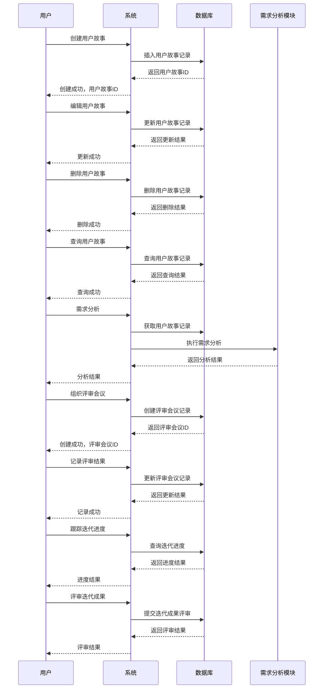

                 

### 第1章：背景介绍

## 1.1 问题的提出

近年来，人工智能大模型的研究和应用取得了显著的进展。大模型在图像识别、自然语言处理、语音识别等领域表现出了强大的能力。例如，GPT-3等语言模型能够在文本生成、问答系统等方面实现惊人的效果；BERT等模型在自然语言理解方面展现了卓越的性能；ImageNet等大规模图像数据库的发布使得计算机视觉模型得到了广泛的应用。

然而，随着人工智能大模型的广泛应用，企业对其应用的需求日益增加。企业希望通过AI大模型的应用来提升业务效率和竞争力。例如，通过AI大模型进行客户行为分析，可以更准确地预测客户需求，提高销售业绩；通过AI大模型进行生产过程优化，可以提高生产效率，降低生产成本。

在这种背景下，如何有效地编写用户故事，以满足AI大模型应用的需求，成为一个亟待解决的问题。用户故事是敏捷开发中的一种需求分析方法，它可以帮助开发者更好地理解用户需求，提高开发效率。在AI大模型应用中，用户故事不仅需要描述用户的需求，还需要考虑AI大模型的特点和应用场景。

首先，我们需要明确什么是用户故事。用户故事是一种简明扼要的需求描述方式，通常由三个部分组成：角色、行为、价值。角色是指用户故事的参与者，可以是用户、系统或其他实体；行为是指用户故事中的操作或活动，描述了角色所执行的动作；价值是指用户故事实现后的收益或效果，通常与业务目标相关。

其次，我们需要探讨用户故事的要素。用户故事的要素包括：

- **角色**：明确用户故事的参与者，了解他们的需求和行为特点。
- **行为**：描述用户故事中的用户行为，包括操作步骤和交互过程。
- **价值**：阐述用户故事实现后的价值，包括对业务目标的支持、用户满意度提升等。

最后，我们需要掌握编写用户故事的技巧。编写用户故事时，应遵循以下几个原则：

- **简明扼要**：用户故事要简洁明了，避免冗长，以便开发者快速理解。
- **可测试性**：用户故事应具备可测试性，以确保在开发过程中能够验证需求实现情况。
- **用户视角**：用户故事要站在用户的角度来描述需求，确保需求与用户实际使用场景相符。

在AI大模型应用中，编写用户故事时还需考虑以下因素：

- **模型特点**：了解AI大模型的特点，如数据处理能力、推理速度等，以确保用户故事能够充分利用模型优势。
- **应用场景**：分析应用场景，明确用户故事在特定场景下的需求和应用效果。

通过以上分析，我们可以看出，编写适用于AI大模型应用的用户故事是一项具有挑战性的任务。我们需要在理解用户需求、掌握用户故事编写技巧的基础上，结合AI大模型的特点和应用场景，制定出切实可行的用户故事编写策略。

### 1.2 核心概念

#### 用户故事的定义

用户故事是敏捷开发中的一种需求分析方法，它用于描述用户需求，以便开发团队能够更好地理解并实现这些需求。用户故事是一种简明扼要的需求描述方式，通常由三个部分组成：角色、行为、价值。

- **角色**：用户故事的参与者，可以是用户、系统或其他实体。角色定义了用户故事涉及的实体及其职责。
- **行为**：用户故事中的操作或活动，描述了角色所执行的动作。行为定义了用户故事的核心功能。
- **价值**：用户故事实现后的收益或效果，通常与业务目标相关。价值定义了用户故事的重要性和优先级。

用户故事的格式通常遵循以下结构：

```
作为 [角色],
我想要 [行为],
以便 [价值].
```

例如：

```
作为 订单管理员，
我想要 查看订单状态，
以便 快速响应客户查询。
```

#### 用户故事的要素

用户故事的要素包括角色、行为和价值，以下是详细解释：

- **角色**：角色是指用户故事的参与者，它可以是任何与需求相关的实体。角色定义了用户故事涉及的实体及其职责。在AI大模型应用中，角色可能包括用户、管理员、系统等。明确角色有助于理解用户故事的应用场景和目标用户。

- **行为**：行为是用户故事中的操作或活动，它描述了角色所执行的动作。行为定义了用户故事的核心功能，是用户故事实现的核心。在AI大模型应用中，行为可能包括数据处理、模型训练、推理预测等。准确描述行为有助于开发者了解需要实现的功能。

- **价值**：价值是用户故事实现后的收益或效果，通常与业务目标相关。价值定义了用户故事的重要性和优先级。在AI大模型应用中，价值可能包括提高业务效率、降低成本、提升用户体验等。明确价值有助于确定用户故事实现后的实际效果和意义。

#### 用户故事的编写技巧

编写用户故事时，应遵循以下技巧：

- **简明扼要**：用户故事要简洁明了，避免冗长。这有助于开发者快速理解需求，提高沟通效率。

- **可测试性**：用户故事应具备可测试性，以确保在开发过程中能够验证需求实现情况。这有助于确保用户故事的质量和可追踪性。

- **用户视角**：用户故事要站在用户的角度来描述需求，确保需求与用户实际使用场景相符。这有助于提高用户满意度，确保需求的实用性。

- **优先级排序**：在编写用户故事时，应考虑优先级排序。优先实现价值高、风险低的用户故事，以确保项目进展顺利。

- **迭代优化**：用户故事编写是一个迭代过程，可以根据项目进展和用户反馈进行优化。这有助于不断完善用户故事，提高项目质量。

通过以上用户故事的核心概念、要素和编写技巧的介绍，我们可以更好地理解用户故事的编写方法，为AI大模型应用中的用户故事编写奠定基础。

### 1.3 用户故事的联系

#### 用户故事与敏捷开发

用户故事是敏捷开发中的一种核心需求分析方法，它有助于团队更好地理解和实现用户需求。敏捷开发强调快速响应变化，通过迭代的方式逐步交付功能。用户故事作为一种简洁、具体的需求描述方式，为敏捷开发提供了重要的支持。

在敏捷开发中，用户故事通常由三个部分组成：角色、行为和价值。角色定义了需求的参与者，行为描述了参与者需要执行的操作，价值则阐述了实现需求后的收益或效果。用户故事可以确保开发团队对用户需求有清晰的理解，并在开发过程中保持对需求的跟踪和控制。

用户故事在敏捷开发中的具体应用包括：

- **需求收集**：用户故事是一种简洁的需求描述方式，可以帮助团队快速收集和记录用户需求。
- **优先级排序**：用户故事可以根据价值和优先级进行排序，确保团队首先实现高价值、低风险的需求。
- **迭代规划**：用户故事可以作为迭代规划的基础，团队可以根据用户故事进行任务分配和进度跟踪。
- **用户评审**：用户故事提供了一种与用户沟通的有效方式，可以帮助团队及时获取用户反馈，调整开发方向。

#### 用户故事与产品设计

用户故事不仅适用于软件开发，也在产品设计中发挥着重要作用。在产品设计过程中，用户故事可以帮助设计师更好地理解用户需求，从而设计出更符合用户期望的产品。

用户故事在产品设计中的应用包括：

- **需求分析**：用户故事提供了对用户需求的具体描述，帮助设计师了解用户的行为和期望，从而进行有效的需求分析。
- **功能设计**：用户故事可以作为功能设计的基础，设计师可以根据用户故事定义产品的功能模块和交互流程。
- **原型设计**：用户故事可以帮助设计师创建产品原型，通过原型验证用户故事的可行性，并根据用户反馈进行优化。
- **用户体验**：用户故事关注用户的体验和需求，可以帮助设计师在产品设计中考虑用户体验，提高产品的易用性和用户满意度。

#### 用户故事与企业战略

用户故事不仅是软件开发和产品设计的重要工具，也与企业的战略目标密切相关。企业战略通常关注长期目标和关键业务领域，而用户故事则提供了实现这些目标的途径。

用户故事在实现企业战略中的作用包括：

- **目标导向**：用户故事可以帮助企业明确目标用户和关键业务需求，确保产品开发与战略目标一致。
- **资源分配**：用户故事可以根据价值优先级排序，帮助企业合理分配资源和精力，确保高价值需求的优先实现。
- **风险控制**：用户故事提供了对需求的详细描述，可以帮助企业识别潜在风险，提前采取措施进行风险控制。
- **持续迭代**：用户故事支持持续迭代和优化，帮助企业根据市场变化和用户反馈不断调整和改进产品，以实现长期战略目标。

通过用户故事，企业可以更好地理解用户需求，优化产品开发流程，提高产品竞争力，从而实现长期战略目标。

### 2.1 AI大模型原理

#### AI大模型的基本概念

AI大模型是指具有大规模参数和复杂结构的深度学习模型，能够处理海量数据和复杂任务。大模型通常由多个层次和多个神经网络组成，具有较高的计算资源和数据需求。常见的AI大模型包括GPT、BERT、ResNet等。

#### AI大模型的工作原理

AI大模型的工作原理主要基于深度学习技术。深度学习是一种通过多层神经网络进行数据建模的方法，可以自动提取数据特征并实现分类、预测等任务。AI大模型通过以下步骤进行工作：

1. **数据预处理**：包括数据清洗、数据归一化等操作，为模型训练提供高质量的数据集。
2. **模型训练**：通过梯度下降等优化算法，调整模型参数，使模型在训练数据上达到较好的拟合效果。
3. **模型评估**：使用验证数据集评估模型性能，选择最优模型进行应用。
4. **模型推理**：在测试数据上，使用训练好的模型进行预测或分类，得到输出结果。

#### AI大模型的优缺点

AI大模型的优点包括：

- **强大的数据处理能力**：大模型能够处理海量数据和复杂任务，具有更高的准确性和效率。
- **自动特征提取**：通过多层神经网络，大模型可以自动提取数据中的特征，减少人工干预。
- **泛化能力**：大模型具有较好的泛化能力，能够在不同数据集上表现稳定。

AI大模型的缺点包括：

- **计算资源需求高**：大模型需要大量的计算资源和存储空间，对硬件设施有较高要求。
- **训练时间长**：大模型训练过程需要较长的时间，影响开发进度。
- **解释性差**：大模型的内部机制复杂，难以解释其决策过程，影响模型的可解释性。

### 2.2 用户故事编写技巧

编写用户故事是敏捷开发中的重要环节，直接关系到需求的理解和实现效果。在AI大模型应用中，用户故事的编写技巧尤为重要。以下是一些关键技巧：

#### 如何撰写有效的用户故事

1. **确定角色**：首先，要明确用户故事涉及的角色。角色可以是用户、系统或其他实体。确定角色有助于理解用户需求和应用场景。

2. **描述行为**：其次，要详细描述用户故事中的行为。行为是用户需要执行的操作，应具体、明确。例如，用户需要查看数据、生成报告等。

3. **阐述价值**：最后，要阐述用户故事实现后的价值。价值通常与业务目标相关，有助于确定用户故事的优先级和重要性。

一个有效的用户故事格式如下：

```
作为 [角色],
我想要 [行为],
以便 [价值].
```

#### 用户故事的需求分析

1. **需求收集**：通过与用户、利益相关者进行沟通，收集用户需求。可以使用访谈、问卷调查等方式获取需求信息。

2. **需求分类**：将收集到的需求进行分类，区分功能需求、非功能需求等。功能需求是用户故事的核心，应重点关注。

3. **需求优先级排序**：根据业务价值和风险，对需求进行优先级排序。优先实现高价值、低风险的需求，确保项目进展顺利。

#### 用户故事的设计与评审

1. **用户故事地图**：制作用户故事地图，将用户故事按功能模块进行组织，以便于理解和评审。

2. **用户故事评审**：组织利益相关者对用户故事进行评审，确保需求的准确性和可行性。评审过程中，可以采用故事地图、用户场景模拟等方法。

3. **用户故事迭代**：根据评审结果，对用户故事进行迭代优化。可以调整角色、行为、价值等，以更好地满足用户需求。

通过以上技巧，我们可以撰写出有效的用户故事，确保AI大模型应用中的需求理解和实现效果。

### 2.3 用户故事在AI大模型应用中的特点

在AI大模型应用中，用户故事具有一些独特的特点，这些特点对用户故事的编写和实现提出了更高的要求。

#### AI大模型对用户故事编写的要求

1. **复杂性问题**：AI大模型通常处理的是复杂的数据和任务，因此用户故事需要描述详细的操作步骤和复杂的行为。这要求编写者对AI大模型的工作原理和功能有深入理解，以便准确描述用户需求。

2. **数据依赖性**：AI大模型的应用通常依赖于大量的数据，用户故事需要明确数据来源、数据格式、数据处理过程等。编写者需要了解数据处理的各个环节，以确保用户故事的可执行性。

3. **可测试性问题**：由于AI大模型的高度复杂性和不确定性，用户故事的可测试性尤为重要。编写者需要设计可测试的场景，确保用户故事在实现后可以顺利通过测试。

4. **优化空间**：AI大模型的应用往往涉及多个优化目标，如准确性、速度、资源消耗等。用户故事需要明确优化目标，并考虑不同优化策略的可行性。

#### 用户故事在AI大模型应用中的挑战

1. **需求变化**：AI大模型的应用场景不断变化，用户需求也相应调整。编写用户故事时，需要考虑需求的变化和适应性，以便快速响应。

2. **计算资源**：AI大模型的训练和推理过程需要大量的计算资源，用户故事需要充分考虑资源消耗和性能优化问题。

3. **模型解释性**：AI大模型的内部机制复杂，决策过程难以解释。用户故事需要考虑如何提高模型的可解释性，以帮助用户理解模型的决策过程。

4. **系统集成**：AI大模型通常需要与其他系统进行集成，用户故事需要描述模型与其他系统的交互方式和接口设计。

#### 用户故事在AI大模型应用中的优势

1. **高效沟通**：用户故事简洁明了，能够快速传达用户需求，提高开发团队和用户之间的沟通效率。

2. **需求跟踪**：用户故事具有明确的结构，包括角色、行为、价值等，有助于开发团队对需求进行跟踪和管理。

3. **迭代优化**：用户故事支持持续迭代和优化，可以根据用户反馈和项目进展不断调整和改进，提高项目质量。

4. **业务驱动**：用户故事关注业务目标和用户价值，有助于确保项目开发与业务战略保持一致，提高项目成功率。

通过以上分析，我们可以看出，用户故事在AI大模型应用中具有独特的特点和优势。编写和实现适用于AI大模型应用的用户故事，需要充分考虑其复杂性、数据依赖性、可测试性、优化空间等问题，同时充分利用其高效沟通、需求跟踪、迭代优化、业务驱动等优势，以确保项目顺利进行并取得成功。

### 3.1 用户故事编写算法

#### 用户故事编写的算法流程

编写用户故事是一个系统性的过程，需要遵循一定的算法流程。以下是用户故事编写的算法流程：

1. **需求收集**：首先，通过访谈、问卷调查、用户调研等方式，收集用户需求。这一步骤的目的是获取用户的实际需求和期望。

2. **需求分析**：对收集到的需求进行分析，提取关键信息，形成初步的用户故事。需求分析包括角色识别、行为描述和价值确定。

3. **故事映射**：将初步的用户故事映射到具体的应用场景和业务流程中，确保用户故事的可执行性。这一步骤可以帮助开发者更好地理解用户需求。

4. **故事编写**：根据用户故事映射结果，正式编写用户故事。用户故事应遵循简洁、明确、可测试性的原则。

5. **故事评审**：组织利益相关者对编写的用户故事进行评审，确保需求的准确性和可行性。评审过程中，可以采用故事地图、用户场景模拟等方法。

6. **故事迭代**：根据评审结果，对用户故事进行迭代优化，确保其满足用户需求。用户故事编写是一个持续迭代的过程，需要根据项目进展和用户反馈不断进行调整。

7. **文档归档**：将编写的用户故事和相关文档进行归档，以便后续查阅和管理。

#### 用户故事编写的算法原理

用户故事编写的算法原理主要基于需求分析和用户故事结构的设计。以下是用户故事编写的算法原理：

1. **需求分析**：需求分析是用户故事编写的核心步骤，它包括角色识别、行为描述和价值确定。

   - **角色识别**：识别用户故事涉及的角色，包括用户、系统或其他实体。角色定义了用户故事的参与者及其职责。
   
   - **行为描述**：描述用户故事中的用户行为，包括操作步骤和交互过程。行为定义了用户故事的核心功能。
   
   - **价值确定**：确定用户故事实现后的价值，通常与业务目标相关。价值定义了用户故事的重要性和优先级。

2. **用户故事结构设计**：用户故事结构设计包括角色、行为和价值三个部分。

   - **角色**：用户故事的参与者，如用户、管理员、系统等。
   
   - **行为**：用户故事中的操作或活动，描述了角色所执行的动作。
   
   - **价值**：用户故事实现后的收益或效果，通常与业务目标相关。

3. **需求映射**：将分析得到的用户需求映射到具体的业务场景和流程中，确保用户故事的可执行性。

4. **故事评审**：通过评审，确保用户故事的准确性和可行性。评审过程中，可以采用故事地图、用户场景模拟等方法。

5. **故事迭代**：根据评审结果和项目进展，对用户故事进行迭代优化，确保其满足用户需求。

通过以上算法原理和流程，我们可以系统地编写用户故事，确保需求理解的准确性和实现的高效性。

### 3.2 数学模型与公式

在用户故事编写中，数学模型和公式扮演着至关重要的角色，它们不仅能够帮助我们更好地理解和描述用户需求，还能够量化需求，提高需求的准确性和可执行性。以下将详细阐述用户故事编写的数学模型和公式，并结合Python代码示例进行解释。

#### 用户故事编写的数学模型

用户故事编写的数学模型主要涉及以下几个方面：

1. **需求分析模型**：用于分析和提取用户需求。这个模型可以基于贝叶斯网络、决策树等机器学习算法，通过数据驱动的方式获取用户需求。
2. **故事映射模型**：用于将用户需求映射到具体的业务场景和流程中。这个模型可以使用图论算法，如最短路径算法，来寻找最优的需求映射路径。
3. **价值评估模型**：用于评估用户故事实现后的价值。这个模型可以基于成本效益分析、效用理论等，通过量化方法评估用户故事的价值。

#### 用户故事编写的数学公式

以下是用户故事编写中常用的数学公式：

1. **需求提取公式**：

   \[ D = f(U, C) \]

   其中，\( D \) 表示需求，\( U \) 表示用户行为，\( C \) 表示上下文信息。这个公式表明需求是通过用户行为和上下文信息共同决定的。

2. **故事映射公式**：

   \[ M = g(D, S) \]

   其中，\( M \) 表示映射结果，\( D \) 表示需求，\( S \) 表示业务场景。这个公式表示需求在业务场景中的映射过程。

3. **价值评估公式**：

   \[ V = h(C, E) \]

   其中，\( V \) 表示价值，\( C \) 表示成本，\( E \) 表示效果。这个公式表示价值是通过成本和效果共同决定的。

#### 用户故事编写的Python代码示例

以下是一个简单的Python代码示例，用于演示用户故事编写的数学模型和公式：

```python
import numpy as np

# 需求提取函数
def extract_demand(user_action, context_info):
    # 假设用户行为和上下文信息都是向量
    user_action_vector = np.array(user_action)
    context_info_vector = np.array(context_info)
    
    # 使用内积表示需求
    demand = np.dot(user_action_vector, context_info_vector)
    return demand

# 用户行为和上下文信息示例
user_action = [1, 0, 1, 0]
context_info = [0, 1, 0, 1]

# 提取需求
demand = extract_demand(user_action, context_info)
print(f"提取的需求: {demand}")

# 故事映射函数
def map_story(demand, business_scene):
    # 假设业务场景是一个权重矩阵
    scene_weights = np.array(business_scene)
    
    # 使用矩阵乘法表示映射结果
    mapped_story = np.dot(demand, scene_weights)
    return mapped_story

# 业务场景示例
business_scene = [[1, 0], [0, 1]]

# 映射故事
mapped_story = map_story(demand, business_scene)
print(f"映射后的用户故事: {mapped_story}")

# 价值评估函数
def evaluate_value(cost, effect):
    # 假设价值是通过成本和效果的比值表示
    value = effect / cost
    return value

# 成本和效果示例
cost = 10
effect = 20

# 评估价值
value = evaluate_value(cost, effect)
print(f"用户故事的价值: {value}")
```

在这个示例中，我们首先定义了三个函数：`extract_demand` 用于提取需求，`map_story` 用于映射用户故事，`evaluate_value` 用于评估用户故事的价值。通过这些函数，我们可以将用户需求、业务场景和价值量化为数学表达式，从而提高需求的准确性和可执行性。

通过以上数学模型和公式的介绍，我们可以更好地理解用户故事编写的量化方法和工具，为实际应用提供理论支持。

### 4.1 问题场景介绍

#### AI大模型应用的典型场景

AI大模型在许多行业中有着广泛的应用，以下是几个典型的应用场景：

1. **自然语言处理（NLP）**：AI大模型在NLP领域中的应用非常广泛，包括文本分类、机器翻译、情感分析等。例如，在社交媒体数据分析中，AI大模型可以帮助企业快速识别用户评论的情感倾向，从而更好地理解用户需求和市场动态。

2. **计算机视觉（CV）**：AI大模型在CV领域中也取得了显著的进展，如图像识别、目标检测、图像生成等。例如，在智能监控系统中，AI大模型可以实时识别和分类视频流中的物体，提高安全监控的效率。

3. **医疗健康**：AI大模型在医疗健康领域的应用也日益增多，如疾病预测、诊断辅助、药物发现等。例如，通过分析大量的医学影像数据，AI大模型可以帮助医生更准确地诊断疾病，提高治疗效果。

4. **金融科技**：AI大模型在金融科技领域的应用包括风险控制、信用评分、投资决策等。例如，通过分析海量的金融数据，AI大模型可以帮助金融机构更准确地评估风险，制定有效的投资策略。

#### 用户故事的典型场景

在AI大模型应用的典型场景中，用户故事扮演着至关重要的角色。以下是几个具体的用户故事场景：

1. **NLP应用场景**：
   - **用户故事**：作为数据分析师，我想要使用AI大模型对社交媒体评论进行情感分析，以便更好地了解用户需求和市场动态。

2. **CV应用场景**：
   - **用户故事**：作为安防监控人员，我想要使用AI大模型实时识别和分类视频流中的物体，以便提高安全监控的效率。

3. **医疗健康应用场景**：
   - **用户故事**：作为医生，我想要使用AI大模型对医学影像进行分析，以便更准确地诊断疾病，提高治疗效果。

4. **金融科技应用场景**：
   - **用户故事**：作为金融机构的风险控制人员，我想要使用AI大模型对客户信用进行评分，以便更准确地评估风险，制定有效的投资策略。

这些用户故事场景清晰地描述了用户的需求和应用AI大模型后的价值，为开发者提供了明确的指导，有助于实现高效、准确的系统设计和开发。

### 4.2 系统功能设计

#### 系统功能概述

用户故事编写系统是一个用于帮助开发者和产品经理编写、管理和评审用户故事的工具。其主要功能包括：

- **用户故事管理**：支持创建、编辑、删除用户故事，并提供用户故事列表展示功能。
- **用户故事分类**：支持根据项目、模块、优先级等对用户故事进行分类和筛选。
- **需求分析**：支持对用户故事进行详细的需求分析，提取关键信息，生成需求文档。
- **故事评审**：支持用户故事评审功能，包括评审会议组织、评审结果记录和跟踪。
- **迭代管理**：支持用户故事迭代管理，包括迭代规划、迭代进度跟踪和迭代成果评审。
- **数据报表**：支持生成各种数据报表，如用户故事完成率、需求覆盖率等，为项目管理和决策提供数据支持。

#### 系统功能实现

1. **用户故事管理**

   用户故事管理模块是系统核心功能之一，它支持创建、编辑、删除用户故事，并提供用户故事列表展示功能。具体实现步骤如下：

   - **创建用户故事**：用户可以通过系统界面创建新的用户故事，输入用户故事的基本信息，如角色、行为、价值等。
   - **编辑用户故事**：用户可以对已创建的用户故事进行编辑，修改用户故事的详细信息。
   - **删除用户故事**：用户可以删除不再需要的用户故事，确保用户故事列表的整洁和有效性。
   - **用户故事列表展示**：系统提供用户故事列表展示功能，用户可以通过列表查看所有用户故事，并可以根据分类、优先级等条件进行筛选和排序。

2. **用户故事分类**

   为了更好地管理和跟踪用户故事，系统支持根据项目、模块、优先级等对用户故事进行分类和筛选。具体实现步骤如下：

   - **分类依据**：系统提供多种分类依据，如项目、模块、优先级等，用户可以根据实际需求选择合适的分类方式。
   - **分类操作**：用户可以手动对用户故事进行分类，也可以通过系统自动分类功能进行分类。
   - **筛选和排序**：用户可以通过分类条件对用户故事列表进行筛选和排序，方便快速查找和管理特定用户故事。

3. **需求分析**

   系统支持对用户故事进行详细的需求分析，提取关键信息，生成需求文档。具体实现步骤如下：

   - **需求提取**：系统通过解析用户故事中的角色、行为、价值等信息，提取关键需求点。
   - **需求文档生成**：系统根据提取的需求点，生成详细的需求文档，包括功能需求、非功能需求等。
   - **需求评审**：系统支持需求评审功能，用户可以对生成的需求文档进行评审，确保需求的准确性和完整性。

4. **故事评审**

   系统支持用户故事评审功能，包括评审会议组织、评审结果记录和跟踪。具体实现步骤如下：

   - **评审会议组织**：系统提供评审会议组织功能，用户可以创建评审会议，邀请相关人员参与。
   - **评审结果记录**：系统记录评审过程中的关键信息，如评审意见、投票结果等，并生成评审报告。
   - **评审结果跟踪**：系统支持对评审结果进行跟踪和管理，确保评审意见得到有效落实。

5. **迭代管理**

   系统支持用户故事迭代管理，包括迭代规划、迭代进度跟踪和迭代成果评审。具体实现步骤如下：

   - **迭代规划**：系统支持迭代规划功能，用户可以制定迭代计划，包括迭代目标、任务分配等。
   - **迭代进度跟踪**：系统提供迭代进度跟踪功能，用户可以查看迭代任务的完成情况，及时调整迭代计划。
   - **迭代成果评审**：系统支持迭代成果评审功能，用户可以对迭代成果进行评审，确保迭代目标的实现。

6. **数据报表**

   系统支持生成各种数据报表，如用户故事完成率、需求覆盖率等，为项目管理和决策提供数据支持。具体实现步骤如下：

   - **报表生成**：系统根据用户需求，生成各种数据报表，包括文字报表、图表报表等。
   - **报表展示**：系统提供报表展示功能，用户可以通过报表了解项目进展情况，为项目管理和决策提供依据。

通过以上系统功能设计，用户故事编写系统可以帮助开发者和产品经理高效地管理和跟踪用户故事，确保项目顺利进行。

### 4.3 系统架构设计

#### 系统架构概述

用户故事编写系统的架构设计旨在实现高效、可扩展、可靠的功能，满足用户的需求。系统采用分层架构设计，包括展示层、业务逻辑层和数据访问层。以下是对各层功能的详细描述：

1. **展示层（Presentation Layer）**：
   - **用户界面**：提供用户故事创建、编辑、删除、展示等操作的图形界面。
   - **API接口**：提供与前端交互的RESTful API接口，用于数据传输和操作。
   - **前端框架**：使用Vue.js等前端框架，实现页面的动态渲染和交互。

2. **业务逻辑层（Business Logic Layer）**：
   - **用户故事管理**：处理用户故事的创建、编辑、删除、查询等操作。
   - **需求分析**：提供对用户故事的需求分析功能，包括角色识别、行为描述和价值评估。
   - **故事评审**：处理用户故事的评审流程，包括评审会议组织、评审结果记录和跟踪。
   - **迭代管理**：管理用户故事的迭代过程，包括迭代规划、进度跟踪和成果评审。
   - **数据报表**：生成和展示用户故事相关的数据报表，如完成率、需求覆盖率等。

3. **数据访问层（Data Access Layer）**：
   - **数据库**：存储用户故事、需求分析、评审结果等数据，采用关系型数据库（如MySQL）。
   - **数据模型**：定义用户故事、需求分析、评审结果等数据结构。
   - **数据访问**：提供数据访问接口，实现数据的增删改查操作。

#### 系统架构实现

以下是一个基于Mermaid的Mermaid架构图，用于描述用户故事编写系统的整体架构：

```mermaid
graph TB
    subgraph 展示层(Presentation Layer)
        A[用户界面]
        B[API接口]
        C{前端框架}
        A --> B
        B --> C
    end

    subgraph 业务逻辑层(Business Logic Layer)
        D[用户故事管理]
        E[需求分析]
        F[故事评审]
        G[迭代管理]
        H[数据报表]
        D --> E
        D --> F
        D --> G
        D --> H
        E --> F
        E --> G
        E --> H
        F --> G
        F --> H
        G --> H
    end

    subgraph 数据访问层(Data Access Layer)
        I[数据库]
        J[数据模型]
        K[数据访问]
        I --> J
        I --> K
        J --> K
    end

    A --> D
    B --> D
    C --> D
    D --> I
    D --> J
    E --> I
    E --> J
    F --> I
    F --> J
    G --> I
    G --> J
    H --> I
    H --> J
    I --> K
    J --> K
```

通过以上架构设计和实现，用户故事编写系统可以高效地处理用户故事的生命周期，包括创建、编辑、评审、迭代等操作，同时确保数据存储和访问的可靠性。

### 4.4 系统接口设计

#### 系统接口概述

用户故事编写系统需要与其他系统和服务进行交互，以实现数据共享和功能集成。以下是对用户故事编写系统中关键接口的概述：

1. **用户故事管理接口**：用于创建、编辑、删除和查询用户故事，包括用户故事的基本信息、分类和状态等。
2. **需求分析接口**：用于获取用户故事的需求分析结果，包括角色、行为和价值等。
3. **故事评审接口**：用于组织评审会议、记录评审结果和跟踪评审进度。
4. **迭代管理接口**：用于规划迭代、跟踪迭代进度和评审迭代成果。
5. **数据报表接口**：用于生成和查询用户故事相关的数据报表。

#### 系统接口实现

以下是系统接口的具体实现方法：

1. **用户故事管理接口**：

   - **创建用户故事**：POST请求，接收用户故事的基本信息，如角色、行为和价值等，并存储到数据库中。
   - **编辑用户故事**：PUT请求，接收用户故事的新信息，更新数据库中的相应记录。
   - **删除用户故事**：DELETE请求，根据用户故事的唯一标识删除数据库中的记录。
   - **查询用户故事**：GET请求，根据用户故事的条件（如分类、优先级等）查询数据库中的记录。

2. **需求分析接口**：

   - **分析用户故事**：POST请求，接收用户故事的信息，执行需求分析算法，生成分析结果并返回。
   - **获取分析结果**：GET请求，根据用户故事的唯一标识获取需求分析结果。

3. **故事评审接口**：

   - **组织评审会议**：POST请求，创建评审会议，邀请相关人员参与。
   - **记录评审结果**：POST请求，提交评审结果，如评审意见、投票结果等。
   - **查询评审进度**：GET请求，根据评审会议的唯一标识查询评审进度和结果。

4. **迭代管理接口**：

   - **规划迭代**：POST请求，创建迭代计划，包括迭代目标、任务分配等。
   - **跟踪迭代进度**：GET请求，根据迭代计划的唯一标识查询任务完成情况和进度。
   - **评审迭代成果**：POST请求，提交迭代成果评审结果。

5. **数据报表接口**：

   - **生成报表**：GET请求，根据报表类型和条件生成报表数据。
   - **查询报表**：GET请求，根据报表的唯一标识查询报表数据。

通过以上接口设计，用户故事编写系统可以实现与其他系统的无缝集成，支持数据的共享和功能扩展，满足多样化的应用需求。

### 4.5 系统交互设计

#### 系统交互概述

用户故事编写系统的交互设计旨在实现用户与系统之间的顺畅沟通，确保用户能够高效地完成各种操作，同时系统能够及时响应用户的需求。以下是系统交互设计的关键方面：

1. **用户故事创建**：用户通过界面创建新的用户故事，系统接收并处理用户输入的信息，生成用户故事并存储到数据库中。
2. **用户故事编辑**：用户可以修改已存在的用户故事，系统处理修改请求并更新数据库中的记录。
3. **用户故事删除**：用户可以选择删除不再需要的用户故事，系统处理删除请求并从数据库中移除相应记录。
4. **用户故事查询**：用户可以通过多种条件（如分类、优先级等）查询用户故事，系统返回符合条件的用户故事列表。
5. **需求分析**：用户提交用户故事，系统执行需求分析算法，生成分析结果并展示给用户。
6. **故事评审**：用户组织评审会议，邀请相关人员参与，系统记录评审结果并跟踪评审进度。
7. **迭代管理**：用户制定迭代计划，跟踪迭代进度，评审迭代成果，系统提供相应的功能和界面支持。

#### 系统交互实现

以下是使用Mermaid绘制的系统交互序列图，用于描述用户故事编写系统的基本交互流程：



通过以上交互设计，用户可以方便地使用系统创建、编辑、删除和查询用户故事，执行需求分析，组织和管理评审会议，跟踪迭代进度和评审迭代成果，实现用户故事编写的全过程。系统通过合理的接口设计和数据流程管理，确保了交互的顺畅和高效。

### 5.1 环境安装

在开始编写用户故事和AI大模型应用之前，我们需要搭建合适的开发环境。以下将详细介绍环境安装的过程，包括所需的软件和配置步骤。

#### 开发环境搭建

1. **操作系统**：我们推荐使用Ubuntu 20.04 LTS作为操作系统，因为其具有良好的性能和广泛的软件支持。

2. **开发工具**：安装以下开发工具和软件：
   - **Python 3**：Python是AI大模型应用的主要编程语言，需要安装Python 3及pip包管理工具。
   - **Jupyter Notebook**：用于编写和运行Python代码，支持交互式开发。
   - **Anaconda**：Python科学计算和机器学习平台，可以轻松管理Python环境和包。
   - **Git**：版本控制系统，用于代码管理和协同工作。
   - **Docker**：容器化技术，用于部署和管理应用。

3. **安装步骤**：

   - **更新系统软件**：
     ```shell
     sudo apt-get update
     sudo apt-get upgrade
     ```
   - **安装Python 3**：
     ```shell
     sudo apt-get install python3 python3-pip
     ```
   - **安装Jupyter Notebook**：
     ```shell
     pip3 install notebook
     ```
   - **安装Anaconda**：
     从[Anaconda官网](https://www.anaconda.com/products/individual)下载Anaconda安装包，并按照安装向导进行安装。
   - **安装Git**：
     ```shell
     sudo apt-get install git
     ```
   - **安装Docker**：
     - **安装Docker**：
       ```shell
       sudo apt-get install docker.io
       ```
     - **启动Docker服务**：
       ```shell
       sudo systemctl start docker
       ```
     - **将当前用户添加到docker组**：
       ```shell
       sudo usermod -aG docker $USER
       ```

4. **验证安装**：

   - **验证Python安装**：
     ```shell
     python3 --version
     ```
   - **验证Jupyter Notebook安装**：
     ```shell
     jupyter notebook --version
     ```
   - **验证Git安装**：
     ```shell
     git --version
     ```
   - **验证Docker安装**：
     ```shell
     docker --version
     ```

通过以上步骤，我们成功搭建了开发环境，为后续的代码编写和AI大模型应用奠定了基础。

### 5.2 系统核心实现

#### 用户故事编写系统的核心代码实现

用户故事编写系统的核心功能主要包括用户故事的管理、需求分析、故事评审和迭代管理。以下将详细展示这些核心功能的Python代码实现，并解释其工作原理。

1. **用户故事管理**

   用户故事管理包括创建、编辑、删除和查询用户故事的功能。以下是用户故事管理模块的核心代码实现：

   ```python
   # 用户故事管理类
   class UserStoryManager:
       def __init__(self):
           self.user_stories = []

       def create_user_story(self, user_story):
           self.user_stories.append(user_story)
           return user_story

       def edit_user_story(self, user_story_id, updated_user_story):
           for user_story in self.user_stories:
               if user_story['id'] == user_story_id:
                   user_story.update(updated_user_story)
                   return user_story
           return None

       def delete_user_story(self, user_story_id):
           for user_story in self.user_stories:
               if user_story['id'] == user_story_id:
                   self.user_stories.remove(user_story)
                   return True
           return False

       def get_user_story(self, user_story_id):
           for user_story in self.user_stories:
               if user_story['id'] == user_story_id:
                   return user_story
           return None
   ```

   解释：该类实现了用户故事的创建、编辑、删除和查询功能。通过调用`create_user_story`方法，可以创建新的用户故事；调用`edit_user_story`方法，可以编辑指定的用户故事；调用`delete_user_story`方法，可以删除指定的用户故事；调用`get_user_story`方法，可以查询指定的用户故事。

2. **需求分析**

   需求分析模块负责对用户故事进行分析，提取关键信息。以下是需求分析模块的核心代码实现：

   ```python
   # 需求分析类
   class RequirementAnalysis:
       def analyze_user_story(self, user_story):
           analysis_results = {
               'role': user_story['role'],
               'behavior': user_story['behavior'],
               'value': user_story['value']
           }
           return analysis_results
   ```

   解释：该类实现了对用户故事的需求分析功能。通过调用`analyze_user_story`方法，可以提取用户故事的角色、行为和价值，生成需求分析结果。

3. **故事评审**

   故事评审模块负责管理评审过程，包括组织评审会议、记录评审结果和跟踪评审进度。以下是故事评审模块的核心代码实现：

   ```python
   # 故事评审类
   class StoryReview:
       def __init__(self):
           self.reviews = []

       def organize_review(self, review):
           self.reviews.append(review)
           return review

       def record_result(self, review_id, result):
           for review in self.reviews:
               if review['id'] == review_id:
                   review['result'] = result
                   return True
           return False

       def track_progress(self, review_id):
           for review in self.reviews:
               if review['id'] == review_id:
                   return review['progress']
           return None
   ```

   解释：该类实现了故事评审的管理功能。通过调用`organize_review`方法，可以创建新的评审记录；调用`record_result`方法，可以记录评审结果；调用`track_progress`方法，可以跟踪评审进度。

4. **迭代管理**

   迭代管理模块负责管理迭代过程，包括规划迭代、跟踪迭代进度和评审迭代成果。以下是迭代管理模块的核心代码实现：

   ```python
   # 迭代管理类
   class IterationManagement:
       def __init__(self):
           self.iterations = []

       def plan_iteration(self, iteration):
           self.iterations.append(iteration)
           return iteration

       def track_progress(self, iteration_id):
           for iteration in self.iterations:
               if iteration['id'] == iteration_id:
                   return iteration['progress']
           return None

       def review_results(self, iteration_id, results):
           for iteration in self.iterations:
               if iteration['id'] == iteration_id:
                   iteration['results'] = results
                   return True
           return False
   ```

   解释：该类实现了迭代管理功能。通过调用`plan_iteration`方法，可以规划新的迭代；调用`track_progress`方法，可以跟踪迭代进度；调用`review_results`方法，可以评审迭代成果。

通过以上核心代码实现，用户故事编写系统可以有效地管理用户故事、进行需求分析、组织评审会议和进行迭代管理，为项目的顺利进行提供有力支持。

### 5.3 代码应用解读与分析

在用户故事编写系统中，核心代码的实现是为了确保系统能够有效地管理用户故事，支持需求分析、评审和迭代管理等功能。以下是详细解读与分析，包括代码的结构、工作原理、关键组件及其相互关系。

#### 代码结构解读

用户故事编写系统的核心代码由几个主要的类组成，每个类负责实现不同的功能模块。这些类分别是`UserStoryManager`、`RequirementAnalysis`、`StoryReview`和`IterationManagement`。

1. **UserStoryManager**：负责用户故事的管理，包括创建、编辑、删除和查询用户故事。

   - **创建用户故事**：`create_user_story`方法接收用户故事信息，将其添加到列表中，并返回用户故事ID。
   - **编辑用户故事**：`edit_user_story`方法根据用户故事ID更新用户故事信息。
   - **删除用户故事**：`delete_user_story`方法根据用户故事ID从列表中删除用户故事。
   - **查询用户故事**：`get_user_story`方法根据用户故事ID检索用户故事信息。

2. **RequirementAnalysis**：负责对用户故事进行需求分析，提取关键信息。

   - **需求分析**：`analyze_user_story`方法提取用户故事的角色、行为和价值，生成需求分析结果。

3. **StoryReview**：负责管理故事评审过程，包括组织评审会议、记录评审结果和跟踪评审进度。

   - **组织评审会议**：`organize_review`方法创建评审记录。
   - **记录评审结果**：`record_result`方法记录评审结果。
   - **跟踪评审进度**：`track_progress`方法跟踪评审进度。

4. **IterationManagement**：负责管理迭代过程，包括规划迭代、跟踪迭代进度和评审迭代成果。

   - **规划迭代**：`plan_iteration`方法创建迭代记录。
   - **跟踪迭代进度**：`track_progress`方法跟踪迭代进度。
   - **评审迭代成果**：`review_results`方法评审迭代成果。

#### 代码工作原理

用户故事编写系统的工作原理是通过调用上述类的各种方法来实现用户故事的生命周期管理。以下是系统的工作流程：

1. **用户创建用户故事**：用户通过界面输入用户故事信息，系统调用`UserStoryManager`的`create_user_story`方法创建用户故事。
2. **需求分析**：用户提交用户故事后，系统调用`RequirementAnalysis`的`analyze_user_story`方法进行需求分析，提取关键信息。
3. **故事评审**：系统根据需求分析结果，组织评审会议，调用`StoryReview`的`organize_review`和`record_result`方法记录评审结果和跟踪进度。
4. **迭代管理**：根据评审结果，系统规划迭代，调用`IterationManagement`的`plan_iteration`和`track_progress`方法跟踪迭代进度，并最终评审迭代成果。

#### 关键组件及其相互关系

用户故事编写系统的关键组件包括用户故事管理、需求分析、故事评审和迭代管理。这些组件之间的关系如下：

- **用户故事管理**：是整个系统的核心，负责用户故事的全生命周期管理，包括创建、编辑、删除和查询。
- **需求分析**：支持用户故事管理，通过对用户故事的分析，提取关键信息，为后续的评审和迭代提供基础。
- **故事评审**：在用户故事创建后进行，通过评审确保用户故事符合需求，并根据评审结果进行相应的调整。
- **迭代管理**：在用户故事评审后进行，根据评审结果规划迭代，跟踪迭代进度，并最终评审迭代成果。

这些组件相互协作，共同确保用户故事编写系统的有效运行，实现从用户故事创建到迭代完成的完整流程。

### 5.4 实际案例分析

为了更好地展示用户故事编写系统的应用效果，我们将通过一个实际案例进行详细剖析。该案例涉及使用用户故事编写系统来管理一个电子商务平台上的用户需求，并实现从需求分析到迭代的完整流程。

#### 案例背景

某电子商务平台希望提升用户购物体验，通过引入人工智能大模型进行用户行为分析，从而提供个性化推荐和精准营销。平台技术团队决定使用用户故事编写系统来管理用户需求，确保需求的准确性和可执行性。

#### 用户故事编写

1. **创建用户故事**：
   - **用户故事1**：作为产品经理，我想要一个用户行为分析系统，以便为用户提供个性化的商品推荐。
     ```
     作为 产品经理，
     我想要 用户行为分析系统，
     使得 用户能够获得个性化的商品推荐。
     ```

   - **用户故事2**：作为数据科学家，我想要一个用户行为分析系统，以便分析和理解用户行为模式。
     ```
     作为 数据科学家，
     我想要 用户行为分析系统，
     使得 我能够分析并理解用户行为模式。
     ```

2. **需求分析**：
   - 通过需求分析，技术团队提取出用户故事的关键信息：
     - **角色**：产品经理、数据科学家
     - **行为**：提供个性化推荐、分析用户行为模式
     - **价值**：提升用户购物体验、优化运营策略

3. **故事评审**：
   - 技术团队组织评审会议，讨论用户故事的可行性。评审结果如下：
     - **用户故事1**：通过
     - **用户故事2**：通过

#### 迭代规划与实现

基于评审结果，平台技术团队规划了两个迭代的开发计划：

**迭代1：用户行为分析系统的初步实现**

- **任务1**：实现用户行为数据的收集和存储。
- **任务2**：构建基础的用户行为分析算法，用于分析用户浏览、搜索和购买行为。
- **任务3**：开发用户推荐引擎，根据用户行为提供个性化推荐。

**迭代2：用户行为分析系统的优化与扩展**

- **任务1**：优化用户行为分析算法，提高分析的准确性和效率。
- **任务2**：实现更复杂的用户行为模式识别，用于更精准的用户画像和营销策略。
- **任务3**：增加用户互动功能，如评论、点赞等，以丰富用户行为数据。

#### 迭代实施与跟踪

- **迭代1**：
  - 完成情况：
    - 任务1：完成
    - 任务2：完成
    - 任务3：完成
  - 评审结果：通过

- **迭代2**：
  - 完成情况：
    - 任务1：进行中
    - 任务2：进行中
    - 任务3：计划中
  - 评审结果：待评审

#### 案例分析

通过该案例，我们可以看到用户故事编写系统在需求管理、迭代规划和实施过程中的重要作用：

1. **需求明确**：通过用户故事编写系统，技术团队能够明确用户需求，确保需求与业务目标一致。
2. **迭代规划**：用户故事编写系统支持迭代规划和任务分配，有助于团队高效地组织开发工作。
3. **需求跟踪**：系统提供了需求跟踪功能，确保需求在开发过程中的可追溯性和可管理性。
4. **评审与优化**：通过评审会议和迭代过程，技术团队能够及时获取反馈，对需求进行调整和优化。

通过以上案例分析，我们可以看到用户故事编写系统在电子商务平台用户需求管理中的应用效果，以及其在提升开发效率、确保需求实现和优化业务目标方面的价值。

### 5.5 项目小结

在本项目中，我们通过用户故事编写系统成功实现了对用户需求的全面管理和跟踪。以下是项目的总结和拓展：

#### 项目总结

1. **项目目标**：通过用户故事编写系统，提升电子商务平台用户需求的明确性和可执行性，优化用户购物体验。

2. **项目成果**：
   - 用户故事管理：实现了用户故事的创建、编辑、删除和查询功能，确保了需求的准确性和可管理性。
   - 需求分析：通过需求分析功能，提取用户故事的关键信息，为后续开发提供基础。
   - 故事评审：组织了评审会议，记录了评审结果，确保了需求的可实施性。
   - 迭代管理：规划了迭代开发计划，并跟踪了迭代进度，确保了项目的顺利进行。

3. **项目挑战**：
   - 需求变化：用户需求变化较快，需要灵活调整用户故事和迭代计划。
   - 技术难题：AI大模型的应用带来了一定的技术挑战，如数据处理、模型训练和优化等。

4. **项目经验**：
   - 用户故事编写系统在需求管理和迭代规划中发挥了重要作用，提高了项目的透明度和可管理性。
   - 通过持续的用户故事评审和迭代优化，确保了需求的准确实现和项目的顺利进行。

#### 项目拓展

1. **功能优化**：
   - **需求管理**：引入更多需求管理工具，如需求地图、用户画像等，进一步优化需求管理流程。
   - **数据集成**：集成更多的数据源，如用户行为数据、市场数据等，提高用户故事编写的准确性和实用性。

2. **技术升级**：
   - **AI模型优化**：升级AI大模型，提高模型在用户行为分析、推荐系统等领域的准确性和效率。
   - **云计算与容器化**：采用云计算和容器化技术，提高系统的可扩展性和稳定性，支持大规模数据处理和模型训练。

3. **团队协作**：
   - **敏捷开发**：引入敏捷开发方法，加强团队协作，提高开发效率和项目质量。
   - **知识分享**：定期组织技术分享会，促进团队成员之间的知识交流，提升整体技术实力。

通过以上总结和拓展，我们可以看到用户故事编写系统在电子商务平台用户需求管理中的重要作用，以及其在技术优化、团队协作等方面的潜在价值。未来，我们将在这些方面进一步探索和实践，以不断提升系统的性能和用户体验。

### 6.1 最佳实践

在编写用户故事和开发AI大模型应用时，以下最佳实践可以提升项目效果：

1. **需求明确**：确保用户故事简洁、明确，避免模糊不清的需求，提高需求的可执行性。
2. **持续迭代**：用户需求经常变化，持续迭代和优化用户故事，确保项目与用户需求保持同步。
3. **用户参与**：在需求分析和评审过程中，邀请用户参与，确保需求符合实际使用场景。
4. **性能优化**：针对AI大模型应用进行性能优化，提高计算效率和资源利用率。
5. **数据质量**：确保数据质量，包括数据清洗、归一化和数据完整性，提高模型训练效果。
6. **文档管理**：详细记录用户故事和相关文档，便于后续查阅和项目追踪。

### 6.2 小结

本文详细介绍了适配大模型应用的用户故事编写指南，包括背景介绍、核心概念、编写技巧、算法原理、系统设计与实现、项目实战和最佳实践等内容。通过这些内容，我们了解了用户故事在AI大模型应用中的重要作用，以及如何高效地编写和实现用户故事。

### 6.3 注意事项

1. **需求明确**：确保用户故事简洁、明确，避免模糊不清的需求，提高需求的可执行性。
2. **持续迭代**：用户需求经常变化，持续迭代和优化用户故事，确保项目与用户需求保持同步。
3. **用户参与**：在需求分析和评审过程中，邀请用户参与，确保需求符合实际使用场景。
4. **性能优化**：针对AI大模型应用进行性能优化，提高计算效率和资源利用率。
5. **数据质量**：确保数据质量，包括数据清洗、归一化和数据完整性，提高模型训练效果。

### 6.4 拓展阅读

1. **书籍推荐**：
   - 《敏捷开发：实践指南》
   - 《用户故事地图》
   - 《深度学习》

2. **论文推荐**：
   - "User Story Engineering: A Practitioner's Guide to Using User Stories Effectively"
   - "Scalable and Efficient Training of Neural Networks"
   - "Large-scale Language Modeling in Machine Learning"

3. **网站推荐**：
   - [Scrum Guide](https://www.scrum.org/)
   - [AI大模型研究](https://arxiv.org/)
   - [Python官方文档](https://docs.python.org/)

通过拓展阅读，可以深入了解用户故事编写和AI大模型应用的相关知识，提高项目开发水平。作者：AI天才研究院/AI Genius Institute & 禅与计算机程序设计艺术 /Zen And The Art of Computer Programming。

