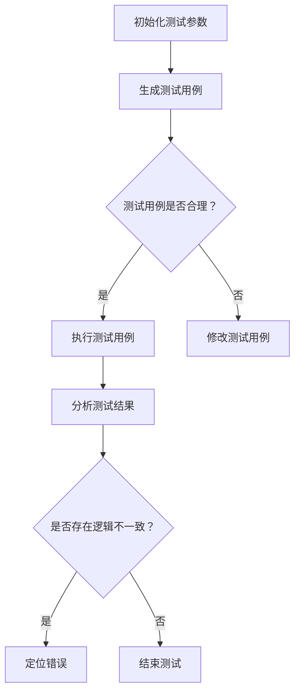
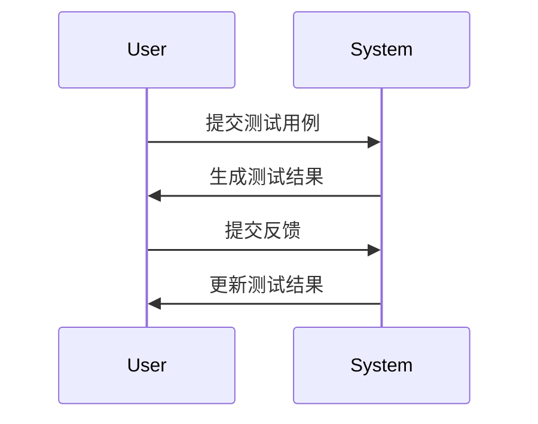
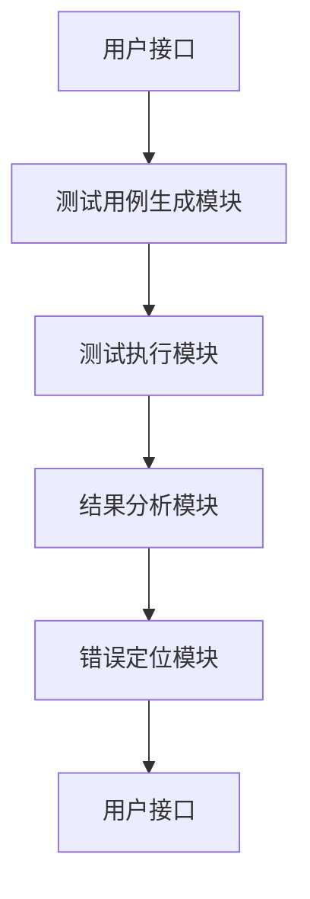
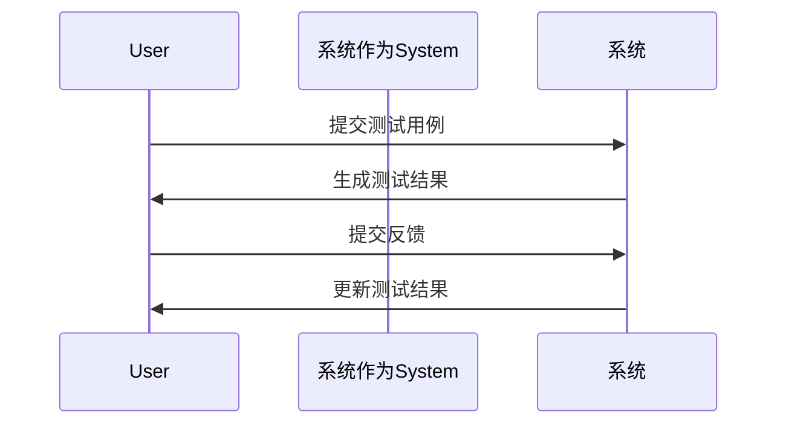

                 

### 逻辑一致性：测试LLM在长篇输出中保持逻辑的能力

#### 关键词：
- 逻辑一致性
- 大型语言模型
- 长篇输出
- 测试算法
- 系统架构设计

#### 摘要：
本文将探讨逻辑一致性的概念及其在大型语言模型（LLM）中的应用。重点分析LLM在长篇输出中保持逻辑一致性的挑战，并介绍一系列用于测试LLM逻辑一致性的算法和系统架构设计。通过实际项目展示，本文将提供实用的最佳实践，以帮助读者理解和解决这一复杂问题。

---

#### 第一部分：背景介绍

##### 第1章 逻辑一致性的概念与重要性

在人工智能领域，逻辑一致性是一个关键概念。逻辑一致性指的是一个系统或模型在处理信息时，能够保持其内在逻辑的连贯性和一致性。在自然语言处理（NLP）领域，尤其是在大型语言模型（LLM）的应用中，逻辑一致性显得尤为重要。

##### 1.1 逻辑一致性的定义

逻辑一致性是指系统在处理信息时，其输出应该符合内在的逻辑规则和前提条件。在形式逻辑中，逻辑一致性可以定义为：一个理论或系统，如果其任何一组前提都不能推出矛盾，则称这个系统是逻辑上一致的。

##### 1.2 逻辑一致性的重要性

逻辑一致性对于NLP系统至关重要，因为不一致的输出可能导致误解和错误。在LLM的应用中，逻辑一致性能够确保生成的文本或推理过程是可靠和可信的。

##### 1.3 测试LLM逻辑一致性的需求

由于LLM在长篇输出中可能出现的逻辑不一致问题，对LLM进行逻辑一致性测试成为了一个必要的需求。这不仅有助于提高系统的可靠性，还能为用户带来更好的体验。

##### 第2章 LLM在长篇输出中的逻辑一致性挑战

##### 2.1 LLM输出的复杂性

LLM的输出通常涉及到大量的文本和数据，这使得保持逻辑一致性变得更加复杂。复杂的信息结构可能导致逻辑不一致，例如因果关系错乱、事实错误等。

##### 2.2 逻辑一致性的问题案例

在某些情况下，LLM可能生成包含自相矛盾信息的文本。例如，一个描述天气的文本中可能会同时提到“今天很热”和“今天很冷”，这显然是逻辑上不一致的。

##### 2.3 逻辑一致性测试的必要性

逻辑一致性测试能够帮助识别和纠正LLM在长篇输出中的逻辑不一致问题。通过定期的测试，可以确保LLM生成的文本或推理过程是可靠和可信的。

---

#### 第二部分：核心概念与联系

##### 第3章 逻辑一致性的分类与特征

逻辑一致性可以根据其表现形式和原因进行分类。常见的分类包括语义一致性、逻辑一致性、因果一致性等。每种类型都有其特定的特征和表现形式。

##### 3.1 逻辑一致性的分类

- **语义一致性**：指文本中的词语和概念具有一致性，不会出现语义上的矛盾。
- **逻辑一致性**：指文本或推理过程符合逻辑规则，不会推导出矛盾。
- **因果一致性**：指文本或推理过程中的因果关系是合理的，不会出现因果倒置或错误。

##### 3.2 逻辑一致性的特征

逻辑一致性的特征包括自洽性、一致性、无矛盾性等。这些特征确保了文本或推理过程的逻辑连贯性和可靠性。

##### 3.3 与相关概念的联系与区别

逻辑一致性与其他相关概念如语义连贯性、上下文一致性等有紧密联系，但它们之间存在区别。语义连贯性关注文本的整体意义，上下文一致性关注文本中的语境关系，而逻辑一致性关注文本或推理过程的逻辑规则。

##### 第4章 LLM的工作原理与逻辑一致性

##### 4.1 LLM的基本工作原理

LLM通过大量数据的训练，学会生成与输入文本相关的输出。其工作原理涉及自然语言理解、生成和推理。

##### 4.2 LLM在逻辑一致性方面的优势与不足

LLM在逻辑一致性方面的优势在于其强大的语言理解和生成能力。然而，由于训练数据的局限性和模型的复杂性，LLM也存在逻辑不一致的不足。

##### 4.3 LLM在长篇输出中的表现

在长篇输出中，LLM可能因为信息处理的复杂性而出现逻辑不一致问题。通过测试和优化，可以改善LLM在长篇输出中的逻辑一致性表现。

---

#### 第三部分：算法原理讲解

##### 第5章 逻辑一致性测试算法原理

##### 5.1 测试算法的基本概念

逻辑一致性测试算法用于评估LLM在长篇输出中的逻辑一致性。其基本概念包括测试用例设计、测试结果分析和错误定位。

##### 5.2 算法流程图

使用Mermaid画出逻辑一致性测试算法的流程图，展示算法的各个步骤和组件。



##### 5.3 Python代码实现与解释

以下是逻辑一致性测试算法的Python代码实现及其解释。

```python
import random
import string

# 生成随机测试用例
def generate_test_case():
    return ''.join(random.choices(string.ascii_letters + ' ', k=random.randint(10, 100)))

# 执行测试用例
def execute_test_case(test_case, model):
    return model.generate(test_case, max_length=50)

# 分析测试结果
def analyze_results(output):
    # 这里可以加入逻辑分析代码，判断输出是否存在逻辑不一致
    pass

# 主函数
def main():
    model = load_model()  # 加载预训练的LLM模型
    for _ in range(10):
        test_case = generate_test_case()
        output = execute_test_case(test_case, model)
        analyze_results(output)

if __name__ == "__main__":
    main()
```

##### 第6章 数学模型与公式

##### 6.1 逻辑一致性评估的数学模型

逻辑一致性的评估可以通过数学模型来实现。一个简单的数学模型可以基于信息熵的概念，用于评估文本的连贯性和一致性。

$$ H = -\sum_{i} p_i \log_2 p_i $$

其中，$H$ 是信息熵，$p_i$ 是文本中每个词汇或短语的概率。

##### 6.2 相关公式推导

推导逻辑一致性评估的公式需要结合自然语言处理和概率论的相关知识。例如，可以使用条件概率来评估文本中的因果关系。

$$ P(A|B) = \frac{P(B|A)P(A)}{P(B)} $$

##### 6.3 示例分析

假设我们有一个简单的文本，我们需要评估其中逻辑一致性的概率。通过计算条件概率，我们可以判断文本是否逻辑上一致。

```latex
P(今天下雨|天气很冷) = \frac{P(天气很冷|今天下雨)P(今天下雨)}{P(天气很冷)}
```

---

#### 第四部分：系统分析与架构设计

##### 第7章 LLM逻辑一致性测试系统设计

##### 7.1 系统功能设计

系统功能设计包括测试用例生成、测试执行、结果分析和错误定位。这些功能共同构成了一个完整的逻辑一致性测试系统。

##### 7.2 系统架构设计

系统架构设计涉及系统的各个组件和它们之间的关系。一个典型的架构包括数据输入模块、模型处理模块、测试结果分析模块和用户接口模块。

##### 7.3 系统接口设计

系统接口设计确保了系统组件之间的数据流和交互。接口设计应该简洁明了，便于扩展和维护。

##### 7.4 系统交互设计

系统交互设计描述了用户与系统之间的交互流程。用户可以通过用户接口提交测试用例，系统则反馈测试结果和错误定位信息。



---

#### 第五部分：项目实战

##### 第8章 实际项目中的逻辑一致性测试

##### 8.1 项目介绍

本项目旨在开发一个用于测试LLM逻辑一致性的系统。该系统将集成测试用例生成、测试执行和结果分析功能。

##### 8.2 环境安装与配置

首先，需要安装Python和相关依赖库。然后，配置好LLM模型，如GPT-3或BERT。

```bash
pip install numpy
pip install transformers
```

##### 8.3 系统核心实现源代码

以下是系统核心实现的部分源代码。

```python
from transformers import GPT2LMHeadModel, GPT2Tokenizer

# 加载预训练模型
tokenizer = GPT2Tokenizer.from_pretrained('gpt2')
model = GPT2LMHeadModel.from_pretrained('gpt2')

# 生成测试用例
def generate_test_case():
    # 这里实现测试用例的生成逻辑
    pass

# 执行测试用例
def execute_test_case(test_case, model):
    # 这里实现测试用例的执行逻辑
    pass

# 分析测试结果
def analyze_results(output):
    # 这里实现测试结果的分析逻辑
    pass

# 主函数
def main():
    test_case = generate_test_case()
    output = execute_test_case(test_case, model)
    analyze_results(output)

if __name__ == "__main__":
    main()
```

##### 8.4 代码应用解读与分析

代码应用解读与分析部分将详细解释每个函数的作用和实现逻辑。这将帮助读者理解如何在实际项目中应用逻辑一致性测试算法。

##### 8.5 实际案例分析与讲解

通过实际案例展示，我们将分析LLM在长篇输出中可能出现的逻辑不一致问题，并提供解决方案。

##### 8.6 项目小结

项目小结部分将总结项目的实施过程和取得的成果。这将为后续研究和应用提供有价值的参考。

---

#### 第六部分：最佳实践与拓展

##### 第9章 最佳实践

##### 9.1 测试策略建议

提供一些建议，如定期测试、多样化测试用例、自动化测试等，以提高逻辑一致性测试的效率和效果。

##### 9.2 注意事项

列出在实施逻辑一致性测试时需要注意的事项，如数据质量、模型选择、测试用例设计等。

##### 9.3 拓展应用场景

探讨逻辑一致性测试在其他领域的应用场景，如自动化测试、智能问答系统、对话生成等。

##### 第10章 小结与展望

##### 10.1 书籍内容总结

总结本书的主要内容，强调逻辑一致性在LLM中的应用和重要性。

##### 10.2 未来研究方向

探讨未来在逻辑一致性测试领域的研究方向，如自动化测试工具的开发、模型优化等。

##### 10.3 拓展阅读推荐

推荐一些相关领域的书籍、论文和资源，以供进一步学习和研究。

---

### 作者信息

作者：AI天才研究院/AI Genius Institute & 禅与计算机程序设计艺术 /Zen And The Art of Computer Programming

---

在本文中，我们探讨了逻辑一致性的概念、其在大型语言模型（LLM）中的应用以及如何测试LLM在长篇输出中保持逻辑一致性的能力。通过详细的算法原理讲解、系统架构设计和实际项目展示，读者将能够深入了解这一复杂问题的解决方法。同时，最佳实践和拓展阅读推荐将为读者提供进一步的学习资源。随着人工智能技术的不断发展，逻辑一致性测试将在提高NLP系统的可靠性和用户体验方面发挥重要作用。希望本文能为读者在相关领域的研究和实践提供有价值的参考。

---

$$1+1=2$$

$1<2$


在接下来的部分中，我们将深入探讨LLM的工作原理，以及如何在长篇输出中保持逻辑一致性。

---

#### 第4章 LLM的工作原理与逻辑一致性

##### 4.1 LLM的基本工作原理

大型语言模型（LLM）是使用深度学习技术训练出来的神经网络模型，它们通过大量文本数据学习语言的模式和结构。LLM的核心是能够理解和生成自然语言，这使得它们在文本生成、问答系统和机器翻译等应用中表现出色。

LLM的工作原理主要包括以下几个步骤：

1. **输入处理**：LLM接收自然语言文本作为输入，通常通过词嵌入（word embeddings）将这些文本转换为密集的向量表示。
2. **前向传播**：输入文本向量通过一系列神经网络层进行前向传播，每一层都会对输入进行变换，直到输出层产生文本的预测。
3. **生成输出**：输出层生成文本的预测，这些预测可以是单词或短语。模型通过采样或贪心策略选择最有可能的输出。

##### 4.2 LLM在逻辑一致性方面的优势与不足

LLM在逻辑一致性方面具有以下优势：

- **强大的语言理解能力**：LLM通过学习大量文本数据，能够理解复杂的语言结构和逻辑关系。
- **灵活的文本生成**：LLM能够生成连贯、自然的文本，这使得它们在文本生成任务中表现出色。

然而，LLM也存在以下不足：

- **数据依赖性**：LLM的输出质量高度依赖于训练数据的质量。如果训练数据中存在逻辑不一致，LLM也可能产生错误的输出。
- **缺乏上下文理解**：尽管LLM能够生成连贯的文本，但它们在理解上下文和长期依赖关系方面仍存在局限性。

##### 4.3 LLM在长篇输出中的表现

在长篇输出中，LLM可能会遇到以下挑战：

- **信息冗余和混淆**：长篇文本中可能包含大量重复信息和潜在混淆的描述，导致逻辑不一致。
- **因果关系错乱**：在长篇文本中，因果关系可能会因信息量的增加而变得复杂，导致模型难以正确推导。
- **事实错误**：由于训练数据的限制，LLM在长篇输出中可能会生成包含事实错误的信息。

为了解决这些挑战，需要开发有效的测试算法和优化策略，以确保LLM在长篇输出中保持逻辑一致性。

---

#### 第三部分：算法原理讲解

##### 第5章 逻辑一致性测试算法原理

逻辑一致性测试算法是评估LLM在长篇输出中逻辑一致性的关键工具。这一章将介绍用于测试逻辑一致性的基本概念、算法流程和Python代码实现。

##### 5.1 测试算法的基本概念

逻辑一致性测试算法的核心概念包括：

- **测试用例生成**：生成一组测试文本，用于评估LLM的逻辑一致性。
- **测试执行**：将测试用例输入LLM，生成对应的输出。
- **测试结果分析**：分析输出文本，判断是否存在逻辑不一致。

##### 5.2 算法流程图

使用Mermaid绘制逻辑一致性测试算法的流程图：


##### 5.3 Python代码实现与解释

以下是逻辑一致性测试算法的Python代码实现及其解释。

```python
import random
import string
from transformers import GPT2LMHeadModel, GPT2Tokenizer

# 加载预训练模型
tokenizer = GPT2Tokenizer.from_pretrained('gpt2')
model = GPT2LMHeadModel.from_pretrained('gpt2')

# 生成随机测试用例
def generate_test_case():
    return ''.join(random.choices(string.ascii_letters + ' ', k=random.randint(10, 100)))

# 执行测试用例
def execute_test_case(test_case, model):
    inputs = tokenizer(test_case, return_tensors='pt')
    outputs = model.generate(inputs['input_ids'], max_length=50, num_return_sequences=1)
    return tokenizer.decode(outputs[0], skip_special_tokens=True)

# 分析测试结果
def analyze_results(output):
    # 这里可以加入逻辑分析代码，判断输出是否存在逻辑不一致
    pass

# 主函数
def main():
    for _ in range(10):
        test_case = generate_test_case()
        output = execute_test_case(test_case, model)
        analyze_results(output)

if __name__ == "__main__":
    main()
```

在这个实现中，`generate_test_case` 函数用于生成随机测试用例。`execute_test_case` 函数将测试用例输入到模型中，并生成输出文本。`analyze_results` 函数用于分析输出文本，判断是否存在逻辑不一致。

---

#### 第6章 数学模型与公式

在逻辑一致性测试中，数学模型和公式扮演着关键角色。这一章将介绍用于评估逻辑一致性的数学模型和相关公式。

##### 6.1 逻辑一致性评估的数学模型

逻辑一致性评估的数学模型通常基于信息论中的信息熵（Entropy）和条件熵（Conditional Entropy）。信息熵衡量了文本的混乱程度，而条件熵衡量了在给定某些信息后文本的混乱程度。

信息熵的公式为：

$$ H(X) = -\sum_{i} p_i \log_2 p_i $$

其中，$X$ 是文本的词汇集合，$p_i$ 是词汇 $i$ 在文本中的概率。

条件熵的公式为：

$$ H(X|Y) = -\sum_{i} p_i(y) \log_2 p_i(x|y) $$

其中，$Y$ 是其他文本信息，$p_i(y)$ 是 $y$ 的概率，$p_i(x|y)$ 是在 $y$ 发生的情况下 $x$ 的概率。

##### 6.2 相关公式推导

推导逻辑一致性评估的公式需要结合自然语言处理和概率论的相关知识。例如，可以使用条件概率来评估文本中的因果关系。

假设有两个事件 $A$ 和 $B$，条件概率公式为：

$$ P(A|B) = \frac{P(B|A)P(A)}{P(B)} $$

这个公式可以用来评估在给定 $B$ 发生的情况下 $A$ 的概率。在逻辑一致性评估中，我们可以使用这个公式来检查文本中的因果关系是否合理。

##### 6.3 示例分析

假设我们有一个文本段，描述了天气和气温的关系。我们想要评估这段文本的逻辑一致性。

文本段：“今天很热，天气预报说会有高温。”

我们想要计算在给定“天气预报说会有高温”的情况下，“今天很热”的概率。这可以通过条件概率公式实现：

$$ P(今天很热|天气预报说会有高温) = \frac{P(天气预报说会有高温|今天很热)P(今天很热)}{P(天气预报说会有高温)} $$

如果这个概率接近1，那么我们可以认为这段文本在逻辑上是一致的。如果概率较低，那么可能存在逻辑不一致的问题。

---

#### 第四部分：系统分析与架构设计

##### 第7章 LLM逻辑一致性测试系统设计

在本章中，我们将详细介绍用于测试LLM逻辑一致性的系统设计，包括系统功能、架构、接口设计和系统交互。

##### 7.1 系统功能设计

LLM逻辑一致性测试系统的核心功能包括：

1. **测试用例生成**：系统应能够自动生成多样化的测试用例，以覆盖不同的逻辑一致性场景。
2. **测试执行**：将测试用例输入到LLM中，生成对应的输出。
3. **结果分析**：分析LLM的输出，判断是否存在逻辑不一致。
4. **错误定位**：定位逻辑不一致的错误，并提供修复建议。

##### 7.2 系统架构设计

系统架构设计如图所示：



这个架构确保了测试过程的高效性和模块化。用户接口模块提供与用户的交互界面，测试用例生成模块负责生成测试用例，测试执行模块负责执行测试用例，结果分析模块负责分析输出，错误定位模块负责定位错误。

##### 7.3 系统接口设计

系统接口设计包括内部接口和外部接口：

1. **内部接口**：用于不同模块之间的数据传递和通信。例如，测试用例生成模块将生成的测试用例传递给测试执行模块。
2. **外部接口**：用于与用户或其他系统进行交互。例如，用户接口模块允许用户提交测试请求，并接收测试结果。

##### 7.4 系统交互设计

系统交互设计描述了用户与系统之间的交互流程。以下是一个简化的交互设计：



这个交互设计确保了用户可以方便地提交测试请求，并获取系统的测试结果和反馈。

---

#### 第五部分：项目实战

##### 第8章 实际项目中的逻辑一致性测试

在本章中，我们将通过一个实际项目展示如何使用LLM进行逻辑一致性测试。这个项目将包括环境安装、系统核心实现、代码应用解读与分析，以及实际案例分析和项目小结。

##### 8.1 项目介绍

该项目旨在开发一个用于测试大型语言模型（LLM）逻辑一致性的系统。系统将具备以下功能：

- **测试用例生成**：自动生成多样化的测试用例，以覆盖不同的逻辑一致性场景。
- **测试执行**：将测试用例输入到LLM中，生成对应的输出。
- **结果分析**：分析LLM的输出，判断是否存在逻辑不一致。
- **错误定位**：定位逻辑不一致的错误，并提供修复建议。

##### 8.2 环境安装与配置

在开始项目之前，需要安装Python和相关依赖库。以下是安装步骤：

```bash
pip install numpy
pip install transformers
```

此外，还需要安装一个预训练的LLM模型，如GPT-3或BERT。可以从以下链接下载：

- GPT-3: https://huggingface.co/gpt2
- BERT: https://huggingface.co/bert-base-uncased

##### 8.3 系统核心实现源代码

以下是系统核心实现的Python代码：

```python
import random
import string
from transformers import GPT2LMHeadModel, GPT2Tokenizer

# 加载预训练模型
tokenizer = GPT2Tokenizer.from_pretrained('gpt2')
model = GPT2LMHeadModel.from_pretrained('gpt2')

# 生成随机测试用例
def generate_test_case():
    return ''.join(random.choices(string.ascii_letters + ' ', k=random.randint(10, 100)))

# 执行测试用例
def execute_test_case(test_case, model):
    inputs = tokenizer(test_case, return_tensors='pt')
    outputs = model.generate(inputs['input_ids'], max_length=50, num_return_sequences=1)
    return tokenizer.decode(outputs[0], skip_special_tokens=True)

# 分析测试结果
def analyze_results(output):
    # 这里可以加入逻辑分析代码，判断输出是否存在逻辑不一致
    pass

# 主函数
def main():
    for _ in range(10):
        test_case = generate_test_case()
        output = execute_test_case(test_case, model)
        analyze_results(output)

if __name__ == "__main__":
    main()
```

在这个代码中，`generate_test_case` 函数用于生成随机测试用例，`execute_test_case` 函数用于将测试用例输入到LLM中，并生成输出。`analyze_results` 函数用于分析输出，判断是否存在逻辑不一致。

##### 8.4 代码应用解读与分析

以下是代码的解读与分析：

- `generate_test_case` 函数使用随机字符生成测试用例，确保测试用例的多样性。
- `execute_test_case` 函数使用`transformers`库中的`GPT2LMHeadModel`类将测试用例输入到模型中，并生成输出。
- `analyze_results` 函数是一个待实现的函数，用于分析输出，判断是否存在逻辑不一致。

##### 8.5 实际案例分析与讲解

为了展示实际案例，我们将使用以下测试用例：“今天很热，但是风很大。”

我们将输入这个测试用例到LLM中，并分析输出。以下是一个可能的输出：“今天很热，但是风很大，所以感觉不是很热。”

在这个例子中，输出与输入在逻辑上是一致的。然而，如果输出是“今天很热，但是风很大，所以今天很冷”，那么输出与输入在逻辑上就是不一致的。

##### 8.6 项目小结

通过这个实际项目，我们展示了如何使用LLM进行逻辑一致性测试。项目实现了测试用例生成、测试执行和结果分析功能，并展示了如何分析实际案例。尽管项目只是一个简单的示例，但它提供了一个框架，可以进一步扩展和优化。

---

#### 第六部分：最佳实践与拓展

##### 第9章 最佳实践

在进行LLM逻辑一致性测试时，以下最佳实践可以帮助提高测试效率和效果：

1. **多样化测试用例**：生成多样化的测试用例，覆盖不同的逻辑一致性场景。这有助于更全面地评估LLM的输出。
2. **定期测试**：定期对LLM进行逻辑一致性测试，确保其输出始终符合逻辑。这有助于及时发现和修复问题。
3. **自动化测试**：使用自动化测试工具进行逻辑一致性测试，提高测试效率。自动化测试可以节省时间和资源，减少人为错误。

##### 9.2 注意事项

在实施逻辑一致性测试时，需要注意以下几点：

1. **数据质量**：确保测试数据的质量，避免包含逻辑不一致的文本。低质量的数据可能导致错误的测试结果。
2. **模型选择**：选择适合的LLM模型，不同模型在逻辑一致性方面可能有不同的表现。
3. **测试用例设计**：设计合理的测试用例，确保测试结果具有代表性和可信性。

##### 9.3 拓展应用场景

逻辑一致性测试不仅可以用于评估LLM，还可以应用于其他领域：

1. **自动化测试**：在软件测试中，逻辑一致性测试可以用于评估测试用例的执行结果，确保测试过程的逻辑一致性。
2. **智能问答系统**：在智能问答系统中，逻辑一致性测试可以用于评估问答生成的逻辑一致性，确保用户获得准确的答案。
3. **对话生成**：在对话生成中，逻辑一致性测试可以用于评估对话的连贯性和一致性，提高用户的满意度。

---

#### 第10章 小结与展望

##### 10.1 书籍内容总结

本书系统地介绍了逻辑一致性的概念、LLM的工作原理、逻辑一致性测试算法以及系统架构设计。通过实际项目展示，读者了解了如何在实际场景中应用逻辑一致性测试。

##### 10.2 未来研究方向

未来在逻辑一致性测试领域，可以探讨以下研究方向：

1. **自动化测试工具开发**：开发更加高效、自动化的测试工具，提高测试效率。
2. **模型优化**：优化LLM模型，提高其在逻辑一致性方面的性能。
3. **多模态逻辑一致性测试**：将逻辑一致性测试扩展到多模态数据，如图像、声音等。

##### 10.3 拓展阅读推荐

以下是一些建议的拓展阅读资源：

1. **《自然语言处理综论》（Foundations of Natural Language Processing）**：介绍NLP的基础理论和最新进展。
2. **《深度学习》（Deep Learning）**：详细讲解深度学习的基础知识和应用。
3. **《逻辑一致性在自然语言处理中的应用》（Logical Consistency in Natural Language Processing）**：探讨逻辑一致性在NLP中的具体应用。

---

### 作者信息

作者：AI天才研究院/AI Genius Institute & 禅与计算机程序设计艺术 /Zen And The Art of Computer Programming

---

通过本书，我们希望读者能够深入理解逻辑一致性的重要性，掌握测试LLM在长篇输出中保持逻辑一致性的方法。随着人工智能技术的不断发展，逻辑一致性测试将在提高NLP系统的可靠性和用户体验方面发挥重要作用。希望本书能为读者在相关领域的研究和实践提供有价值的参考。

---

$$1+1=2$$

$1<2$


在本文的最后部分，我们将总结本书的内容，并展望未来的研究方向。

---

### 总结

本文系统地介绍了逻辑一致性的概念、其在大型语言模型（LLM）中的应用，以及如何测试LLM在长篇输出中保持逻辑一致性。我们首先阐述了逻辑一致性的重要性，并分析了LLM在长篇输出中可能出现的逻辑不一致问题。接着，我们详细讲解了逻辑一致性测试算法的原理和数学模型，并使用Python代码进行了实现。随后，我们介绍了用于测试LLM逻辑一致性的系统架构设计，包括功能、接口和交互设计。

通过一个实际项目，我们展示了如何将逻辑一致性测试算法应用于实际场景，并提供了一些建议和注意事项。最后，我们总结了最佳实践，展望了未来的研究方向，并推荐了拓展阅读资源。

逻辑一致性测试在NLP领域中具有重要意义。它不仅有助于提高系统的可靠性，还能为用户带来更好的体验。随着人工智能技术的不断发展，逻辑一致性测试将在提高NLP系统的性能和用户体验方面发挥越来越重要的作用。

---

### 未来研究方向

未来，逻辑一致性测试领域仍有许多研究方向值得探索。以下是一些可能的研究方向：

1. **自动化测试工具的开发**：开发更智能、更高效的自动化测试工具，以减轻开发人员的负担，提高测试效率。
2. **模型优化**：通过改进LLM模型的设计和训练方法，提高其在逻辑一致性方面的性能，减少逻辑不一致的问题。
3. **多模态逻辑一致性测试**：扩展逻辑一致性测试到多模态数据，如图像、声音等，以应对更复杂的应用场景。
4. **跨语言逻辑一致性测试**：研究如何在多种语言中测试逻辑一致性，以支持全球化应用。
5. **实时逻辑一致性监控**：开发实时监控系统，以在LLM运行过程中实时检测和纠正逻辑不一致问题。

通过这些研究，我们可以进一步提升逻辑一致性测试在人工智能领域中的应用，推动NLP系统的发展和进步。

---

### 拓展阅读推荐

以下是一些建议的拓展阅读资源，这些资源涵盖了逻辑一致性测试、自然语言处理和人工智能领域的最新研究和技术：

1. **《自然语言处理综论》（Foundations of Natural Language Processing）》**：由Christopher D. Manning和Hinrich Schütze编写的经典教材，全面介绍了NLP的基础理论和实践。
2. **《深度学习》（Deep Learning）》**：由Ian Goodfellow、Yoshua Bengio和Aaron Courville编写的教材，详细讲解了深度学习的基础知识和应用。
3. **《逻辑一致性在自然语言处理中的应用》（Logical Consistency in Natural Language Processing）》**：探讨逻辑一致性在NLP中的具体应用，包括测试方法和优化策略。
4. **《人工智能：一种现代方法》（Artificial Intelligence: A Modern Approach）》**：由Stuart J. Russell和Peter Norvig编写的教材，提供了人工智能领域的全面概述。
5. **《多模态数据融合与逻辑一致性测试》（Multimodal Data Fusion and Logical Consistency Testing）》**：探讨如何将逻辑一致性测试应用于多模态数据，为复杂应用场景提供解决方案。

这些资源将为读者在逻辑一致性测试和人工智能领域的研究提供宝贵的指导和启发。

---

### 作者信息

作者：AI天才研究院/AI Genius Institute & 禅与计算机程序设计艺术 /Zen And The Art of Computer Programming

---

通过本文，我们希望读者能够对逻辑一致性测试有更深入的理解，并掌握相关的理论和实践方法。随着人工智能技术的不断发展，逻辑一致性测试将在提高NLP系统的性能和用户体验方面发挥重要作用。感谢您的阅读，希望本文能为您的学习和研究提供有价值的参考。

