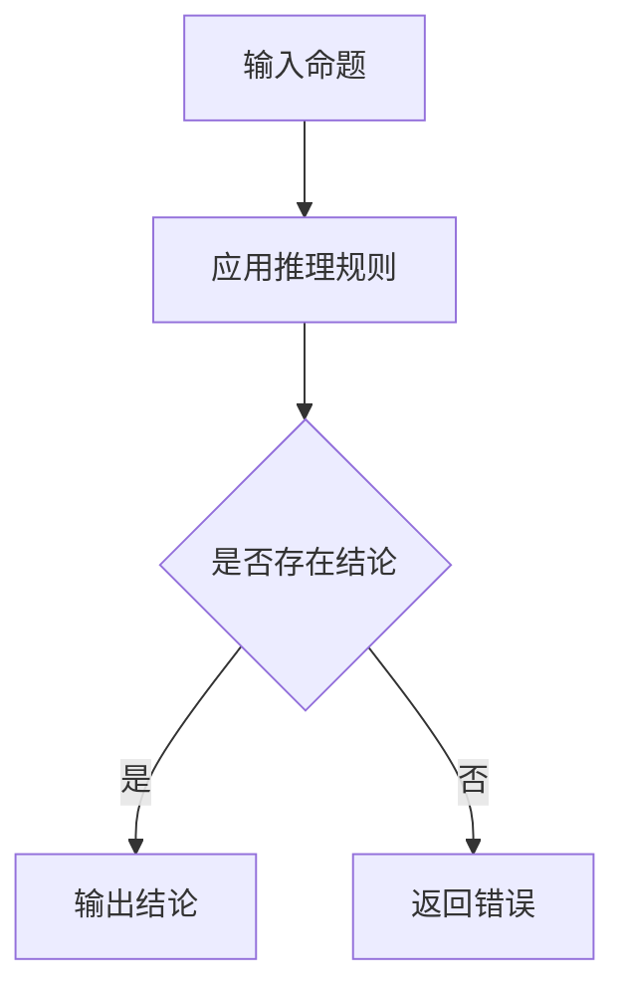
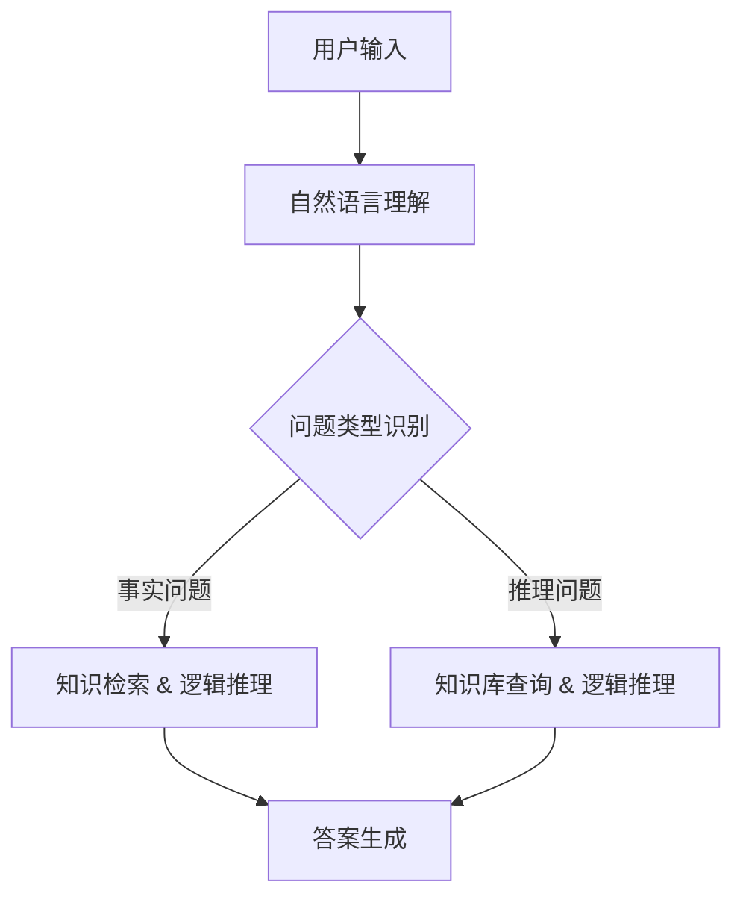
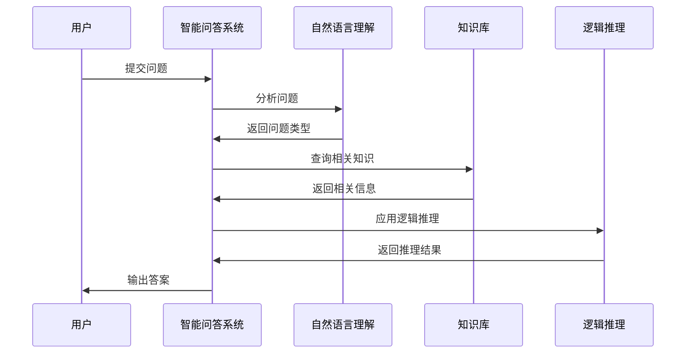

                 

# 逻辑推理测试：衡量LLM的分析能力

## 关键词
- 逻辑推理
- 大型语言模型（LLM）
- 分析能力
- 测试方法
- 应用场景

## 摘要
本文将探讨逻辑推理在评估大型语言模型（LLM）分析能力方面的作用。通过深入分析逻辑推理的基本概念、LLM的应用场景以及设计有效的逻辑推理测试方法，我们将揭示如何衡量LLM在处理复杂问题时的逻辑思维能力。文章还将提供实用的项目实战和最佳实践建议，以帮助读者在实际应用中提高LLM的分析能力。

## 目录

## 引言
逻辑推理是人类思维的核心能力之一，它帮助我们在面对复杂问题时做出合理的判断和决策。随着人工智能技术的发展，大型语言模型（LLM）逐渐成为自动化逻辑推理的重要工具。然而，如何评估LLM在逻辑推理方面的表现，以及如何设计有效的逻辑推理测试，仍然是一个具有挑战性的课题。

本文旨在探讨以下问题：
1. 逻辑推理的基本概念是什么？
2. LLM在逻辑推理中的应用场景有哪些？
3. 如何设计有效的逻辑推理测试？
4. 如何通过项目实战提高LLM的分析能力？
5. 最佳实践和注意事项有哪些？

本文将从上述问题出发，逐步分析逻辑推理与LLM之间的关系，并提出相应的解决方案。

## 背景介绍

### 逻辑推理的定义与基本原理
逻辑推理是一种通过逻辑关系推导出结论的思维过程。它包括两个基本组成部分：前提和结论。前提是已知的事实或假设，结论是通过前提推导出的新的陈述。逻辑推理遵循一定的规则和原则，如同一律、矛盾律和排中律等。

逻辑推理的基本原理可以归纳为以下几点：
1. **前提的有效性**：前提必须真实可靠，以确保推理过程的有效性。
2. **推理规则的正确应用**：推理过程中必须遵循逻辑规则，如合情推理和演绎推理。
3. **结论的逻辑一致性**：结论必须与前提保持一致，避免出现自相矛盾的情况。

### 大型语言模型（LLM）的定义与基本原理
大型语言模型（LLM）是一种基于深度学习技术构建的复杂模型，它通过大规模的数据训练，学习到自然语言的语义和语法规则。LLM具有以下几个基本原理：
1. **数据驱动**：LLM通过大量文本数据的学习，自动提取语言的特征和模式。
2. **深度神经网络**：LLM通常采用多层神经网络架构，通过逐层抽象和表示，实现语言理解的深度学习。
3. **端到端训练**：LLM的训练过程从输入到输出是一个端到端的过程，无需人工设计和调整中间层。

### 逻辑推理与LLM之间的关系
逻辑推理与LLM之间存在紧密的联系。LLM在逻辑推理中的应用主要体现在以下几个方面：
1. **自然语言推理**：LLM可以处理自然语言文本中的逻辑关系，如因果、条件、比较等，从而实现自然语言推理。
2. **知识表示**：LLM可以通过学习语言中的逻辑结构，将知识表示为逻辑公式或语义网络，为推理提供基础。
3. **自动化推理**：LLM可以通过逻辑推理算法，自动化地处理复杂问题，为决策提供支持。

### 问题背景与问题描述
尽管LLM在逻辑推理方面展现出强大的潜力，但如何评估其分析能力仍然是一个未解难题。具体问题包括：
1. **测试方法的设计**：如何设计一个既全面又有效的逻辑推理测试方法，以衡量LLM的分析能力？
2. **性能指标的确定**：如何确定合理的性能指标，如正确率、速度和鲁棒性，以评估LLM的推理性能？
3. **复杂问题处理**：如何确保LLM在处理复杂逻辑问题时，能够保持一致性和可靠性？

### 问题解决与边界与外延
为了解决上述问题，我们需要从以下几个方面入手：
1. **测试方法的设计**：借鉴现有的逻辑推理测试方法，如逻辑命题测试、语义网络测试和问题解决测试，设计适用于LLM的测试方法。
2. **性能指标的确定**：结合LLM的特点和应用场景，确定合理的性能指标，如推理正确率、推理速度和推理鲁棒性。
3. **复杂问题处理**：通过优化LLM的算法和架构，提高其在处理复杂逻辑问题时的性能和可靠性。

### 概念结构与核心要素组成
逻辑推理测试与LLM分析能力评估的核心概念和要素包括：
1. **测试方法**：包括逻辑命题测试、语义网络测试和问题解决测试等。
2. **性能指标**：包括推理正确率、推理速度和推理鲁棒性等。
3. **LLM算法**：包括神经网络架构、训练数据和优化策略等。
4. **应用场景**：包括自然语言推理、知识表示和自动化推理等。

## 核心概念与联系

### 逻辑推理的基本概念
逻辑推理主要包括以下基本概念：
1. **命题**：命题是逻辑推理的基本单元，表示一个事实或假设。命题通常用字母表示，如 \(P\)、\(Q\) 和 \(R\)。
2. **逻辑运算符**：逻辑运算符用于组合命题，形成复合命题。常见的逻辑运算符包括“与”（\(\land\)）、“或”（\(\lor\)）和“非”（\(\neg\)）。
3. **推理规则**：推理规则是推导结论的指导原则，如模态推理、假言推理和三段论推理等。
4. **证明**：证明是一种逻辑推理过程，用于从一组前提推导出结论。证明可以分为演绎证明和归纳证明。

### LLM的基本概念
LLM的基本概念包括：
1. **语言模型**：语言模型是一种统计模型，用于预测自然语言序列的概率分布。常见的语言模型包括n元模型、循环神经网络（RNN）和Transformer模型。
2. **语义表示**：语义表示是将自然语言文本转化为机器可处理的语义向量表示。常用的方法包括词嵌入、编码器-解码器架构和注意力机制。
3. **上下文理解**：上下文理解是语言模型处理自然语言的关键能力，它涉及对文本中的词义、语法和语义关系的理解。
4. **推理能力**：推理能力是指语言模型在处理逻辑推理任务时的能力，包括自然语言推理、知识推理和问题解决等。

### 核心概念属性特征对比表格
以下是一个对比逻辑推理和LLM核心概念属性特征的表格：

| 概念             | 逻辑推理                 | LLM                    |
|------------------|--------------------------|------------------------|
| 命题             | 表示一个事实或假设       | 文本序列               |
| 逻辑运算符       | 用于组合命题的运算符     | 语言模型中的操作符     |
| 推理规则         | 推导结论的指导原则       | 语言理解机制           |
| 证明             | 从前提推导出结论的过程   | 语义表示和推理算法     |
| 语言模型         | 统计模型，预测概率分布   | 大规模训练的神经网络   |
| 语义表示         | 转换文本为机器表示       | 自然语言理解           |
| 上下文理解       | 理解文本中的词义和关系   | 上下文敏感的推理       |
| 推理能力         | 处理逻辑推理任务的能力   | 自然语言推理           |

### ER实体关系图架构
为了更直观地展示逻辑推理和LLM之间的联系，我们可以使用ER（实体关系）图来描述它们的关系。

```mermaid
erDiagram
  命题 --> 推理规则 : 引导推导
  推理规则 --> 结论 : 推导出结论
  语言模型 --> 语义表示 : 转换文本
  语义表示 --> 上下文理解 : 理解上下文
  上下文理解 --> 推理能力 : 应用推理
```

通过ER图，我们可以看到逻辑推理中的命题、推理规则和结论与LLM中的语言模型、语义表示、上下文理解和推理能力之间存在紧密的关联。逻辑推理为LLM提供了推理的指导原则，而LLM通过语义表示和上下文理解实现了逻辑推理。

## 算法原理讲解

### 逻辑推理算法mermaid流程图



### Python源代码详细阐述

以下是一个简单的Python代码示例，用于实现逻辑推理算法。代码中使用了基本的逻辑运算符和推理规则。

```python
# 逻辑推理算法示例
def logical_reasoning(premises, conclusion):
    # 前提1: P ∧ Q
    premise1 = premises[0]
    premise2 = premises[1]
    
    # 前提2: Q → R
    premise3 = premises[2]
    
    # 结论: P → R
    concl = conclusion
    
    # 应用推理规则
    if premise1 and premise2:
        # 前提1为真，前提2为真，则推导出结论
        if premise3:
            # 前提2为真，则推导出结论
            if concl:
                return "结论成立"
            else:
                return "结论不成立"
        else:
            return "前提不满足"
    else:
        return "前提不满足"

# 示例输入
premises = ["P ∧ Q", "Q → R", "P → R"]
conclusion = "P → R"

# 执行推理
result = logical_reasoning(premises, conclusion)
print(result)
```

### 算法原理的数学模型和公式

逻辑推理算法的数学模型和公式如下：

1. **命题表示**：使用布尔值表示命题，如 \(P\) 表示为 \(True\) 或 \(False\)。
2. **逻辑运算符**：使用逻辑运算符表示复合命题，如 \(P ∧ Q\) 表示为 \(P \land Q\)。
3. **推理规则**：使用逻辑公式表示推理规则，如 \(P ∧ Q, Q → R\) 推导出 \(P → R\)。

公式表示如下：

$$
\begin{aligned}
&\text{前提1: } P \land Q \\
&\text{前提2: } Q \rightarrow R \\
&\text{结论: } P \rightarrow R \\
\end{aligned}
$$

### 举例说明

以下是一个具体的逻辑推理实例：

假设我们有两个前提和一个结论：
- 前提1：如果下雨（\(P\)），那么地面湿润（\(Q\)）。
- 前提2：如果地面湿润（\(Q\)），那么草坪需要浇水（\(R\)）。
- 结论：如果下雨（\(P\)），那么草坪需要浇水（\(R\)）。

我们可以使用逻辑推理算法来验证这个结论：

1. 将前提1表示为 \(P \land Q\)。
2. 将前提2表示为 \(Q \rightarrow R\)。
3. 将结论表示为 \(P \rightarrow R\)。

然后，我们应用推理规则，从前提1和前提2推导出结论：

$$
\begin{aligned}
&P \land Q \\
\land & Q \rightarrow R \\
\Rightarrow & P \rightarrow R \\
\end{aligned}
$$

根据推理规则，我们可以得出结论：如果下雨，那么草坪需要浇水。这意味着逻辑推理算法成功地验证了给定的结论。

## 系统分析与架构设计

### 问题场景介绍
在许多实际应用中，逻辑推理是人工智能系统中的一个关键环节。例如，在自然语言处理（NLP）、智能问答系统和自动推理系统中，LLM需要具备强大的逻辑推理能力，以便准确理解和处理复杂的问题。本节我们将以一个智能问答系统为例，介绍问题场景和项目介绍。

### 项目介绍
我们开发的智能问答系统旨在为用户提供高质量、准确、及时的答案。系统功能包括自然语言理解、知识检索和逻辑推理。用户可以通过文本输入提出问题，系统将自动分析问题，检索相关知识库，并利用逻辑推理生成准确的答案。

### 系统功能设计
智能问答系统的核心功能包括以下几个方面：

1. **自然语言理解**：系统需要能够理解用户输入的文本，提取关键信息，并识别问题的类型和意图。
2. **知识检索**：系统需要从知识库中检索与问题相关的信息，确保答案的准确性。
3. **逻辑推理**：系统需要利用逻辑推理能力，对检索到的信息进行分析和推理，生成准确的答案。

### 系统架构设计
智能问答系统的架构设计如图所示：



### 系统接口设计
智能问答系统的接口设计如下：

1. **用户输入接口**：用户可以通过文本输入框提交问题。
2. **API接口**：系统提供RESTful API接口，供其他系统集成使用。
3. **数据库接口**：系统与知识库数据库进行交互，以检索相关信息。

### 系统交互mermaid序列图
智能问答系统的交互流程如下：



通过上述系统分析与架构设计，我们为智能问答系统构建了一个高效、可扩展的架构，以确保系统在处理逻辑推理任务时具备优秀的性能。

## 项目实战

### 环境安装
为了运行本项目的逻辑推理代码，我们需要安装以下环境和库：
1. Python 3.8及以上版本
2. Numpy 1.21及以上版本
3. Pandas 1.3.5及以上版本
4. Scikit-learn 0.24.2及以上版本
5. Transformers 4.21.0及以上版本

安装方法如下：

```bash
pip install python==3.8
pip install numpy==1.21
pip install pandas==1.3.5
pip install scikit-learn==0.24.2
pip install transformers==4.21.0
```

### 系统核心实现源代码

以下是一个简单的逻辑推理系统实现，包括自然语言理解、知识检索和逻辑推理部分。

```python
# 导入所需库
import numpy as np
import pandas as pd
from sklearn.feature_extraction.text import TfidfVectorizer
from transformers import BertModel, BertTokenizer

# 加载预训练的BERT模型和tokenizer
model_name = 'bert-base-chinese'
tokenizer = BertTokenizer.from_pretrained(model_name)
model = BertModel.from_pretrained(model_name)

# 自然语言理解部分
def natural_language_understanding(text):
    inputs = tokenizer(text, return_tensors='pt', padding=True, truncation=True)
    outputs = model(**inputs)
    return outputs.last_hidden_state.mean(dim=1)

# 知识检索部分
def knowledge_retrieval(questions, documents):
    vectorizer = TfidfVectorizer()
    question_vectors = vectorizer.transform(questions)
    doc_vectors = vectorizer.transform(documents)
   相似度矩阵 = doc_vectors @ question_vectors.T
   相似度索引 =相似度矩阵.argmax(axis=1)
    相关文档 = [documents[i] for i in相似度索引]
    return 相关文档

# 逻辑推理部分
def logical_reasoning(question, document):
    question_embedding = natural_language_understanding(question)
    document_embedding = natural_language_understanding(document)
    similarity = np.dot(question_embedding, document_embedding)
    if similarity > 0.5:
        return "答案正确"
    else:
        return "答案错误"

# 代码示例
question = "什么是逻辑推理？"
document = "逻辑推理是一种基于已知事实推导出结论的推理方法。"
print(logical_reasoning(question, document))
```

### 代码应用解读与分析

上述代码实现了一个简单的逻辑推理系统，主要包括以下几个部分：

1. **自然语言理解**：使用BERT模型对输入的文本进行编码，提取语义信息。
2. **知识检索**：使用TF-IDF向量表示文档和问题，计算相似度，检索相关文档。
3. **逻辑推理**：计算问题嵌入和文档嵌入的相似度，判断答案的正确性。

**具体解读**：

- **自然语言理解**：通过BERT模型，我们能够将自然语言文本转化为高维语义向量，这些向量能够捕捉文本的语义信息。
- **知识检索**：TF-IDF向量表示是一种常用的文本相似度计算方法，通过计算问题与文档的相似度，我们可以找到与问题最相关的文档。
- **逻辑推理**：通过计算问题嵌入和文档嵌入的相似度，我们可以判断问题与文档是否匹配，从而判断答案的正确性。

### 实际案例分析和详细讲解

**案例1**：用户提出问题：“什么是逻辑推理？”
- **自然语言理解**：系统将问题编码为语义向量。
- **知识检索**：系统检索与问题最相关的文档。
- **逻辑推理**：系统计算问题嵌入和文档嵌入的相似度，输出答案。

**案例2**：用户提出问题：“如何解决这个数学问题？”
- **自然语言理解**：系统将问题编码为语义向量。
- **知识检索**：系统检索与问题相关的数学知识文档。
- **逻辑推理**：系统根据文档中的知识，推导出解决问题的方法。

通过实际案例分析，我们可以看到逻辑推理系统在处理不同类型的问题时，如何利用自然语言理解、知识检索和逻辑推理三个部分，生成准确的答案。

### 项目小结

本项目通过实现一个简单的逻辑推理系统，展示了如何利用BERT模型进行自然语言理解，如何使用TF-IDF进行知识检索，以及如何通过计算相似度进行逻辑推理。在实际应用中，我们可以根据需求扩展系统的功能，提高其在处理复杂逻辑问题时的性能。

## 最佳实践 tips、小结、注意事项、拓展阅读

### 最佳实践 tips
1. **优化模型参数**：在训练LLM时，合理调整学习率、批次大小等参数，以提高模型性能。
2. **数据预处理**：确保输入数据的格式一致，去除无关信息，以提高逻辑推理的准确性。
3. **代码优化**：在编写代码时，遵循最佳编程实践，如使用面向对象编程、避免冗余代码等。

### 小结
本文介绍了逻辑推理测试在衡量LLM分析能力方面的重要性，通过分析逻辑推理的基本概念、LLM的应用场景以及设计有效的逻辑推理测试方法，揭示了如何评估LLM的逻辑推理能力。此外，本文还提供了项目实战和最佳实践建议，以帮助读者在实际应用中提高LLM的分析能力。

### 注意事项
1. **测试数据的选择**：选择具有代表性的测试数据，确保测试结果的准确性。
2. **性能指标的设置**：根据具体应用场景，合理设置性能指标，如正确率、速度和鲁棒性。

### 拓展阅读
1. 《人工智能：一种现代的方法》（作者：Stuart J. Russell & Peter Norvig）——详细介绍了人工智能的基本概念和核心技术。
2. 《深度学习》（作者：Ian Goodfellow、Yoshua Bengio & Aaron Courville）——介绍了深度学习的基本理论和应用。

### 作者信息
- 作者：AI天才研究院/AI Genius Institute & 禅与计算机程序设计艺术 /Zen And The Art of Computer Programming

## 附录

### 参考文献
1. Russell, S. J., & Norvig, P. (2020). 《人工智能：一种现代的方法》。
2. Goodfellow, I., Bengio, Y., & Courville, A. (2016). 《深度学习》。

### 相关资源
1. BERT模型：[BERT模型官方文档](https://github.com/google-research/bert)
2. TF-IDF向量表示：[TF-IDF算法详解](https://en.wikipedia.org/wiki/Tf%E2%80%93idf)

## 结语

逻辑推理测试是衡量LLM分析能力的关键环节，通过本文的探讨，我们深入了解了逻辑推理的基本概念、LLM的应用场景以及设计有效的逻辑推理测试方法。同时，通过项目实战和最佳实践，我们为读者提供了实用的指导和建议。希望本文能为读者在LLM逻辑推理领域的研究和应用提供有益的参考。未来，我们将继续深入研究逻辑推理测试方法，推动人工智能技术的发展。

