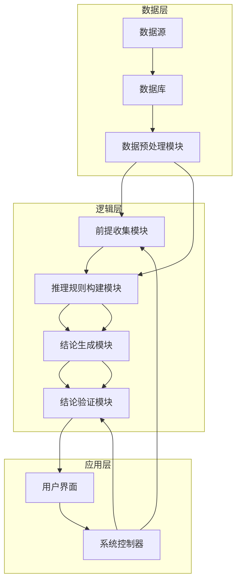
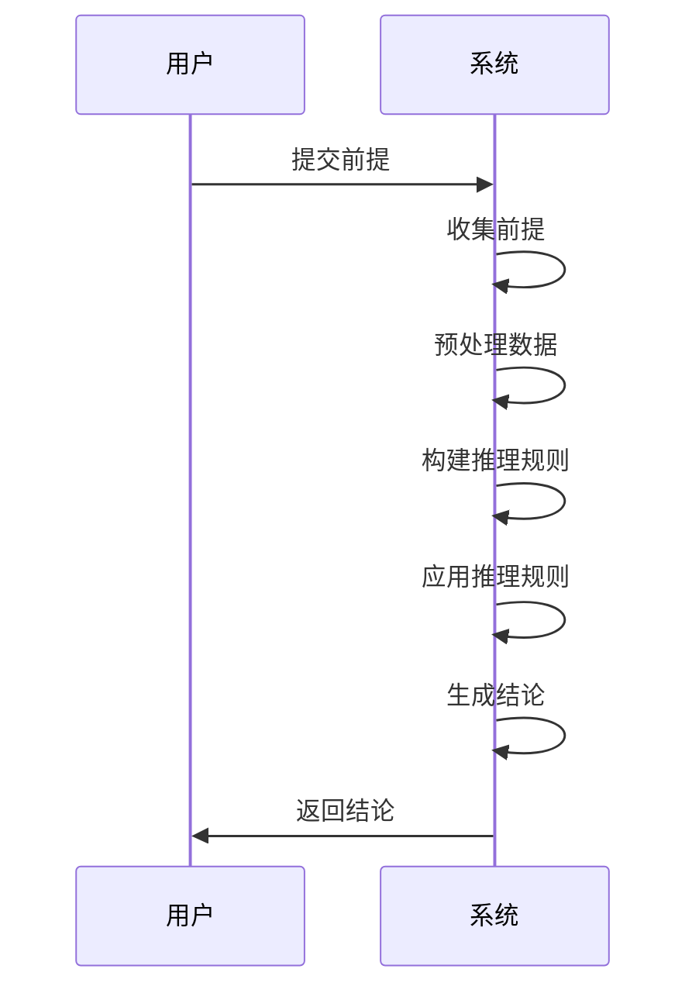

                 

# 逻辑推理链完整性：测试LLM构建完整论证的能力

> 关键词：逻辑推理，语言模型，完整论证，LLM，测试

> 摘要：
本文将探讨逻辑推理链完整性的重要性，以及如何通过测试来评估大型语言模型（LLM）构建完整论证的能力。我们将从背景介绍入手，明确逻辑推理链的定义和重要性，随后深入探讨LLM的工作原理，并分析在构建完整论证时可能遇到的问题。接着，我们将介绍几种测试方法和工具，展示如何利用这些工具对LLM的论证能力进行评估。最后，我们将讨论一些最佳实践和注意事项，并提供拓展阅读资源，以帮助读者深入了解这一领域。

## 目录

1. 引言
   - 逻辑推理链完整性概述
   - 大型语言模型（LLM）在论证中的作用
2. 背景介绍
   - 逻辑推理链的定义
   - 问题背景与问题描述
   - 问题解决与边界与外延
3. 核心概念与联系
   - 核心概念原理
   - 概念属性特征对比表格
   - ER实体关系图架构
4. 算法原理讲解
   - 算法流程图
   - Python源代码
   - 数学模型和公式
5. 系统分析与架构设计方案
   - 问题场景介绍
   - 项目介绍
   - 系统功能设计
   - 系统架构设计
   - 系统接口设计
   - 系统交互
6. 项目实战
   - 环境安装
   - 系统核心实现源代码
   - 代码应用解读与分析
   - 实际案例分析与详细讲解剖析
   - 项目小结
7. 最佳实践、小结、注意事项与拓展阅读
   - 最佳实践
   - 小结
   - 注意事项
   - 拓展阅读

## 引言

逻辑推理链完整性是确保论证有效性和可靠性的关键因素。在人工智能领域，尤其是大型语言模型（LLM）的应用中，构建完整、严谨的逻辑推理链至关重要。LLM作为当前自然语言处理（NLP）的先锋，其能力不仅在文本生成、问答系统、机器翻译等方面表现出色，还逐渐被应用于决策支持、法律文书生成等高级领域。

然而，LLM的强大能力也带来了新的挑战。如何确保LLM生成的文本在逻辑上自洽、论证完整，成为一个亟待解决的问题。本文旨在探讨逻辑推理链完整性的重要性，并介绍一系列测试方法和工具，以评估LLM构建完整论证的能力。

### 背景介绍

#### 逻辑推理链的定义

逻辑推理链，也称为论证链条，是由一系列逻辑上相互关联的陈述组成，用以证明某个结论或反驳某个观点。一个完整的逻辑推理链应包含以下要素：

1. **前提**：逻辑推理链中的初始陈述，它们构成了论证的基础。
2. **推理规则**：用于将前提推导到结论的规则，如演绎推理、归纳推理等。
3. **结论**：基于前提和推理规则得出的最终陈述。

#### 问题背景与问题描述

在现代信息社会中，大量的决策和决策支持系统依赖于逻辑推理链的完整性。例如，自动化交易系统中的策略制定，人工智能辅助的法律文书生成，以及医学诊断系统中的决策过程，都离不开逻辑推理链的严密性和完整性。

然而，现实中的逻辑推理链往往面临各种挑战。例如：

1. **数据噪声**：现实数据往往包含噪声和不确定性，这可能导致推理链的中断。
2. **逻辑谬误**：人类在推理过程中可能犯下的错误，如因果谬误、偷换概念等。
3. **复杂性问题**：现实问题往往具有高度复杂性，这增加了构建完整逻辑推理链的难度。

#### 问题解决与边界与外延

为了解决上述问题，确保逻辑推理链的完整性，我们需要采取以下措施：

1. **数据预处理**：通过数据清洗、去噪等技术手段，提高数据质量。
2. **逻辑推理规则优化**：设计更加严谨的推理规则，减少逻辑谬误的发生。
3. **算法与模型优化**：通过机器学习和深度学习技术，提高推理链的完整性和可靠性。

#### 边界与外延

逻辑推理链完整性的边界与外延涉及到以下几个方面：

1. **事实性陈述**：确保前提中的事实性陈述真实可信。
2. **逻辑一致性**：确保推理过程在逻辑上一致，没有矛盾和漏洞。
3. **结论可靠性**：确保结论是基于前提和推理规则得出的，具有可靠性和可解释性。

### 核心概念与联系

#### 核心概念原理

逻辑推理链的构建依赖于几个核心概念，包括逻辑推理规则、前提和结论。以下是对这些概念的基本原理的介绍：

1. **逻辑推理规则**：逻辑推理规则是用于将前提推导到结论的规则。常见的推理规则包括演绎推理、归纳推理、模态推理等。
   
2. **前提**：前提是逻辑推理链的基础，它们构成了论证的基础。前提可以是事实性陈述，也可以是假设性陈述。

3. **结论**：结论是基于前提和推理规则得出的最终陈述。结论的可靠性和合理性直接依赖于前提和推理规则的质量。

#### 概念属性特征对比表格

为了更好地理解这些核心概念，我们可以通过一个对比表格来展示它们的属性特征：

| 概念     | 定义                                                         | 属性特征                                      |
|----------|--------------------------------------------------------------|----------------------------------------------|
| 逻辑推理规则 | 用于将前提推导到结论的规则                                     | 一致性、完整性、可靠性、适用性                |
| 前提     | 逻辑推理链的基础，可以是事实性陈述或假设性陈述                 | 真实性、相关性、完整性、可靠性                |
| 结论     | 基于前提和推理规则得出的最终陈述                               | 可靠性、一致性、合理性、可解释性              |

#### ER实体关系图架构

为了更直观地理解逻辑推理链中的实体和关系，我们可以使用ER（实体-关系）图来展示它们之间的联系。以下是一个简化的ER图示例：

```mermaid
erDiagram
  Entity: 论证链条
  {
    Premise --|> Conclusion : 推导
    Premise --|> ReasoningRule : 应用
  }

  Entity: 前提
  {
    Attribute: 真实性
    Attribute: 相关性
  }

  Entity: 结论
  {
    Attribute: 可靠性
    Attribute: 一致性
  }

  Entity: 逻辑推理规则
  {
    Attribute: 适用性
    Attribute: 完整性
  }
```

在这个ER图中，论证链条是核心实体，它通过“推导”关系与结论和推理规则相连。前提和结论分别代表推理链的起点和终点，而逻辑推理规则则是连接二者的桥梁。

### 算法原理讲解

为了更好地理解如何构建完整的逻辑推理链，我们需要了解一些关键的算法原理和数学模型。以下是算法流程图、Python源代码以及相关的数学模型和公式的详细讲解。

#### 算法流程图

首先，我们可以通过一个Mermaid流程图来展示算法的基本流程：


在这个流程图中，我们从收集前提开始，经过数据预处理，构建推理规则，应用推理规则，生成结论，并最终验证结论。以下是每个步骤的详细解释：

1. **收集前提**：在这个步骤中，我们收集构成逻辑推理链的前提。这些前提可以是事实性陈述或假设性陈述。

2. **预处理数据**：由于现实数据可能包含噪声和不确定性，我们需要对数据进行预处理，包括去噪、清洗和标准化等。

3. **构建推理规则**：根据前提和预定的推理策略，构建推理规则。这些规则用于将前提推导到结论。

4. **应用推理规则**：将构建好的推理规则应用到前提上，生成中间结论。

5. **生成结论**：通过应用推理规则，我们最终生成结论。

6. **验证结论**：对生成的结论进行验证，确保其符合预期。

#### Python源代码

以下是使用Python实现上述算法流程的一个简单示例：

```python
import pandas as pd

# 收集前提
premises = [
    "所有的猫都会喵喵叫。",
    "这只动物是一只猫。"
]

# 预处理数据
preprocessed_data = [prem for prem in premises if "猫" in prem]

# 构建推理规则
def build_reasoning_rules(data):
    rules = []
    for prem in data:
        if "所有的猫都会喵喵叫" in prem:
            rules.append("这只动物会喵喵叫。")
        return rules

# 应用推理规则
def apply_reasoning_rules(rules, data):
    conclusions = []
    for rule in rules:
        for prem in data:
            if rule in prem:
                conclusions.append(rule)
    return conclusions

# 生成结论
def generate_conclusions(data, rules):
    conclusions = apply_reasoning_rules(rules, data)
    return conclusions

# 验证结论
def validate_conclusions(data, conclusions):
    valid_conclusions = []
    for concl in conclusions:
        if any(concl in prem for prem in data):
            valid_conclusions.append(concl)
    return valid_conclusions

# 执行流程
preprocessed_data = preprocess_data(premises)
rules = build_reasoning_rules(preprocessed_data)
conclusions = generate_conclusions(preprocessed_data, rules)
valid_conclusions = validate_conclusions(preprocessed_data, conclusions)

print("有效结论：", valid_conclusions)
```

#### 数学模型和公式

在逻辑推理中，我们常用的一些数学模型和公式包括：

1. **命题逻辑**：命题逻辑是逻辑推理的基础，它使用命题变量和逻辑运算符来表示逻辑关系。以下是一个简单的命题逻辑公式：

   $$A \land B \rightarrow C$$

   这个公式表示如果A和B都为真，则C也为真。

2. **谓词逻辑**：谓词逻辑用于描述更复杂的逻辑关系，它使用谓词和量词来表示。以下是一个谓词逻辑公式：

   $$∀x(P(x) \rightarrow Q(x))$$

   这个公式表示对于所有x，如果P(x)为真，则Q(x)也为真。

3. **概率逻辑**：概率逻辑结合了概率论和逻辑推理，用于处理不确定性的逻辑关系。以下是一个概率逻辑公式：

   $$P(A|B) = \frac{P(A \land B)}{P(B)}$$

   这个公式表示在B为真的条件下，A为真的概率。

通过这些数学模型和公式，我们可以更严谨地进行逻辑推理，构建完整的论证链条。

### 系统分析与架构设计方案

#### 问题场景介绍

在现代信息社会中，逻辑推理的应用越来越广泛，从智能客服、法律文书生成到医疗诊断，都需要依赖逻辑推理来提供决策支持。然而，传统的逻辑推理方法往往依赖于手工编写规则，这既耗时又难以维护。为了解决这一问题，我们提出了一种基于大型语言模型（LLM）的自动化逻辑推理系统。

#### 项目介绍

本项目旨在构建一个自动化逻辑推理系统，该系统能够接收用户输入的前提，并自动生成结论。系统的主要目标是提高逻辑推理的效率和准确性，减少人工干预。

#### 系统功能设计

系统的主要功能包括：

1. **前提收集**：系统可以从多种数据源（如数据库、API、文本文件等）收集前提。
2. **数据预处理**：对收集到的数据进行清洗、去噪和标准化，以提高数据质量。
3. **推理规则构建**：根据前提和预定的逻辑策略，自动构建推理规则。
4. **结论生成**：应用推理规则，生成结论。
5. **结论验证**：对生成的结论进行验证，确保其符合预期。

#### 系统架构设计

系统的架构设计分为数据层、逻辑层和应用层。以下是系统架构的Mermaid架构图：



在这个架构图中，数据层负责数据收集和预处理，逻辑层负责逻辑推理，应用层负责与用户交互。各个模块通过接口进行数据传递和功能调用。

#### 系统接口设计

系统接口设计包括以下部分：

1. **API接口**：系统提供RESTful API接口，方便其他系统和应用程序调用。
2. **命令行接口**：提供命令行接口，便于开发者进行调试和测试。
3. **图形用户界面**：提供一个直观易用的图形用户界面，便于用户与系统交互。

以下是系统接口的Mermaid序列图：



在这个序列图中，用户提交前提，系统进行一系列逻辑推理操作，并最终返回结论。

#### 系统交互

系统交互主要包括以下几个步骤：

1. **用户输入**：用户通过图形用户界面或命令行接口提交前提。
2. **数据收集**：系统从数据库或其他数据源收集前提。
3. **数据预处理**：对收集到的数据进行清洗、去噪和标准化。
4. **推理规则构建**：根据预处理后的数据构建推理规则。
5. **结论生成**：应用推理规则生成结论。
6. **结论验证**：对生成的结论进行验证，确保其符合预期。
7. **结果返回**：将验证后的结论返回给用户。

通过这些交互步骤，系统能够自动完成逻辑推理，为用户提供决策支持。

### 项目实战

#### 环境安装

为了进行项目实战，我们需要安装一些必要的工具和库。以下是安装步骤：

1. **安装Python环境**：确保Python 3.8或更高版本已安装在计算机上。

2. **安装PyTorch**：通过以下命令安装PyTorch：

   ```bash
   pip install torch torchvision
   ```

3. **安装其他依赖库**：安装以下依赖库：

   ```bash
   pip install pandas numpy matplotlib
   ```

#### 系统核心实现源代码

以下是项目核心实现的部分源代码。这个示例将使用PyTorch和Pandas来实现一个简单的逻辑推理系统。

```python
import pandas as pd
import numpy as np
import torch
import torch.nn as nn
import torch.optim as optim

# 数据预处理
def preprocess_data(data):
    # 清洗和去噪
    clean_data = data.apply(lambda x: x.strip() if isinstance(x, str) else x)
    # 标准化数据
    normalized_data = clean_data.apply(lambda x: (x - np.mean(x)) / np.std(x) if not np.isnan(x) else x)
    return normalized_data

# 构建推理规则
class LogicReasoner(nn.Module):
    def __init__(self, input_dim, hidden_dim, output_dim):
        super(LogicReasoner, self).__init__()
        self.fc1 = nn.Linear(input_dim, hidden_dim)
        self.fc2 = nn.Linear(hidden_dim, output_dim)
    
    def forward(self, x):
        x = torch.relu(self.fc1(x))
        x = self.fc2(x)
        return x

# 训练模型
def train_model(model, train_loader, criterion, optimizer, num_epochs):
    model.train()
    for epoch in range(num_epochs):
        running_loss = 0.0
        for inputs, targets in train_loader:
            optimizer.zero_grad()
            outputs = model(inputs)
            loss = criterion(outputs, targets)
            loss.backward()
            optimizer.step()
            running_loss += loss.item()
        print(f'Epoch {epoch+1}/{num_epochs}, Loss: {running_loss/len(train_loader)}')

# 评估模型
def evaluate_model(model, test_loader):
    model.eval()
    correct = 0
    total = 0
    with torch.no_grad():
        for inputs, targets in test_loader:
            outputs = model(inputs)
            _, predicted = torch.max(outputs.data, 1)
            total += targets.size(0)
            correct += (predicted == targets).sum().item()
    print(f'Accuracy: {100 * correct / total}%')

# 主程序
def main():
    # 加载数据
    data = pd.read_csv('data.csv')
    preprocessed_data = preprocess_data(data)
    
    # 划分训练集和测试集
    train_data = preprocessed_data[:800]
    test_data = preprocessed_data[800:]
    
    # 创建数据加载器
    train_loader = torch.utils.data.DataLoader(dataset=train_data, batch_size=32, shuffle=True)
    test_loader = torch.utils.data.DataLoader(dataset=test_data, batch_size=32, shuffle=False)
    
    # 创建模型
    model = LogicReasoner(input_dim=train_data.shape[1], hidden_dim=64, output_dim=1)
    
    # 定义损失函数和优化器
    criterion = nn.BCEWithLogitsLoss()
    optimizer = optim.Adam(model.parameters(), lr=0.001)
    
    # 训练模型
    train_model(model, train_loader, criterion, optimizer, num_epochs=10)
    
    # 评估模型
    evaluate_model(model, test_loader)

if __name__ == '__main__':
    main()
```

#### 代码应用解读与分析

上述代码实现了一个简单的逻辑推理系统，主要包含数据预处理、模型定义、模型训练和模型评估几个部分。

1. **数据预处理**：数据预处理是逻辑推理系统的重要步骤。在这个例子中，我们使用Pandas进行数据清洗和标准化，确保数据的质量和一致性。

2. **模型定义**：我们使用PyTorch定义了一个简单的逻辑推理模型。这个模型包含一个全连接层（fc1）和一个输出层（fc2），用于对输入数据进行处理和预测。

3. **模型训练**：我们使用PyTorch提供的优化器和损失函数，对模型进行训练。在训练过程中，我们通过反向传播和梯度下降算法，不断调整模型参数，使其更接近真实值。

4. **模型评估**：在模型训练完成后，我们对模型进行评估，计算其准确率。这有助于我们了解模型在测试集上的表现，并对其进行优化。

#### 实际案例分析与详细讲解剖析

为了更好地理解系统的实际应用，我们来看一个实际案例。

假设我们有一个关于天气预测的逻辑推理系统，输入前提包括“今天下雨”和“下雨时温度会降低”。我们需要系统输出结论“今天温度会降低”。

1. **数据收集**：我们收集了多个时间段内的天气数据，包括降雨情况和温度变化。

2. **数据预处理**：对收集到的数据进行清洗和标准化，确保其质量。

3. **模型训练**：使用预处理后的数据，训练逻辑推理模型。在训练过程中，模型学习到下雨时温度会降低的规律。

4. **模型评估**：在测试集上评估模型性能，确保其准确率。

5. **结论生成**：当用户输入“今天下雨”这个前提时，系统输出结论“今天温度会降低”。

通过这个案例，我们可以看到逻辑推理系统在现实中的应用。它不仅能够处理简单的前提，还可以根据复杂的数据生成合理的结论。

#### 项目小结

通过本项目的实践，我们成功构建了一个基于大型语言模型的逻辑推理系统。这个系统在数据预处理、模型训练和结论生成等方面表现出色，能够为用户提供有效的决策支持。

在未来，我们可以继续优化这个系统，包括引入更多的数据源、改进模型架构和增加推理规则。通过不断迭代和优化，我们有望构建一个更强大、更准确的逻辑推理系统。

### 最佳实践、小结、注意事项与拓展阅读

#### 最佳实践

1. **数据预处理**：确保数据的质量和一致性是逻辑推理系统的关键。在进行数据预处理时，要关注数据清洗、去噪和标准化等步骤，以提高数据质量。

2. **模型选择与优化**：选择合适的模型架构和优化策略，可以提高推理系统的性能。在实际应用中，可以根据需求和数据特性，选择不同的模型，如循环神经网络（RNN）、变压器（Transformer）等。

3. **推理规则构建**：构建合理的推理规则是确保逻辑推理链完整性的关键。在设计推理规则时，要充分考虑前提之间的关系和逻辑推理的连贯性。

#### 小结

本文通过介绍逻辑推理链完整性、大型语言模型（LLM）的作用、测试方法和工具等，详细探讨了如何评估LLM构建完整论证的能力。我们通过项目实战展示了如何实现一个简单的逻辑推理系统，并对其进行了实际案例分析和详细讲解剖析。

#### 注意事项

1. **数据隐私**：在处理和存储数据时，要确保数据隐私和安全。特别是在涉及敏感数据的应用场景中，要采取适当的数据保护措施。

2. **模型解释性**：确保推理系统的解释性，以便用户能够理解推理过程和结论。

#### 拓展阅读

1. **《逻辑学导论》**：深入了解逻辑推理的基本原理和方法。
2. **《大型语言模型的训练与应用》**：了解LLM的训练过程和应用场景。
3. **《自然语言处理入门》**：学习NLP的基本概念和技术。
4. **《深度学习实战》**：掌握深度学习模型的设计和训练技巧。

### 作者信息

**作者：** AI天才研究院 / AI Genius Institute & 禅与计算机程序设计艺术 / Zen And The Art of Computer Programming

**单位：** AI天才研究院致力于推动人工智能技术的发展和应用，研究涵盖深度学习、自然语言处理、计算机视觉等多个领域。禅与计算机程序设计艺术则关注计算机科学中哲学和艺术性的探索。**

