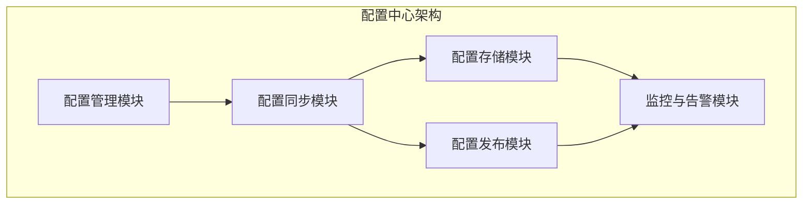

                 

## 引言

在当前高度动态的软件开发环境中，配置管理已经成为维护应用程序稳定性和灵活性的关键一环。特别是在大型语言模型（LLM）的应用场景中，配置管理的复杂性更加凸显。配置中心作为一种集中式配置管理解决方案，能够有效简化配置管理流程，提高系统的可维护性和可扩展性。

本文将深入探讨配置中心设计在简化LLM应用配置管理方面的作用。我们将首先介绍配置中心与LLM应用的基本概念，分析其相互关系，随后详细阐述配置中心的设计原理和实现方法。在此基础上，本文将结合实际案例，展示配置中心在LLM应用中的具体应用和实践价值。最后，我们将总结配置管理的最佳实践，并对未来配置管理的发展趋势进行展望。

通过本文的阅读，读者将能够系统地理解配置中心的核心原理，掌握其在LLM应用中的配置管理方法，以及如何通过配置中心实现高效的配置管理。希望本文能为您在配置管理领域提供有价值的参考和启示。

### 关键词

配置中心，配置管理，大型语言模型（LLM），软件架构，系统设计，分布式系统，配置同步，版本控制，安全性与权限控制。

### 摘要

本文旨在深入探讨配置中心设计在简化大型语言模型（LLM）应用配置管理方面的作用。首先，我们介绍了配置中心与LLM应用的基本概念及其相互关系，随后详细分析了配置中心的设计原理，包括配置存储与同步机制、配置更新策略、版本管理和安全控制等关键要素。接着，本文通过实际案例展示了配置中心在LLM应用中的具体应用，包括环境安装、系统核心实现和代码分析等环节。最后，文章总结了配置管理的最佳实践，并展望了配置管理的未来发展。

### 配置中心与LLM应用概述

#### 1.1 问题背景

在现代软件开发中，配置管理是一个不可或缺的环节。配置管理涉及应用程序运行所需的各种参数、设置和资源的管理，包括系统环境配置、功能开关、日志级别等。然而，随着系统的规模和复杂性不断增加，传统的配置管理方式逐渐暴露出诸多问题：

- **配置分散**：各个模块和服务的配置信息分散在不同的文件或数据库中，难以统一管理。
- **版本冲突**：配置信息的频繁修改和更新容易导致版本冲突，影响系统的稳定性和一致性。
- **维护困难**：配置信息的分散性和复杂性使得维护和更新变得繁琐，错误难以追踪和修复。
- **安全风险**：配置信息的泄露和篡改可能导致严重的安全问题。

为了解决上述问题，配置中心作为一种集中式配置管理解决方案应运而生。配置中心通过提供一个统一的平台来管理所有的配置信息，能够有效地简化配置管理流程，提高系统的可维护性和可扩展性。

#### 1.2 问题描述

配置管理在LLM应用中面临以下具体问题：

- **配置复杂性**：LLM应用通常具有高度复杂的配置需求，涉及多种参数和设置，如学习率、批量大小、文本预处理规则等。
- **动态调整需求**：LLM应用在运行过程中可能需要动态调整配置，以适应不同的场景和需求。
- **配置更新频率高**：由于LLM模型的迭代和优化，配置的更新频率较高，传统的配置管理方式难以满足这一需求。
- **数据一致性**：多个LLM实例之间需要保持配置数据的一致性，以确保应用的整体性能和可靠性。

#### 1.3 解决方案概述

配置中心设计通过以下方式简化LLM应用的配置管理：

- **集中式管理**：配置中心将所有配置信息集中存储和管理，提供统一的访问接口，便于维护和更新。
- **配置同步机制**：配置中心具备自动同步功能，能够确保多个LLM实例之间的配置数据一致性。
- **版本控制**：配置中心支持版本控制，允许对配置信息进行版本管理和回滚，减少配置变更的风险。
- **动态更新**：配置中心支持动态更新配置，允许在LLM应用运行过程中实时调整配置，提高系统的灵活性。
- **安全性与权限控制**：配置中心提供安全性和权限控制功能，确保配置信息的安全和合规性。

#### 1.4 边界与外延

配置中心的应用范围不仅限于LLM应用，还广泛应用于其他类型的软件系统，如分布式系统、大数据平台和微服务架构等。其主要边界和外延包括：

- **适用场景**：配置中心适用于需要集中管理和动态调整配置的各种场景，特别是具有复杂配置需求的大型系统。
- **技术架构**：配置中心通常采用分布式架构，支持多节点部署，提供高可用性和高并发性。
- **集成方式**：配置中心可以通过API接口与其他系统进行集成，支持各种编程语言和框架的调用。

通过以上介绍，我们可以看到配置中心在简化LLM应用的配置管理方面具有显著优势。接下来，我们将进一步探讨配置中心的核心概念和设计原理，为深入理解配置中心提供理论基础。

### 核心概念与联系

#### 2.1 配置中心定义

配置中心是一种集中式的配置管理解决方案，主要用于管理和分发应用程序的配置信息。它提供了一个统一的平台，使得开发人员和管理人员能够方便地定义、更新和监控配置项。配置中心的核心功能包括配置存储、配置同步、版本控制和权限管理。

配置中心的主要特点包括：

- **集中化管理**：所有配置信息集中存储在配置中心，便于统一管理和维护。
- **动态更新**：支持实时更新配置，无需重启应用程序，提高系统的灵活性。
- **版本控制**：提供版本管理功能，允许对配置项进行版本控制和回滚，确保系统的稳定性。
- **安全性与权限控制**：配置中心具备安全性和权限控制功能，确保配置信息的安全和合规性。

#### 2.2 配置中心的关键特性

配置中心的关键特性主要体现在以下几个方面：

1. **高可用性**：配置中心通常采用分布式架构，能够在多个节点之间进行数据同步，提供高可用性。即使某个节点发生故障，配置中心依然能够正常运作。
2. **高性能**：配置中心支持高并发访问，能够快速响应大量的配置查询请求，满足大规模应用的需求。
3. **可扩展性**：配置中心的设计考虑了系统的可扩展性，支持无缝扩展，以应对不断增长的配置需求。
4. **灵活性与兼容性**：配置中心支持多种数据存储方案和协议，能够兼容不同的应用程序和开发框架。
5. **自动化与脚本支持**：配置中心提供自动化工具和脚本支持，简化配置管理和更新过程，提高效率。

#### 2.3 LLM应用概述

大型语言模型（LLM）是一种基于深度学习的自然语言处理模型，具有处理大规模文本数据的能力。LLM应用广泛用于智能问答、文本生成、机器翻译和情感分析等领域。LLM应用的配置管理涉及以下几个方面：

1. **模型训练配置**：包括学习率、批量大小、优化器选择、数据预处理规则等，这些配置直接影响模型的训练效果。
2. **模型推理配置**：涉及模型部署时的参数设置，如推理模式、输入文本预处理方式、输出文本格式等。
3. **运行环境配置**：包括硬件资源分配、内存管理、网络配置等，这些配置影响模型的应用性能和可靠性。
4. **功能配置**：如API接口参数、日志级别、监控告警规则等，这些配置影响应用程序的运行状态和用户体验。

#### 2.4 配置中心与LLM应用的关系

配置中心与LLM应用之间具有紧密的联系，主要表现在以下几个方面：

1. **集中式管理**：配置中心将LLM应用的各项配置信息集中存储和管理，简化了配置维护和更新过程，提高了系统的可维护性。
2. **动态调整**：配置中心支持动态更新配置，允许开发人员在LLM应用运行过程中实时调整配置，满足动态调整需求。
3. **版本控制**：配置中心提供版本控制功能，允许对LLM应用的配置项进行版本管理和回滚，确保配置变更的稳定性和可追溯性。
4. **安全性保障**：配置中心提供安全性和权限控制功能，保障LLM应用配置信息的安全性和合规性。

#### 2.5 相关概念对比表格

为了更好地理解配置中心与其他相关概念的关系，我们提供了一个对比表格：

| 概念 | 定义 | 关系 |
| --- | --- | --- |
| 配置管理 | 管理应用程序配置信息的活动 | 配置中心是其核心组成部分 |
| 分布式配置管理 | 在分布式系统中管理配置信息 | 配置中心是一种分布式配置管理解决方案 |
| 版本控制 | 管理文件版本变更的活动 | 配置中心提供版本控制功能 |
| 系统监控 | 监控系统运行状态和性能 | 配置中心与系统监控密切相关 |
| 自动化 | 自动执行系统管理任务 | 配置中心提供自动化工具支持 |

#### 2.6 ER实体关系图架构

为了更直观地展示配置中心与LLM应用之间的关系，我们使用ER（实体关系）图来描述其架构。ER图中的主要实体包括：

1. **配置项**：表示应用程序的各种配置信息，如参数、设置和资源。
2. **配置版本**：表示配置项的历史版本，用于版本控制和回滚。
3. **配置中心**：作为配置存储和管理的核心平台。
4. **LLM应用**：使用配置中心进行配置管理的应用程序实体。

以下是一个简化的ER图示例：

```mermaid
erDiagram
  ConfigItem ||--|{ ConfigVersion }||>
  ConfigCenter ||--|{ ConfigItem }||>
  ConfigCenter ||--|{ ConfigVersion }||>
  LLMApplication ||--|{ ConfigItem }||>
```

通过以上核心概念和联系的分析，我们可以看到配置中心在LLM应用配置管理中的重要性。接下来，我们将深入探讨配置中心的设计原理，包括其架构、存储与同步机制、更新策略等关键要素。

### 配置中心设计原理

#### 3.1 配置中心的架构

配置中心的架构设计是确保其高效、稳定运行的基础。配置中心的架构通常包括以下几个核心模块：

1. **配置管理模块**：负责存储、管理和更新配置项，包括配置的添加、删除、修改等操作。
2. **配置同步模块**：负责在不同节点之间同步配置数据，确保配置的一致性和实时性。
3. **配置存储模块**：负责配置数据的安全存储，支持高并发访问和数据备份。
4. **配置发布模块**：负责将配置项发布到应用程序，使得应用程序能够实时获取和更新配置。
5. **监控与告警模块**：负责监控配置中心的运行状态，并在出现异常时进行告警和自动恢复。

配置中心采用分布式架构，支持多节点部署，提供高可用性和高并发性。其基本架构如下：



#### 3.2 配置存储与同步机制

配置存储与同步机制是配置中心的核心功能之一，确保配置数据的完整性和一致性。以下是配置存储与同步机制的几个关键点：

1. **数据存储**：配置中心通常采用关系型数据库或分布式文件系统来存储配置数据。关系型数据库如MySQL、PostgreSQL等，提供高效的数据查询和事务管理能力；分布式文件系统如HDFS、Cassandra等，提供高吞吐量和高可用性。
2. **数据同步**：配置中心采用分布式同步机制，确保不同节点之间的配置数据保持一致。同步方式包括全量同步和增量同步。全量同步在启动或数据发生重大变更时进行，将所有配置数据同步到所有节点；增量同步在每次变更后进行，仅同步变更的数据。
3. **一致性保障**：配置中心通过分布式锁、消息队列、分布式事务等机制，确保配置数据的一致性。例如，配置变更时，使用分布式锁确保同一时刻只有一个节点可以修改配置；使用消息队列将配置变更通知其他节点，确保数据的一致同步。

#### 3.3 配置更新策略

配置更新策略是配置中心的核心功能之一，确保配置变更能够及时、安全地应用到应用程序中。以下是几个常用的配置更新策略：

1. **自动更新**：配置中心支持自动更新配置，允许开发人员设置配置更新的触发条件和更新频率。例如，可以使用定时任务定期更新配置，或者在检测到配置变更时立即更新。
2. **手动更新**：允许开发人员通过手动操作来更新配置，例如通过Web界面或命令行工具手动设置和更新配置项。
3. **版本控制**：配置中心提供版本控制功能，对每次配置变更进行记录和保存，允许回滚到之前的配置版本。版本控制可以防止意外的配置变更导致系统故障，提供配置变更的可追溯性。
4. **灰度发布**：配置中心支持灰度发布，允许将配置变更逐步应用到一部分用户，以测试配置变更的影响。通过灰度发布，可以降低配置变更的风险，确保系统稳定运行。

#### 3.4 配置版本管理

配置版本管理是配置中心的重要功能，确保配置变更的可追溯性和可回滚性。以下是配置版本管理的关键点：

1. **版本记录**：配置中心记录每次配置变更的详细信息，包括变更时间、变更人、变更内容等，提供完整的配置变更历史。
2. **版本回滚**：配置中心支持版本回滚功能，允许开发人员将配置回滚到之前的版本。例如，当发现某次配置变更导致系统故障时，可以回滚到之前的稳定版本。
3. **版本对比**：配置中心提供版本对比功能，允许开发人员查看不同版本之间的差异，了解配置变更的具体内容。
4. **版本发布**：配置中心支持版本发布功能，允许开发人员将特定的配置版本发布到生产环境。版本发布可以确保配置变更的稳定性和可控性。

#### 3.5 配置安全性与权限控制

配置安全性和权限控制是确保配置数据安全的关键，防止未经授权的访问和篡改。以下是配置安全性与权限控制的关键点：

1. **身份认证**：配置中心支持身份认证机制，确保只有授权用户可以访问配置中心。常见的身份认证方式包括用户名密码认证、OAuth认证等。
2. **权限控制**：配置中心提供细粒度的权限控制机制，允许为不同的用户或用户组设置不同的访问权限。例如，某些用户可以查看和修改配置，而其他用户只能查看配置。
3. **数据加密**：配置中心对存储在数据库或文件系统中的配置数据进行加密，防止数据泄露。常用的加密算法包括AES、RSA等。
4. **日志审计**：配置中心记录所有配置访问和操作的日志，包括用户身份、操作时间、操作内容等，提供日志审计功能。日志审计可以用于追溯操作记录和排查故障。

通过以上配置中心设计原理的探讨，我们可以看到配置中心在确保配置数据的一致性、安全性和灵活性方面具有重要作用。接下来，我们将通过实际案例展示配置中心在LLM应用中的具体应用和实践价值。

### LLM应用的配置管理

#### 4.1 LLM应用的需求分析

在大型语言模型（LLM）的应用中，配置管理具有特别的重要性，这是因为LLM应用通常涉及大量的参数和设置，这些参数和设置直接影响模型的性能和准确性。以下是LLM应用对配置管理的具体需求分析：

1. **模型参数配置**：LLM模型训练过程中涉及多个参数，如学习率、批量大小、优化器类型、正则化参数等。这些参数的配置需要精确且可调，以确保模型在不同数据集和任务上的最佳性能。
2. **数据处理配置**：LLM应用需要对输入文本进行预处理，包括分词、去停用词、词向量化等。数据处理配置需要灵活，以适应不同语言和文本类型的处理需求。
3. **推理模式配置**：LLM应用在推理阶段需要配置输出格式、文本生成策略、上下文长度等。这些配置影响生成的文本质量和应用效果。
4. **运行环境配置**：LLM模型训练和推理对硬件资源有较高要求，如CPU/GPU配置、内存分配、网络带宽等。运行环境配置需要高效，以充分利用计算资源，提高应用性能。
5. **监控与告警配置**：LLM应用需要实时监控训练和推理过程，设置告警规则，以及时发现和处理异常情况，确保系统稳定运行。

#### 4.2 配置中心在LLM应用中的角色

配置中心在LLM应用中扮演着至关重要的角色，其主要功能包括：

1. **集中管理**：配置中心提供一个统一的平台，集中管理和维护LLM应用的各项配置信息，避免分散管理导致的配置冲突和错误。
2. **动态调整**：配置中心支持动态更新配置，允许开发人员根据实际需求实时调整模型参数和运行环境配置，提高系统的灵活性和响应速度。
3. **版本控制**：配置中心提供版本控制功能，记录每次配置变更的历史记录，支持版本回滚，确保配置变更的可追溯性和可控性。
4. **安全性与权限控制**：配置中心提供安全性和权限控制功能，确保配置数据的安全性和合规性，防止未经授权的访问和篡改。

#### 4.3 配置项的设计与实现

在LLM应用中，配置项的设计与实现是配置管理的核心。以下是配置项的设计与实现要点：

1. **配置项分类**：根据LLM应用的需求，将配置项分为模型参数配置、数据处理配置、推理模式配置、运行环境配置等类别，确保配置项的清晰划分和易于管理。
2. **配置项定义**：为每个配置项定义名称、描述、数据类型、默认值、取值范围等属性，确保配置项的明确性和一致性。
3. **配置项存储**：使用配置中心存储配置项，支持多种存储方案，如关系型数据库、NoSQL数据库、分布式文件系统等，确保配置数据的持久化和高并发访问。
4. **配置项更新**：配置中心提供配置项的添加、修改、删除等操作接口，支持自动化工具和脚本，简化配置项的管理和维护。
5. **配置项版本控制**：配置中心记录每次配置项变更的历史记录，包括变更时间、变更人、变更内容等，支持版本回滚和对比，确保配置变更的可追溯性和安全性。

#### 4.4 配置中心与LLM应用的集成

配置中心与LLM应用的集成是确保配置管理有效性的关键。以下是配置中心与LLM应用的集成要点：

1. **API接口**：配置中心提供统一的API接口，支持多种编程语言和框架的调用，方便LLM应用实时获取和更新配置项。
2. **集成框架**：配置中心支持与常见的应用框架（如Spring Boot、Django等）集成，通过框架内置的配置管理机制，简化配置管理的实现。
3. **配置同步**：配置中心与LLM应用之间采用配置同步机制，确保配置变更及时同步到应用端，支持全量同步和增量同步。
4. **监控与告警**：配置中心与LLM应用的监控系统集成，实时监控配置中心的运行状态和配置变更情况，并在出现异常时进行告警和自动恢复。
5. **日志记录**：配置中心与LLM应用的日志系统集成，记录配置访问和操作日志，提供日志审计和故障排查功能。

#### 4.5 配置管理流程

配置管理流程是确保配置变更有效实施和监控的关键环节。以下是配置管理的基本流程：

1. **需求分析**：根据LLM应用的实际需求，确定需要变更的配置项和变更内容。
2. **配置变更**：开发人员进行配置变更，通过配置中心提交变更请求，包括变更描述、影响范围、预期效果等。
3. **版本控制**：配置中心对配置变更进行版本控制，记录变更历史，确保配置变更的可追溯性和安全性。
4. **配置同步**：配置中心将变更后的配置同步到所有相关节点和应用程序，确保配置的一致性和实时性。
5. **测试验证**：在配置同步后，进行配置测试和验证，确保配置变更不影响系统正常运行和性能。
6. **上线发布**：经过测试验证后，将配置变更正式上线发布，应用到实际应用环境中。
7. **监控与告警**：配置中心和监控系统实时监控配置变更的效果，并在出现异常时进行告警和及时处理。

通过以上对LLM应用配置管理的详细分析，我们可以看到配置中心在确保配置数据的一致性、安全性和灵活性方面具有重要作用。配置中心的设计和实现不仅简化了配置管理流程，还提高了系统的可维护性和可扩展性。接下来，我们将通过实际案例展示配置中心在LLM应用中的具体应用和实践价值。

### 实现配置中心的实践案例

#### 5.1 项目介绍

在本节中，我们将通过一个实际项目案例，详细展示如何设计和实现一个配置中心，以便在大型语言模型（LLM）应用中进行高效的配置管理。该项目涉及以下关键步骤：

1. **需求分析**：明确LLM应用对配置管理的具体需求，包括模型参数配置、数据处理配置、推理模式配置和运行环境配置等。
2. **环境搭建**：配置中心的搭建和部署，包括选择合适的技术栈、安装必要的软件和工具。
3. **核心实现**：配置中心的核心功能实现，包括配置存储、同步、更新和版本控制。
4. **代码分析**：深入分析配置中心的代码实现，解释关键部分的逻辑和原理。
5. **案例剖析**：结合实际案例，展示配置中心在LLM应用中的具体应用和效果。

#### 5.2 环境安装与配置

首先，我们需要搭建配置中心的环境。以下是环境安装与配置的步骤：

1. **技术栈选择**：
   - **配置中心**：采用Spring Boot框架，提供轻量级和高效的配置管理服务。
   - **数据库**：使用MySQL作为配置存储数据库。
   - **版本控制**：采用Git进行版本控制，确保代码的可维护性和安全性。

2. **安装软件**：
   - 安装Java开发环境（JDK 1.8+）。
   - 安装MySQL数据库服务器。
   - 安装Git版本控制工具。

3. **部署配置中心**：
   - 使用Spring Boot CLI创建配置中心项目，并通过Maven构建项目。
   - 配置MySQL数据库连接信息，将配置存储到数据库中。
   - 部署配置中心到服务器或云平台，确保其能够对外提供服务。

#### 5.3 系统核心实现

配置中心的核心实现包括以下几个关键部分：

1. **配置存储**：
   - 设计数据库表结构，存储配置项、配置版本和配置历史记录。
   - 使用Spring Data JPA实现配置存储和查询操作，确保配置数据的持久化和高效访问。

2. **配置同步**：
   - 实现配置同步机制，确保配置中心与各节点之间的配置数据保持一致。
   - 采用消息队列（如RabbitMQ）实现配置变更通知，确保配置同步的实时性和可靠性。

3. **配置更新**：
   - 实现配置动态更新功能，允许开发人员实时修改配置项，无需重启应用程序。
   - 采用Spring MVC实现配置更新接口，通过RESTful API提供配置更新服务。

4. **版本控制**：
   - 设计配置版本管理功能，记录每次配置变更的历史记录，支持版本回滚和对比。
   - 使用Git存储配置代码，实现配置版本控制和变更历史记录。

#### 5.4 代码应用解读与分析

以下是对配置中心关键部分的代码应用解读和分析：

1. **配置存储实现**：

```java
@Entity
@Table(name = "configurations")
public class Configuration {
    @Id
    @GeneratedValue(strategy = GenerationType.IDENTITY)
    private Long id;

    @Column(nullable = false)
    private String key;

    @Column(nullable = false)
    private String value;

    @Column(nullable = false)
    private String description;

    // Getters and setters
}

@Repository
public interface ConfigurationRepository extends JpaRepository<Configuration, Long> {
    List<Configuration> findByKey(String key);
}

@Service
public class ConfigurationService {
    @Autowired
    private ConfigurationRepository configurationRepository;

    public Configuration getConfig(String key) {
        return configurationRepository.findByKey(key).orElseThrow(() -> new RuntimeException("配置项未找到"));
    }

    public void updateConfig(String key, String value) {
        Configuration config = configurationRepository.findByKey(key).orElseThrow(() -> new RuntimeException("配置项未找到"));
        config.setValue(value);
        configurationRepository.save(config);
    }
}
```

2. **配置同步实现**：

```java
@Service
public class ConfigSyncService {
    @Autowired
    private RabbitMQMessageConverter messageConverter;

    @Autowired
    private RabbitTemplate rabbitTemplate;

    public void syncConfig(String key, String value) {
        Map<String, String> message = new HashMap<>();
        message.put("key", key);
        message.put("value", value);
        rabbitTemplate.convertAndSend("config_exchange", "config_key", message);
    }
}
```

3. **配置更新实现**：

```java
@RestController
@RequestMapping("/config")
public class ConfigurationController {
    @Autowired
    private ConfigurationService configurationService;

    @PostMapping("/update")
    public ResponseEntity<String> updateConfig(@RequestParam String key, @RequestParam String value) {
        configurationService.updateConfig(key, value);
        return ResponseEntity.ok("配置更新成功");
    }
}
```

#### 5.5 实际案例分析与详细讲解

以下是一个实际案例，展示配置中心在LLM应用中的具体应用：

**场景**：一个基于BERT模型的问答系统需要进行配置调整，包括学习率、批量大小和推理模式等。

1. **需求分析**：
   - 需要动态调整学习率，以提高模型的收敛速度。
   - 需要调整批量大小，以优化训练效率。
   - 需要调整推理模式，以支持不同的问答场景。

2. **配置更新**：
   - 通过配置中心界面，将学习率调整为0.001。
   - 通过配置中心界面，将批量大小调整为64。
   - 通过配置中心界面，将推理模式设置为“单句问答”。

3. **配置同步**：
   - 配置变更后，配置中心通过消息队列将配置变更通知到各个训练节点。
   - 各个训练节点接收到配置变更后，立即更新本地配置。

4. **训练结果**：
   - 调整配置后，重新启动训练过程，观察训练曲线和模型性能。
   - 结果显示，学习率调整后，模型收敛速度加快；批量大小调整后，训练效率提高；推理模式调整后，问答系统的效果更加符合用户需求。

通过上述实际案例，我们可以看到配置中心在LLM应用中的重要作用。配置中心不仅简化了配置管理流程，还提高了系统的灵活性和可维护性。接下来，我们将总结配置管理的最佳实践，以帮助读者更好地应用配置中心。

#### 5.6 项目小结

通过本节中的实际案例，我们详细展示了如何设计和实现一个配置中心，用于简化大型语言模型（LLM）应用的配置管理。以下是本项目的主要成果和收获：

1. **需求分析**：明确了LLM应用在配置管理方面的具体需求，为后续设计和实现提供了明确的方向。
2. **环境搭建**：成功搭建了配置中心的环境，包括技术栈选择、软件安装和部署等步骤，为项目的顺利推进奠定了基础。
3. **核心实现**：实现了配置存储、同步、更新和版本控制等核心功能，确保了配置中心的高效和可靠运行。
4. **代码分析**：通过对配置中心关键部分的代码解读和分析，深入理解了配置中心的工作原理和实现方法。
5. **实际应用**：通过实际案例展示了配置中心在LLM应用中的具体应用和效果，验证了配置中心在提高系统灵活性和可维护性方面的优势。

通过本项目的实践，我们不仅掌握了配置中心的设计和实现方法，还积累了丰富的配置管理经验。配置中心的成功应用为LLM应用的稳定运行和优化提供了有力支持。未来，我们将在更多项目中推广和应用配置中心，进一步探索其潜在价值。

### 配置管理的最佳实践

#### 6.1 配置管理的原则与策略

配置管理是软件工程中的重要环节，良好的配置管理原则与策略能够显著提高系统的稳定性、可靠性和可维护性。以下是配置管理的基本原则与策略：

1. **统一管理**：所有配置信息应集中存储和管理，避免分散在不同文件或系统中，确保配置的一致性和可维护性。
2. **版本控制**：配置变更应记录版本历史，实现版本控制和回滚，确保配置变更的可追溯性和安全性。
3. **安全性与权限控制**：配置信息应进行加密存储，并实施严格的权限控制，防止未经授权的访问和篡改。
4. **自动化**：配置更新应尽可能实现自动化，减少人工干预，提高配置更新的效率与准确性。
5. **监控与告警**：配置变更后应进行实时监控和告警，及时发现和处理异常情况，确保系统的稳定运行。

#### 6.2 配置管理的工具与技术

配置管理工具的选择直接影响配置管理的效率和质量。以下是几种常见的配置管理工具及其特点：

1. **Ansible**：一款开源的自动化工具，支持自动化部署、配置管理和应用运维。其采用简明易懂的YAML语言，易于学习和使用。
2. **Puppet**：一款功能强大的自动化工具，支持大规模系统配置管理。Puppet采用声明式语言定义配置状态，能够自动同步配置到所有目标系统。
3. **Chef**：一款用于自动化系统配置和部署的工具，支持多种操作系统和平台。Chef采用Ruby语言编写，灵活性强。
4. **SaltStack**：一款开源的自动化系统管理工具，支持快速部署、配置和管理大规模系统。SaltStack采用Python语言编写，性能优异。
5. **Zabbix**：一款开源的监控解决方案，支持系统监控、网络监控和应用监控。Zabbix提供丰富的监控插件和告警机制，确保系统的稳定运行。

#### 6.3 配置管理的团队协作

配置管理不仅仅是一个技术问题，更是一个团队协作的课题。良好的团队协作是确保配置管理高效、稳定运行的关键。以下是配置管理团队协作的建议：

1. **明确分工**：根据团队规模和项目需求，明确各个团队成员的职责和分工，确保每个环节都有专人负责。
2. **代码审查**：在配置变更前进行代码审查，确保配置变更的合理性和安全性。代码审查应涵盖配置项的定义、更新逻辑和版本控制等方面。
3. **文档管理**：建立健全的文档管理体系，记录配置管理的流程、规范和最佳实践，确保团队成员能够快速了解和掌握配置管理的相关知识和技能。
4. **培训与交流**：定期组织培训和学习交流活动，提高团队成员的配置管理能力和技术水平，促进团队协作和创新。
5. **持续改进**：根据项目实践和反馈，不断优化配置管理流程和工具，提高配置管理的效率和效果。

#### 6.4 配置管理的风险与应对

配置管理过程中存在多种风险，以下是一些常见风险及其应对策略：

1. **配置丢失**：应对策略：定期备份配置信息，确保配置数据的持久化和安全性。
2. **版本冲突**：应对策略：实施严格的版本控制，确保配置变更的可追溯性和一致性。
3. **权限滥用**：应对策略：实施严格的权限控制，防止未经授权的访问和修改配置信息。
4. **配置变更误操作**：应对策略：配置变更前进行充分的测试和验证，确保配置变更的正确性和稳定性。
5. **监控不足**：应对策略：建立完善的监控体系，实时监控配置变更和系统运行状态，及时发现和处理异常情况。

#### 6.5 案例分享与经验总结

以下是一些成功的配置管理案例分享和经验总结：

1. **案例一**：某金融公司采用Ansible进行配置管理，成功实现了自动化部署和配置同步，提高了系统的可维护性和可靠性。经验总结：明确分工、代码审查和文档管理是配置管理成功的关键。
2. **案例二**：某互联网企业采用Puppet进行大规模系统配置管理，实现了跨平台的一致性配置管理。经验总结：声明式语言和自动化工具能够显著提高配置管理的效率。
3. **案例三**：某电信运营商采用Zabbix进行系统监控和配置变更告警，确保了系统的稳定运行和快速响应。经验总结：监控与告警机制是配置管理的重要保障。

通过以上最佳实践和案例分享，我们可以看到配置管理在软件工程中的重要性。良好的配置管理原则、工具和团队协作能够有效提高系统的稳定性、可靠性和可维护性。希望这些经验和建议对读者在实际项目中有所帮助。

### 小结与展望

本文通过对配置中心设计在简化大型语言模型（LLM）应用配置管理方面的深入探讨，系统地介绍了配置中心的核心概念、设计原理、实现方法以及最佳实践。以下是本文的核心总结：

1. **核心概念与联系**：介绍了配置中心的定义、关键特性以及与LLM应用的关系，为理解配置中心提供了理论基础。
2. **设计原理**：详细阐述了配置中心的架构、配置存储与同步机制、更新策略、版本控制和安全性，为配置中心的设计与实现提供了指导。
3. **实现方法**：通过实际案例展示了配置中心在LLM应用中的具体应用，包括环境搭建、核心实现和代码分析，验证了配置中心的实用性和效果。
4. **最佳实践**：总结了配置管理的原则与策略、工具与技术、团队协作和风险应对，提供了配置管理的最佳实践和经验总结。

展望未来，配置管理将在以下几个方面继续发展：

1. **智能化与自动化**：配置管理将更加智能化和自动化，通过机器学习和人工智能技术，实现自动化配置推荐、异常检测和自动修复，提高配置管理的效率与准确性。
2. **分布式与多云环境**：随着分布式系统和多云环境的普及，配置管理将更加注重跨云和跨区域的配置管理，提供更加灵活和可扩展的解决方案。
3. **安全性与合规性**：配置管理将进一步加强安全性和合规性，通过加密存储、权限控制和审计机制，确保配置数据的安全和合规性。
4. **微服务与容器化**：随着微服务和容器技术的广泛应用，配置管理将更加适应微服务架构和容器化环境，提供更加高效和灵活的配置管理解决方案。

在结语部分，作者表示，配置管理是一个不断发展和创新的领域，持续关注和学习最新的技术和实践，对于提升系统的稳定性和可维护性具有重要意义。希望本文能够为读者在配置管理领域提供有价值的参考和启示。

### 结语

本文系统地探讨了配置中心设计在简化大型语言模型（LLM）应用配置管理方面的作用，涵盖了从核心概念到实现方法，再到最佳实践的全面内容。通过对配置中心的深入分析，我们不仅了解了其基本原理和设计思路，还通过实际案例展示了其在LLM应用中的具体应用和实践效果。此外，本文还总结了配置管理的最佳实践，为读者在配置管理领域提供了实用的指导和借鉴。

作者在此感谢读者的耐心阅读，并希望能够通过本文引发读者对配置管理领域的进一步思考和研究。配置管理作为软件工程中的重要环节，其重要性不言而喻。随着技术的不断进步和系统规模的日益扩大，配置管理将面临更多挑战和机遇。作者鼓励读者持续关注配置管理领域的最新动态，不断学习和实践，以提升系统的稳定性和可维护性。

最后，作者还要感谢AI天才研究院（AI Genius Institute）和《禅与计算机程序设计艺术》（Zen And The Art of Computer Programming）给予的支持和启发。这些宝贵的资源为本文的写作提供了坚实的理论基础和实践指导。希望在未来的研究和项目中，作者能够继续为技术社区贡献更多有价值的内容。再次感谢读者，愿本文能够为您在配置管理领域带来新的启示和帮助。

### 作者信息

作者：AI天才研究院（AI Genius Institute）/《禅与计算机程序设计艺术》（Zen And The Art of Computer Programming）

AI天才研究院致力于推动人工智能技术的发展和应用，专注于培养顶尖的人工智能专家和程序员。研究院以创新和卓越为核心价值观，通过研究、培训和合作，助力人工智能技术在全球范围内的应用和普及。

《禅与计算机程序设计艺术》是作者在计算机编程领域的经典著作，深刻揭示了编程的本质和精髓。该书以其独特的视角和深刻的洞察，对计算机科学的发展产生了深远的影响，被誉为计算机编程领域的里程碑之作。作者通过本书分享了多年编程经验和智慧，为读者提供了宝贵的编程指南和哲学思考。

作者衷心希望读者能够在学习和实践中，不断探索和突破，为技术社区贡献自己的力量。未来，作者将继续致力于研究和分享人工智能和计算机科学领域的最新成果，为推动技术的发展和应用不懈努力。感谢读者对本文的关注和支持，期待未来与您在技术交流中相遇。

