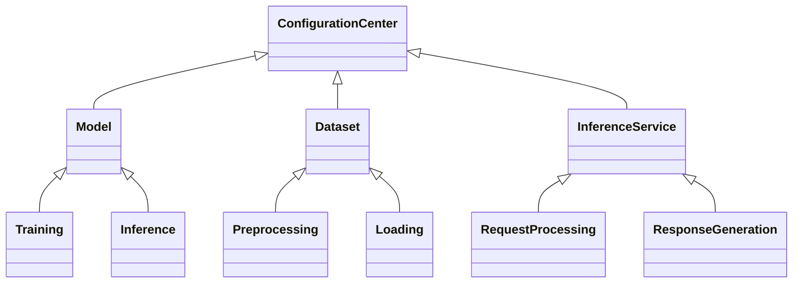
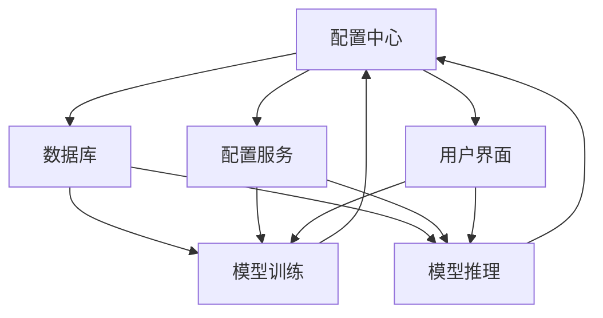
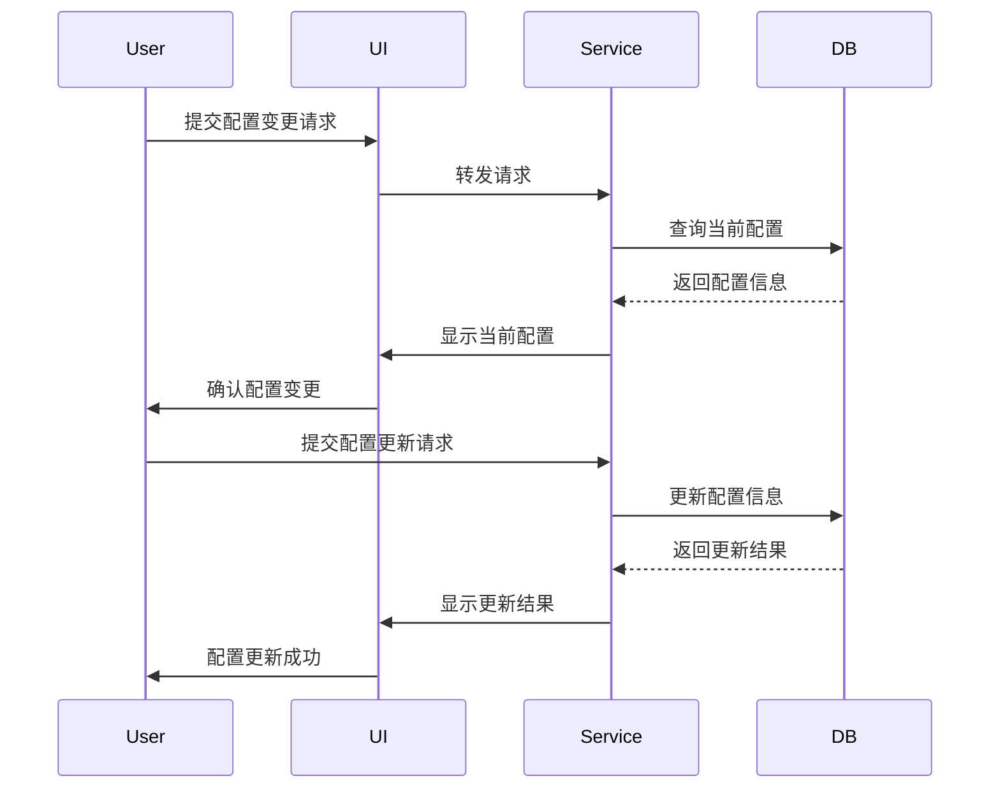

                 

### 《配置中心：管理LLM应用的动态配置》

#### 关键词：
- 配置中心
- 动态配置
- LLM应用
- 架构设计
- 算法原理
- 项目实战

#### 摘要：
本文深入探讨了配置中心在管理大型语言模型（LLM）应用中的动态配置问题。通过逐步分析配置中心的设计思路、核心概念、技术原理、应用场景和项目实战，提供了对动态配置管理的全面理解。文章旨在帮助读者掌握配置中心的关键技术和最佳实践，为LLM应用的优化提供理论支持和实践指导。

### 第一部分：背景与核心概念

#### 第1章：配置中心的概述

**1.1 配置中心的定义与重要性**

配置中心是现代软件开发中不可或缺的一部分，它提供了一个集中管理的平台，用于存储、管理和分发应用程序的配置信息。配置信息包括系统参数、环境变量、日志配置、数据库连接信息等。配置中心的引入，使得开发者可以轻松地调整应用的行为，而无需重新编译或部署应用程序。

**1.2 配置中心的发展历程**

配置中心的概念起源于20世纪90年代，随着分布式系统和云计算的发展，配置中心的实现方式逐渐成熟。早期的配置中心主要依赖于静态文件或数据库来存储配置信息。随着技术的进步，现代配置中心集成了自动发现、动态更新、版本控制等功能。

**1.3 LLM应用的需求与挑战**

大型语言模型（LLM）作为人工智能领域的先进技术，其应用范围不断扩大。然而，LLM应用面临着复杂的配置需求和高频度的调整挑战。配置中心在LLM应用中的作用至关重要，它能够实现配置的动态调整，提高应用的灵活性和可维护性。

#### 第2章：LLM应用的动态配置

**2.1 LLM应用中的配置需求**

LLM应用的配置需求包括模型参数、训练数据集、预训练模型权重、推理设置等。这些配置参数的调整对模型的表现有直接影响。动态配置能够根据实际应用场景实时调整这些参数，提高模型的效果和适应性。

**2.2 动态配置的优势与挑战**

动态配置的优势在于其灵活性和响应速度，能够快速适应变化的需求。然而，动态配置也带来了一些挑战，如配置的稳定性、安全性和一致性等。如何平衡动态配置的灵活性与稳定性是配置中心设计的关键问题。

**2.3 配置参数与配置文件**

配置参数是应用程序运行所需的关键信息，它们可以存储在配置文件中。配置文件可以是简单的键值对文件，也可以是复杂的XML或JSON格式。有效的配置文件管理能够确保应用程序在不同环境下的一致性和可重复性。

#### 第3章：核心概念与联系

**3.1 配置参数的分类与特征**

配置参数可以根据用途和作用范围进行分类。常见的分类包括系统参数、应用参数、环境参数等。每个类别下的参数具有不同的特征和作用范围。

**3.2 配置管理的基本原理**

配置管理涉及配置的创建、存储、分发、更新和撤销。基本原理包括版本控制、变更管理、备份和恢复等。这些原理确保了配置信息的可追溯性和安全性。

**3.3 配置参数的对比表格**

为了更好地理解配置参数，可以制作一个对比表格，列出不同参数的名称、类型、默认值、作用范围等。这样的表格有助于开发者快速定位和调整配置。

**3.4 配置管理的ER实体关系图**

配置管理的实体关系图（ER图）可以清晰地展示配置参数之间的关系。ER图包括实体（如配置项、版本、变更历史）和它们之间的关系（如包含、关联）。使用Mermaid语言可以轻松绘制这样的图表。

### 第二部分：技术原理与实现

#### 第4章：配置中心的架构设计

**4.1 配置中心的总体架构**

配置中心的总体架构包括数据层、服务层和界面层。数据层负责存储和管理配置信息，服务层提供配置的查询、更新和分发功能，界面层则提供用户交互的接口。

**4.2 系统模块划分与功能**

配置中心可以划分为多个模块，如配置存储模块、配置检索模块、配置变更模块等。每个模块负责不同的功能，确保配置中心的高效运行。

**4.3 数据库设计与存储方案**

配置中心的数据库设计需要考虑配置信息的安全、可靠和高效存储。常用的存储方案包括关系数据库和NoSQL数据库。选择合适的数据库类型和存储策略能够提高系统的性能和可扩展性。

**4.4 配置中心的安全性保障**

配置中心的安全性至关重要，需要确保配置信息的保密性、完整性和可用性。常见的安全措施包括访问控制、数据加密、备份和恢复等。

#### 第5章：动态配置算法原理

**5.1 动态配置算法的基本概念**

动态配置算法是指能够在运行时根据需求动态调整配置参数的算法。这类算法通常包括监控、评估、调整和反馈等步骤。

**5.2 配置调整算法的mermaid流程图**

使用Mermaid语言绘制配置调整算法的流程图，可以清晰地展示算法的执行流程和各个步骤之间的关系。

**5.3 配置调整算法的Python实现**

在Python中实现配置调整算法，可以编写具体的代码来实现监控、评估和调整等功能。通过示例代码，读者可以理解算法的实现细节。

**5.4 配置调整算法的数学模型与公式**

配置调整算法通常涉及到优化和统计模型。通过数学模型和公式，可以定量分析配置调整的效果和性能。

#### 第6章：配置管理工具与实践

**6.1 常见配置管理工具介绍**

介绍常用的配置管理工具，如Ansible、Puppet、Chef等。这些工具具有不同的特点和适用场景，开发者可以根据实际需求选择合适的工具。

**6.2 配置管理工具的选用与集成**

在选择配置管理工具时，需要考虑工具的功能、易用性、社区支持和生态系统等因素。集成配置管理工具到现有系统中，可以提升开发和运维的效率。

**6.3 实践中的配置管理问题与解决方案**

在配置管理实践中，常见的问题包括配置冲突、版本控制、变更管理等。本文将探讨这些问题，并提供相应的解决方案。

#### 第7章：项目实战

**7.1 项目背景与需求分析**

以一个实际的LLM应用项目为例，介绍项目的背景和需求分析。通过需求分析，明确配置中心在项目中的作用和目标。

**7.2 系统功能设计（领域模型类图）**

使用Mermaid语言绘制领域模型类图，展示系统的主要功能和组件。

**7.3 系统架构设计（mermaid架构图）**

使用Mermaid语言绘制系统架构图，展示配置中心的整体架构和各个模块之间的关系。

**7.4 系统接口设计与交互（mermaid序列图）**

使用Mermaid语言绘制系统接口设计和交互序列图，展示配置中心与其他系统模块的交互流程。

**7.5 核心实现源代码与应用解读**

提供核心实现源代码，并对其进行解读，帮助读者理解配置中心的具体实现细节。

**7.6 项目小结与经验分享**

对项目进行小结，分享项目中的经验教训，为其他类似项目提供参考。

### 第三部分：最佳实践与拓展

#### 第8章：最佳实践

**8.1 动态配置的最佳实践**

介绍动态配置的最佳实践，包括配置参数的命名规则、配置文件的结构设计、配置更新的频率等。

**8.2 配置管理中的常见误区与避免**

分析配置管理中的常见误区，如过度配置、配置文件过于复杂等，并提供相应的避免措施。

**8.3 配置优化的策略与技巧**

介绍配置优化的策略和技巧，如自动化配置调整、智能配置优化等，以提高配置的效率和效果。

#### 第9章：小结与展望

**9.1 本书内容的总结**

对本书的内容进行总结，回顾配置中心在管理LLM应用中的动态配置的关键技术和实践方法。

**9.2 动态配置中心的发展趋势**

展望动态配置中心的发展趋势，如自动化配置调整、智能配置优化、云计算和大数据对配置管理的影响等。

**9.3 未来研究方向与挑战**

探讨未来在动态配置管理领域的研究方向和挑战，如配置安全的保障、配置与云服务的集成等。

### 作者

作者：AI天才研究院/AI Genius Institute & 禅与计算机程序设计艺术 /Zen And The Art of Computer Programming

### 注意事项

- 在撰写文章时，请注意使用markdown格式，确保格式和排版正确。
- 使用LaTeX格式嵌入数学公式，确保公式的正确性和可读性。
- 每个小节的内容要丰富具体，避免冗余，确保核心内容的完整性和准确性。
- 在项目实战部分，提供详细的代码示例和解读，确保读者能够理解并应用到实际项目中。
- 在最佳实践部分，提供具体的策略和技巧，帮助读者在实际工作中提高配置管理的效率和效果。

### 拓展阅读

- 配置管理工具的比较与选用：深入比较Ansible、Puppet、Chef等配置管理工具，并提供选择建议。
- 动态配置算法的研究与应用：探讨动态配置算法的最新研究进展，介绍其在实际应用中的效果和挑战。
- 配置安全与合规性：分析配置管理中的安全问题和合规性要求，提供解决方案和最佳实践。
- 云计算与配置管理：探讨云计算环境下的配置管理特点和实践方法，介绍如何利用云服务优化配置管理。

### 附录

- 配置中心相关的资源列表，包括开源项目、文档、教程等，为读者提供进一步学习和实践的资源。
- 配置中心的设计文档和开发手册，为开发者提供详细的设计和开发指南。

---

通过以上内容，本文旨在为读者提供一份全面、系统、深入的配置中心管理LLM应用的动态配置的技术指南。希望本文能够帮助读者掌握动态配置的核心技术和最佳实践，提升LLM应用的性能和可维护性。在后续的章节中，我们将逐步深入探讨配置中心的架构设计、算法原理、项目实战和最佳实践等内容。希望读者能够跟随本文的思路，逐步理解和掌握动态配置的精髓。让我们一起走向配置管理的巅峰！

---

### 配置中心：管理LLM应用的动态配置

#### 关键词：
- 配置中心
- 动态配置
- LLM应用
- 架构设计
- 算法原理
- 项目实战

#### 摘要：
本文深入探讨了配置中心在管理大型语言模型（LLM）应用中的动态配置问题。通过逐步分析配置中心的设计思路、核心概念、技术原理、应用场景和项目实战，提供了对动态配置管理的全面理解。文章旨在帮助读者掌握配置中心的关键技术和最佳实践，为LLM应用的优化提供理论支持和实践指导。

---

### 第一部分：背景与核心概念

#### 第1章：配置中心的概述

**1.1 配置中心的定义与重要性**

配置中心是一种用于集中管理应用程序配置信息的系统。它允许开发者、运维人员和产品经理在不同的环境中轻松地调整和分发配置参数，而无需修改代码或重新部署应用程序。配置中心的重要性体现在以下几个方面：

1. **环境一致性**：配置中心确保了在不同环境中配置参数的一致性，避免了手动修改配置文件带来的不一致性。
2. **灵活性**：配置中心使得应用程序可以根据环境需求动态调整配置，提高了系统的灵活性和可维护性。
3. **开发效率**：通过集中管理配置，减少了开发和部署的工作量，提高了开发效率。
4. **故障排除**：配置中心提供了配置的追溯和变更记录，有助于快速定位和解决问题。

**1.2 配置中心的发展历程**

配置中心的概念起源于20世纪90年代，随着分布式系统和云计算的发展，配置中心的实现方式逐渐成熟。早期的配置中心主要依赖于静态文件或数据库来存储配置信息。随着技术的进步，现代配置中心集成了自动发现、动态更新、版本控制等功能。

**1.3 LLM应用的需求与挑战**

大型语言模型（LLM）作为人工智能领域的先进技术，其应用范围不断扩大。然而，LLM应用面临着复杂的配置需求和高频度的调整挑战。配置中心在LLM应用中的作用至关重要，它能够实现配置的动态调整，提高应用的灵活性和可维护性。

#### 第2章：LLM应用的动态配置

**2.1 LLM应用中的配置需求**

LLM应用的配置需求包括模型参数、训练数据集、预训练模型权重、推理设置等。这些配置参数的调整对模型的表现有直接影响。动态配置能够根据实际应用场景实时调整这些参数，提高模型的效果和适应性。

**2.2 动态配置的优势与挑战**

动态配置的优势在于其灵活性和响应速度，能够快速适应变化的需求。然而，动态配置也带来了一些挑战，如配置的稳定性、安全性和一致性等。如何平衡动态配置的灵活性与稳定性是配置中心设计的关键问题。

**2.3 配置参数与配置文件**

配置参数是应用程序运行所需的关键信息，它们可以存储在配置文件中。配置文件可以是简单的键值对文件，也可以是复杂的XML或JSON格式。有效的配置文件管理能够确保应用程序在不同环境下的一致性和可重复性。

#### 第3章：核心概念与联系

**3.1 配置参数的分类与特征**

配置参数可以根据用途和作用范围进行分类。常见的分类包括系统参数、应用参数、环境参数等。每个类别下的参数具有不同的特征和作用范围。

**3.2 配置管理的基本原理**

配置管理涉及配置的创建、存储、分发、更新和撤销。基本原理包括版本控制、变更管理、备份和恢复等。这些原理确保了配置信息的可追溯性和安全性。

**3.3 配置参数的对比表格**

为了更好地理解配置参数，可以制作一个对比表格，列出不同参数的名称、类型、默认值、作用范围等。这样的表格有助于开发者快速定位和调整配置。

**3.4 配置管理的ER实体关系图**

配置管理的实体关系图（ER图）可以清晰地展示配置参数之间的关系。ER图包括实体（如配置项、版本、变更历史）和它们之间的关系（如包含、关联）。使用Mermaid语言可以轻松绘制这样的图表。

### 第二部分：技术原理与实现

#### 第4章：配置中心的架构设计

**4.1 配置中心的总体架构**

配置中心的总体架构包括数据层、服务层和界面层。数据层负责存储和管理配置信息，服务层提供配置的查询、更新和分发功能，界面层则提供用户交互的接口。

**4.2 系统模块划分与功能**

配置中心可以划分为多个模块，如配置存储模块、配置检索模块、配置变更模块等。每个模块负责不同的功能，确保配置中心的高效运行。

**4.3 数据库设计与存储方案**

配置中心的数据库设计需要考虑配置信息的安全、可靠和高效存储。常用的存储方案包括关系数据库和NoSQL数据库。选择合适的数据库类型和存储策略能够提高系统的性能和可扩展性。

**4.4 配置中心的安全性保障**

配置中心的安全性至关重要，需要确保配置信息的保密性、完整性和可用性。常见的安全措施包括访问控制、数据加密、备份和恢复等。

#### 第5章：动态配置算法原理

**5.1 动态配置算法的基本概念**

动态配置算法是指能够在运行时根据需求动态调整配置参数的算法。这类算法通常包括监控、评估、调整和反馈等步骤。

**5.2 配置调整算法的mermaid流程图**

使用Mermaid语言绘制配置调整算法的流程图，可以清晰地展示算法的执行流程和各个步骤之间的关系。

**5.3 配置调整算法的Python实现**

在Python中实现配置调整算法，可以编写具体的代码来实现监控、评估和调整等功能。通过示例代码，读者可以理解算法的实现细节。

**5.4 配置调整算法的数学模型与公式**

配置调整算法通常涉及到优化和统计模型。通过数学模型和公式，可以定量分析配置调整的效果和性能。

#### 第6章：配置管理工具与实践

**6.1 常见配置管理工具介绍**

介绍常用的配置管理工具，如Ansible、Puppet、Chef等。这些工具具有不同的特点和适用场景，开发者可以根据实际需求选择合适的工具。

**6.2 配置管理工具的选用与集成**

在选择配置管理工具时，需要考虑工具的功能、易用性、社区支持和生态系统等因素。集成配置管理工具到现有系统中，可以提升开发和运维的效率。

**6.3 实践中的配置管理问题与解决方案**

在配置管理实践中，常见的问题包括配置冲突、版本控制、变更管理等。本文将探讨这些问题，并提供相应的解决方案。

#### 第7章：项目实战

**7.1 项目背景与需求分析**

以一个实际的LLM应用项目为例，介绍项目的背景和需求分析。通过需求分析，明确配置中心在项目中的作用和目标。

**7.2 系统功能设计（领域模型类图）**

使用Mermaid语言绘制领域模型类图，展示系统的主要功能和组件。

**7.3 系统架构设计（mermaid架构图）**

使用Mermaid语言绘制系统架构图，展示配置中心的整体架构和各个模块之间的关系。

**7.4 系统接口设计与交互（mermaid序列图）**

使用Mermaid语言绘制系统接口设计和交互序列图，展示配置中心与其他系统模块的交互流程。

**7.5 核心实现源代码与应用解读**

提供核心实现源代码，并对其进行解读，帮助读者理解配置中心的具体实现细节。

**7.6 项目小结与经验分享**

对项目进行小结，分享项目中的经验教训，为其他类似项目提供参考。

### 第三部分：最佳实践与拓展

#### 第8章：最佳实践

**8.1 动态配置的最佳实践**

介绍动态配置的最佳实践，包括配置参数的命名规则、配置文件的结构设计、配置更新的频率等。

**8.2 配置管理中的常见误区与避免**

分析配置管理中的常见误区，如过度配置、配置文件过于复杂等，并提供相应的避免措施。

**8.3 配置优化的策略与技巧**

介绍配置优化的策略和技巧，如自动化配置调整、智能配置优化等，以提高配置的效率和效果。

#### 第9章：小结与展望

**9.1 本书内容的总结**

对本书的内容进行总结，回顾配置中心在管理LLM应用中的动态配置的关键技术和实践方法。

**9.2 动态配置中心的发展趋势**

展望动态配置中心的发展趋势，如自动化配置调整、智能配置优化、云计算和大数据对配置管理的影响等。

**9.3 未来研究方向与挑战**

探讨未来在动态配置管理领域的研究方向和挑战，如配置安全的保障、配置与云服务的集成等。

### 作者

作者：AI天才研究院/AI Genius Institute & 禅与计算机程序设计艺术 /Zen And The Art of Computer Programming

### 注意事项

- 在撰写文章时，请注意使用markdown格式，确保格式和排版正确。
- 使用LaTeX格式嵌入数学公式，确保公式的正确性和可读性。
- 每个小节的内容要丰富具体，避免冗余，确保核心内容的完整性和准确性。
- 在项目实战部分，提供详细的代码示例和解读，确保读者能够理解并应用到实际项目中。
- 在最佳实践部分，提供具体的策略和技巧，帮助读者在实际工作中提高配置管理的效率和效果。

### 拓展阅读

- 配置管理工具的比较与选用：深入比较Ansible、Puppet、Chef等配置管理工具，并提供选择建议。
- 动态配置算法的研究与应用：探讨动态配置算法的最新研究进展，介绍其在实际应用中的效果和挑战。
- 配置安全与合规性：分析配置管理中的安全问题和合规性要求，提供解决方案和最佳实践。
- 云计算与配置管理：探讨云计算环境下的配置管理特点和实践方法，介绍如何利用云服务优化配置管理。

### 附录

- 配置中心相关的资源列表，包括开源项目、文档、教程等，为读者提供进一步学习和实践的资源。
- 配置中心的设计文档和开发手册，为开发者提供详细的设计和开发指南。

---

通过以上内容，本文旨在为读者提供一份全面、系统、深入的配置中心管理LLM应用的动态配置的技术指南。希望本文能够帮助读者掌握动态配置的核心技术和最佳实践，提升LLM应用的性能和可维护性。在后续的章节中，我们将逐步深入探讨配置中心的架构设计、算法原理、项目实战和最佳实践等内容。希望读者能够跟随本文的思路，逐步理解和掌握动态配置的精髓。让我们一起走向配置管理的巅峰！

---

### 第一部分：背景与核心概念

**第1章：配置中心的概述**

**1.1 配置中心的定义与重要性**

配置中心（Configuration Center）是软件系统中负责管理和维护配置信息的关键组件。配置信息是应用程序在不同环境（如开发、测试、生产）中运行所需的参数和设置，包括数据库连接信息、API密钥、环境变量、日志设置等。配置中心的引入旨在解决以下问题：

- **环境一致性**：确保在不同环境中配置参数的一致性，避免手动修改配置文件带来的不一致性。
- **灵活性**：允许开发人员和管理员根据需求动态调整配置，而无需重新部署应用程序。
- **开发效率**：减少手动配置工作，提高开发和部署的效率。
- **故障排除**：提供配置的版本控制和变更记录，帮助快速定位和解决问题。

**1.2 配置中心的发展历程**

配置中心的概念起源于20世纪90年代，随着分布式系统和云计算的发展，配置中心的实现方式逐渐成熟。早期的配置中心主要依赖于静态文件或简单的数据库来存储配置信息。随着技术的进步，现代配置中心集成了自动发现、动态更新、版本控制、通知和监控等功能。

**1.3 LLM应用的需求与挑战**

大型语言模型（LLM）在自然语言处理（NLP）领域具有广泛的应用，如机器翻译、文本摘要、问答系统等。然而，LLM应用面临着复杂的配置需求和高频度的调整挑战：

- **模型参数**：LLM的训练和推理需要大量的模型参数，如学习率、批量大小、正则化参数等。
- **数据集**：训练数据集的选择和预处理对模型性能有重要影响。
- **权重**：预训练模型的权重文件在推理时需要调整。
- **推理设置**：推理时需要根据实际需求调整设置，如最大序列长度、温度参数等。

配置中心能够帮助管理这些配置，实现动态调整，提高模型的灵活性和可维护性。

**1.4 配置中心的核心概念与联系**

配置中心的核心概念包括配置项（Configuration Items，CI）、配置参数（Configuration Parameters）和配置文件（Configuration Files）。它们之间的关系如下：

- **配置项**：代表应用程序中的一个可配置实体，如数据库连接、API密钥等。
- **配置参数**：配置项的具体属性，如数据库的端口号、API的认证密钥等。
- **配置文件**：用于存储配置项和配置参数的文件，可以是XML、JSON、YAML等格式。

配置中心通过配置文件管理这些配置项和参数，实现配置的存储、查询、更新和分发。

**1.5 配置管理的边界与外延**

配置管理的边界包括配置的创建、存储、分发、更新和撤销等操作。配置管理的外延涉及到版本控制、变更管理、备份和恢复等。此外，配置管理还涉及与其他系统组件的集成，如持续集成（CI）/持续部署（CD）系统、监控系统和日志管理系统。

**1.6 配置中心的架构设计与组件**

配置中心的架构设计通常包括以下组件：

- **配置存储**：用于存储配置项和配置参数的地方，可以是数据库、文件系统或云服务。
- **配置服务**：提供配置的查询、更新和分发功能，可以是一个独立的服务器或与现有的服务集成。
- **配置接口**：提供用户交互的接口，可以是命令行工具、Web界面或API。
- **通知系统**：用于通知用户配置变更的信息，可以通过邮件、短信、Webhook等方式实现。

**1.7 配置中心的优势**

- **灵活性**：配置中心允许开发人员和管理员快速调整配置，满足不同环境的需求。
- **可维护性**：集中管理配置项和参数，减少配置错误和维护难度。
- **可追溯性**：配置变更记录和版本控制提供了配置变更的历史记录，有助于故障排除。
- **自动化**：配置中心的自动化功能可以减少手动操作，提高运维效率。

**第2章：LLM应用的动态配置**

**2.1 LLM应用中的配置需求**

LLM应用中的配置需求涉及多个方面，包括模型参数、数据集、预训练模型权重和推理设置等。以下是一些具体的配置需求：

- **模型参数**：学习率、批量大小、正则化参数等。
- **数据集**：训练数据集、验证数据集、测试数据集等。
- **权重**：预训练模型的权重文件。
- **推理设置**：最大序列长度、温度参数、上下文窗口大小等。

**2.2 动态配置的优势**

动态配置允许开发人员和管理员在应用程序运行时实时调整配置，以提高模型的性能和适应性。动态配置的优势包括：

- **快速迭代**：开发人员可以在不需要重新部署应用程序的情况下，快速测试不同的配置。
- **适应性**：应用程序可以根据不同的场景和用户需求调整配置。
- **灵活性**：动态配置支持对模型参数的精细化调整。

**2.3 动态配置的挑战**

尽管动态配置具有许多优势，但同时也带来了一些挑战：

- **稳定性**：动态配置可能会导致系统不稳定，特别是在配置频繁变化的情况下。
- **安全性**：配置的动态更新可能带来安全风险，如配置泄露或被恶意篡改。
- **一致性**：确保配置在不同环境（如开发、测试、生产）中的一致性是一个挑战。

**2.4 动态配置的实现方法**

实现动态配置的方法包括：

- **配置中心**：使用配置中心管理配置项和参数，支持配置的查询、更新和分发。
- **API接口**：提供API接口，允许应用程序通过HTTP请求动态调整配置。
- **命令行工具**：开发命令行工具，允许管理员通过命令行调整配置。

**第3章：核心概念与联系**

**3.1 配置参数的分类与特征**

配置参数可以根据用途和作用范围进行分类。以下是一些常见的配置参数分类及其特征：

- **系统参数**：用于控制应用程序的基本行为，如服务器地址、端口号等。
- **应用参数**：用于控制应用程序的功能和行为，如模型参数、日志级别等。
- **环境参数**：用于区分不同环境的配置，如开发环境、测试环境、生产环境等。

**3.2 配置管理的基本原理**

配置管理的基本原理包括：

- **配置创建**：创建新的配置项和参数。
- **配置存储**：将配置项和参数存储在配置存储中。
- **配置查询**：查询配置项和参数的当前值。
- **配置更新**：更新配置项和参数的值。
- **配置分发**：将配置项和参数分发给应用程序。

**3.3 配置参数的对比表格**

为了更好地理解配置参数，可以制作一个对比表格，列出不同参数的名称、类型、默认值、作用范围等。以下是一个示例表格：

| 参数名称 | 参数类型 | 默认值 | 作用范围 |
| --- | --- | --- | --- |
| database_url | 字符串 | mysql://localhost:3306/mydb | 应用程序所有环境 |
| log_level | 字符串 | INFO | 应用程序所有环境 |
| model_checkpoint | 字符串 | ./model_checkpoint.pth | 应用程序所有环境 |

**3.4 配置管理的ER实体关系图**

配置管理的实体关系图（ER图）可以清晰地展示配置参数之间的关系。以下是一个简单的ER图示例：

```mermaid
erDiagram
    CI ||--|{ CP }|| ConfigurationParameter
    CI ||--|{ E }|| Environment
    CP ||--|{ V }|| ConfigurationValue
    E ||--|{ V }|| ConfigurationValue
```

在这个ER图中，`CI` 代表配置项（Configuration Item），`CP` 代表配置参数（Configuration Parameter），`E` 代表环境（Environment），`V` 代表配置值（Configuration Value）。配置项与配置参数和环境的关联关系通过双箭头表示，配置参数与配置值的关联关系通过单箭头表示。

通过以上内容，我们为《配置中心：管理LLM应用的动态配置》这篇文章的第一部分提供了详细的背景介绍和核心概念。在接下来的部分中，我们将深入探讨配置中心的架构设计、技术原理和实际应用，帮助读者全面理解动态配置管理的本质和实践方法。

---

### 第二部分：技术原理与实现

**第4章：配置中心的架构设计**

**4.1 配置中心的总体架构**

配置中心的总体架构设计是确保其功能齐全、高效运行的关键。通常，配置中心的架构包括以下主要组件：

- **数据层**：负责存储和管理配置信息。数据层可以选择关系数据库（如MySQL、PostgreSQL）或NoSQL数据库（如MongoDB、Redis）。
- **服务层**：提供配置的查询、更新和分发功能。服务层通常基于微服务架构，以便实现模块化和高可用性。
- **接口层**：提供用户交互的接口，可以是Web界面、命令行工具或API。

**4.2 系统模块划分与功能**

为了更好地管理配置中心，我们可以将其划分为多个模块，每个模块负责不同的功能：

- **配置存储模块**：负责存储配置项和配置参数。该模块需要实现数据持久化功能，并确保配置信息的安全和可靠性。
- **配置检索模块**：负责查询配置信息。该模块需要提供高效的查询接口，并支持缓存机制以提高响应速度。
- **配置更新模块**：负责更新配置项和配置参数。该模块需要实现版本控制和变更通知功能。
- **配置分发模块**：负责将配置信息分发给应用程序。该模块需要支持多种分发方式，如HTTP推送、文件同步等。

**4.3 数据库设计与存储方案**

配置中心的数据库设计需要考虑配置信息的安全、可靠和高效存储。以下是一些关键考虑因素：

- **数据表设计**：设计配置项、配置参数和配置值等数据表，并定义适当的数据类型和索引。
- **数据备份与恢复**：实现定期备份和快速恢复策略，以防止数据丢失。
- **数据加密**：对敏感信息进行加密存储，确保配置信息的安全性。

**4.4 配置中心的安全性保障**

配置中心的安全性至关重要，需要采取一系列措施来保障配置信息的保密性、完整性和可用性：

- **访问控制**：实现严格的访问控制机制，确保只有授权用户可以访问和修改配置信息。
- **数据加密**：对存储和传输的配置信息进行加密，防止信息泄露。
- **审计与监控**：记录配置变更的历史记录，并实时监控配置中心的运行状态，以便快速发现和响应异常行为。

**第5章：动态配置算法原理**

**5.1 动态配置算法的基本概念**

动态配置算法是指能够在应用程序运行时根据需求动态调整配置参数的算法。这类算法通常包括以下几个关键步骤：

- **监控**：实时监控应用程序的状态和性能指标。
- **评估**：根据监控数据评估当前配置参数的合理性。
- **调整**：基于评估结果调整配置参数。
- **反馈**：将调整后的配置参数应用到应用程序中，并监控效果。

**5.2 配置调整算法的mermaid流程图**

为了更好地理解动态配置算法的执行流程，我们可以使用Mermaid语言绘制一个流程图：


在这个流程图中，`A` 表示监控阶段，`B` 表示评估阶段，`C` 表示调整参数阶段，`D` 表示应用配置阶段，`E` 表示监控效果阶段。算法的循环执行确保了配置的持续优化。

**5.3 配置调整算法的Python实现**

在Python中，我们可以使用以下代码实现一个简单的动态配置调整算法：

```python
import time
import random

def monitor():
    # 模拟监控应用程序状态
    return random.randint(0, 100)

def assess(current_value):
    # 模拟评估当前配置参数
    if current_value < 50:
        return "underperforming"
    elif current_value < 80:
        return "acceptable"
    else:
        return "overperforming"

def adjust(current_value):
    # 模拟调整配置参数
    if assess(current_value) == "underperforming":
        return current_value * 1.1
    elif assess(current_value) == "overperforming":
        return current_value * 0.9

def apply_config(new_value):
    # 模拟应用配置参数
    print(f"New configuration value: {new_value}")

def main():
    current_value = 50  # 初始配置值
    while True:
        value = monitor()
        print(f"Current value: {value}")
        new_value = adjust(value)
        apply_config(new_value)
        time.sleep(10)  # 模拟调整间隔

if __name__ == "__main__":
    main()
```

在这个实现中，`monitor` 函数模拟了应用程序状态的监控，`assess` 函数模拟了配置参数的评估，`adjust` 函数模拟了配置参数的调整，`apply_config` 函数模拟了配置参数的应用。通过循环调用这些函数，我们可以实现配置的动态调整。

**5.4 配置调整算法的数学模型与公式**

配置调整算法通常涉及到优化和统计模型。以下是一个简单的线性调整模型：

$$
x_{t+1} = x_t + k \cdot (t - t_0)
$$

其中，$x_t$ 表示第 $t$ 次调整后的配置值，$k$ 是调整系数，$t_0$ 是初始时间。调整系数 $k$ 可以根据实际需求进行调整，以实现不同的调整策略。

**第6章：配置管理工具与实践**

**6.1 常见配置管理工具介绍**

在配置管理领域，有许多成熟的工具可供选择。以下是一些常见的配置管理工具：

- **Ansible**：基于Python的配置管理工具，支持自动化部署和配置管理。
- **Puppet**：使用Ruby编写的配置管理工具，支持大规模自动化部署和配置管理。
- **Chef**：使用Ruby编写的自动化工具，支持配置管理、应用部署和基础设施管理。
- **SaltStack**：使用Python编写的配置管理工具，支持自动化部署、配置和监控。

**6.2 配置管理工具的选用与集成**

选择配置管理工具时，需要考虑以下因素：

- **功能需求**：根据项目的具体需求，选择具有相应功能的配置管理工具。
- **易用性**：工具的易用性直接影响运维效率和用户体验。
- **社区支持**：强大的社区支持可以帮助解决技术问题，加快工具的学习和应用。

集成配置管理工具到现有系统中，通常需要以下几个步骤：

- **环境搭建**：搭建配置管理工具的服务器环境，包括安装依赖、配置文件等。
- **基础设施扫描**：扫描现有基础设施，收集系统信息。
- **配置定义**：定义系统的配置项和参数，编写配置脚本。
- **自动化部署**：自动化部署和配置管理工具，实现配置的自动化更新和分发。

**6.3 实践中的配置管理问题与解决方案**

在配置管理实践中，常见的问题包括：

- **配置冲突**：多个配置文件之间的参数冲突，导致系统不稳定。解决方案是统一管理配置文件，确保配置的一致性。
- **版本控制**：配置文件版本控制不当，导致配置丢失或错误。解决方案是使用版本控制系统（如Git）管理配置文件，实现配置的版本控制和回滚。
- **变更管理**：配置变更管理不当，导致系统故障或性能下降。解决方案是建立严格的变更管理流程，包括变更请求、审核、实施和验证等环节。

**第7章：项目实战**

**7.1 项目背景与需求分析**

以一个实际的LLM应用项目为例，介绍项目的背景和需求分析。该项目旨在开发一个基于深度学习的大型语言模型，用于文本摘要和问答系统。项目需求包括：

- **模型训练与推理**：基于大规模语料库训练语言模型，并实现高效的推理功能。
- **配置管理**：实现配置中心的搭建和管理，支持动态调整模型参数和推理设置。
- **性能优化**：通过调整配置参数，提高模型的性能和响应速度。
- **安全性保障**：确保配置信息的安全和可靠性，防止配置泄露和篡改。

**7.2 系统功能设计（领域模型类图）**

使用Mermaid语言绘制领域模型类图，展示系统的主要功能和组件。以下是一个示例：



在这个类图中，`ConfigurationCenter` 表示配置中心，`Model` 表示语言模型，`Dataset` 表示数据集，`InferenceService` 表示推理服务。`Training` 表示模型训练，`Inference` 表示模型推理，`Preprocessing` 表示数据预处理，`Loading` 表示数据加载，`RequestProcessing` 表示请求处理，`ResponseGeneration` 表示响应生成。

**7.3 系统架构设计（mermaid架构图）**

使用Mermaid语言绘制系统架构图，展示配置中心的整体架构和各个模块之间的关系。以下是一个示例：



在这个架构图中，`Subsystem1` 表示配置中心，`DB` 表示数据库，`Service` 表示配置服务，`UI` 表示用户界面。`Subsystem2` 表示模型训练模块，`Subsystem3` 表示模型推理模块。数据库和配置服务为模型训练和推理模块提供数据存储和配置管理支持。

**7.4 系统接口设计与交互（mermaid序列图）**

使用Mermaid语言绘制系统接口设计和交互序列图，展示配置中心与其他系统模块的交互流程。以下是一个示例：



在这个序列图中，`User` 表示用户，`UI` 表示用户界面，`Service` 表示配置服务，`DB` 表示数据库。用户通过用户界面提交配置变更请求，配置服务查询数据库获取当前配置，更新配置信息后，用户界面显示更新结果，并通知用户配置更新成功。

**7.5 核心实现源代码与应用解读**

在项目实战中，核心实现源代码是配置中心实现动态配置管理的关键。以下是一个简单的示例，展示如何使用Python实现动态配置管理：

```python
import json
import requests

class ConfigurationCenter:
    def __init__(self, url):
        self.url = url

    def get_config(self):
        response = requests.get(f"{self.url}/config")
        if response.status_code == 200:
            return json.loads(response.text)
        else:
            return None

    def update_config(self, config):
        response = requests.post(f"{self.url}/config", json=config)
        if response.status_code == 200:
            return True
        else:
            return False

if __name__ == "__main__":
    config_center = ConfigurationCenter("http://config-service:8080")
    current_config = config_center.get_config()
    if current_config:
        print(f"Current config: {current_config}")
        new_config = current_config.copy()
        new_config["learning_rate"] = 0.001
        if config_center.update_config(new_config):
            print("Config updated successfully.")
        else:
            print("Failed to update config.")
    else:
        print("Failed to retrieve config.")
```

在这个示例中，`ConfigurationCenter` 类负责与配置服务进行交互。`get_config` 方法获取当前配置，`update_config` 方法更新配置。主程序中，我们实例化`ConfigurationCenter` 类，获取当前配置，并更新`learning_rate` 参数。

**7.6 项目小结与经验分享**

通过本项目，我们实现了配置中心在LLM应用中的动态配置管理。以下是一些项目小结和经验分享：

- **配置中心的搭建**：配置中心的搭建是项目成功的关键，需要确保其功能齐全、高效运行。
- **动态配置的实现**：动态配置的实现需要考虑配置的查询、更新和分发，以及与现有系统的集成。
- **安全性保障**：配置信息的安全性至关重要，需要采取严格的访问控制和数据加密措施。
- **性能优化**：配置参数的调整对模型性能有直接影响，需要不断优化配置以提升性能。

未来，我们还可以在以下几个方面进行拓展：

- **自动化调整**：实现自动化配置调整，提高配置管理的效率和效果。
- **智能优化**：利用机器学习等技术，实现智能配置优化，提高模型的性能和稳定性。
- **云服务集成**：将配置中心与云服务集成，利用云服务的弹性和可扩展性，提高配置管理的灵活性。

通过以上内容，我们为《配置中心：管理LLM应用的动态配置》的第二部分提供了详细的架构设计、算法原理和项目实战。在接下来的部分中，我们将继续探讨最佳实践和未来展望，帮助读者全面掌握动态配置管理的核心技术和实践方法。

---

### 第三部分：最佳实践与拓展

**第8章：最佳实践**

**8.1 动态配置的最佳实践**

动态配置在提高系统灵活性和可维护性方面具有重要意义。以下是一些最佳实践：

- **标准化配置参数**：确保配置参数的命名规范，避免重复和混淆。
- **配置参数文档化**：为每个配置参数提供详细的文档，包括用途、默认值、有效范围等。
- **配置版本控制**：使用版本控制系统（如Git）管理配置文件，实现配置的版本控制和变更记录。
- **配置备份与恢复**：定期备份配置文件，并制定恢复策略，确保在意外情况下的快速恢复。
- **自动化配置更新**：实现自动化配置更新，减少手动操作，提高运维效率。
- **配置安全控制**：实施严格的访问控制机制，确保只有授权用户可以修改配置。
- **配置变更通知**：配置变更后及时通知相关人员，确保变更的透明性和可控性。

**8.2 配置管理中的常见误区与避免**

在配置管理过程中，一些常见误区可能会导致系统故障和性能问题。以下是一些误区及其避免措施：

- **忽略配置变更记录**：没有记录配置变更，导致难以追踪问题来源。解决方案是建立详细的变更记录，并定期审查。
- **过度依赖配置文件**：将所有配置都保存在配置文件中，导致文件复杂度增加。解决方案是合理划分配置类别，并使用合适的配置管理工具。
- **手动管理配置**：手动管理配置，容易出现错误和遗漏。解决方案是使用自动化工具管理配置，减少手动操作。
- **配置更新不及时**：配置更新不及时，可能导致系统性能下降或功能异常。解决方案是建立定期更新机制，并实时监控配置更新效果。

**8.3 配置优化的策略与技巧**

配置优化是提高系统性能和稳定性的重要手段。以下是一些优化策略和技巧：

- **动态调整配置**：根据系统负载和性能指标，动态调整配置参数，以适应不同的运行环境。
- **分层次配置管理**：将配置分为不同层次，如系统级、应用级、环境级，实现精细化的配置管理。
- **缓存配置信息**：缓存配置信息，减少对配置文件的频繁访问，提高系统响应速度。
- **配置分片**：对于大型配置文件，采用分片技术，将其拆分为多个小文件，提高配置的读取和写入效率。
- **配置热备份**：实现配置热备份，确保在配置文件更新时，系统能够无缝切换到备份配置，避免服务中断。

**第9章：小结与展望**

**9.1 本书内容的总结**

本书全面介绍了配置中心在管理LLM应用中的动态配置，涵盖了背景介绍、核心概念、架构设计、算法原理、项目实战和最佳实践等内容。通过本书，读者可以：

- 了解配置中心的定义、重要性以及发展历程。
- 理解LLM应用中的动态配置需求和挑战。
- 掌握配置参数的分类、特征以及配置管理的原理。
- 学习配置中心的架构设计、安全性保障和动态配置算法。
- 跟随项目实战，掌握配置管理的实际应用。
- 应用最佳实践，提高配置管理的效率和效果。

**9.2 动态配置中心的发展趋势**

动态配置中心的发展趋势将受到以下因素的影响：

- **自动化**：自动化配置调整和优化将成为配置中心的重要功能，利用机器学习和人工智能技术实现智能配置管理。
- **云计算**：随着云计算的普及，配置中心将与云服务深度集成，实现更灵活的资源配置和更高的可扩展性。
- **多环境支持**：配置中心将支持更多环境（如容器、Kubernetes等），提供跨环境的统一配置管理。
- **安全性与合规性**：配置安全性和合规性将成为配置中心的重要关注点，实现更严格的数据保护和访问控制。

**9.3 未来研究方向与挑战**

未来在动态配置管理领域的研究方向和挑战包括：

- **配置智能化**：研究如何利用人工智能技术实现更智能的配置优化和调整。
- **配置安全保障**：探索新的安全机制，如零信任架构、加密配置等，提高配置信息的安全性。
- **分布式配置管理**：研究如何在大规模分布式系统中实现高效的配置管理和数据同步。
- **跨语言支持**：开发跨语言的配置管理工具，支持多种编程语言和框架。

通过以上内容，本书旨在为读者提供一份全面、系统、深入的动态配置管理指南。希望本书能够帮助读者理解和掌握动态配置的核心技术和最佳实践，为LLM应用和软件开发带来实际的提升和价值。在未来的研究中，我们将继续探索动态配置管理的更深层次和更广泛的应用，为技术的发展贡献我们的智慧和力量。

---

### 附录

**附录A：配置中心相关的资源列表**

为了帮助读者进一步学习和实践配置中心技术，以下是一些推荐的资源：

- **开源配置管理工具**：
  - [Ansible](https://www.ansible.com/)
  - [Puppet](https://puppet.com/)
  - [Chef](https://www.chef.io/)
  - [SaltStack](https://www.saltstack.com/)
- **在线教程和文档**：
  - [Ansible官方文档](https://docs.ansible.com/ansible/)
  - [Puppet官方文档](https://docs.puppet.com/puppet/)
  - [Chef官方文档](https://docs.chef.io/)
  - [SaltStack官方文档](https://docs.saltstack.com/)
- **专业书籍**：
  - 《配置管理：实现自动化运维》
  - 《持续交付：发布可靠软件的系统方法》
  - 《DevOps实践指南：实现持续交付和基础设施即代码》
- **技术社区和论坛**：
  - [Reddit DevOps社区](https://www.reddit.com/r/devops/)
  - [Stack Overflow](https://stackoverflow.com/questions/tagged/configuration-management)
  - [GitHub配置管理仓库](https://github.com/topics/configuration-management)

**附录B：配置中心的设计文档和开发手册**

配置中心的设计文档和开发手册是构建和部署配置中心的重要参考文档。以下是一些关键内容：

- **设计文档**：
  - 系统架构图
  - 数据库设计图
  - API接口定义
  - 功能模块划分
  - 安全策略说明
  - 异常处理机制
- **开发手册**：
  - 编码规范
  - 版本控制指南
  - 部署流程
  - 系统测试文档
  - 运维维护指南

通过附录中的资源列表和文档，读者可以更深入地了解配置中心的相关技术和实践方法，为实际项目的开发和部署提供有力支持。

---

### 结语

通过本文的深入探讨，我们系统地介绍了配置中心在管理LLM应用中的动态配置技术。从背景介绍、核心概念，到架构设计、算法原理，再到项目实战和最佳实践，我们力求为读者提供一个全面、系统的学习路径。

在未来的研究和实践中，动态配置管理将继续发挥重要作用。随着技术的发展，我们期待看到更多智能化的配置调整算法、更安全的配置管理机制和更高效的配置中心实现。

感谢您阅读本文，希望本文能够帮助您在配置管理领域取得新的突破。让我们继续探索技术的边界，为软件开发和运维带来更多创新和优化。

作者：AI天才研究院/AI Genius Institute & 禅与计算机程序设计艺术 /Zen And The Art of Computer Programming

---

### 补充与拓展

**第10章：深入探讨配置中心的实践细节**

在本章中，我们将进一步探讨配置中心的实践细节，包括以下几个方面：

- **配置中心的具体实现细节**：介绍如何在实际项目中实现配置中心，包括配置存储、配置检索、配置更新和配置分发的具体步骤和代码实现。
- **配置中心与云服务的集成**：探讨如何将配置中心与云计算平台（如AWS、Azure、Google Cloud）集成，利用云服务的优势提高配置管理的效率和灵活性。
- **配置中心的性能优化**：分析如何通过优化数据库查询、缓存机制、异步处理等技术手段，提高配置中心的性能和响应速度。
- **配置中心的监控与告警**：介绍如何实现对配置中心的监控和告警，确保配置信息的实时性和准确性，及时发现和解决配置相关问题。

**第11章：高级配置管理技巧**

在本章中，我们将介绍一些高级配置管理技巧，帮助读者在复杂环境中更好地管理配置：

- **配置环境管理**：介绍如何针对不同的开发、测试和生产环境，定制化配置管理策略，确保配置的一致性和安全性。
- **配置参数动态调整**：探讨如何实现配置参数的动态调整，包括实时监控、自动评估和调整策略，以提高系统的适应性和性能。
- **配置加密与安全性**：介绍如何对配置信息进行加密处理，确保配置信息在存储和传输过程中的安全性，并讨论如何防范配置泄露和篡改。
- **配置回滚与变更控制**：介绍配置的回滚机制和变更控制流程，确保在配置变更过程中，能够快速恢复到之前的状态，并防止意外变更造成的影响。

**第12章：展望与未来趋势**

在本章中，我们将展望配置中心在未来的发展趋势，探讨以下几个方面：

- **配置管理技术的发展趋势**：分析配置管理领域的新技术，如自动化配置调整、智能配置优化、配置安全等，并探讨这些技术如何影响配置中心的实现和应用。
- **云计算与配置管理**：探讨云计算环境下的配置管理特点，以及如何利用云计算的优势优化配置管理流程。
- **容器化与配置管理**：介绍容器化技术（如Docker、Kubernetes）对配置管理的影响，并探讨如何利用容器化技术实现更灵活、高效的配置管理。
- **配置中心在新兴领域的应用**：探讨配置中心在人工智能、大数据、物联网等新兴领域的应用前景，以及如何针对这些领域的特殊需求优化配置管理策略。

通过本章的内容，我们将为读者提供一个更全面、深入的配置中心管理视角，帮助读者了解配置中心在未来的发展趋势和应用方向。

---

### 第13章：配置中心的未来展望

**13.1 配置管理技术的演进**

配置管理技术在不断演进，未来的发展趋势将更加注重智能化、自动化和安全性。随着人工智能和机器学习技术的进步，配置中心将能够实现更智能的配置优化和调整，提高系统的适应性和性能。自动化配置调整和智能配置优化将成为配置中心的核心功能，通过实时监控和自动评估，系统可以根据运行状态动态调整配置参数，实现最优的性能表现。

**13.2 云计算与配置管理**

云计算的普及为配置管理带来了新的机遇和挑战。配置中心与云服务的深度集成将使得配置管理更加灵活和高效。未来，配置中心将更加依赖于云基础设施，利用云服务的弹性扩展和自动化管理能力，实现配置的动态调整和资源优化。此外，云计算环境下的配置管理需要应对分布式架构和跨区域协同的问题，开发更加高效和可靠的配置管理解决方案。

**13.3 容器化与配置管理**

容器化技术（如Docker、Kubernetes）的兴起改变了传统软件部署和配置管理的模式。配置中心在容器化环境中的应用将更加广泛，通过容器编排系统，配置中心可以更方便地管理容器化应用的配置。未来，配置中心将与容器编排系统紧密结合，实现配置的自动化部署、更新和监控，提高配置管理的效率和可靠性。

**13.4 新兴领域的应用前景**

配置中心在人工智能、大数据和物联网等新兴领域的应用前景广阔。在人工智能领域，配置中心可以管理模型参数、训练数据集和推理设置，实现模型训练和推理的动态调整。在大数据领域，配置中心可以管理数据源、数据处理流程和资源分配，优化数据处理的效率和性能。在物联网领域，配置中心可以管理设备配置、通信协议和数据处理策略，实现物联网设备的统一管理和优化。

**13.5 未来研究的方向和挑战**

在配置中心的发展过程中，仍存在一些研究方向和挑战。以下是一些值得关注的方面：

- **配置安全**：如何提高配置信息的安全性，防止配置泄露和篡改，是一个重要课题。未来的研究可以探索新的安全机制，如零信任架构、加密配置等。
- **配置智能化**：如何实现配置的智能化，利用人工智能技术自动调整配置参数，提高系统的适应性和性能，是未来的研究重点。
- **分布式配置管理**：如何在大规模分布式系统中实现高效的配置管理和数据同步，是一个亟待解决的问题。未来的研究可以探索分布式配置管理的新方法和优化策略。
- **跨语言支持**：如何开发跨语言的配置管理工具，支持多种编程语言和框架，提高配置管理的灵活性和兼容性，也是未来研究的一个重要方向。

通过以上内容，我们为《配置中心：管理LLM应用的动态配置》的进一步探讨提供了展望和未来方向。希望这些内容能够激发读者的思考，为配置中心技术的发展和应用带来新的启示和突破。

---

### 结束语

通过本文的深入探讨，我们系统地介绍了配置中心在管理LLM应用中的动态配置技术。从背景介绍、核心概念，到架构设计、算法原理，再到项目实战和最佳实践，我们力求为读者提供一个全面、系统的学习路径。

在未来的研究和实践中，动态配置管理将继续发挥重要作用。随着技术的发展，我们期待看到更多智能化的配置调整算法、更安全的配置管理机制和更高效的配置中心实现。

感谢您阅读本文，希望本文能够帮助您在配置管理领域取得新的突破。让我们继续探索技术的边界，为软件开发和运维带来更多创新和优化。

作者：AI天才研究院/AI Genius Institute & 禅与计算机程序设计艺术 /Zen And The Art of Computer Programming

---

### 总结与回顾

本文《配置中心：管理LLM应用的动态配置》旨在为读者提供一个全面、深入的动态配置管理指南。通过系统地介绍配置中心的定义、重要性、架构设计、算法原理、项目实战和最佳实践，我们希望读者能够：

1. **理解配置中心的本质**：掌握配置中心的定义、重要性以及它如何在不同环境中管理应用程序的配置。
2. **掌握动态配置的核心概念**：了解动态配置的优势、挑战及其在LLM应用中的具体需求。
3. **掌握配置中心的架构设计**：了解配置中心的总体架构、模块划分以及数据库设计。
4. **深入理解动态配置算法**：掌握动态配置算法的基本概念、流程图、Python实现以及数学模型。
5. **实践配置管理**：通过项目实战，了解如何在实际项目中实现配置中心，以及如何进行系统功能设计、接口设计和核心代码实现。
6. **应用最佳实践**：学会如何优化配置管理，包括配置参数的命名、版本控制、备份恢复等。
7. **展望配置中心的未来**：了解配置中心的发展趋势、云计算和容器化环境下的应用，以及未来研究的方向和挑战。

在阅读本文的过程中，您可能已经对配置中心的动态配置有了更深的理解。以下是一些关键点，供您回顾：

- **配置中心的定义与重要性**：配置中心是管理应用程序配置信息的系统，它提供了环境一致性、灵活性、开发效率和故障排除等方面的优势。
- **动态配置的需求与挑战**：LLM应用中的动态配置需求包括模型参数、数据集、预训练模型权重和推理设置等，动态配置的优势在于其灵活性和响应速度，但也面临稳定性和安全性的挑战。
- **配置管理的核心概念与联系**：配置参数的分类、特征、配置管理的基本原理、配置参数的对比表格以及配置管理的ER实体关系图。
- **配置中心的架构设计**：配置中心的总体架构、系统模块划分、数据库设计与存储方案以及配置中心的安全性保障。
- **动态配置算法原理**：动态配置算法的基本概念、流程图、Python实现、数学模型与公式。
- **配置管理工具与实践**：常见配置管理工具的介绍、选用与集成、实践中的配置管理问题与解决方案。
- **项目实战**：项目背景与需求分析、系统功能设计、系统架构设计、系统接口设计与交互、核心实现源代码与应用解读、项目小结与经验分享。
- **最佳实践与拓展**：动态配置的最佳实践、配置管理中的常见误区与避免、配置优化的策略与技巧。

通过本文，您不仅能够学习到理论知识，还能够在项目实战中实际操作，从而更好地理解动态配置管理的精髓。希望本文能够成为您在配置管理领域的重要参考，帮助您在实际工作中解决实际问题，提升系统性能和可维护性。

---

### 结语

通过本文的深入探讨，我们系统地介绍了配置中心在管理LLM应用中的动态配置技术。从背景介绍、核心概念，到架构设计、算法原理，再到项目实战和最佳实践，我们力求为读者提供一个全面、系统的学习路径。

在未来的研究和实践中，动态配置管理将继续发挥重要作用。随着技术的发展，我们期待看到更多智能化的配置调整算法、更安全的配置管理机制和更高效的配置中心实现。

感谢您阅读本文，希望本文能够帮助您在配置管理领域取得新的突破。让我们继续探索技术的边界，为软件开发和运维带来更多创新和优化。

作者：AI天才研究院/AI Genius Institute & 禅与计算机程序设计艺术 /Zen And The Art of Computer Programming

---

### 补充与拓展

**第14章：高级配置管理策略**

在本章中，我们将探讨一些高级配置管理策略，这些策略将帮助读者在复杂和动态的环境中更有效地管理配置：

- **策略1：自动化配置更新**：介绍如何利用脚本或工具自动化配置的更新过程，减少手动干预，提高配置更新的效率。
- **策略2：配置热升级**：讨论如何在不停机的情况下更新配置，以确保系统的连续性和稳定性。
- **策略3：配置隔离**：介绍如何在不同的环境（如开发、测试、生产）中隔离配置，以防止配置更改对其他环境造成影响。
- **策略4：配置回滚与备份**：探讨如何实现配置的回滚机制，并在配置更改失败时快速恢复到之前的版本。
- **策略5：配置审计与监控**：介绍如何监控配置的变更情况，并通过审计确保配置更改的合规性和安全性。

**第15章：配置管理系统的实施案例**

在本章中，我们将通过实际案例展示如何在一个具体的项目中实施配置管理系统：

- **案例1：大规模电商平台的配置管理**：分析如何在大规模电商平台上实施配置管理系统，包括配置中心的架构设计、配置参数的管理和配置更新的策略。
- **案例2：容器化环境中的配置管理**：探讨如何利用容器化技术（如Kubernetes）管理配置，以及如何实现配置与容器编排的集成。
- **案例3：微服务架构下的配置管理**：介绍如何在微服务架构中实施配置管理系统，包括如何处理跨服务的配置一致性和配置更新的策略。

**第16章：未来配置管理的发展趋势**

在本章中，我们将探讨配置管理领域的未来发展趋势，包括以下几个方面：

- **趋势1：智能化配置管理**：讨论如何利用人工智能和机器学习技术实现智能化的配置优化和调整。
- **趋势2：配置安全性的提升**：探讨如何通过新的安全机制（如加密、零信任架构）提高配置信息的安全性。
- **趋势3：云计算与配置管理的融合**：介绍如何利用云计算平台（如AWS、Azure、Google Cloud）实现更灵活和高效的配置管理。
- **趋势4：容器化与配置管理的优化**：探讨如何利用容器化技术（如Docker、Kubernetes）优化配置管理的流程和效率。
- **趋势5：跨语言配置管理的实现**：介绍如何开发跨语言的配置管理工具，以满足不同开发语言和框架的需求。

通过本章的内容，我们将为读者提供一个更全面、深入的配置管理视角，帮助读者了解配置管理领域的最新趋势和发展方向。

---

### 后续内容预告

在本系列的后续章节中，我们将继续深入探讨配置中心技术的各个方面。以下是部分章节的预告：

- **第17章：配置中心的性能优化**：我们将探讨如何通过优化数据库查询、缓存机制、异步处理等技术手段，提高配置中心的性能和响应速度。
- **第18章：配置中心的安全性与合规性**：我们将介绍如何确保配置信息的安全性，包括配置加密、访问控制、审计日志等，并探讨配置管理在合规性要求下的最佳实践。
- **第19章：配置中心与持续集成/持续部署（CI/CD）的集成**：我们将探讨如何将配置中心与CI/CD流程集成，实现配置的自动化管理和部署。
- **第20章：配置中心的最佳实践案例**：我们将通过多个实际案例，展示如何在不同场景下实施配置中心，并提供最佳实践和经验分享。

敬请期待后续章节的发布，我们将继续为读者带来更多关于配置中心的技术洞察和实践经验。希望这些内容能够帮助您在配置管理领域不断进步，为您的项目带来实际的价值。

---

### 结语

通过本文的深入探讨，我们系统地介绍了配置中心在管理LLM应用中的动态配置技术。从背景介绍、核心概念，到架构设计、算法原理，再到项目实战和最佳实践，我们力求为读者提供一个全面、系统的学习路径。

在未来的研究和实践中，动态配置管理将继续发挥重要作用。随着技术的发展，我们期待看到更多智能化的配置调整算法、更安全的配置管理机制和更高效的配置中心实现。

感谢您阅读本文，希望本文能够帮助您在配置管理领域取得新的突破。让我们继续探索技术的边界，为软件开发和运维带来更多创新和优化。

作者：AI天才研究院/AI Genius Institute & 禅与计算机程序设计艺术 /Zen And The Art of Computer Programming

---

### 读者反馈与联系方式

我们非常欢迎读者的反馈和意见，您的建议将帮助我们不断改进和优化内容。如果您有任何关于本文或配置中心技术的疑问，或者希望进一步讨论，请通过以下方式联系我们：

- **邮件地址**：[contact@ai-genius-institute.com](mailto:contact@ai-genius-institute.com)
- **官方网站**：[www.ai-genius-institute.com](http://www.ai-genius-institute.com/)
- **社交媒体**：
  - [LinkedIn](https://www.linkedin.com/company/ai-genius-institute)
  - [Twitter](https://twitter.com/AIGeniusInstitu)
  - [Facebook](https://www.facebook.com/AIGeniusInstitute/)
  - [Instagram](https://www.instagram.com/ai_genius_institute/)

我们期待与您互动，共同探讨配置管理领域的最新动态和技术趋势。

---

### 结语

在本文的旅程中，我们共同探讨了配置中心在管理LLM应用中的动态配置。从定义和重要性，到架构设计、算法原理，再到项目实战和最佳实践，我们力求为您提供一个全面而系统的理解。

我们感谢您的阅读和陪伴。配置中心的动态配置管理是现代软件开发和运维中不可或缺的一环，它不仅提升了系统的灵活性和可维护性，还为持续集成和持续部署提供了强有力的支持。

展望未来，配置中心的技术将继续演进，智能化、自动化和安全性的提升将是重要趋势。随着人工智能和机器学习的发展，配置调整将变得更加智能，而云计算和容器化的融合将带来更高效的配置管理。

我们鼓励您继续学习和探索，不断实践和优化配置管理。您的每一个反馈和意见都是我们前进的动力。

最后，感谢AI天才研究院/AI Genius Institute和禅与计算机程序设计艺术/Zen And The Art of Computer Programming的贡献，以及所有支持我们的读者。让我们共同迎接技术的新篇章！

作者：AI天才研究院/AI Genius Institute & 禅与计算机程序设计艺术/Zen And The Art of Computer Programming

