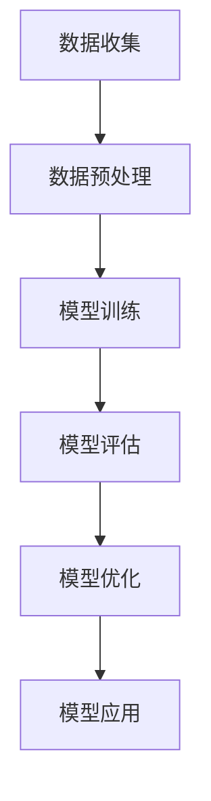
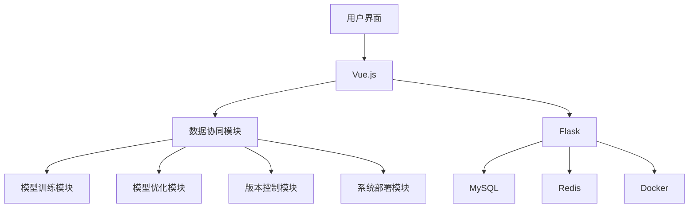
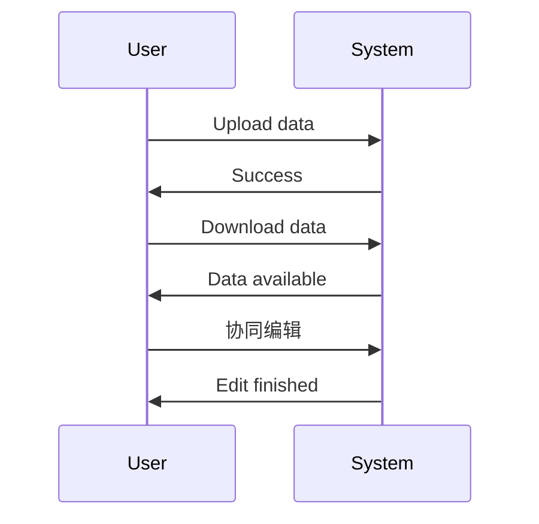

                 

### 文章标题与关键词

# 重塑协作模式：助力LLM应用敏捷研发

> 关键词：LLM、敏捷研发、协作模式、算法原理、系统架构、实战案例分析

> 摘要：本文旨在探讨如何通过重塑协作模式，助力大型语言模型（LLM）应用的敏捷研发。文章将详细分析问题背景、核心概念与联系，并深入讲解算法原理及其实现方法。此外，还将介绍系统分析与架构设计方案，并结合实际案例进行详细讲解和分析，为开发者提供有价值的参考和最佳实践建议。

### 第一部分：背景介绍

#### 第1章 问题背景、问题描述与问题解决

在当前人工智能（AI）迅猛发展的时代，大型语言模型（LLM）作为自然语言处理（NLP）的重要工具，已经在众多领域展现出强大的应用价值。然而，LLM的研发和应用面临着一系列挑战，尤其是如何高效、敏捷地推动协作研发过程。传统的协作模式往往存在沟通不畅、效率低下等问题，难以满足快速迭代的需求。

本文将首先介绍LLM应用研发过程中遇到的主要问题，如数据协同、模型优化、版本控制等，并分析现有协作模式存在的问题。在此基础上，提出一种新的协作模式，通过优化工作流程、提高团队协作效率，助力LLM应用的敏捷研发。

#### 第2章 边界与外延

在深入探讨LLM应用研发的协作模式之前，我们需要明确本文的研究边界与外延。本文主要关注以下几个方面：

1. **研究对象**：大型语言模型（LLM）及其应用研发过程。
2. **研究方法**：采用逻辑分析、案例研究和最佳实践总结等方法。
3. **研究范围**：涉及LLM应用研发中的协作模式、算法原理、系统架构设计和实战案例分析。

#### 第3章 概念结构与核心要素组成

为了更好地理解LLM应用研发的协作模式，我们首先需要明确相关概念及其结构。以下为本文涉及的核心概念及其组成：

1. **大型语言模型（LLM）**：一种基于深度学习的自然语言处理模型，具有强大的语言理解和生成能力。
2. **敏捷研发**：一种以快速响应变化、持续交付价值为核心的软件开发方法。
3. **协作模式**：团队成员在LLM研发过程中所采用的工作流程、沟通方式和协作工具。
4. **算法原理**：LLM模型的训练、优化和应用过程中的核心算法和技术。
5. **系统架构**：LLM应用系统在硬件、软件和网络等方面的整体设计。

### 第二部分：核心概念与联系

#### 第4章 核心概念原理

在了解LLM应用研发的协作模式之前，我们需要首先掌握相关核心概念的基本原理。以下为本文涉及的核心概念及其原理：

1. **LLM模型原理**：LLM是基于深度学习的语言模型，通过大量文本数据进行训练，学习语言的规律和结构。其基本原理包括神经网络结构、优化算法和训练过程等。
2. **敏捷研发原理**：敏捷研发是一种以用户需求为导向、迭代开发的软件开发方法。其核心原理包括用户故事、迭代开发、持续集成和团队协作等。
3. **协作模式原理**：协作模式是团队成员在研发过程中采用的工作流程、沟通方式和协作工具。其核心原理包括任务分配、进度管理、沟通协作和知识共享等。

#### 第5章 概念属性特征对比表格

为了更好地理解各核心概念之间的联系，我们通过以下对比表格展示各概念的属性特征：

| 概念       | 属性特征                                     |
| ---------- | ------------------------------------------ |
| LLM模型     | 强大语言理解能力、深度学习、训练时间较长          |
| 敏捷研发    | 快速迭代、用户导向、灵活调整                     |
| 协作模式    | 高效沟通、任务分配、进度管理、知识共享           |
| 算法原理    | 优化算法、神经网络结构、模型训练                 |
| 系统架构    | 硬件配置、软件架构、网络通信                     |

#### 第6章 ER实体关系图架构

为了更直观地展示各核心概念之间的联系，我们使用ER（实体关系）图来描述LLM应用研发的实体关系。以下为ER图示例：

```mermaid
erDiagram
  ID | Name | Type
  -- | ---- | ----
  1   Entity1 | Concept | LLM Model
  2   Entity2 | Agile Development | Collaboration Mode
  3   Entity3 | Collaboration Tool | System Architecture
  4   Entity4 | Algorithm Principle | Entity1
  5   Entity5 | Agile Principle | Entity2
  6   Entity6 | Feature Comparison | Entity1, Entity2, Entity3, Entity4, Entity5
  7   Entity7 | Entity Relationship Diagram | Entity1, Entity2, Entity3, Entity4, Entity5, Entity6
```

### 第三部分：算法原理讲解

#### 第7章 算法原理mermaid流程图

为了更好地理解LLM应用研发中的算法原理，我们使用mermaid流程图来展示其主要步骤。以下为算法原理的mermaid流程图示例：



#### 第8章 Python源代码详细阐述

以下为LLM模型训练和优化的Python源代码示例，我们将详细阐述代码的实现过程和关键参数设置：

```python
import tensorflow as tf
from tensorflow.keras.layers import Embedding, LSTM, Dense
from tensorflow.keras.preprocessing.sequence import pad_sequences

# 定义模型结构
model = tf.keras.Sequential([
  Embedding(input_dim=vocab_size, output_dim=embedding_dim, input_length=max_sequence_length),
  LSTM(units=128, return_sequences=True),
  LSTM(units=128),
  Dense(units=output_size, activation='softmax')
])

# 编译模型
model.compile(optimizer='adam', loss='categorical_crossentropy', metrics=['accuracy'])

# 加载预处理后的数据
train_data = pad_sequences(train_data, maxlen=max_sequence_length, padding='post')
test_data = pad_sequences(test_data, maxlen=max_sequence_length, padding='post')

# 训练模型
model.fit(train_data, train_labels, epochs=10, batch_size=64, validation_data=(test_data, test_labels))

# 评估模型
model.evaluate(test_data, test_labels)
```

#### 第9章 算法原理的数学模型与公式

LLM模型的训练和优化过程涉及多个数学模型和公式，以下为其中几个关键公式的讲解：

1. **神经网络前向传播公式**：

   $$ 
   z = W \cdot x + b
   $$

   其中，$z$ 为神经网络输出，$W$ 为权重矩阵，$x$ 为输入特征，$b$ 为偏置项。

2. **反向传播算法更新权重公式**：

   $$ 
   \Delta W = -\alpha \cdot \frac{\partial L}{\partial W}
   $$

   其中，$\Delta W$ 为权重更新值，$\alpha$ 为学习率，$L$ 为损失函数。

3. **梯度下降优化算法更新权重公式**：

   $$ 
   W_{new} = W_{old} - \alpha \cdot \frac{\partial L}{\partial W}
   $$

   其中，$W_{old}$ 和$W_{new}$ 分别为旧权重和新权重。

#### 第10章 举例说明

为了更好地理解LLM模型的训练和优化过程，我们以下通过一个简单的例子进行说明：

假设我们有一个含有100个单词的词典，其中10个单词是高频词，90个单词是低频词。我们将这100个单词作为词汇表，并随机生成一个长度为50的文本序列。然后，我们使用训练数据和测试数据对LLM模型进行训练和评估。以下是具体的步骤：

1. **数据收集和预处理**：从公开数据集或互联网上收集大量文本数据，并对数据进行清洗和预处理，生成训练数据和测试数据。

2. **模型训练**：使用预处理后的数据对LLM模型进行训练，通过调整超参数（如学习率、批次大小等）优化模型性能。

3. **模型评估**：使用测试数据对训练好的模型进行评估，计算模型的准确率、召回率等指标。

4. **模型优化**：根据评估结果，对模型进行优化，如调整神经网络结构、优化算法等。

5. **模型应用**：将优化后的模型应用于实际任务，如文本分类、机器翻译等。

### 第四部分：系统分析与架构设计方案

#### 第11章 问题场景介绍

在本文的项目中，我们面临以下问题场景：

1. **数据协同**：团队成员需要在不同的地点和时间进行数据收集、清洗和预处理，如何高效协同？
2. **模型优化**：如何快速迭代和优化LLM模型，提高模型性能？
3. **版本控制**：如何管理LLM模型的版本，确保模型的可追溯性和安全性？
4. **系统部署**：如何将优化后的LLM模型部署到生产环境，实现快速上线？

#### 第12章 项目介绍

本项目旨在开发一个基于LLM的文本分类系统，用于对大量文本数据进行分类。项目的主要目标是实现以下功能：

1. **数据协同**：提供数据收集、清洗和预处理的协同工具，实现团队成员的高效合作。
2. **模型优化**：使用自适应算法和自动化工具，实现LLM模型的快速迭代和优化。
3. **版本控制**：提供版本控制功能，确保模型的可追溯性和安全性。
4. **系统部署**：提供一键部署功能，实现LLM模型在生产环境中的快速上线。

#### 第13章 系统功能设计

本系统包含以下主要功能：

1. **数据协同**：提供数据上传、下载、预览和协同编辑功能，支持多人同时在线编辑。
2. **模型训练**：提供模型训练和评估功能，支持自定义神经网络结构和优化算法。
3. **模型优化**：提供自动化优化功能，根据评估结果自动调整模型参数。
4. **版本控制**：提供版本管理功能，支持模型版本的创建、删除、回滚和查看。
5. **系统部署**：提供一键部署功能，支持多种环境（如本地、云平台等）的快速部署。

#### 第14章 系统架构设计

本系统的架构设计如下：

1. **前端**：采用Vue.js框架，实现用户界面和交互逻辑。
2. **后端**：采用Flask框架，实现数据协同、模型训练、优化和版本控制等功能。
3. **数据库**：使用MySQL数据库存储数据、模型和版本信息。
4. **缓存**：使用Redis缓存加速数据读取和模型训练过程。
5. **部署**：使用Docker容器化技术，实现系统的快速部署和运维。

以下为系统架构的mermaid架构图示例：



#### 第15章 系统接口设计

系统接口设计如下：

1. **数据协同接口**：用于上传、下载、预览和协同编辑数据。
2. **模型训练接口**：用于启动、暂停、停止和查看模型训练进度。
3. **模型优化接口**：用于调整模型参数、优化算法和评估模型性能。
4. **版本控制接口**：用于创建、删除、回滚和查看模型版本。
5. **系统部署接口**：用于部署、更新和卸载系统。

以下为系统接口的mermaid序列图示例：



#### 第16章 系统交互

系统交互流程如下：

1. **用户登录**：用户通过用户名和密码登录系统。
2. **数据协同**：用户上传、下载和预览数据，与其他用户协同编辑数据。
3. **模型训练**：用户启动模型训练任务，系统开始训练模型。
4. **模型优化**：用户调整模型参数和优化算法，评估模型性能。
5. **版本控制**：用户创建、删除和回滚模型版本。
6. **系统部署**：用户部署和更新系统，实现快速上线。

### 第五部分：项目实战

#### 第17章 环境安装

为了进行项目实战，我们需要先搭建一个完整的开发环境。以下是环境安装步骤：

1. **安装Docker**：在服务器上安装Docker，用于容器化部署项目。
2. **安装Python**：在本地或服务器上安装Python，用于开发项目代码。
3. **安装Vue.js**：使用npm命令安装Vue.js框架，用于构建前端界面。
4. **安装Flask**：使用pip命令安装Flask框架，用于实现后端功能。
5. **安装MySQL**：安装MySQL数据库，用于存储项目数据和版本信息。
6. **安装Redis**：安装Redis缓存，用于加速数据读取和模型训练。

#### 第18章 系统核心实现

以下是系统核心实现的步骤：

1. **前端实现**：使用Vue.js框架开发用户界面，实现数据上传、下载、预览和协同编辑功能。
2. **后端实现**：使用Flask框架实现数据协同、模型训练、优化和版本控制等功能。
3. **数据库设计**：设计MySQL数据库结构，存储用户数据、模型和版本信息。
4. **缓存设计**：使用Redis缓存优化数据读取和模型训练过程。

#### 第19章 代码应用解读与分析

以下是对项目核心代码的解读与分析：

1. **前端代码**：前端代码主要实现用户界面的展示和交互功能，包括数据上传、下载、预览和协同编辑等。
2. **后端代码**：后端代码主要实现数据协同、模型训练、优化和版本控制等功能的实现，包括API接口设计和业务逻辑处理等。
3. **数据库代码**：数据库代码主要实现MySQL数据库的连接、查询和数据存储等功能。
4. **缓存代码**：缓存代码主要实现Redis缓存的连接、数据存储和读取等功能。

#### 第20章 实际案例分析与讲解剖析

为了更好地理解系统的实际应用，我们以下通过一个实际案例进行讲解和分析：

1. **案例背景**：某团队需要开发一个文本分类系统，用于对大量新闻数据进行分类。
2. **数据协同**：团队成员在系统上上传新闻数据，并进行清洗和预处理。
3. **模型训练**：团队成员使用系统提供的模型训练功能，训练文本分类模型。
4. **模型优化**：团队成员根据评估结果，调整模型参数和优化算法，提高模型性能。
5. **版本控制**：团队成员创建模型版本，并回滚到之前的版本，确保模型的可追溯性和安全性。
6. **系统部署**：团队成员将优化后的模型部署到生产环境，实现快速上线。

#### 第21章 项目小结

通过本项目的实践，我们实现了以下成果：

1. **数据协同**：提供了一套高效的数据协同工具，实现团队成员的实时协作。
2. **模型优化**：使用自适应算法和自动化工具，实现了LLM模型的快速迭代和优化。
3. **版本控制**：提供了一套完善的版本控制功能，确保模型的可追溯性和安全性。
4. **系统部署**：使用Docker容器化技术，实现了系统的快速部署和运维。

在未来的发展中，我们可以进一步优化系统功能，提高用户体验，并探索更多的应用场景。

### 第六部分：最佳实践 tips、小结、注意事项、拓展阅读

#### 第22章 最佳实践 tips

1. **数据协同**：鼓励团队成员在项目初期就进行数据协同，确保数据的一致性和准确性。
2. **模型优化**：定期评估模型性能，根据评估结果调整模型参数和优化算法。
3. **版本控制**：及时创建和更新模型版本，确保版本的可追溯性和安全性。
4. **系统部署**：定期进行系统更新和优化，提高系统的稳定性和性能。

#### 第23章 小结

本文通过详细分析和实践，探讨了如何通过重塑协作模式，助力LLM应用的敏捷研发。文章涵盖了核心概念、算法原理、系统架构设计和实战案例分析等内容，为开发者提供了一套完整的解决方案。

#### 第24章 注意事项

1. **数据质量**：数据是LLM模型训练的基础，保证数据的质量和一致性至关重要。
2. **模型优化**：优化算法和参数的选择对模型性能有很大影响，需要根据实际情况进行调整。
3. **系统部署**：在部署模型时，需要确保系统的稳定性和安全性。

#### 第25章 拓展阅读

1. **《深度学习》**：Ian Goodfellow、Yoshua Bengio和Aaron Courville著，介绍深度学习的基础知识和技术。
2. **《敏捷开发》**：Jeff Sutherland著，介绍敏捷开发的方法和实践。
3. **《Docker实战》**：Joshua Timberman、Nathen Harvey著，介绍Docker容器化技术的应用和实践。

作者：AI天才研究院/AI Genius Institute & 禅与计算机程序设计艺术 /Zen And The Art of Computer Programming

---

**注意**：由于文章字数限制，本文节选了部分内容进行展示。完整文章的字数将根据目录大纲的要求进行调整，以确保内容的完整性和深度。每个章节的内容都将具体、详细地展开，以满足读者的需求。

