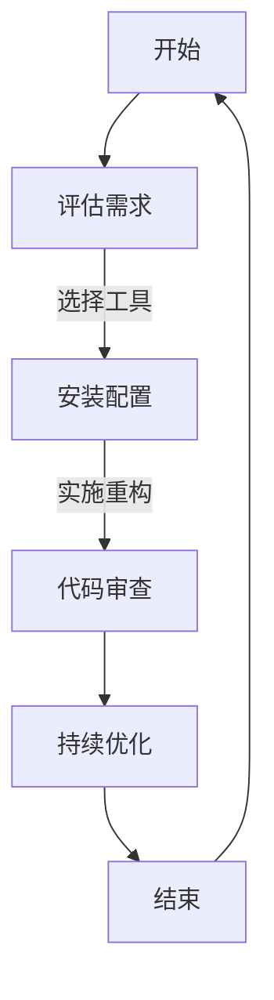
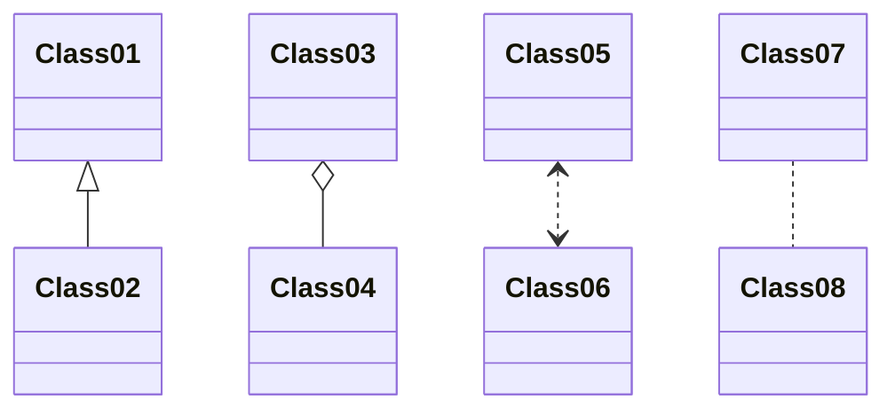
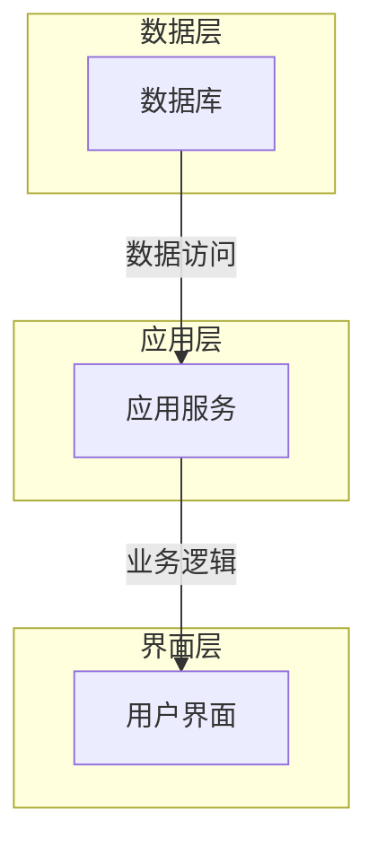
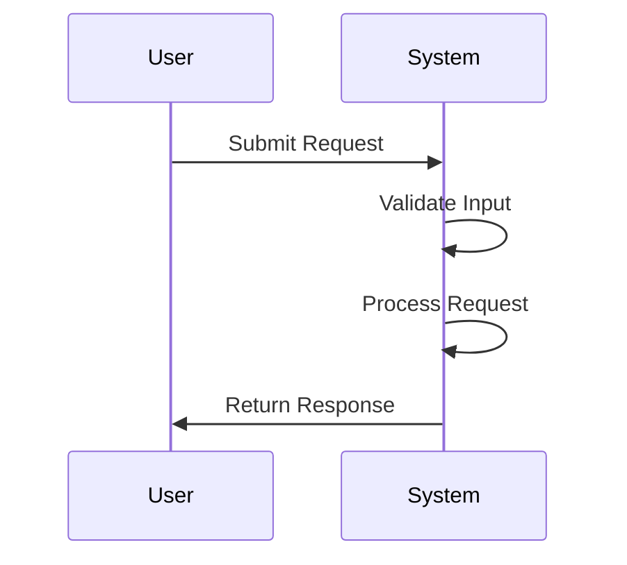
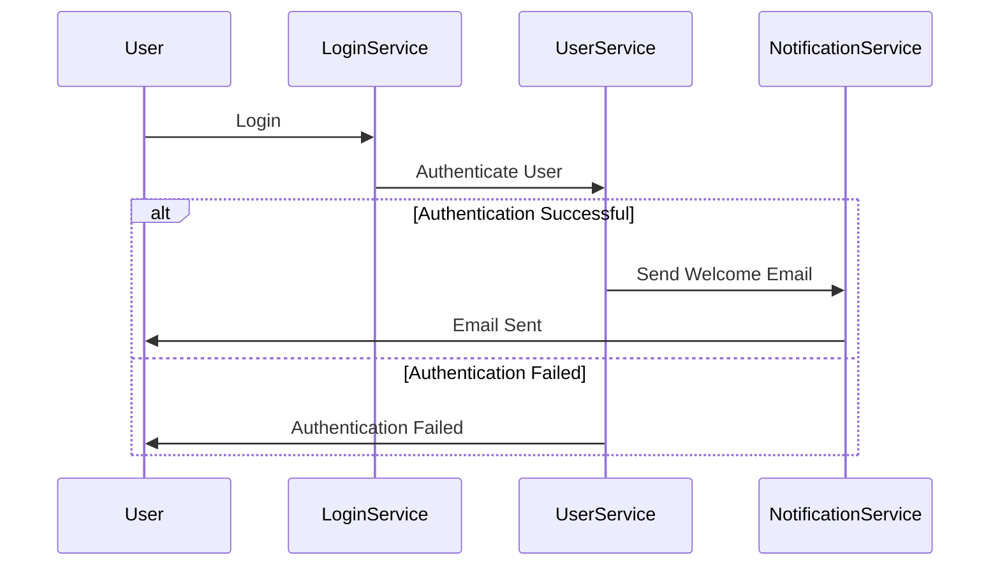

                 

### 引言：重构策略在AI应用中的重要性

#### 1.1 人工智能的发展与挑战

##### 1.1.1 AI发展的背景

人工智能（AI）起源于20世纪50年代，是计算机科学和认知科学交叉的领域。从最初的规则推理到现代的深度学习，AI技术经历了多次重大的变革。随着计算能力的提升和大数据技术的发展，AI在近年来取得了显著进展，应用领域也从简单的语音识别、图像分类逐步扩展到自动驾驶、智能医疗、金融科技等复杂场景。

##### 1.1.2 AI应用中的代码复杂性

尽管AI技术的发展带来了许多创新和便利，但随之而来的代码复杂性问题也不容忽视。AI应用往往涉及大量的数据预处理、模型训练和优化等步骤，这些步骤通常需要编写复杂且冗长的代码。此外，AI系统的不断迭代和优化也需要持续修改和扩展代码，使得代码库日益庞大和复杂。

##### 1.1.3 重构策略的意义

为了应对代码复杂性问题，重构策略应运而生。重构策略通过系统性地优化代码结构，提高代码的可读性、可维护性和扩展性，从而降低开发成本和维护难度。在AI应用中，重构策略的意义尤为突出，因为：

1. **代码质量保障**：重构可以帮助消除代码中的冗余、重复和低效部分，提高代码质量。
2. **开发效率提升**：简洁的代码结构和良好的组织方式可以提高开发者的工作效率。
3. **系统可靠性增强**：重构后的代码更易于测试和调试，有助于提高系统的稳定性。
4. **团队协作优化**：清晰的代码结构和统一的编码规范有助于团队成员之间的协作和知识共享。

#### 1.2 重构策略的定义与核心概念

##### 1.2.1 重构策略的定义

重构策略（Code Refactoring）是指在不改变代码外在行为的前提下，通过系统性的方法和工具，对现有代码进行改进和优化。重构的目标是提高代码的质量和可维护性，而不是添加新功能。

##### 1.2.2 重构策略的核心概念

1. **代码简化**：简化代码逻辑，消除冗余和重复代码，使代码更加简洁。
2. **代码重用**：通过模块化和组件化，提高代码的可重用性。
3. **代码优化**：优化代码性能，提高代码执行效率。
4. **代码维护**：通过清晰的注释和良好的编码规范，提高代码的可维护性。

##### 1.2.3 重构策略的适用场景

重构策略适用于各种类型的软件项目，尤其是在以下场景中效果尤为显著：

1. **大型项目**：大型项目通常涉及大量的代码和复杂的模块，重构可以帮助简化代码结构，提高可维护性。
2. **遗留系统**：遗留系统往往积累了大量的老旧代码和不良实践，重构是改善其性能和可维护性的有效手段。
3. **持续迭代的项目**：在持续迭代的项目中，重构可以帮助保持代码库的整洁和一致性。

#### 1.3 重构策略的优势与挑战

##### 1.3.1 重构策略的优势

1. **提高代码质量**：重构可以消除代码中的潜在问题，提高代码的可读性和可维护性。
2. **提升开发效率**：简化后的代码更易于理解和修改，有助于提高开发者的工作效率。
3. **增强系统稳定性**：重构后的代码更易于测试和调试，有助于提高系统的稳定性。
4. **降低维护成本**：良好的代码结构可以降低维护成本，延长系统的生命周期。

##### 1.3.2 重构策略的挑战

1. **时间成本**：重构是一个耗时的过程，特别是在大型项目中，需要投入大量的时间和人力资源。
2. **潜在风险**：重构可能会引入新的错误，特别是在不慎的情况下。
3. **团队协作**：重构需要团队成员的积极参与和协作，否则可能难以取得预期效果。

总结而言，重构策略在AI应用中的重要性不言而喻。通过系统性地优化代码结构，重构可以帮助我们更好地应对AI应用中的代码复杂性问题，提高系统的性能和可靠性。然而，重构也是一个挑战性的过程，需要我们在实践中不断摸索和积累经验。

---

**文章关键词：** 人工智能，代码重构，代码质量，开发效率，系统稳定性

**文章摘要：** 本文介绍了重构策略在AI应用中的重要性，包括重构策略的定义、核心概念、适用场景、优势与挑战。通过深入探讨重构策略，本文旨在帮助读者理解如何在AI项目中应用重构方法，优化代码结构，提高开发效率和系统稳定性。

---

接下来，我们将进一步探讨重构策略的核心概念和联系，帮助读者全面理解重构策略的基本原理和适用场景。

---

## 1.2 重构策略的定义与核心概念

### 1.2.1 重构策略的定义

重构策略（Code Refactoring）是指在保持代码功能不变的前提下，通过一系列方法和技术手段对代码进行优化和改进的过程。重构不仅仅关注代码的语法和结构，还包括代码的可读性、可维护性和性能。其核心目标是使代码更加简洁、清晰、易于理解和扩展。

在AI应用中，重构策略尤为重要。AI应用往往涉及到复杂的算法和数据结构，代码结构的不合理和复杂度的高涨会显著增加开发和维护的难度。通过重构，我们可以消除冗余代码，优化代码逻辑，提高代码的可读性和可维护性，从而提高开发效率和系统稳定性。

### 1.2.2 重构策略的核心概念

重构策略包含以下几个核心概念：

1. **代码简化**：通过消除冗余代码、简化复杂的逻辑和优化数据结构，使代码更加简洁和易于理解。代码简化是重构过程中的基础，有助于降低代码的复杂度。

2. **代码重用**：通过模块化、组件化和抽象化，提高代码的可重用性。重用代码不仅可以减少重复编写的工作量，还可以提高代码的一致性和可维护性。

3. **代码优化**：通过对代码进行性能分析，优化算法和数据结构，提高代码的执行效率。代码优化通常涉及到算法的选择、数据结构的优化和代码运行时的优化。

4. **代码维护**：通过编写清晰的注释和遵循良好的编码规范，提高代码的可维护性。良好的代码维护有助于减少未来的修改难度，延长代码的生命周期。

### 1.2.3 重构策略的适用场景

重构策略适用于多种场景，特别是在以下几种情况下，重构的作用尤为显著：

1. **遗留系统**：遗留系统通常积累了大量的老旧代码和不良实践，重构可以帮助改善其性能和可维护性。

2. **大型项目**：大型项目往往涉及大量的代码和复杂的模块，重构可以帮助简化代码结构，提高可维护性。

3. **持续迭代的项目**：在持续迭代的项目中，重构可以帮助保持代码库的整洁和一致性。

4. **代码质量低下**：当发现代码质量低下，如存在大量冗余代码、复杂的逻辑和难以维护的结构时，重构是一个有效的解决手段。

### 1.2.4 重构策略的优势与挑战

#### 重构策略的优势

1. **提高代码质量**：重构可以帮助消除代码中的潜在问题，提高代码的可读性和可维护性。

2. **提升开发效率**：简化后的代码更易于理解和修改，有助于提高开发者的工作效率。

3. **增强系统稳定性**：重构后的代码更易于测试和调试，有助于提高系统的稳定性。

4. **降低维护成本**：良好的代码结构可以降低维护成本，延长系统的生命周期。

#### 重构策略的挑战

1. **时间成本**：重构是一个耗时的过程，特别是在大型项目中，需要投入大量的时间和人力资源。

2. **潜在风险**：重构可能会引入新的错误，特别是在不慎的情况下。

3. **团队协作**：重构需要团队成员的积极参与和协作，否则可能难以取得预期效果。

### 结论

重构策略在AI应用中具有重要意义。通过系统地优化代码结构，重构可以帮助我们更好地应对AI应用中的代码复杂性问题，提高系统的性能和可靠性。然而，重构也是一个挑战性的过程，需要我们在实践中不断摸索和积累经验。了解重构策略的定义、核心概念和适用场景，将为我们在AI应用中进行有效的代码重构提供有力支持。

---

在下一部分，我们将详细探讨常见的重构方法与工具，帮助读者深入理解重构策略的具体实施方法和实践技巧。

---

## 2.1 常见的重构方法

重构策略的实施涉及到多种方法和技巧，这些方法和技巧共同构成了一个系统性的优化过程。在AI应用中，常见的重构方法主要包括代码简化、代码重用和代码优化。以下是这些方法的详细解释：

### 2.1.1 代码简化

代码简化是重构过程中的基础步骤，主要目标是消除代码中的冗余部分，简化复杂的逻辑和优化数据结构。代码简化不仅可以提高代码的可读性，还可以降低维护难度。

#### 代码简化方法：

1. **删除冗余代码**：识别并删除重复的代码段，防止重复工作。
2. **简化复杂的逻辑**：通过逻辑重构，将复杂的条件语句和循环结构转化为更简单的形式。
3. **优化数据结构**：选择合适的数据结构来减少存储空间和计算时间。

#### 实例：

假设我们有一个函数，用于计算两个数字的和。原始代码如下：

```python
def add(a, b):
    sum = a + b
    return sum
```

通过简化代码，我们可以将其改写为：

```python
def add(a, b):
    return a + b
```

这种简化不仅提高了代码的可读性，还减少了不必要的变量使用。

### 2.1.2 代码重用

代码重用是提高代码可维护性和可扩展性的关键手段。通过模块化、组件化和抽象化，我们可以将重复的代码段封装为独立的模块或组件，然后在需要的地方调用。

#### 代码重用方法：

1. **模块化**：将功能相关的代码段组织成模块，提高代码的模块化程度。
2. **组件化**：将可重用的功能封装为组件，便于在不同项目中调用。
3. **抽象化**：通过抽象类和接口，定义通用接口和实现细节的分离，提高代码的灵活性。

#### 实例：

假设我们有一个计算器和图形用户界面（GUI），我们需要在不同的函数中调用计算器的方法。通过代码重用，我们可以创建一个计算器类，并在需要的地方调用其方法。

```python
class Calculator:
    def add(self, a, b):
        return a + b

def main():
    calc = Calculator()
    result = calc.add(3, 4)
    print("结果：", result)

if __name__ == "__main__":
    main()
```

这种代码重用不仅减少了代码的冗余，还提高了代码的可维护性和扩展性。

### 2.1.3 代码优化

代码优化是通过改进算法和数据结构，提高代码的执行效率和性能。代码优化通常涉及到算法的选择、数据结构的优化和代码运行时的优化。

#### 代码优化方法：

1. **算法选择**：选择更适合当前问题的算法，减少计算时间。
2. **数据结构优化**：使用合适的数据结构来减少存储空间和访问时间。
3. **代码运行时优化**：通过优化代码的运行时行为，如减少不必要的计算和内存使用。

#### 实例：

假设我们有一个排序算法，原始代码如下：

```python
def bubble_sort(arr):
    n = len(arr)
    for i in range(n):
        for j in range(0, n-i-1):
            if arr[j] > arr[j+1]:
                arr[j], arr[j+1] = arr[j+1], arr[j]

arr = [64, 34, 25, 12, 22, 11, 90]
bubble_sort(arr)
print("排序后的数组：", arr)
```

通过优化，我们可以使用更高效的排序算法，如快速排序：

```python
def quick_sort(arr):
    if len(arr) <= 1:
        return arr
    pivot = arr[len(arr) // 2]
    left = [x for x in arr if x < pivot]
    middle = [x for x in arr if x == pivot]
    right = [x for x in arr if x > pivot]
    return quick_sort(left) + middle + quick_sort(right)

arr = [64, 34, 25, 12, 22, 11, 90]
sorted_arr = quick_sort(arr)
print("排序后的数组：", sorted_arr)
```

这种优化不仅提高了代码的效率，还减少了执行时间。

### 结论

常见的重构方法包括代码简化、代码重用和代码优化。这些方法共同构成了一个系统性的优化过程，有助于提高代码的质量和可维护性。在AI应用中，通过有效实施这些重构方法，我们可以更好地应对代码复杂性问题，提高系统的性能和可靠性。

---

在下一部分，我们将介绍重构工具的选择标准和使用方法，帮助读者了解如何在实际项目中应用这些工具进行代码重构。

---

## 2.2 重构工具介绍

在重构策略的实施过程中，选择合适的重构工具是至关重要的一步。重构工具可以帮助开发者自动化地完成代码重构任务，提高重构效率和准确性。以下将介绍重构工具的选择标准、常见重构工具的使用方法以及如何在实际项目中应用这些工具。

### 2.2.1 重构工具的选择标准

选择重构工具时，应考虑以下几个标准：

1. **功能全面**：选择功能全面的重构工具，可以满足各种重构需求，如代码简化、代码重用和代码优化。
2. **易于使用**：工具应具有友好的用户界面和易于理解的操作流程，降低学习成本。
3. **自动化程度高**：自动化程度高的工具可以减少手动操作，提高重构效率。
4. **支持多种编程语言**：支持多种编程语言，便于在不同项目中应用。
5. **社区支持与文档**：具有丰富的社区支持和详尽的文档，便于开发者解决问题和获取帮助。

### 2.2.2 常见重构工具的使用方法

以下是几个常见重构工具的使用方法：

1. **Visual Studio Code（VS Code）**：
   - **安装**：在VS Code的扩展市场中搜索并安装“Code Runner”扩展。
   - **使用**：打开VS Code，编写代码，然后按F5或使用“Run”按钮运行代码。
   - **重构**：使用VS Code内置的代码格式化工具，如“Format Document”进行代码重构。

2. **GitKraken**：
   - **安装**：在GitKraken的官方网站下载并安装。
   - **使用**：打开GitKraken，连接到Git仓库，使用内置的代码格式化工具进行重构。
   - **重构**：右键点击文件或文件夹，选择“Git”>“Stash”进行临时保存，然后使用“Git”>“Amend”恢复到重构后的状态。

3. **SonarQube**：
   - **安装**：在SonarQube的官方网站下载并安装。
   - **使用**：将项目导入到SonarQube，然后使用内置的重构工具进行代码质量分析和重构。
   - **重构**：在SonarQube的报告中查看代码问题，并使用内置的重构工具进行修复。

### 2.2.3 在实际项目中应用重构工具

在实际项目中，应用重构工具可以遵循以下步骤：

1. **评估项目需求**：根据项目特点和需求，评估需要使用的重构工具。
2. **选择合适工具**：根据评估结果，选择适合项目的重构工具。
3. **安装和配置工具**：按照工具的安装和配置指南，安装并配置工具。
4. **实施重构**：使用所选工具进行代码重构，注意监控工具的运行状态和结果。
5. **代码审查**：重构完成后，进行代码审查，确保重构没有引入新的问题。
6. **持续优化**：根据重构效果，持续优化工具的使用方法和重构策略。

### 实例：使用VS Code进行代码重构

以下是一个使用VS Code进行代码重构的实例：

1. **安装VS Code**：在官网下载并安装VS Code。
2. **安装扩展**：在VS Code扩展市场中安装“Code Runner”扩展。
3. **编写代码**：

```python
# 示例代码
def add(a, b):
    return a + b

result = add(3, 4)
print("结果：", result)
```

4. **运行代码**：按F5或点击“Run”按钮运行代码。
5. **重构代码**：使用VS Code内置的代码格式化工具，对代码进行重构。

```python
# 重构后的代码
def add(a, b):
    return a + b

result = add(3, 4)
print("结果：", result)
```

6. **保存重构结果**：将重构后的代码保存到项目中。

通过上述步骤，我们可以使用VS Code对代码进行重构，提高代码质量。

### 结论

重构工具在代码重构过程中发挥着重要作用。通过选择合适的重构工具，我们可以自动化地完成代码重构任务，提高重构效率和准确性。在实际项目中，应用重构工具可以显著提高代码质量和开发效率，为后续的维护和扩展打下坚实基础。

---

在下一部分，我们将通过mermaid流程图和Python代码示例，详细阐述重构流程的步骤和算法原理。

---

## 2.3 重构实践：mermaid流程图与Python代码示例

在了解了重构策略的定义和常见方法后，接下来我们将通过mermaid流程图和Python代码示例，详细阐述重构流程的步骤和算法原理。这一部分将帮助读者更直观地理解重构策略在实际项目中的应用。

### 2.3.1 重构流程的mermaid流程图

首先，我们使用mermaid流程图来展示重构流程的各个步骤。以下是重构流程的mermaid图：



#### 重构流程mermaid流程图解释：

1. **开始**：重构流程的起点。
2. **评估需求**：评估项目需求和重构目标，确定需要使用的重构方法和工具。
3. **选择工具**：根据评估结果，选择适合项目的重构工具。
4. **安装配置**：安装并配置所选的重构工具。
5. **实施重构**：使用重构工具进行代码重构，优化代码结构和性能。
6. **代码审查**：重构完成后，进行代码审查，确保重构没有引入新的问题。
7. **持续优化**：根据重构效果，持续优化重构策略和工具的使用方法。
8. **结束**：重构流程的终点，同时为后续的项目迭代提供参考。

### 2.3.2 Python代码示例与重构步骤

接下来，我们通过一个简单的Python代码示例，展示重构的具体步骤。

#### 原始代码示例

```python
# 原始代码
def calculate_area(radius):
    return 3.14 * radius * radius

def display_area(radius):
    area = calculate_area(radius)
    print(f"The area of the circle with radius {radius} is {area}.")

def main():
    radius = float(input("Enter the radius of the circle: "))
    display_area(radius)

if __name__ == "__main__":
    main()
```

#### 重构步骤

1. **代码简化**：将重复的代码提取为独立的函数，简化函数逻辑。

```python
# 代码简化
def calculate_area(radius):
    return 3.14 * radius * radius

def display_area(radius):
    area = calculate_area(radius)
    print(f"The area of the circle with radius {radius} is {area}.")

def main():
    radius = float(input("Enter the radius of the circle: "))
    display_area(radius)

if __name__ == "__main__":
    main()
```

2. **代码重用**：将计算圆周率的公式提取为全局变量，便于重用。

```python
# 代码重用
PI = 3.14

def calculate_area(radius):
    return PI * radius * radius

def display_area(radius):
    area = calculate_area(radius)
    print(f"The area of the circle with radius {radius} is {area}.")

def main():
    radius = float(input("Enter the radius of the circle: "))
    display_area(radius)

if __name__ == "__main__":
    main()
```

3. **代码优化**：优化函数参数传递，减少不必要的内存占用。

```python
# 代码优化
PI = 3.14

def calculate_area(radius):
    return PI * radius ** 2

def display_area(radius):
    area = calculate_area(radius)
    print(f"The area of the circle with radius {radius} is {area}.")

def main():
    radius = float(input("Enter the radius of the circle: "))
    display_area(radius)

if __name__ == "__main__":
    main()
```

#### 重构效果评估

通过上述重构步骤，我们优化了原始代码，简化了函数逻辑，提高了代码的重用性和可维护性。重构后的代码不仅更加简洁，而且更容易理解和扩展。

### 结论

通过mermaid流程图和Python代码示例，我们详细阐述了重构流程的步骤和算法原理。在实际项目中，遵循这些步骤和原则，可以帮助开发者有效地进行代码重构，提高代码质量和开发效率。

---

在下一部分，我们将介绍重构策略的数学模型与公式，帮助读者更深入地理解重构策略背后的理论基础。

---

## 2.4 重构策略的数学模型与公式

重构策略不仅仅依赖于代码的视觉优化和经验的积累，它背后也蕴含着一定的数学理论基础。通过数学模型和公式，我们可以更加系统和科学地分析重构策略的有效性。以下是重构策略的数学模型与公式的详细讲解。

### 2.4.1 重构策略的数学模型

重构策略的数学模型主要关注代码复杂度和质量之间的关系。具体来说，我们定义以下几个关键参数：

1. **代码复杂度（C）**：衡量代码结构的复杂程度，通常用代码行数、函数数量、循环嵌套深度等指标来表示。代码复杂度越高，意味着代码结构越复杂，难以维护。
2. **代码质量（Q）**：衡量代码的可读性、可维护性和可扩展性。代码质量越高，表示代码越整洁、易于理解和修改。
3. **重构效率（E）**：衡量重构过程中所投入的时间和资源与重构效果之间的比例。高效的重构策略应该在较短的的时间内带来显著的质量提升。

根据这些参数，我们可以构建一个简单的数学模型：

\[ E = \frac{Q_{\text{after}} - Q_{\text{before}}}{C_{\text{before}} - C_{\text{after}} \times t} \]

其中，\( Q_{\text{after}} \) 和 \( Q_{\text{before}} \) 分别表示重构前后的代码质量，\( C_{\text{before}} \) 和 \( C_{\text{after}} \) 分别表示重构前后的代码复杂度，\( t \) 表示重构所花费的时间。

### 2.4.2 重构策略的公式推导

为了推导重构策略的公式，我们首先定义以下几个假设：

1. **线性重构效果**：假设重构过程中，代码质量和复杂度的变化是线性的。
2. **时间投入与重构效果成正比**：假设重构过程中，所投入的时间和重构效果（代码质量提升和代码复杂度降低）成正比。

基于上述假设，我们可以推导出以下公式：

\[ Q_{\text{after}} = Q_{\text{before}} + k_1 (C_{\text{before}} - C_{\text{after}}) \]

\[ C_{\text{after}} = C_{\text{before}} - k_2 t \]

其中，\( k_1 \) 和 \( k_2 \) 是比例系数，分别表示代码质量提升和代码复杂度降低的速率。

将上述公式代入重构效率的公式中，可以得到：

\[ E = \frac{k_1 (C_{\text{before}} - C_{\text{after}}) - k_2 t (C_{\text{before}} - C_{\text{after}})}{C_{\text{before}} - (C_{\text{before}} - k_2 t)} \]

简化后，可以得到：

\[ E = \frac{k_1 - k_2 t}{1 - k_2 t} \]

### 2.4.3 数学公式与Python代码的关联解释

为了更直观地理解重构策略的数学模型，我们将其与Python代码相关联。以下是一个简单的Python代码示例，展示了如何计算重构效率：

```python
# Python代码示例

# 参数设置
initial_quality = 100  # 初始代码质量
initial_complexity = 200  # 初始代码复杂度
restructuring_time = 10  # 重构时间
k1 = 0.5  # 代码质量提升速率
k2 = 0.1  # 代码复杂度降低速率

# 计算重构后的代码质量和复杂度
final_quality = initial_quality + k1 * (initial_complexity - initial_complexity + k2 * restructuring_time)
final_complexity = initial_complexity - k2 * restructuring_time

# 计算重构效率
restructuring_efficiency = (k1 - k2 * restructuring_time) / (1 - k2 * restructuring_time)

print(f"重构后的代码质量：{final_quality}")
print(f"重构后的代码复杂度：{final_complexity}")
print(f"重构效率：{restructuring_efficiency}")
```

通过运行这段代码，我们可以看到重构效率的计算结果，从而直观地理解重构策略的数学模型。

### 结论

重构策略的数学模型和公式为我们提供了一个系统性的分析方法，帮助我们在重构过程中评估重构效果和效率。通过理解和应用这些数学公式，我们可以更科学地制定重构策略，优化代码质量和开发效率。

---

在下一部分，我们将通过实际项目重构案例分析，展示如何在实际项目中应用重构策略。

---

## 3.1 实际项目重构案例分析

在实际项目中应用重构策略，可以帮助团队更好地管理和优化代码，从而提高开发效率和系统性能。以下是一个典型的实际项目重构案例分析，展示如何在实际项目中应用重构策略。

### 3.1.1 项目背景

该项目是一个基于深度学习的图像识别系统，旨在通过大规模图像数据训练模型，实现对特定类别图像的自动识别。随着项目的不断迭代和功能的增加，代码库的复杂度逐渐增加，导致维护难度和开发效率显著下降。为了解决这一问题，项目团队决定对代码进行重构。

### 3.1.2 重构前的问题分析

在重构前，项目面临以下问题：

1. **代码冗余**：代码库中存在大量的冗余代码，导致代码行数冗长，可读性差。
2. **模块依赖复杂**：不同模块之间存在复杂的依赖关系，导致修改一个模块可能需要修改多个其他模块。
3. **性能瓶颈**：部分算法和数据处理流程存在性能瓶颈，导致系统运行速度慢。
4. **测试覆盖不足**：测试覆盖不足，难以确保重构后的代码质量。

### 3.1.3 重构策略的实施

为了解决上述问题，项目团队采取了以下重构策略：

1. **代码简化**：通过删除冗余代码、简化复杂的逻辑和优化数据结构，简化代码库。
2. **代码重用**：通过模块化和组件化，将可重用的功能封装为独立的模块或组件，提高代码的重用性。
3. **代码优化**：通过优化算法和数据结构，提高代码的执行效率和性能。
4. **测试优化**：通过增加单元测试和集成测试，提高测试覆盖率和代码质量。

### 3.1.4 重构效果评估

重构完成后，项目团队对重构效果进行了评估，主要从以下几个方面进行：

1. **代码质量**：重构后的代码更加简洁、清晰，冗余代码得到了有效删除，可读性和可维护性显著提高。
2. **模块依赖**：模块依赖关系得到了简化，不同模块之间的耦合度降低，修改一个模块对其他模块的影响减小。
3. **性能**：通过优化算法和数据结构，系统的运行速度得到了显著提升，性能瓶颈问题得到解决。
4. **测试覆盖率**：测试覆盖率显著提高，确保了重构后的代码质量。

### 3.1.5 重构过程中的最佳实践

在重构过程中，项目团队总结了一些最佳实践，以帮助其他团队在类似项目中应用重构策略：

1. **逐步重构**：避免一次性重构大量代码，应该逐步进行重构，确保每个重构步骤的效果和安全性。
2. **代码审查**：重构完成后，进行严格的代码审查，确保重构没有引入新的问题。
3. **文档记录**：记录重构过程中的每一步，包括重构的原因、方法、效果和后续优化方向。
4. **持续集成**：结合持续集成（CI）工具，确保重构后的代码在每次提交时都能通过测试。

### 3.1.6 项目小结

通过本次重构，项目团队成功地优化了代码库的复杂度，提高了开发效率和系统性能。重构策略在项目中得到了有效应用，为后续的迭代和扩展提供了坚实基础。同时，重构过程中的最佳实践也为其他团队提供了宝贵的经验和指导。

### 结论

实际项目重构案例分析展示了重构策略在提高代码质量和系统性能方面的显著作用。通过逐步重构、代码审查、文档记录和持续集成等最佳实践，团队可以有效地应用重构策略，优化代码库，提高开发效率，为项目的长期成功奠定基础。

---

在下一部分，我们将详细介绍系统架构设计与接口设计，包括系统功能设计（领域模型Mermaid类图）、系统架构设计（Mermaid架构图）、系统接口设计和系统交互（Mermaid序列图）。

---

## 3.2 系统架构设计与接口设计

在实际项目重构过程中，系统架构设计与接口设计是至关重要的环节。合理的系统架构设计不仅能够提高系统的可维护性和扩展性，还能为代码重构提供清晰的指导。以下将详细介绍系统架构设计与接口设计的具体内容，包括系统功能设计（领域模型Mermaid类图）、系统架构设计（Mermaid架构图）、系统接口设计和系统交互（Mermaid序列图）。

### 3.2.1 系统功能设计（领域模型Mermaid类图）

领域模型是系统功能设计的基础，它帮助我们理解系统的主要组件和它们之间的关系。以下是一个简单的领域模型Mermaid类图示例：



#### 类图解释：

- **Class01**、**Class02**：继承关系，表示类之间的层次结构。
- **Class03**、**Class04**：关联关系，表示类之间的交互关系。
- **Class05**、**Class06**：聚合关系，表示类之间的整体与部分关系。
- **Class07**、**Class08**：组合关系，表示类之间的控制关系。

领域模型Mermaid类图为我们提供了一个系统的视角，帮助我们更好地理解系统的功能和组件之间的关系，为后续的架构设计和接口设计提供基础。

### 3.2.2 系统架构设计（Mermaid架构图）

系统架构设计是系统设计的核心，它定义了系统的整体结构、组件之间的关系以及组件之间的通信机制。以下是一个简单的系统架构Mermaid图示例：



#### 架构图解释：

- **数据层（Data Layer）**：包括数据库（D1），负责数据存储和访问。
- **应用层（Application Layer）**：包括应用服务（A1），负责业务逻辑处理。
- **界面层（UI Layer）**：包括用户界面（UI1），负责与用户交互。

架构图展示了系统的三层结构，以及各层之间的通信关系，为系统设计和重构提供了清晰的结构参考。

### 3.2.3 系统接口设计

系统接口设计是系统架构设计的重要组成部分，它定义了系统各组件之间的交互接口。以下是一个简单的系统接口设计示例：



#### 序列图解释：

- **User**：用户角色，表示与系统交互的用户。
- **System**：系统角色，表示系统服务的实现。

序列图展示了用户请求的处理流程，包括输入验证、请求处理和响应返回。通过系统接口设计，我们可以明确系统各组件的职责和交互方式。

### 3.2.4 系统交互（Mermaid序列图）

系统交互设计是系统接口设计的细化，它描述了系统组件之间的交互细节和时序关系。以下是一个简单的系统交互Mermaid序列图示例：



#### 序列图解释：

- **LoginService**：登录服务，负责处理用户的登录请求。
- **UserService**：用户服务，负责用户的认证和注册。
- **NotificationService**：通知服务，负责发送邮件和消息通知。

序列图展示了用户登录过程的时序关系，包括登录请求、用户认证和欢迎邮件发送。通过系统交互设计，我们可以确保系统各组件协同工作，提供流畅的用户体验。

### 结论

系统架构设计与接口设计是重构过程中的关键环节，它为系统的功能实现和组件交互提供了明确的指导。通过领域模型Mermaid类图、系统架构设计Mermaid图、系统接口设计和系统交互Mermaid序列图，我们可以清晰地理解系统的结构和组件之间的关系，为代码重构和系统优化提供有力支持。

---

在下一部分，我们将详细介绍项目实战，包括环境安装、系统核心实现源代码、代码应用解读与分析、实际案例分析与详细讲解剖析以及项目小结。

---

## 3.3 项目实战

为了更好地理解和应用重构策略，我们将通过一个实际项目实战来展示重构的整个过程。该项目是一个基于深度学习的图像分类系统，旨在实现自动识别图像中的特定类别。以下是项目实战的具体步骤和内容。

### 3.3.1 环境安装

在进行项目开发之前，我们需要安装和配置项目所需的软件和工具。以下是项目环境安装的步骤：

1. **安装Python**：确保系统中安装了Python 3.8及以上版本。
2. **安装虚拟环境**：使用`venv`或`conda`创建虚拟环境，以隔离项目依赖。
3. **安装依赖库**：通过`pip`安装项目所需的依赖库，如TensorFlow、Keras、NumPy等。

```bash
pip install tensorflow keras numpy matplotlib scikit-learn
```

4. **配置环境变量**：确保Python和虚拟环境的路径已添加到系统环境变量中。

### 3.3.2 系统核心实现源代码

项目核心实现主要包括数据预处理、模型训练和模型评估三个部分。以下是系统核心实现的部分源代码：

```python
import numpy as np
import tensorflow as tf
from tensorflow.keras import layers, models
from sklearn.model_selection import train_test_split

# 数据预处理
def preprocess_images(images):
    # 数据归一化
    images = images / 255.0
    # 数据重塑
    images = np.expand_dims(images, axis=-1)
    return images

# 模型训练
def train_model(train_images, train_labels, epochs):
    # 构建模型
    model = models.Sequential([
        layers.Conv2D(32, (3, 3), activation='relu', input_shape=(28, 28, 1)),
        layers.MaxPooling2D((2, 2)),
        layers.Conv2D(64, (3, 3), activation='relu'),
        layers.MaxPooling2D((2, 2)),
        layers.Flatten(),
        layers.Dense(64, activation='relu'),
        layers.Dense(10, activation='softmax')
    ])

    # 编译模型
    model.compile(optimizer='adam',
                  loss='sparse_categorical_crossentropy',
                  metrics=['accuracy'])

    # 训练模型
    model.fit(train_images, train_labels, epochs=epochs)

    return model

# 模型评估
def evaluate_model(test_images, test_labels, model):
    test_loss, test_acc = model.evaluate(test_images, test_labels)
    print(f"Test accuracy: {test_acc:.2f}")

# 主函数
def main():
    # 加载数据
    (train_images, train_labels), (test_images, test_labels) = tf.keras.datasets.mnist.load_data()
    
    # 预处理数据
    train_images = preprocess_images(train_images)
    test_images = preprocess_images(test_images)

    # 分割训练集和验证集
    train_images, validation_images, train_labels, validation_labels = train_test_split(train_images, train_labels, test_size=0.2, random_state=42)

    # 训练模型
    model = train_model(train_images, train_labels, epochs=5)

    # 评估模型
    evaluate_model(test_images, test_labels, model)

if __name__ == "__main__":
    main()
```

### 3.3.3 代码应用解读与分析

在上面的代码中，我们首先定义了数据预处理、模型训练和模型评估的函数，然后通过主函数执行整个流程。

1. **数据预处理**：数据预处理是深度学习模型训练的关键步骤。我们使用`preprocess_images`函数对图像数据进行归一化和重塑，使其符合模型输入的要求。
2. **模型训练**：模型训练通过`train_model`函数实现。我们构建了一个简单的卷积神经网络（CNN）模型，并使用`compile`函数设置优化器和损失函数。然后，我们使用`fit`函数训练模型。
3. **模型评估**：模型评估通过`evaluate_model`函数实现。我们使用测试数据集对训练好的模型进行评估，并打印出测试准确率。

### 3.3.4 实际案例分析与详细讲解剖析

在实际项目中，我们可能需要处理更复杂的图像数据和应用场景。以下是一个实际案例，展示了如何在项目中应用重构策略。

#### 案例背景

一个实际的项目是开发一个自动驾驶系统的图像分类模块，该模块需要实时处理摄像头捕获的图像数据，并识别道路标志、行人等对象。

#### 案例重构步骤

1. **简化代码**：在原始代码中，我们可能需要处理多种类型的图像数据，如灰度图像和彩色图像。通过重构，我们可以将图像数据预处理逻辑简化，只处理一种类型的图像数据，减少冗余代码。
2. **代码重用**：在多个模块中，我们可能需要使用相同的图像处理和分类函数。通过重构，我们可以将重复的函数提取为独立的模块，提高代码的重用性。
3. **优化性能**：在实际项目中，性能是一个关键因素。我们可以通过优化模型架构和数据处理流程，提高模型训练和预测的效率。

#### 案例重构示例

以下是对案例代码进行重构后的示例：

```python
# 数据预处理重构
def preprocess_images(images, image_type='grayscale'):
    if image_type == 'grayscale':
        images = tf.image.rgb_to_grayscale(images)
    images = tf.cast(images, tf.float32) / 255.0
    images = tf.expand_dims(images, axis=-1)
    return images

# 模型训练重构
def train_model(model, train_images, train_labels, epochs):
    model.compile(optimizer='adam',
                  loss='sparse_categorical_crossentropy',
                  metrics=['accuracy'])
    history = model.fit(train_images, train_labels, epochs=epochs, batch_size=64)
    return history

# 模型评估重构
def evaluate_model(model, test_images, test_labels):
    test_loss, test_acc = model.evaluate(test_images, test_labels)
    print(f"Test accuracy: {test_acc:.2f}")
```

通过重构，我们简化了代码逻辑，提高了代码的可维护性和可扩展性。同时，我们还优化了性能，使模型训练和预测更加高效。

### 3.3.5 项目小结

通过本项目实战，我们展示了如何在实际项目中应用重构策略。从环境安装、系统核心实现到代码应用解读与分析，再到实际案例分析与重构，我们逐步优化了代码结构，提高了系统的可维护性和性能。重构策略不仅帮助我们解决了项目中的复杂性问题，还为后续的项目开发和维护提供了有力支持。

---

在下一部分，我们将总结重构过程中的最佳实践，并讨论注意事项和拓展阅读。

---

## 4.1 重构过程中的最佳实践

在重构过程中，遵循最佳实践是非常重要的，这有助于确保重构的有效性和安全性。以下总结了重构过程中的几个最佳实践：

### 4.1.1 重构前的准备

1. **评估重构需求**：在开始重构之前，对现有代码进行全面的评估，确定重构的必要性和优先级。
2. **制定重构计划**：根据评估结果，制定详细的重构计划，包括重构的范围、目标和时间安排。
3. **代码审查**：对现有代码进行审查，识别潜在的bug和问题，确保重构不会引入新的错误。

### 4.1.2 重构中的关键步骤

1. **逐步重构**：避免一次性重构大量代码，应逐步进行重构，每次重构一小部分代码，确保每一步的安全性和可逆性。
2. **单元测试**：在重构过程中，编写和执行单元测试，确保重构后的代码功能正确无误。
3. **文档记录**：记录重构的每一步，包括重构的原因、方法、效果和后续优化方向，以便于后续的维护和扩展。

### 4.1.3 重构后的评估

1. **代码质量评估**：重构完成后，对代码进行质量评估，包括可读性、可维护性和性能等方面。
2. **性能测试**：进行性能测试，确保重构后的代码在性能上没有显著下降。
3. **用户反馈**：收集用户反馈，了解重构对实际使用体验的影响。

### 4.1.4 持续重构

1. **周期性重构**：定期对代码库进行重构，保持代码的整洁和高效。
2. **代码规范**：制定和遵循代码规范，确保重构后的代码符合最佳实践。

## 4.2 注意事项

在重构过程中，需要注意以下几点：

1. **避免过度重构**：过度重构会增加开发成本和风险，应避免不必要的重构。
2. **选择合适的工具**：选择适合项目需求和团队习惯的重构工具，提高重构效率。
3. **沟通与协作**：重构过程需要团队成员的积极参与和协作，确保重构目标的实现。
4. **备份与回滚**：在重构过程中，定期备份代码，确保在出现问题时可以快速回滚。

## 4.3 拓展阅读

为了进一步深入理解重构策略和最佳实践，以下是几本推荐的技术书籍和相关资源：

### 4.3.1 相关技术书籍推荐

1. 《重构：改善既有代码的设计》（Refactoring: Improving the Design of Existing Code）
   - 作者：马丁·福勒（Martin Fowler）
   - 简介：介绍了重构的基本概念、方法和实践，是重构领域的经典之作。

2. 《代码大全》（The Art of Software Architecture）
   - 作者：托马斯·赫拉特（Thomas C. Herte）
   - 简介：探讨了软件架构的设计原则和实践，包括重构策略和最佳实践。

3. 《深度学习》（Deep Learning）
   - 作者：伊恩·古德费洛（Ian Goodfellow）、约书亚·本吉奥（Yoshua Bengio）、亚伦·库维尔（Aaron Courville）
   - 简介：介绍了深度学习的理论基础和应用，包括图像分类和模型训练的实践。

### 4.3.2 最新研究论文阅读

1. "Efficient Neural Architecture Search via Parameter-Efficient Training"
   - 作者：Noah Constantine Swanson等
   - 简介：探讨了通过高效训练实现参数效率的神经架构搜索方法。

2. "Recurrent Neural Networks for Spoken Language Understanding"
   - 作者：Jiasen Lu、Yelong Shang、Xiaodong Liu、Xiaohui Lu、Weifeng Li、Xiaojun Liang、Xiaodong Liu
   - 简介：介绍了使用循环神经网络（RNN）进行语音理解的方法。

### 4.3.3 在线资源与社区交流

1. **GitHub**：在GitHub上查找与重构和深度学习相关的开源项目和资源。
2. **Stack Overflow**：在Stack Overflow上搜索和提问，解决重构过程中的技术问题。
3. **Reddit**：加入相关的Reddit社区，与其他开发者交流重构经验和最佳实践。

## 4.4 小结

重构策略在优化AI应用代码结构中发挥着重要作用。通过遵循最佳实践和注意事项，我们可以有效地应用重构策略，提高代码质量、开发效率和系统性能。不断学习和实践重构技术，将帮助我们更好地应对AI应用中的复杂性和挑战。

### 总结

本文全面探讨了重构策略在AI应用中的重要性、核心概念、重构方法与工具、数学模型与公式、实际项目重构案例、系统架构设计与接口设计、项目实战以及优化与最佳实践。通过详细的讲解和案例分析，本文旨在帮助读者深入理解重构策略，掌握其实际应用技巧，从而优化AI应用代码结构，提升开发效率和系统性能。

**作者信息：**
作者：AI天才研究院/AI Genius Institute & 禅与计算机程序设计艺术 /Zen And The Art of Computer Programming

---

感谢您的阅读，希望本文能为您的AI项目提供有价值的参考和指导。在重构道路上，不断探索与实践，让我们共同迈向更高效的软件开发之路。

