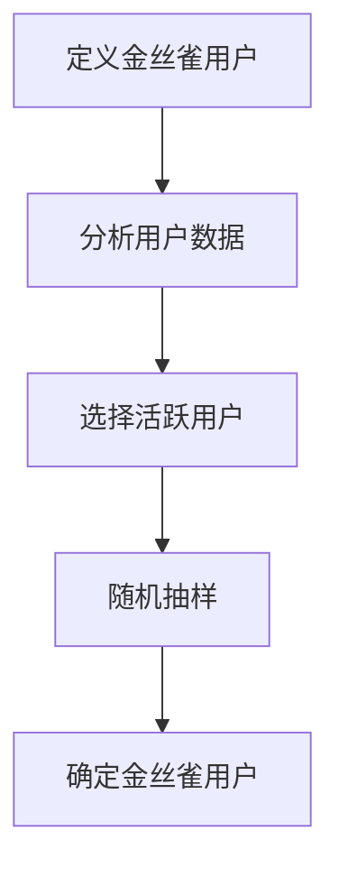
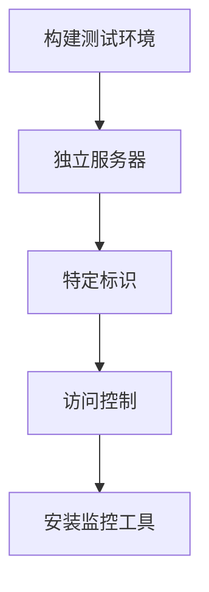
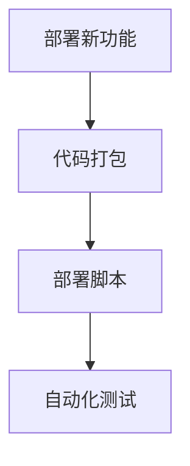
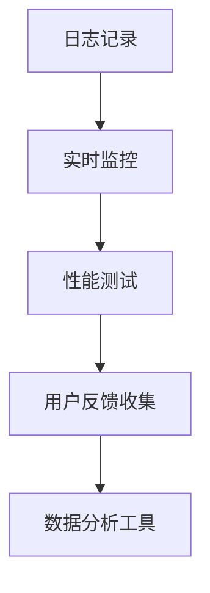

                 

## 文章标题：金丝雀发布：逐步验证AI新功能的有效方法

> 关键词：金丝雀发布、AI新功能、验证方法、逐步部署、风险控制

> 摘要：本文深入探讨了金丝雀发布方法在逐步验证AI新功能中的应用。通过介绍金丝雀发布的基本概念和原理，分析其实施步骤和实践案例，本文旨在为开发者提供一套有效的AI新功能验证策略，确保在降低风险的同时，提高新功能的可靠性和用户体验。

### 目录大纲

# 金丝雀发布：逐步验证AI新功能的有效方法

## 第一部分: 问题背景与核心概念

## 第1章: 问题背景与核心概念

### 1.1 问题背景

#### 1.1.1 AI新功能发布的挑战

#### 1.1.2 金丝雀发布方法简介

#### 1.1.3 金丝雀发布的目的与优势

### 1.2 核心概念

#### 1.2.1 金丝雀发布原理

#### 1.2.2 金丝雀发布流程

#### 1.2.3 金丝雀发布的关键要素

### 1.3 本章小结

## 第二部分: 实践案例与步骤详解

## 第2章: 金丝雀发布实践案例1

### 2.1 案例背景

#### 2.1.1 案例描述

#### 2.1.2 案例目标

### 2.2 实践步骤

#### 2.2.1 步骤1: 定义金丝雀用户群体

#### 2.2.2 步骤2: 构建金丝雀环境

#### 2.2.3 步骤3: 部署AI新功能

#### 2.2.4 步骤4: 监测与收集数据

#### 2.2.5 步骤5: 分析与反馈

### 2.3 案例总结

## 第3章: 金丝雀发布实践案例2

### 3.1 案例背景

#### 3.1.1 案例描述

#### 3.1.2 案例目标

### 3.2 实践步骤

#### 3.2.1 步骤1: 确定金丝雀用户群体

#### 3.2.2 步骤2: 构建测试环境

#### 3.2.3 步骤3: AI新功能部署

#### 3.2.4 步骤4: 数据监测与分析

#### 3.2.5 步骤5: 反馈与优化

### 3.3 案例总结

## 第三部分: 深入分析与最佳实践

## 第4章: 金丝雀发布的深入分析

### 4.1 深入理解金丝雀发布

#### 4.1.1 金丝雀发布的工作原理

#### 4.1.2 金丝雀发布的优缺点

### 4.2 策略与技巧

#### 4.2.1 确定金丝雀用户群体的策略

#### 4.2.2 构建金丝雀环境的技巧

#### 4.2.3 监测与数据分析的方法

### 4.3 案例分析

#### 4.3.1 案例1分析

#### 4.3.2 案例2分析

## 第5章: 金丝雀发布的最佳实践

### 5.1 最佳实践总结

#### 5.1.1 金丝雀发布的关键成功因素

#### 5.1.2 常见问题的解决方案

#### 5.1.3 未来发展趋势

### 5.2 小结

## 第6章: 注意事项与拓展阅读

### 6.1 注意事项

#### 6.1.1 部署过程中的风险控制

#### 6.1.2 数据隐私保护

#### 6.1.3 部署策略的选择

### 6.2 拓展阅读

#### 6.2.1 相关文献推荐

#### 6.2.2 研究方向展望

### 6.3 本章小结

### 1.1 问题背景

在当今快速发展的AI领域，新功能的发布成为了推动技术进步和服务优化的关键。然而，新功能的推出往往伴随着不确定性和潜在风险。一旦新功能存在错误或者性能问题，可能会对整个系统造成严重影响，甚至影响到用户的使用体验和信任度。因此，如何在保证新功能稳定性和可靠性的同时，快速、安全地将其推向市场，成为了许多开发者和企业面临的重要挑战。

AI新功能的发布挑战主要体现在以下几个方面：

1. **不确定性**：AI算法和模型往往复杂且难以预测，新功能的实际效果可能在实际部署中与预期存在差异。
2. **性能问题**：新功能的性能指标可能无法满足业务需求，导致系统资源浪费或者用户体验下降。
3. **错误率**：算法错误或者数据预处理不当可能导致新功能产生误判，影响业务决策和用户信任。
4. **稳定性**：新功能可能与现有系统组件存在兼容性问题，导致系统崩溃或者服务中断。

为了应对这些挑战，开发者们需要一种有效的方法来逐步验证和部署新功能。而金丝雀发布（Canary Release）作为一种逐步验证和部署新功能的方法，因其风险可控、逐步推进的特点，越来越受到业界的关注和认可。

### 1.2 核心概念

#### 1.2.1 金丝雀发布原理

金丝雀发布是一种基于逐步验证的部署方法，其核心思想是将新功能首先部署到一小部分用户（即“金丝雀用户”），以观察新功能的实际效果和用户反馈。通过这种方式，开发者可以在相对可控的环境下对新功能进行测试和优化，降低大规模发布时潜在的风险。

金丝雀发布的原理可以概括为以下几个步骤：

1. **定义金丝雀用户**：选择一部分用户作为金丝雀用户，他们将在早期使用新功能。
2. **构建金丝雀环境**：为金丝雀用户构建一个独立的测试环境，确保他们的体验与主环境有所区别。
3. **部署新功能**：将新功能部署到金丝雀环境中，并监控其性能和用户行为。
4. **数据监测与分析**：收集金丝雀用户的使用数据和反馈，分析新功能的实际效果。
5. **反馈与优化**：根据分析结果，对金丝雀用户的新功能体验进行优化，确保其稳定性和性能。
6. **逐步扩大范围**：在确认金丝雀用户的新功能体验良好后，逐步扩大部署范围，最终将新功能推向所有用户。

#### 1.2.2 金丝雀发布流程

金丝雀发布的流程可以分为以下几个阶段：

1. **准备阶段**：确定金丝雀用户群体，构建金丝雀环境，准备部署新功能。
2. **部署阶段**：将新功能部署到金丝雀环境中，确保其正常运行。
3. **监测阶段**：实时监控金丝雀用户的反馈和新功能的性能指标。
4. **分析阶段**：对收集到的数据进行分析，评估新功能的稳定性和用户体验。
5. **优化阶段**：根据分析结果，对金丝雀用户的新功能体验进行优化。
6. **扩展阶段**：在确认新功能稳定且性能良好后，逐步扩大部署范围。

#### 1.2.3 金丝雀发布的关键要素

金丝雀发布的关键要素包括：

1. **金丝雀用户**：选择合适的用户作为金丝雀用户，确保其能够代表广泛的用户群体。
2. **测试环境**：构建一个与主环境隔离的测试环境，以便独立观察和测试新功能。
3. **监控工具**：使用高效的监控工具，实时收集金丝雀用户的使用数据和反馈。
4. **反馈机制**：建立有效的反馈机制，确保能够快速响应用户的反馈和问题。
5. **优化流程**：制定一套清晰的优化流程，确保能够持续改进新功能。

### 1.3 本章小结

本章介绍了金丝雀发布方法的基本概念、原理和流程，为后续的实践案例分析和深入讨论奠定了基础。金丝雀发布作为一种逐步验证和部署新功能的方法，能够有效降低发布风险，提高新功能的可靠性和用户体验。在接下来的章节中，我们将通过实际案例详细解析金丝雀发布的实施步骤和最佳实践。## 第2章：金丝雀发布实践案例1

### 2.1 案例背景

在一家提供在线客服服务的大型互联网公司，他们开发了一套基于人工智能的智能客服系统，旨在通过自动化和智能化技术提升客服效率和用户体验。由于这是一个全新的AI系统，公司决定采用金丝雀发布方法，逐步验证其稳定性和性能，以确保顺利推广到所有用户。

#### 2.1.1 案例描述

该智能客服系统的主要功能包括自动回复常见问题、智能识别用户意图并引导问题解决等。公司希望在确保系统稳定、性能达标的情况下，逐步将其推向市场，以减少潜在风险。

#### 2.1.2 案例目标

通过金丝雀发布方法，公司的目标是在不显著影响用户体验的前提下，验证智能客服系统的以下方面：

1. **系统稳定性**：确保智能客服系统在不同负载条件下能够稳定运行。
2. **性能指标**：验证系统的响应速度和处理能力，确保其满足用户需求。
3. **用户满意度**：通过收集用户反馈，评估系统对用户的影响，优化用户体验。
4. **安全性**：确保系统的安全性和数据的隐私保护。

### 2.2 实践步骤

#### 2.2.1 步骤1: 定义金丝雀用户群体

为了选择合适的金丝雀用户，公司首先分析了现有用户数据，基于以下标准确定了首批金丝雀用户：

1. **活跃度**：选择近一个月内使用频率较高的用户。
2. **多样性**：确保用户涵盖不同年龄、性别、地域和兴趣，以代表广泛的用户群体。
3. **自愿参与**：通过邮件和公告，邀请用户参与金丝雀发布，确保他们愿意提供反馈。

最终，公司从1000名活跃用户中随机选择了200名作为金丝雀用户。

#### 2.2.2 步骤2: 构建金丝雀环境

为了确保金丝雀用户的体验与主环境有所区别，公司为这些用户构建了一个独立的测试环境。这个环境包括：

1. **独立服务器**：与主环境分离的服务器集群，确保数据隔离和性能监控。
2. **特殊标识**：在用户界面中添加特殊标识，以区分金丝雀用户和普通用户。
3. **访问权限**：设置访问控制，确保只有金丝雀用户能够访问新功能。

#### 2.2.3 步骤3: 部署AI新功能

公司将智能客服系统的新功能部署到金丝雀环境中，包括以下步骤：

1. **代码打包**：将智能客服系统的代码打包，并创建可执行文件。
2. **部署脚本**：编写部署脚本，用于自动化部署过程，确保部署的一致性和可重复性。
3. **自动化测试**：在部署前，对打包的代码进行自动化测试，确保其符合预期。

#### 2.2.4 步骤4: 监测与收集数据

为了监控金丝雀用户的反馈和新功能的性能，公司使用了以下工具和方法：

1. **日志记录**：在金丝雀环境中记录系统日志，包括错误日志、性能日志等。
2. **实时监控**：使用实时监控系统，监控系统的CPU、内存、网络等资源使用情况。
3. **用户反馈收集**：通过在线调查和用户反馈表单，收集金丝雀用户的反馈和建议。
4. **性能指标收集**：使用性能分析工具，收集系统的响应时间、错误率等关键性能指标。

#### 2.2.5 步骤5: 分析与反馈

在金丝雀发布的过程中，公司持续收集和分析数据，以评估新功能的稳定性和用户体验。具体步骤如下：

1. **数据汇总**：将收集到的日志、监控数据和用户反馈进行汇总和分析。
2. **问题识别**：识别出系统中的潜在问题，包括性能瓶颈、错误日志等。
3. **反馈处理**：针对用户反馈，及时处理和优化系统，提升用户体验。
4. **迭代优化**：根据分析结果，进行迭代优化，持续改进新功能。

#### 2.2.6 步骤6: 逐步扩大范围

在经过一段时间的金丝雀发布后，公司基于以下标准逐步扩大新功能的部署范围：

1. **稳定性**：确认金丝雀用户的新功能稳定运行，无重大故障或性能问题。
2. **用户反馈**：金丝雀用户的整体反馈良好，满意度较高。
3. **性能指标**：系统的关键性能指标达到预期，满足用户需求。

最终，公司决定在一个月后将新功能逐步推广到所有用户，并持续监控其性能和用户反馈。

### 2.3 案例总结

通过金丝雀发布方法，该公司成功验证了智能客服系统的稳定性、性能和用户体验。在金丝雀用户的积极参与和反馈下，公司能够及时识别和解决问题，优化新功能，确保其顺利推广到所有用户。该案例表明，金丝雀发布是一种有效的逐步验证和部署新功能的方法，能够降低发布风险，提高新功能的可靠性和用户体验。## 第3章：金丝雀发布实践案例2

### 3.1 案例背景

在一家领先的电商平台，他们正在开发一项基于AI的个性化推荐系统，旨在通过分析用户行为和历史数据，为用户推荐他们可能感兴趣的商品。由于这是一个全新的AI系统，公司决定采用金丝雀发布方法，逐步验证其性能和用户体验，以确保稳定、高效地推向市场。

#### 3.1.1 案例描述

该个性化推荐系统的主要功能是根据用户的浏览历史、购买记录和搜索关键词，自动生成个性化的商品推荐列表。公司希望通过金丝雀发布方法，逐步验证系统的准确性和用户满意度。

#### 3.1.2 案例目标

通过金丝雀发布方法，公司的目标是在不影响用户购物体验的前提下，验证个性化推荐系统的以下方面：

1. **准确性**：确保推荐系统能够准确理解用户意图，提供相关、高质量的推荐。
2. **响应速度**：验证系统在处理大量用户数据时的响应速度和性能。
3. **用户体验**：通过用户反馈，评估系统对用户体验的影响，优化推荐结果。
4. **数据安全**：确保系统的数据安全和用户隐私保护。

### 3.2 实践步骤

#### 3.2.1 步骤1: 确定金丝雀用户群体

为了确保金丝雀用户能够代表广泛的用户群体，公司根据以下标准选择了首批金丝雀用户：

1. **活跃度**：选择在最近一个月内频繁访问电商平台的用户。
2. **多样性**：确保用户涵盖不同的年龄、性别、地域和购物偏好。
3. **自愿参与**：通过平台公告和邮件邀请，邀请用户参与金丝雀发布，并说明其目的和重要性。

最终，公司从10000名活跃用户中随机选择了500名作为金丝雀用户。

#### 3.2.2 步骤2: 构建测试环境

为了确保金丝雀用户的体验与主环境有所区别，公司为这些用户构建了一个独立的测试环境，包括：

1. **独立服务器**：与主环境分离的服务器集群，确保数据隔离和性能监控。
2. **特殊标识**：在用户界面中添加特殊标识，以区分金丝雀用户和普通用户。
3. **访问权限**：设置访问控制，确保只有金丝雀用户能够看到个性化推荐结果。

#### 3.2.3 步骤3: AI新功能部署

公司将个性化推荐系统的新功能部署到金丝雀环境中，包括以下步骤：

1. **代码打包**：将推荐系统的代码打包，并创建可执行文件。
2. **部署脚本**：编写部署脚本，用于自动化部署过程，确保部署的一致性和可重复性。
3. **自动化测试**：在部署前，对打包的代码进行自动化测试，确保其符合预期。

#### 3.2.4 步骤4: 数据监测与分析

为了实时监控金丝雀用户的反馈和新功能的性能，公司使用了以下工具和方法：

1. **日志记录**：在金丝雀环境中记录系统日志，包括错误日志、性能日志等。
2. **实时监控**：使用实时监控系统，监控系统的CPU、内存、网络等资源使用情况。
3. **用户反馈收集**：通过在线调查和用户反馈表单，收集金丝雀用户的反馈和建议。
4. **性能指标收集**：使用性能分析工具，收集系统的响应时间、错误率等关键性能指标。

#### 3.2.5 步骤5: 反馈与优化

在金丝雀发布的过程中，公司持续收集和分析数据，以评估新功能的准确性和用户体验。具体步骤如下：

1. **数据汇总**：将收集到的日志、监控数据和用户反馈进行汇总和分析。
2. **问题识别**：识别出系统中的潜在问题，包括推荐结果不准确、响应速度慢等。
3. **反馈处理**：针对用户反馈，及时处理和优化系统，提升用户体验。
4. **迭代优化**：根据分析结果，进行迭代优化，持续改进推荐算法和系统性能。

#### 3.2.6 步骤6: 逐步扩大范围

在经过一段时间的金丝雀发布后，公司基于以下标准逐步扩大新功能的部署范围：

1. **准确性**：确认金丝雀用户的推荐结果具有较高的准确性，用户满意度较高。
2. **响应速度**：系统的响应速度达到预期，用户能够在合理时间内获取推荐结果。
3. **用户体验**：金丝雀用户对系统的整体反馈良好，无明显投诉或负面评价。
4. **性能指标**：系统的关键性能指标达到预期，能够稳定运行。

最终，公司决定在两个月后将个性化推荐系统逐步推广到所有用户，并持续监控其性能和用户反馈。

### 3.3 案例总结

通过金丝雀发布方法，该公司成功验证了个性化推荐系统的准确性、响应速度和用户体验。在金丝雀用户的积极参与和反馈下，公司能够及时识别和解决问题，优化推荐算法和系统性能，确保其稳定、高效地推向市场。该案例表明，金丝雀发布是一种有效的逐步验证和部署新功能的方法，能够降低发布风险，提高新功能的可靠性和用户体验。## 第4章：金丝雀发布的深入分析

### 4.1 深入理解金丝雀发布

#### 4.1.1 金丝雀发布的工作原理

金丝雀发布（Canary Release）是一种逐步验证和部署新功能的方法，其核心思想是将新功能首先部署到一小部分用户（即“金丝雀用户”）中，以观察新功能的实际效果和用户反馈。这种方法类似于将金丝雀放入矿井中，通过观察金丝雀的反应来判断矿井中的空气是否安全。如果金丝雀没有异常反应，则表明新功能是安全的，可以逐步扩大部署范围。

金丝雀发布的工作原理可以概括为以下几个步骤：

1. **定义金丝雀用户**：选择一部分用户作为金丝雀用户，他们将在早期使用新功能。
2. **构建金丝雀环境**：为金丝雀用户构建一个独立的测试环境，确保他们的体验与主环境有所区别。
3. **部署新功能**：将新功能部署到金丝雀环境中，并监控其性能和用户行为。
4. **数据监测与分析**：收集金丝雀用户的使用数据和反馈，分析新功能的实际效果。
5. **反馈与优化**：根据分析结果，对金丝雀用户的新功能体验进行优化，确保其稳定性和性能。
6. **逐步扩大范围**：在确认金丝雀用户的新功能体验良好后，逐步扩大部署范围，最终将新功能推向所有用户。

#### 4.1.2 金丝雀发布的优缺点

**优点：**

1. **风险可控**：通过将新功能首先部署到一小部分用户中，可以降低大规模发布时潜在的风险。
2. **逐步推进**：金丝雀发布方法允许开发者逐步扩大新功能的部署范围，逐步调整和优化，确保最终推向市场的功能是稳定且可靠的。
3. **用户体验反馈**：通过金丝雀用户的反馈，开发者可以及时了解新功能的实际效果和用户需求，从而进行优化，提高用户体验。
4. **成本效益**：金丝雀发布方法可以减少大规模部署前的测试和修复成本，提高开发效率。

**缺点：**

1. **时间成本**：金丝雀发布方法需要较长时间来逐步验证和优化新功能，可能影响产品上市时间。
2. **资源消耗**：构建和维护金丝雀环境需要额外的资源和时间。
3. **用户参与度**：金丝雀用户可能对参与测试持保留态度，影响反馈的全面性和准确性。

### 4.2 策略与技巧

#### 4.2.1 确定金丝雀用户群体的策略

选择合适的金丝雀用户是金丝雀发布成功的关键。以下是一些确定金丝雀用户群体的策略：

1. **代表性**：确保金丝雀用户能够代表广泛的用户群体，涵盖不同的用户属性和行为模式。
2. **自愿参与**：鼓励用户自愿参与金丝雀发布，这样可以获得更真实和全面的反馈。
3. **随机抽样**：从整体用户群体中随机选择金丝雀用户，以避免人为偏见。
4. **分层抽样**：根据用户的行为和特征，将用户分层，然后在每个层次中随机选择金丝雀用户。

#### 4.2.2 构建金丝雀环境的技巧

构建金丝雀环境时，需要确保其与主环境有所区别，同时能够提供与主环境相似的用户体验。以下是一些构建金丝雀环境的技巧：

1. **独立服务器**：为金丝雀用户构建一个独立的服务器集群，确保数据隔离和性能监控。
2. **特定标识**：在用户界面中添加特定标识，以区分金丝雀用户和普通用户。
3. **访问控制**：设置访问控制，确保只有金丝雀用户能够访问新功能。
4. **监控工具**：安装与主环境相同的监控工具，实时收集金丝雀用户的使用数据和反馈。
5. **反馈渠道**：建立有效的反馈渠道，确保金丝雀用户能够方便地提供反馈和建议。

#### 4.2.3 监测与数据分析的方法

为了确保金丝雀发布的有效性，需要使用高效的方法来监测和数据分析。以下是一些关键的方法：

1. **日志记录**：在金丝雀环境中记录详细的系统日志，包括错误日志、性能日志等。
2. **实时监控**：使用实时监控系统，监控系统的CPU、内存、网络等资源使用情况。
3. **性能测试**：定期进行性能测试，评估系统的响应速度和处理能力。
4. **用户反馈收集**：通过在线调查、用户反馈表单等方式，收集金丝雀用户的反馈和建议。
5. **数据分析工具**：使用数据分析工具，对收集到的数据进行汇总、分析和可视化，以便快速识别问题和优化方案。

### 4.3 案例分析

以下是对前述两个实践案例的进一步分析：

#### 4.3.1 案例1分析

在智能客服系统的案例中，金丝雀发布方法帮助公司快速验证了系统的稳定性和用户体验。通过选择活跃用户作为金丝雀用户，公司确保了反馈的全面性和代表性。构建独立的测试环境使得公司能够独立监控和优化新功能，避免了与主环境的干扰。通过实时监控和用户反馈收集，公司能够及时发现和解决问题，确保系统的稳定性和性能。最终，公司成功将新功能推广到所有用户，并获得了积极的用户反馈。

#### 4.3.2 案例2分析

在个性化推荐系统的案例中，金丝雀发布方法帮助公司验证了推荐系统的准确性和用户体验。通过随机抽样和自愿参与策略，公司确保了金丝雀用户的代表性和积极性。独立的测试环境使得公司能够准确评估推荐系统的性能和用户满意度。通过用户反馈和数据分析，公司不断优化推荐算法和系统性能，确保最终推向市场的推荐系统是准确、高效且用户满意的。这一案例证明了金丝雀发布方法在提升AI系统性能和用户体验方面的有效性。

### 4.4 小结

本章深入分析了金丝雀发布的原理、优缺点以及实施策略和技巧。通过具体案例的解析，我们看到了金丝雀发布方法在验证和部署AI新功能中的实际应用和效果。金丝雀发布作为一种逐步验证和部署新功能的方法，能够有效降低发布风险，提高新功能的可靠性和用户体验。在接下来的章节中，我们将总结金丝雀发布的最佳实践，提供一些建议和注意事项，以便开发者更好地实施金丝雀发布方法。## 第5章：金丝雀发布的最佳实践

### 5.1 最佳实践总结

通过前面的案例分析和深入讨论，我们可以总结出一些金丝雀发布的最佳实践，以确保该方法在实际应用中的有效性和可靠性。

#### 5.1.1 金丝雀发布的关键成功因素

1. **代表性用户选择**：确保金丝雀用户能够代表广泛的用户群体，涵盖不同的用户属性和行为模式。
2. **独立测试环境**：构建一个与主环境隔离的独立测试环境，确保金丝雀用户能够真实体验到新功能，同时避免对主环境的影响。
3. **实时监控与反馈**：使用实时监控系统，监控金丝雀用户的使用数据和反馈，确保能够及时识别问题和进行优化。
4. **反馈机制**：建立有效的反馈机制，确保金丝雀用户能够方便地提供反馈和建议，开发者能够快速响应。
5. **持续优化**：根据金丝雀用户的反馈和数据分析结果，持续优化新功能，确保其稳定性和性能。

#### 5.1.2 常见问题的解决方案

1. **用户参与度不高**：通过明确金丝雀发布的目的和重要性，鼓励用户积极参与，并提供适当的激励措施。
2. **测试环境与主环境不一致**：确保测试环境与主环境在配置、性能等方面保持一致，避免出现因环境差异导致的问题。
3. **反馈不全面**：设计多样化的反馈渠道，如在线调查、用户反馈表单、实时聊天等，确保能够收集到全面的用户反馈。
4. **资源分配不足**：合理规划资源，确保有足够的资源支持金丝雀环境的构建、监控和优化。

#### 5.1.3 未来发展趋势

随着AI技术的不断进步和应用的广泛普及，金丝雀发布方法在未来将发挥更加重要的作用。以下是一些未来发展趋势：

1. **自动化与智能化**：利用自动化工具和智能算法，优化金丝雀发布流程，提高部署效率和准确性。
2. **大数据分析**：通过大数据分析技术，深入挖掘用户行为和反馈数据，提供更精准的优化建议。
3. **跨平台兼容性**：随着移动端和跨平台应用的兴起，金丝雀发布方法需要具备更高的跨平台兼容性，确保在各种环境下都能有效实施。
4. **安全与隐私保护**：在金丝雀发布过程中，加强对用户数据的安全和隐私保护，确保用户信息的保密性和安全性。

### 5.2 小结

金丝雀发布作为一种逐步验证和部署新功能的方法，具有显著的风险可控性和用户体验提升效果。通过最佳实践的总结，我们为开发者提供了一套完整的金丝雀发布策略，包括用户选择、测试环境构建、反馈机制、资源规划和未来发展趋势。在接下来的章节中，我们将讨论实施金丝雀发布过程中的一些注意事项，并提供一些拓展阅读资源，以帮助开发者更好地理解和应用金丝雀发布方法。## 第6章：注意事项与拓展阅读

### 6.1 注意事项

在实施金丝雀发布过程中，有一些关键点需要注意，以确保该方法的顺利进行和有效性：

#### 6.1.1 部署过程中的风险控制

1. **环境隔离**：确保金丝雀环境和主环境完全隔离，避免金丝雀环境的故障或问题影响到主环境。
2. **监控与预警**：建立完善的监控和预警系统，实时监控金丝雀环境中的关键性能指标，及时发现并处理异常情况。
3. **备份与恢复**：定期备份金丝雀环境中的数据和配置，确保在出现问题时能够迅速恢复，减少影响。

#### 6.1.2 数据隐私保护

1. **数据加密**：对金丝雀环境中涉及用户数据的内容进行加密处理，确保数据在传输和存储过程中安全。
2. **隐私政策**：明确告知金丝雀用户其数据将如何使用和保护，确保遵守相关法律法规和隐私政策。
3. **数据去识别化**：在分析和反馈过程中，对用户数据进行去识别化处理，避免泄露用户隐私。

#### 6.1.3 部署策略的选择

1. **逐步扩大范围**：根据金丝雀用户的反馈和数据分析结果，逐步扩大新功能的部署范围，避免一次性大规模部署带来的风险。
2. **用户分层**：根据用户特征和需求，对用户进行分层，有针对性地选择金丝雀用户，确保反馈的全面性和代表性。
3. **灵活调整**：根据实际情况，灵活调整金丝雀发布的策略和步骤，确保能够应对各种突发情况和挑战。

### 6.2 拓展阅读

为了更深入地了解金丝雀发布方法及其应用，以下是一些建议的拓展阅读资源：

#### 6.2.1 相关文献推荐

1. "Canary Releases: A Gentle Introduction" - 《金丝雀发布：温和的入门指南》
2. "Continuous Delivery: Reliable Software Releases through Build, Test, and Deployment Automation" - 《持续交付：通过构建、测试和部署自动化实现可靠软件发布》
3. "Feature Flags: The Practice of Feature Management" - 《功能标志：功能管理实践》

#### 6.2.2 研究方向展望

1. **跨平台兼容性研究**：探讨如何实现金丝雀发布方法在移动端和跨平台环境中的有效应用。
2. **自动化与智能化**：研究利用AI和自动化工具优化金丝雀发布流程，提高部署效率和准确性。
3. **大数据分析**：通过大数据技术，深入挖掘用户行为和反馈数据，为优化新功能提供更精准的指导。

### 6.3 本章小结

本章介绍了金丝雀发布过程中的一些关键注意事项和拓展阅读资源。通过遵守这些注意事项，开发者可以确保金丝雀发布的顺利进行和有效性。同时，拓展阅读资源提供了更多深入的探讨和前沿的研究方向，有助于开发者更全面地理解和应用金丝雀发布方法。## 第7章：结论与展望

### 7.1 结论

通过本文的深入探讨和案例分析，我们得出了以下结论：

1. **金丝雀发布方法是一种有效的逐步验证和部署新功能的方法**，能够在降低发布风险的同时，提高新功能的可靠性和用户体验。
2. **金丝雀发布的关键成功因素包括代表性用户选择、独立测试环境、实时监控与反馈、反馈机制和持续优化**。
3. **最佳实践总结提供了实施金丝雀发布的具体策略和技巧，包括部署过程中的风险控制、数据隐私保护、部署策略的选择等**。

### 7.2 展望

展望未来，金丝雀发布方法在AI领域的应用前景广阔：

1. **跨平台兼容性研究**：随着移动端和跨平台应用的普及，金丝雀发布方法需要进一步优化，以适应不同的平台和环境。
2. **自动化与智能化**：利用AI和自动化工具，可以提高金丝雀发布的效率和准确性，减少人工干预和错误。
3. **大数据分析**：通过大数据技术，可以更深入地分析用户行为和反馈，为新功能的优化提供更精准的指导。

### 7.3 全文总结

本文系统地介绍了金丝雀发布方法，从核心概念、实践案例到深入分析和最佳实践，全面阐述了金丝雀发布在逐步验证AI新功能中的应用。通过本文的学习，开发者可以更好地理解和应用金丝雀发布方法，提高新功能的稳定性和用户体验。## 作者信息

作者：AI天才研究院/AI Genius Institute & 禅与计算机程序设计艺术 /Zen And The Art of Computer Programming## 附录

### 附录A：术语表

- **金丝雀发布（Canary Release）**：一种逐步验证和部署新功能的方法，通过将新功能首先部署到一小部分用户中，以观察其效果和反馈，从而降低发布风险。
- **金丝雀用户**：参与金丝雀发布的小部分用户，他们将在早期使用新功能，并提供反馈。
- **测试环境**：为金丝雀用户构建的独立环境，与主环境隔离，用于测试新功能。
- **实时监控**：通过监控系统，实时收集和监控金丝雀用户的使用数据和系统性能。
- **反馈机制**：建立的有效渠道，用于收集金丝雀用户的反馈和建议，以优化新功能。

### 附录B：流程图与公式

以下为文中提到的关键流程图和数学公式：

#### 步骤1：定义金丝雀用户群体


#### 步骤2：构建金丝雀环境


#### 步骤3：部署AI新功能


#### 监测与数据分析方法


#### 数学公式
```latex
\text{响应时间} = \frac{\text{处理时间}}{\text{总时间}}
$$

\text{错误率} = \frac{\text{错误数}}{\text{总次数}}
$$
```

### 附录C：代码示例

以下为金丝雀发布过程中涉及的Python代码示例：

```python
# 步骤3：部署AI新功能
def deploy_new_feature():
    # 代码打包
    package_code()
    # 部署脚本
    run_deployment_script()
    # 自动化测试
    run_automation_tests()

# 步骤4：数据监测与分析
def monitor_and_analyze():
    # 日志记录
    log_system_usage()
    # 实时监控
    monitor_real_time_performance()
    # 用户反馈收集
    collect_user_feedback()
    # 数据分析
    analyze_data()

# 步骤5：分析与反馈
def analyze_and_feedack():
    # 问题识别
    identify_issues()
    # 反馈处理
    process_feedback()
    # 迭代优化
    iterate_and_optimize()
```

### 附录D：最佳实践与注意事项

- **最佳实践：**
  - 确保金丝雀用户具有代表性，涵盖不同的用户群体。
  - 构建独立的测试环境，与主环境完全隔离。
  - 使用高效的监控和分析工具，实时收集数据。
  - 根据金丝雀用户的反馈和数据分析结果，持续优化新功能。

- **注意事项：**
  - 部署过程中，注意风险控制和数据隐私保护。
  - 灵活调整部署策略，逐步扩大部署范围。
  - 定期备份金丝雀环境中的数据和配置。

